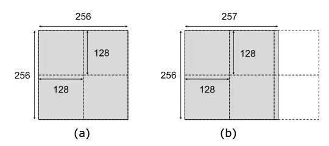
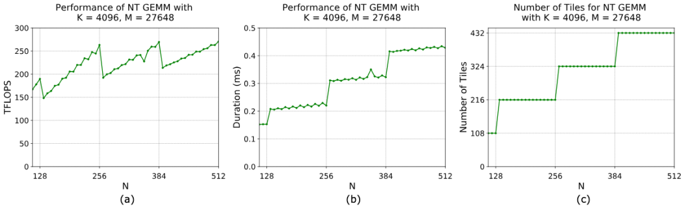
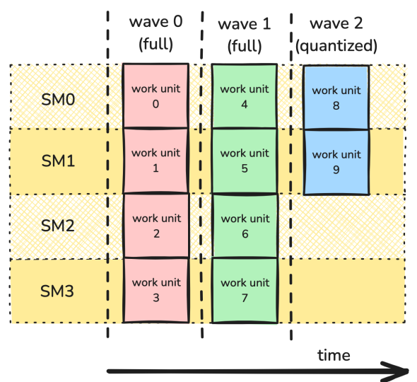
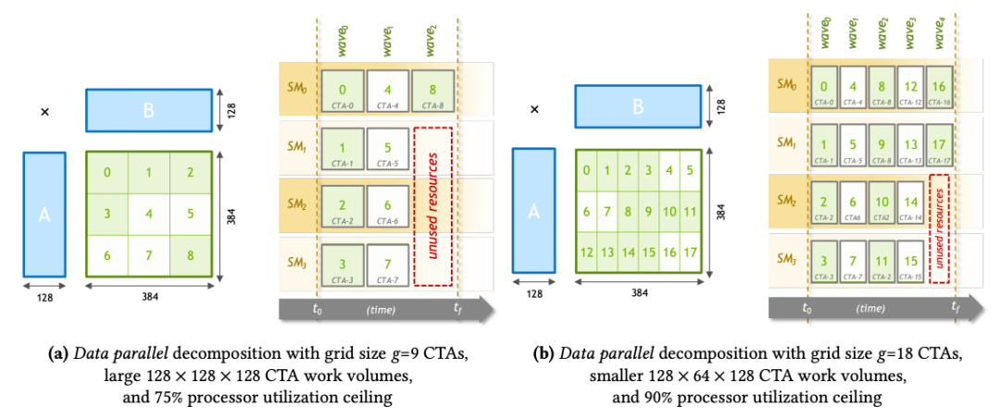
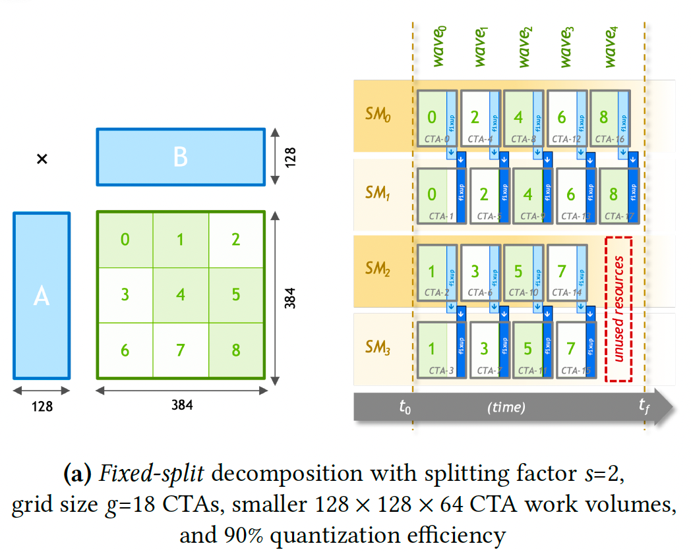
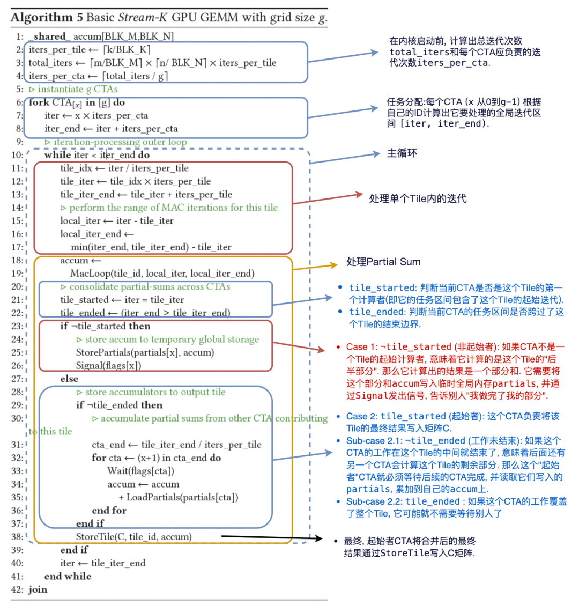
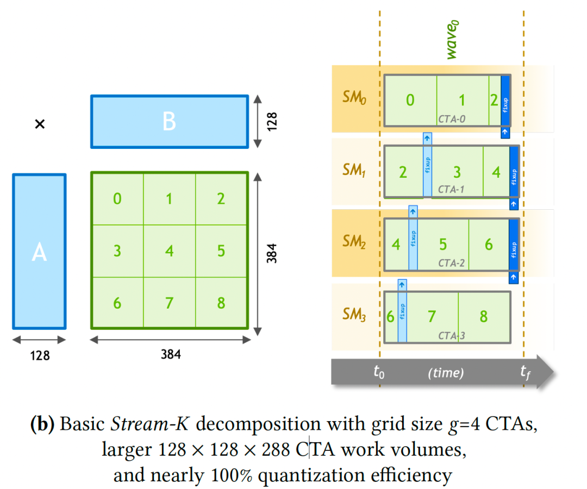
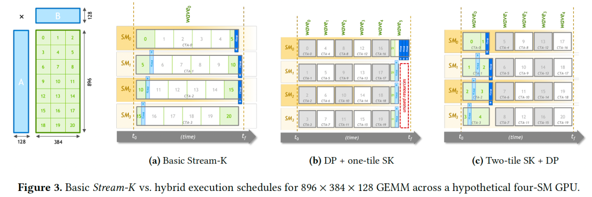
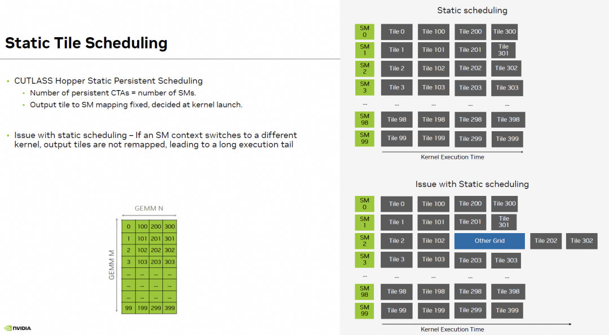

# Tensor-103.3 Hopper Persistent Kernel

- 원문 제목: Tensor-103.3 Hopper Persistent Kernel
- 저자: Tilebot
- 계정: zartbot
- 발행일: 2025년 10월 27일 22:11

### TL;DR

이 글은 Hopper GEMM에 대한 보충이며, 전체 grid 관점에서 두 가지 optimization을 더 다룬다. 앞 글에서는 CTA Swizzle로 L2 cache hit rate를 높이는 방법을 소개했다. 이번 글에서는 주로 Persistent Kernel을 소개한다. task를 각 CTA에 더 잘 schedule하여 compute resource를 충분히 활용하고 좋은 load balancing을 구현하는 방법이다. "CUTLASS Tutorial: Persistent Kernels and Stream-K"[1]에 매우 자세한 소개가 있지만, 이 글에서는 CuteDSL을 사용해 자세히 펼쳐 본다. 이 글의 목차는 다음과 같다.

```
1. Tile & Wave Quantization 문제
1.1 Tile Quantization
1.2 Wave Quantization
2. Stream-K
2.1 Quantization inefficiency를 해결하는 전통적인 방법
2.2 Split-K decomposition algorithm
2.3 Stream-K decomposition algorithm
2.4 Hybrid Stream-K
3. Persistent Kernel
3.1 Host function
3.1.1 Tile scheduling abstraction
3.2 Kernel function
3.2.1 Initialization
3.2.2 Persistent Main Loop
3.2.2.1 DMA Warp
3.2.2.2 MMA Warp
3.2.3 Epilogue
```

## 1. Tile & Wave Quantization 문제

"Matrix Multiplication Background User's Guide"[2]에는 이 문제에 대한 자세한 설명이 있다.

| 특성 | Tile Quantization | Wave Quantization |
| --- | --- | --- |
| level | microscopic (single thread block 내부) | macroscopic (전체 GPU level) |
| quantization unit | Tile size (예: 128x128) | Wave size (예: 132개 Tile) |
| waste source | thread block 내부 일부 thread의 invalid computation | tail wave 동안 전체 SM의 idle |
| impact scope | 주로 edge Tile에 영향 | 전체 Kernel execution time에 영향 |
| chart period | performance가 dimension에 따라 Tile size를 period로 fluctuation | performance가 total Tile count에 따라 Wave size를 period로 fluctuation |

### 1.1 Tile Quantization

모든 output matrix element를 cover하기 위해, GPU가 CTA를 launch할 때 사용하는 Tile count는 ceil로 올림된다. matrix dimension이 CTA의 Tile Size로 나누어떨어지지 않으면 Tile Quantization effect가 발생한다. 아래 그림과 같다.



algorithm상으로는 0.39%의 operation만 더 필요하지만, 실제로 execute되는 arithmetic operation 수는 왼쪽 그림의 1.5배이다. 이는 output matrix dimension이 Tile dimension으로 나누어떨어질 때에만 최고 utilization에 도달할 수 있음을 보여준다.

이 effect를 더 설명하기 위해 GEMM example을 보자. `M = 27648`, `K = 4096`이고 library function은 fixed 256x128 Tile을 사용한다. step 8로 N을 136에서 256까지 늘릴 때, Tensor Core accelerated GEMM은 항상 같은 수의 Tile column을 run한다. 즉 N dimension은 항상 2개 Tile로 나뉜다. Tile count는 변하지 않지만, 이 Tile들에 포함된 valid data 비율은 N 증가에 따라 커지며, 이는 아래 왼쪽 그림의 GFLOPS에도 반영된다. `N = 128`(이때 각 row의 Tile 하나가 valid data로 완전히 채워짐)과 `N = 136`(이때 각 row가 두 번째 Tile로 증가하지만 그중 8/128 = 6.25%만 valid data임) 사이에서 throughput이 크게 하락한다는 점에 주의하자. 동시에 Tile count가 변하지 않는 한 execution time(duration)도 constant임에 주의하자.



하나의 dimension이 점차 증가할 때 performance curve는 sawtooth shape를 보인다.

- **Drop:** dimension이 막 Tile size의 multiple을 초과하면 performance가 급락한다.
- **Rise:** dimension이 계속 증가하면 data가 새 Tile의 "blank area"를 채우고 valid work ratio가 증가하여 throughput이 linearly recover된다.
- **Peak:** dimension이 다시 Tile size의 integer multiple에 도달하면 performance가 local peak에 도달한다.

보통 이런 문제를 해결하기 위해 original matrix Shape에 따라 약간 더 작은 Tile Shape를 dynamically 선택하거나, algorithm상에서 matrix dimension을 Tile dimension에 align해야 한다.

### 1.2 Wave Quantization

Nvidia GPU는 여러 SM으로 구성되며, 각 SM은 independent SMEM/RMEM/TensorCore 등 hardware resource를 가지고 독립적으로 run한다. ideal case에서는 load가 각 SM에 균등하게 distribute되어 parallel execution되고, 전체 Kernel execution 동안 모든 SM이 busy state를 유지한다. 하지만 load imbalance가 발생하면 일부 SM에 할당된 task가 적어 먼저 완료되고, 그 결과 resource가 idle 상태가 되어 다른 SM의 completion을 기다리게 된다.

GEMM을 예로 들면, 보통 각 SM은 work unit 하나로 bM x bN Tile operation 하나를 담당한다. 이러한 work unit은 CTA에 할당되고, 각 CTA는 available SM에서 computation을 완료한다. work unit 수가 available SM 수를 초과하면 이러한 work unit은 batch 단위로 처리되며, 각 batch를 wave라고 부른다. 즉 각 available SM이 work unit 하나씩 완료하면 full wave를 구성한다. total Tile count가 GPU의 SM count로 나누어떨어지지 않으면 처리 완료를 위해 추가 wave가 필요하다.

그림처럼 work unit이 10개이고 4개 SM만 처리한다고 가정하면, 마지막 wave에서는 SM의 절반만 occupied된다.



예를 하나 보자. `K=4096`이지만 더 작은 `M=2304`를 사용하고 N dimension을 바꾼다. NVIDIA A100 GPU 하나에는 108개 SM이 있다. 256x128 Tile을 사용하는 특정 case에서는 각 SM이 thread block 하나를 execute할 수 있으므로, wave size는 동시에 execute 가능한 108개 Tile이다. 따라서 total Tile count가 108의 integer multiple이거나 그보다 약간 낮을 때 GPU utilization이 가장 높다.

이 example에서 M dimension(`M=2304`)은 항상 `2304 / 256 = 9` row Tile로 나뉜다. performance jump point:

- **N=1536:** `N dimension Tile count = 1536/128 = 12`. total Tile count = `9 * 12 = 108` (1 full wave). performance peak.
- **N=3072:** `N dimension Tile count = 3072/128 = 24`. total Tile count = `9 * 24 = 216` (2 full waves). performance peak.
- **N=4608:** `N dimension Tile count = 4608/128 = 36`. total Tile count = `9 * 36 = 324` (3 full waves). performance peak.
- **N=6144:** `N dimension Tile count = 6144/128 = 48`. total Tile count = `9 * 48 = 432` (4 full waves). performance peak.
- 각 peak point 이후 N이 조금만 증가해도(예: 1536에서 1544) utilization이 매우 낮은 tail wave가 도입되어 performance가 급락한다.

## 2. Stream-K

Wave quantization 문제를 해결하려면 더 좋은 partitioning과 scheduling scheme을 만들어야 한다.
먼저 "Stream-K: Work-centric Parallel Decomposition for Dense Matrix-Matrix Multiplication on the GPU"[3] algorithm을 분석해 보자.

이 paper는 GPU에서 GEMM 및 related computation을 efficient하게 execute하기 위한 Stream-K라는 새로운 parallel decomposition strategy를 제안했다. 현재 mainstream인 "Tile" 기반 data-parallel decomposition method와 달리, Stream-K는 "work-centric"한 사고방식을 사용한다. 전체 matrix multiplication에 필요한 모든 Multiply-Accumulate(MAC) loop iteration count를 total work로 보고, 이 total work를 GPU의 physical processing unit(SM)에 균등하게 나눈다.

### 2.1 Quantization inefficiency를 해결하는 전통적인 방법

앞 장에서 소개했듯이, 전통적인 data-parallel processing 방식은 matrix block을 여러 processor에 배치해 parallel run하는 algorithm이다. processor core 수가 많아질수록, 이런 data-parallel decomposition 방식은 다양한 matrix Shape을 처리할 때 task block(output Tile) 수가 processor core 수로 나누어떨어지지 않아 마지막 "wave" compute task에서 일부 core가 idle 상태가 되고, 그 결과 overall utilization이 낮아진다. 이것이 quantization inefficiency 문제이다.

output Tile 수가 SM 수를 훨씬 초과하면 각 SM은 Oversubscription state에 있고, task가 완료되면 새로운 task로 빠르게 채워져 높은 utilization을 유지한다. 하지만 modern GPU의 SM 수가 점점 많아지면서 수백 개 Tile이 parallel operation되더라도 몇 wave만으로 완료된다. 이렇게 마지막 wave가 full load가 아닌 데 따른 performance impact가 크게 증가한다. simplified problem을 보자. 아래 왼쪽 그림처럼 output Tile이 9개이고 전체가 4개 SM뿐이라면 마지막 wave는 compute power의 3/4을 낭비한다.



위 오른쪽 그림처럼 한 가지 방법이 있다. 더 높은 SM utilization과 load imbalance 영향 감소를 위해 Tile을 더 작게 split하고, 여러 wave를 구성해 load imbalance 영향을 줄일 수 있다. 즉 ensemble of tiling configurations 방법이다. 왼쪽 그림의 128x128 Tile size를 절반인 128x64로 줄일 수 있다. total Tile count는 18개이고 4개 SM에서 5개 wave로 operation하므로 theoretical utilization upper bound는 18 / (5 wave * 4 SM) = 90%이다.

따라서 computation library는 ideal blocking factor가 잘 quantize되지 않을 때 alternative tiling scheme 중 더 작은 concurrent workload를 갖는 것을 선택한다. 하지만 이렇게 하면 computation library의 code size가 bloating된다. 특정 API에 대해 각 GPU architecture마다 수십 개의 precompiled kernel specialization을 제공해야 할 수 있기 때문이다. 또한 각 new GPU architecture마다 거대한 kernel set을 maintain하고 tune하는 것은 큰 engineering challenge이다. 다른 한편 heuristic search algorithm에도 limitation이 있다. GEMM performance space는 매우 complex하고 non-convex이다. arbitrary (m, n, k) combination 및 transpose case에 대해 항상 맞는 kernel을 선택하는 heuristic rule을 design하는 것은 거의 불가능한 task이다.

그다음 저자는 paper의 Chapter 2 Background에서 전체 GEMM optimization evolution process를 소개했고, 대략 다섯 stage로 나눌 수 있다.

1. **Graphics API era**: Larsen과 McAllister의 work는 GPGPU concept의 dawn 시기에 matrix data를 texture로 저장하고, pixel shader의 texture sampling 및 color blending hardware(본질적으로 multiply-add operation)를 이용해 matrix multiplication을 simulate한 것을 대표한다. fixed graphics rendering pipeline을 clever하게 활용해 computation task를 완료했다.
2. **CUDA+SMEM era**: CUDA의 탄생은 watershed였다. programmable SMEM이 핵심이다. 이는 programmer가 수동으로 관리하는 memory로, GMEM보다 훨씬 빠르다. 이로 인해 지금도 사용되는 core optimization technique, 즉 two-level tiling이 탄생했다. 첫 번째 tiling(Grid-level): output matrix C를 Tiles로 decompose하고 각 Tile을 CTA(thread block)에 할당한다. 두 번째 tiling(CTA-level): CTA 내부에서 Tile 하나를 compute하는 데 필요한 input matrix A와 B의 sub-tile을 slow global memory에서 fast shared memory로 load한다. CTA 내 모든 thread가 shared memory의 data에 반복 access할 수 있어 data reuse가 가능하고, global memory access bandwidth pressure를 크게 줄인다.
3. **Handling diversity - birth of kernel ensembles (MAGMA)**: MAGMA team의 work는 "quantization inefficiency" 문제를 해결하기 위한 첫 systematic attempt였다. 이들은 single Tile size가 모든 GEMM shape에 적응할 수 없음을 인식했다. 그들의 strategy는 먼저 Tile size 같은 tunable parameter가 있는 kernel template를 만들고, 서로 다른 parameter combination의 kernel 수백 개를 pre-generate한 뒤 benchmark하여, 서로 다른 size range에서 우수한 performance를 보이는 몇 개(3-5개)를 선택해 "ensemble"을 구성하는 것이다. runtime에는 매우 simple한 if-else logic으로 matrix m, n, k size에 따라 어떤 kernel을 call할지 결정한다. 이 "generate-filter-select" process는 modern math library의 foundation이 되었다.
4. **Complexification and intelligence**: ISAAC은 "intelligent selection" idea를 대표한다. MAGMA의 handwritten rule을 machine learning model로 대체해 더 precise한 kernel parameter prediction을 하려 했다. cuBLAS는 "industrial-grade brute force" idea를 대표한다. 많은 "algorithm"을 preset해 두는데, 이 algorithm은 Tile size만 다른 것이 아니라 data-parallel, K-axis split 등 서로 다른 decomposition strategy도 포함할 수 있다. 이는 NVIDIA engineer가 carefully tuned한 internal heuristic algorithm에 의존해 selection한다. 저자는 여기서 이런 method의 consequence, 즉 "Cartesian product"로 인한 code bloat를 날카롭게 지적한다.
5. **Programming model and DSL abstraction**: 이 paragraph는 매우 중요하다. 이 글의 work를 또 다른 major related research category와 구분한다. CUTLASS, Triton, TVM 등의 tool 자체는 GEMM decomposition strategy가 아니라, 이러한 strategy를 구현하기 위한 tool 또는 language이다. CUTLASS는 thread/Warp/CTA level의 data load, store, compute component 같은 C++ template 기반 "Lego blocks" set을 제공한다. developer는 이러한 blocks로 자기 GEMM 또는 GEMM-like kernel을 **compose**할 수 있다. Stream-K는 novel "composition scheme"으로 볼 수 있다. Triton, Halide, TVM은 더 high-level DSL(domain-specific language)이다. 그 core idea는 `algorithm logic`과 `scheduling strategy`를 separate하는 것이다. programmer는 simple language로 "무엇을 compute할지"(예: dot product)를 describe하고, "schedule" part에서 "어떻게 compute할지"(어떻게 tile, 어떻게 parallel)를 specify한다. compiler는 이 둘을 결합해 efficient GPU code를 생성한다.

Stream-K를 이런 background에 놓으면 그 contribution을 더 명확히 이해할 수 있다. 이는 새로운 programming language나 compiler가 아니라, 새로운 general scheduling strategy(a novel scheduling policy)이며, 이 strategy는 CUTLASS 같은 여러 tool로 구현될 수 있고, future에는 Triton 같은 DSL compiler가 자동 생성할 수도 있다.

### 2.2 Split-K decomposition algorithm

paper Chapter 3에서는 Existing Work Decomposition Strategies를 소개한다. 가장 초기의 six nested loop부터 Tile-based tiling까지는 더 설명하지 않는다. 여기서는 M과 N dimension에서 나누는 것 외에도 실제로 나눌 수 있는 또 다른 dimension, 즉 K direction이 있다는 점을 주로 이야기한다. K가 크면 K direction split(Split-K)이 매우 effective하지만, bK가 너무 작으면 arithmetic intensity와 latency hiding 측면의 loss도 발생한다.

Split-K scheduling 방식은 하나의 tile을 K direction으로 균등하게 s개 part로 나눈다(s는 split factor). 아래 그림처럼 grid는 2D structure [num_tiles, s]가 된다. total CTA count는 num_tiles × s이다. Tile 하나의 K-axis iters_per_tile iteration이 s개 CTA에 나뉘며, 각 CTA는 그중 작은 segment 하나만 담당한다.



여러 CTA가 협력해 Tile 하나를 compute하므로 각 CTA는 "partial sum"만 얻는다. 따라서 이러한 partial sum을 Reduce하는 mechanism이 반드시 필요하다. pseudocode는 common implementation을 보여준다.

- "subordinate" CTA (y != 0)는 계산한 partial sum을 temporary global memory array partials에 write한다.
- "master" CTA (y = 0)는 final reduce work를 담당한다. 다른 모든 collaborating CTA가 완료되기를 기다린 뒤(flags flag를 check), partials에서 그 result를 read하고 자기 result에 accumulate한 다음, final value를 matrix C에 write한다.

하지만 자세히 분석하면 total task count num_tiles × s는 여전히 SM count로 나누어떨어지지 않을 수 있다. split-K는 task total count를 늘려 "exactly divisible" probability를 높일 뿐, 근본적으로 문제를 해결하지는 않는다. partial sum reduce에는 extra global memory read/write와 synchronization이 필요하다. partials를 temporary storage하는 size는 output Tile count에 비례하고, communication 및 synchronization 횟수도 total task count에 비례한다. 즉 problem size (m, n)가 커지면 이 overhead가 매우 significant해진다.

### 2.3 Stream-K decomposition algorithm

Stream-K strategy는 각 SM에 persistent single CTA를 할당하며, 각 CTA는 fractional number의 working tile을 할당받는다. split은 여전히 K direction을 따라 수행된다. Stream-K는 GEMM의 total MAC loop iteration work를 size가 constant g인 CTA grid에 균등하게 나눈다. 각 CTA가 담당하는 MAC loop iteration interval은 GEMM shape의 $m \rightarrow n \rightarrow k$ linear space에 continuous하게 mapped되며, 그래서 output Tile boundary를 cross할 수도 있다.

전체 algorithm은 다음과 같다.



어떤 CTA의 start/end iteration이 Tile boundary와 일치하지 않으면, 해당 CTA는 partial result를 같은 Tile을 cover하는 다른 CTA의 result와 merge해야 한다. 주목할 점은 Stream-K의 communication, synchronization, global storage overhead가 problem size와 무관하고 CTA count g에 비례한다는 것이다. 다른 한편 output Tile count가 CTA count보다 크면 synchronization wait overhead는 negligible할 수 있다. 이 경우 각 output Tile은 최대 두 CTA에 의해서만 cover되고, **tile-processing skew**가 accumulate를 담당하는 CTA가 collaborator의 contribution을 필요로 할 때 그 collaborator가 이미 완료하고 result를 생산했음을 보장한다. 아래 그림과 같다.



CTA_0과 CTA_1이 relay 방식으로 compute한다고 상상해 보자. CTA_0은 iteration 0에서 시작하고, CTA_1은 iters_per_cta(위 그림의 Tile-2)에서 시작한다. Tile T의 middle에 seam이 있다고 가정한다. CTA_0은 T의 first half를 compute하고 CTA_1은 second half를 compute한다. CTA_0은 initiator이므로 CTA_1의 result를 기다려야 한다. 하지만 CTA_0은 T의 first half를 끝낸 뒤 Tile T+1, T+2...를 계속 수행해 자기 task가 끝날 때까지 진행한다. CTA_1도 마찬가지이다.

CTA_0이 CTA_1보다 iters_per_cta iterations 일찍 시작했기 때문에, CTA_1이 Tile T에 대한 contribution을 완료할 때 CTA_0은 자기 follow-up task(예: Tile T+k)를 compute하느라 busy일 가능성이 높다. CTA_0이 할당받은 모든 iteration을 완료한 뒤에야 돌아와서 실제 Wait와 LoadPartials operation을 수행해 Tile T의 write-back을 완료한다. 그때는 CTA_1의 result가 이미 준비되어 있다. 따라서 Wait operation의 actual wait time은 매우 짧거나 0일 수도 있다. task start time 차이로 자연스럽게 생긴 "time gap"이 synchronization latency를 clever하게 hide한다.

### 2.4 Hybrid Stream-K

paper Chapter 5에서도 조금 더 펼치며, 주로 두 가지 core topic이 있다.

1. Kernel configuration: optimal Tile Size와 Grid Size를 선택하는 방법.
2. Hybrid scheme: Stream-K와 traditional Data-parallel의 장점을 결합하는 방법.

Tile size selection principle은 hardware characteristic과 강하게 관련된다. Stream-K는 Tile size selection을 자유롭게 한다. 더 이상 load balancing을 위해 small Tile을 사용할 필요가 없으므로, computation efficiency가 가장 높은 Tile size를 과감하게 선택할 수 있다. 저자가 선택한 strategy는 "peak performance의 99%에 도달할 수 있는 minimum size"이며, 이는 좋은 tradeoff이다. size가 충분히 커서 hardware performance를 발휘하고 latency를 hide할 수 있으며, 지나치게 크지는 않아 small matrix problem에서 padding waste가 너무 많이 발생하는 것을 피한다. 이것이 Stream-K engineering advantage를 보여준다. 각 precision마다 하나의 "golden size"만 결정하면 되고, 거대한 multi-size list를 maintain할 필요가 없다.

grid size selection heuristic algorithm은 simple analytic model을 기반으로 한다. 이 model은 각 CTA의 MAC loop iteration을 균등하게 나누면서 partial sum read, write, accumulate cost를 minimize한다.

basic Stream-K decomposition은 일부 경우 tile-processing skew를 보이며, 이는 cache performance에 불리한 영향을 줄 수 있다. output Tile count t가 grid size g의 integer multiple이 아닐 때, 각 CTA에서 첫 MAC loop iteration의 starting k-axis offset이 달라진다. input matrix와 blocking factor의 size 및 shape에 따라, 이런 skew는 이러한 data fragment가 GPU cache structure에서 cross-CTA reuse되는 것을 막을 수 있다. 예를 들어 Figure 3(a)에서 네 CTA의 initial k-axis fragment offset은 각각 k=0, k=32, k=64, k=96이다. 또한 CTA 사이의 이 32 element skew는 전체 GEMM computation 동안 계속 존재한다.



그 duration을 제한하기 위한 조치를 취할 수 있다. 방법은 Stream-K iteration balancing을 total iteration domain 안의 더 작고 Tile-aligned된 region에 적용하여 remaining Tile이 complete하고 time-aligned wave로 produce될 수 있게 하는 것이다. 가장 simple한 hybrid scheme은 Figure 3(b)의 "data-parallel + single-Tile Stream-K" scheduling이다. 아쉽게도 여러 CTA가 같은 Tile을 cover할 때 이 strategy의 synchronization latency hiding capability는 약하다.

Figure 3(c)의 "two-Tile Stream-K + data-parallel" hybrid scheduling은 이 문제를 해결한다. 이는 full data-parallel wave 하나를 덜 execute하는 대신, 각 Stream-K CTA가 one Tile보다 많고 two Tile보다 적은 iteration work를 받게 한다. total wave count $w \ge 2$일 때, 이는 훨씬 더 좋은 latency hiding을 제공하며, accumulate를 담당하는 각 CTA는 다른 contributor CTA 하나에서만 partial sum을 receive하면 된다. 대부분의 work(12개 Tile)는 data-parallel이고 cache-friendly하다. 작은 일부(9개 Tile)만 Stream-K이며, "skew" duration이 제한된다.

## 3. Persistent Kernel

이어서 CuteDSL의 Example[4]과 결합해 자세히 분석한다.

### 3.1 Host function

concrete function은 일반 Dense GEMM과 거의 동일하며, 주로 kernel에 필요한 parameter를 준비하는 데 사용된다.

```python
@cute.kernel
def kernel(
    self,
    tma_atom_a: cute.CopyAtom,      # A matrix TMA load atomic operation
    mA_mkl: cute.Tensor,            # global memory view of A matrix
    tma_atom_b: cute.CopyAtom,      # B matrix TMA load atomic operation
    mB_nkl: cute.Tensor,            # global memory view of B matrix
    tma_atom_c: cute.CopyAtom,      # C matrix TMA store atomic operation
    mC_mnl: cute.Tensor,            # global memory view of C matrix
    tiled_mma: cute.TiledMma,       # WGMMA computation config object
    cta_layout_mnk: cute.Layout,    # layout of CTA inside Cluster
    a_smem_layout_staged: cute.ComposedLayout, # staged layout of A in SMEM
    b_smem_layout_staged: cute.ComposedLayout, # staged layout of B in SMEM
    epi_smem_layout_staged: cute.ComposedLayout, # staged layout of C in SMEM
    tile_sched_params: utils.PersistentTileSchedulerParams, # persistent scheduler parameters
):
```

1. Register Spill을 피하기 위해 큰 Tile Size에서는 여전히 atom_layout_mnk를 set해야 한다. 또한 `cute.arch.warpgroup_reg_dealloc()`을 사용해 TMA Warp와 MMA Warp에 서로 다른 register count를 configure한다.
2. Tiled_MMA와 Tiled_TMA를 구성하는 method는 같다. 차이점은 Epilogue Tile에도 TMA를 사용한다는 것이다.
3. smem_layout에는 EpiTile도 SMEM에 저장해야 하므로 epi_smem_layout_staged가 추가된다.
4. 마찬가지로 SharedStorage struct에도 EpiTile SMEM allocation이 추가된다.

주요 변화는 필요한 grid 계산과 Tile scheduling abstraction에 있다.

```python
    tile_sched_params, grid = self._compute_grid(
        c,
        self.tile_shape_mnk,
        self.cluster_shape_mn,
        self.swizzle_size,
        self.raster_along_m,
        max_active_clusters,
    )

    @staticmethod
    def _compute_grid(
        c: cute.Tensor,
        tile_shape_mnk: tuple[int, int, int],
        cluster_shape_mn: tuple[int, int],
        swizzle_size: int,
        raster_along_m: bool,
        max_active_clusters: cutlass.Constexpr,
    ) -> tuple[int, int, int]:

        # compute required CTA Shape based on C Shape and tile_shape
        c_shape = cute.slice_(tile_shape_mnk, (None, None, 0))
        gc = cute.zipped_divide(c, tiler=c_shape)
        num_ctas_mnl = gc[(0, (None, None, None))].shape
        cluster_shape_mnl = (*cluster_shape_mn, 1)

        # parameters related to Tile scheduling
        tile_sched_params = utils.PersistentTileSchedulerParams(
            num_ctas_mnl,
            cluster_shape_mnl,
            swizzle_size,
            raster_along_m,
        )

        # Tile scheduling abstraction
        grid = utils.StaticPersistentTileScheduler.get_grid_shape(
            tile_sched_params, max_active_clusters
        )
        return tile_sched_params, grid
```

#### 3.1.1 Tile scheduling abstraction

cuteDSL utils의 static_persistent_tile_scheduler.py[5]에는 Static Persistent Tile scheduler가 정의되어 있다.

code는 주로 세 class, `WorkTileInfo`, `PersistentTileSchedulerParams`, `StaticPersistentTileScheduler`로 구성된다. 이들은 각각 work unit information, scheduler config parameter, scheduler 자체의 behavior logic을 정의한다. `PersistentTileSchedulerParams`는 Host side에서 사용되고, `StaticPersistentTileScheduler`는 Kernel 안에서 Tile scheduling에 사용된다.

##### WorkTileInfo class

이는 single WorkTile의 정보를 encapsulate하는 simple data structure이다.

- `tile_idx: cute.Coord`: cute::Coord object이며, block이 전체 problem space에서 갖는 multidimensional coordinate를 나타낸다.
- `is_valid_tile: Boolean`: scheduler가 return한 latest Tile이 valid인지 check한다. 모든 task가 완료된 뒤에는 이후 scheduling request가 모두 invalid Tile을 return한다.

##### PersistentTileSchedulerParams

그 주요 function은 computation task의 logical description(예: 100개의 128x256 matrix multiplication Tile을 compute해야 함)을 actual physical execution configuration(예: GPU에서 8x4x32 CTA grid launch)에 mapping하는 것이다. 또한 mapping process에서 swizzle을 구성해 L2Cache hit rate를 optimize한다. 주요 initialization parameter는 다음과 같다.

- **problem_shape_ntile_mnl:** type은 cute.Shape이며, 전체 problem의 M, N, L dimension에서 각각 몇 CTA가 Tile을 처리하는지 정의한다.
- **cluster_shape_mnk:** type은 cute.Shape이며, CGA의 Shape를 정의한다. 즉 하나의 CGA가 M, N, K dimension에서 각각 몇 CTA를 포함하는지이다. code에서는 Cluster가 M,N dimension에서 CTA를 organize하는 것만 지원하며, K!=1이면 exception을 throw한다.
- **Swizzle_size:** CGA의 layout을 interleaved arrange하여 L2 Cache hit rate를 높인다.
- **raster_along_m:** Swizzle_size > 1일 때 effective하며, value가 True이면 주로 M dimension을 따라 rasterization 처리한다.

- raster_along_m: "M-axis rasterization", *row-major*에 해당한다. 한 row의 모든 N dimension tile을 먼저 traverse한 뒤 next row로 이동한다.
- raster_along_n: "N-axis rasterization", *column-major*에 해당한다. 한 column의 모든 M dimension tile을 먼저 traverse한 뒤 next column으로 이동한다.

concrete flow는 다음과 같다.

Swizzle이 필요 없을 때, 즉 swizzle_size == 1일 때는 다음 방식으로 각 dimension에서 전체 problem space를 cover하는 데 필요한 CGA count를 계산한다. 즉 L(batchsize) dimension은 unchanged로 유지하고, M, N dimension에 대해서만 CGA Shape 기준으로 ceil_div를 수행한다.

```c++
        self.problem_layout_ncluster_mnl = cute.make_layout(
            cute.ceil_div(
                self.problem_shape_ntile_mnl, cluster_shape_mnk[:2], loc=loc, ip=ip
            ),
            loc=loc,
            ip=ip,
        )
```

Swizzle optimization이 필요할 때, 즉 swizzle_size > 1일 때는 두 가지 rasterization choice가 있다. `raster_along_m=True`를 예로 분석하면, 이때 N dimension에 대해 operation 처리해야 한다. 먼저 다른 dimension(즉 N)을 swizzle_size의 multiple로 round_up한다.

```c++
            problem_shape_ncluster_mnl = cute.round_up(
                self.problem_layout_ncluster_mnl.shape,
                (1, swizzle_size, 1) if raster_along_m else (swizzle_size, 1, 1),
            )
```

그다음 make_layout 시 N dimension을 (swizzle_size, problem_shape_cluster_N // swizzle_size)로 split한다.

```c++
            if raster_along_m:
                self.problem_layout_ncluster_mnl = cute.make_layout(
                    (
                        problem_shape_ncluster_mnl[0],
                        (swizzle_size, problem_shape_ncluster_mnl[1] // swizzle_size),
                        problem_shape_ncluster_mnl[2],
                    ),
                    stride=(
                        swizzle_size,
                        (1, swizzle_size * problem_shape_ncluster_mnl[0]),
                        problem_shape_ncluster_mnl[0] * problem_shape_ncluster_mnl[1],
                    ),
                    loc=loc,
                    ip=ip,
                )
```

마지막으로 `get_grid_shape` method도 제공하며, kernel launch 시 grid dimension(grid_dim)을 계산하는 데 사용된다. input parameter는 `max_active_clusters`이고, 이 value는 보통 device property(SM count)와 CGA Shape가 함께 결정한다. 예를 들어 H20에는 78개 SM이 있고, CGA Shape가 (2,1)이면 max_active_clusters = 78/(2x1) = 39이다. code는 다음과 같다.

```c++
hardware_info = cutlass.utils.HardwareInfo()
cluster_shape_mn = (2,1)
max_active_clusters = hardware_info.get_max_active_clusters(
        cluster_shape_mn[0] * cluster_shape_mn[1]
)
```

concrete computation logic은 다음과 같다. 먼저 problem_layout_ncluster_mnl shape와 CGA shape를 기반으로 전체 problem을 완료하는 데 필요한 CTA total count `num_ctas_in_problem`을 계산한다. 그다음 max_active_clusters와 cluster 내부 CTA count의 product를 통해 한 wave에서 GPU가 동시에 run할 수 있는 maximum CTA count, 즉 `num_ctas_per_wave`를 계산한다.

그다음 `num_ctas_in_problem`과 `num_ctas_per_wave`를 처리한다.

- problem size가 작아 `num_ctas_in_problem` < `num_ctas_per_wave`이면, resource waste를 피하기 위해 problem에 필요한 CTA count만 launch한다.
- problem size가 커 `num_ctas_in_problem` > `num_ctas_per_wave`이면, hardware가 efficient하게 수용할 수 있는 maximum CTA count(`num_ctas_per_wave`)만 launch한다. 이러한 CTA는 "persistent"하게 multiple wave loop를 run하여 모든 work를 처리한다.

final return value `(*self.cluster_shape_mn, num_persistent_clusters)`는 매우 clever하다.

- gridDim.x = cluster\_shape\_m
- gridDim.y = cluster\_shape\_n
- gridDim.z = num\_persistent\_clusters

`blockIdx.x`와 `blockIdx.y`는 Kernel에서 CTA가 속한 2D Cluster 안의 position을 locate하는 데 사용되고, `blockIdx.z`는 이 Cluster가 전체 persistent grid에서 갖는 unique ID로서 static scheduling의 starting work index로 직접 사용된다.

##### StaticPersistentTileScheduler

이 class는 scheduler의 main body이다. kernel execution 중 각 CTA가 현재 어떤 work tile(Tile)을 처리해야 하는지 계산하고, work 완료 후 next tile로 advance한다. internal member variable은 다음과 같다.

| variable | type | description |
| --- | --- | --- |
| params | PersistentTileSchedulerParams | Host side에서 전달된 config parameter. |
| num_persistent_clusters | Int32 | launched persistent cluster total count, 즉 gridDim.z. |
| _current_work_linear_idx | Int32 | 현재 CTA가 속한 CGA가 처리 중인 Cluster의 linear index. initial value는 blockIdx.z. |
| cta_id_in_cluster | cute.Coord | 현재 CTA가 CGA 내부에서 갖는 2D coordinate. computation method는 (blockIdx.x, blockIdx.y). |
| _num_tiles_executed | Int32 | 현재 CTA가 처리한 Tile count를 record한다. |

###### create(params, block\_idx, grid\_dim)

이는 scheduler의 factory method이다. Host side에서 전달된 `PersistentTileSchedulerParams` config parameter를 receive한 뒤 CUDA built-in variable `blockIdx`와 `gridDim`에 따라 각 CTA의 scheduler state를 initialize한다.

- **num_persistent_clusters**는 grid_dim에서 직접 계산된다.
- **current_work_linear_idx**는 blockIdx.z로 initialize되며, 각 z index는 independent persistent workflow 하나를 나타낸다.
- **cta_id_in_cluster**는 blockIdx.x와 blockIdx.y에서 얻으며, Cluster 안에서 CTA의 identity를 identify한다.

###### \_get\_current\_work\_for\_linear\_idx(...)

이는 private method이며 WorkTileInfo object를 return한다. 먼저 current linear_idx가 전체 problem boundary를 넘었는지 check한다. 그다음 params의 problem_layout_ncluster_mnl에 따라 computation task의 multidimensional (m,n,l) logical cluster coordinate로 recover한다. 마지막으로 cluster coordinate와 CTA의 in-cluster ID에 따라 final tile coordinate를 계산한다.

###### get_current_work() 및 initial_work_tile_info()

public interface이며, private method `_get_current_work_for_linear_idx`를 호출해 현재 처리해야 할 tile information을 얻는다.

###### advance\_to\_next\_work()

state를 update하여 next work unit을 처리한다. 이는 static scheduling method이며, 각 cluster는 자기 task를 완료한 뒤 `gridDim.z`(즉 `num_persistent_clusters`) units만큼 forward jump하여 next task를 가져온다.

```python
    def advance_to_next_work(self, *, advance_count: int = 1, loc=None, ip=None):
        self._current_work_linear_idx += Int32(advance_count) * Int32(
            self.num_persistent_clusters
        )
        self._num_tiles_executed += Int32(1)
```

예를 들어 하나의 CGA가 CTA 하나만 포함한다면 scheduling order는 다음과 같다.



위 그림 오른쪽 아래 example처럼, static scheduling은 매우 simple하고 effective하지만 drawback도 있다. 예를 들어 어떤 SM이 다른 Grid에 의해 occupied되면 long tail이 발생하고 multiple Wave를 consume하여 computation을 완료하게 된다.

### 3.2 Kernel function

#### 3.2.1 Initialization

먼저 thread ID와 Warp ID를 얻고, Warp 0에서 TMA descriptor를 prefetch한다.

```c++
        tidx, _, _ = cute.arch.thread_idx()
        warp_idx = cute.arch.warp_idx()
        warp_idx = cute.arch.make_warp_uniform(warp_idx)

        # Prefetch Tma desc
        if warp_idx == 0:
            cute.nvgpu.cpasync.prefetch_descriptor(tma_atom_a)
            cute.nvgpu.cpasync.prefetch_descriptor(tma_atom_b)
            cute.nvgpu.cpasync.prefetch_descriptor(tma_atom_c)
```

그다음 CTA가 CGA 안에서 갖는 rank와 cluster_coord_mnk를 계산한다. 또한 Cluster Shape에 따라 TMA multicast attribute를 set하고, TMA copy에 필요한 tx-bytes size를 계산한다.

```c++
        cta_rank_in_cluster = cute.arch.make_warp_uniform(
            cute.arch.block_idx_in_cluster()
        )
        cluster_coord_mnk = cta_layout_mnk.get_flat_coord(cta_rank_in_cluster)

        a_mcast_mask = cute.make_layout_image_mask(
            cta_layout_mnk, cluster_coord_mnk, mode=1
        )
        b_mcast_mask = cute.make_layout_image_mask(
            cta_layout_mnk, cluster_coord_mnk, mode=0
        )

        a_mcast_mask = a_mcast_mask if self.is_a_mcast else 0
        b_mcast_mask = b_mcast_mask if self.is_b_mcast else 0
        a_smem_layout = cute.slice_(a_smem_layout_staged, (None, None, 0))
        b_smem_layout = cute.slice_(b_smem_layout_staged, (None, None, 0))
        tma_copy_bytes = cute.size_in_bytes(
            self.a_dtype, a_smem_layout
        ) + cute.size_in_bytes(self.b_dtype, b_smem_layout)
```

그다음 SharedStorage struct에 따라 memory를 allocate한다.

```c++
        # Alloc and init AB full/empty + ACC full mbar (pipeline)
        smem = cutlass.utils.SmemAllocator()
        storage = smem.allocate(self.shared_storage)
```

이어서 SharedStorage 안의 Mbarrier를 initialize한다. Producer TMA Warp의 arrive_cnt는 1이고, Consumer는 mcast_size / mma_warp_group count를 고려해야 한다. 마지막으로 PipelineTmaAsync object를 생성한다.

```c++
        # mbar arrays
        mainloop_pipeline_array_ptr = storage.mainloop_pipeline_array_ptr.data_ptr()

        # Threads/warps participating in this pipeline
        mainloop_pipeline_producer_group = pipeline.CooperativeGroup(
            pipeline.Agent.Thread
        )
        # Each warp will constribute to the arrive count with the number of mcast size
        mcast_size = self.num_mcast_ctas_a + self.num_mcast_ctas_b - 1
        consumer_arrive_cnt = (
            mcast_size * self.num_mma_warp_groups * self.num_warps_per_warp_group
        )
        mainloop_pipeline_consumer_group = pipeline.CooperativeGroup(
            pipeline.Agent.Thread, consumer_arrive_cnt
        )

        mainloop_pipeline = pipeline.PipelineTmaAsync.create(
            barrier_storage=mainloop_pipeline_array_ptr,
            num_stages=self.ab_stage,
            producer_group=mainloop_pipeline_producer_group,
            consumer_group=mainloop_pipeline_consumer_group,
            tx_count=tma_copy_bytes,
            cta_layout_vmnk=cute.make_layout((1, *cta_layout_mnk.shape)),
        )

        # Cluster arrive after barrier init
        if cute.size(self.cluster_shape_mn) > 1:
            cute.arch.cluster_arrive_relaxed()
```

이어서 operation할 Tensor를 initialize하고 Layout 관련 처리와 Fragment allocation을 완료한다.

```c++
        # Generate smem tensor A/B
        sA = storage.sA.get_tensor(
            a_smem_layout_staged.outer, swizzle=a_smem_layout_staged.inner
        )
        sB = storage.sB.get_tensor(
            b_smem_layout_staged.outer, swizzle=b_smem_layout_staged.inner
        )
        sC = storage.sC.get_tensor(
            epi_smem_layout_staged.outer, swizzle=epi_smem_layout_staged.inner
        )

        # Local_tile partition global tensors
        # (bM, bK, RestM, RestK, RestL)
        gA_mkl = cute.local_tile(
            mA_mkl,
            cute.slice_(self.tile_shape_mnk, (None, 0, None)),
            (None, None, None),
        )
        # (bN, bK, RestN, RestK, RestL)
        gB_nkl = cute.local_tile(
            mB_nkl,
            cute.slice_(self.tile_shape_mnk, (0, None, None)),
            (None, None, None),
        )
        # (bM, bN, RestM, RestN, RestL)
        gC_mnl = cute.local_tile(
            mC_mnl,
            cute.slice_(self.tile_shape_mnk, (None, None, 0)),
            (None, None, None),
        )

        # Partition shared tensor for TMA load A/B
        # TMA load A partition_S/D
        a_cta_layout = cute.make_layout(cute.slice_(cta_layout_mnk, (0, None, 0)).shape)
        a_cta_crd = cluster_coord_mnk[1]
        tAsA, tAgA = cute.nvgpu.cpasync.tma_partition(
            tma_atom_a,
            a_cta_crd,
            a_cta_layout,
            cute.group_modes(sA, 0, 2),
            cute.group_modes(gA_mkl, 0, 2),
        )

        # TMA load B partition_S/D
        b_cta_layout = cute.make_layout(cute.slice_(cta_layout_mnk, (None, 0, 0)).shape)
        b_cta_crd = cluster_coord_mnk[0]
        tBsB, tBgB = cute.nvgpu.cpasync.tma_partition(
            tma_atom_b,
            b_cta_crd,
            b_cta_layout,
            cute.group_modes(sB, 0, 2),
            cute.group_modes(gB_nkl, 0, 2),
        )

        # Partition global tensor for TiledMMA_A/B/C
        warp_group_idx = cute.arch.make_warp_uniform(
            tidx // self.num_threads_per_warp_group
        )
        mma_warp_group_thread_layout = cute.make_layout(
            self.num_mma_warp_groups, stride=self.num_threads_per_warp_group
        )
        thr_mma = tiled_mma.get_slice(
            mma_warp_group_thread_layout(warp_group_idx - self.num_dma_warp_groups)
        )

        # Make fragments
        tCsA = thr_mma.partition_A(sA)
        tCsB = thr_mma.partition_B(sB)
        tCrA = tiled_mma.make_fragment_A(tCsA)
        tCrB = tiled_mma.make_fragment_B(tCsB)

        tCgC = thr_mma.partition_C(gC_mnl)
        acc_shape = tCgC.shape[:3]
        accumulators = cute.make_rmem_tensor(acc_shape, self.acc_dtype)

        k_tile_cnt = cute.size(gA_mkl, mode=[3])
```

그다음 전체 Cluster가 synchronize하여 barrier initialization completion을 wait한다.

```c++
        # Cluster wait for barrier init
        if cute.size(self.cluster_shape_mn) > 1:
            cute.arch.cluster_wait()
        else:
            cute.arch.sync_threads()
```

#### 3.2.2 Persistent Main Loop

이는 Kernel의 가장 core 부분이며, persistent scheduling과 compute pipeline을 구현한다. DMA와 MMA Warp group은 여기서 각각 parallel loop에 들어간다. 먼저 warp_idx에 따라 서로 다른 warp function을 구분하고, DMA warp group에는 더 적은 register count(40개)를 set한다.

```c++
        is_dma_warp_group = warp_group_idx < self.num_dma_warp_groups
        if is_dma_warp_group:
            cute.arch.warpgroup_reg_dealloc(self.load_register_requirement)
```

##### 3.2.2.1 DMA Warp

DMA Warp에서는 먼저 `StaticPersistentTileScheduler.create`로 scheduler를 instantiate하고 `work_tile`을 얻는다. 그리고 `producer_mbarrier_state`도 얻는다.

```c++
        if warp_idx == self.load_warp_id:
            tile_sched = utils.StaticPersistentTileScheduler.create(
                tile_sched_params, cute.arch.block_idx(), cute.arch.grid_dim()
            )
            work_tile = tile_sched.initial_work_tile_info()

            mainloop_producer_state = pipeline.make_pipeline_state(
                pipeline.PipelineUserType.Producer, self.ab_stage
            )
```

그다음 전체 Producer loop logic은 다음과 같다.

```c++
if warp_idx == self.load_warp_id:
    while work_tile.is_valid_tile:
        # ... get current tile coordinates
        for k_tile in range(k_tile_cnt):
            # 1. request an empty SMEM buffer
            mainloop_pipeline.producer_acquire(mainloop_producer_state)
            # ... prepare source (GMEM) and target (SMEM) addresses for TMA load

            # 2. asynchronous TMA load A and B, and bind completion event to mbarrier
            cute.copy(tma_atom_a, tAgA_k, tAsA_pipe, tma_bar_ptr=...)
            cute.copy(tma_atom_b, tBgB_k, tBsB_pipe, tma_bar_ptr=...)

            # 3. submit load operation
            mainloop_pipeline.producer_commit(mainloop_producer_state)
            mainloop_producer_state.advance()

        # 4. process next tile
        tile_sched.advance_to_next_work()
        work_tile = tile_sched.get_current_work()
    mainloop_pipeline.producer_tail(...)
```

##### 3.2.2.2 MMA Warp

MMA Warp도 먼저 register count를 232로 set하고 StaticPersistentTileScheduler 및 consumer_read/release Mbarrier를 initialize한다.

```c++
        if not is_dma_warp_group:
            cute.arch.warpgroup_reg_alloc(self.mma_register_requirement)
            tile_sched = utils.StaticPersistentTileScheduler.create(
                tile_sched_params, cute.arch.block_idx(), cute.arch.grid_dim()
            )
            work_tile = tile_sched.initial_work_tile_info()

            mainloop_consumer_read_state = pipeline.make_pipeline_state(
                pipeline.PipelineUserType.Consumer, self.ab_stage
            )
            mainloop_consumer_release_state = pipeline.make_pipeline_state(
                pipeline.PipelineUserType.Consumer, self.ab_stage
            )
```

그다음 MMA Warp는 Epilogue를 위해 RMEM->SMEM st_matrix op와 SMEM->GMEM TMA op를 initialize하고, Layout을 처리하며, corresponding Fragment를 allocate하고, TMAStore에 필요한 Mbarrier를 initialize한다.

```c++
            # Partition for epilogue
            copy_atom_r2s = sm90_utils.sm90_get_smem_store_op(
                self.c_layout,
                elem_ty_d=self.c_dtype,
                elem_ty_acc=self.acc_dtype,
            )

            copy_atom_C = cute.make_copy_atom(
                cute.nvgpu.warp.StMatrix8x8x16bOp(
                    self.c_layout.is_m_major_c(),
                    4,
                ),
                self.c_dtype,
            )

            tiled_copy_C_Atom = cute.make_tiled_copy_C_atom(copy_atom_C, tiled_mma)

            tiled_copy_r2s = cute.make_tiled_copy_S(
                copy_atom_r2s,
                tiled_copy_C_Atom,
            )

            # (R2S, R2S_M, R2S_N, PIPE_D)
            thr_copy_r2s = tiled_copy_r2s.get_slice(
                tidx - self.num_dma_warp_groups * self.num_threads_per_warp_group
            )
            # (t)hread-partition for (r)egister to (s)mem copy (tRS_)
            tRS_sD = thr_copy_r2s.partition_D(sC)
            # (R2S, R2S_M, R2S_N)
            tRS_rAcc = tiled_copy_r2s.retile(accumulators)

            # Allocate D registers.
            rD_shape = cute.shape(thr_copy_r2s.partition_S(sC))
            tRS_rD_layout = cute.make_layout(rD_shape[:3])
            tRS_rD = cute.make_rmem_tensor(tRS_rD_layout.shape, self.acc_dtype)
            tRS_rD_out = cute.make_rmem_tensor(tRS_rD_layout.shape, self.c_dtype)
            size_tRS_rD = cute.size(tRS_rD)

            k_pipe_mmas = 1
            prologue_mma_cnt = min(k_pipe_mmas, k_tile_cnt)
            # prologue_mma_cnt indicates how many rounds of loops with only `consumer_wait` and `gemm` are executed before main loop starts
            # purpose is to fill the whole pipeline. Only after pipeline is full, enter steady-state "wait-compute-release" loop.

            # Initialize tma store pipeline
            tma_store_producer_group = pipeline.CooperativeGroup(
                pipeline.Agent.Thread,
                self.num_mma_threads,
            )
            tma_store_pipeline = pipeline.PipelineTmaStore.create(
                num_stages=self.epi_stage,
                producer_group=tma_store_producer_group,
            )
```

그다음 loop를 통해 scheduler에서 work tile을 얻어 처리한다.

```c++
if not is_dma_warp_group:
    while work_tile.is_valid_tile:
        # ... initialize accumulators to 0
        accumulators.fill(0.0)

        # Prologue
        for k_tile in range(prologue_mma_cnt):
            # 1. wait for TMA completion
            mainloop_pipeline.consumer_wait(mainloop_consumer_read_state)

            # 2. execute WGMMA
            for k_block_idx in cutlass.range_constexpr(num_k_blocks):
                cute.gemm(tiled_mma, accumulators, tCrA[...], tCrB[...], accumulators)

            # 3. wait for WGMMA computation completion
            cute.nvgpu.warpgroup.wait_group()

            # 4. only advance read_state
            mainloop_consumer_read_state.advance()

        # compute loop over K dimension
        for k_tile in range(prologue_mma_cnt, k_tile_cnt):
            # 1. wait until SMEM buffer is filled (wait for TMA load completion)
            mainloop_pipeline.consumer_wait(mainloop_consumer_read_state)

            # 2. execute WGMMA computation
            for k_block_idx in cutlass.range_constexpr(num_k_blocks):
                cute.gemm(tiled_mma, accumulators, tCrA[...], tCrB[...], accumulators)
            cute.nvgpu.warpgroup.commit_group() # submit a batch of WGMMA instructions

            # 3. wait for WGMMA computation completion
            cute.nvgpu.warpgroup.wait_group(k_pipe_mmas)

            # 4. release used SMEM buffer
            mainloop_pipeline.consumer_release(mainloop_consumer_release_state)
            # ... advance state ...

        # ... wait for all remaining WGMMA to complete
        cute.nvgpu.warpgroup.wait_group(0)

        # Epilogue: write back result
        # ... (details in next section)

        # process next tile
        tile_sched.advance_to_next_work()
        work_tile = tile_sched.get_current_work()
```

#### 3.2.3 Epilogue

Epilogue도 MMA Warp loop 안에 있다. 하나의 (M,N) tile에 대한 모든 K dimension computation이 완료되면, MMA Warp group이 Epilogue stage에 들어가 accumulator result를 global memory로 write back한다.

```c++
# (inside while loop of MMA Warp group, after K dimension loop)
# Epilogue
# ... (prepare partition and layout for TMA Store)

# 1. traverse Epilogue Tile (split large C tile into smaller blocks)
for epi_idx in cutlass.range_constexpr(epi_tile_num):
    # 2. copy from accumulator registers to another register set (R2R)
    for epi_v in cutlass.range_constexpr(size_tRS_rD):
        tRS_rD[epi_v] = tRS_rAcc[epi_idx * size_tRS_rD + epi_v]

    # 3. type conversion (e.g. FP32 -> FP16)
    acc_vec = tRS_rD.load()
    tRS_rD_out.store(acc_vec.to(self.c_dtype))

    # 4. copy from registers to SMEM (R2S)
    cute.copy(tiled_copy_r2s, tRS_rD_out, tRS_sD[...])

    # 5. synchronize, ensure all MMA threads have completed R2S
    self.epilog_sync_barrier.arrive_and_wait()

    # 6. fence
    cute.arch.fence_proxy(
        cute.arch.ProxyKind.async_shared,
        space=cute.arch.SharedSpace.shared_cta,
    )

    # 7. copy from SMEM to GMEM (S2G), initiated by a dedicated Warp
    if warp_idx == self.epi_store_warp_id:
        cute.copy(tma_atom_c, bSG_sD[...], bSG_gD[...])
        # ... (TMA Store pipeline operation)

    # 8. synchronize again, ensure S2G TMA is initiated before entering next epi_idx loop
    self.epilog_sync_barrier.arrive_and_wait()
```

참고 자료

[1]

CUTLASS Tutorial: Persistent Kernels and Stream-K: *https://research.colfax-intl.com/cutlass-tutorial-persistent-kernels-and-stream-k/*

[2]

Matrix Multiplication Background User's Guide: *https://docs.nvidia.com/deeplearning/performance/dl-performance-matrix-multiplication/index.html*

[3]

Stream-K: Work-centric Parallel Decomposition for Dense Matrix-Matrix Multiplication on the GPU: *https://arxiv.org/pdf/2301.03598*

[4]

hopper dense gemm persistent: *https://github.com/NVIDIA/cutlass/blob/main/examples/python/CuTeDSL/hopper/dense\_gemm\_persistent.py*

[5]

static\_persistent\_tile\_scheduler.py: *https://github.com/NVIDIA/cutlass/blob/main/python/CuTeDSL/cutlass/utils/static\_persistent\_tile\_scheduler.py*
