# Tensor-103.4 Blackwell GEMM

- 원문 제목: Tensor-103.4 Blackwell GEMM
- 저자: Tilebot
- 계정: zartbot
- 발행일: 2025년 11월 1일 18:56

### TL;DR

앞 글에서는 Hopper의 GEMM을 소개했다. 비교적 핵심적인 점은 Hopper에서 도입된 TMA와 MBarrier 처리였다. 하지만 architecture 관점에서 Hopper에는 여전히 적지 않은 문제가 있다. 예를 들어 TensorCore는 전체 warpgroup이 MMA instruction을 issue하고 synchronized wait해야 하며, TMA/MMA/Epilogue 등 warp scheduling도 상대적으로 complex한 처리가 필요하다. 이런 문제들이 Blackwell이 개선한 지점이다. TMEM을 도입해 전체 TensorCore가 더 이상 RMEM을 차지하지 않게 했고, TMA와 같은 completely asynchronous 처리를 구현했으며, instruction issue도 thread 하나만으로 가능하게 했다. 이후에는 dual-Die architecture로 진화했고 interconnect bandwidth를 늘렸으며, NVLinkC2C를 지원해 Grace(미래에는 Intel CPU도 포함)와 직접 interconnect할 수 있게 했다. 동시에 ScaleUP 규모도 확대해 NVL72를 지원한다.

물론 Blackwell에도 적지 않은 문제가 있으며, 이는 뒤의 글에서 자세히 펼쳐 볼 예정이다.

이 글의 목차는 다음과 같다.

```
1. Hopper GEMM의 문제
1.1 TensorCore
1.2 CGA
1.3 Static Tile Scheduling
2. Blackwell software/hardware 기능 진화 개요
2.1 Blackwell TensorCore
2.2 Blackwell memory hierarchy
2.2.1 L2 Cache
2.2.2 TMEM
2.3 Preferred Thread Block Clusters
2.4 Dynamic Tile Scheduling
3. Blackwell asynchronous processing
3.1 하나의 GEMM example에서 시작하기
3.2 Blackwell Pipeline
3.2.1 PipelineTmaUmma
3.2.2 PipelineUmmaAsync
4. Simple GEMM Example
4.1 Overview
4.2 SharedStorage struct
4.3 Host-side function
4.4 Kernel
4.4.1 Initialization
4.4.1.1 Pipeline 설정
4.4.1.2 Tensor Partitioning
4.4.1.3 Epilogue TMEM copy
4.4.2 Main loop
4.4.3 Epilogue
5. GEMM Persistent Kernel
5.1 Overview
5.2 Initialization parameters
5.3 Host-side function
5.4 Kernel function
5.4.1 Initialization stage
5.4.2 TMA Warp
5.4.3 UMMA Warp
5.4.4 Epilogue Warp
5.5 Performance comparison
```

관련 test result는 다음과 같다. M,N,K=4096, A/B BF16 Acc FP32이다. 주의할 점은 2-CTA UMMA가 performance improvement에 매우 중요하다는 것이다.

| algorithm implementation | Jetson Thor(TFLOPS) |
| --- | --- |
| CublasLt | 87.50 |
| CuteDSL-1CTA | 53.86 |
| CuteDSL-2CTA | 81.45 |

## 1. Hopper GEMM의 문제

### 1.1 TensorCore

Hopper에서 TMA와 TensorCore를 함께 구현하는 flow는 다음과 같다.

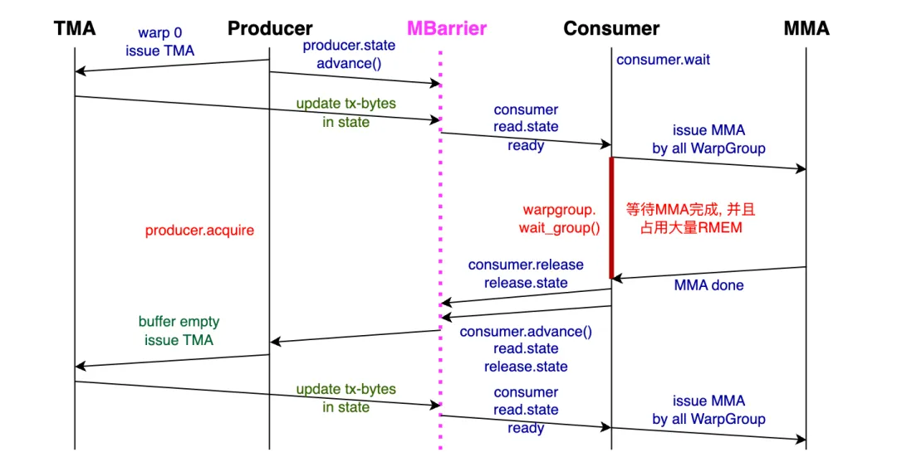

간단히 말하면 TMA는 completely hardware offload를 구현한다. Producer가 descriptor를 준비하고 TMA instruction을 issue한 뒤에는 더 이상 관여하지 않아도 된다. TMA가 자동으로 MBarrier를 update하고 Phase bit를 flip한다. 하지만 TensorCore는 아직 completely asynchronous operation을 구현하지 못했다. Accumulate result가 register에 존재하기 때문에 여전히 synchronous wait process가 필요하다.

다른 한편 Hopper에는 register occupancy 문제가 많이 존재한다는 점도 볼 수 있다. 따라서 `setmaxnreg`로 register resource를 consumer MMA warp에 할당하고 TMA Warp의 register count를 줄여야 한다. 또 single WarpGroup operation은 RegisterSpill을 유발하므로, MMA_ATOM의 atom_layout을 configure해 두 warp group으로 operation해야 한다.

TensorCore throughput을 더 늘리면 더 많은 register를 점유하게 된다. 다른 한편 MMA computation(producer)과 뒤따르는 Epilogue operation(consumer, 예: type conversion, global memory write-back 등)은 register 위에서 tightly coupled되어 있어 pipeline depth optimization에 불리하다. 또한 두 MMA Group 사이에서 Epilogue computation을 overlap해야 한다.

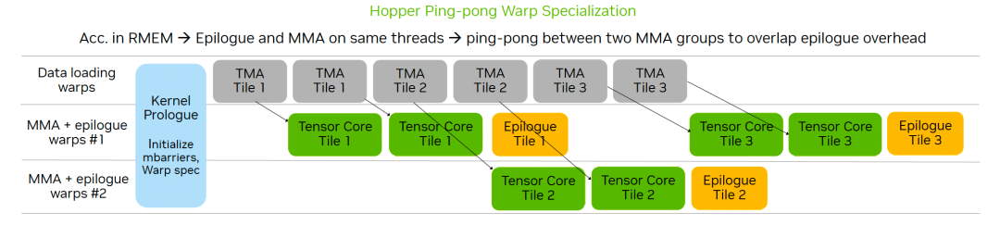

### 1.2 CGA

다른 한편 Hopper는 CGA(aka Thread Block Cluster)를 도입했지만, CGA 안의 모든 Thread Block이 하나의 GPC 범위 안에 있어야 한다는 요구가 있다.

여기서 Nvidia에 CGA / CTA / Thread Block Cluster / GPC / TPC처럼 hierarchy structure를 설명하는 용어가 왜 이렇게 많은지 조금 보충해 보자.

[GPU architecture evolution history](https://mp.weixin.qq.com/mp/appmsgalbum?__biz=MzUxNzQ5MTExNw==&action=getalbum&album_id=2538479717163761664&scene=173&from_msgid=2247487954&from_itemidx=3&count=3&nolastread=1#wechat_redirect)에서 GPC와 TPC의 유래를 볼 수 있다. 2006년에 Nvidia는 G80 unified shader architecture GPU를 출시했는데, 이것이 CUDA computation의 출발점이다. 그 이전 GPU에는 independent vertex shader와 pixel shader pipeline이 있었다. G80은 이를 programmable streaming processor(SP)로 통합했다. G80에서 TPC(Texture Processing Cluster)가 처음 core organization unit으로 등장했다. 당시 각 TPC는 2개의 SM을 포함했고, 각 SM은 8개의 stream processor(SP, 즉 CUDA Core의 전신)를 포함했다.

2010년 Fermi architecture를 design할 때 Fermi designer들은 GPU 규모를 더 쉽게 확장하려면 더 modular한 design을 채택해야 한다는 점을 인식했다. 그래서 GPC(Graphics Processing Cluster) hierarchy structure를 도입했다. 완전한 Fermi GF100 chip은 4개의 GPC로 구성되고, 각 GPC는 independent Raster Engine 하나를 포함하며, 각 SM은 PolyMorph Engine 하나를 포함한다. 이 세대에서는 TPC concept이 약화되었다. 하지만 GPC 기반 architecture 위에서 Lao Huang 특유의 제품 segmentation 방식이 탄생했다. high-end model은 완전한 4개 GPC를 가질 수 있고, mid/low-end model은 3개 또는 2개 GPC만 가진다.

2016년에 출시된 Pascal architecture에서는 기본적으로 GPU-->GPC-->TPC-->SM hierarchy structure가 완성되었다. GPC 하나는 5개의 TPC를 포함하고, 전체 GPC 안에는 shared Raster Engine 하나가 있으며, 각 TPC는 complete PolyMorph Engine 하나를 가진다. 물론 이 세대부터 GP104는 graphics workload용으로 사용되며, 각 TPC에 SM 하나만 있고 GP104는 complete Raster Engine과 PolyMorph Engine을 포함한다. 반면 computation workload에 대응하는 GP100은 이러한 graphics-related accelerator를 제거했고, 각 TPC가 2개의 SM을 포함한다. hardware에서는 GPC/TPC 같은 hierarchy structure description이 이때 사실상 정착되었다.

CTA(Cooperative Thread Array)는 Thread Block이라고도 불리고, CGA(Cooperative Grid Array)는 Thread Block Cluster라고도 불리는데, 이는 주로 software 관점에서 thread organization structure를 설명하는 용어이다.

Hopper에는 총 8개의 GPC가 있고, 각 GPC는 9개의 TPC를 포함하며, 각 TPC는 2개의 SM을 포함한다.

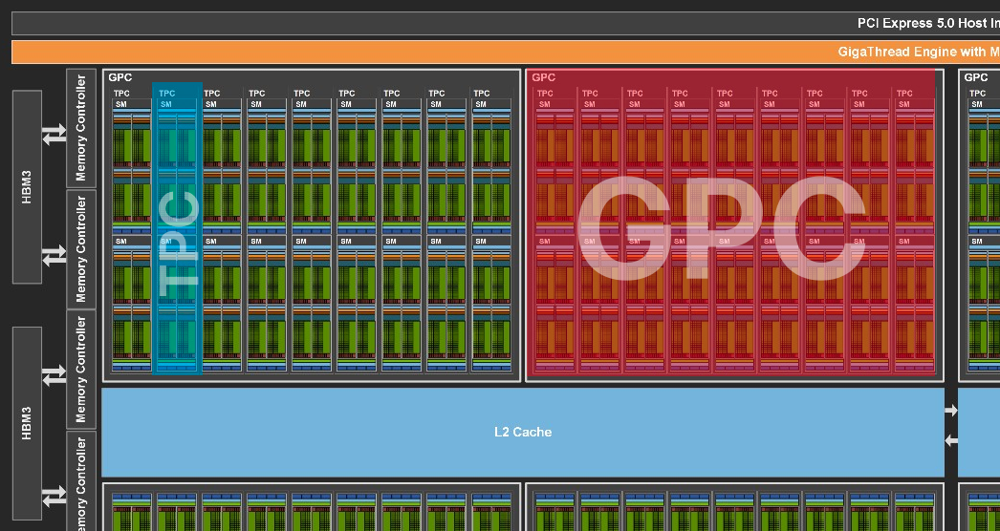

SM90은 Cluster 하나당 최대 8개 SM을 지원하고, SM90a는 maximum ClusterSize 16개를 지원한다. 더 큰 ClusterSize를 사용하면 TMA multicast를 통해 memory access efficiency가 크게 높아진다. 하지만 Cluster 안에서 resource waste가 발생하기도 쉽다. 아래 그림처럼 6개의 GPC를 포함하고 각 GPC에 6개의 SM이 있는 GPU가 있다고 가정하자. 더 큰 4x1 cluster를 사용하면 각 GPC에 2개의 SM이 idle 상태로 남아 충분히 활용되지 못한다. 충분히 활용하려면 더 작은 2x1 Cluster를 사용해야 하지만, 그러면 data access efficiency가 영향을 받는다.

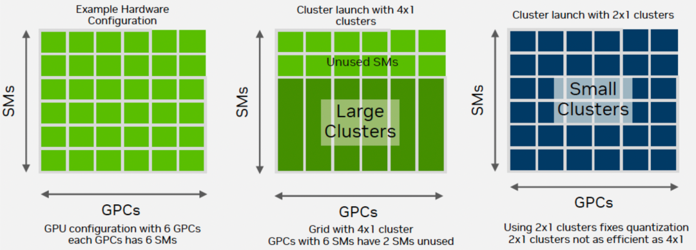

### 1.3 Static Tile Scheduling

앞 글 [Tensor-103.3 Hopper Persistent Kernel](https://mp.weixin.qq.com/s?__biz=MzUxNzQ5MTExNw==&mid=2247496608&idx=1&sn=1eac0c4b71e7c5251c1ca031cb8e744e&scene=21#wechat_redirect)에서는 Hopper Persistent Kernel의 처리를 소개했다. 그 scheduling 방식은 Tile static scheduling이다. 어떤 SM의 computation이 느려지면, 이후 남은 Tile을 처리하는 데 그 SM이 여러 Wave를 더 소비해야 하며, 다른 SM으로 분산할 수 없어서 load imbalance가 발생하고 전체 resource utilization이 낮아진다.

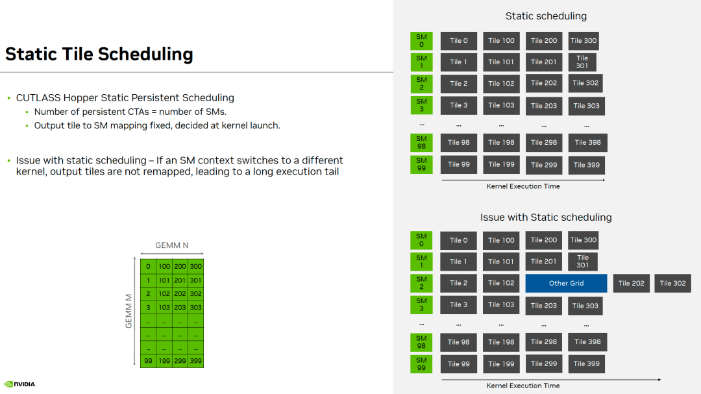

## 2. Blackwell software/hardware 기능 진화 개요

### 2.1 Blackwell TensorCore

가장 중요한 차이는 Hopper TensorCore가 RMEM을 점유하는 문제를 해결한 것이다. Tensor Memory가 새로 추가되었고, MMA instruction issue에는 thread 하나만 필요하다. 반면 Hopper에서는 전체 WarpGroup 4개 SM이 synchronized되어 collectively instruction을 issue해야 했다.

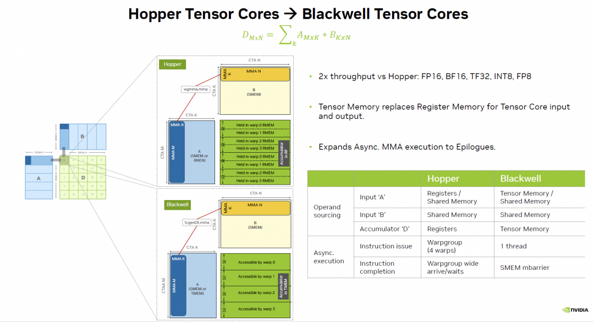

따라서 memory access 관점에서 보면 각 operand matrix를 저장할 수 있는 memory location의 evolution은 다음과 같다.

| Arch | Matrix A | MatrixB | MatrixD |
| --- | --- | --- | --- |
| Volta | RF | RF | RF |
| Ampere | RF | RF | RF |
| Hopper | RF/SMEM | SMEM | RF |
| Blackwell | TMEM/SMEM | SMEM | TMEM |

TensorCore의 evolution을 보면 한편으로는 같은 numerical precision의 throughput을 높였다. 즉 M dimension을 두 배로 늘렸고, 각 Warp의 instruction은 32xNx256bit이며, 전체 WarpGroup은 instruction level에서 이어 붙여져 128xNx256bit를 지원한다. 따라서 128 x N x 256bits MMA operation을 수행할 때 Blackwell의 performance가 두 배가 되었음을 볼 수 있다.

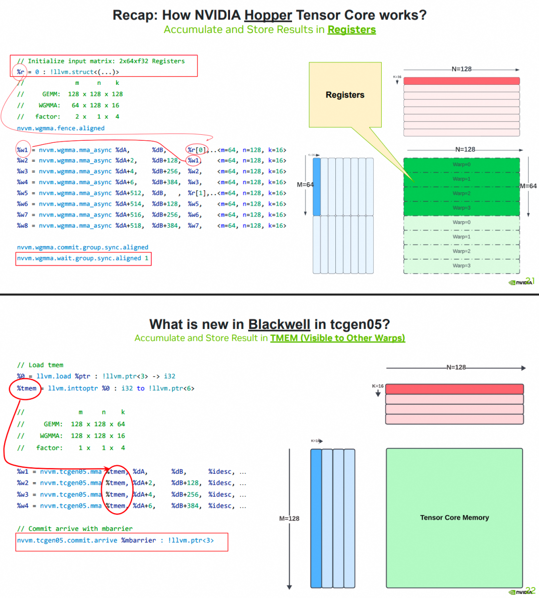

동시에 Blackwell에서는 전체 call process가 RMEM에 의존하지 않기 때문에 completely asynchronous 방식이 되었고, hardware가 Mbarrier를 update한다는 점에 주의해야 한다.

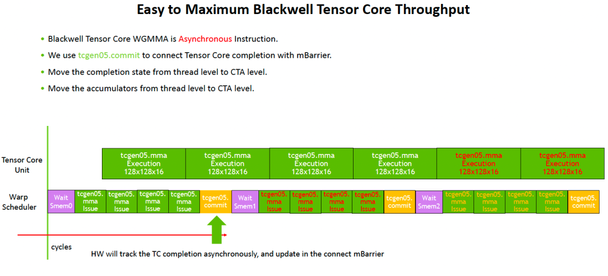

이렇게 하면 Epilogue가 independent Warp로 run될 수 있으며, Hopper처럼 두 Ping-pong warp로 Epilogue computation을 overlap할 필요가 없다.

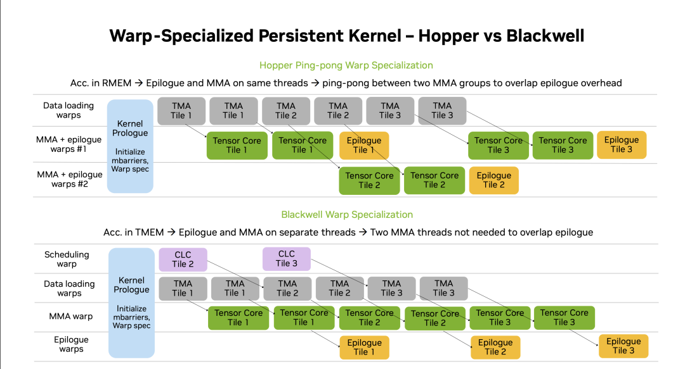

tcgen05의 asynchronous operation에 대해서는 뒤에서 별도 section으로 자세히 펼쳐 볼 것이다. tcgen05 instruction은 여전히 매우 complex하기 때문이다.

다른 한편 더 풍부한 low-precision type을 제공한다. 물론 DieSize constraint와 TMEM이 차지하는 area 영향도 받기 때문에, B300에서는 자주 쓰이지 않는 compute capability가 잘려 나갔다. 아래 표와 같다.

| Arch | FP64 | FP16 | INT8 | INT4 | FP8 | MXFP |
| --- | --- | --- | --- | --- | --- | --- |
| Volta | ❌ | ✅ FP16 | ❌ | ❌ | ❌ | ❌ |
| Turing | ❌ | ✅ FP16 | ✅ | ✅ | ❌ | ❌ |
| Ampere | ✅ | ✅ FP16/BF16 | ✅ | ✅ | ❌ | ❌ |
| Hopper | ✅ | ✅ FP16/BF16 | ✅ | ❌ | ⚠️FP8/FP22 | ❌ |
| Blackwell | ✅ | ✅ FP16/BF16 | ✅ | ❌ | ✅ | ✅ MXFP(8/6/4) NVFP4 |
| Blackwell Ultra | ⚠️ compute 성능 삭감 | ✅ FP16/BF16 | ⚠️ compute 성능 삭감 | ❌ | ✅ | ✅ MXFP(8/6/4) NVFP4 |

또 Block Scaling을 지원하며, Scale Factor도 Tensor Memory에 저장되어 execution 중 TensorCore가 read할 수 있다.

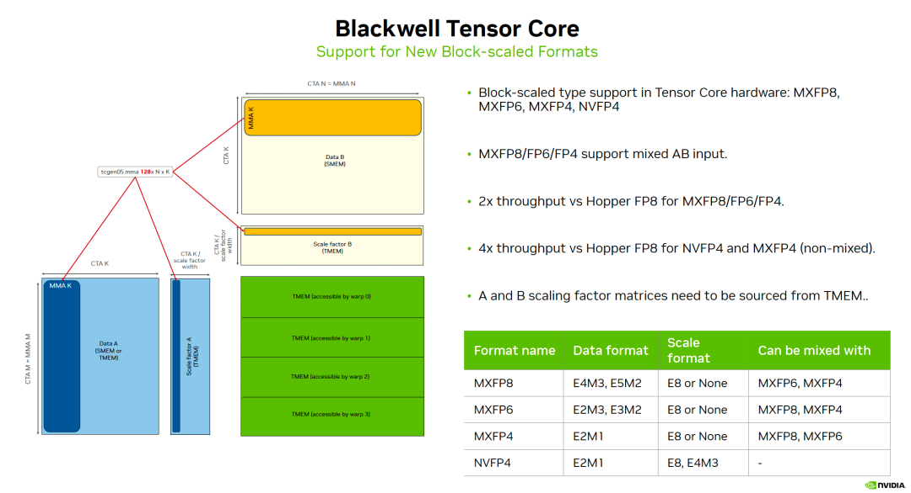

또한 TensorCore convolution operation에서 SMEM의 weight matrix를 read할 때, weight-stationary를 구현하기 위한 작은 Cache block도 있다. 그리고 64bits zero-column-mask-desc descriptor가 있으며, mask의 0 bit는 matrix B의 corresponding column value가 MMA operation에 적용됨을 의미하고, mask의 1 bit는 MMA operation에서 해당 column value가 모두 0이어야 함을 의미한다.

마지막으로 TensorCore execution 시 instruction은 2개의 SM을 동시에 control할 수 있다. 두 CTA를 Pair로 구성하고, Leader CTA의 thread 하나가 MMA instruction을 issue하며, A/B/accumulator는 두 SM에 분산된다. 이를 통해 data reuse capability가 더 증가한다.

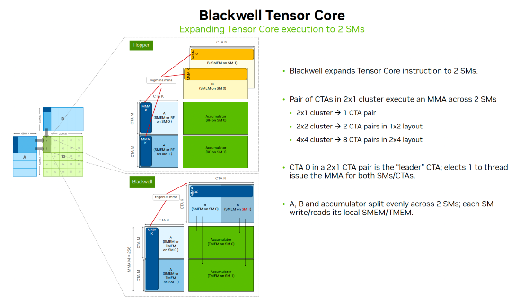

### 2.2 Blackwell memory hierarchy

#### 2.2.1 L2 Cache

Hopper에서 L2Cache는 25MB block 두 개로 구성되며, L2 Partition은 remote L2D access latency를 약 200 cycle 크게 증가시킨다. Blackwell에서는 B200이 두 Die를 이어 붙여야 하므로 cross-Die memory access가 significant latency를 도입한다. Die 내부에서까지 L2 Partition을 수행하면 memory access에 더 complex한 문제가 생긴다. 따라서 Blackwell에서 single Die는 65MB L2Cache 하나만 가진다. 그래도 cross-Die memory access는 여전히 약 200ns latency를 추가해 일부 Kernel performance에 영향을 준다. 향후 CUDA version에서 CTA memory affinity scheduling capability가 점진적으로 도입될 것으로 예상된다.

#### 2.2.2 TMEM

Blackwell에서 가장 큰 변화는 Tensor Memory가 추가된 것이다. 이는 Hopper에서 RMEM occupancy 문제를 해결하는 데 쓰인다. 2D memory addressing architecture이며, 각 CTA는 512 columns와 128 rows를 포함하고, 각 Cell은 32bit이다. 각 Lane은 2KB이고, address는 32bits Lane<31:16> Column<15:0> 방식이다.

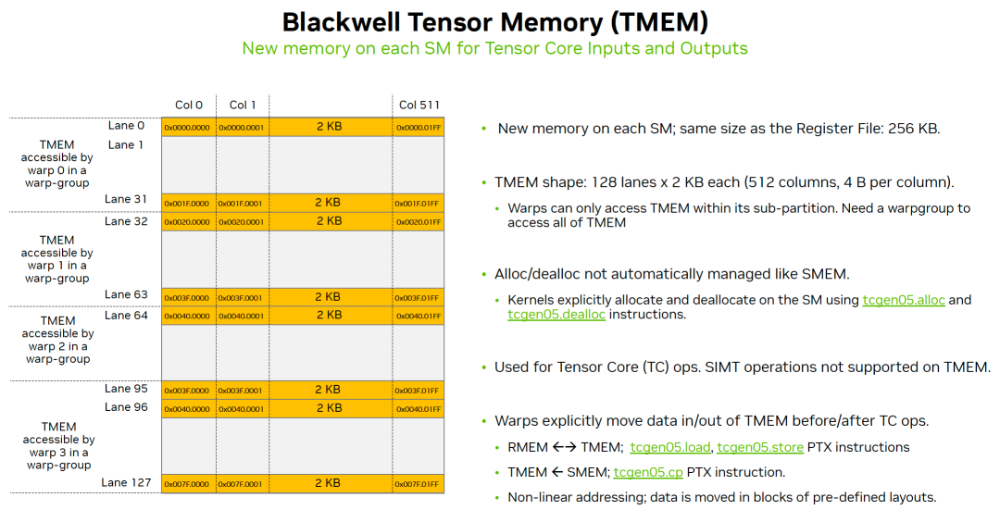

하지만 access에도 제한이 있다. WarpGroup 안의 서로 다른 warp는 fixed Lane만 access할 수 있다. 즉 각 TensorCore에는 32 lanes, 64KB TMEM space가 있다.

memory management 측면에서 TMEM은 explicit alloc/dealloc 처리가 필요하다. software abstraction 관점에서는 이를 Cache와 유사한 용도로 볼 수 있으며, loop process에서 data dependency와 lifetime에 따라 controllable하게 allocate할 수 있다.

data path에서 TMEM은 ld/st command를 통해 RMEM과 data load/store를 지원한다. 반면 TMEM과 SMEM 사이 access에서는 SMEM에서 TMEM으로 가는 copy만 지원한다. 다만 이런 data movement는 predefined Layout에 따라 block 단위로 처리해야 한다는 점에 주의해야 한다. 따라서 Epilogue flow에서는 Accumulator result를 RMEM으로 copy한 뒤, RMEM에서 GMEM으로 write back해야 한다.

L2Cache에는 Partition이 없고, 새 Tensor Memory와 TensorCore scale expansion도 큰 area occupancy를 가져왔다. 다른 한편 GPC scale은 20개 SM으로 확장되었다. 따라서 Blackwell에서 single Die의 SM count는 80개로 줄었고, 이것이 몇 가지 문제를 만들었다. 예를 들어 B200에서 SFU performance는 significant하게 향상되지 않아 softmax처럼 exponential operation이 필요한 workload에서 bottleneck이 발생한다. Blackwell Ultra(B300)에 이르러서야 FP64 compute capability를 줄이고 SFU performance를 두 배로 늘려 이 문제를 해결했다.

#### 2.2.3 TMA

Blackwell에서 TMA도 일정 부분 확장되었다. PTX document에는 tile::scatter4 / tile::gather4 및 im2col_w support가 새로 추가된 것으로 표시된다. 또한 "Bringing NVIDIA Blackwell GPU support to LLVM and MLIR"[1]에서는 Masked Copy support도 언급되지만, PTX에는 아직 설명되어 있지 않다. 다만 이것이 B200/B300 dual-Die structure에서 affinity-aware memory access를 하기 위한 것인지 생각해 보게 된다. scheduling된 CTA가 mask copy TMA를 통해 cross-Die read를 피하도록 보장하려는 용도일까?

### 2.3 Preferred Thread Block Clusters

Hopper에서는 launch size > 2인 CGA가 SM resource waste를 일으킨다. Blackwell에서는 GPC 하나가 20개 SM을 가지므로 4의 multiple이고, 더 큰 CGA를 launch해 efficiency를 높일 수 있다. 동시에 새로운 기능도 추가했다. LaunchKernel 시 cluster가 두 개의 Shape를 포함하도록 선택할 수 있으며, SM에 배치할 수 없을 때 더 작은 cluster_size로 GPC에 schedule할 수 있다.

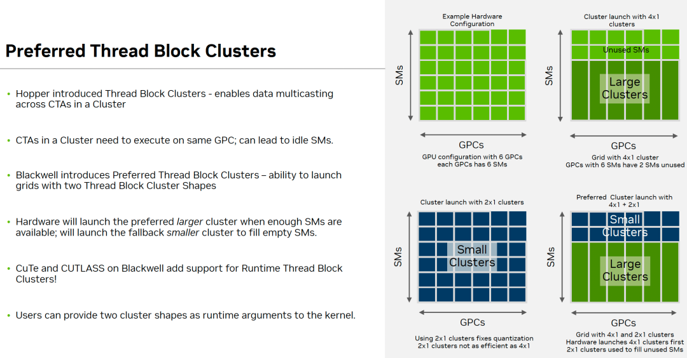

### 2.4 Dynamic Tile Scheduling

앞 글에서는 Hopper의 static Tile scheduling을 소개했다. 일부 SM resource를 사용할 수 없으면 static scheduler는 workload imbalance 문제를 쉽게 일으킨다.

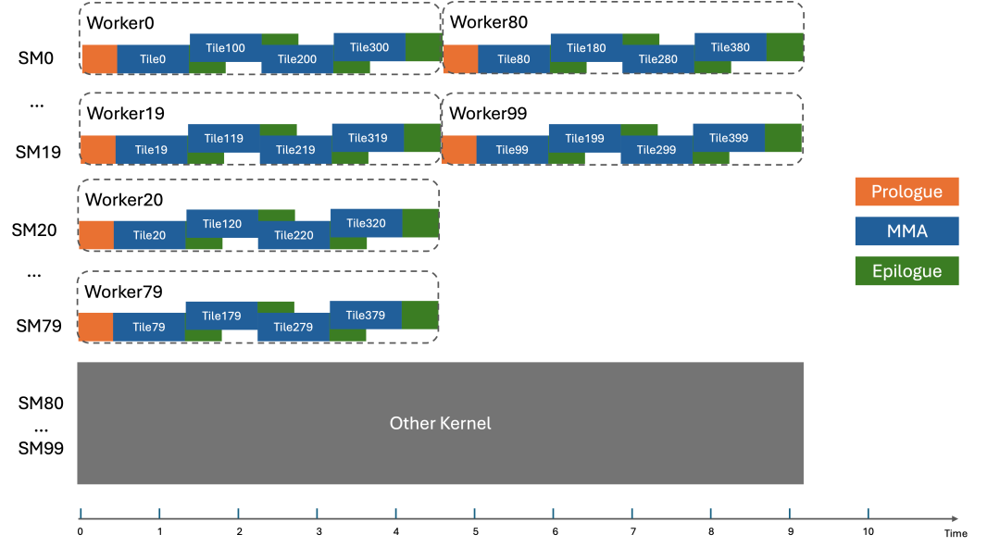

Persistent Kernel에는 fundamental limitation이 있다. launch 시점에는 정확히 몇 개 SM을 사용할 수 있는지 real time으로 알 수 없다. 일부 SM이 다른 Kernel에 의해 occupied되어 load imbalance 문제가 생길 수 있다. Blackwell은 Cluster Launch Control(CLC)을 도입해 dynamic scheduling을 지원한다.

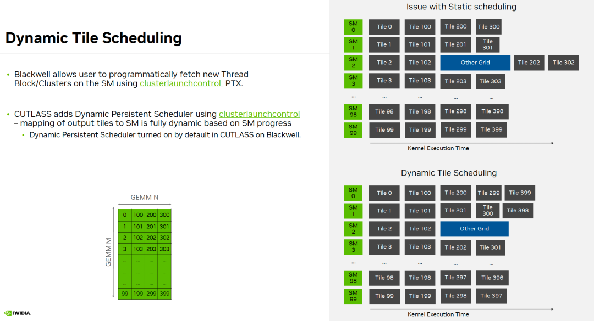

CLC가 있으면 Kernel은 non-persistent kernel처럼 output Tile count와 같은 수의 Grid를 구성할 수 있고, Grid의 coordinate는 ClcID로 정의된다. CLC는 다음 rules를 따른다.

1. available hardware resource(예: idle SM)가 있으면 pending ClcID 하나가 hardware scheduler에 의해 자동 launch되어 new worker가 된다.
2. 이미 존재하는 worker는 `clusterlaunchcontrol.try_cancel` instruction으로 pending ClcID를 query하고 그 work를 take over할 수 있다.
3. system은 각 ClcID가 rule (1)에 의해 launch되거나 rule (2)에 의해 take over되며, lost되지 않음을 보장한다.
4. 각 worker는 자신의 {blockIdx.x, blockIdx.y, blockIdx.z} coordinate를 처음 처리할 output tile로 사용한다. 이후 CLC query를 통해 이어서 처리할 tile을 얻는다.
5. `clusterlaunchcontrol.try_cancel` instruction은 success signal과 ClcID를 함께 return하거나 reject signal을 return한다. 가장 흔한 rejection reason은 모든 ClcID가 이미 처리 완료되었다는 것이다.
6. CLC의 work granularity는 CGA이다. 예를 들어 2x2 persistent worker cluster(4개 CTA로 구성)의 query 한 번은 4개의 ClcID를 동시에 consume한다.

아래 그림은 이를 보여준다.

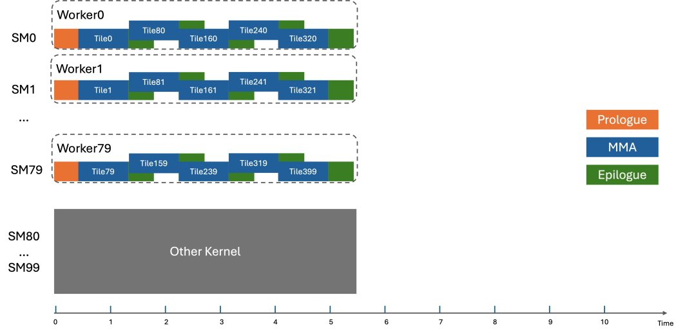

80개의 worker만 launch된다. worker 하나가 자기 work를 완료하면 즉시 CLC를 통해 new work를 request하고, 모든 400개 tile이 처리될 때까지 계속한다. 이렇게 workload가 모든 available SM에 dynamically balanced distribution된다.

concrete execution process는 다음과 같다.

```
  // Persistent loop
  do {
    // Producer
    if (is_producer) {
      // Only 1 thread of the entire cluster issues the query.
      uint32_t mbarrier_addr = scheduler_pipeline.producer_get_barrier(scheduler_pipe_state_write);

      // Wait for clcID buffer to become empty with a flipped phase
      scheduler_pipeline.producer_acquire(scheduler_pipe_state_write);

      // asynchronously query CLC
      if (cute::elect_one_sync()) {
        Scheduler::issue_clc_query(scheduler_pipe_state_write, mbarrier_addr, shared_storage.clc_response);
      }

      ++scheduler_pipe_state_write;
    }

    // Consumers
    if (is_consumer) {
      int linearCLC = work_tile_info.N_idx * gridDim.x + work_tile_info.M_idx;
      // Atomically increment the worker count for the linearCLC by 1.
      if (lane_predicate) {
        atomicAdd(&d_workerCount[linearCLC], 1);
      }
    }

    // Union of all consumers. Note that the producer here is its own consumer.
    if (is_producer || is_consumer) {
      scheduler_pipeline.consumer_wait(scheduler_pipe_state);
      uint32_t smem_addr = cute::cast_smem_ptr_to_uint(&shared_storage.clc_response[scheduler_pipe_state.index()]);
      // get work_tile_info
      work_tile_info = Scheduler::work_tile_info_from_clc_response(smem_addr);
      scheduler_pipeline.consumer_release(scheduler_pipe_state);
      ++scheduler_pipe_state;

      // Add block offset since the scheduler works at cluster level.
      dim3 block_id_in_cluster = cute::block_id_in_cluster();
      work_tile_info.M_idx += block_id_in_cluster.x;
      work_tile_info.N_idx += block_id_in_cluster.y;
      work_tile_info.L_idx += block_id_in_cluster.z;

    }
  } while (work_tile_info.is_valid_tile);
```

CLC query와 work_tile_info 획득 함수가 호출하는 instruction은 다음과 같다.

```
  CUTLASS_HOST_DEVICE
  static void
  issue_clc_query(PipelineState<Stages> state, uint32_t mbarrier_addr, CLCResponse* clc_response_ptr) {
  #if defined(CUTLASS_ARCH_CLC_ENABLED)
      uint32_t result_addr = cute::cast_smem_ptr_to_uint(reinterpret_cast<const void*>(
            &clc_response_ptr[state.index()]));
      asm volatile(
        "{\n\t"
        "clusterlaunchcontrol.try_cancel.async.shared::cta.mbarrier::complete_tx::bytes.multicast::cluster::all.b128 [%0], [%1];\n\t"
        "}\n"
        :
        : "r"(result_addr), "r"(mbarrier_addr));
  #else
      CUTLASS_NOT_IMPLEMENTED();
  #endif
  }

  CUTLASS_DEVICE
  static WorkTileInfo
  work_tile_info_from_clc_response(uint32_t result_addr) {
    WorkTileInfo work_tile_info;
    uint32_t valid = 0;

    #if defined(CUTLASS_ARCH_CLC_ENABLED)
      asm volatile(
        "{\n"
        ".reg .pred p1;\n\t"
        ".reg .b128 clc_result;\n\t"
        "ld.shared.b128 clc_result, [%4];\n\t"
        "clusterlaunchcontrol.query_cancel.is_canceled.pred.b128 p1, clc_result;\n\t"
        "selp.u32 %3, 1, 0, p1;\n\t"
        "@p1 clusterlaunchcontrol.query_cancel.get_first_ctaid.v4.b32.b128 {%0, %1, %2, _}, clc_result;\n\t"
        "}\n"
        : "=r"(work_tile_info.M_idx), "=r"(work_tile_info.N_idx), "=r"(work_tile_info.L_idx), "=r"(valid)
        : "r"(result_addr)
        : "memory"
      );

      cutlass::arch::fence_view_async_shared();
    #else
      CUTLASS_NOT_IMPLEMENTED();
    #endif
    work_tile_info.is_valid_tile = (valid == 1);
    return
```

## 3. Blackwell asynchronous processing

Blackwell에서 TensorCore는 비교적 independent한 DSA가 되었다. instruction set 관점에서는 synchronous instruction도 있고 asynchronous instruction도 있다.

|  | tcgen05.\* operation |
| --- | --- |
| synchronous instruction | **.alloc****.dealloc****.relinquish_alloc_permit** **.fence::\*****.wait::\*****.commit** |
| asynchronous instruction | **.mma****.cp****.shift****.ld****.st** |

다른 한편 issue instruction의 granularity도 다르다.

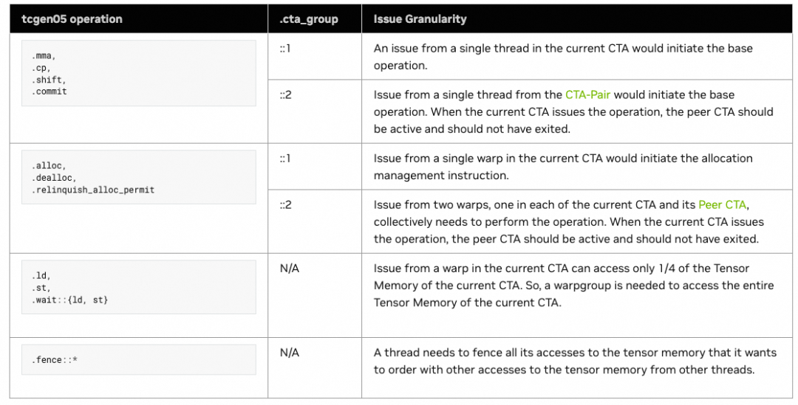

따라서 이 chapter에서는 전체 interaction process를 자세히 분석한다.

### 3.1 하나의 GEMM example에서 시작하기

이 section은 가장 simple한 pipeline operation부터 시작해 asynchronous programming에서 다양한 Mbarrier가 어떻게 처리되는지 본다. 먼저 두 MBarrier(MB0와 MB1)를 initialize해야 한다.

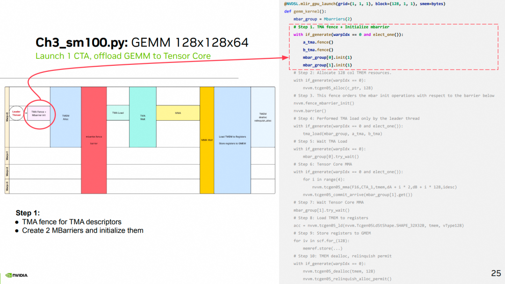

그다음 warp0이 TMEM memory allocation을 수행한다. allocation rule은 필요한 Column count에 따라 결정되며, 여기서는 128개 Column을 allocate한다. `tcgen05.alloc`은 warp-level synchronous instruction이므로 여기에는 blocking이 필요한 barrier가 있다. 그다음 step에서는 warp0의 thread 하나만 TMA load를 실행해 A와 B를 SMEM으로 load하면 된다. 그리고 MB0 completion을 wait해야 한다.

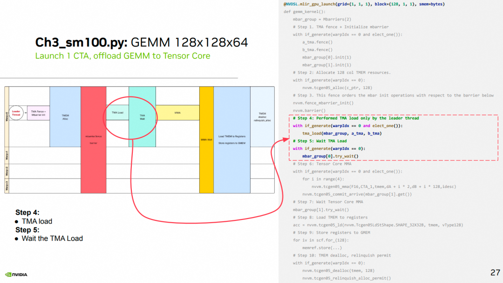

data가 SMEM에 load되면 Warp0의 thread 하나가 `tcgen05.mma` instruction을 issue할 수 있다. 이 instruction 역시 thread-granularity asynchronous operation이다. 그런 다음 이러한 asynchronous operation들을 `tcgen05.commit_arrive(MB1)`로 tracking하여 completion status를 추적한다.

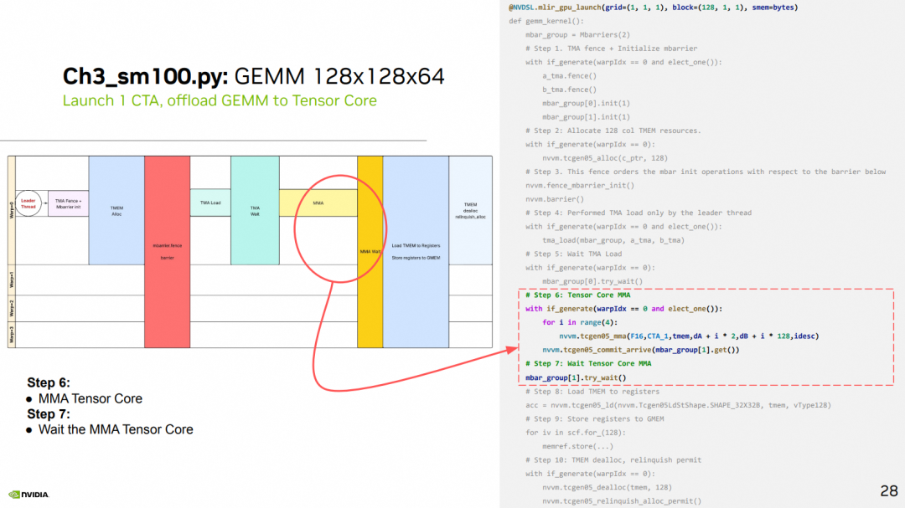

마지막으로 `MB1.try_wait` synchronous call을 사용해 completion을 wait한다. computation이 완료되면 모든 result가 TMEM에 write되어 있다. 이때 warp-level `tcgen05.ld`로 data를 RMEM으로 move해야 하며, 이것도 asynchronous operation이다. 그다음 `tcgen05.wait::ld`를 execute해 completion을 기다린 뒤, thread가 RMEM data를 GMEM에 save할 수 있다.

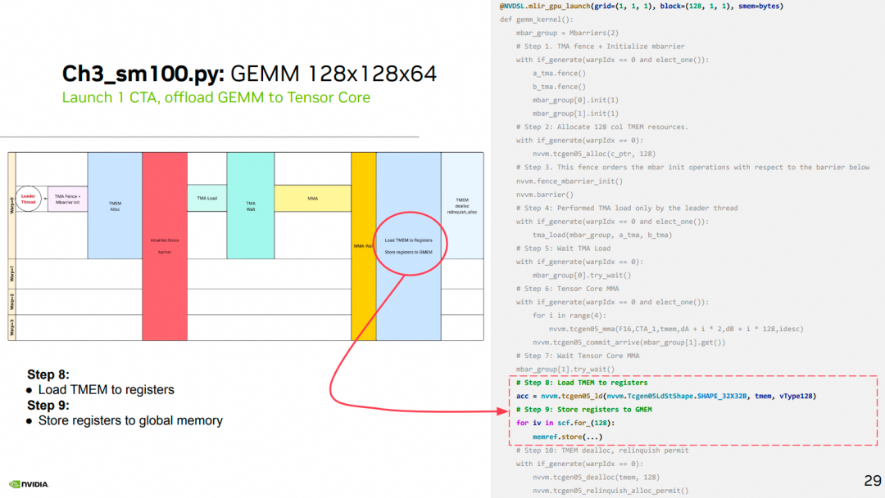

마지막으로 `tcgen05.dealloc`으로 TMEM release를 완료하고 `relinquish_alloc_permit`으로 allocation lock을 release한다.

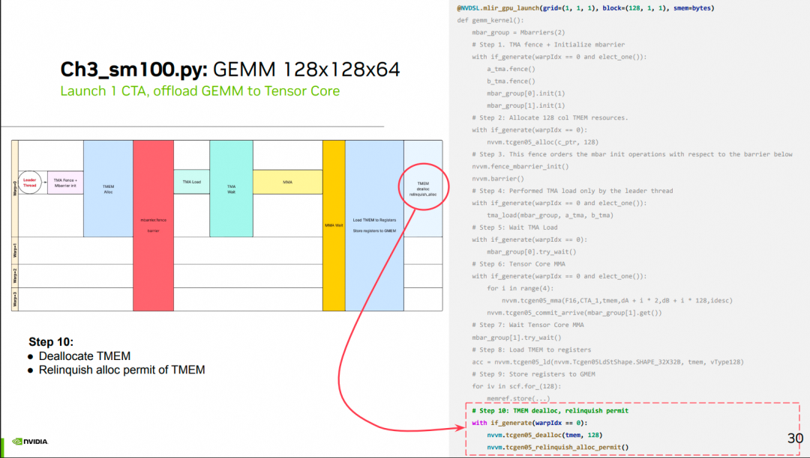

전체적으로 TMEM에서 memory allocation을 수행하거나 LD/ST로 RMEM에 access할 때 이들은 모두 warp-level operation이다. predefined Layout에 따라 해당 warp의 TMEM 32 lane에서 하나의 Block(N개 Column 포함)을 read한다. memory management와 관련된 것은 synchronous operation이고, LD/ST는 asynchronous execution이다. TMEM LD/ST completion을 wait하는 `tcgen05.wait::ld/st`는 warp-level synchronous blocking이다.

`tcgen05.mma/.cp/.shift` operation은 보통 thread-granularity asynchronous operation이다. 그다음 일련의 inflight instruction을 pack해 `tcgen05.commit`으로 MBarrier에 attach하고, instruction execution이 완료되면 hardware가 MBarrier를 update한다. software는 `mbarrier.try_wait()`로 thread-granularity synchronous blocking을 수행한다.

### 3.2 Blackwell Pipeline

complex asynchronous operation을 위해 CuteDSL에는 `PipelineTmaUmma`, `PipelineUmmaAsync`[2] 두 class가 encapsulate되어 있으며, 각각 Producer TMA--> Consumer UMMA와 Producer UMMA --> Consumer cp.async에 사용된다. 또한 multiple Consumer를 위한 `PipelineTmaMultiConsumersAsync`[3] class도 있다.

#### 3.2.1 PipelineTmaUmma

`PipelineTmaUmma`는 Blackwell TMA와 TensorCore에 맞춰 custom-made된 Software Pipeline synchronization class이다. class name처럼 이는 다음을 포함한다.

- **Producer**: TMA hardware unit. HBM에서 matrix A와 B의 tile을 SMEM으로 efficient하게 load하는 것이 task이다.
- **Consumer**: UMMA instruction이며 Tensor Core가 execute한다. SMEM에서 A와 B의 tile을 read하고 matrix multiplication accumulate operation을 수행하는 것이 task이다.

`PipelineTmaUmma` class의 역할은 이 둘 사이에 efficient synchronization mechanism을 만드는 것이다. multiple buffer(stages)를 포함하는 shared memory pool을 사용하고, NVIDIA GPU의 `mbarrier` hardware synchronization primitive를 통해 다음을 보장한다.

1. UMMA는 TMA가 아직 fill하지 않은 buffer를 compute하지 않는다.
2. TMA는 UMMA가 아직 compute를 끝내지 않은 buffer를 overwrite하지 않는다.

class definition은 다음과 같다.

```
@dataclass(frozen=True)
class PipelineTmaUmma(PipelineAsync):
    """
    PipelineTmaUmma is used for TMA producers and UMMA consumers (e.g. Blackwell mainloops).
    """
    # identify whether the current thread block (CTA) is the "leader" in its cooperative group (CTA Cluster)
    is_leader_cta: bool

    # enum type, possible values are `CtaGroup.ONE` or `CtaGroup.TWO`, used for 2SM MMA
    cta_group: cute.nvgpu.tcgen05.CtaGroup
```

##### create

이는 static factory method이며, `PipelineTmaUmma` instance를 생성하는 유일한 entry point이다. core flow는 다음과 같다.

1. **Create synchronization objects**: 두 mbarrier wrapper object를 생성한다.

- `sync_object_full`: TMA가 UMMA에게 "buffer가 full이므로 compute 가능"이라고 notify하는 데 사용된다.
- `sync_object_empty`: UMMA가 TMA에게 "buffer가 empty이므로 new data를 load 가능"이라고 notify하는 데 사용된다.

2. **Configure transaction barrier**: `sync_object_full`을 만들 때 `tx_count` parameter를 넘긴다. TMA hardware는 `tx_count` byte의 data transfer를 완료한 뒤 이 MBarrier를 hardware가 자동 update한다.
3. **Compute mask and role**: `_compute_mcast_arrival_mask`와 `_compute_is_leader_cta`를 call하여 synchronization process에서 각 CTA가 사용할 mask와 맡을 role을 결정한다.
4. **Initialize wait**: `pipeline_init_wait`는 synchronization point이며, Cluster 안의 모든 CTA가 initialization을 완료한 뒤에야 pipeline operation을 시작하도록 보장한다.

##### \_compute\_is\_leader\_cta(cta\_layout\_vmnk: cute.Layout)

현재 CTA가 leader인지 계산한다. physical thread block ID(`block_idx()`)를 logical cluster coordinate(`mma_coord_vmnk`)로 map한 뒤, cooperative dimension(`v` dimension, 즉 coordinate의 첫 번째 element)이 0인지 check한다.

##### \_compute\_mcast\_arrival\_mask(cta\_layout\_vmnk: cute.Layout, mcast\_mode\_mn: tuple[int, int])

TMA는 multicast 기능을 지원한다. TMA가 data tile 하나를 SMEM으로 load하면, 그 SMEM을 Cluster 안의 여러 CTA가 share하고 access할 수 있다. data 하나가 여러 compute unit에 service되므로 memory bandwidth를 크게 절약할 수 있다.

TMA가 load한 data가 ready 상태가 되면 이를 사용할 모든 consumer CTA에 notify해야 한다. `mbarrier`의 `arrive` operation은 target을 정확히 지정하기 위해 mask(bitmask)가 필요하다. mask의 각 bit는 Cluster 안의 CTA 하나에 대응한다. `create_tma_multicast_mask`는 Cluster layout, 현재 CTA coordinate, multicast dimension(`mcast_mode=2`는 M dimension, `mcast_mode=1`은 N dimension)을 바탕으로 base mask를 생성한다. 또한 2SM scenario에서는 `cta_in_cluster_coord_vmnk[0] ^ 1`로 peer coordinate를 얻은 뒤 Peer의 Mask를 계산한다.

final mask는 현재 CTA와 partner CTA mask의 union이다. 이렇게 하면 data가 도착했을 때 cooperative pair의 두 CTA 모두 `mbarrier` notification signal을 받을 수 있다.

##### producer\_acquire(self, state: PipelineState, ...)

Producer(TMA warp)가 특정 buffer에 data를 load하기 전에 호출하여 available empty buffer를 얻는다. 먼저 smem_empty에서 wait한다. 즉 `self.sync_object_empty.wait(state.index, state.phase)`이다. UMMA가 아직 이 buffer를 release하지 않았다면 producer thread는 여기서 block된다. 그다음 Leader CTA가 TMA instruction을 issue하기 전에 smem_full.arrive operation을 call한다. arrive operation은 arrive cnt를 update하지만, 실제 Phase flip은 TMA의 Tx-bytes counter가 완료되어야 발생한다. 또한 arrive call 시 multicast_mask를 set해 두므로, hardware가 trigger될 때 이 preset mask를 사용해 올바른 consumer 모두에게 notify한다.

##### producer\_commit(self, state: PipelineState)

실제로는 empty instruction이다. "commit" action은 이미 TMA hardware와 transaction barrier가 완전히 자동으로 처리한다. software level에서는 더 이상 explicit `commit` operation이 필요 없다.

##### consumer\_release(self, state: PipelineState)

Consumer(UMMA warps)가 buffer data 사용을 끝낸 뒤 해당 buffer를 release하고, producer에게 다시 사용할 수 있음을 알린다. concrete implementation은 `self.sync_object_empty.arrive(state.index, self.consumer_mask, self.cta_group)`이다. `MbarrierArray` class에서 볼 수 있듯이, `tcgen05.mma`용 arrive function에는 TensorCore hardware가 이 mbarrier를 update하도록 `tcgen05.commit`이 추가되어 있다.

```
    def arrive_tcgen05mma(
        self, index: int, mask: Optional[int], cta_group: cute.nvgpu.tcgen05.CtaGroup
    ) -> None:
        if mask is None:
            with cute.arch.elect_one():
                cute.nvgpu.tcgen05.commit(self.get_barrier(index))
        else:
            with cute.arch.elect_one():
                cute.nvgpu.tcgen05.commit(self.get_barrier(index), mask, cta_group)
```

double buffering(`num_stages=2`) example을 통해 전체 workflow를 이해해 보자.

1. **Initialization**: 2개의 SMEM buffer(buf0, buf1). empty_barrier[0]와 empty_barrier[1] state는 "available"이고, full_barrier[0]와 full_barrier[1] state는 "waiting"이다.
2. **Stage 1 (Producer)**:

- TMA thread가 `producer_acquire(buf0)`를 call한다. empty_barrier[0]가 available이므로 block되지 않는다.
- Leader CTA가 full_barrier[0]에 대해 arrive를 execute하고 notification mask를 preset한다.
- TMA thread가 `tma_load` instruction을 issue하여 buf0로 data load를 시작한다.

3. **Stage 1 (Consumer) & Stage 2 (Producer)**:

- parallel하게 UMMA thread가 `consumer_acquire`를 call하여 full_barrier[0]을 wait한다. 여기서 block된다.
- parallel하게 TMA thread가 next stage로 advance하여 `producer_acquire(buf1)`를 call한다. empty_barrier[1]가 available이므로 block되지 않는다.
- Leader CTA가 full_barrier[1]에 대해 `arrive`를 execute하고 mask를 preset한다.
- TMA thread가 `tma_load` instruction을 issue하여 buf1로 data load를 시작한다.

4. **TMA completes loading buf0**:

- TMA hardware가 full_barrier[0]에 대한 transaction을 자동 완료한다. full_barrier[0] state가 flip된다.
- full_barrier[0]을 wait하던 UMMA thread가 wake up되어 buf0의 data로 computation을 시작한다.

5. **Stage 1 (Consumer Release) & Stage 2 (Consumer Wait)**:

- UMMA thread가 buf0 computation을 완료한 뒤 `consumer_release(buf0)`를 call한다. empty_barrier[0]에 대해 `arrive`를 execute한다.
- 동시에 TMA는 이미 buf1 load를 완료했을 수 있고, full_barrier[1] state가 flip되어 UMMA가 buf1 computation을 시작할 수 있다.

6. **Loop:**

- 모든 consumer가 buf0를 release한 뒤 empty_barrier[0] state가 flip되어 "available"이 된다.
- TMA thread는 follow-up stage를 완료한 뒤 eventually `producer_acquire(buf0)`로 다시 loop하며, 이때 즉시 해당 buffer를 얻어 new round data load를 시작할 수 있다.

##### 3.2.2 PipelineUmmaAsync

이 scenario에서는 다음과 같다.

- **Producer**: UMMA instruction. $A \times B$ computation을 완료하고 final accumulator result Tile을 produce한다.
- **Consumer**: asynchronous thread이며 Epilogue processing과 GMEM으로 asynchronous copy-back하는 데 사용된다.

class definition은 다음과 같다.

```
@dataclass(frozen=True)
class PipelineUmmaAsync(PipelineAsync):
    """
    PipelineUmmaAsync is used for UMMA producers and AsyncThread consumers (e.g. Blackwell accumulator pipelines).
    """
    # same as in PipelineTmaUmma, indicates the CTA scale involved in UMMA operation (1 or 2 CTAs).
    cta_group: cute.nvgpu.tcgen05.CtaGroup
```

##### create(...)

먼저 Role definition이다. producer는 `PipelineOp.TCGen05Mma`(UMMA), consumer는 `PipelineOp.AsyncThread`임을 명확히 한다. 그다음 `sync_object_full`과 `sync_object_empty`를 생성한다. 주목할 점은 여기서 `sync_object_full`을 만들 때 `mbarrier`가 **`tx_count` parameter를 사용하지 않는다**는 것이다. producer UMMA는 software thread이고, completion은 hardware transaction count가 아니라 explicit `arrive` call로 표시되기 때문이다.

그다음 `_compute_tmem_sync_mask`와 `_compute_peer_cta_rank`를 call하여 producer commit과 consumer release에 필요한 mask/target을 configure한다.

##### \_compute\_tmem\_sync\_mask(cta\_layout\_vmnk: cute.Layout)

**producer commit**에 사용할 synchronization mask를 계산한다. UMMA가 2-CTA cooperative mode를 사용할 때 result tile 하나는 두 CTA가 함께 compute하여 produce한다. consumer는 whole tile을 RMEM으로 copy하기 전에 **두** CTA가 각자 맡은 computation을 모두 완료할 때까지 기다려야 한다. 이 mask는 어떤 CTA들이 동일한 producer cooperative group에 속하는지 정의한다. group 안의 모든 CTA가 `full` barrier에 대해 `arrive` operation을 실행한 뒤에야 barrier가 trigger되어 consumer에게 data ready를 notify한다.

##### \_compute\_peer\_cta\_rank()

**consumer release**에 사용할 target rank를 계산한다. consumer가 data write-back을 완료한 뒤 producer에게 corresponding TMEM buffer가 이제 empty이며 다음 computation result를 저장하는 데 사용할 수 있음을 알려야 한다. 이 notification은 producer group의 모든 CTA에 보낼 필요가 없고 Leader에게만 보내면 된다. Leader가 signal을 받은 뒤 Pair가 next round computation을 시작하도록 coordinate한다. `cta_rank_in_cluster // 2 * 2` 구현은 simple하다. 예를 들어 rank 0과 1의 CTA는 result가 모두 0이고, rank 2와 3의 CTA는 result가 모두 2이다. 이렇게 consumer는 "buffer empty" signal을 이 signal을 받아야 하는 Producer Leader에게만 정확히 보낼 수 있다.

##### producer\_commit(self, state: PipelineState)

Producer(UMMA warps)가 result tile 하나의 computation을 완료한 뒤 consumer에게 result data가 TMEM에 ready 상태임을 notify한다. implementation은 `self.sync_object_full.arrive(state.index, self.producer_mask, self.cta_group)`을 call하는 것이다. `producer_mask`를 사용해 producer group 안의 모든 CTA가 computation을 완료한 경우에만 `full` barrier가 trigger되도록 보장한다. `cta_group`은 이것이 UMMA cooperative group에서 온 signal임을 나타낸다.

##### consumer\_release(self, state: PipelineState)

이 method는 base class `PipelineAsync`가 제공하지만 behavior는 `consumer_mask`에 의해 결정되며, implementation은 `self.sync_object_empty.arrive(state.index, self.consumer_mask)`이다. 즉 consumer가 empty barrier에 대해 `arrive` operation을 execute한다. 여기서 `self.consumer_mask`는 `_compute_peer_cta_rank`가 계산한 leader rank이다. signal은 다음에 이 buffer를 사용할 UMMA producer subgroup의 Leader에게 정확히 전송된다.

##### producer\_tail(self, state: PipelineState)

이는 매우 중요한 tail work이다. Kernel의 마지막 iteration을 고려해 보자. UMMA가 마지막 tile computation을 끝내고 consumer가 이를 RMEM으로 asynchronous copy하여 처리하기 시작한다. 이때 UMMA thread(producer)가 바로 Kernel에서 exit하면, 그 thread가 사용하던 TMEM resource가 GPU system에 의해 reclaimed될 수 있다. 하지만 consumer thread가 아직 이 TMEM에서 data를 read 중일 수 있으므로 Race Condition이 발생한다.

concrete solution은 producer가 exit하기 전에 `producer_tail`을 call하는 것이다. producer가 consumer의 final work completion을 강제로 wait하게 한다. implementation은 다음과 같다.

1. function 안의 `is_leader_cta`: Leader CTA만 이 wait operation을 수행해야 한다.
2. `for i in cutlass.range_constexpr(self.num_stages - 1): state.advance()`: pipeline state `state`를 마지막으로 사용된 buffer를 가리키도록 fast-forward한다.
3. `self.producer_acquire(state)`: 그다음 producer가 이 final buffer에 대해 `acquire` operation을 execute한다. 이 operation은 `empty` barrier를 wait하며, 이 barrier는 consumer가 해당 buffer copy와 Epilogue computation write-back to GMEM을 완료하고 `consumer_release`를 call해야만 unblock된다.

double buffering(`num_stages=2`) Epilogue를 예로 들면 다음과 같다.

1. **Stage 1 (Producer)**:

- UMMA thread group이 result tile을 compute하여 `buf0`에 저장한다.
- 완료 후 `producer_commit(buf0)`를 call한다. `full_barrier[0]`가 trigger되어 consumer에게 notify한다.

2. **Stage 1 (Consumer) & Stage 2 (Producer)**:

- parallel하게 asynchronous thread(consumer)가 `full_barrier[0]`을 wait하다 wake up된 뒤 `buf0`에서 RMEM으로 data copy를 시작한다.
- parallel하게 UMMA thread group(producer)이 next stage로 advance하여 `producer_acquire(buf1)`를 call한다. `buf1`이 empty라고 가정하면 즉시 해당 buffer를 얻고, next result tile computation을 시작해 `buf1`에 저장한다.

3. **Stage 2 (Producer Commit) & Stage 1 (Consumer Release)**:

- UMMA가 `buf1` computation을 완료하고 `producer_commit(buf1)`를 call한다. `full_barrier[1]`가 trigger된다.
- 동시에 asynchronous thread가 이미 `buf0` copy를 완료했을 수 있다. 이 thread가 `consumer_release(buf0)`를 call하면 `empty_barrier[0]`가 trigger되어 `buf0`가 producer에게 다시 available해진다.

4. **Loop**: consumer는 이어서 `buf1` copy를 시작하고, producer는 다시 `buf0`를 얻어 next round computation에 사용할 수 있다. computation과 write-back operation은 서로 다른 buffer 위에서 pipeline된다.
5. **End**: 모든 tile computation이 완료되면 leader UMMA thread가 `producer_tail`을 call하고, 마지막 tile이 consumer에 의해 safely processed될 때까지 기다린 뒤 finally Kernel에서 exit한다.

`PipelineUmmaAsync`와 `PipelineTmaUmma`는 서로를 보완하며, Blackwell architecture에서 GEMM Kernel의 complete data flow management scheme을 함께 구성한다.

##### 3.2.3 PipelineTmaMultiConsumersAsync

하나의 TMA producer와 여러 different type의 consumer에 사용된다. 예를 들어 일부는 MMA computation을 execute하는 warp이고, 다른 일부는 asynchronous thread(AsyncThread)일 수 있다. 이 class는 synchronization complexity를 더 확장한다. consumer type이 두 가지이므로, 둘 모두 work를 완료한 뒤에야 producer에게 buffer가 empty임을 notify할 수 있다.

- `sync_object_empty`는 `Composite` type으로 design되며, 내부에서 multiple consumer group의 arrive를 manage한다는 뜻이다.
- `sync_object_empty_umma`와 `sync_object_empty_async`는 `sync_object_empty`의 두 "view"이며, 각각 두 different consumer type에 사용된다.
- `consumer_release()` method는 `op_type` parameter를 receive하고, caller가 MMA unit인지 asynchronous thread인지에 따라 corresponding `mbarrier`에 signal을 보낸다.
- 모든 type의 consumer가 같은 stage의 `empty_bar`에 대해 `arrive` signal을 보낸 뒤에야 이 `empty_bar` state가 `empty`가 되어 producer의 blocking을 release한다.

corresponding MBarrier processing logic도 유사하므로 여기서는 더 설명하지 않는다. 뒤에서 FlashAttention류 operator를 소개할 때 자세히 펼쳐 보겠다.

## 4. Simple GEMM Example

CuteDSL에는 Blackwell용 GEMM kernel implementation이 많이 있다. 먼저 Tutorial gemm[4]부터 소개한다. Blockscale_gemm과 group_gemm은 뒤의 별도 글 몇 편에서 소개할 예정이다.

### 4.1 Overview

이 `tutorial_fp16_gemm_0.py`는 concise하면서도 깊이가 있는 teaching example이다. core code는 대략 200여 line에 불과하지만 Blackwell operation을 기본적으로 포괄한다. 이 example은 일부 GEMM Kernel parameter를 fixed한다. 아래 표와 같다.

| parameter name | value | explanation |
| --- | --- | --- |
| `io_dtype` | `cutlass.Float16` | input/output matrix(A, B, C)의 data type은 FP16이다. |
| `acc_dtype` | `cutlass.Float32` | accumulator의 data type은 FP32이다. |
| `mma_inst_shape_mnk` | `(128, 256, 16)` | Tcgen05 instruction이 support하는 Shape이다. 이는 hardware instruction 하나가 128 X 256 X 16 MMA operation을 execute할 수 있음을 의미한다. |
| `mma_tiler_mnk` | `(128, 256, 64)` | CTA-level Tile size. M=128, N=256, K=64. |
| `threads_per_cta` | `128` | 각 thread block은 128개 thread를 포함한다. |
| `ab_stages` | `4` | input matrix A와 B의 software pipeline에 설정된 Stages이다. |
| `acc_stage` | `1` | accumulator에 설정된 pipeline stage count이다. |

### 4.2 SharedStorage struct

이는 shared memory(SMEM)에 정의된 struct이며, kernel에 필요한 일부 metadata를 manage하는 데 사용된다.

```
@cute.struct
class SharedStorage:
    ab_mbar_ptr: cute.struct.MemRange[cutlass.Int64, ab_stages * 2]
    acc_mbar_ptr: cute.struct.MemRange[cutlass.Int64, acc_stage * 2]
    tmem_holding_buf: cutlass.Int32
```

- `ab_mbar_ptr`: A와 B matrix load 및 UMMA computation pipeline의 MBarrier pointer를 manage하는 데 사용된다. `ab_stages * 2`는 각 stage에 Mbarrier가 2개 필요하기 때문이다.
- `acc_mbar_ptr`: accumulator pipeline의 MBarrier pointer를 manage하는 데 사용된다.
- `tmem_holding_buf`: TMEM allocation에 사용된다.

### 4.3 Host-side function

먼저 Tile MMA object를 구성한다. 다음과 같다.

```
    # Construct tiled MMA
    op = tcgen05.MmaF16BF16Op(
        io_dtype,
        acc_dtype,
        mma_inst_shape_mnk,
        tcgen05.CtaGroup.ONE, # use 1-CTA mode
        tcgen05.OperandSource.SMEM,
        tcgen05.OperandMajorMode.K,
        tcgen05.OperandMajorMode.K,
    )

    # generate Tiled-MMA
    tiled_mma = cute.make_tiled_mma(op)

    print(f"tiled_mma    = {cute.pretty_str(tiled_mma)}")

# output

tiled_mma    = Tiled MMA
  Thr Layout VMNK: (1,1,1,1):(0,0,0,0)
  Permutation MNK: (_,_,_)
MMA Atom
  ThrID:           1:0
  Shape MNK:       (128,256,16)
  TV Layout A:     (1,(128,16)):(128,(1,128))
  TV Layout B:     (1,(256,16)):(256,(1,256))
  TV Layout C:     (1,(128,256)):(128,(1,128))
```

`cute.make_tiled_mma(op)`는 hardware instruction Shape과 data type에 따라 `TiledMma` object를 생성한다. 그다음 `sm100_utils.make_smem_layout_a/b` helper function을 사용하여 A와 B matrix에 optimal SMEM data layout을 만든다. 여기에는 TMA와 UMMA에 필요한 Swizzle type이 이미 고려되어 있어 bank conflict를 피한다.

```
    # Construct SMEM layouts for A and B
    a_smem_layout = sm100_utils.make_smem_layout_a(
        tiled_mma,
        mma_tiler_mnk,
        a.element_type,
        ab_stages,
    )
    b_smem_layout = sm100_utils.make_smem_layout_b(
        tiled_mma,
        mma_tiler_mnk,
        b.element_type,
        ab_stages,
    )
    a_smem_layout_one_stage = cute.select(a_smem_layout, mode=[0, 1, 2])
    b_smem_layout_one_stage = cute.select(b_smem_layout, mode=[0, 1, 2])

#output
a smem layout    = S<3,4,3> o 0 o ((128,16),1,4,4):((64,1),0,16,8192)
b smem layout    = S<3,4,3> o 0 o ((256,16),1,4,4):((64,1),0,16,16384)
```

그다음 `make_tiled_tma_atom_A/B`를 사용해 TMA-ATOM을 정의한다.

```
    cluster_layout_vmnk = cute.tiled_divide(
        cute.make_layout((1, 1, 1)),
        (tiled_mma.thr_id.shape,),
    )

    # Construct TMA load atoms
    op = cute.nvgpu.cpasync.CopyBulkTensorTileG2SOp(tcgen05.CtaGroup.ONE)
    a_tma_atom, a_tma_tensor = cute.nvgpu.make_tiled_tma_atom_A(
        op,
        a,
        a_smem_layout_one_stage,
        mma_tiler_mnk,
        tiled_mma,
        # cluster_layout_vmnk.shape,
    )
    b_tma_atom, b_tma_tensor = cute.nvgpu.make_tiled_tma_atom_B(
        op,
        b,
        b_smem_layout_one_stage,
        mma_tiler_mnk,
        tiled_mma,
        # cluster_layout_vmnk.shape,
    )
#output
a_tma_atom   = Copy Atom
  ThrID:         1:0
  TV Layout Src: (1,8192):(0,1)
  TV Layout Dst: (1,8192):(0,1)
  Value type:    f16
b_tma_atom   = Copy Atom
  ThrID:         1:0
  TV Layout Src: (1,16384):(0,1)
  TV Layout Dst: (1,16384):(0,1)
  Value type:    f16

a tma tensor (0,0) o (8192,8192):(1@1,1@0)
b tma tensor (0,0) o (8192,8192):(1@1,1@0)
```

UMMA와 TMA descriptor 준비가 끝나면 Kernel을 launch할 수 있다.

```
    # compute grid shape based on C shape ceildiv mma_tiler_mn: (64,32,1)
    grid_shape = cute.ceil_div((*c.layout.shape, 1), mma_tiler_mnk[:2])

    # Launch the kernel
    kernel(
        tiled_mma,
        a_tma_atom,
        a_tma_tensor,
        b_tma_atom,
        b_tma_tensor,
        c,
        a_smem_layout,
        b_smem_layout,
    ).launch(
        grid=grid_shape,
        block=(threads_per_cta, 1, 1),
    )
```

### 4.4 Kernel

#### 4.4.1 Initialization

이 stage는 resource initialization, pipeline setup, 그리고 가장 중요한 CuTe를 사용한 tensor Partition을 담당한다. 먼저 current thread, Warp, thread block의 grid coordinate를 얻어야 한다.

```
    # Current thread/warp/block coordinates
    tidx, _, _ = cute.arch.thread_idx()
    warp_idx = cute.arch.warp_idx()
    warp_idx = cute.arch.make_warp_uniform(warp_idx)
    bidx, bidy, _ = cute.arch.block_idx()
    mma_coord_mnk = (bidx, bidy, None)
```

그다음 SharedStorage struct를 이용해 memory를 allocate한다. 이 example에서는 sA와 sB를 struct에 넣지 않고, smem에서 직접 allocate_tensor한다.

```
    # Allocate SMEM
    smem = cutlass.utils.SmemAllocator()
    storage = smem.allocate(SharedStorage)
    sA = smem.allocate_tensor(
        element_type=io_dtype,
        layout=a_smem_layout.outer,
        byte_alignment=128,
        swizzle=a_smem_layout.inner,
    )
    sB = smem.allocate_tensor(
        element_type=io_dtype,
        layout=b_smem_layout.outer,
        byte_alignment=128,
        swizzle=b_smem_layout.inner,
    )
```

Blackwell에서 주의해야 할 것은 Tensor Memory allocation이다. 여기에는 NamedBarrier가 필요하다. NamedBarrier는 hardware-managed Barrier이며 최대 16개를 지원하고, barrier_ids value range는 0-15이다. 또한 TMEM은 column 단위로 allocate해야 하며, 여기서는 512 columns 전체를 allocate한다.

```
    # Allocate all TMEM columns
    tmem_alloc_barrier = pipeline.NamedBarrier(
        barrier_id=1,
        num_threads=threads_per_cta,
    )
    tmem = utils.TmemAllocator(
        storage.tmem_holding_buf,
        barrier_for_retrieve=tmem_alloc_barrier,
    )
    num_tmem_cols = 512
    tmem.allocate(num_tmem_cols)
```

##### 4.4.1.1 Pipeline 설정

이 section에서는 Chapter 3에서 사용한 `PipelineTmaUmma`와 `PipelineUmmaAsync` 두 class를 사용한다. 또한 `make_participants`로 PipelineProducer와 PipelineConsumer를 생성하여 state를 직접 조작하는 일을 피한다.

```
    # Prefetch tma descriptor
    if warp_idx == 0:
        cpasync.prefetch_descriptor(tma_atom_a)
        cpasync.prefetch_descriptor(tma_atom_b)

    # Pipeline configuration

    # compute tx-count required by TMA
    num_tma_copy_bytes = cute.size_in_bytes(
        io_dtype, cute.select(a_smem_layout, mode=[0, 1, 2])
    ) + cute.size_in_bytes(io_dtype, cute.select(b_smem_layout, mode=[0, 1, 2]))

    # Pipeline for TMA Producer and UMMA Consumer
    ab_producer, ab_consumer = pipeline.PipelineTmaUmma.create(
        num_stages=ab_stages,
        # TMA and UMMA are both issued by Thread, so pipeline Agent is Thread here, default cnt is 1.
        producer_group=pipeline.CooperativeGroup(pipeline.Agent.Thread),
        consumer_group=pipeline.CooperativeGroup(pipeline.Agent.Thread),
        tx_count=num_tma_copy_bytes,
        barrier_storage=storage.ab_mbar_ptr.data_ptr(),
    ).make_participants()

    # Pipeline for UMMA Producer and Epilogue Consumer
    acc_producer, acc_consumer = pipeline.PipelineUmmaAsync.create(
        num_stages=acc_stage,
        producer_group=pipeline.CooperativeGroup(pipeline.Agent.Thread),
        # consumer needs multiple threads inside CTA, so arrive cnt = threads_per_cta
        consumer_group=pipeline.CooperativeGroup(
            pipeline.Agent.Thread, threads_per_cta
        ),
        barrier_storage=storage.acc_mbar_ptr.data_ptr(),
    ).make_participants()
```

##### 4.4.1.2 Tensor Partitioning

CuTe를 사용해 global problem을 decompose한다.

```
    # Partition tensors for MMA and make fragments
    # (bM, bK, RestK)
    gA = cute.local_tile(mA_mkl, mma_tiler_mnk, mma_coord_mnk, proj=(1, None, 1))
    # (bN, bK, RestK)
    gB = cute.local_tile(mB_nkl, mma_tiler_mnk, mma_coord_mnk, proj=(None, 1, 1))
    # (bM, bN)
    gC = cute.local_tile(mC_mnl, mma_tiler_mnk, mma_coord_mnk, proj=(1, 1, None))
```

`gA`, `gB`, `gC`: `cute.local_tile`을 사용해 global matrix `mA_mkl`, `mB_nkl`, `mC_mnl`에서 current thread block(CTA)이 담당하는 부분을 "cut out"한다.

```
    thr_mma = tiled_mma.get_slice(0)
    # (MMA, MMA_M, MMA_K)
    tCgA = thr_mma.partition_A(gA)
    # (MMA, MMA_N, MMA_K)
    tCgB = thr_mma.partition_B(gB)
    # (MMA, MMA_M, MMA_N)
    tCgC = thr_mma.partition_C(gC)
```

`tCgA`, `tCgB`, `tCgC`: `thr_mma.partition_A/B/C`는 CTA의 Tile을 더 partition하여 각 thread가 computation 시 보게 되는 global memory view를 얻는다.

```
    # (MMA, MMA_M, MMA_K)
    tCrA = tiled_mma.make_fragment_A(sA)
    # (MMA, MMA_N, MMA_K)
    tCrB = tiled_mma.make_fragment_B(sB)
    # (MMA, MMA_M, MMA_N)
    acc_shape = tiled_mma.partition_shape_C(mma_tiler_mnk[:2])
    # (MMA, MMA_M, MMA_N)
    tCtAcc = tiled_mma.make_fragment_C(acc_shape)
```

`tCrA`, `tCrB`: `tiled_mma.make_fragment_A/B`는 thread의 RMEM fragment를 생성한다. 이는 tensor core instruction이 직접 operate하는 data이다. `tCr`의 `r`은 `register`를 의미한다.

```
    # CTA-wide sync before retrieving the pointer to the start of the allocated TMEM
    # Only warp 0 does the allocation so we need to sync before retrieving the TMEM start address
    tmem.wait_for_alloc()
    tmem_ptr = tmem.retrieve_ptr(acc_dtype)
    # Swap the pointer in tCtAcc
    tCtAcc = cute.make_tensor(tmem_ptr, tCtAcc.layout)
```

`tCtAcc`: `tiled_mma.make_fragment_C`는 accumulation result를 저장하기 위한 **TMEM** fragment를 생성한다. `tCt`의 `t`는 `TMEM`을 의미한다. 이후 `tCtAcc = cute.make_tensor(tmem_ptr, tCtAcc.layout)`은 이 logical fragment를 앞서 allocate한 physical TMEM address와 associate한다.

```
    # Partition tensors for TMA; This requires the tensors partitioned for MMA
    tAsA, tAgA = cute.nvgpu.cpasync.tma_partition(
        tma_atom_a,
        0,
        cute.make_layout(1),
        cute.group_modes(sA, 0, 3),
        cute.group_modes(tCgA, 0, 3),
    )
    tBsB, tBgB = cute.nvgpu.cpasync.tma_partition(
        tma_atom_b,
        0,
        cute.make_layout(1),
        cute.group_modes(sB, 0, 3),
        cute.group_modes(tCgB, 0, 3),
    )
```

`tAsA`, `tAgA`, `tBsB`, `tBgB`: `cute.nvgpu.cpasync.tma_partition`은 TMA data movement operation을 partition하고, 각 TMA copy의 source(global memory, `g`)와 target(shared memory, `s`)을 정의한다.

##### 4.4.1.3 Epilogue TMEM copy

Epilogue에서 필요한 TMEM load to RMEM을 위해 TMEM_ATOM을 구성하고 related layout 처리 및 register resource allocation을 수행한다.

```
    subtile_cnt = 4
    # (EpiTile)
    epi_tiler = (
        (cute.size(tCtAcc, mode=[0, 0]), cute.size(tCtAcc, mode=[0, 1]) // subtile_cnt),
    )
    # (EpiTile, NumTiles)
    tCtAcc_epi = cute.zipped_divide(tCtAcc, epi_tiler)
    # (EpiTile, NumTiles)
    gC_epi = cute.zipped_divide(tCgC, epi_tiler)

    # Every thread loads 32x128 bits
    tmem_atom = cute.make_copy_atom(
        tcgen05.Ld32x32bOp(tcgen05.Repetition.x64),
        cutlass.Float32,
    )
    tmem_tiled_copy = tcgen05.make_tmem_copy(tmem_atom, tCtAcc_epi[None, 0])
    tmem_thr_copy = tmem_tiled_copy.get_slice(tidx)

    # (TmemCpy,NumTmemCpy,NumTiles)
    tDtC = tmem_thr_copy.partition_S(tCtAcc_epi)
    # (TmemCpy,NumTmemCpy,NumTiles)
    tDgC = tmem_thr_copy.partition_D(gC_epi)

    # (TmemCpy,NumTmemCpy)
    tCrAcc = cute.make_rmem_tensor(tDgC[None, None, 0].shape, acc_dtype)
    # (TmemCpy,NumTmemCpy)
    tCrC = cute.make_rmem_tensor(tDgC[None, None, 0].shape, io_dtype)
```

#### 4.4.2 Main loop

MainLoop code도 매우 simple하다.

```
    if warp_idx == 0:
        # wait for an empty accumulator Buffer through acc_producer
        acc_empty = acc_producer.acquire_and_advance()

        # note: this uses a CuteDSL syntax sugar that allows defining prefetch_stages.
        for k_tile_idx in cutlass.range(num_k_tiles, prefetch_stages=ab_stages - 2):

            # check smem_empty mbarrier before issuing TMA
            ab_empty = ab_producer.acquire_and_advance()

            # copy A Tile to SMEM
            cute.copy(
                tma_atom_a,
                tAgA[(None, ab_empty.count)],
                tAsA[(None, ab_empty.index)],
                tma_bar_ptr=ab_empty.barrier,
            )
            # copy B Tile to SMEM
            cute.copy(
                tma_atom_b,
                tBgB[(None, ab_empty.count)],
                tBsB[(None, ab_empty.index)],
                tma_bar_ptr=ab_empty.barrier,
            )

            # Execute one K-block worth of MMA instructions
            ab_full = ab_consumer.wait_and_advance()
            num_k_blocks = cute.size(tCrA, mode=[2])
            for k_block_idx in cutlass.range_constexpr(num_k_blocks):
                k_block_coord = (None, None, k_block_idx, ab_full.index)
                cute.gemm(
                    tiled_mma,
                    tCtAcc,
                    tCrA[k_block_coord],
                    tCrB[k_block_coord],
                    tCtAcc,
                )
                tiled_mma.set(tcgen05.Field.ACCUMULATE, True)

            # this is consumer_release; when internally calling sync_object_empty.arrive,
            # it calls tcgen05.commit
            ab_full.release()

        # Signal that the accumulator is fully computed
        acc_empty.commit()
```

#### 4.4.3 Epilogue

main loop가 K dimension의 모든 computation을 완료하면 `tCtAcc`(TMEM 안에 있음)는 current CTA Tile의 final FP32 result를 저장한다. Epilogue의 task는 이 result를 FP16으로 convert하고 global memory의 `C` matrix에 write back하는 것이다. 먼저 TMEM allocation lock을 release한 뒤, computation pipeline completion(acc_full barrier)을 wait한다. 이를 통해 `tCtAcc`의 data가 final result임을 보장한다.

```
    # Release TMEM allocation lock
    tmem.relinquish_alloc_permit()

    # Wait for the accumulator buffer to be full
    acc_full = acc_consumer.wait_and_advance()

    # TMEM -> RMEM -> GEMM
    # Sub-tiling for better instruction-level parallelism
    for i in cutlass.range(cute.size(tDtC, mode=[2])):
        cute.copy(tmem_tiled_copy, tDtC[None, None, i], tCrAcc)
        tCrC.store(tCrAcc.load().to(io_dtype))
        cute.autovec_copy(tCrC, tDgC[None, None, i])
    acc_full.release()

    # Deallocate TMEM
    pipeline.sync(barrier_id=1)
    tmem.free(tmem_ptr)
```

**TMEM -> RMEM -> GMEM**: 이는 staged data movement와 conversion process이다.

- `cute.copy(tmem_tiled_copy, tDtC, tCrAcc)`: `tcgen05.Ld32x32bOp` instruction을 사용해 TMEM의 FP32 accumulation result(`tDtC`)를 register(`tCrAcc`)로 copy한다. 여기서 `tmem_tiled_copy`는 initialization stage에서 정의한 Copy-Atom이다.
- `tCrC.store(tCrAcc.load().to(io_dtype))`: register 안에서 FP32 data를 FP16으로 convert한다. `tCrC`는 conversion 후 FP16 result를 저장하기 위한 register Fragment이다.
- `cute.autovec_copy(tCrC, tDgC)`: register 안의 FP16 result(`tCrC`)를 global memory(`tDgC`)로 write back한다. `autovec_copy`는 vectorized store instruction을 사용해 bandwidth utilization을 높이려 한다.

## 5. GEMM Persistent Kernel

### 5.1 Overview

CuteDSL의 `dense_gemm_persistent.py`[5] example은 비교적 complete한 GEMM kernel이며, 다음 features를 support한다.

- TMA를 이용해 efficient memory operation을 구현한다.
- Blackwell의 `tcgen05.mma` instruction을 이용해 MMA operation을 수행한다(2cta mma instruction 포함).
- CGA를 통해 TMA multicast를 구현하여 L2 memory traffic을 줄인다.
- Persistent tile scheduling을 support하여 tile 사이에서 memory load/store와 mma operation을 더 잘 overlap한다.
- warp specialization을 support하여 main loop의 load와 mma operation 사이에 explicit pipeline management를 하지 않도록 한다.
- supported input data types: fp16, bf16, tf32, int8, uint8, fp8(e4m3fn, e5m2)
- Mma tile의 M dimension은 64/128(`use_2cta_instrs=False`일 때) 또는 128/256(`use_2cta_instrs=True`일 때)이어야 한다.
- Mma tile의 N dimension은 32-256 range이고 stride는 32여야 한다.

하지만 현재 official CuteDSL example에는 아직 DynamicTileScheduler 기능이 추가되어 있지 않으며, scheduling은 여전히 StaticTileScheduler를 사용한다.

### 5.2 Initialization parameters

주로 두 부분으로 나뉜다. 하나는 `__init__` constructor에서 일부 static parameter를 configure하는 것이고, 다른 하나는 `_setup_attributes()`에서 concrete input tensor information을 얻은 뒤 input-dependent dynamic attribute를 calculate하고 set하는 것이다.

`__init__` constructor에서는 Kernel의 static configuration을 initialize한다. key parameters는 다음과 같다.

- `acc_dtype`: accumulator data type(e.g., Float32).
- `use_2cta_instrs`: 두 CTA가 cooperate해야 하는 MMA instruction을 사용할지 여부. 그리고 `cta_group`을 `tcgen05.CtaGroup.ONE / TWO`로 정의한다.
- `mma_tiler_mn`: MMA computation의 basic tile size, e.g., (128, 128).
- `cluster_shape_mn`: Cluster shape, e.g., (2, 1)은 하나의 Cluster가 2x1=2개 CTA로 구성됨을 의미한다.
- `use_tma_store`: Epilogue stage에서 final result C를 store하는 데 TMA를 사용할지 여부.

이는 Warp Specialization을 사용하며 다음 종류의 Warp를 정의한다.

- `epilog_warp_id = (0, 1, 2, 3)`: warp 0-3이 epilogue를 담당한다.
- `mma_warp_id = 4`: warp 4가 MMA computation을 담당한다.
- `tma_warp_id = 5`: warp 5가 TMA data load를 담당한다.

그리고 Warp count에 따라 각 CTA의 thread count를 계산한다. 1(MMA) + 1(TMA) + 4(Epilogue) = 6 warps, 총 $6 \times 32 = 192$ threads이다.

```
        self.threads_per_cta = 32 * len(
            (self.mma_warp_id, self.tma_warp_id, *self.epilog_warp_id)
        )
```

그다음 CTA synchronization에 사용할 NamedBarrier의 bar_id도 일부 정의한다.

```
        # Set barrier id for cta sync, epilogue sync and tmem ptr sync
        self.epilog_sync_bar_id = 1
        self.tmem_alloc_sync_bar_id = 2
        self.tmem_dealloc_sync_bar_id = 3
```

또 SMEM capacity를 얻고 occupancy parameter를 정의하여 pipeline stage count를 계산한다. target occupancy는 1로 set한다. 즉 각 SM에서 CTA 하나만 run한다. 이는 single CTA가 사용할 수 있는 SMEM과 기타 resource를 maximize하기 위한 것이다.

```
        self.occupancy = 1
        self.smem_capacity = utils.get_smem_capacity_in_bytes("sm_100")
```

그다음 뒤에서 이 두 parameter를 기반으로 `_compute_stages` function을 call하여 A/B buffer stage count(`num_ab_stage`)를 maximize하고, 가능한 한 memory access latency를 hide한다.

`_setup_attributes`는 concrete input tensor information을 얻은 뒤 call되며, dynamic configuration에 사용된다.

먼저 여전히 Tiled_MMA object를 구성하고, MMA tile의 K dimension을 dynamically compute한다. 이는 hardware MMA instruction 자체의 capability(`mma_inst_shape_k`)와 tiling factor(`mma_inst_tile_k`)에 의해 결정된다.

```
        # Configure tiled mma
        tiled_mma = sm100_utils.make_trivial_tiled_mma(
            self.a_dtype,
            self.a_major_mode,
            self.b_major_mode,
            self.acc_dtype,
            self.cta_group,
            self.mma_tiler[:2],
        )

        # Compute mma/cluster/tile shapes
        mma_inst_shape_k = cute.size(tiled_mma.shape_mnk, mode=[2])
        mma_inst_tile_k = 4
        self.mma_tiler = (
            self.mma_tiler[0],
            self.mma_tiler[1],
            mma_inst_shape_k * mma_inst_tile_k,
        )
```

그다음 이를 기반으로 전체 CTA가 처리하는 `cta_tile_shape_mnk`를 계산한다.

```
        self.cta_tile_shape_mnk = (
            self.mma_tiler[0] // cute.size(tiled_mma.thr_id.shape),
            self.mma_tiler[1],
            self.mma_tiler[2],
        )
```

이어서 `cluster_layout_vmnk`를 생성한다. 이는 Cluster 안에서 CTA의 logical arrangement를 정의한다.

```
        # Compute cluster layout
        self.cluster_layout_vmnk = cute.tiled_divide(
            cute.make_layout((*self.cluster_shape_mn, 1)),
            (tiled_mma.thr_id.shape,),
        )

# for example, when using cluster_shape_mn=(2,1), shape is as follows:
tiled_mma thr_id.shape 2
cluster vmnk ((2),1,1,1):((1),0,0,0)
```

그다음 `cluster_layout_vmnk`를 기반으로 multicast를 수행해야 하는지 판단할 수 있다.

```
        # Compute number of multicast CTAs for A/B
        self.num_mcast_ctas_a = cute.size(self.cluster_layout_vmnk.shape[2])
        self.num_mcast_ctas_b = cute.size(self.cluster_layout_vmnk.shape[1])
        self.is_a_mcast = self.num_mcast_ctas_a > 1
        self.is_b_mcast = self.num_mcast_ctas_b > 1
```

그다음 Epilogue Tile의 shape와 Layout을 계산한다. Epilogue Tile size가 비교적 크고 RMEM에서 GMEM으로 직접 copy하고 싶지 않다면, 여기서 먼저 SMEM에 temporary store한 뒤 TMA로 asynchronous copy to GMEM할 수 있다. 따라서 Epilogue Tile에 대해서도 SMEM 안의 Layout을 구성해야 한다.

```
        # Compute epilogue subtile
        if cutlass.const_expr(self.use_tma_store):
            self.epi_tile = sm100_utils.compute_epilogue_tile_shape(
                self.cta_tile_shape_mnk,
                self.use_2cta_instrs,
                self.c_layout,
                self.c_dtype,
            )
        else:
            self.epi_tile = self.cta_tile_shape_mnk[:2]

        c_smem_layout = None
        if cutlass.const_expr(self.use_tma_store):
            c_smem_layout = sm100_utils.make_smem_layout_epi(
                self.c_dtype, self.c_layout, self.epi_tile, 1
            )
```

그다음 `_compute_stages`를 call하여 pipeline stage count를 계산한다.

```
self.num_acc_stage, self.num_ab_stage, self.num_c_stage = _compute_stages(...)

def _compute_stages(...) -> Tuple[int, int, int]:
    """Computes the number of stages for A/B/C operands based on heuristics."""
    # Default ACC stages
    # set the pipeline depth of accumulator (in TMEM) to 2 by default.
    # this means MMA warp can compute one tile while Epilogue warp is processing the previous tile's result, forming double buffering.
    num_acc_stage = 2

    # Default C stages
    # if Epilogue uses TMA to store C, set a 2-stage pipeline for C in SMEM. Otherwise C does not pass through SMEM and no pipeline is needed.
    num_c_stage = 2 if use_tma_store else 0

    # Calculate smem layout and size for one stage of A, B, and C with 1-stage
    a_smem_layout_stage_one = sm100_utils.make_smem_layout_a(...)
    b_smem_layout_staged_one = sm100_utils.make_smem_layout_b(...)

    # SMEM bytes occupied by one stage of A and B buffers.
    ab_bytes_per_stage = cute.size_in_bytes(...) + cute.size_in_bytes(...)
    mbar_helpers_bytes = 1024

    c_bytes_per_stage = cute.size_in_bytes(c_dtype, c_smem_layout)
    c_bytes = c_bytes_per_stage * num_c_stage

    # compute A/B buffer pipeline depth, then calculate memory occupancy here based on the occupancy factor
    num_ab_stage = (
        smem_capacity // occupancy - (mbar_helpers_bytes + c_bytes)
    ) // ab_bytes_per_stage

    # Refine epilogue stages:
    # after computing num_ab_stage, some SMEM may remain unused because of integer division.
    # this step uses all remaining SMEM to increase the C buffer depth.
    # this can provide better pipeline capability for R2S (Register to SMEM) and S2G (SMEM to GMEM) operations in the Epilogue stage.
    if use_tma_store:
        num_c_stage += (
            smem_capacity
            - occupancy * ab_bytes_per_stage * num_ab_stage
            - occupancy * (mbar_helpers_bytes + c_bytes)
        ) // (occupancy * c_bytes_per_stage)
    return num_acc_stage, num_ab_stage, num_c_stage

```

마지막으로 SMEM 안의 Staged Layout을 생성한다. `make_smem_layout` function에는 corresponding swizzle setting도 포함되어 있어 bank conflict를 피한다. 그다음 Tiled MMA와 accumulate stage에 따라 TMEM에 필요한 Column count를 계산하며, 이는 뒤에서 TMEM memory allocation에 사용된다.

```
        # Compute A/B/C shared memory layout
        self.a_smem_layout_staged = sm100_utils.make_smem_layout_a(
            tiled_mma, self.mma_tiler, self.a_dtype, self.num_ab_stage
        )
        self.b_smem_layout_staged = sm100_utils.make_smem_layout_b(
            tiled_mma, self.mma_tiler, self.b_dtype, self.num_ab_stage
        )

        self.c_smem_layout_staged = None
        if self.use_tma_store:
            self.c_smem_layout_staged = sm100_utils.make_smem_layout_epi(
                self.c_dtype, self.c_layout, self.epi_tile, self.num_c_stage
            )

        # Compute the number of tensor memory allocation columns
        self.num_tmem_alloc_cols = self._compute_num_tmem_alloc_cols(
            tiled_mma, self.mma_tiler, self.num_acc_stage
        )
```

### 5.3 Host-side function

`__call__`은 Host-side function이며, 모든 parameter를 준비하고 kernel을 launch하는 역할을 한다.

첫 번째 step은 input tensor A, B, C의 attribute(data type, layout)를 얻는 것이다.

```
        # Setup static attributes before smem/grid/tma computation
        self.a_dtype: Type[cutlass.Numeric] = a.element_type
        self.b_dtype: Type[cutlass.Numeric] = b.element_type
        self.c_dtype: Type[cutlass.Numeric] = c.element_type
        self.a_major_mode = utils.LayoutEnum.from_tensor(a).mma_major_mode()
        self.b_major_mode = utils.LayoutEnum.from_tensor(b).mma_major_mode()
        self.c_layout = utils.LayoutEnum.from_tensor(c)
```

두 번째 step은 `_setup_attributes()`를 call하여 dynamic configuration을 완료하는 것이다. 앞 section에서 이미 자세히 소개했다.

세 번째 step은 TMA-ATOM을 configure하는 것이다.

`make_tiled_tma_atom_A/B`: A와 B를 load하기 위한 TMA ATOM을 생성한다. 이는 TMA descriptor에 필요한 information을 생성한다. matrix A를 예로 들면 다음과 같다.

```
        a_op = sm100_utils.cluster_shape_to_tma_atom_A(
            self.cluster_shape_mn, tiled_mma.thr_id
        )
        a_smem_layout = cute.slice_(self.a_smem_layout_staged, (None, None, None, 0))
        tma_atom_a, tma_tensor_a = cute.nvgpu.make_tiled_tma_atom_A(
            a_op,
            a,
            a_smem_layout,
            self.mma_tiler,
            tiled_mma,
            self.cluster_layout_vmnk.shape,
            internal_type=(
                cutlass.TFloat32 if a.element_type is cutlass.Float32 else None
            ),
        )
```

그다음 TMA operation이 A/B를 copy하는 데 필요한 tx-bytes를 계산한다.

```
        a_copy_size = cute.size_in_bytes(self.a_dtype, a_smem_layout)
        b_copy_size = cute.size_in_bytes(self.b_dtype, b_smem_layout)
        self.num_tma_load_bytes = (a_copy_size + b_copy_size) * atom_thr_size
```

matrix C의 경우, `use_tma_store`를 사용했다면 C를 store하기 위한 TMA ATOM을 생성한다.

```
        # Setup TMA store for C
        tma_atom_c = None
        tma_tensor_c = None
        if cutlass.const_expr(self.use_tma_store):
            epi_smem_layout = cute.select(self.c_smem_layout_staged, mode=[0, 1])
            tma_atom_c, tma_tensor_c = cpasync.make_tiled_tma_atom(
                cpasync.CopyBulkTensorTileS2GOp(), c, epi_smem_layout, self.epi_tile
            )

```

네 번째 step은 Grid size를 계산하고 TileScheduler parameter를 생성하는 것이다. 이는 total problem size, cluster shape, hardware가 support하는 maximum active cluster count를 고려한다.

```
# Compute grid size
self.tile_sched_params, grid = self._compute_grid(
    c, # based on C Tensor
    self.cta_tile_shape_mnk, # consider CTA Tile Shape
    self.cluster_shape_mn,  # consider Cluster Shape
    max_active_clusters  # from hardware info
)
```

여기서 max_active_cluster parameter는 다음처럼 얻는다. 실제로는 hardware의 SM/GPC count와 CGA Layout에 따라 결정해야 한다.

```
    max_active_clusters = utils.HardwareInfo().get_max_active_clusters(
        cluster_shape_mn[0] * cluster_shape_mn[1]
    )
```

`compute_grid` computation은 다음과 같다. Persistent Kernel을 사용하므로 `max_active_clusters`와 cluster shape를 기반으로 계산해야 하며, 실제로 필요한 compute Tile count를 계산하고 TileScheduler parameter를 생성한다.

```
    @staticmethod
    def _compute_grid(...) -> Tuple[utils.PersistentTileSchedulerParams, Tuple[int, int, int]]:

        # compute how many Tiles are needed
        c_shape = cute.slice_(cta_tile_shape_mnk, (None, None, 0))
        gc = cute.zipped_divide(c, tiler=c_shape)
        num_ctas_mnl = gc[(0, (None, None, None))].shape
        cluster_shape_mnl = (*cluster_shape_mn, 1)

        # construct tile schedule parameters based on tile count and cluster shape
        tile_sched_params = utils.PersistentTileSchedulerParams(
            num_ctas_mnl, cluster_shape_mnl
        )
        grid = utils.StaticPersistentTileScheduler.get_grid_shape(
            tile_sched_params, max_active_clusters
        )

        return tile_sched_params, grid
```

여섯 번째 step은 Kernel Launch이다.

```
        # Launch the kernel synchronously
        self.kernel(
            tiled_mma,
            tma_atom_a,
            tma_tensor_a,
            tma_atom_b,
            tma_tensor_b,
            tma_atom_c,
            tma_tensor_c if self.use_tma_store else c,
            self.cluster_layout_vmnk,
            self.a_smem_layout_staged,
            self.b_smem_layout_staged,
            self.c_smem_layout_staged,
            self.epi_tile,
            self.tile_sched_params,
            epilogue_op,
        ).launch(
            grid=grid,
            block=[self.threads_per_cta, 1, 1],
            cluster=(*self.cluster_shape_mn, 1),
            stream=stream,
        )
```

### 5.4 Kernel function

`kernel(...)` function은 주로 다음 stage들로 나뉜다.

#### 5.4.1 Initialization stage

첫 번째 step은 thread/warp/block coordinate, 특히 `cta_rank_in_cluster`를 얻는 것이다.

```
        tidx, _, _ = cute.arch.thread_idx()
        bidx, bidy, bidz = cute.arch.block_idx()
        warp_idx = cute.arch.warp_idx()
        warp_idx = cute.arch.make_warp_uniform(warp_idx)

        # if tiled_mma.thr_id.shape = 2, it means 2 CTA must be used
        use_2cta_instrs = cute.size(tiled_mma.thr_id.shape) == 2

        # determine whether this is the Leader CTA
        mma_tile_coord_v = bidx % cute.size(tiled_mma.thr_id.shape)
        is_leader_cta = mma_tile_coord_v == 0
        cta_rank_in_cluster = cute.arch.make_warp_uniform(
            cute.arch.block_idx_in_cluster()
        )
        block_in_cluster_coord_vmnk = cluster_layout_vmnk.get_flat_coord(
            cta_rank_in_cluster
        )
```

그다음 TMA descriptor도 Prefetch해야 한다.

```
        if warp_idx == self.tma_warp_id:
            cpasync.prefetch_descriptor(tma_atom_a)
            cpasync.prefetch_descriptor(tma_atom_b)
            if cutlass.const_expr(self.use_tma_store):
                cpasync.prefetch_descriptor(tma_atom_c)
```

두 번째 step은 SharedStorage struct를 구성하고 SMEM을 allocate하는 것이다.

```
        @cute.struct
        class SharedStorage:
            ab_full_mbar_ptr: cute.struct.MemRange[cutlass.Int64, self.num_ab_stage * 2]
            acc_full_mbar_ptr: cute.struct.MemRange[
                cutlass.Int64, self.num_acc_stage * 2
            ]
            tmem_dealloc_mbar_ptr: cutlass.Int64
            tmem_holding_buf: cutlass.Int32

        smem = utils.SmemAllocator()
        storage = smem.allocate(SharedStorage)
```

세 번째 step은 Pipeline object를 initialize하는 것이다. pipeline은 두 segment로 나뉜다. 하나는 TMA Producer와 UMMA Consumer이고, 다른 하나는 UMMA Producer와 Accumulator Consumer이다.

- `pipeline.PipelineTmaUmma`: A/B load의 pipeline synchronization object(`ab_producer`, `ab_consumer`)를 생성한다.
- `pipeline.PipelineUmmaAsync`: accumulator computation의 pipeline synchronization object(`acc_pipeline`)를 생성한다.

이때 arrive_cnt computation에 주의해야 한다. 즉 `num_tma_producer`는 multicast case를 고려해야 하고, `num_acc_consumer_threads`는 2CTA MMA case를 고려해야 한다.

```
        # Initialize mainloop ab_pipeline (barrier) and states
        ab_pipeline_producer_group = pipeline.CooperativeGroup(pipeline.Agent.Thread)
        num_tma_producer = self.num_mcast_ctas_a + self.num_mcast_ctas_b - 1
        ab_pipeline_consumer_group = pipeline.CooperativeGroup(
            pipeline.Agent.Thread, num_tma_producer
        )
        ab_producer, ab_consumer = pipeline.PipelineTmaUmma.create(
            barrier_storage=storage.ab_full_mbar_ptr.data_ptr(),
            num_stages=self.num_ab_stage,
            producer_group=ab_pipeline_producer_group,
            consumer_group=ab_pipeline_consumer_group,
            tx_count=self.num_tma_load_bytes,
            cta_layout_vmnk=cluster_layout_vmnk,
        ).make_participants()

        # Initialize acc_pipeline (barrier) and states
        acc_pipeline_producer_group = pipeline.CooperativeGroup(pipeline.Agent.Thread)
        num_acc_consumer_threads = len(self.epilog_warp_id) * (
            2 if use_2cta_instrs else 1
        )
        acc_pipeline_consumer_group = pipeline.CooperativeGroup(
            pipeline.Agent.Thread, num_acc_consumer_threads
        )
        acc_pipeline = pipeline.PipelineUmmaAsync.create(
            barrier_storage=storage.acc_full_mbar_ptr.data_ptr(),
            num_stages=self.num_acc_stage,
            producer_group=acc_pipeline_producer_group,
            consumer_group=acc_pipeline_consumer_group,
            cta_layout_vmnk=cluster_layout_vmnk,
        )
```

네 번째 step은 TMEM memory manager와 corresponding NamedBarrier를 생성하는 것이다.

```
        tmem_alloc_barrier = pipeline.NamedBarrier(
            barrier_id=self.tmem_alloc_sync_bar_id,
            num_threads=32 * len((self.mma_warp_id, *self.epilog_warp_id)),
        )
        tmem_dealloc_barrier = None
        if cutlass.const_expr(not self.use_tma_store):
            tmem_dealloc_barrier = pipeline.NamedBarrier(
                barrier_id=self.tmem_dealloc_sync_bar_id,
                num_threads=32 * len(self.epilog_warp_id),
            )
        # Tensor memory dealloc barrier init
        tmem = utils.TmemAllocator(
            storage.tmem_holding_buf,
            barrier_for_retrieve=tmem_alloc_barrier,
            allocator_warp_id=self.epilog_warp_id[0],
            is_two_cta=use_2cta_instrs,
            two_cta_tmem_dealloc_mbar_ptr=storage.tmem_dealloc_mbar_ptr,
        )
```

다섯 번째 step은 전체 Cluster synchronization을 완료하는 것이다. Cluster 안의 모든 CTA가 initialization을 완료한 뒤 후속 work를 시작하도록 보장한다.

```
        # Cluster arrive after barrier init
        if cute.size(self.cluster_shape_mn) > 1:
            cute.arch.cluster_arrive_relaxed()
```

여섯 번째 step은 tensor Layout과 tensor Partition을 설정해 이후 TMA와 UMMA를 준비하는 것이다.

먼저 A와 B의 SharedMemory를 allocate하고, 2CTA 사용 여부와 mcast 필요 여부에 따라 multicast mask를 set한다.

```
 # (MMA, MMA_M, MMA_K, STAGE)
        sA = smem.allocate_tensor(
            element_type=self.a_dtype,
            layout=a_smem_layout_staged.outer,
            byte_alignment=128,
            swizzle=a_smem_layout_staged.inner,
        )
        # (MMA, MMA_N, MMA_K, STAGE)
        sB = smem.allocate_tensor(
            element_type=self.b_dtype,
            layout=b_smem_layout_staged.outer,
            byte_alignment=128,
            swizzle=b_smem_layout_staged.inner,
        )

        #
        # Compute multicast mask for A/B buffer full
        #
        a_full_mcast_mask = None
        b_full_mcast_mask = None
        if cutlass.const_expr(self.is_a_mcast or self.is_b_mcast or use_2cta_instrs):
            a_full_mcast_mask = cpasync.create_tma_multicast_mask(
                cluster_layout_vmnk, block_in_cluster_coord_vmnk, mcast_mode=2
            )
            b_full_mcast_mask = cpasync.create_tma_multicast_mask(
                cluster_layout_vmnk, block_in_cluster_coord_vmnk, mcast_mode=1
            )
```

그다음 Local Tile을 구성한다. `cute.local_tile`을 사용해 전체 input/output matrix(A, B, C)를 `self.mma_tiler` size의 tile로 이루어진 grid에 map한다.

###### cute.local\_tile(Tensor, Tile, Rest)

- `Tensor`: original global memory tensor(`mA_mkl`, `mB_nkl`, `mC_mnl`).
- `Tile`: partition에 사용할 "tile" shape를 정의한다. 여기서는 `cute.slice_`를 사용해 `self.mma_tiler`(하나의 `(M, N, K)` tuple)에서 current matrix와 관련된 dimension을 추출한다.
- A(`mA_mkl`)의 경우: `(None, 0, None)`을 사용하며 `(M, K)` dimension에 대응한다.
- B(`mB_nkl`)의 경우: `(0, None, None)`을 사용하며 `(N, K)` dimension에 대응한다.
- C(`mC_mnl`)의 경우: `(None, None, 0)`을 사용하며 `(M, N)` dimension에 대응한다.
- `Rest`: tile grid의 dimension을 정의한다. `(None, None, None)`은 CUTE가 자동 infer하도록 한다는 뜻이다.

generated result는 `gA_mkl`을 예로 들 수 있으며, `gB_nkl`, `gC_mnl`도 동일하다.

- `gA_mkl`: 이는 new CUTE tensor view이다. logical shape는 `(bM, bK, RestM, RestK, RestL)`이며, 여기서:
- `(bM, bK)`: tile 내부 coordinate이며, size는 `mma_tiler`의 M과 K이다.
- `(RestM, RestK, RestL)`: 전체 matrix grid에서 tile coordinate이다. `RestL`은 batch dimension에 대응한다.

이 step은 global problem을 tile-level problem으로 decompose한다. 이후 `(RestM, RestK, RestL)` index로 임의의 tile에 access할 수 있다. `PersistentTileScheduler`는 바로 `(RestM, RestN, RestL)` space에서 scheduling을 수행한다.

```
        # (bM, bK, RestM, RestK, RestL)
        gA_mkl = cute.local_tile(
            mA_mkl, cute.slice_(self.mma_tiler, (None, 0, None)), (None, None, None)
        )
        # (bN, bK, RestN, RestK, RestL)
        gB_nkl = cute.local_tile(
            mB_nkl, cute.slice_(self.mma_tiler, (0, None, None)), (None, None, None)
        )
        # (bM, bN, RestM, RestN, RestL)
        gC_mnl = cute.local_tile(
            mC_mnl, cute.slice_(self.mma_tiler, (None, None, 0)), (None, None, None)
        )
```

그다음 TiledMMA를 위해 GMEM tensor를 partition한다. 다음과 같다.

```
        # get the tile count along K dimension from partitioned `gA_mkl`.
        # this will be the iteration count of the main loop `for k_tile in ...`.
        k_tile_cnt = cute.size(gA_mkl, mode=[3])

        #
        # Partition global tensor for TiledMMA_A/B/C
        #
        thr_mma = tiled_mma.get_slice(mma_tile_coord_v)
        # (MMA, MMA_M, MMA_K, RestM, RestK, RestL)
        tCgA = thr_mma.partition_A(gA_mkl)
        # (MMA, MMA_N, MMA_K, RestN, RestK, RestL)
        tCgB = thr_mma.partition_B(gB_nkl)
        # (MMA, MMA_M, MMA_N, RestM, RestN, RestL)
        tCgC = thr_mma.partition_C(gC_mnl)
```

`tiled_mma`는 TensorCore operation을 describe하는 object이다. `mma_tile_coord_v`는 현재 CTA가 2CTA cooperative group 안에서 갖는 ID(0 또는 1)이다. `get_slice`는 이 ID에 따라 current CTA가 담당하는 `tiled_mma`의 part를 얻는다. 아래에서는 계속 A를 example로 삼고, `tCgB`, `tCgC`도 같은 방식으로 계산된다.

`partition_A` method는 `thr_mma`의 internal layout information을 사용해 tile-level GMEM view `gA_mkl`을 각 thread의 MMA operation에 필요한 fragment로 더 partition한다. 생성된 `tCgA`는 매우 complex한 Layout이며, logical shape는 `(MMA, MMA_M, MMA_K, RestM, RestK, RestL)`이다.

- `MMA`: thread가 MMA compute unit을 어떻게 구성하는지 describe한다.
- `(MMA_M, MMA_K)`: 각 thread의 MMA fragment가 tile 내부 M, K dimension에서 갖는 shape이다.
- `(RestM, RestK, RestL)`: `gA_mkl`에서 inherit한 tile grid coordinate이다.

이 step은 problem을 tile level에서 **Thread-MMA-Fragment** level로 decompose한다. `tCgC`는 최종적으로 Epilogue stage에서 사용되며, 각 thread가 자신이 담당하는 GMEM output position을 찾을 수 있게 한다.

이어서 TMA Copy를 위해 Partition한다. `cpasync.tma_partition`을 사용해 TMA asynchronous load operation을 위한 source(GMEM)와 target(SMEM)의 tensor view를 준비한다.

###### cpasync.tma\_partition(TMA\_Atom, Mcast\_Coord, Mcast\_Layout, Tensor\_S, Tensor\_D)

- `TMA_Atom`(tma_atom_a): 앞서 생성한 TMA "atomic operation"이며, copy shape와 stride 등 information을 포함한다.
- `Mcast_Coord`와 `Mcast_Layout`: current CTA가 multicast group 안에서 갖는 coordinate와 해당 group의 layout이다. TMA는 이 information을 사용해 L2 cache access를 optimize한다.
- `Tensor_S`(sA): SMEM tensor, 즉 copy target이다.
- `Tensor_D`(tCgA): GMEM tensor view, 즉 copy source이다.

generated result는 다음과 같다.

- `tAsA`: partitioned SMEM view이다. logical shape는 `((atom_v, rest_v), STAGE)`이다. `atom_v`는 TMA 한 번 copy의 minimum unit에 대응한다. `STAGE`는 SMEM pipeline depth에 대응한다.
- `tAgA`: partitioned GMEM view이다. logical shape는 `((atom_v, rest_v), RestM, RestK, RestL)`이다.

이 step은 TMA operation을 준비하기 위한 것이다. `tAsA`와 `tAgA`라는 두 new tensor view를 생성하며, 이 layout은 TMA hardware unit의 working style과 완전히 match된다. main loop에서는 `cute.copy(tma_atom_a, tAgA[...], tAsA[...])`만으로 complex asynchronous tensor copy 하나를 매우 concise하게 describe할 수 있다.

```
        # TMA load A partition_S/D
        a_cta_layout = cute.make_layout(
            cute.slice_(cluster_layout_vmnk, (0, 0, None, 0)).shape
        )
        # ((atom_v, rest_v), STAGE)
        # ((atom_v, rest_v), RestM, RestK, RestL)
        tAsA, tAgA = cpasync.tma_partition(
            tma_atom_a,
            block_in_cluster_coord_vmnk[2],
            a_cta_layout,
            cute.group_modes(sA, 0, 3),
            cute.group_modes(tCgA, 0, 3),
        )
        # TMA load B partition_S/D
        b_cta_layout = cute.make_layout(
            cute.slice_(cluster_layout_vmnk, (0, None, 0, 0)).shape
        )
        # ((atom_v, rest_v), STAGE)
        # ((atom_v, rest_v), RestM, RestK, RestL)
        tBsB, tBgB = cpasync.tma_partition(
            tma_atom_b,
            block_in_cluster_coord_vmnk[1],
            b_cta_layout,
            cute.group_modes(sB, 0, 3),
            cute.group_modes(tCgB, 0, 3),
        )
```

마지막으로 TiledMMA를 위해 SMEM과 TMEM을 partition하고, Kernel의 MMA computation(`cute.gemm`)에 사용할 operand를 준비한다. 이러한 operand는 register fragments이며, SMEM 또는 TMEM data에 대한 view이다.

```
        # (MMA, MMA_M, MMA_K, STAGE)
        tCrA = tiled_mma.make_fragment_A(sA)
        # (MMA, MMA_N, MMA_K, STAGE)
        tCrB = tiled_mma.make_fragment_B(sB)
        # (MMA, MMA_M, MMA_N)
        acc_shape = tiled_mma.partition_shape_C(self.mma_tiler[:2])
        # (MMA, MMA_M, MMA_N, STAGE)
        tCtAcc_fake = tiled_mma.make_fragment_C(
            cute.append(acc_shape, self.num_acc_stage)
        )
```

tCrA를 예로 들면, `make_fragment_A`는 `TiledMma` object의 method이다. tensor core의 internal data requirement에 따라 SMEM tensor `sA`를 MMA instruction이 직접 사용할 수 있는 register fragment view로 partition한다. result `tCrA`의 logical shape는 `(MMA, MMA_M, MMA_K, STAGE)`이며, 앞의 `tCgA`와 비슷하지만 GMEM이 아니라 SMEM을 point하고 `STAGE` dimension을 포함한다.

`make_fragment_C`: TMEM을 point하는 accumulator C의 register fragment view를 생성한다. 이때 TMEM은 아직 allocate되지 않았으므로 이는 "fake" tensor(`tCtAcc_fake`)이며, layout information을 얻는 용도로만 사용된다. 실제 TMEM tensor는 MMA Warp에서 pointer를 allocate한 뒤 생성된다.

이 step은 SMEM/TMEM에서 RMEM(register)으로 가는 final logical mapping을 완료한다. `cute.gemm(tiled_mma, tCtAcc, tCrA, tCrB, tCtAcc)` call에서 `tCrA`, `tCrB`, `tCtAcc`가 여기서 생성된 register fragment view이다. CUTE와 compiler는 data가 SMEM/TMEM에서 올바르게 load되어 TensorCore에 사용된 뒤 다시 TMEM으로 write back되도록 보장한다.

이로써 initialization process가 완료되고, 전체 Cluster synchronization을 한 번 더 수행한다.

```
        if cute.size(self.cluster_shape_mn) > 1:
            cute.arch.cluster_wait()
        else:
            cute.arch.sync_threads()
```

다음 main loop는 서로 다른 Warp Specialization을 통해 완료된다.

#### 5.4.2 TMA Warp

먼저 TMA Warp이다. 이는 `while work_tile.is_valid_tile:` loop를 통해 `tile_sched`에서 work tile을 얻는다. 그다음 slice에 따라 data를 load한다.

```
        if warp_idx == self.tma_warp_id:

            # create persistent scheduler and get the first work tile.
            tile_sched = utils.StaticPersistentTileScheduler.create(
                tile_sched_params, cute.arch.block_idx(), cute.arch.grid_dim()
            )
            work_tile = tile_sched.initial_work_tile_info()

            # main loop of Persistent Kernel, loop while there is still tile work to process.
            while work_tile.is_valid_tile:
                # Get tile coord from tile scheduler
                cur_tile_coord = work_tile.tile_idx
                mma_tile_coord_mnl = (
                    cur_tile_coord[0] // cute.size(tiled_mma.thr_id.shape),
                    cur_tile_coord[1],
                    cur_tile_coord[2],
                )

                # slice the data required to compute each MMA Tile.
                # ((atom_v, rest_v), RestK)
                tAgA_slice = tAgA[
                    (None, mma_tile_coord_mnl[0], None, mma_tile_coord_mnl[2])
                ]
                # ((atom_v, rest_v), RestK)
                tBgB_slice = tBgB[
                    (None, mma_tile_coord_mnl[1], None, mma_tile_coord_mnl[2])
                ]

                # Peek optimization: "peek" whether an empty SMEM buffer exists.
                # this is a non-blocking operation, mainly to handle it as early as possible during the main loop.
                ab_producer.reset()
                peek_ab_empty_status = ab_producer.try_acquire()

                # TMA load loop
                for k_tile in cutlass.range(0, k_tile_cnt, 1, unroll=1):
                    # wait for A/B Buffer to be empty; pass in the previous "peek" so cycles can be saved if already empty
                    handle = ab_producer.acquire_and_advance(peek_ab_empty_status)

                    # TMA load A/B
                    cute.copy(
                        tma_atom_a,
                        tAgA_slice[(None, handle.count)],
                        tAsA[(None, handle.index)],
                        tma_bar_ptr=handle.barrier,
                        mcast_mask=a_full_mcast_mask,
                    )
                    cute.copy(
                        tma_atom_b,
                        tBgB_slice[(None, handle.count)],
                        tBsB[(None, handle.index)],
                        tma_bar_ptr=handle.barrier,
                        mcast_mask=b_full_mcast_mask,
                    )

                    # Peek (try_wait) AB buffer empty for k_tile = prefetch_k_tile_cnt + k_tile + 1
                    # continue to "peek" whether the next slot buffer is empty.
                    peek_ab_empty_status = cutlass.Boolean(1)
                    # wait for the next slot to become empty.
                    if handle.count + 1 < k_tile_cnt:
                        peek_ab_empty_status = ab_producer.try_acquire()

                # move Tile Scheduler to the next Tile
                tile_sched.advance_to_next_work()
                work_tile = tile_sched.get_current_work()

            # finally wait for all data to be consumed before exit.
            ab_producer.tail()
```

#### 5.4.3 UMMA Warp

When `if warp_idx == self.mma_warp_id:` is true, UMMA-related warp computation is performed. The rough flow is as follows.

1. **TMEM allocation:** wait and obtain the TMEM memory pointer from `TmemAllocator`.
2. **Persistent loop:** loop based on `tile_sched` in the same way.
3. **Pipeline operation:**

- `ab_consumer.wait_and_advance()`: wait until A/B data in SMEM is loaded.
- `acc_pipeline.producer_acquire()`: wait for an available TMEM buffer(used to store accumulation result).

4. **MMA main loop:** traverse K dimension. call `cute.gemm(tiled_mma, ...)` to execute `tcgen05.mma` instruction. note `tiled_mma.set(tcgen05.Field.ACCUMULATE, True)`: the first K block overwrites, subsequent blocks accumulate.
5. **Commit result:** `handle.release()` releases SMEM buffer, and `acc_pipeline.producer_commit()` notifies epilogue warp that accumulator data is ready.
6. **Get next tile:** `tile_sched.advance_to_next_work()`.

```
        if warp_idx == self.mma_warp_id:

            # TMEM memory allocation, get TMEM memory pointer
            tmem.wait_for_alloc()
            tmem_ptr = tmem.retrieve_ptr(self.acc_dtype)

            # construct tCAcc Tensor in TMEM
            # (MMA, MMA_M, MMA_N, STAGE)
            tCtAcc_base = cute.make_tensor(tmem_ptr, tCtAcc_fake.layout)

            # create Tile Scheduler
            tile_sched = utils.StaticPersistentTileScheduler.create(
                tile_sched_params, cute.arch.block_idx(), cute.arch.grid_dim()
            )
            work_tile = tile_sched.initial_work_tile_info()

            # get UMMA->Epilogue Pipeline state.
            acc_producer_state = pipeline.make_pipeline_state(
                pipeline.PipelineUserType.Producer, self.num_acc_stage
            )
            # persistent loop
            while work_tile.is_valid_tile:
                # extract Tile coordinate from work_tile obtained from tile scheduler
                cur_tile_coord = work_tile.tile_idx
                mma_tile_coord_mnl = (
                    cur_tile_coord[0] // cute.size(tiled_mma.thr_id.shape),
                    cur_tile_coord[1],
                    cur_tile_coord[2],
                )

                # get tCtAcc of the current pipeline stage based on acc_producer_state.index
                # (MMA, MMA_M, MMA_N)
                tCtAcc = tCtAcc_base[(None, None, None, acc_producer_state.index)]

                # "peek" whether AB buffer is in Full state
                # Peek (try_wait) AB buffer full for k_tile = 0
                ab_consumer.reset()
                peek_ab_full_status = cutlass.Boolean(1)
                if is_leader_cta:
                    peek_ab_full_status = ab_consumer.try_wait()

                # as Leader CTA, wait until accumulator buffer is empty before starting computation
                if is_leader_cta:
                    acc_pipeline.producer_acquire(acc_producer_state)

                # first loop has ACCUMULATE field False, meaning result is overwritten
                # after first MMA, change it to True for accumulation.
                tiled_mma.set(tcgen05.Field.ACCUMULATE, False)

                # Mma mainloop
                for k_tile in range(k_tile_cnt):
                    if is_leader_cta:
                        # wait for AB Buffer to be Full, i.e. TMA load completion.
                        handle = ab_consumer.wait_and_advance(peek_ab_full_status)

                        # get accumulated Kblocks
                        num_kblocks = cute.size(tCrA, mode=[2])
                        for kblk_idx in cutlass.range(num_kblocks, unroll_full=True):
                            kblk_crd = (None, None, kblk_idx, handle.index)

                            cute.gemm(
                                tiled_mma,
                                tCtAcc,
                                tCrA[kblk_crd],
                                tCrB[kblk_crd],
                                tCtAcc,
                            )
                            # after the first loop, set ACCUMULATE field to True for subsequent accumulation
                            tiled_mma.set(tcgen05.Field.ACCUMULATE, True)

                        # notify TMA warp that data in this SMEM buffer has been used and can be overwritten by new data.
                        handle.release()

                        # continue peeking whether the next Tile has been loaded
                        # Peek (try_wait) AB buffer full for k_tile = k_tile + 1
                        peek_ab_full_status = cutlass.Boolean(1)
                        if handle.count + 1 < k_tile_cnt:
                            peek_ab_full_status = ab_consumer.try_wait()

                # notify Epilogue warp that accumulation result in current TMEM buffer has been computed and can be taken away for processing.
                if is_leader_cta:
                    acc_pipeline.producer_commit(acc_producer_state)
                acc_producer_state.advance()

                # get next work tile from Tile Scheduler
                tile_sched.advance_to_next_work()
                work_tile = tile_sched.get_current_work()

            # tail processing: ensure Epilogue completes all temporary data processing in TMEM
            acc_pipeline.producer_tail(acc_producer_state)
```

#### 5.4.4 Epilogue Warp

먼저 Epilogue result가 RMEM->SMEM--TMA-->GMEM을 거쳐야 하는지에 따라, SMEM 안에 sC buffer를 생성한다.

```
        sC = None
        if cutlass.const_expr(self.use_tma_store):
            # (EPI_TILE_M, EPI_TILE_N, STAGE)
            sC = smem.allocate_tensor(
                element_type=self.c_dtype,
                layout=c_smem_layout_staged.outer,
                byte_alignment=128,
                swizzle=c_smem_layout_staged.inner,
            )
```

그다음 `if warp_idx < self.mma_warp_id:` condition으로 Epilogue Warps에 들어간다. main flow는 다음과 같다.

1. **TMEM allocation:** Epilogue warps are responsible for managing TMEM allocation and release.
2. **Persistent loop:** also based on `tile_sched`.
3. **Distinguish two storage paths:** these two will be explained in detail later.

- `epilogue_tma_store`: if TMA store is used. data path: TMEM -> RMEM(register) -> SMEM -> GMEM(via TMA). this path is more complex, needs an extra SMEM staging point, and uses `epilog_sync_barrier` for fine-grained synchronization between warps.
- `epilogue`: if TMA store is not used. data path: TMEM -> RMEM -> GMEM(direct store). this path is simpler.

4. **Release TMEM buffer**

```
        if warp_idx < self.mma_warp_id:

            # allocate TMEM
            tmem.allocate(self.num_tmem_alloc_cols)

            # get TMEM pointer and construct accumulator Tensor in TMEM
            tmem.wait_for_alloc()
            tmem_ptr = tmem.retrieve_ptr(self.acc_dtype)
            # (MMA, MMA_M, MMA_N, STAGE)
            tCtAcc_base = cute.make_tensor(tmem_ptr, tCtAcc_fake.layout)

            # create persistent scheduler
            tile_sched = utils.StaticPersistentTileScheduler.create(
                tile_sched_params, cute.arch.block_idx(), cute.arch.grid_dim()
            )

            if cutlass.const_expr(self.use_tma_store):
                assert tma_atom_c is not None and sC is not None
                # TMEM -> RMEM -> SMEM ---[TMA]---> GMEM path
                self.epilogue_tma_store(...)
            else:
                # TMEM -> RMEM -> GMEM path
                self.epilogue(...)

            # release TMEM memory allocation lock and release Buffer
            tmem.relinquish_alloc_permit()
            tmem.free(tmem_ptr)
```

Epilogue implementation using TMA is as follows. It uses a three-stage data copy pipeline.

- `T->R`: TMEM to RMEM
- `R->S`: RMEM to SMEM
- `S->G`: SMEM to GMEM(via TMA)

function signature is as follows.

```
  @cute.jit
   def epilogue_tma_store(
       self,
       # thread/warp index inside Epilogue warps.
       epi_tidx: cutlass.Int32,
       warp_idx: cutlass.Int32,
       # accumulator pipeline object for synchronization with MMA Warp.
       acc_pipeline: pipeline.PipelineAsync,
       tiled_mma: cute.TiledMma,
       tma_atom_c: cute.CopyAtom,
       # input, tensor pointing to staged accumulator C in TMEM.
       tCtAcc_base: cute.Tensor,
       # staging point, tensor pointing to C prepared in SMEM.
       sC: cute.Tensor,
       # output, CUTE tensor view pointing to final result C in GMEM
       tCgC: cute.Tensor,
       # subtile shape processed by Epilogue
       epi_tile: cute.Tile,
       # Tile Scheduler
       tile_sched: utils.StaticPersistentTileScheduler,
       # function used for Epilogue processing, e.g. fusing a ReLU
       #  epilogue_op = lambda x: cute.where(x > 0, x, cute.full_like(x, 0))
       epilogue_op: cutlass.Constexpr,
   ) -> None:
```

첫 번째 step은 initialization과 related Tensor Partition이다.

```
        tiled_copy_t2r, tTR_tAcc_base, tTR_rAcc = self.epilog_tmem_copy_and_partition(
            epi_tidx, tCtAcc_base, tCgC, epi_tile, self.use_2cta_instrs
        )

        tTR_rC = cute.make_rmem_tensor(tTR_rAcc.shape, self.c_dtype)
        tiled_copy_r2s, tRS_rC, tRS_sC = self.epilog_smem_copy_and_partition(
            tiled_copy_t2r, tTR_rC, epi_tidx, sC
        )

        # (EPI_TILE_M, EPI_TILE_N, EPI_M, EPI_N, RestM, RestN, RestL)
        tCgC_epi = cute.flat_divide(
            tCgC[((None, None), 0, 0, None, None, None)], epi_tile
        )
        # ((ATOM_V, REST_V), EPI_M, EPI_N)
        # ((ATOM_V, REST_V), EPI_M, EPI_N, RestM, RestN, RestL)
        bSG_sC, bSG_gC_partitioned = cpasync.tma_partition(
            tma_atom_c,
            0,
            cute.make_layout(1),
            cute.group_modes(sC, 0, 2),
            cute.group_modes(tCgC_epi, 0, 2),
        )
```

먼저 helper function `epilog_tmem_copy_and_partition`를 call하여 TMEM에서 register(RMEM)로 load하는 copy operation `tiled_copy_t2r`(`tcgen05.ld` instruction에 대응)을 생성한다. 동시에 TMEM tensor `tCtAcc_base`를 partition하여 `tTR_tAcc_base`(TMEM view)를 얻고, load result를 저장할 empty RMEM tensor `tTR_rAcc`도 얻는다. 그다음 `tTR_rC`를 생성한다. 이는 `tTR_rAcc`(float32)에서 type conversion된 C result(예: float16)를 저장하기 위한 RMEM tensor이다.

그다음 helper function `epilog_smem_copy_and_partition`를 call한다. RMEM에서 SMEM으로 store하는 copy operation `tiled_copy_r2s`를 생성한다. 동시에 `tTR_rC`를 partition하여 `tRS_rC`(RMEM view)를 얻고, SMEM tensor `sC`를 partition하여 `tRS_sC`(SMEM view)를 얻는다.

마지막으로 `tCgC_epi = cute.flat_divide(...)`: GMEM의 C tile을 `epi_tile` size의 subtile로 더 partition한다. 그리고 `cpasync.tma_partition(...)`을 통해 final TMA store operation(SMEM -> GMEM)의 source와 target을 partition한다.

- `bSG_sC`: TMA-specific SMEM source view.
- `bSG_gC_partitioned`: TMA-specific GMEM target view.

두 번째 step은 pipeline과 synchronization object setup이다.

```
        # create `acc_consumer_state`, used to manage pipeline state of Epilogue Warp as accumulator consumer.
        acc_consumer_state = pipeline.make_pipeline_state(
            pipeline.PipelineUserType.Consumer, self.num_acc_stage
        )

        # create `c_pipeline`, a pipeline object specialized for TMA store.
        # Epilogue warps act as producer of this pipeline after writing data into SMEM.
        c_producer_group = pipeline.CooperativeGroup(
            pipeline.Agent.Thread,
            32 * len(self.epilog_warp_id),
        )
        c_pipeline = pipeline.PipelineTmaStore.create(
            num_stages=self.num_c_stage, producer_group=c_producer_group
        )
        # create `epilog_sync_barrier`, a NamedBarrier,
        # participants are all Epilogue warps (4 warps * 32 threads/warp).
        epilog_sync_barrier = pipeline.NamedBarrier(
            barrier_id=self.epilog_sync_bar_id,
            num_threads=32 * len(self.epilog_warp_id),
        )
```

세 번째 step은 persistent loop이다. 이는 Epilogue의 main work loop이며 MMA 및 TMA warp loop와 synchronized하게 진행된다.

```
        work_tile = tile_sched.initial_work_tile_info()
        while work_tile.is_valid_tile:
            # get tile coordinate
            cur_tile_coord = work_tile.tile_idx
            mma_tile_coord_mnl = (
                cur_tile_coord[0] // cute.size(tiled_mma.thr_id.shape),
                cur_tile_coord[1],
                cur_tile_coord[2],
            )
            # slice bSG_gC based on Tile coordinate
            # ((ATOM_V, REST_V), EPI_M, EPI_N)
            bSG_gC = bSG_gC_partitioned[(None, None, None, *mma_tile_coord_mnl)]

            # based on accumulator consumer pipeline state acc_consumer_state.index,
            # slice out the current accumulator buffer (tTR_tAcc) from TMEM base address.
            # (T2R, T2R_M, T2R_N, EPI_M, EPI_M)
            tTR_tAcc = tTR_tAcc_base[
                (None, None, None, None, None, acc_consumer_state.index)
            ]

            # synchronization point 1. Epilogue Warp waits here until MMA Warp calls producer_commit,
            # indicating accumulator data in TMEM is ready.
            acc_pipeline.consumer_wait(acc_consumer_state)

            # rearrange tensor views
            tTR_tAcc = cute.group_modes(tTR_tAcc, 3, cute.rank(tTR_tAcc))
            bSG_gC = cute.group_modes(bSG_gC, 1, cute.rank(bSG_gC))

            # one GEMM tile may be divided into smaller subtiles (defined by epi_tile).
            # the following for loop traverses all `subtile`s.
            subtile_cnt = cute.size(tTR_tAcc.shape, mode=[3])
            num_prev_subtiles = tile_sched.num_tiles_executed * subtile_cnt
            for subtile_idx in cutlass.range(subtile_cnt):
            # ... (see detailed analysis in the next section) ...

            # after processing all subtiles of one tile, synchronize once.
            # ensure all epilogue warps have completed current tile work.
            epilog_sync_barrier.arrive_and_wait()

            # Epilogue Warp notifies MMA Warp: "I have used this TMEM buffer, you can overwrite it now".
            with cute.arch.elect_one():
                acc_pipeline.consumer_release(acc_consumer_state)

            # update Accumulator Consumer pipeline state, ready to receive next TMEM buffer.
            acc_consumer_state.advance()

            # get next work tile through TileScheduler.
            tile_sched.advance_to_next_work()
            work_tile = tile_sched.get_current_work()
```

The processing inside the subtile loop is as follows.

```
for subtile_idx in cutlass.range(subtile_cnt):

    # execute `tcgen05.ld` instruction to load accumulator data from TMEM into register `tTR_rAcc`.
    tTR_tAcc_mn = tTR_tAcc[(None, None, None, subtile_idx)]
    cute.copy(tiled_copy_t2r, tTR_tAcc_mn, tTR_rAcc)

    # type conversion and call epilogue_op, e.g. ReLU operation.
    acc_vec = tiled_copy_r2s.retile(tTR_rAcc).load()
    acc_vec = epilogue_op(acc_vec.to(self.c_dtype))
    tRS_rC.store(acc_vec)

    # compute which SMEM C-buffer stage current subtile should use.
    c_buffer = (num_prev_subtiles + subtile_idx) % self.num_c_stage

    # data copy 2 (RMEM -> SMEM). store final result tRS_rC in registers into SMEM tRS_sC.
    cute.copy(tiled_copy_r2s, tRS_rC, tRS_sC[(None, None, None, c_buffer)])

    # this is a key synchronization primitive. it ensures RMEM-to-SMEM writes are visible to TMA hardware before subsequent TMA operations start.
    cute.arch.fence_proxy(
        cute.arch.ProxyKind.async_shared,
        space=cute.arch.SharedSpace.shared_cta,
    )
    epilog_sync_barrier.arrive_and_wait()

    # TMA operation only needs one warp to issue
    if warp_idx == self.epilog_warp_id[0]:
        # instruct TMA hardware to copy data from SMEM buffer bSG_sC to GMEM location bSG_gC.
        cute.copy(
            tma_atom_c,
            bSG_sC[(None, c_buffer)],
            bSG_gC[(None, subtile_idx)],
        )
        # as producer of C pipeline, commit a "TMA store has been initiated" task
        c_pipeline.producer_commit()
        # immediately try to acquire permission for the next C pipeline stage.
        c_pipeline.producer_acquire()
    # all Epilogue warps synchronize here again.
    # ensure leader warp has initiated TMA copy and other warps wait for it to complete,
    # then enter the next subtile_idx loop to avoid Race condition on the same SMEM buffer.
    epilog_sync_barrier.arrive_and_wait()
```

마지막으로 전체 `while` main loop가 끝난 뒤 `producer_tail`을 call하여 모든 issued TMA store operation이 완료될 때까지 wait한다. 이는 final synchronization point이며, Kernel이 exit하기 전에 C matrix의 모든 data가 GMEM에 correctly written되었음을 보장한다.

```
c_pipeline.producer_tail()
```

TMA를 사용하지 않는 epilogue function structure도 비슷하므로 여기서는 펼쳐 설명하지 않는다.

### 5.5 Performance comparison

[Tensor-103.1: Basic GEMM](https://mp.weixin.qq.com/s?__biz=MzUxNzQ5MTExNw==&mid=2247496512&idx=1&sn=a2eb5dfcabea41ea93fe2d482b07661f&scene=21#wechat_redirect)의 appendix에는 CublasLt test code가 baseline으로 있다. 여기서는 Example의 main function을 조금 수정했다.

```
    exec_time = testing.benchmark(
        compiled_gemm,
        workspace_generator=generate_tensors,
        workspace_count=workspace_count,
        stream=current_stream,
        warmup_iterations=warmup_iterations,
        iterations=iterations,
    )

+    gflops = 2 * m * n * k * l / exec_time / 1e6
+    print(f"{m},{n},{k} {gflops:.4f} TFLOPS")
```

execute는 다음과 같다.

```
# 1-CTA
python3 static_persistent.py \
--ab_dtype Float16 --c_dtype Float16 --acc_dtype Float32 \
--mma_tiler_mn 128,128 --cluster_shape_mn 1,1  \
--mnkl 4096,4096,4096,1 \
--use_tma_store \
--warmup_iterations 1000 --iterations 500 \
--skip_ref_check

# 2-CTA
python3 static_persistent.py \
--ab_dtype Float16 --c_dtype Float16 --acc_dtype Float32 \
--mma_tiler_mn 256,128 --cluster_shape_mn 2,1  \
--mnkl 4096,4096,4096,1 \
--use_tma_store --use_2cta_instr \
--warmup_iterations 1000 --iterations 100 \
--skip_ref_check
```

Blackwell에서 2CTA를 사용하면 큰 benefit이 있음을 볼 수 있으며, 기본적으로 Cublas performance의 93%에 도달했다.

| algorithm implementation | Jetson Thor(TFLOPS) |
| --- | --- |
| CublasLt | 87.50 |
| CuteDSL-1CTA | 53.86 |
| CuteDSL-2CTA | 81.45 |

참고 자료

[1]

Bringing NVIDIA Blackwell GPU support to LLVM and MLIR: *https://llvm.org/devmtg/2025-04/slides/technical\_talk/ozen\_blackwell.pdf*

[2]

PipelineTmaUmma: *https://github.com/NVIDIA/cutlass/blob/main/python/CuTeDSL/cutlass/pipeline/sm100.py[#L33](javascript:;)*

[3]

PipelineTmaMultiConsumersAsync: *https://github.com/NVIDIA/cutlass/blob/main/python/CuTeDSL/cutlass/pipeline/sm90.py*

[4]

Tutorial GEMM: *https://github.com/NVIDIA/cutlass/blob/main/examples/python/CuTeDSL/blackwell/tutorial\_gemm/fp16\_gemm\_0.py*

[5]

dense\_gemm\_persistent.py: *https://github.com/NVIDIA/cutlass/blob/main/examples/python/CuTeDSL/blackwell/dense\_gemm\_persistent.py*
