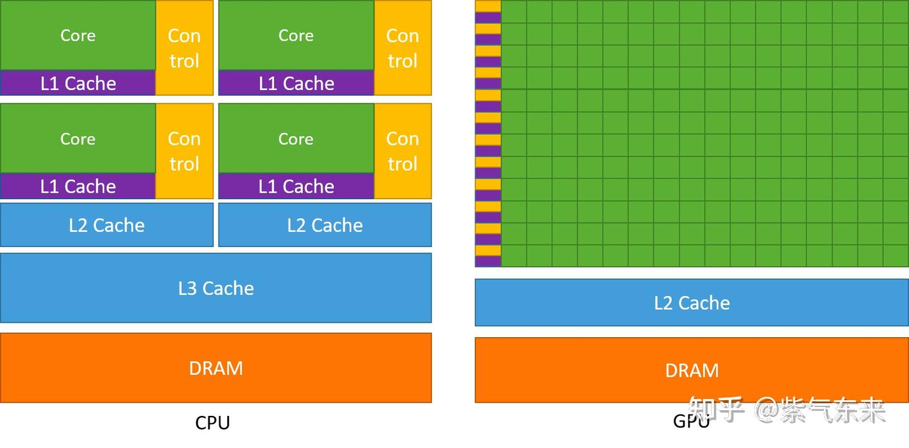
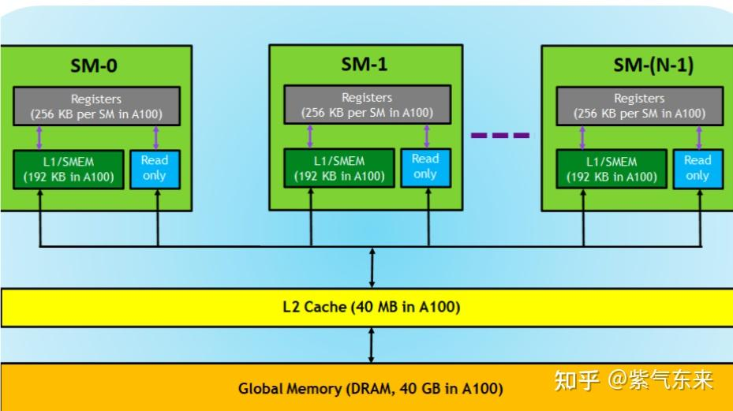
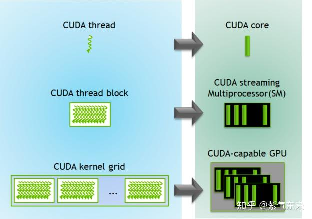
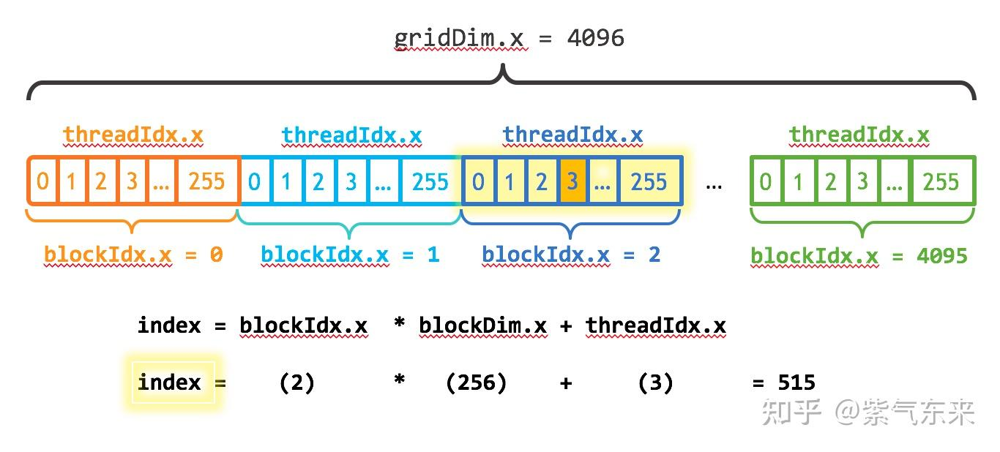
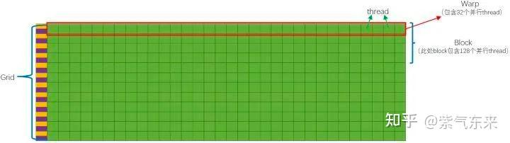
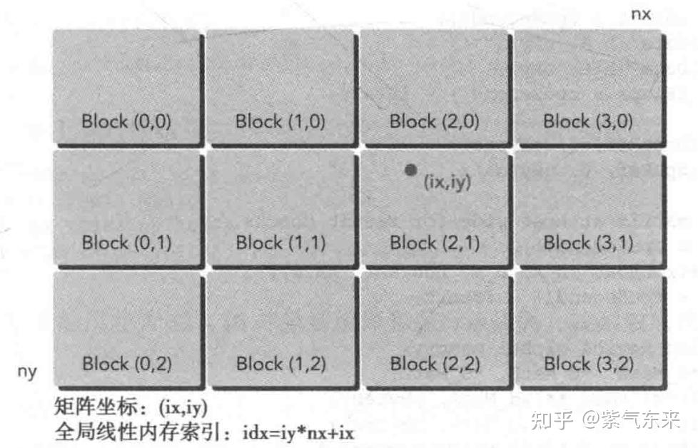

# CUDA (1): CUDA 프로그래밍 기초

> 원문: https://zhuanlan.zhihu.com/p/645330027

**목차**
- 1. GPU와 CUDA 구조
  - 1.1 GPU 다시 보기
  - 1.2 CUDA 구조
- 2. CUDA 프로그래밍의 요소
- 3. 실습: PyTorch에서 커스텀 CUDA 연산자 작성
  - 3.1 연산자 작성
  - 3.2 Torch C++ 래핑
  - 3.3 컴파일 및 호출 방법
- 참고 자료

## 1. GPU와 CUDA 구조

### 1.1 GPU 다시 보기

프로세서를 평가할 때 가장 중요한 지표는 두 가지입니다: **지연(latency)** 과 **처리량(throughput)**. 지연은 명령어를 발행한 시점부터 최종 결과가 돌아오는 시점까지의 시간 간격이고, 처리량은 단위 시간당 처리하는 명령어 수입니다. 이 두 측면에서 GPU와 CPU를 비교해 봅시다.

아래 그림 왼쪽이 CPU의 모식도이고, 다음과 같은 특징을 가집니다.

- **CPU에는 다단계의 고속 캐시 구조가 들어 있습니다.** 명령어가 저장소에 접근하는 속도를 끌어올립니다.
- **CPU는 많은 제어 유닛을 갖고 있습니다.** 구체적으로는 분기 예측 메커니즘과 파이프라인 forwarding 메커니즘 두 가지입니다.
- **CPU의 연산 유닛(Core)이 강력합니다.** 정수·부동소수의 복잡 연산이 빠릅니다.

이 세 가지 때문에 CPU의 설계 방향은 명령어 지연을 줄이는 것이며, **지연 지향 설계(latency-oriented design)** 라 부릅니다.

아래 그림 오른쪽은 GPU의 모식도이며 다음과 같은 특징이 있습니다.

- **GPU에도 캐시 구조가 있지만 양이 적습니다.** 명령어가 캐시에 접근하는 횟수를 줄이기 위해서입니다.
- **GPU의 제어 유닛은 매우 단순합니다.** 분기 예측이나 데이터 forwarding이 없어, 복잡한 명령 연산은 느려질 수 있습니다.
- **GPU의 연산 유닛(Core) 수는 매우 많고, 긴 지연 파이프라인으로 높은 처리량을 달성합니다.** 한 행의 연산 유닛에는 제어기가 단 하나뿐인데, 이는 한 행의 연산 유닛이 같은 명령어를 사용하고 데이터만 다르다는 뜻입니다. 이런 일사불란한 연산 방식 덕분에 GPU는 제어가 단순하지만 연산 효율이 높은 명령에서 효율이 크게 증가합니다.

이를 바탕으로 GPU는 한 가지 원칙을 핵심으로 설계되었음을 알 수 있습니다. 즉 **단순 명령의 처리량을 늘리는 것**으로, **처리량 지향 설계(throughput-oriented design)** 라 부릅니다.


*GPU vs CPU*

설계 원칙이 다르기 때문에 두 프로세서가 잘 다루는 시나리오도 다릅니다.

- CPU는 연속 계산에서 지연 우선. 단일 복잡 명령의 지연이 GPU보다 10배 이상 빠릅니다.
- GPU는 병렬 계산에서 처리량 우선. 단위 시간에 실행하는 명령 수가 CPU보다 10배 이상입니다.

좀 더 구체적으로 GPU에 적합한 시나리오는:

- **연산 집약적**: 수치 연산의 비율이 메모리 접근보다 훨씬 큼. 메모리 접근 지연이 연산으로 가려질 수 있습니다.
- **데이터 병렬**: 큰 작업이 같은 명령을 실행하는 작은 작업으로 분해될 수 있음. 복잡한 흐름 제어 수요가 낮습니다.

### 1.2 CUDA 구조

CUDA (Compute Unified Device Architecture)는 GPU 범용 컴퓨팅을 지원하는 플랫폼이자 프로그래밍 모델이며, C/C++ 언어 확장과 GPU 프로그래밍·관리용 API를 제공합니다.

하드웨어 관점에서 CUDA 메모리 모델의 기본 단위는 **SP (스레드 프로세서, Streaming Processor)** 입니다. 각 SP는 자기만의 **레지스터(registers)** 와 **로컬 메모리(local memory)** 를 가집니다. 레지스터와 로컬 메모리는 자기 자신만 접근할 수 있으며, 서로 다른 SP는 독립적입니다.

여러 SP와 한 블록의 공유 메모리로 구성되는 것이 **SM (스트리밍 멀티프로세서, Streaming Multiprocessor)** (회색 부분)입니다. SM 내부의 여러 SP는 서로 병렬이며 영향을 주고받지 않습니다. 각 SM은 자기 자신의 **shared memory (공유 메모리)** 를 갖고 있으며, shared memory는 thread block 내 모든 thread가 접근할 수 있습니다.

더 위로 가면, SM과 한 덩어리의 글로벌 메모리가 합쳐져 GPU가 됩니다. 한 GPU의 모든 SM은 하나의 **global memory (전역 메모리)** 를 공유하며, 서로 다른 block의 thread도 사용할 수 있습니다.

위 내용을 정리하면: 모든 thread는 자기 자신의 register와 local memory 영역을 가지며, 같은 block 안의 thread는 하나의 share memory를 공유합니다. 그 외 (서로 다른 block의 thread를 포함한) 모든 thread는 하나의 global memory를 공유합니다. 서로 다른 grid는 각자의 global memory를 갖습니다.


*CUDA 메모리 모델 (하드웨어)*

소프트웨어 관점:

- SP는 **thread** 에 대응
- SM은 **thread block** 에 대응
- 디바이스(device)는 **그리드(grid)** (블록 집합체)에 대응

thread block은 소프트웨어 측 메모리 모델의 가장 기본적인 실행 단위이므로, 여기서부터 정리합니다. thread block은 스레드의 조합이며 다음과 같은 특징이 있습니다.

- block 내부 스레드는 공유 메모리, 원자 연산, 배리어 동기화(shared memory, atomic operations, barrier synchronization)를 통해 협력합니다.
- 서로 다른 block의 스레드는 협력할 수 없습니다.


*CUDA 메모리 모델 (소프트웨어)*

## 2. CUDA 프로그래밍의 요소

CUDA C++에서 정의하는 기본 함수 실행 단위를 **kernel** 이라 합니다. kernel은 호출 시 N개의 서로 다른 CUDA 스레드에 의해 N번 병렬 실행되며, 일반 C++ 함수처럼 한 번만 실행되는 것이 아닙니다.

스레드의 인덱스와 ID 관계는 매우 간단합니다.

- 1차원 block의 경우 두 값이 같습니다.
- 크기가 `(Dx, Dy)`인 2차원 block에서 인덱스 `(x, y)`인 스레드의 ID는 `x + y · Dx` 입니다.
- 크기가 `(Dx, Dy, Dz)`인 3차원 block에서 인덱스 `(x, y, z)`인 스레드의 ID는 `x + y · Dx + z · Dx · Dy` 입니다.

다음 코드는 N×N 크기의 행렬 A와 B를 더해 C에 저장합니다.

```cuda
// Kernel definition
__global__ void MatAdd(float A[N][N], float B[N][N],
                       float C[N][N])
{
    int i = threadIdx.x;
    int j = threadIdx.y;
    C[i][j] = A[i][j] + B[i][j];
}

int main()
{
    ...
    // Kernel invocation with one block of N * N * 1 threads
    int numBlocks = 1;
    dim3 threadsPerBlock(N, N);
    MatAdd<<<numBlocks, threadsPerBlock>>>(A, B, C);
    ...
}
```

각 block의 스레드 수는 제한이 있는데, block의 모든 스레드가 같은 SM 코어에 상주하면서 그 코어의 한정된 메모리 자원을 공유해야 하기 때문입니다. A100 기준 한 block은 최대 1024개의 스레드를 가질 수 있습니다. 하나의 커널은 같은 모양의 여러 block으로 실행될 수 있으므로, 총 스레드 수는 block당 스레드 수와 block 수의 곱입니다.

grid의 각 block은 1·2·3차원 고유 인덱스로 식별할 수 있고, 커널 내부에서는 빌트인 변수 `blockIdx`로 접근합니다. block의 크기는 빌트인 변수 `blockDim`으로 접근합니다.



앞의 `MatAdd()` 예제를 다중 block 처리로 확장하면 다음과 같습니다.

```cuda
// Kernel definition
__global__ void MatAdd(float A[N][N], float B[N][N],
                       float C[N][N])
{
    int i = blockIdx.x * blockDim.x + threadIdx.x;
    int j = blockIdx.y * blockDim.y + threadIdx.y;
    if (i < N && j < N)
        C[i][j] = A[i][j] + B[i][j];
}

int main()
{
    ...
    // Kernel invocation
    dim3 threadsPerBlock(16, 16);
    dim3 numBlocks(N / threadsPerBlock.x, N / threadsPerBlock.y);
    MatAdd<<<numBlocks, threadsPerBlock>>>(A, B, C);
    ...
}
```

각 block에 `16 × 16`개의 스레드를 사용했습니다. thread block은 독립적으로 실행될 수 있어야 합니다. 어떤 순서로(병렬 또는 직렬로) 실행되어도 정상 동작해야 합니다. block 내부의 스레드는 어떤 공유 메모리를 통해 데이터를 공유하고 실행을 동기화해 메모리 접근을 조율할 수 있습니다. 더 정확히는, 커널 내부에서 `__syncthreads()` 내장 함수를 호출해 동기화 지점을 지정할 수 있습니다. `__syncthreads()`는 배리어 역할을 하며, block 내 모든 스레드가 도착할 때까지 누구도 진행하지 않습니다.

앞서 언급했듯이, GPU의 **한 행은 1개 제어 유닛과 다수의 계산 유닛으로 구성되고, 모든 계산 유닛이 동일한 제어 명령을 실행** 합니다. 이는 전형적인 **"단일 명령 다중 데이터 흐름(SIMD)"** 메커니즘입니다.

단일 명령 다중 데이터 메커니즘이란, 실행되는 명령은 하나지만 계산 유닛마다 데이터가 다르다는 뜻입니다. 위에서 말한 "한 행"을 **warp(스레드 워프, 线程束)** 라 합니다.

따라서 SM은 SIMT (Single-Instruction, Multiple-Thread) 아키텍처를 채택하며, **warp가 가장 기본적인 실행 단위** 입니다. 한 warp는 32개의 병렬 thread를 포함하며, 이들은 다른 데이터로 같은 명령을 실행합니다. 한 warp는 단 하나의 명령만 갖기에 **warp는 본질적으로 GPU에서 thread가 실행되는 최소 단위** 입니다.

**warp 크기가 32이기 때문에, block의 thread 수는 일반적으로 32의 배수로 설정합니다.**

커널이 실행될 때 grid 내의 thread block이 SM에 배정됩니다. 한 block의 thread는 단 하나의 SM에서만 스케줄되며, SM은 일반적으로 여러 block을 스케줄할 수 있습니다. 대량의 thread가 서로 다른 SM에 분배될 수 있습니다. 각 thread는 자기만의 프로그램 카운터와 상태 레지스터를 갖고, 자기 데이터로 명령을 실행합니다. 이것이 바로 SIMT(Single Instruction Multiple Thread)입니다.



## 3. 실습: PyTorch에서 커스텀 CUDA 연산자 작성

여기까지 CUDA의 계산 방식을 기본적으로 익혔으니, 이번 절에서는 CUDA로 간단한 연산자를 정의하고 PyTorch에서 호출해 봅니다. 본 예제는 [godweiyang/NN-CUDA-Example](https://github.com/godweiyang/NN-CUDA-Example) 를 주로 참고했고, 재구성한 코드를 [ifromeast/cuda_learning/01_cuda_op](https://github.com/ifromeast/cuda_learning/tree/main/01_cuda_op) 에 동기화해 두었습니다.

### 3.1 연산자 작성

여기서 구현할 기능은 `n × n` 모양 텐서 두 개의 덧셈입니다. block과 grid 모두 2차원이고, 각 block에는 `16 × 16`개의 스레드, 총 `n/16 × n/16`개의 block이 있습니다.

커널의 핵심 단계는 각 스레드의 스레드 인덱스를 글로벌 선형 메모리 인덱스로 매핑하는 것입니다. 대응 관계는 아래와 같습니다.



구현은 다음과 같습니다. `MatAdd`는 GPU 측에서 실행되는 kernel 함수이고, `launch_add2`는 CPU 측 실행 함수로 kernel을 호출하는 비동기 함수입니다. 호출 후 즉시 제어권이 CPU로 돌아옵니다.

```cuda
__global__ void MatAdd(float* c,
                       const float* a,
                       const float* b,
                       int n)
{
    int i = blockIdx.x * blockDim.x + threadIdx.x;
    int j = blockIdx.y * blockDim.y + threadIdx.y;
    int idx = j*n + i;
    if (i < n && j < n)
        c[idx] = a[idx] + b[idx];
}

void launch_add2(float* c,
                 const float* a,
                 const float* b,
                 int n) {
    dim3 block(16, 16);
    dim3 grid(n/block.x, n/block.y);

    MatAdd<<<grid, block>>>(c, a, b, n);
}
```

연산자를 작성한 다음에는 Torch와 CUDA 연산자를 잇는 다리를 놓아야 합니다.

### 3.2 Torch C++ 래핑

PyTorch는 CUDA kernel 함수를 직접 호출할 수 없으므로 인터페이스가 필요합니다. 이 기능은 `add2_ops.cpp` 에서 구현합니다.

```cpp
#include <torch/extension.h>
#include "add2.h"

void torch_launch_add2(torch::Tensor &c,
                       const torch::Tensor &a,
                       const torch::Tensor &b,
                       int64_t n) {
    launch_add2((float *)c.data_ptr(),
                (const float *)a.data_ptr(),
                (const float *)b.data_ptr(),
                n);
}

PYBIND11_MODULE(TORCH_EXTENSION_NAME, m) {
    m.def("torch_launch_add2",
          &torch_launch_add2,
          "add2 kernel warpper");
}

TORCH_LIBRARY(add2, m) {
    m.def("torch_launch_add2", torch_launch_add2);
}
```

`torch_launch_add2`는 C++ 버전의 torch tensor를 받아 C++ 포인터 배열로 변환한 뒤, CUDA 함수 `launch_add2`를 호출해 커널을 실행합니다. pybind11로 `torch_launch_add2`를 래핑하고 cmake로 컴파일하면 Python에서 호출 가능한 `.so` 라이브러리가 만들어집니다.

Torch에서 CUDA 연산자를 사용하는 단계는 크게 세 가지입니다.

- CUDA 연산자와 그 호출 함수를 먼저 작성합니다.
- 그다음 Torch cpp 함수를 작성해 PyTorch와 CUDA를 연결하고, pybind11로 래핑합니다.
- 마지막으로 PyTorch의 cpp 확장 라이브러리로 컴파일하고 호출합니다.

### 3.3 컴파일 및 호출 방법

**JIT 컴파일 호출**

JIT (just-in-time, 즉시 컴파일)란, Python 코드를 실행할 때 cpp/cuda 파일을 그제서야 컴파일하는 방식입니다.

먼저 즉시 컴파일할 파일을 로드한 다음 인터페이스 함수를 호출합니다.

```python
from torch.utils.cpp_extension import load
cuda_module = load(name="add2",
                   extra_include_paths=["include"],
                   sources=["kernel/add2_ops.cpp", "kernel/add2_kernel.cu"],
                   verbose=True)

cuda_module.torch_launch_add2(cuda_c, a, b, n)
```

다음 명령으로 실행합니다.

```bash
python run_time.py --compiler jit
```

V100에서 결과는 다음과 같습니다.

```
Using /root/.cache/torch_extensions/py310_cu117 as PyTorch extensions root...
Detected CUDA files, patching ldflags
Emitting ninja build file /root/.cache/torch_extensions/py310_cu117/add2/build.ninja...
Building extension module add2...
Allowing ninja to set a default number of workers... (overridable by setting the environment variable MAX_JOBS=N)
ninja: no work to do.
Loading extension module add2...
Running cuda...
Cuda time:  2443.504us
Running torch...
Torch time:  2450.132us
Kernel test passed.
```

H100에서의 컴파일 과정과 결과는 다음과 같습니다.

```
[1/3] /usr/local/cuda-12.4/bin/nvcc --generate-dependencies-with-compile --dependency-output add2_kernel.cuda.o.d -DTORCH_EXTENSION_NAME=add2 -DTORCH_API_INCLUDE_EXTENSION_H -DPYBIND11_COMPILER_TYPE=\"_gcc\" -DPYBIND11_STDLIB=\"_libstdcpp\" -DPYBIND11_BUILD_ABI=\"_cxxabi1016\" -I/data/zzd/cuda_learning/01_cuda_op/include -isystem /data/zzd/miniconda3/lib/python3.13/site-packages/torch/include -isystem /data/zzd/miniconda3/lib/python3.13/site-packages/torch/include/torch/csrc/api/include -isystem /usr/local/cuda-12.4/include -isystem /data/zzd/miniconda3/include/python3.13 -D_GLIBCXX_USE_CXX11_ABI=1 -D__CUDA_NO_HALF_OPERATORS__ -D__CUDA_NO_HALF_CONVERSIONS__ -D__CUDA_NO_BFLOAT16_CONVERSIONS__ -D__CUDA_NO_HALF2_OPERATORS__ --expt-relaxed-constexpr -gencode=arch=compute_90,code=compute_90 -gencode=arch=compute_90,code=sm_90 --compiler-options '-fPIC' -std=c++17 -c /data/zzd/cuda_learning/01_cuda_op/kernel/add2_kernel.cu -o add2_kernel.cuda.o
[2/3] c++ -MMD -MF add2_ops.o.d -DTORCH_EXTENSION_NAME=add2 -DTORCH_API_INCLUDE_EXTENSION_H -DPYBIND11_COMPILER_TYPE=\"_gcc\" -DPYBIND11_STDLIB=\"_libstdcpp\" -DPYBIND11_BUILD_ABI=\"_cxxabi1016\" -I/data/zzd/cuda_learning/01_cuda_op/include -isystem /data/zzd/miniconda3/lib/python3.13/site-packages/torch/include -isystem /data/zzd/miniconda3/lib/python3.13/site-packages/torch/include/torch/csrc/api/include -isystem /usr/local/cuda-12.4/include -isystem /data/zzd/miniconda3/include/python3.13 -D_GLIBCXX_USE_CXX11_ABI=1 -fPIC -std=c++17 -c /data/zzd/cuda_learning/01_cuda_op/kernel/add2_ops.cpp -o add2_ops.o
[3/3] c++ add2_ops.o add2_kernel.cuda.o -shared -L/data/zzd/miniconda3/lib/python3.13/site-packages/torch/lib -lc10 -lc10_cuda -ltorch_cpu -ltorch_cuda -ltorch -ltorch_python -L/usr/local/cuda-12.4/lib64 -lcudart -o add2.so
Loading extension module add2...
Running cuda...
Cuda time:  16.427us
Running torch...
Torch time:  15.330us
Kernel test passed.
```

**SETUP 컴파일 호출**

두 번째 방법은 Setuptools로 `setup.py`를 작성하는 것입니다. 구체적으로는 먼저 Torch의 `CUDAExtension` 모듈을 호출해 연산자를 `add2`로 등록하고, `include_dirs`에 헤더 디렉터리, `ext_modules`에 연산자 및 래퍼 함수를 추가합니다.

```python
from setuptools import setup
from torch.utils.cpp_extension import BuildExtension, CUDAExtension

setup(
    name="add2",
    include_dirs=["include"],
    ext_modules=[
        CUDAExtension(
            "add2",
            ["kernel/add2_ops.cpp", "kernel/add2_kernel.cu"],
        )
    ],
    cmdclass={
        "build_ext": BuildExtension
    }
)
```

이어서 컴파일·실행합니다.

```bash
python setup.py install
```

컴파일의 핵심은 다음 동작입니다.

```
[1/2] nvcc -c add2_kernel.cu -o add2_kernel.o
[2/2] c++ -c add2.cpp -o add2.o
x86_64-linux-gnu-g++ -shared add2.o add2_kernel.o -o add2.cpython-37m-x86_64-linux-gnu.so
```

이러면 동적 링크 라이브러리가 생기고, `add2`가 Python 모듈로 등록되어 `import add2` 만으로 호출할 수 있습니다.

마지막으로 다음과 같이 호출합니다.

```python
import torch
import add2
add2.torch_launch_add2(c, a, b, n)
```

실행 명령:

```bash
python run_time.py --compiler setup
```

V100 결과:

```
Running cuda...
Cuda time:  2445.340us
Running torch...
Torch time:  2449.226us
Kernel test passed.
```

H100 결과:

```
Running cuda...
Cuda time:  13.733us
Running torch...
Torch time:  14.949us
Kernel test passed.
```

**CMAKE 컴파일 호출**

마지막으로 cmake로 컴파일하는 방식입니다. `CMakeLists.txt` 작성 시 주의할 점은 의존 라이브러리 매칭, 컴파일 과정, 심볼릭 링크 생성입니다.

```cmake
cmake_minimum_required(VERSION 3.1 FATAL_ERROR)
# modify to your own nvcc path, or delete it if ok
set(CMAKE_CUDA_COMPILER "/usr/local/cuda/bin/nvcc")
project(add2 LANGUAGES CXX CUDA)

find_package(Python REQUIRED)
find_package(CUDA REQUIRED)

execute_process(
    COMMAND
        ${Python_EXECUTABLE} -c
            "import torch.utils; print(torch.utils.cmake_prefix_path)"
    OUTPUT_STRIP_TRAILING_WHITESPACE
    OUTPUT_VARIABLE DCMAKE_PREFIX_PATH)

set(CMAKE_PREFIX_PATH "${DCMAKE_PREFIX_PATH}")

find_package(Torch REQUIRED)
find_library(TORCH_PYTHON_LIBRARY torch_python PATHS "${TORCH_INSTALL_PREFIX}/lib")

# modify to your own python path, or delete it if ok
include_directories(/usr/include/python3.7)
include_directories(../include)

set(SRCS ../kernel/add2_ops.cpp ../kernel/add2_kernel.cu)
add_library(add2 SHARED ${SRCS})

target_link_libraries(add2 "${TORCH_LIBRARIES}" "${TORCH_PYTHON_LIBRARY}")
```

다음 명령으로 컴파일합니다.

```bash
mkdir build
cd build
cmake ..
make
```

make 로그를 보면 컴파일 과정과 동적 링크 생성을 확인할 수 있습니다.

```
[ 33%] Building CXX object CMakeFiles/add2.dir/kernel/add2_ops.cpp.o
[ 66%] Building CUDA object CMakeFiles/add2.dir/kernel/add2_kernel.cu.o
[100%] Linking CXX shared library libadd2.so
[100%] Built target add2
```

cpp 쪽에서는 `TORCH_LIBRARY`로 래핑합니다.

```cpp
TORCH_LIBRARY(add2, m) {
    m.def("torch_launch_add2", torch_launch_add2);
}
```

최종적으로 `build` 디렉터리에 `libadd2.so`가 생성됩니다. Python에서는 다음과 같이 호출합니다.

```python
import torch
torch.ops.load_library("build/libadd2.so")
torch.ops.add2.torch_launch_add2(c, a, b, n)
```

실행 명령:

```bash
python run_time.py --compiler cmake
```

V100 결과:

```
Running cuda...
Cuda time:  2454.185us
Running torch...
Torch time:  2445.102us
Kernel test passed.
```

H100 결과:

```
Running cuda...
Cuda time:  18.907us
Running torch...
Torch time:  16.665us
Kernel test passed.
```

## 참고 자료

1. https://docs.nvidia.com/cuda/cuda-c-programming-guide/index.html
2. CUDA 编程上手指南(一)：CUDA C 编程及 GPU 基本知识
3. https://github.com/godweiyang/NN-CUDA-Example
4. https://godweiyang.com/2021/03/18/torch-cpp-cuda/
5. https://godweiyang.com/2021/03/21/torch-cpp-cuda-2/

> 渺萬里層雲, 千山暮雪, 隻影向誰去? — 元好問 《摸魚兒·雁丘詞》
