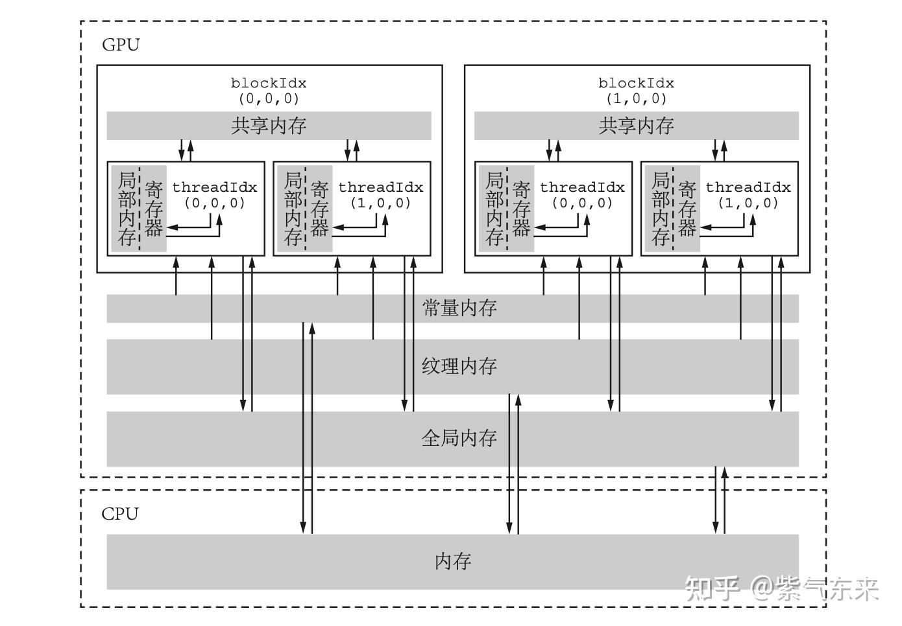
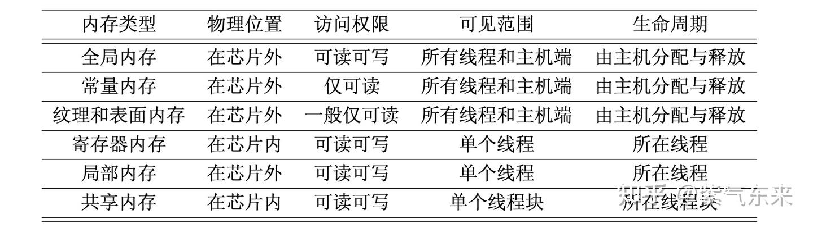
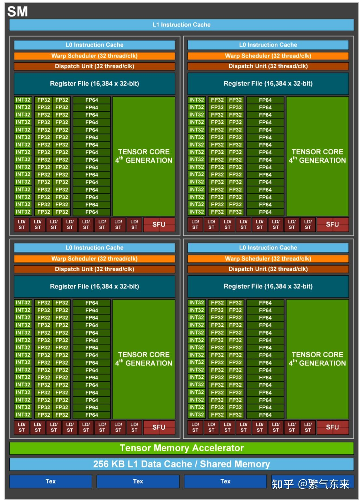
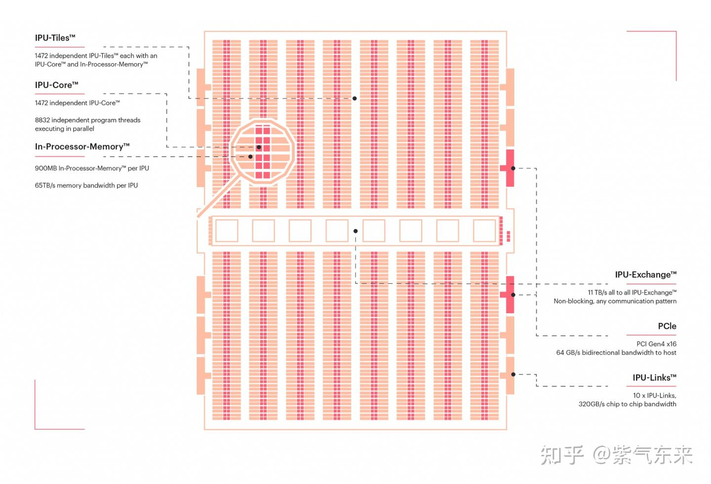
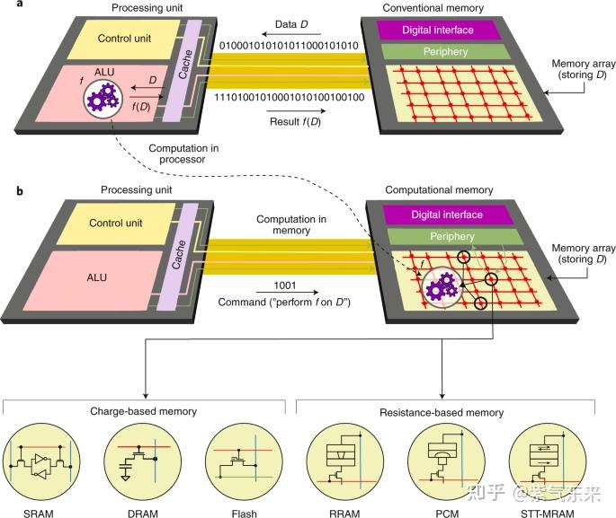
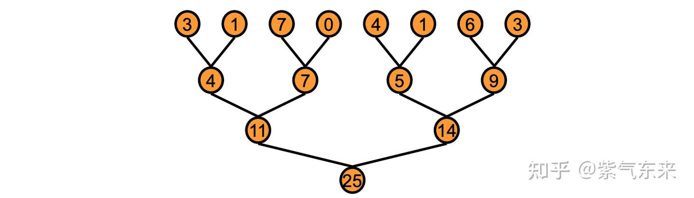
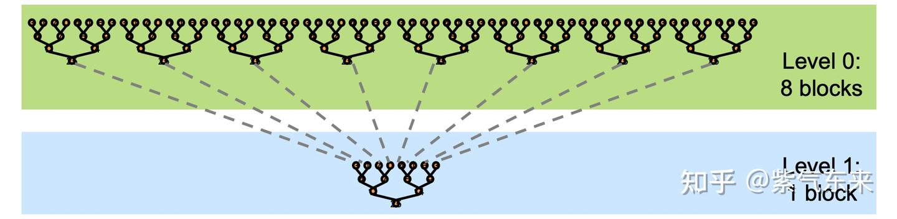
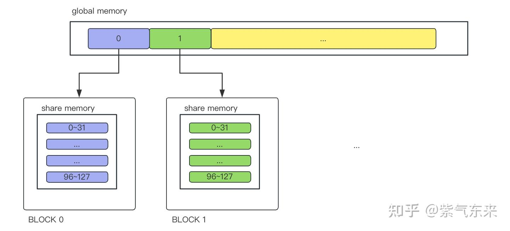
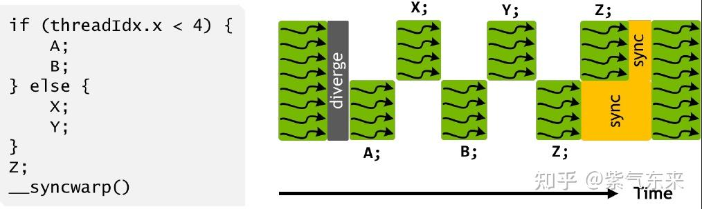

# CUDA (2): GPU의 메모리 체계와 최적화 가이드

> 원문: https://zhuanlan.zhihu.com/p/654027980

**목차**
- 1. GPU의 메모리 체계
  - 1.1 단계별 메모리와 그 특징
  - 1.2 SM 구성과 대표 GPU 비교
  - 1.3 GPU를 넘어: 근접 메모리 컴퓨팅과 인메모리 컴퓨팅
- 2. Reduction 연산으로 이해하는 GPU 메모리 체계
  - 2.1 전역 메모리만으로 reduction
  - 2.2 공유 메모리로 reduction
  - 2.3 동적 공유 메모리로 reduction
  - 2.4 reduction의 또 다른 최적화
- 참고 자료

앞 글에서는 GPU의 구조적 특징을 간단히 소개했습니다(B48 참조).

폰 노이만 구조 하드웨어에서 고성능 컴퓨팅을 구현하려면 두 가지가 가장 중요합니다: **메모리 접근**과 **연산**. 이 둘은 각각 IO bound, compute bound에 대응하고, 하드웨어 시스템의 메모리 체계가 이 둘을 크게 좌우합니다. 따라서 소프트웨어 레벨의 고성능 컴퓨팅을 위해서는 메모리 체계를 깊이 이해해야 합니다. 이 글에서는 GPU의 메모리 체계를 다루고, 그 기반 위에서 CUDA 프로그래밍 실습을 진행합니다.

## 1. GPU의 메모리 체계

메모리 접근과 관리는 프로그래밍 언어의 중요한 구성 요소이자 고성능 컴퓨팅의 핵심입니다. CUDA 메모리 모델은 호스트와 디바이스 양쪽의 메모리 시스템을 결합한 완전한 계층 구조를 가지며, 명시적으로 제어·최적화할 수 있습니다.

### 1.1 단계별 메모리와 그 특징

아래 그림은 CUDA 메모리 모델의 계층 구조입니다. 각각 다른 scope, lifetime, 캐싱 동작을 가지며 차례로 소개합니다.


*CUDA 메모리 모델의 계층 구조*

- **전역 메모리(global memory)**

전역 메모리는 GPU에서 가장 크고, 지연이 가장 길며, 가장 오래 사용되는 메모리입니다. 흔히 말하는 "VRAM"의 대부분이 전역 메모리입니다. 선언된 전역 메모리는 어떤 SM에서도 접근 가능하며, 애플리케이션 전체 생명주기 동안 유지됩니다.

전역 메모리의 주된 역할은 커널 함수에 데이터를 공급하고 호스트↔디바이스, 디바이스↔디바이스 간 데이터 전달입니다. `cudaMemcpy` 함수로 호스트 데이터를 전역 메모리에 복사하거나 그 반대를 할 수 있습니다. 예를 들어 M 바이트 데이터를 호스트에서 디바이스로 복사하는 코드:

```cpp
cudaMemcpy(d_x, h_x, M, cudaMemcpyHostToDevice);
```

전역 메모리 변수는 정적·동적으로 선언할 수 있습니다. 정적 전역 메모리 변수는 함수 외부에서 다음과 같이 정의합니다.

```cpp
__device__ T x;     // 단일 변수
__device__ T y[N];  // 고정 길이 배열
```

뒤에서 전역 메모리 접근을 어떻게 최적화하고 데이터 처리량을 높일지 중점적으로 다룹니다.

- **상수 메모리(constant memory)**

상수 메모리는 칩 외부(off-chip) 디바이스 메모리에 저장되지만, 전용 상수 캐시(constant cache)를 통해 캐싱·읽기되는 읽기 전용 메모리입니다. 용량이 제한적이라 총 64 KB뿐입니다. 캐시 덕분에 접근 속도가 전역 메모리보다 빠르지만, 그 전제는 **한 warp의 32개 thread가 같은 상수 메모리 데이터를 읽어야 한다는 점** 입니다.

상수 메모리는 커널 외부에서 `__constant__`로 변수를 정의하고, API `cudaMemcpyToSymbol`로 호스트의 데이터를 디바이스의 상수 메모리에 복사한 뒤 커널이 사용합니다.

- **텍스처 메모리(texture memory)와 표면 메모리(surface memory)**

텍스처 메모리·표면 메모리는 상수 메모리와 유사한 캐시 보유형 전역 메모리이며, 가시 범위와 lifetime이 같습니다. 일반적으로 읽기 전용(표면 메모리는 쓰기도 가능)입니다. 차이점은 용량이 더 크고, 사용 방식이 상수 메모리와 다르다는 점입니다.

- **레지스터(register)**

레지스터는 스레드가 독립적으로 접근할 수 있는 자원으로, 로컬 메모리와는 달리 on-chip 저장소이며 스레드의 임시 데이터를 저장합니다. 접근 속도가 **가장 빠른** 반면 용량은 작습니다.

커널 함수에서 한정자 없이 정의된 변수는 일반적으로 레지스터에 저장됩니다. `gridDim`, `blockDim`, `blockIdx`, `threadIdx`, `warpSize` 같은 빌트인 변수도 효율적인 접근을 위해 특별한 레지스터에 보관됩니다. 앞 절의 덧셈 예제에서:

```cuda
const int n = blockDim.x * blockIdx.x + threadIdx.x;
c[n] = a[n] + b[n];
```

여기서 `n`이 레지스터 변수입니다. 레지스터 변수는 단일 스레드에서만 보입니다. 즉 모든 스레드가 변수 `n`의 복제본을 갖고 있고, 같은 이름이지만 스레드마다 값이 다를 수 있습니다. 각 스레드는 자기 복제본만 읽고 쓸 수 있습니다. 레지스터 생명주기는 소속 스레드의 생명주기와 동일하며, 정의 시점부터 스레드 소멸 시점까지입니다.

- **로컬 메모리(local memory)**

로컬 메모리는 사용법상 레지스터와 거의 같습니다. 한정자가 없는 변수도 레지스터에 들어갈 수도, 로컬 메모리에 들어갈 수도 있습니다. 레지스터에 다 못 들어가는 변수나, 인덱스가 컴파일 타임에 결정되지 않는 배열 등이 로컬 메모리에 갈 수 있습니다.

사용법이 레지스터와 비슷하긴 해도, 하드웨어 관점에서 로컬 메모리는 사실 전역 메모리의 일부입니다. 따라서 지연도 큽니다. 한 스레드가 사용할 수 있는 로컬 메모리는 최대 512 KB이지만, 많이 쓸수록 성능이 떨어집니다.

- **공유 메모리(shared memory)**

공유 메모리는 레지스터와 비슷하게 칩 위에 존재하며, 레지스터 다음으로 빠른 R/W 속도를 갖습니다. 용량도 한정적입니다. `__shared__` 한정자로 변수를 정의할 수 있습니다.

레지스터와 다른 점은, 공유 메모리는 thread block 전체에 가시적이며 lifetime도 thread block과 같다는 것입니다. 즉 각 thread block마다 공유 메모리 변수의 복제본이 있고, 다른 block의 복제본 값과 다를 수 있습니다. 한 block의 모든 스레드는 해당 block의 공유 메모리 복제본에 접근할 수 있지만, 다른 block의 복제본엔 접근할 수 없습니다. 공유 메모리의 주된 역할은 전역 메모리 접근 횟수를 줄이거나 접근 패턴을 개선하는 것입니다.

위 메모리들의 주요 특징은 다음 표와 같습니다.



- **L1·L2 캐시**

각 SM은 자체 L1 캐시를 가지며, 모든 SM이 하나의 L2 캐시를 공유합니다. L1·L2 캐시는 로컬·전역 메모리 데이터를 저장하고, 레지스터에서 넘친 부분도 보관해 지연을 줄입니다.

물리적 구조로 보면 최신 GPU에서는 L1 캐시·텍스처 캐시·공유 메모리 세 가지가 통합되어 있습니다. 다만 프로그래밍 관점에서는 공유 메모리는 사용자가 완전히 제어하는 프로그래머블 캐시이고, L1·L2는 컴파일러에게 일부 힌트만 줄 수 있는 비프로그래머블 캐시입니다.

### 1.2 SM 구성과 대표 GPU 비교

GPU는 다수의 SM으로 구성됩니다. 한 SM은 다음 자원을 포함합니다.

- 일정 수의 레지스터
- 일정량의 공유 메모리
- 상수 메모리 캐시
- 텍스처·표면 메모리 캐시
- L1 캐시
- warp scheduler
- 실행 코어, 다음을 포함:
  - 정수 연산 코어(INT32) 여러 개
  - 단정밀도 부동소수(FP32) 코어 여러 개
  - 배정밀도 부동소수(FP64) 코어 여러 개
  - 단정밀도 초월 함수(transcendental functions)용 Special Function Unit(SFU) 여러 개
  - 혼합 정밀도 Tensor Core 여러 개

아래는 H100의 SM 구조도입니다. 위의 각 요소를 그림에서 찾아볼 수 있습니다.


*H100의 SM 구조도*

메모리 체계와 성능의 관계를 더 잘 이해하기 위해, 현재 주류 GPU의 스펙을 정리합니다.

| GPU | V100 | A100 | H100 | L40S |
| --- | --- | --- | --- | --- |
| GPU Architecture | Volta | Ampere | Hopper | Ada Lovelace |
| Memory Interface | 4096-bit HBM2 | 5120-bit HBM2 | 5120-bit HBM3 | GDDR6 |
| Memory Size | 32 GB / 16 GB | 40 GB | 80 GB | 48 GB |
| Memory Bandwidth | 900 GB/s | 1555 GB/s | 3000 GB/s | 864 GB/s |
| SMs | 80 | 108 | 132 | 142 |
| Texture Units | 320 | 432 | 528 | 576 |
| L2 Cache Size | 6144 KB | 40 MB | 50 MB | 96 MB |
| Shared Memory Size / SM | up to 96 KB | up to 164 KB | up to 228 KB | up to 128 KB |
| Register File Size / SM | 256 KB | 256 KB | 256 KB | 256 KB |
| Peak FP16 TFLOPS | 31.4 | 78 | 120 | 90.52 |

### 1.3 GPU를 넘어: 근접 메모리 컴퓨팅과 인메모리 컴퓨팅

GPU 계층 구조 외에도, 메모리 접근 비용을 낮추고 더 높은 성능을 얻기 위해 **near-memory computing**(근접 메모리 컴퓨팅)과 **in-memory computing**(인메모리 컴퓨팅, 存算一體) 이 떠오르고 있습니다.

**근접 메모리 컴퓨팅: Graphcore IPU 예**

IPU 칩은 고속 칩 외부 저장소가 없습니다. 저장소를 칩 안으로 가져왔죠. 칩 전체는 1472개의 코어(*Tile*)로 구성되고, 각 Tile은 독립된 연산 유닛과 저장 유닛을 갖습니다. 칩 전체 저장소는 분산되어 있고, 각 Tile에 624 KB의 SRAM이 있어 칩 전체 저장 크기는 `624 KB × 1472 = 900 MB`입니다.

IPU 칩은 순수 분산 아키텍처이며, 각 Tile이 자기 저장소와 연산 자원을 갖고 MIMD 아키텍처(NVIDIA CUDA의 SIMT와 다름)를 사용합니다. Tile마다 독립적으로 명령을 실행하고 메모리에 독립적으로 접근할 수 있습니다. Tile 간 메모리는 공유 접근이 불가능하며, 자기 Tile 내부 메모리(*local memory*)만 접근할 수 있습니다. 따라서 칩 전체의 메모리 대역폭 = Tile 메모리 대역폭 × Tile 수.


*Graphcore IPU 구조도*

**인메모리 컴퓨팅: 후모지능 H30 예**

인메모리 컴퓨팅의 핵심은 저장 셀 자체에 알고리즘을 임베드해 계산이 저장 셀 안에서 이뤄지게 하는 것입니다.

홍투™H30은 다수의 저장-연산 유닛을 포함해 데이터를 저장하면서 동시에 처리하며, 전통 칩의 성능 병목을 깨고 전력 효율을 높입니다. 물리 연산 성능은 256 TOPS에 달해 큰 연산력·낮은 전력·낮은 비용을 동시에 달성합니다.


*인메모리 컴퓨팅 개념도*

## 2. Reduction 연산으로 이해하는 GPU 메모리 체계

reduce 알고리즘은 다음과 같이 표현됩니다.

```
x = x₀ ⊗ x₁ ⊗ x₂ ⊗ ... ⊗ xₙ₋₁ ⊗ xₙ
```

여기서 `⊗`는 sum, min, max, avg 같은 연산을 의미하며, 출력은 일반적으로 입력보다 차원이 줄어듭니다.

GPU에서 reduce는 트리 형태의 계산 방식을 씁니다. 예를 들어 다음의 합산 문제:



GPU에는 global 데이터에 대한 동기화 연산이 없고, block 단위에서만 동기화할 수 있습니다. 그래서 일반적으로 reduce를 두 단계로 나눕니다.



길이 N의 배열의 모든 원소 합을 계산한다고 합시다. 먼저 배열을 m개의 작은 조각으로 나눕니다. 1단계에서 m개의 block을 띄워 m개 부분 reduce 값을 만듭니다. 2단계에서 하나의 block으로 m개 값을 다시 reduce해 최종 결과를 얻습니다.

이 글의 실험 코드는 [ifromeast/cuda_learning](https://github.com/ifromeast/cuda_learning) 에 공개되어 있습니다.

### 2.1 전역 메모리만으로 reduction

배열 reduction은 결국 한 배열에서 출발해 단 하나의 값을 얻는 문제이므로, 어떤 반복 방식이 필요합니다. 배열 길이가 2의 거듭제곱이면, 배열 후반부의 각 원소를 전반부의 대응 원소와 더할 수 있습니다. 이 과정을 반복하면 최종적으로 첫 원소가 전체 합이 됩니다. 이것이 **이진 reduction(binary reduction, 절반씩 줄이는 reduction)** 입니다.

```cuda
void __global__ reduce_global(real *d_x, real *d_y)
{
    const int tid = threadIdx.x;
    real *x = d_x + blockDim.x * blockIdx.x;

    for (int offset = blockDim.x >> 1; offset > 0; offset >>= 1)
    {
        if (tid < offset)
        {
            x[tid] += x[tid + offset];
        }
        __syncthreads();
    }

    if (tid == 0)
    {
        d_y[blockIdx.x] = x[0];
    }
}
```

주의할 점:

- 동기화 함수 `__syncthreads`는 thread block 내 모든 thread(혹은 모든 warp)가 이 문장 이전의 모든 문장을 완전히 실행한 뒤 다음 문장으로 진행하도록 보장합니다.
- `real *x = d_x + blockDim.x * blockIdx.x;`는 `real *x = &d_x[blockDim.x * blockIdx.x];`와 동등합니다.
- for 루프 안에서는 각 block 내부에서 독립적으로 reduce를 수행하며, 같은 block의 thread는 코드 순서대로 명령을 실행합니다. 서로 다른 block은 처리 데이터가 다르므로 동기화가 필요 없습니다.
- offset 계산에 비트 연산을 사용해, 2의 거듭제곱에 대해 더 효율적입니다.
- 이 커널은 길이 10⁸의 배열 `d_x`를 길이 10⁸/128의 배열 `d_y`로 줄일 뿐입니다.
- `__global__` 한정자 때문에 `d_y`와 `x`는 모두 전역 메모리 변수입니다.

### 2.2 공유 메모리로 reduction

전역 메모리 접근이 가장 느리기 때문에 성능이 낮습니다. 이번 절에서는 thread block 전체에 보이는 공유 메모리를 이용해 같은 reduce를 구현합니다. `__shared__`로 공유 메모리 변수 `s_y`를 선언하고, 길이를 block 크기와 같게 합니다. 전역 메모리의 데이터를 공유 메모리로 복사하면, 각 block마다 공유 메모리 변수 복제본이 있게 됩니다.

```cuda
const int tid = threadIdx.x;
const int idx = blockIdx.x * blockDim.x + threadIdx.x;
__shared__ real s_y[128];
s_y[tid] = (idx < N) ? d_x[idx] : 0.0;
__syncthreads();
```

설명을 덧붙이면, GPU는 두 가지 자원을 배분합니다. 하나는 **저장 자원**, 다른 하나는 **연산 자원**입니다. 연산 자원은 thread 수로 결정되고, 한 block에 128개 thread를 배정하면 32 thread가 한 묶음(즉 한 warp)으로 한 SIMD 유닛에 바인딩됩니다. 그래서 128 thread는 간단히 보면 4개의 SIMD 유닛이 할당된 셈입니다.



커널에서 공유 메모리 접근 횟수가 많을수록 공유 메모리로 인한 가속 효과가 두드러집니다. 우리의 reduce 문제에서 공유 메모리는 전역 메모리만 쓸 때 대비 두 가지 이점을 더 줍니다.

- **전역 메모리 배열 길이 N이 block 크기의 배수일 필요가 없습니다.**
- **reduce 과정에서 전역 메모리 배열 데이터가 바뀌지 않습니다**(전역 메모리만 사용할 때는 `d_x`의 일부 원소가 바뀜).

실무에서 둘 다 중요한 경우가 많습니다.

### 2.3 동적 공유 메모리로 reduction

위에서 공유 메모리 배열에 고정 길이(128)를 줬는데, 이 길이는 실행 구성 파라미터 `block_size`(즉 `blockDim.x`)와 같아야 합니다. 이런 정적 방식은 오류로 이어질 수 있어 동적 방식이 권장됩니다.

정적 → 동적 공유 메모리로 바꾸려면 두 가지만 수정합니다.

**(1) 커널 호출 시 실행 구성에 세 번째 인자를 추가합니다.**

```cpp
<<<grid_size, block_size, sizeof(real) * block_size>>>
```

앞 두 인자는 grid 크기와 block 크기, 세 번째는 block당 정의할 동적 공유 메모리 바이트 수(기본 0)입니다.

**(2) 커널 내 공유 메모리 변수 선언 방식을 바꿉니다.**

```cuda
extern __shared__ real s_y[];
```

정적 선언과의 차이는 두 가지입니다. 첫째 `extern` 한정자 필수, 둘째 배열 크기를 지정하지 않습니다.

세 가지 구현을 모두 마치면 컴파일·실행할 수 있습니다.

```bash
nvcc reduce_gpu.cu -o reduce
```

타이머로 보면 어떤 방법이든 전체 계산 시간은 약 7.5 ms입니다.

`nvprof`로 GPU 각 구간의 시간을 봅니다.

```bash
nvprof ./reduce
```

결과는 다음과 같습니다. 이 예제에는 빈번한 메모리 R/W가 없으므로 세 방식의 성능 차이가 크지 않습니다.

```
 Type  Time(%)      Time     Calls       Avg       Min       Max  Name
 GPU activities:   98.25%  30.8438s       300  102.81ms  80.686ms  259.15ms  [CUDA memcpy HtoD]
                    0.44%  137.86ms       100  1.3786ms  1.3756ms  1.3822ms  reduce_global(float*, float*)
                    0.44%  137.66ms       300  458.85us  343.93us  863.09us  [CUDA memcpy DtoH]
                    0.43%  136.51ms       100  1.3651ms  1.3647ms  1.3666ms  reduce_shared(float*, float*)
                    0.43%  136.50ms       100  1.3650ms  1.3647ms  1.3664ms  reduce_dynamic(float*, float*)
```

메모리 접근 속도 차이를 확대해 보고 싶다면 배정밀도(double)를 씁니다.

```bash
nvcc reduce_gpu.cu -DUSE_DP -o reduce_dp
```

이제 전역 메모리 성능이 눈에 띄게 떨어진 것을 볼 수 있습니다.

```
            Type  Time(%)      Time     Calls       Avg       Min       Max  Name
 GPU activities:   98.65%  60.8587s       300  202.86ms  189.54ms  304.60ms  [CUDA memcpy HtoD]
                    0.65%  398.54ms       300  1.3285ms  1.2460ms  2.9135ms  [CUDA memcpy DtoH]
                    0.26%  157.32ms       100  1.5732ms  1.5677ms  1.5803ms  reduce_global(double*, double*)
                    0.22%  137.32ms       100  1.3732ms  1.3716ms  1.3746ms  reduce_shared(double*, double*)
                    0.22%  137.31ms       100  1.3731ms  1.3714ms  1.3750ms  reduce_dynamic(double*, double*)
```

### 2.4 reduction의 또 다른 최적화

#### 2.4.1 원자 함수 사용

앞 버전들에서는 커널이 모든 계산을 끝낸 게 아니라, 긴 배열 `d_x`를 짧은 배열 `d_y`로 변환했을 뿐입니다. 후자의 각 원소는 전자의 여러 원소의 합입니다. 커널 호출 후 짧은 배열을 호스트로 복사해 나머지 합을 호스트에서 끝냅니다. 전체 7.5 ms 중 GPU에서 실제 계산은 1.4 ms 정도입니다.

만약 GPU 안에서 최종 결과까지 계산할 수 있다면 전체 시간이 크게 줄고 성능이 좋아질 겁니다. GPU에서 최종 결과를 얻는 방법은 두 가지입니다.

1. 또 다른 커널로 짧은 배열을 더 reduce 해 한 값으로 만든다.
2. 앞 커널 끝부분에서 원자 함수로 reduce 해 즉시 최종 결과를 얻는다.

이 절에선 원자 함수를 다룹니다. 앞의 커널 끝부분은 모두 다음과 같았습니다.

```cuda
    if (tid == 0)
    {
        d_y[bid] = s_y[0];
    }
```

즉 각 block에서 reduce한 결과 `s_y[0]`을 전역 메모리 `d_y[bid]`로 복사. 서로 다른 block의 부분합 `s_y[0]`을 모두 누적해 하나의 전역 메모리 주소에 저장하려고 다음과 같이 바꿔 봅시다.

```cuda
if (tid == 0) {
    d_y[0] += s_y[0];
}
```

문제는 이 문장이 각 block의 0번 thread에서 모두 실행되지만 실행 순서가 정해져 있지 않다는 점입니다. 한 thread에서 이 문장은 "`d_y[0]`을 읽어와 `s_y[0]`과 더한 뒤 다시 `d_y[0]`에 쓰기" 두 단계로 분해됩니다. 순서가 어떻든, 한 thread의 "읽기-쓰기" 동작이 다른 thread에 방해받지 않을 때만 정답입니다. 한 thread가 결과를 `d_y[0]`에 쓰기 전에 다른 thread가 `d_y[0]`을 읽으면 둘이 같은 값을 보게 되어 결과가 틀어집니다.

모든 block의 `s_y[0]`의 합을 얻으려면 원자 함수를 써야 합니다.

```cuda
    if (tid == 0)
    {
        atomicAdd(d_y, s_y[0]);
    }
```

원자 함수 `atomicAdd(address, val)`의 첫 인자는 누적할 변수의 주소 `address`, 둘째 인자는 누적할 값 `val`입니다. 동작은 `address`의 기존 값 `old`를 읽고 `old + val`을 계산해 다시 `address`에 저장하는 것이고, 이 모든 과정은 한 번의 원자 트랜잭션(atomic transaction)으로 끝나 다른 thread의 원자 연산에 방해받지 않습니다. 원자 함수는 thread 간 실행 순서를 보장하지는 않지만, 각 thread의 연산이 한 번에 깔끔히 끝나는 것을 보장하므로 올바른 결과를 얻을 수 있습니다.

원자 함수를 적용하니 전체 시간이 2.8 ms로 줄어, 이전보다 약 3배 가까이 빨라졌습니다.

```
            Type  Time(%)      Time     Calls       Avg       Min       Max  Name
 GPU activities:   66.95%  194.36ms       100  1.9436ms  1.8185ms  2.0081ms  reduce(float const *, float*, int)
                   33.00%  95.797ms       101  948.48us  1.4400us  95.642ms  [CUDA memcpy HtoD]
                    0.05%  133.09us       100  1.3300us  1.2160us  2.6560us  [CUDA memcpy DtoH]
```

GPU 계산 시간이 1.4 ms → 1.8 ms로 늘었습니다. 이는 `d_y`까지 GPU에서 계산해서입니다. 또 확연한 변화는 GPU 출력 데이터가 줄어 DevicetoHost 시간 비율이 크게 작아졌다는 점입니다.

#### 2.4.2 warp 함수와 cooperative group

warp는 SM의 기본 실행 단위입니다. 한 warp는 32개의 연속된 thread로 구성되고, SIMT 방식(모두 같은 명령을 실행하되 각자 사적 데이터에서 동작)으로 실행됩니다. 조건문에서 같은 warp 내 thread가 다른 명령을 실행하면 **warp divergence**가 발생해 성능이 떨어집니다.



reduce 문제에서 관련된 thread가 한 warp 안에 있으면 block 동기화 `__syncthreads`를 더 저렴한 warp 동기화 `__syncwarp`로 바꿀 수 있습니다.

```cuda
    for (int offset = blockDim.x >> 1; offset >= 32; offset >>= 1)
    {
        if (tid < offset)
        {
            s_y[tid] += s_y[tid + offset];
        }
        __syncthreads();
    }

    for (int offset = 16; offset > 0; offset >>= 1)
    {
        if (tid < offset)
        {
            s_y[tid] += s_y[tid + offset];
        }
        __syncwarp();
    }
```

`offset >= 32`일 때는 매 단계 반감 후 `__syncthreads`, `offset <= 16`일 때는 `__syncwarp`를 씁니다.

또한 warp shuffle 함수로도 reduce를 할 수 있습니다. `__shfl_down_sync`는 고번호 thread 데이터를 저번호 thread로 옮겨 주므로 reduce에 딱 맞습니다.

```cuda
    for (int offset = 16; offset > 0; offset >>= 1)
    {
        y += __shfl_down_sync(FULL_MASK, y, offset);
    }
```

앞 버전과 다른 점이 두 가지 있습니다. 첫째, warp 내 루프 전에 공유 메모리의 데이터를 레지스터로 복사했습니다. shuffle을 쓰면 공유 메모리를 명시적으로 쓸 필요가 없습니다. 일반적으로 레지스터가 공유 메모리보다 효율적이므로 가능하면 레지스터를 씁니다. 둘째, warp 동기화 함수를 없앴습니다. shuffle 함수가 동기화와 R/W 경쟁을 자동 처리해 주기 때문입니다.

**Cooperative groups**는 block·warp 동기화 메커니즘의 일반화로, 더 유연한 스레드 협업 방식을 제공합니다. block 내부 동기화·협업, block 간(그리드 레벨) 동기화·협업, 디바이스 간 동기화·협업을 포함합니다.

cooperative group을 쓰려면 헤더와 네임스페이스를 가져옵니다.

```cpp
#include <cooperative_groups.h>
using namespace cooperative_groups;
```

`tiled_partition`으로 thread block을 여러 조각(tile)으로 나눠 각 조각이 새 스레드 그룹을 이룹니다. 현재 tile 크기는 2의 양정수 거듭제곱이며 32 이하만 가능합니다(즉 2·4·8·16·32). 예를 들어 다음 문장은 `tiled_partition`으로 block을 우리가 잘 아는 warp로 분할합니다.

```cpp
thread_group g32 = tiled_partition(this_thread_block(), 32);
```

block tile 타입에도 shuffle 함수가 있어 reduce 계산에 활용 가능합니다.

```cpp
    real y = s_y[tid];

    thread_block_tile<32> g = tiled_partition<32>(this_thread_block());
    for (int i = g.size() >> 1; i > 0; i >>= 1)
    {
        y += g.shfl_down(y, i);
    }
```

세 방식의 성능은 다음과 같으며, 이전 방식보다 모두 향상됩니다.

```
            Type  Time(%)      Time     Calls       Avg       Min       Max  Name
 GPU activities:   29.49%  190.45ms       100  1.9045ms  1.8181ms  2.0072ms  reduce_syncwarp(float const *, float*, int)
                   27.84%  179.82ms       100  1.7982ms  1.7960ms  1.8183ms  reduce_shfl(float const *, float*, int)
                   27.82%  179.65ms       100  1.7965ms  1.7957ms  1.7976ms  reduce_cp(float const *, float*, int)
                   14.80%  95.571ms       301  317.51us  1.4390us  95.122ms  [CUDA memcpy HtoD]
                    0.06%  384.69us       300  1.2820us  1.2150us  1.7920us  [CUDA memcpy DtoH]
```

#### 2.4.3 더 깊은 분석과 최적화

앞의 예에서 block 크기는 128이었습니다. offset이 64일 때 1/2의 thread만 계산하고 나머지는 놀고, offset이 32일 때 1/4, ..., offset이 1일 때 1/128만 계산합니다. reduce는 `log₂128 = 7` 단계를 거치므로 평균 thread 활용률은 `(1/2 + 1/4 + ...) / 7 ≈ 1/7` 입니다.

효율을 높이기 위해 reduce 전에 여러 전역 메모리 원소를 공유 메모리 배열의 한 원소에 누적해 둘 수 있습니다. 루프 안에서 레지스터 변수 `y`로 전역 메모리 데이터를 누적하고, reduce 전 레지스터 값을 공유 메모리로 복사합니다.

```cuda
    real y = 0.0;
    const int stride = blockDim.x * gridDim.x;
    for (int n = bid * blockDim.x + tid; n < N; n += stride)
    {
        y += d_x[n];
    }
    s_y[tid] = y;
    __syncthreads();
```

또한 이 커널을 호출해 최종 결과를 돌려주는 래퍼 함수가 필요합니다. 여기서는 `GRID_SIZE = 10240`, `BLOCK_SIZE = 128`로 잡았습니다. 10번째 라인에서 긴 배열 `d_x`를 짧은 배열 `d_y`로 reduce할 때 `<<<GRID_SIZE, BLOCK_SIZE>>>` 실행 구성을 사용합니다. `N = 100000000`일 때 reduce 전에 각 thread는 수십 개를 먼저 누적합니다. 같은 커널을 다시 호출해 `d_y`를 최종 결과 (`d_y[0]`)로 줄일 때는 block 하나만 쓰지만 block 크기를 최대치인 1024로 둡니다.

```cpp
real reduce(const real *d_x)
{
    const int ymem = sizeof(real) * GRID_SIZE;
    const int smem = sizeof(real) * BLOCK_SIZE;

    real h_y[1] = {0};
    real *d_y;
    CHECK(cudaMalloc(&d_y, ymem));

    reduce_cp<<<GRID_SIZE, BLOCK_SIZE, smem>>>(d_x, d_y, N);
    reduce_cp<<<1, 1024, sizeof(real) * 1024>>>(d_y, d_y, GRID_SIZE);

    CHECK(cudaMemcpy(h_y, d_y, sizeof(real), cudaMemcpyDeviceToHost));
    CHECK(cudaFree(d_y));

    return h_y[0];
}
```

전체 시간이 0.85 ms로 줄고, GPU 커널 시간도 크게 줄었습니다.

```
            Type  Time(%)      Time     Calls       Avg       Min       Max  Name
 GPU activities:   62.32%  95.388ms         1  95.388ms  95.388ms  95.388ms  [CUDA memcpy HtoD]
                   37.59%  57.529ms       200  287.64us  6.4000us  572.79us  reduce_cp(float const *, float*, int)
                    0.09%  135.46us       100  1.3540us  1.3110us  2.5600us  [CUDA memcpy DtoH]
```

위 `reduce` 래퍼에서는 `d_y`용 디바이스 메모리 할당·해제가 필요합니다. 디바이스 메모리 할당·해제는 시간이 꽤 듭니다. 동적 전역 메모리를 정적 전역 메모리로 바꿀 수 있습니다. 정적 메모리는 컴파일 타임에 잡혀 있어 실행 시 반복 할당하지 않으므로 훨씬 효율적입니다.

`cudaGetSymbolAddress` 함수로 포인터를 정적 전역 변수 `static_y`와 연결합니다. 갱신된 `reduce`:

```cpp
__device__ real static_y[GRID_SIZE];

real reduce(const real *d_x)
{
    real *d_y;
    CHECK(cudaGetSymbolAddress((void**)&d_y, static_y));

    const int smem = sizeof(real) * BLOCK_SIZE;

    reduce_cp<<<GRID_SIZE, BLOCK_SIZE, smem>>>(d_x, d_y, N);
    reduce_cp<<<1, 1024, sizeof(real) * 1024>>>(d_y, d_y, GRID_SIZE);

    real h_y[1] = {0};
    CHECK(cudaMemcpy(h_y, d_y, sizeof(real), cudaMemcpyDeviceToHost));
    // CHECK(cudaMemcpyFromSymbol(h_y, static_y, sizeof(real)); // also ok

    return h_y[0];
}
```

계산 시간이 0.85 ms → 0.6 ms로 단축됐습니다.

전체 결과·성능을 표로 정리:

| 방법 | 결과 | 시간 (ms) | 단계 가속비 | 누적 가속비 |
| --- | --- | --- | --- | --- |
| CPU | 33554432.0 | 60011 | 1 | 1 |
| GPU (전역 메모리) | 123633392.0 | 7.2 | 8383 | 8383 |
| GPU (정적 공유 메모리) | 123633392.0 | 7.2 | 1 | 8383 |
| GPU (동적 공유 메모리) | 123633392.0 | 7.2 | 1 | 8383 |
| GPU (원자 함수) | 123633392.0 | 2.2 | 3.3 | 27274 |
| GPU (warp 동기화) | 123633392.0 | 2.2 | 1 | 27274 |
| GPU (shuffle 함수) | 123633392.0 | 2.1 | 1.05 | 28560 |
| GPU (cooperative group) | 123633392.0 | 2.1 | 1 | 28560 |
| GPU (thread 활용도 향상) | 123000064.0 | 0.85 | 2.5 | 71178 |
| GPU (정적 전역 메모리) | 123000064.0 | 0.6 | 1.4 | 100018 |

## 참고 자료

1. *CUDA C 프로그래밍 권위 가이드*, 程润伟, Max Grossman, Ty McKercher 저, 颜成钢·殷建·李亮 역, 기계공업출판사, 2017-6
2. [brucefan1983/CUDA-Programming](https://github.com/brucefan1983/CUDA-Programming)
3. https://developer.download.nvidia.cn/assets/cuda/files/reduction.pdf
4. NVIDIA Ampere 아키텍처 심층 분석
5. 有了琦琦的棍子: 深入浅出GPU优化系列: reduce 优化
6. NVIDIA Ampere Architecture In-Depth
7. NVIDIA Hopper Architecture In-Depth | NVIDIA Technical Blog
8. https://images.nvidia.com/aem-dam/Solutions/Data-Center/l4/nvidia-ada-gpu-architecture-whitepaper-v2.1.pdf
9. [Liu-xiandong/How_to_optimize_in_GPU](https://github.com/Liu-xiandong/How_to_optimize_in_GPU)
10. https://github.com/BBuf/how-to-optim-algorithm-in-cuda

> 風吹一片葉, 萬物已驚秋 — 杜牧 《早秋客舍》
