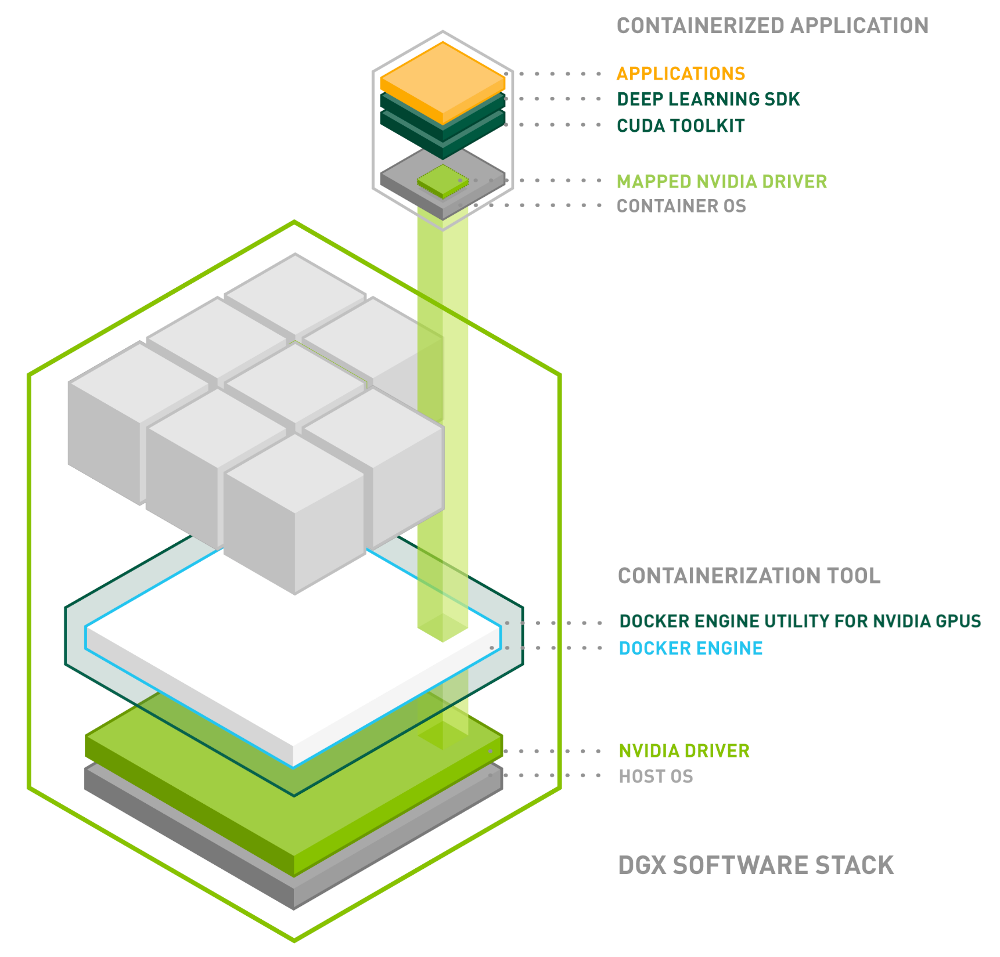

> 블로그 출처: https://leimao.github.io/blog/CUDA-Compatibility/ , Lei Mao의 글이며 저자의 전재 허가를 받았다.

# CUDA Compatibility

## 소개

다양한 NVIDIA 플랫폼과 소프트웨어 환경에서 동작할 수 있는 portable한 CUDA application과 library를 만드는 것은 때때로 중요하다. NVIDIA는 여러 계층에서 CUDA compatibility를 제공한다.

이 블로그 글에서는 CUDA application 또는 library compatibility(GPU 아키텍처와의 관계), CUDA runtime compatibility(CUDA application 또는 library와의 관계), CUDA driver compatibility(CUDA runtime library와의 관계)의 관점에서 CUDA의 forward compatibility와 backward compatibility를 논의하고자 한다.

## CUDA Application Compatibility

단순화를 위해, 먼저 우리의 CUDA application 또는 library가 cuDNN, cuBLAS 같은 다른 CUDA library에 의존하지 않는다고 가정하자. 오래된 아키텍처의 NVIDIA GPU가 있는 컴퓨터가 있고, 새 아키텍처의 NVIDIA GPU가 있는 컴퓨터, 더 나아가 미래 아키텍처에서도 실행될 수 있는 CUDA application 또는 library를 빌드하고 싶다고 하자. 오래된 아키텍처의 NVIDIA GPU가 있는 컴퓨터에서 CUDA application 또는 library를 빌드할 때, NVCC compilation은 compiled binary의 일부로 PTX code를 생성할 수 있다. 새 아키텍처의 NVIDIA GPU가 있는 컴퓨터에서 CUDA application 또는 library를 실행하면, PTX code는 CUDA runtime에 의해 새 아키텍처의 binary로 JIT compile된다. 따라서 오래된 아키텍처의 NVIDIA GPU가 있는 컴퓨터에서 빌드한 application 또는 software는 새 아키텍처의 NVIDIA GPU가 있는 컴퓨터에 대해 forward compatible할 수 있다.

물론 forward compatibility의 단점은 오래된 아키텍처용으로 생성된 PTX code가 새 아키텍처의 새로운 feature를 활용할 수 없다는 점이며, 이는 큰 성능 향상을 놓칠 수 있다. 이 글에서는 performance를 논의하지 않는다. 우리가 달성하려는 목표는 compatibility이기 때문이다.

반대로 새 아키텍처의 NVIDIA GPU가 있는 컴퓨터가 있고, 오래된 아키텍처의 NVIDIA GPU가 있는 컴퓨터에서도 실행될 수 있는 CUDA application 또는 library를 빌드하고 싶다고 하자. NVCC compilation은 PTX code뿐 아니라 오래된 아키텍처용 compiled binary도 생성할 수 있게 해 준다. 오래된 아키텍처의 NVIDIA GPU가 있는 컴퓨터에서 CUDA application 또는 library를 실행하면, 해당 아키텍처용 binary가 이미 compile되어 있는 경우 직접 실행되고, 그렇지 않으면 PTX code가 CUDA runtime에 의해 오래된 아키텍처의 binary로 JIT compile된다. 따라서 새 아키텍처의 NVIDIA GPU가 있는 컴퓨터에서 빌드한 application 또는 software는 오래된 아키텍처의 NVIDIA GPU가 있는 컴퓨터에 대해 backward compatible할 수 있다.

PTX code 생성을 binary의 일부로 포함하지 않도록 비활성화하면 forward compatibility를 끌 수 있다. PTX code와 오래된 아키텍처별 binary 생성을 binary의 일부로 포함하지 않도록 비활성화하면 backward compatibility를 끌 수 있다.

이제 우리의 CUDA application 또는 library가 cuDNN, cuBLAS 같은 다른 CUDA library에 의존한다면, forward 또는 backward compatibility를 달성하기 위해 이 CUDA library들도 우리의 CUDA application 또는 library와 동일한 forward 또는 backward compatibility를 갖도록 빌드되어야 한다. 하지만 때로는 그렇지 않은 경우가 있고, 이로 인해 우리의 CUDA application 또는 library가 forward 또는 backward compatible하지 못하게 된다. application 또는 developer는 의존 library의 compatibility를 항상 사전에 세심히 확인해야 한다.

## CUDA Runtime Compatibility

CUDA runtime library는 CUDA application 또는 library가 대부분의 경우 build 중에 항상 link해야 하는 library이며, 때로는 명시적으로 지정하지 않아도 된다. 예외는 일부 CUDA application 또는 library가 CUDA driver library에 link되는 경우이다. 따라서 cuDNN 같은 배포 CUDA software는 항상 자신이 link한 CUDA(runtime library)의 버전을 언급한다. 때로는 서로 다른 CUDA runtime library 버전에 대한 여러 build도 제공된다. 그러므로 CUDA application compatibility도 CUDA runtime에 의존한다.

하지만 때로는 CUDA application 또는 library가 build 시 link한 CUDA runtime이 실행 환경의 CUDA runtime library와 다를 수 있다. 이러한 문제를 해결하기 위해 CUDA runtime library는 NVIDIA driver 요구 사항이 충족된다는 전제 아래 minor version(forward 및/또는 backward) compatibility를 제공한다.

CUDA가 compatibility를 minor version compatibility라고 명확히 언급하는 이유는, 서로 다른 major version 사이에서는 CUDA runtime API가 다를 수 있고, 이러한 API를 사용해 특정 major version의 CUDA runtime에 맞춰 build한 application 또는 library가 다른 major version의 CUDA runtime과 함께 실행되지 못할 수 있기 때문이다. 예를 들어 CUDA 10.2용 cuDNN 8.6은 CUDA 11.2와 함께 사용할 수 없다. 실제로 `ldd`로 CUDA application 또는 library의 linked shared library를 확인하면, CUDA runtime library의 major version은 지정되어 있지만 minor version은 지정되어 있지 않은 경우를 자주 볼 수 있다. minor version만 다른 CUDA runtime library에서는 CUDA runtime API가 일반적으로 동일하므로 minor version compatibility 구현이 가능해진다.

## CUDA Driver Compatibility

CUDA runtime library는 실행 전에 application component를 build하는 library이고, CUDA driver library는 application을 실제로 실행하는 library이다. 따라서 CUDA runtime compatibility도 CUDA driver에 의존한다. 각 CUDA toolkit release에는 서로 compatible한 CUDA runtime library와 CUDA driver library가 함께 포함되지만, 이들은 서로 다른 source에서 제공되어 별도로 설치될 수도 있다.

CUDA driver library는 항상 backward compatible하다. 최신 driver를 사용하면 오래된 CUDA runtime library를 사용하는 CUDA application을 실행할 수 있다. CUDA driver library forward compatibility(https://docs.nvidia.com/deploy/cuda-compatibility/index.html#deployment-consideration-forward)는 더 복잡하며 추가 library 설치가 필요하다. 이는 때때로 stability에 집중하는 data center computer에서 필요하다. 이 글에서는 이에 대해 많이 펼쳐 설명하지 않는다.

## NVIDIA Docker

NVIDIA Docker는 사용자가 portable하고 reproducible하며 scalable한 방식으로 CUDA application을 개발하고 배포할 수 있게 해 주는 편리한 도구이다. NVIDIA Docker를 사용하면 driver와 GPU 아키텍처 요구 사항만 충족된다면, 원하는 어떤 CUDA 환경에서도 어떤 CUDA application이든 build하고 실행할 수 있다.

## 참고 문헌

- [CUDA Compilation](https://leimao.github.io/blog/CUDA-Compilation/)
- [CUDA Compatibility](https://docs.nvidia.com/deploy/cuda-compatibility/index.html)
- [CUDA Application Compatibility](https://docs.nvidia.com/cuda/cuda-c-programming-guide/index.html#application-compatibility)
- [CUDA Version and Compatibility](https://docs.nvidia.com/cuda/cuda-c-programming-guide/index.html#versioning-and-compatibility)
- NVIDIA Docker: GPU Server Application Deployment Made Easy(https://developer.nvidia.com/blog/nvidia-docker-gpu-server-application-deployment-made-easy/)
- NVIDIA NGC User Guide(https://docs.nvidia.com/ngc/)
