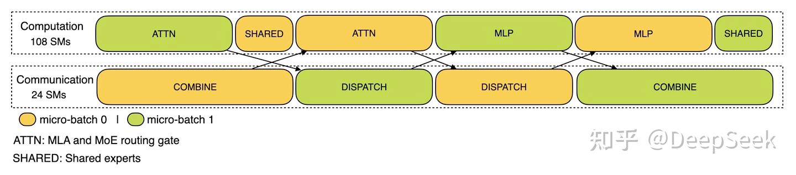

# CUDA Green Context 간단히 알아보기

## 0x0. 서문

DeepSeek V3 blog(https://zhuanlan.zhihu.com/p/27181462601)에서 언급한 TBO가 Prefill 단계에 작용할 때, scheduling diagram을 보면 compute Stream은 108개 SM을 사용하고 communication Stream은 나머지 24개 SM을 사용합니다. 예전부터 이런 SM 분할이 어떻게 이루어지는지 궁금했습니다. 최근 Flashinfer가 CUDA Green Context를 도입해 이 기능을 비교적 편리하게 구현할 수 있다는 것을 알게 되었습니다(CUDA 12.0+ 필요). 그래서 여기서는 Flashinfer 관련 구현을 기반으로 CUDA Green Context 구현을 간단히 살펴보겠습니다. NVIDIA forum과 CCCL의 지원 상황을 보면 이 feature도 아직 실험 단계인 듯하고, CUDA-Samples에서도 예제를 찾을 수 없습니다. 따라서 여기의 소개는 단순한 기술 보급 목적이며, 이후 발전을 계속 지켜보면 됩니다.



관련 PR은 https://github.com/flashinfer-ai/flashinfer/pull/1163 입니다.

## 0x1. CUDA Green Context와 일반 Context의 차이

CUDA Green Context 문서(https://docs.nvidia.com/cuda/cuda-driver-api/group__CUDA__GREEN__CONTEXTS.html#group__CUDA__GREEN__CONTEXTS_1g6115d21604653f4eafb257f725538ab6)에 따르면, CUDA 12.0+에서 CUDA Green Context가 도입되었습니다. 일반 Context와의 차이는 다음과 같습니다.

- CUDA Green Contexts는 resource isolation 기능을 제공해 각 context가 실행될 때 다른 context를 방해하지 않게 합니다. 이는 높은 concurrency가 필요한 task에 특히 중요합니다.
- multi-thread application에서 CUDA Green Contexts는 context switching으로 인한 performance loss를 효과적으로 줄여, multi-thread CUDA application이 더 부드럽게 실행되도록 합니다.
- 여러 context 사이에서 parallel processing을 수행해 GPU utilization을 높이고, 전체 compute throughput을 향상할 수 있습니다. 여러 independent computation을 실행해야 하는 상황에 적합합니다.

일반 CUDA Context Stream은 resource isolation을 구현할 수 없거나, 구현하려면 꽤 tricky한 방법이 필요합니다. 또한 일반 multi-Stream으로 kernel을 병렬 실행할 때도 어떤 kernel이 SM을 꽉 채우면 overlap이 어려워집니다. 이와 관련해서는 [https://mp.weixin.qq.com/s/Y6r-rjBEEN5akPHmx6jS3w](https://mp.weixin.qq.com/s/Y6r-rjBEEN5akPHmx6jS3w)의 CUDA kernel 실행과 nsys diagram을 참고할 수 있습니다. 제 이해로는 CUDA Green Context Stream은 SM을 나누어 resource isolation을 구현하므로 overlap을 더 쉽게 만들 수 있습니다.

## 0x2. CUDA Green Context 사용법

FlashInfer에 CUDA Green Context가 도입된 코드는 아래 code snippet에 대응합니다.

```python

from typing import List, Tuple

import cuda.bindings.driver as driver
import cuda.bindings.runtime as runtime
import cuda.cudart as cudart
import cuda.nvrtc as nvrtc
import torch
from cuda.bindings.driver import CUdevice, CUdevResource


def _cudaGetErrorEnum(error):
    """CUDA error enum의 name string을 가져온다.
    
    Args:
        error: CUDA error object. driver, runtime, nvrtc error type일 수 있다.
        
    Returns:
        error name의 string representation
    """
    if isinstance(error, driver.CUresult):
        # CUDA Driver API error 처리
        err, name = driver.cuGetErrorName(error)
        return name if err == driver.CUresult.CUDA_SUCCESS else "<unknown>"
    elif isinstance(error, runtime.cudaError_t):
        # CUDA Runtime API error 처리
        return cudart.cudaGetErrorName(error)[1]
    elif isinstance(error, nvrtc.nvrtcResult):
        # NVRTC compile error 처리
        return nvrtc.nvrtcGetErrorString(error)[1]
    else:
        raise RuntimeError(f"Unknown error type: {error}")


def checkCudaErrors(result):
    """CUDA API call의 return result를 검사하고, error가 있으면 exception을 던진다.
    
    Args:
        result: CUDA API call의 return result. 보통 tuple이다.
        
    Returns:
        error가 없으면 result data part(error code를 제거한 부분)를 반환한다.
        
    Raises:
        RuntimeError: CUDA call에 error가 있을 때
    """
    if result[0].value:
        # error code가 non-zero이면 error가 발생했다는 뜻
        raise RuntimeError(
            f"CUDA error code={result[0].value}({_cudaGetErrorEnum(result[0])})"
        )
    # return result length에 따라 무엇을 반환할지 결정
    if len(result) == 1:
        return None  # error code만 있고 data는 없음
    elif len(result) == 2:
        return result[1]  # data part 반환
    else:
        return result[1:]  # 여러 data item 반환


def get_cudevice(dev: torch.device) -> CUdevice:
    """지정한 PyTorch device에 대응하는 CUDA device handle을 얻는다.
    
    Args:
        dev: PyTorch device object
        
    Returns:
        CUDA device handle
    """
    try:
        # CUDA device를 직접 얻어 본다.
        cu_dev = checkCudaErrors(driver.cuDeviceGet(dev.index))
    except RuntimeError as e:
        # 실패하면 먼저 device를 initialize한 뒤 다시 얻는다.
        runtime.cudaInitDevice(dev.index, 0, 0)
        cu_dev = checkCudaErrors(driver.cuDeviceGet(dev.index))
    return cu_dev


def get_device_resource(cu_dev: CUdevice) -> CUdevResource:
    """지정한 CUDA device의 SM(streaming processor) resource를 얻는다.
    
    Args:
        cu_dev: CUDA device handle
        
    Returns:
        device의 SM resource object
    """
    return checkCudaErrors(
        driver.cuDeviceGetDevResource(
            cu_dev, driver.CUdevResourceType.CU_DEV_RESOURCE_TYPE_SM
        )
    )


def split_resource(
    resource: CUdevResource,
    num_groups: int,
    min_count: int,
) -> Tuple[CUdevResource, CUdevResource]:
    """SM resource를 지정한 수의 group으로 나눈다.
    
    Args:
        resource: 나눌 SM resource
        num_groups: 나눌 group 수
        min_count: 각 group의 최소 SM 수
        
    Returns:
        split된 resource group list와 remaining resource
    """
    results, _, remaining = checkCudaErrors(
        driver.cuDevSmResourceSplitByCount(
            num_groups,      # group count
            resource,        # original resource
            0,              # useFlags - flag, 0 means default
            min_count,      # minimum SM count per group
        )
    )
    return results, remaining


def create_green_ctx_streams(
    cu_dev: CUdevice, resources: List[CUdevResource]
) -> List[torch.Stream]:
    """각 SM resource group에 대응하는 Green Context와 Stream을 만든다.
    
    Args:
        cu_dev: CUDA device handle
        resources: SM resource group list
        
    Returns:
        각 resource group에 대응하는 PyTorch Stream list
    """
    streams = []
    for split in resources:
        # split resource마다 descriptor 생성
        desc = checkCudaErrors(driver.cuDevResourceGenerateDesc([split], 1))
        
        # Green Context 생성. CUDA 12.0+의 새로운 feature
        # Green Context는 서로 다른 SM partition에서 여러 kernel을 concurrent하게 실행할 수 있게 한다.
        green_ctx = checkCudaErrors(
            driver.cuGreenCtxCreate(
                desc,    # resource descriptor
                cu_dev,  # device handle
                driver.CUgreenCtxCreate_flags.CU_GREEN_CTX_DEFAULT_STREAM  # create flag
            )
        )
        
        # Green Context 안에서 Stream 생성
        stream = checkCudaErrors(
            driver.cuGreenCtxStreamCreate(
                green_ctx,  # Green Context
                driver.CUstream_flags.CU_STREAM_NON_BLOCKING,  # non-blocking Stream
                0,          # priority - priority, 0 means default
            )
        )
        
        # CUDA Driver API Stream을 PyTorch Stream으로 변환
        streams.append(torch.cuda.get_stream_from_external(stream))

    return streams


def split_device_green_ctx(
    dev: torch.device, num_groups: int, min_count: int
) -> Tuple[List[torch.Stream], List[CUdevResource]]:
    r"""
    device를 여러 Green Context로 나누고, 각 group과 남은 SM에 대응하는 Stream과 resource를 반환한다.
    Green Context는 서로 다른 SM partition에서 여러 kernel을 concurrent하게 실행할 수 있게 한다.

    Args:
        dev: split할 device
        num_groups: 나눌 group 수
        min_count: 각 group에 필요한 최소 SM 수. alignment와 granularity requirement에 따라 조정된다.

    Returns:
        streams: Green Context에 대응하는 torch.Stream object list
        resources: Green Context에 대응하는 CUdevResource object list

    Example:
        >>> from flashinfer.green_ctx import split_device_green_ctx
        >>> import torch
        >>> dev = torch.device("cuda:0")
        >>> streams, resources = split_device_green_ctx(dev, 2, 16)
        >>> print([r.sm.smCount for r in resources])
        [16, 16, 100]
        >>> with torch.cuda.stream(streams[0]):
        ...     x = torch.randn(8192, 8192, device=dev, dtype=torch.bfloat16)
        ...     y = torch.randn(8192, 8192, device=dev, dtype=torch.bfloat16)
        ...     z = x @ y
        ...     print(z.shape)
        ...
        torch.Size([8192, 8192])

    Note:
        returned streams와 resources의 length는 ``num_groups + 1``이다.
        마지막 하나는 remaining SM이다.

    Raises:
        RuntimeError: requested SM allocation이 device capacity를 넘을 때:
        ``num_groups * round_up(min_count, 8) > num_sm``
    """
    # 1. CUDA device handle 얻기
    cu_dev = get_cudevice(dev)
    
    # 2. device의 SM resource 얻기
    resource = get_device_resource(cu_dev)
    
    # 3. SM resource를 지정한 group 수로 split
    results, remaining = split_resource(resource, num_groups, min_count)
    
    # 4. split result와 remaining resource를 하나의 list로 합침
    resources = results + [remaining]
    
    # 5. 각 resource group에 대응하는 Green Context와 Stream 생성
    streams = create_green_ctx_streams(cu_dev, resources)
    
    return streams, resources
```

이 CUDA Green Context 사용은 상대적으로 꽤 간단하다는 것을 볼 수 있습니다. 핵심은 `cuDevResourceGenerateDesc`로 resource descriptor를 만들고, `cuGreenCtxCreate`로 Green Context를 만든 뒤, 마지막으로 `cuGreenCtxStreamCreate`로 CUDA Green Context의 Stream을 만드는 것입니다.

사용법도 비교적 간단합니다. 아래 unit test code를 참고할 수 있습니다.

```python
@pytest.mark.parametrize("device", ["cuda:0"])
@pytest.mark.parametrize("num_groups", [1, 2, 3])
@pytest.mark.parametrize("min_count", [16, 32])
def test_green_ctx_kernel_execution(
    device: str,
    num_groups: int,
    min_count: int,
):
    streams, resources = green_ctx.split_device_green_ctx(
        torch.device(device), num_groups, min_count
    )
    num_partitions = num_groups + 1
    assert len(streams) == num_partitions
    assert len(resources) == num_partitions

    for stream in streams:
        with torch.cuda.stream(stream):
            x = torch.randn(8192, 8192, device=device, dtype=torch.bfloat16)
            y = torch.randn(8192, 8192, device=device, dtype=torch.bfloat16)
            z = x @ y
            print(z.shape)
```

이 사용법은 FlashInfer의 CUDA Green Context로 SM split과 multi-Streams 생성을 구현하는 방법만 보여줍니다. CUDA Green Context로 kernel overlap을 구현하는 관련 예시는 보지 못했습니다. 저는 여기서 제공한 api를 사용해 dependency가 없는 `M,N,K=8192,8192,8192`의 `torch.matmul`과 `torch.sigmoid`의 `kernel overlap`을 구현해 보았습니다. 10개 SM으로 `torch.sigmoid`를 수행하고 나머지 SM으로 `torch.matmul`을 수행했습니다. 하지만 테스트해 보니 performance가 baseline의 direct sequential execution보다 오히려 거의 2배 느렸습니다. FlashInfer CUDA Green Context를 제가 올바르게 사용하지 못한 것인지 확실하지 않습니다. 이 feature가 발전하거나 관련 application이 생기면 계속 지켜보겠습니다.
