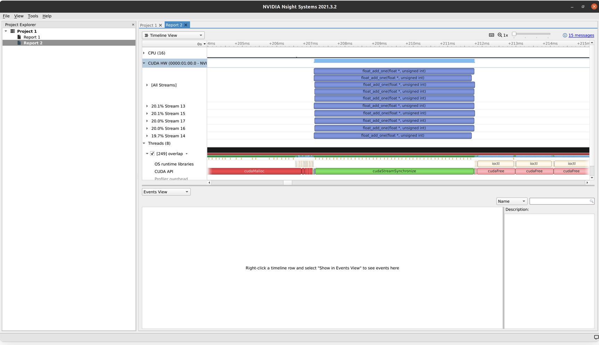
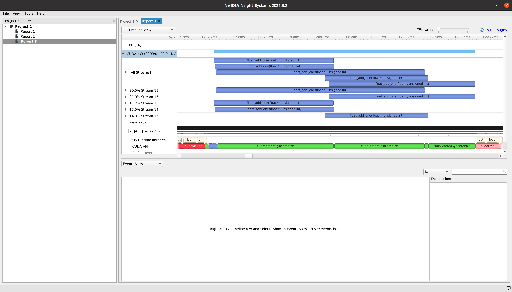
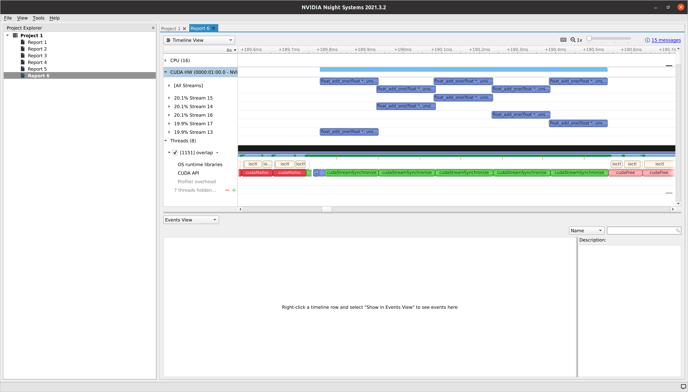

> 원 주소: https://leimao.github.io/blog/CUDA-Kernel-Execution-Overlap/ , Lei Mao의 글이며 저자의 전재 허가를 받았다. 앞으로 Lei Mao의 CUDA 관련 Blog 수십 편을 전재할 예정이다. Blog는 조금 이른 CUDA 아키텍처부터 현재 최신 CUDA 아키텍처까지 다루고, 실용적인 엔지니어링 기법, 저수준 명령어 분석, Cutlass 분석 등 여러 주제도 포함하므로 시간선이 매우 뚜렷한 칼럼이다.

# CUDA kernel 실행 중첩

## 소개

이전 블로그 글 "CUDA Stream"(https://leimao.github.io/blog/CUDA-Stream/)에서 나는 CUDA stream이 CUDA 프로그램의 동시 실행을 어떻게 돕는지 논의했다. 글 마지막에서는 메모리 전송과 kernel 실행의 중첩뿐 아니라 서로 다른 kernel 사이의 실행 중첩도 허용된다고 언급했다. 그러나 많은 CUDA 프로그래머는 왜 이전에는 kernel 실행 중첩을 만나지 못했는지 궁금해한다.

이 블로그 글에서는 CUDA kernel 실행 중첩과, 실제로 이를 볼 수 있거나 볼 수 없는 이유를 논의하고자 한다.

## CUDA kernel 실행 중첩

### 계산 자원

여러 kernel 실행을 병렬화할 충분한 계산 자원이 있으면 CUDA kernel 실행은 중첩될 수 있다.

아래 예제에서는 `blocks_per_grid` 값을 작게부터 크게 바꾸면서 서로 다른 CUDA stream의 kernel 실행이 완전 병렬화에서 부분 병렬화로, 마지막에는 거의 병렬화되지 않는 상태로 변하는 것을 볼 수 있다. 이는 하나의 CUDA kernel에 할당되는 계산 자원이 커질수록 추가 CUDA kernel에 할당할 수 있는 계산 자원이 줄어들기 때문이다.

```c++
#include <cuda_runtime.h>
#include <iostream>
#include <vector>

#define CHECK_CUDA_ERROR(val) check((val), #val, __FILE__, __LINE__)
void check(cudaError_t err, const char* const func, const char* const file,
           const int line)
{
    if (err != cudaSuccess)
    {
        std::cerr << "CUDA Runtime Error at: " << file << ":" << line
                  << std::endl;
        std::cerr << cudaGetErrorString(err) << " " << func << std::endl;
        std::exit(EXIT_FAILURE);
    }
}

#define CHECK_LAST_CUDA_ERROR() checkLast(__FILE__, __LINE__)
void checkLast(const char* const file, const int line)
{
    cudaError_t const err{cudaGetLastError()};
    if (err != cudaSuccess)
    {
        std::cerr << "CUDA Runtime Error at: " << file << ":" << line
                  << std::endl;
        std::cerr << cudaGetErrorString(err) << std::endl;
        std::exit(EXIT_FAILURE);
    }
}

__global__ void float_add_one(float* buffer, uint32_t n)
{
    uint32_t const idx{blockDim.x * blockIdx.x + threadIdx.x};
    uint32_t const stride{blockDim.x * gridDim.x};

    for (uint32_t i{idx}; i < n; i += stride)
    {
        buffer[i] += 1.0F;
    }
}

void launch_float_add_one(float* buffer, uint32_t n,
                          dim3 const& threads_per_block,
                          dim3 const& blocks_per_grid, cudaStream_t stream)
{
    float_add_one<<<blocks_per_grid, threads_per_block, 0, stream>>>(buffer, n);
    CHECK_LAST_CUDA_ERROR();
}

int main(int argc, char** argv)
{
    size_t const buffer_size{1024 * 10240};
    size_t const num_streams{5};

    dim3 const threads_per_block{1024};
    // blocks_per_grid에 서로 다른 값을 시도한다.
    // 1, 2, 4, 8, 16, 32, 1024, 2048
    dim3 const blocks_per_grid{32};

    std::vector<float*> d_buffers(num_streams);
    std::vector<cudaStream_t> streams(num_streams);

    for (auto& d_buffer : d_buffers)
    {
        CHECK_CUDA_ERROR(cudaMalloc(&d_buffer, buffer_size * sizeof(float)));
    }

    for (auto& stream : streams)
    {
        CHECK_CUDA_ERROR(cudaStreamCreate(&stream));
    }

    for (size_t i = 0; i < num_streams; ++i)
    {
        launch_float_add_one(d_buffers[i], buffer_size, threads_per_block,
                             blocks_per_grid, streams[i]);
    }

    for (auto& stream : streams)
    {
        CHECK_CUDA_ERROR(cudaStreamSynchronize(stream));
    }

    for (auto& d_buffer : d_buffers)
    {
        CHECK_CUDA_ERROR(cudaFree(d_buffer));
    }

    for (auto& stream : streams)
    {
        CHECK_CUDA_ERROR(cudaStreamDestroy(stream));
    }

    return 0;
}
```

```shell
$ nvcc overlap.cu -o overlap
$ ./overlap
```

`blocks_per_grid = 1`일 때 완전 병렬화가 나타나는 것을 관찰할 수 있다. 그러나 모든 kernel을 완료하는 데 걸리는 시간도 매우 긴데, 이는 GPU가 충분히 활용되지 않기 때문이다.




`blocks_per_grid = 32`로 설정하면 일부 kernel 실행만 병렬화된다. 그러나 GPU는 충분히 활용되며, 모든 kernel을 완료하는 데 걸리는 시간은 `blocks_per_grid = 1`일 때보다 훨씬 적다.



`blocks_per_grid = 32`와 마찬가지로, `blocks_per_grid = 5120`으로 설정하면 kernel 실행은 거의 병렬화되지 않는다. 그러나 GPU는 여전히 충분히 활용되며, 모든 kernel을 완료하는 데 걸리는 시간은 `blocks_per_grid = 1`일 때보다 훨씬 적다.



### 암묵적 동기화

계산 자원이 충분하더라도 kernel 실행 중첩이 없을 수 있다. 이는 호스트 스레드가 default Stream에 보낸 CUDA 명령이 서로 다른 다른 stream에서 온 CUDA 명령 사이에 암묵적 동기화(https://docs.nvidia.com/cuda/cuda-c-programming-guide/index.html#implicit-synchronization)를 만들기 때문일 수 있다.

내 생각에는 CUDA 프로그래머가 보통 CUDA 프로그램을 작성하는 방식 때문에 단일 스레드 CUDA 프로그램에서는 이런 일이 드물다. 그러나 다중 스레드 CUDA 프로그램에서는 확실히 발생한다. 이를 극복하기 위해 CUDA 7부터 `per-thread` default Stream 컴파일 모드가 만들어졌다. 사용자는 기존 CUDA 프로그램을 바꾸지 않고 NVCC 컴파일러 빌드 플래그에 `--default-stream per-thread`만 지정하면 암묵적 동기화를 비활성화할 수 있다. `per-thread` default Stream으로 CUDA 동시성을 단순화하는 방법을 더 자세히 알고 싶다면 Mark Harris의 블로그 글(https://developer.nvidia.com/blog/gpu-pro-tip-cuda-7-streams-simplify-concurrency/)을 읽으면 된다.

CUDA 11.4 기준으로 기본 빌드 인자는 여전히 `legacy`다. 사용자가 `per-thread` default Stream을 사용하려면 수동으로 `per-thread`로 변경해야 한다. CUDA 11.4 NVCC 도움말은 다음과 같다.

```shell
--default-stream {legacy|null|per-thread}       (-default-stream)
        Specify the stream that CUDA commands from the compiled program will be sent
        to by default.

        legacy
                The CUDA legacy stream (per context, implicitly synchronizes with
                other streams).

        per-thread
                A normal CUDA stream (per thread, does not implicitly
                synchronize with other streams).

        'null' is a deprecated alias for 'legacy'.

        Allowed values for this option:  'legacy','null','per-thread'.
        Default value:  'legacy'.
```

## 결론

기본 CUDA stream에 암묵적 동기화가 없다면, 부분적인 CUDA kernel 실행 병렬화 또는 병렬화가 없는 상태는 일반적으로 GPU 이용률이 높다는 뜻이고, 완전한 CUDA kernel 실행 병렬화는 일반적으로 GPU가 충분히 활용되지 않을 수 있음을 의미한다.

CUDA kernel 실행 중첩이 없는 원인이 기본 CUDA stream의 암묵적 동기화라면, `per-thread` default Stream을 활성화해 이를 비활성화하는 것을 고려해야 한다.

## 참고 자료

- GPU Pro Tip: CUDA 7 Streams Simplify Concurrency(developer.nvidia.com/blog/gpu-pro-tip-cuda-7-streams-simplify-concurrency/)
- Nsight Systems in Docker(https://leimao.github.io/blog/Docker-Nsight-Systems/)


