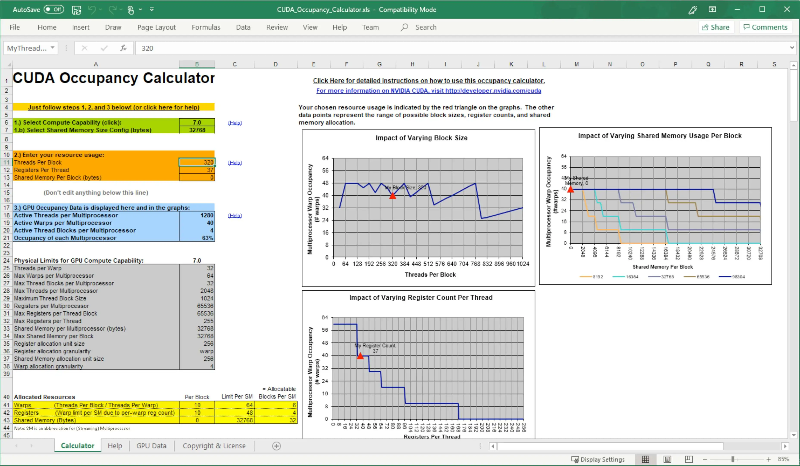

> 원 주소: https://leimao.github.io/blog/CUDA-Occupancy-Calculation/ , Lei Mao의 글이며 저자의 전재 허가를 받았다.

# CUDA 점유율 계산

## 소개

점유율은 각 SM의 active warp 수와 가능한 최대 active warp 수의 비율이다.

더 높은 점유율이 항상 더 높은 성능과 같지는 않다. 어떤 임계값이 있고, 그 임계값을 넘으면 추가 점유율은 성능을 향상시키지 않는다. 하지만 낮은 점유율은 항상 메모리 latency를 숨기는 능력을 방해해 성능 저하를 일으킨다.

이 블로그 글에서는 CUDA 점유율 계산을 논의하고자 한다.

## CUDA 점유율 계산

### Excel 점유율 계산기

Excel 기반 점유율 계산기는 deprecated되었지만, 여전히 compute capability 8.6 및 그 이하의 점유율을 계산하는 데 사용할 수 있다.



### GPU compute capability의 물리적 제한

Excel 표의 "GPU compute capability의 물리적 제한" 부분에서, 예를 들어 compute capability 7.0 장치에서는 각 SM에 65,536개의 32비트 register가 있고, 동시에 최대 2048개 thread(64개 warp × warp당 32개 thread)가 상주할 수 있음을 볼 수 있다. compute capability 7.0 장치에서는 register 할당이 block마다 가장 가까운 256개 register 단위로 올림된다. warp 할당 granularity는 4다.

이것들이 점유율 계산의 핵심 요인이다.

### 점유율 계산 예제

몇 가지 예제의 점유율을 수동으로 계산해 보자.

예를 들어 compute capability 7.0 장치에서, 128 thread block을 사용하고 thread당 37개 register를 사용하는 kernel을 고려하자.

"GPU compute capability의 물리적 제한"에서 compute capability 7.0의 가능한 최대 active warp 수가 64라는 것을 알고 있다.

하나의 warp에 필요한 register 수는 다음과 같다.

$⌈\frac{37 × 32}{256}⌉ × 256 = 1280$

여기서 32는 warp당 thread 수이고, 256은 register 할당 단위 크기다.

warp 할당 granularity를 고려하면, SM당 최대 active warp 수는 다음과 같다.

$⌊\frac{65536/1280}{4}⌋ × 4 = 48$

128 thread block 하나에는 128/32 = 4개의 warp가 들어 있으므로, 최대 48/4 = 12개의 thread block을 실행할 수 있다. 따라서 점유율은 12 × 4/64 = 75%다.

다른 예로 compute capability 7.0 장치에서, 320 thread block을 사용하고 thread당 37개 register를 사용하는 kernel을 고려하자.

320 thread block 하나에는 320/32 = 10개의 warp가 들어 있으므로, 최대 48/10 = 4개의 thread block을 실행할 수 있다. 따라서 점유율은 10 × 4/64 = 63%다.

이렇게 수동으로 계산한 점유율은 Excel 기반 점유율 계산기로 검증할 수 있다.

### register 수

마지막으로 `nvcc`의 `--ptxas-options=-v` 옵션을 사용해 각 kernel에서 thread당 사용하는 register 수를 얻을 수 있다. 예:

```shell
$ wget https://raw.githubusercontent.com/NVIDIA-developer-blog/code-samples/master/series/cuda-cpp/overlap-data-transfers/async.cu
$ nvcc async.cu -o async --ptxas-options=-v
ptxas info    : 24 bytes gmem
ptxas info    : Compiling entry function '_Z6kernelPfi' for 'sm_52'
ptxas info    : Function properties for _Z6kernelPfi
    32 bytes stack frame, 0 bytes spill stores, 0 bytes spill loads
ptxas info    : Used 22 registers, 332 bytes cmem[0], 48 bytes cmem[2]
```

## 결론

점유율을 수동으로 계산하는 일은 때때로 번거롭고 오류가 나기 쉽다. 하지만 Excel 기반 점유율 계산기 같은 기존 도구를 사용해 계산할 수 있다.

## 참고 문헌

- CUDA Occupancy Calculator(https://docs.nvidia.com/cuda/archive/11.6.2/cuda-occupancy-calculator/index.html)
- CUDA Best Practices Guide - Calculating Occupancy(https://docs.nvidia.com/cuda/archive/11.6.2/cuda-c-best-practices-guide/index.html#calculating-occupancy)


