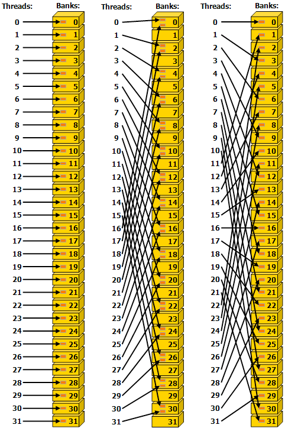

# CUDA Shared Memory Bank

> 블로그 출처: https://leimao.github.io/blog/CUDA-Shared-Memory-Bank/ 이 글은 Lei Mao의 글이며, 저자의 전재 허가를 받았다.

## 소개

Memory bank는 CUDA shared memory의 핵심 개념이다. CUDA kernel 구현에서 최적 성능을 얻으려면 사용자는 memory bank access에 주의하고 memory bank access conflict를 피해야 한다.

이 블로그 글에서는，CUDA shared memory의 memory bank를 간단히 논의한다.

## Memory Bank

### Memory Bank 속성

Concurrent access에 대해 높은 memory bandwidth를 구현하기 위해 shared memory는 같은 크기의 memory module(bank)로 나뉘며, 이 module들은 동시에 access될 수 있다. 따라서 서로 다른 memory bank에 걸친 어떤 memory load 또는 store address도 동시에 service될 수 있고, 그 결과 effective bandwidth는 single bank bandwidth의 $n$배가 된다.

그러나 하나의 memory request의 여러 address가 같은 memory bank에 mapping되면 이 access들은 serialize된다. Hardware는 bank conflict가 있는 memory request를 필요한 수의 conflict-free request로 분할하고, effective bandwidth는 개별 memory request 수에 비례해 감소한다. 여기서 유일한 예외는 한 warp의 여러 thread가 같은 shared memory location에 access해서 broadcast가 발생하는 경우다. 이 경우 서로 다른 bank의 여러 broadcast는 요청된 shared memory location에서 thread로 가는 하나의 multicast로 merge된다.

### Memory Bank Mapping

위에서는 memory bank의 속성을 설명했다. 그러나 memory address가 memory bank에 어떻게 mapping되는지는 architecture-specific이다.

Compute capability 5.x 이상 device에서는 각 bank가 clock cycle마다 32-bit bandwidth를 가지며, 연속된 32-bit word는 연속된 bank에 할당된다. Warp size는 32 thread이고 bank 수도 32이므로 bank conflict는 warp 안의 어떤 thread 사이에서도 발생할 수 있다.

이를 자세히 설명하기 위해 예제를 통해 memory address가 memory bank에 어떻게 mapping되는지 살펴보자. 다음 프로그램은 compute capability 5.x 이상 device에서 1D 및 2D memory address가 memory bank에 mapping되는 개념을 보여준다.

```c++
#include <iostream>
#include <memory>
#include <vector>

template <typename T>
void bank_id_1d_mapping(int bank_size, int num_banks, int N)
{
    for (int i{0}; i < N; ++i)
    {
        // bank_size: Bank size in bits.
        // 8: 8 bits per Byte.
        int bank_idx = (i * sizeof(T) * 8 / bank_size) % num_banks;
        std::cout << "Array Idx: " << i << " "
                  << "Bank Idx: " << bank_idx << std::endl;
    }
}

template <typename T>
void bank_id_2d_mapping(int bank_size, int num_banks, int M, int N)
{
    for (int i{0}; i < M; ++i)
    {
        for (int j{0}; j < N; ++j)
        {
            int bank_idx =
                ((i * N + j) * sizeof(T) * 8 / bank_size) % num_banks;
            std::cout << "Matrix Idx: (" << i << ", " << j << ") "
                      << "Bank Idx: " << bank_idx << std::endl;
        }
    }
}

int main()
{

    constexpr const int bank_size{32}; // bits
    constexpr const int num_banks{32};

    const int M{4};
    const int N{32};

    std::cout << "Bank ID Mapping 1D: N = " << N << std::endl;
    bank_id_1d_mapping<float>(bank_size, num_banks, N);
    std::cout << "Bank 2D Mapping 1D: M = " << M << " N = " << N << std::endl;
    bank_id_2d_mapping<float>(bank_size, num_banks, M, N);
}
```

결과:

```c++
$ g++ memory_bank.cpp -o memory_bank -std=c++14
$ ./memory_bank
Bank ID Mapping 1D: N = 32
Array Idx: 0 Bank Idx: 0
Array Idx: 1 Bank Idx: 1
Array Idx: 2 Bank Idx: 2
Array Idx: 3 Bank Idx: 3
Array Idx: 4 Bank Idx: 4
Array Idx: 5 Bank Idx: 5
Array Idx: 6 Bank Idx: 6
Array Idx: 7 Bank Idx: 7
Array Idx: 8 Bank Idx: 8
Array Idx: 9 Bank Idx: 9
Array Idx: 10 Bank Idx: 10
Array Idx: 11 Bank Idx: 11
Array Idx: 12 Bank Idx: 12
Array Idx: 13 Bank Idx: 13
Array Idx: 14 Bank Idx: 14
Array Idx: 15 Bank Idx: 15
Array Idx: 16 Bank Idx: 16
Array Idx: 17 Bank Idx: 17
Array Idx: 18 Bank Idx: 18
Array Idx: 19 Bank Idx: 19
Array Idx: 20 Bank Idx: 20
Array Idx: 21 Bank Idx: 21
Array Idx: 22 Bank Idx: 22
Array Idx: 23 Bank Idx: 23
Array Idx: 24 Bank Idx: 24
Array Idx: 25 Bank Idx: 25
Array Idx: 26 Bank Idx: 26
Array Idx: 27 Bank Idx: 27
Array Idx: 28 Bank Idx: 28
Array Idx: 29 Bank Idx: 29
Array Idx: 30 Bank Idx: 30
Array Idx: 31 Bank Idx: 31
Bank 2D Mapping 1D: M = 4 N = 32
Matrix Idx: (0, 0) Bank Idx: 0
Matrix Idx: (0, 1) Bank Idx: 1
Matrix Idx: (0, 2) Bank Idx: 2
Matrix Idx: (0, 3) Bank Idx: 3
Matrix Idx: (0, 4) Bank Idx: 4
Matrix Idx: (0, 5) Bank Idx: 5
Matrix Idx: (0, 6) Bank Idx: 6
Matrix Idx: (0, 7) Bank Idx: 7
Matrix Idx: (0, 8) Bank Idx: 8
Matrix Idx: (0, 9) Bank Idx: 9
Matrix Idx: (0, 10) Bank Idx: 10
Matrix Idx: (0, 11) Bank Idx: 11
Matrix Idx: (0, 12) Bank Idx: 12
Matrix Idx: (0, 13) Bank Idx: 13
Matrix Idx: (0, 14) Bank Idx: 14
Matrix Idx: (0, 15) Bank Idx: 15
Matrix Idx: (0, 16) Bank Idx: 16
Matrix Idx: (0, 17) Bank Idx: 17
Matrix Idx: (0, 18) Bank Idx: 18
Matrix Idx: (0, 19) Bank Idx: 19
Matrix Idx: (0, 20) Bank Idx: 20
Matrix Idx: (0, 21) Bank Idx: 21
Matrix Idx: (0, 22) Bank Idx: 22
Matrix Idx: (0, 23) Bank Idx: 23
Matrix Idx: (0, 24) Bank Idx: 24
Matrix Idx: (0, 25) Bank Idx: 25
Matrix Idx: (0, 26) Bank Idx: 26
Matrix Idx: (0, 27) Bank Idx: 27
Matrix Idx: (0, 28) Bank Idx: 28
Matrix Idx: (0, 29) Bank Idx: 29
Matrix Idx: (0, 30) Bank Idx: 30
Matrix Idx: (0, 31) Bank Idx: 31
Matrix Idx: (1, 0) Bank Idx: 0
Matrix Idx: (1, 1) Bank Idx: 1
Matrix Idx: (1, 2) Bank Idx: 2
Matrix Idx: (1, 3) Bank Idx: 3
Matrix Idx: (1, 4) Bank Idx: 4
Matrix Idx: (1, 5) Bank Idx: 5
Matrix Idx: (1, 6) Bank Idx: 6
Matrix Idx: (1, 7) Bank Idx: 7
Matrix Idx: (1, 8) Bank Idx: 8
Matrix Idx: (1, 9) Bank Idx: 9
Matrix Idx: (1, 10) Bank Idx: 10
Matrix Idx: (1, 11) Bank Idx: 11
Matrix Idx: (1, 12) Bank Idx: 12
Matrix Idx: (1, 13) Bank Idx: 13
Matrix Idx: (1, 14) Bank Idx: 14
Matrix Idx: (1, 15) Bank Idx: 15
Matrix Idx: (1, 16) Bank Idx: 16
Matrix Idx: (1, 17) Bank Idx: 17
Matrix Idx: (1, 18) Bank Idx: 18
Matrix Idx: (1, 19) Bank Idx: 19
Matrix Idx: (1, 20) Bank Idx: 20
Matrix Idx: (1, 21) Bank Idx: 21
Matrix Idx: (1, 22) Bank Idx: 22
Matrix Idx: (1, 23) Bank Idx: 23
Matrix Idx: (1, 24) Bank Idx: 24
Matrix Idx: (1, 25) Bank Idx: 25
Matrix Idx: (1, 26) Bank Idx: 26
Matrix Idx: (1, 27) Bank Idx: 27
Matrix Idx: (1, 28) Bank Idx: 28
Matrix Idx: (1, 29) Bank Idx: 29
Matrix Idx: (1, 30) Bank Idx: 30
Matrix Idx: (1, 31) Bank Idx: 31
Matrix Idx: (2, 0) Bank Idx: 0
Matrix Idx: (2, 1) Bank Idx: 1
Matrix Idx: (2, 2) Bank Idx: 2
Matrix Idx: (2, 3) Bank Idx: 3
Matrix Idx: (2, 4) Bank Idx: 4
Matrix Idx: (2, 5) Bank Idx: 5
Matrix Idx: (2, 6) Bank Idx: 6
Matrix Idx: (2, 7) Bank Idx: 7
Matrix Idx: (2, 8) Bank Idx: 8
Matrix Idx: (2, 9) Bank Idx: 9
Matrix Idx: (2, 10) Bank Idx: 10
Matrix Idx: (2, 11) Bank Idx: 11
Matrix Idx: (2, 12) Bank Idx: 12
Matrix Idx: (2, 13) Bank Idx: 13
Matrix Idx: (2, 14) Bank Idx: 14
Matrix Idx: (2, 15) Bank Idx: 15
Matrix Idx: (2, 16) Bank Idx: 16
Matrix Idx: (2, 17) Bank Idx: 17
Matrix Idx: (2, 18) Bank Idx: 18
Matrix Idx: (2, 19) Bank Idx: 19
Matrix Idx: (2, 20) Bank Idx: 20
Matrix Idx: (2, 21) Bank Idx: 21
Matrix Idx: (2, 22) Bank Idx: 22
Matrix Idx: (2, 23) Bank Idx: 23
Matrix Idx: (2, 24) Bank Idx: 24
Matrix Idx: (2, 25) Bank Idx: 25
Matrix Idx: (2, 26) Bank Idx: 26
Matrix Idx: (2, 27) Bank Idx: 27
Matrix Idx: (2, 28) Bank Idx: 28
Matrix Idx: (2, 29) Bank Idx: 29
Matrix Idx: (2, 30) Bank Idx: 30
Matrix Idx: (2, 31) Bank Idx: 31
Matrix Idx: (3, 0) Bank Idx: 0
Matrix Idx: (3, 1) Bank Idx: 1
Matrix Idx: (3, 2) Bank Idx: 2
Matrix Idx: (3, 3) Bank Idx: 3
Matrix Idx: (3, 4) Bank Idx: 4
Matrix Idx: (3, 5) Bank Idx: 5
Matrix Idx: (3, 6) Bank Idx: 6
Matrix Idx: (3, 7) Bank Idx: 7
Matrix Idx: (3, 8) Bank Idx: 8
Matrix Idx: (3, 9) Bank Idx: 9
Matrix Idx: (3, 10) Bank Idx: 10
Matrix Idx: (3, 11) Bank Idx: 11
Matrix Idx: (3, 12) Bank Idx: 12
Matrix Idx: (3, 13) Bank Idx: 13
Matrix Idx: (3, 14) Bank Idx: 14
Matrix Idx: (3, 15) Bank Idx: 15
Matrix Idx: (3, 16) Bank Idx: 16
Matrix Idx: (3, 17) Bank Idx: 17
Matrix Idx: (3, 18) Bank Idx: 18
Matrix Idx: (3, 19) Bank Idx: 19
Matrix Idx: (3, 20) Bank Idx: 20
Matrix Idx: (3, 21) Bank Idx: 21
Matrix Idx: (3, 22) Bank Idx: 22
Matrix Idx: (3, 23) Bank Idx: 23
Matrix Idx: (3, 24) Bank Idx: 24
Matrix Idx: (3, 25) Bank Idx: 25
Matrix Idx: (3, 26) Bank Idx: 26
Matrix Idx: (3, 27) Bank Idx: 27
Matrix Idx: (3, 28) Bank Idx: 28
Matrix Idx: (3, 29) Bank Idx: 29
Matrix Idx: (3, 30) Bank Idx: 30
Matrix Idx: (3, 31) Bank Idx: 31

```

### Memory Bank Conflicts

주의할 점은 2D matrix에서 data type의 bit width가 32-bit이고 column 수가 32의 배수라면 matrix의 같은 column에 있는 element가 같은 memory bank에 속한다는 것이다. 바로 이것이 구현에서 memory bank conflict가 쉽게 발생하는 지점이다. 한 warp의 thread가 matrix의 같은 column 값에 access하려 하면 심각한 memory bank conflict가 발생한다. 33 같은 다른 column 수를 사용하면 matrix의 같은 column에 있는 element가 같은 memory bank에 속하는 일을 피할 수 있다. 따라서 memory bank access stride에 주의해야 한다.

```c++
#include <iostream>
#include <memory>
#include <vector>

template <typename T>
void bank_id_1d_mapping(int bank_size, int num_banks, int N)
{
    for (int i{0}; i < N; ++i)
    {
        int bank_idx = (i * sizeof(T) * 8 / bank_size) % num_banks;
        std::cout << "Array Idx: " << i << " "
                  << "Bank Idx: " << bank_idx << std::endl;
    }
}

template <typename T>
void bank_id_2d_mapping(int bank_size, int num_banks, int M, int N)
{
    for (int i{0}; i < M; ++i)
    {
        for (int j{0}; j < N; ++j)
        {
            int bank_idx =
                ((i * N + j) * sizeof(T) * 8 / bank_size) % num_banks;
            std::cout << "Matrix Idx: (" << i << ", " << j << ") "
                      << "Bank Idx: " << bank_idx << std::endl;
        }
    }
}

int main()
{

    constexpr const int bank_size{32}; // bits
    constexpr const int num_banks{32};

    const int M{4};
    const int N{33};

    std::cout << "Bank ID Mapping 1D: N = " << N << std::endl;
    bank_id_1d_mapping<float>(bank_size, num_banks, N);
    std::cout << "Bank 2D Mapping 1D: M = " << M << " N = " << N << std::endl;
    bank_id_2d_mapping<float>(bank_size, num_banks, M, N);
}
```

실제로 extra column은 사용되지 않으며 어떤 값으로 채워도 된다. 다만 구현한 algorithm이 extra column에서 사용하면 안 되는 값을 실수로 사용해서 잘못된 결과를 만들지 않도록 해야 한다.

```c++
$ g++ memory_bank.cpp -o memory_bank -std=c++14
$ ./memory_bank
Bank ID Mapping 1D: N = 33
Array Idx: 0 Bank Idx: 0
Array Idx: 1 Bank Idx: 1
Array Idx: 2 Bank Idx: 2
Array Idx: 3 Bank Idx: 3
Array Idx: 4 Bank Idx: 4
Array Idx: 5 Bank Idx: 5
Array Idx: 6 Bank Idx: 6
Array Idx: 7 Bank Idx: 7
Array Idx: 8 Bank Idx: 8
Array Idx: 9 Bank Idx: 9
Array Idx: 10 Bank Idx: 10
Array Idx: 11 Bank Idx: 11
Array Idx: 12 Bank Idx: 12
Array Idx: 13 Bank Idx: 13
Array Idx: 14 Bank Idx: 14
Array Idx: 15 Bank Idx: 15
Array Idx: 16 Bank Idx: 16
Array Idx: 17 Bank Idx: 17
Array Idx: 18 Bank Idx: 18
Array Idx: 19 Bank Idx: 19
Array Idx: 20 Bank Idx: 20
Array Idx: 21 Bank Idx: 21
Array Idx: 22 Bank Idx: 22
Array Idx: 23 Bank Idx: 23
Array Idx: 24 Bank Idx: 24
Array Idx: 25 Bank Idx: 25
Array Idx: 26 Bank Idx: 26
Array Idx: 27 Bank Idx: 27
Array Idx: 28 Bank Idx: 28
Array Idx: 29 Bank Idx: 29
Array Idx: 30 Bank Idx: 30
Array Idx: 31 Bank Idx: 31
Array Idx: 32 Bank Idx: 0
Bank 2D Mapping 1D: M = 4 N = 33
Matrix Idx: (0, 0) Bank Idx: 0
Matrix Idx: (0, 1) Bank Idx: 1
Matrix Idx: (0, 2) Bank Idx: 2
Matrix Idx: (0, 3) Bank Idx: 3
Matrix Idx: (0, 4) Bank Idx: 4
Matrix Idx: (0, 5) Bank Idx: 5
Matrix Idx: (0, 6) Bank Idx: 6
Matrix Idx: (0, 7) Bank Idx: 7
Matrix Idx: (0, 8) Bank Idx: 8
Matrix Idx: (0, 9) Bank Idx: 9
Matrix Idx: (0, 10) Bank Idx: 10
Matrix Idx: (0, 11) Bank Idx: 11
Matrix Idx: (0, 12) Bank Idx: 12
Matrix Idx: (0, 13) Bank Idx: 13
Matrix Idx: (0, 14) Bank Idx: 14
Matrix Idx: (0, 15) Bank Idx: 15
Matrix Idx: (0, 16) Bank Idx: 16
Matrix Idx: (0, 17) Bank Idx: 17
Matrix Idx: (0, 18) Bank Idx: 18
Matrix Idx: (0, 19) Bank Idx: 19
Matrix Idx: (0, 20) Bank Idx: 20
Matrix Idx: (0, 21) Bank Idx: 21
Matrix Idx: (0, 22) Bank Idx: 22
Matrix Idx: (0, 23) Bank Idx: 23
Matrix Idx: (0, 24) Bank Idx: 24
Matrix Idx: (0, 25) Bank Idx: 25
Matrix Idx: (0, 26) Bank Idx: 26
Matrix Idx: (0, 27) Bank Idx: 27
Matrix Idx: (0, 28) Bank Idx: 28
Matrix Idx: (0, 29) Bank Idx: 29
Matrix Idx: (0, 30) Bank Idx: 30
Matrix Idx: (0, 31) Bank Idx: 31
Matrix Idx: (0, 32) Bank Idx: 0
Matrix Idx: (1, 0) Bank Idx: 1
Matrix Idx: (1, 1) Bank Idx: 2
Matrix Idx: (1, 2) Bank Idx: 3
Matrix Idx: (1, 3) Bank Idx: 4
Matrix Idx: (1, 4) Bank Idx: 5
Matrix Idx: (1, 5) Bank Idx: 6
Matrix Idx: (1, 6) Bank Idx: 7
Matrix Idx: (1, 7) Bank Idx: 8
Matrix Idx: (1, 8) Bank Idx: 9
Matrix Idx: (1, 9) Bank Idx: 10
Matrix Idx: (1, 10) Bank Idx: 11
Matrix Idx: (1, 11) Bank Idx: 12
Matrix Idx: (1, 12) Bank Idx: 13
Matrix Idx: (1, 13) Bank Idx: 14
Matrix Idx: (1, 14) Bank Idx: 15
Matrix Idx: (1, 15) Bank Idx: 16
Matrix Idx: (1, 16) Bank Idx: 17
Matrix Idx: (1, 17) Bank Idx: 18
Matrix Idx: (1, 18) Bank Idx: 19
Matrix Idx: (1, 19) Bank Idx: 20
Matrix Idx: (1, 20) Bank Idx: 21
Matrix Idx: (1, 21) Bank Idx: 22
Matrix Idx: (1, 22) Bank Idx: 23
Matrix Idx: (1, 23) Bank Idx: 24
Matrix Idx: (1, 24) Bank Idx: 25
Matrix Idx: (1, 25) Bank Idx: 26
Matrix Idx: (1, 26) Bank Idx: 27
Matrix Idx: (1, 27) Bank Idx: 28
Matrix Idx: (1, 28) Bank Idx: 29
Matrix Idx: (1, 29) Bank Idx: 30
Matrix Idx: (1, 30) Bank Idx: 31
Matrix Idx: (1, 31) Bank Idx: 0
Matrix Idx: (1, 32) Bank Idx: 1
Matrix Idx: (2, 0) Bank Idx: 2
Matrix Idx: (2, 1) Bank Idx: 3
Matrix Idx: (2, 2) Bank Idx: 4
Matrix Idx: (2, 3) Bank Idx: 5
Matrix Idx: (2, 4) Bank Idx: 6
Matrix Idx: (2, 5) Bank Idx: 7
Matrix Idx: (2, 6) Bank Idx: 8
Matrix Idx: (2, 7) Bank Idx: 9
Matrix Idx: (2, 8) Bank Idx: 10
Matrix Idx: (2, 9) Bank Idx: 11
Matrix Idx: (2, 10) Bank Idx: 12
Matrix Idx: (2, 11) Bank Idx: 13
Matrix Idx: (2, 12) Bank Idx: 14
Matrix Idx: (2, 13) Bank Idx: 15
Matrix Idx: (2, 14) Bank Idx: 16
Matrix Idx: (2, 15) Bank Idx: 17
Matrix Idx: (2, 16) Bank Idx: 18
Matrix Idx: (2, 17) Bank Idx: 19
Matrix Idx: (2, 18) Bank Idx: 20
Matrix Idx: (2, 19) Bank Idx: 21
Matrix Idx: (2, 20) Bank Idx: 22
Matrix Idx: (2, 21) Bank Idx: 23
Matrix Idx: (2, 22) Bank Idx: 24
Matrix Idx: (2, 23) Bank Idx: 25
Matrix Idx: (2, 24) Bank Idx: 26
Matrix Idx: (2, 25) Bank Idx: 27
Matrix Idx: (2, 26) Bank Idx: 28
Matrix Idx: (2, 27) Bank Idx: 29
Matrix Idx: (2, 28) Bank Idx: 30
Matrix Idx: (2, 29) Bank Idx: 31
Matrix Idx: (2, 30) Bank Idx: 0
Matrix Idx: (2, 31) Bank Idx: 1
Matrix Idx: (2, 32) Bank Idx: 2
Matrix Idx: (3, 0) Bank Idx: 3
Matrix Idx: (3, 1) Bank Idx: 4
Matrix Idx: (3, 2) Bank Idx: 5
Matrix Idx: (3, 3) Bank Idx: 6
Matrix Idx: (3, 4) Bank Idx: 7
Matrix Idx: (3, 5) Bank Idx: 8
Matrix Idx: (3, 6) Bank Idx: 9
Matrix Idx: (3, 7) Bank Idx: 10
Matrix Idx: (3, 8) Bank Idx: 11
Matrix Idx: (3, 9) Bank Idx: 12
Matrix Idx: (3, 10) Bank Idx: 13
Matrix Idx: (3, 11) Bank Idx: 14
Matrix Idx: (3, 12) Bank Idx: 15
Matrix Idx: (3, 13) Bank Idx: 16
Matrix Idx: (3, 14) Bank Idx: 17
Matrix Idx: (3, 15) Bank Idx: 18
Matrix Idx: (3, 16) Bank Idx: 19
Matrix Idx: (3, 17) Bank Idx: 20
Matrix Idx: (3, 18) Bank Idx: 21
Matrix Idx: (3, 19) Bank Idx: 22
Matrix Idx: (3, 20) Bank Idx: 23
Matrix Idx: (3, 21) Bank Idx: 24
Matrix Idx: (3, 22) Bank Idx: 25
Matrix Idx: (3, 23) Bank Idx: 26
Matrix Idx: (3, 24) Bank Idx: 27
Matrix Idx: (3, 25) Bank Idx: 28
Matrix Idx: (3, 26) Bank Idx: 29
Matrix Idx: (3, 27) Bank Idx: 30
Matrix Idx: (3, 28) Bank Idx: 31
Matrix Idx: (3, 29) Bank Idx: 0
Matrix Idx: (3, 30) Bank Idx: 1
Matrix Idx: (3, 31) Bank Idx: 2
Matrix Idx: (3, 32) Bank Idx: 3
```

다음은 부적절한 stride 때문에 발생하는 Memory Bank 예제다.



## 참고

- https://docs.nvidia.com/cuda/archive/11.6.2/cuda-c-best-practices-guide/index.html#shared-memory-and-memory-banks
- https://docs.nvidia.com/cuda/archive/11.6.2/cuda-c-programming-guide/index.html#shared-memory-5-x


