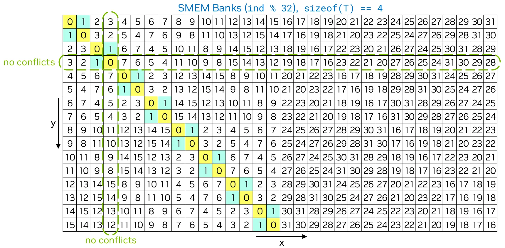

> 블로그 출처: https://leimao.github.io/blog/CUDA-Shared-Memory-Swizzling/ 이 글은 Lei Mao의 글이며, 저자의 전재 허가를 받았다. 이후 Lei Mao의 CUDA 관련 Blog를 몇 편 더 전재할 예정이고, 이는 하나의 완결된 칼럼이다. Blog는 비교적 이른 시기의 CUDA 아키텍처부터 현재 최신 CUDA 아키텍처까지 다루며, 실용적인 엔지니어링 기법, 저수준 명령어 분석, Cutlass 분석 등 여러 주제를 포함한다.

# CUDA Shared Memory Swizzling

## 소개

shared memory를 사용하는 CUDA kernel을 작성할 때는 shared memory bank conflict(https://leimao.github.io/blog/CUDA-Shared-Memory-Bank/)에 주의해야 한다. 심각한 shared memory bank conflict는 큰 performance 손실을 가져온다.

shared memory bank conflict를 처리하는 간단한 방법 하나는 padding을 사용하는 것이다. 그러나 padding은 shared memory를 낭비하고 다른 결함을 만들 수 있다.

이 블로그에서는，swizzling technique을 사용해 shared memory bank conflict를 처리하는 방법을 논의한다. Swizzling은 shared memory를 낭비하지 않고 shared memory bank conflict를 피할 수 있는 더 복잡한 technique이다.

## CUDA Shared Memory Swizzling

### Swizzling 예제

Padding 없이 CUDA shared memory에 data를 cache할 때 warp의 shared memory read 또는 write operation은 흔히 shared memory bank conflict를 일으킨다. Swizzling은 shared memory index mapping을 재배열해 shared memory bank conflict를 피하는 technique이다. Matrix transpose는 완벽한 예다. implementation이 padding이나 swizzling을 사용하지 않으면 shared memory bank conflict가 발생한다.



위 예제에서 shared memory는 size가 $32 \times 16$인 2D `float` array다. Matrix transpose의 경우 각 warp는 global memory에서 32개 값의 row 하나를 읽고 swizzling을 사용해 shared memory에 쓴다. Shared memory에 쓸 때 shared memory bank conflict는 발생하지 않는다. Matrix transpose를 수행하기 위해 각 warp는 shared memory에서 swizzling된 두 "column"의 32개 값을 읽고 global memory에 쓴다. 예를 들어 swizzling된 0번째 column과 1번째 column은 각각 노란색과 청록색으로 표시되어 있다. 이렇게 하면 shared memory에서 읽을 때 shared memory bank conflict가 하나만 발생한다. Swizzling을 사용하지 않으면 shared memory에서 읽을 때 16개의 2-way shared memory bank conflict가 발생한다. 물론 shared memory가 size $32 \times 32$인 2D `float` array라면 shared memory write와 read 모두에서 shared memory bank conflict가 발생하지 않는다는 것은 명백하다.

## Swizzling 공식

Shared memory 위의 array `T array[][NX]`가 주어졌을 때, $NX \times sizeof(T) == SWIZZLE\_SIZE$로 정의한다. $SWIZZLE\_SIZE$의 허용 값은 32, 64, 128, 256처럼 32 이상인 2의 거듭제곱이다.

`T array[][NX]`의 index `[y][x]`가 주어졌을 때, swizzling된 index $x\_swz$를 다음과 같이 calculate할 수 있다.

1. $SWIZZLE\_SIZE$ byte segment 안의 $TC$ byte block index를 calculate한다.
```
   i_chunk = (y × NX + x) × sizeof(T) / sizeof(TC)
   y_chunk = i / (SWIZZLE_SIZE / sizeof(TC))
   x_chunk = i % (SWIZZLE_SIZE / sizeof(TC))
```

2. $XOR$ operation을 사용해 $TC$ byte block의 swizzling index를 calculate한다.
   ```
   x_chunk_swz = y_chunk ^ x_chunk
   ```

3. swizzling index를 calculate한다.
   ```
   x_swz = x_chunk_swz × sizeof(TC) / sizeof(T) % NX + x % (sizeof(TC) / sizeof(T))
   ```

## Swizzling 속성

이 swizzling 공식은 다음 속성을 가진다.

1. swizzling 전후의 index는 one-to-one mapping이어야 한다.
2. NX는 2의 거듭제곱이어야 한다.
3. 임의의 $x$와 임의의 $\{y, y + 1, y + 2, \cdots, y + 31\}$가 주어졌을 때 unique swizzling index $x_{swz}$의 수는 최대화되어야 한다.

속성 1은 swizzling 과정에서 data loss가 없음을 보장한다. 속성 2는 swizzling 전후의 index가 one-to-one mapping임을 보장한다.

여기서는 swizzling 공식에서 얻은 속성에 대한 몇 가지 informal mathematical proof를 보인다.

**증명**

먼저 속성 1을 증명한다.

$x_{chunk} = i_{chunk}\%(SWIZZLE\_SIZE/sizeof(TC))$
$= ((y \times NX + x) \times sizeof(T)/sizeof(TC))\%(NX \times sizeof(T)/sizeof(TC))$
$= (y \times NX \times sizeof(T)/sizeof(TC) + x \times sizeof(T)/sizeof(TC))\%(NX \times sizeof(T)/sizeof(TC))$
$= (y \times NX \times sizeof(T)/sizeof(TC)\%(NX \times sizeof(T)/sizeof(TC)) + x \times sizeof(T)/sizeof(TC)\%(NX \times sizeof(T)/sizeof(TC)))\%(NX \times sizeof(T)/sizeof(TC))$
$= (x \times sizeof(T)/sizeof(TC)\%(NX \times sizeof(T)/sizeof(TC)))\%(NX \times sizeof(T)/sizeof(TC))$
$= x \times sizeof(T)/sizeof(TC)\%(NX \times sizeof(T)/sizeof(TC))$
$= (x\%NX) \times sizeof(T)/sizeof(TC)$
$= x \times sizeof(T)/sizeof(TC)$

$x_{chunk}$에 대한 또 다른 equivalent formula를 유도한 것처럼 보인다. $sizeof(TC)/sizeof(T)$가 2의 거듭제곱일 때 $sizeof(T)/sizeof(TC)$는 bit right shift operation임에 주의하라.

$y_{chunk} = i_{chunk}/(SWIZZLE\_SIZE/sizeof(TC))$
$= ((y \times NX + x) \times sizeof(T)/sizeof(TC))/(NX \times sizeof(T)/sizeof(TC))$
$= (y \times NX \times sizeof(T)/sizeof(TC) + x \times sizeof(T)/sizeof(TC))/(NX \times sizeof(T)/sizeof(TC))$
$= y \times NX \times sizeof(T)/sizeof(TC)/(NX \times sizeof(T)/sizeof(TC)) + x \times sizeof(T)/sizeof(TC)/(NX \times sizeof(T)/sizeof(TC))$
$= y + x/NX$
$= y$

$y_{chunk}$에 대해서도 또 다른 equivalent formula를 유도한 것처럼 보인다.

$x_{chunk\_swz} = y_{chunk} \oplus x_{chunk}$
$= y \oplus (x \times sizeof(T)/sizeof(TC))$
$= y/(NX \times sizeof(T)/sizeof(TC)) \times NX \times sizeof(T)/sizeof(TC) + (y\%(NX \times sizeof(T)/sizeof(TC))) \oplus (x \times sizeof(T)/sizeof(TC))$
$= y/(NX \times sizeof(T)/sizeof(TC)) \times NX \times sizeof(T)/sizeof(TC) + ((y\%NX) \times sizeof(T)/sizeof(TC)) \oplus (x \times sizeof(T)/sizeof(TC))$
$= y/(NX \times sizeof(T)/sizeof(TC)) \times NX \times sizeof(T)/sizeof(TC) + (y\%NX) \oplus x \times sizeof(T)/sizeof(TC)$

$\oplus$는 bitwise XOR operation임에 주의하라. $y_{chunk}$ 또는 $x_{chunk}$ 중 하나가 constant이면 mapping은 one-to-one mapping이다.

$x_{swz} = x_{chunk\_swz} \times sizeof(TC)/sizeof(T)\%NX + x\%(sizeof(TC)/sizeof(T))$

여기서 증명은 약간 informal해진다.

연속된 $sizeof(TC)/sizeof(T)$개의 $x$ 값은 unique chunk index $x_{chunk}$에 mapping되고, $x_{chunk}$와 $x_{chunk\_swz}$ 사이의 mapping은 one-to-one mapping이며, 하나의 $x_{chunk\_swz}$ 값은 unique한 $x_{chunk\_swz} \times sizeof(TC)/sizeof(T)\%NX$ 값에 mapping된다. Swizzling index $x_{swz}$와 original index $x$ 사이의 one-to-one mapping을 만들기 위해 offset $x\%(sizeof(TC)/sizeof(T))$가 더해진다. 따라서 swizzling 전후의 index는 one-to-one mapping이어야 한다.

속성 2는 쉽게 증명할 수 있다.

다음 $x_{swz}$ expression이 주어지면 속성 3을 더 쉽게 이해할 수 있다.

$x_{swz} = x_{chunk\_swz} \times sizeof(TC)/sizeof(T)\%NX + x\%(sizeof(TC)/sizeof(T))$
$= (y/(NX \times sizeof(T)/sizeof(TC)) \times NX \times sizeof(T)/sizeof(TC) + (y\%NX) \oplus x \times sizeof(T)/sizeof(TC)) \times sizeof(TC)/sizeof(T)\%NX$
$= (y\%NX) \oplus x \times sizeof(T)/sizeof(TC) \times sizeof(TC)/sizeof(T)\%NX + x\%(sizeof(TC)/sizeof(T))$
$= (y\%NX) \oplus x \times sizeof(T)/sizeof(TC) \times sizeof(TC)/sizeof(T) + x\%(sizeof(TC)/sizeof(T))$

임의의 $x$와 임의의 $\{y, y + 1, y + 2, \cdots, y + NX - 1\}$가 주어졌을 때 unique swizzling index $x_{swz}$의 수는 NX이며, 이는 최대화된 값이다.

## 예제

## Matrix Transpose

이 예제에서는 shared memory를 사용하는 matrix transpose CUDA kernel을 세 가지 방식으로 implementation했다.

- shared memory bank conflict가 있는 transpose.
- padding으로 shared memory bank conflict를 피하는 transpose.
- swizzling으로 shared memory bank conflict를 피하는 transpose.

```c++
#include <algorithm>
#include <cassert>
#include <chrono>
#include <cstdio>
#include <functional>
#include <iomanip>
#include <iostream>
#include <random>
#include <vector>

#include <cuda_runtime.h>

// CUDA error check macro
#define CHECK_CUDA_ERROR(val) check((val), #val, __FILE__, __LINE__)
void check(cudaError_t err, char const* func, char const* file, int line)
{
    if (err != cudaSuccess)
    {
        std::cerr << "CUDA Runtime Error at: " << file << ":" << line
                  << std::endl;
        std::cerr << cudaGetErrorString(err) << " " << func << std::endl;
        std::exit(EXIT_FAILURE);
    }
}

// check final CUDA error
#define CHECK_LAST_CUDA_ERROR() check_last(__FILE__, __LINE__)
void check_last(char const* file, int line)
{
    cudaError_t const err{cudaGetLastError()};
    if (err != cudaSuccess)
    {
        std::cerr << "CUDA Runtime Error at: " << file << ":" << line
                  << std::endl;
        std::cerr << cudaGetErrorString(err) << std::endl;
        std::exit(EXIT_FAILURE);
    }
}

// performancemeasurefunctiontemplate
template <class T>
float measure_performance(std::function<T(cudaStream_t)> bound_function,
                          cudaStream_t stream, size_t num_repeats = 10,
                          size_t num_warmups = 10)
{
    cudaEvent_t start, stop;
    float time;

    CHECK_CUDA_ERROR(cudaEventCreate(&start));
    CHECK_CUDA_ERROR(cudaEventCreate(&stop));

    // warmup run
    for (size_t i{0}; i < num_warmups; ++i)
    {
        bound_function(stream);
    }

    CHECK_CUDA_ERROR(cudaStreamSynchronize(stream));

    // performancemeasure
    CHECK_CUDA_ERROR(cudaEventRecord(start, stream));
    for (size_t i{0}; i < num_repeats; ++i)
    {
        bound_function(stream);
    }
    CHECK_CUDA_ERROR(cudaEventRecord(stop, stream));
    CHECK_CUDA_ERROR(cudaEventSynchronize(stop));
    CHECK_LAST_CUDA_ERROR();
    CHECK_CUDA_ERROR(cudaEventElapsedTime(&time, start, stop));
    CHECK_CUDA_ERROR(cudaEventDestroy(start));
    CHECK_CUDA_ERROR(cudaEventDestroy(stop));

    float const latency{time / num_repeats};

    return latency;
}

// ceiling division
constexpr size_t div_up(size_t a, size_t b) { return (a + b - 1) / b; }

// matrixtransposekernel （with padding option to avoid bank conflict）
template <typename T, size_t BLOCK_TILE_SIZE_X = 32,
          size_t BLOCK_TILE_SIZE_Y = 32, size_t BLOCK_TILE_SKEW_SIZE_X = 0>
__global__ void transpose(T* output_matrix, T const* input_matrix, size_t M,
                          size_t N)
{
    // if BLOCK_TILE_SKEW_SIZE_X != 0，waste some shared memory to avoid bank conflict
    __shared__ T
        shm[BLOCK_TILE_SIZE_Y][BLOCK_TILE_SIZE_X + BLOCK_TILE_SKEW_SIZE_X];

    // in some algorithms，such as matrix multiplication，
    // threads in a warp must access one column of a 2D matrix in shared memory。
    // using traditionalindexmapping，if column size is not a multiple of warp size，bank conflict occurs。
    size_t const input_matrix_from_idx_x{threadIdx.x + blockIdx.x * blockDim.x};
    size_t const input_matrix_from_idx_y{threadIdx.y + blockIdx.y * blockDim.y};
    size_t const input_matrix_from_idx{input_matrix_from_idx_x +
                                       input_matrix_from_idx_y * N};
    size_t const shm_to_idx_x{threadIdx.x};
    size_t const shm_to_idx_y{threadIdx.y};

    if ((input_matrix_from_idx_y < M) && (input_matrix_from_idx_x < N))
    {
        // coalesced global memory access
        // no shared memory bank conflict
        shm[shm_to_idx_y][shm_to_idx_x] = input_matrix[input_matrix_from_idx];
    }

    // ensure buffer in block is filled
    __syncthreads();

    // calculate index when reading shared memory
    size_t const block_thread_idx{threadIdx.x + threadIdx.y * blockDim.x};
    size_t const shm_from_idx_x{block_thread_idx / BLOCK_TILE_SIZE_Y};
    size_t const shm_from_idx_y{block_thread_idx % BLOCK_TILE_SIZE_Y};
    size_t const output_matrix_to_idx_x{shm_from_idx_y +
                                        blockIdx.y * blockDim.y};
    size_t const output_matrix_to_idx_y{shm_from_idx_x +
                                        blockIdx.x * blockDim.x};
    size_t const output_matrix_to_idx{output_matrix_to_idx_x +
                                      output_matrix_to_idx_y * M};

    if ((output_matrix_to_idx_y < N) && (output_matrix_to_idx_x < M))
    {
        // coalesced global memory access
        // ifBLOCK_TILE_SKEW_SIZE_X = 1，then no shared memory bank conflict
        output_matrix[output_matrix_to_idx] =
            shm[shm_from_idx_y][shm_from_idx_x];
    }
}

// use swizzling technique matrix transpose kernel 
template <typename T, size_t BLOCK_TILE_SIZE_X = 32,
          size_t BLOCK_TILE_SIZE_Y = 32>
__global__ void transpose_swizzling(T* output_matrix, T const* input_matrix,
                                    size_t M, size_t N)
{
    __shared__ T shm[BLOCK_TILE_SIZE_Y][BLOCK_TILE_SIZE_X];

    // in some algorithms，such as matrix multiplication，
    // threads in a warp must access one column of a 2D matrix in shared memory。
    // using traditionalindexmapping，if column size is not a multiple of warp size，bank conflict occurs。
    size_t const input_matrix_from_idx_x{threadIdx.x + blockIdx.x * blockDim.x};
    size_t const input_matrix_from_idx_y{threadIdx.y + blockIdx.y * blockDim.y};
    size_t const input_matrix_from_idx{input_matrix_from_idx_x +
                                       input_matrix_from_idx_y * N};
    size_t const shm_to_idx_x{threadIdx.x};
    size_t const shm_to_idx_y{threadIdx.y};
    // use XOR operation to calculate swizzled x index
    size_t const shm_to_idx_x_swizzled{(shm_to_idx_x ^ shm_to_idx_y) %
                                       BLOCK_TILE_SIZE_X};

    if ((input_matrix_from_idx_y < M) && (input_matrix_from_idx_x < N))
    {
        // coalesced global memory access
        // no shared memory bank conflict
        shm[shm_to_idx_y][shm_to_idx_x_swizzled] =
            input_matrix[input_matrix_from_idx];
    }

    // ensure buffer in block is filled
    __syncthreads();

    // calculate index when reading shared memory
    size_t const block_thread_idx{threadIdx.x + threadIdx.y * blockDim.x};
    size_t const shm_from_idx_x{block_thread_idx / BLOCK_TILE_SIZE_Y};
    size_t const shm_from_idx_y{block_thread_idx % BLOCK_TILE_SIZE_Y};
    // use same swizzling index when reading
    size_t const shm_from_idx_x_swizzled{(shm_from_idx_x ^ shm_from_idx_y) %
                                         BLOCK_TILE_SIZE_X};
    size_t const output_matrix_to_idx_x{shm_from_idx_y +
                                        blockIdx.y * blockDim.y};
    size_t const output_matrix_to_idx_y{shm_from_idx_x +
                                        blockIdx.x * blockDim.x};
    size_t const output_matrix_to_idx{output_matrix_to_idx_x +
                                      output_matrix_to_idx_y * M};

    if ((output_matrix_to_idx_y < N) && (output_matrix_to_idx_x < M))
    {
        // coalesced global memory access
        // no shared memory bank conflict
        output_matrix[output_matrix_to_idx] =
            shm[shm_from_idx_y][shm_from_idx_x_swizzled];
    }
}

// launch version with shared memory bank conflict transposekernel 
template <typename T>
void launch_transpose_with_shm_bank_conflict(T* d_output_matrix,
                                             T const* d_input_matrix, size_t M,
                                             size_t N, cudaStream_t stream)
{
    constexpr size_t BLOCK_TILE_SIZE_X{32};
    constexpr size_t BLOCK_TILE_SIZE_Y{32};
    constexpr size_t BLOCK_TILE_SKEW_SIZE_X{0}; // do not use padding
    dim3 const block_size{BLOCK_TILE_SIZE_X, BLOCK_TILE_SIZE_Y};
    dim3 const grid_size{static_cast<unsigned int>(div_up(N, block_size.x)),
                         static_cast<unsigned int>(div_up(M, block_size.y))};
    transpose<T, BLOCK_TILE_SIZE_X, BLOCK_TILE_SIZE_Y, BLOCK_TILE_SKEW_SIZE_X>
        <<<grid_size, block_size, 0, stream>>>(d_output_matrix, d_input_matrix,
                                               M, N);
    CHECK_LAST_CUDA_ERROR();
}

// launch version avoiding shared memory bank conflict by padding transposekernel 
template <typename T>
void launch_transpose_without_shm_bank_conflict_via_padding(
    T* d_output_matrix, T const* d_input_matrix, size_t M, size_t N,
    cudaStream_t stream)
{
    constexpr size_t BLOCK_TILE_SIZE_X{32};
    constexpr size_t BLOCK_TILE_SIZE_Y{32};
    constexpr size_t BLOCK_TILE_SKEW_SIZE_X{1}; // use padding of 1 element
    dim3 const block_size{BLOCK_TILE_SIZE_X, BLOCK_TILE_SIZE_Y};
    dim3 const grid_size{static_cast<unsigned int>(div_up(N, block_size.x)),
                         static_cast<unsigned int>(div_up(M, block_size.y))};
    transpose<T, BLOCK_TILE_SIZE_X, BLOCK_TILE_SIZE_Y, BLOCK_TILE_SKEW_SIZE_X>
        <<<grid_size, block_size, 0, stream>>>(d_output_matrix, d_input_matrix,
                                               M, N);
    CHECK_LAST_CUDA_ERROR();
}

// launch version avoiding shared memory bank conflict by swizzling transposekernel 
template <typename T>
void launch_transpose_without_shm_bank_conflict_via_swizzling(
    T* d_output_matrix, T const* d_input_matrix, size_t M, size_t N,
    cudaStream_t stream)
{
    constexpr size_t BLOCK_TILE_SIZE_X{32};
    constexpr size_t BLOCK_TILE_SIZE_Y{32};
    dim3 const block_size{BLOCK_TILE_SIZE_X, BLOCK_TILE_SIZE_Y};
    dim3 const grid_size{static_cast<unsigned int>(div_up(N, block_size.x)),
                         static_cast<unsigned int>(div_up(M, block_size.y))};
    transpose_swizzling<T, BLOCK_TILE_SIZE_X, BLOCK_TILE_SIZE_Y><<<grid_size, block_size, 0, stream>>>(
        d_output_matrix, d_input_matrix, M, N);
    CHECK_LAST_CUDA_ERROR();
}

// comparetwo arrayswhether equal
template <typename T>
bool is_equal(T const* data_1, T const* data_2, size_t size)
{
    for (size_t i{0}; i < size; ++i)
    {
        if (data_1[i] != data_2[i])
        {
            return false;
        }
    }
    return true;
}

// verify correctness of transpose implementation
template <typename T>
bool verify_transpose_implementation(
    std::function<void(T*, T const*, size_t, size_t, cudaStream_t)>
        transpose_function,
    size_t M, size_t N)
{
    // fix random seed to ensure reproducibility
    std::mt19937 gen{0};
    cudaStream_t stream;
    size_t const matrix_size{M * N};
    std::vector<T> matrix(matrix_size, 0.0f);
    std::vector<T> matrix_transposed(matrix_size, 1.0f);
    std::vector<T> matrix_transposed_reference(matrix_size, 2.0f);
    std::uniform_real_distribution<T> uniform_dist(-256, 256);
    
    // generate randommatrix
    for (size_t i{0}; i < matrix_size; ++i)
    {
        matrix[i] = uniform_dist(gen);
    }
    
    // use CPUcreate referencetransposematrix
    for (size_t i{0}; i < M; ++i)
    {
        for (size_t j{0}; j < N; ++j)
        {
            size_t const from_idx{i * N + j};
            size_t const to_idx{j * M + i};
            matrix_transposed_reference[to_idx] = matrix[from_idx];
        }
    }
    
    // GPU memory allocation and data transfer
    T* d_matrix;
    T* d_matrix_transposed;
    CHECK_CUDA_ERROR(cudaMalloc(&d_matrix, matrix_size * sizeof(T)));
    CHECK_CUDA_ERROR(cudaMalloc(&d_matrix_transposed, matrix_size * sizeof(T)));
    CHECK_CUDA_ERROR(cudaStreamCreate(&stream));
    CHECK_CUDA_ERROR(cudaMemcpy(d_matrix, matrix.data(),
                                matrix_size * sizeof(T),
                                cudaMemcpyHostToDevice));
    
    // executetranspose
    transpose_function(d_matrix_transposed, d_matrix, M, N, stream);
    CHECK_CUDA_ERROR(cudaStreamSynchronize(stream));
    CHECK_CUDA_ERROR(cudaMemcpy(matrix_transposed.data(), d_matrix_transposed,
                                matrix_size * sizeof(T),
                                cudaMemcpyDeviceToHost));
    
    // verifycorrectness
    bool const correctness{is_equal(matrix_transposed.data(),
                                    matrix_transposed_reference.data(),
                                    matrix_size)};
    
    // clean up resources
    CHECK_CUDA_ERROR(cudaFree(d_matrix));
    CHECK_CUDA_ERROR(cudaFree(d_matrix_transposed));
    CHECK_CUDA_ERROR(cudaStreamDestroy(stream));
    return correctness;
}

// performancetestfunction
template <typename T>
float profile_transpose_implementation(
    std::function<void(T*, T const*, size_t, size_t, cudaStream_t)>
        transpose_function,
    size_t M, size_t N)
{
    constexpr int num_repeats{100};   // repeat count
    constexpr int num_warmups{10};    // warmup count
    cudaStream_t stream;
    size_t const matrix_size{M * N};
    T* d_matrix;
    T* d_matrix_transposed;
    
    // GPU memory allocation
    CHECK_CUDA_ERROR(cudaMalloc(&d_matrix, matrix_size * sizeof(T)));
    CHECK_CUDA_ERROR(cudaMalloc(&d_matrix_transposed, matrix_size * sizeof(T)));
    CHECK_CUDA_ERROR(cudaStreamCreate(&stream));

    // bind function parameters
    std::function<void(cudaStream_t)> const transpose_function_wrapped{
        std::bind(transpose_function, d_matrix_transposed, d_matrix, M, N,
                  std::placeholders::_1)};
    
    // measureperformance
    float const transpose_function_latency{measure_performance(
        transpose_function_wrapped, stream, num_repeats, num_warmups)};
    
    // clean up resources
    CHECK_CUDA_ERROR(cudaFree(d_matrix));
    CHECK_CUDA_ERROR(cudaFree(d_matrix_transposed));
    CHECK_CUDA_ERROR(cudaStreamDestroy(stream));

    return transpose_function_latency;
}

// print latency information
void print_latencty(std::string const& kernel_name, float latency)
{
    std::cout << kernel_name << ": " << std::fixed << std::setprecision(2)
              << latency << " ms" << std::endl;
}

int main()
{
    // unit test
    std::cout << "running unit tests..." << std::endl;
    for (size_t m{1}; m <= 64; ++m)
    {
        for (size_t n{1}; n <= 64; ++n)
        {
            assert(verify_transpose_implementation<float>(
                &launch_transpose_with_shm_bank_conflict<float>, m, n));
            assert(verify_transpose_implementation<float>(
                &launch_transpose_without_shm_bank_conflict_via_padding<float>,
                m, n));
            assert(verify_transpose_implementation<float>(
                &launch_transpose_without_shm_bank_conflict_via_swizzling<
                    float>,
                m, n));
        }
    }
    std::cout << "all unit tests passed！" << std::endl;

    // performancetest
    // M: row count
    size_t const M{8192};
    // N: column count
    size_t const N{8192};
    std::cout << M << " x " << N << " matrixtransposeperformancetest" << std::endl;
    
    // test version with bank conflict
    float const latency_with_shm_bank_conflict{
        profile_transpose_implementation<float>(
            &launch_transpose_with_shm_bank_conflict<float>, M, N)};
    print_latencty("with shared memory bank conflict transpose",
                   latency_with_shm_bank_conflict);
    
    // testthroughpaddingavoidbank conflict version
    float const latency_without_shm_bank_conflict_via_padding{
        profile_transpose_implementation<float>(
            &launch_transpose_without_shm_bank_conflict_via_padding<float>, M,
            N)};
    print_latencty("avoid shared memory bank conflict through padding transpose",
                   latency_without_shm_bank_conflict_via_padding);
    
    // testthroughswizzlingavoidbank conflict version
    float const latency_without_shm_bank_conflict_via_swizzling{
        profile_transpose_implementation<float>(
            &launch_transpose_without_shm_bank_conflict_via_swizzling<float>, M,
            N)};
    print_latencty(
        "avoid shared memory bank conflict through swizzling transpose",
        latency_without_shm_bank_conflict_via_swizzling);

    return 0;
}
```

프로그램은 Intel i9-9900K CPU와 NVIDIA RTX 3090 GPU가 장착된 platform에서 빌드하고 실행했다.

```shell
$ nvcc transpose.cu -o transpose
$ ./transpose
8192 x 8192 matrixtransposeperformancetest
with shared memory bank conflict transpose: 1.10 ms
avoid shared memory bank conflict through padding transpose: 0.92 ms
avoid shared memory bank conflict through swizzling transpose: 0.92 ms
```

shared memory bank conflict가 있는 transpose kernel의 latency가 가장 높고, padding과 swizzling으로 shared memory bank conflict를 피한 transpose kernel은 같은 latency를 가지며, 이 경우 bank conflict가 있는 kernel보다 20% 빠르다는 것을 볼 수 있다.

이 implementation은 RTX 3090 GPU peak memory bandwidth의 약 65%에 도달했음에 주의하라. implementation이 matrix가 항상 padded되어 있다고 가정하면(보통 `cudaMallocPitch`로 할당), 각 row가 계속 coalescing requirement를 만족하게 되어 vectorized memory access로 performance을 더 크게 향상할 수 있다.

## Swizzling vs Padding

Swizzling과 padding은 shared memory bank conflict를 처리하는 두 가지 common technique이다.

Swizzling의 장점은 shared memory space를 낭비하지 않는다는 것이다. 단점은 index mapping이 linear하지 않기 때문에 implementation과 이해가 더 복잡하다는 것이다.

Padding의 장점은 implementation과 이해가 단순하다는 것이다. 단점은 shared memory space를 낭비하며, padding size를 부적절하게 선택하면 data address alignment를 깨뜨릴 수 있다는 점이다. 특히 `reinterpret_cast`를 사용해 큰 block 단위로 data에 access할 때 undefined behavior가 발생할 수 있다. 이는 보통 2D padded array에 vectorized memory access를 수행하면서 실수로 data alignment를 깨뜨릴 때 발생한다.

## 참고 문헌

- CUDA Coalesced Memory Access(https://leimao.github.io/blog/CUDA-Coalesced-Memory-Access/)
- CUDA Shared Memory Bank(https://leimao.github.io/blog/CUDA-Shared-Memory-Bank/)
- Swizzling - Wikipedia(https://en.wikipedia.org/wiki/Swizzling_(computer_graphics))
- Advanced Performance Optimization in CUDA - NVIDIA GTC 2024(https://www.nvidia.com/en-us/on-demand/session/gtc24-s62192/)
- Using TMA to Transfer Multi-Dimensional Arrays - CUDA Programming Guide(https://docs.nvidia.com/cuda/cuda-c-programming-guide/index.html#using-tma-to-transfer-multi-dimensional-arrays)
- CUtensorMapSwizzle - CUDA Driver API(https://docs.nvidia.com/cuda/cuda-driver-api/group__CUDA__TYPES.html#group__CUDA__TYPES_1g0bc04417bd8ce2c64d204bc3cbc25b58)


