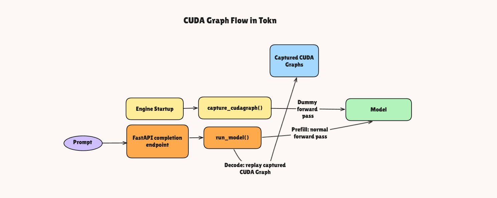

# CUDA Graph implementation in LLM Inference server

## 1. FastAPI server



This part contains the FastAPI server code. It accepts incoming prompts and adds those requests to the processing queue inside the generate_async function. The start_engine_loop runs inside the engine. Its responsibility is to continuously monitor the scheduler’s waiting queue and decide whether each request should go through the prefill or decode path. 

```python


  @app.on_event("startup")
  async def start_engine_loop():
        if engine.background_task is None:
            engine.background_task = asyncio.create_task(engine.run_loop())

  @app.post("/completions")
  async def completions(req: CompletionRequest):
        print(f"\n\nRequest received for with the prompt : {req.prompts}")

        tasks = [
            engine.generate_async(prompt)
            for prompt in req.prompts
        ]

        outputs = await asyncio.gather(*tasks)

        return {
            idx: output
            for idx, output in enumerate(outputs)
        }
    
```

## 2. Engine init

Inside the Engine class initialization, I call capture_cudagraph.

```python
if self.device.startswith("cuda") and not self.enforce_eager:
            self.capture_cudagraph()
```

## 3. Capture CUDA graph

This is the heart of the CUDA Graph implementation.
In this step, I first read the required configs, like max_num_seqs, which defines the maximum number of sequences that can be scheduled for prefill or decode.
Then, I create dummy buffers/context for running dummy prefill and decode passes. These dummy inputs are required because CUDA Graphs need a fixed execution pattern to capture.
After that, I create a list of batch sizes for which I want to capture CUDA Graphs. For decode, I mainly need batch size 1, because each decode step processes one token per sequence.
Finally, I iterate over each batch size, capture a CUDA Graph for that shape, and store it in a dictionary. Later, during inference, the server can pick the right graph based on the batch size and replay it instead of launching kernels one by one.

```python
@torch.inference_mode()
def capture_cudagraph(self):
    config = self.hf_config
    hidden_size = config.hidden_size
    max_bs = self.scheduler.max_num_seqs
    max_num_blocks = (self.max_model_len + self.block_size -1 ) // self.block_size
    device= torch.device(self.device)

    # static buffers = address fare frrozen for the liofe time of the graphs
    input_ids = torch.zeros(max_bs, dtype = torch.long,device = device)
    positions = torch.zeros(max_bs, dtype = torch.long,device = device)
    slot_mapping = torch.zeros(max_bs, dtype = torch.int32,device = device)
    context_lengths = torch.zeros(max_bs, dtype = torch.int32,device = device)
    block_tables = torch.zeros(max_bs, max_num_blocks, dtype = torch.int32,device = device)
    outputs = torch.zeros(max_bs, hidden_size, dtype = torch.float16,device = device)

    self.graph_bs = [bs for bs in (1,2,3,4) if bs <= max_bs]

    if max_bs not in self.graph_bs:
        self.graph_bs.append(max_bs)

    for bs in reversed(self.graph_bs) :
        graph = torch.cuda.CUDAGraph()
        set_context(
            is_prefill = False,
            slot_mapping = slot_mapping[:bs],
            context_lengths = context_lengths[:bs],
            block_tables = block_tables[:bs]
        )

        #Warm up run (lazy allocs / autotune happen OUTSIDE the graph capture)
        outputs[:bs] = self.custom_model.model(input_ids[:bs], positions[:bs])
        with torch.cuda.graph(graph, self.graph_pool):
            outputs[:bs] = self.custom_model.model(input_ids[:bs], positions[:bs])

        if self.graph_pool is None:
            self.graph_pool = graph.pool()
        
        self.graphs[bs] = graph
        torch.cuda.synchronize()
        reset_context()
    self.graph_vars = dict(
        input_ids = input_ids,
        positions = positions,
        slot_mapping = slot_mapping,
        context_lengths = context_lengths,
        block_tables = block_tables,
        outputs = outputs
    )
```

## 4.run model

This is the main model forward pass.
In this function, I use the captured CUDA Graph for the decode phase, because decode usually follows a fixed execution pattern and is a good fit for graph replay.
For prefill, I use the normal model forward pass, since prefill can have more dynamic shapes depending on the prompt length and chunk size.
So the flow is simple:

- Prefill: normal forward pass
- Decode: CUDA Graph replay

This keeps the implementation minimal while still showing the core idea of how CUDA Graphs can reduce kernel launch overhead during decoding.

```python
    def run_model(self, input_ids, positions, is_prefill):

        if is_prefill or self.enforce_eager or not self.graphs or input_ids.size(0) > self.graph_bs[-1]:
            return self.custom_model(input_ids, positions)

        bs      = input_ids.size(0)
        context = get_context()
        graph   = self.graphs[next(x for x in self.graph_bs if x >= bs)]
        gv      = self.graph_vars

        gv["input_ids"][:bs] = input_ids
        gv["positions"][:bs] = positions
        gv["slot_mapping"].fill_(-1)          # padding rows write nowhere
        gv["slot_mapping"][:bs] = context.slot_mapping
        gv["context_lens"].zero_()            # padding rows attend to nothing
        gv["context_lens"][:bs] = context.context_lens
        gv["block_tables"][:bs, :context.block_tables.size(1)] = context.block_tables

        graph.replay()

        return self.custom_model.compute_logits(gv["outputs"][:bs])
```
