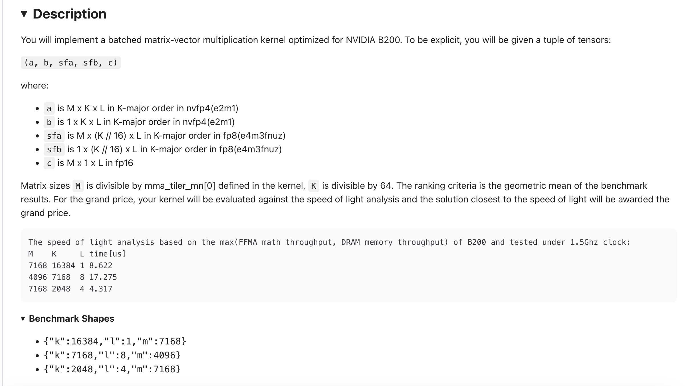

# GPU-MODE Leaderboards의 nvfp4_gemv 코드 읽기

> 내 강의 노트이며, 관심 있으면 팔로우해도 좋다: https://github.com/BBuf/how-to-optim-algorithm-in-cuda .

## 0x0. 머리말

GPU-MODE는 정기적으로 kernel competition을 열고 elapsed time ranking으로 가장 빠른 implementation을 가린다. 이번에는 `nvfp4_gemv` competition의 rank1 code를 살펴본다. link는 여기다: https://www.gpumode.com/leaderboard/595?tab=rankings

상위 3명의 속도 차이는 매우 작다. 이 글은 주로 rank1 implementation을 읽으며 B200을 대상으로 한 nvfp4 GEMV optimization idea를 배운다.

## 0x1. 문제 설명



NVIDIA B200에 optimized된 batched matrix-vector multiplication kernel을 구현해야 한다. input tensor는 다음과 같다.

- `a`: M × K × L, K-major, nvfp4(e2m1)
- `b`: 1 × K × L, K-major, nvfp4(e2m1)
- `sfa`: M × (K // 16) × L, fp8(e4m3fnuz), A의 scale factor, fp4 16개마다 하나 공유
- `sfb`: 1 × (K // 16) × L, fp8(e4m3fnuz), B의 scale factor
- `c`: M × 1 × L, fp16, output

ranking criterion은 각 benchmark result의 geometric mean이다. theoretical limit은 B200 최대 FFMA compute와 DRAM bandwidth, 1.5 GHz clock 기준이다.

| M    | K     | L | time [μs] |
|------|-------|---|-----------|
| 7168 | 16384 | 1 | 8.622     |
| 4096 | 7168  | 8 | 17.275    |
| 7168 | 2048  | 4 | 4.317     |

세 benchmark test shape는 `{"k": 16384, "l": 1, "m": 7168}`, `{"k": 7168, "l": 8, "m": 4096}`, `{"k": 2048, "l": 4, "m": 7168}`이다.

## 0x2. Baseline reference implementation

먼저 official baseline을 보자. 핵심은 batch마다 `torch._scaled_mm`을 호출해 nvfp4 block-scaled GEMV를 수행하는 것이다.

```python
import torch
from task import input_t, output_t
from utils import make_match_reference

# fp8 scale factor one per 16 nvfp4 elements
sf_vec_size = 16

def ceil_div(a, b):
    return (a + b - 1) // b


def to_blocked(input_matrix):
    # Convert linearly laid-out scale factors into cuBLAS D-style blocked format for torch._scaled_mm.
    # Reference: https://docs.nvidia.com/cuda/cublas/index.html#d-block-scaling-factors-layout
    rows, cols = input_matrix.shape
    n_row_blocks = ceil_div(rows, 128)
    n_col_blocks = ceil_div(cols, 4)
    blocks = input_matrix.view(n_row_blocks, 128, n_col_blocks, 4).permute(0, 2, 1, 3)
    rearranged = blocks.reshape(-1, 4, 32, 4).transpose(1, 2).reshape(-1, 32, 16)
    return rearranged.flatten()


def ref_kernel(data: input_t) -> output_t:
    """PyTorch reference implementation: call torch._scaled_mm per batch for NVFP4 block-scaled GEMV."""
    a_ref, b_ref, sfa_ref_cpu, sfb_ref_cpu, _, _, c_ref = data
    _, _, l = c_ref.shape
    for l_idx in range(l):
        # Convert scale factors into cuBLAS blocked format first. b has N padded to 128, so only column 0 is used.
        scale_a = to_blocked(sfa_ref_cpu[:, :, l_idx])
        scale_b = to_blocked(sfb_ref_cpu[:, :, l_idx])
        # b_ref[:, :, l_idx].shape = (128, K//2); after transpose it becomes (K//2, 128).
        # torch._scaled_mm requires N>=128, so b is padded to N=128 and only row 0 is the real vector.
        # res.shape = (M, 128); column 0 is the dot product between A and real b, others are meaningless padding.
        res = torch._scaled_mm(
            a_ref[:, :, l_idx],
            b_ref[:, :, l_idx].transpose(0, 1),
            scale_a.cuda(), scale_b.cuda(),
            bias=None, out_dtype=torch.float16,
        )
        c_ref[:, 0, l_idx] = res[:, 0]  # use only column 0, equivalent to undoing padding
    return c_ref
```

```python
def generate_input(m: int, k: int, l: int, seed: int):
    """Generate test input: a/b are nvfp4, sfa/sfb are fp8 scale factors, c is fp16 output.
    Also return cuBLAS blocked scale factors used by the custom kernel.
    """
    torch.manual_seed(seed)
    n = 1
    n_padded_128 = 128  # torch._scaled_mm requires N aligned to 128

    # Two nvfp4 values are packed into one uint8, so the stored K length is k//2.
    a_ref = torch.randint(0, 4, (l, m, k // 2), dtype=torch.uint8, device="cuda").permute(1, 2, 0)
    b_ref = torch.randint(0, 4, (l, n_padded_128, k // 2), dtype=torch.uint8, device="cuda").permute(1, 2, 0)
    a_ref = a_ref.view(torch.float4_e2m1fn_x2)
    b_ref = b_ref.view(torch.float4_e2m1fn_x2)
    c_ref = torch.randn((l, m, n), dtype=torch.float16, device="cuda").permute(1, 2, 0)

    def create_scale_factor_tensors(l, mn, sf_k):
        # Generate both linear layout and cuBLAS blocked layout scale factors.
        ref_f8 = torch.randint(0, 3, (l, mn, sf_k), dtype=torch.int8, device='cuda').to(torch.float8_e4m3fn)
        ref_f8_perm = ref_f8.permute(1, 2, 0)  # (mn, sf_k, l)

        atom_m, atom_k = (32, 4), 4
        mma_shape = (l, ceil_div(mn, atom_m[0]*atom_m[1]), ceil_div(sf_k, atom_k),
                     atom_m[0], atom_m[1], atom_k)
        reordered = torch.randint(0, 3, mma_shape, dtype=torch.int8, device='cuda').to(torch.float8_e4m3fn)
        reordered = reordered.permute(3, 4, 1, 5, 2, 0)  # -> (32, 4, ceil_mn, 4, ceil_sfk, l)

        i_grid, j_grid, b_grid = torch.meshgrid(
            torch.arange(mn, device='cuda'), torch.arange(sf_k, device='cuda'),
            torch.arange(l, device='cuda'), indexing='ij')
        mm   = i_grid // (atom_m[0] * atom_m[1])
        mm32 = i_grid % atom_m[0]
        mm4  = (i_grid % 128) // atom_m[0]
        kk, kk4 = j_grid // atom_k, j_grid % atom_k
        reordered[mm32, mm4, mm, kk4, kk, b_grid] = ref_f8_perm[i_grid, j_grid, b_grid]
        return ref_f8_perm.cpu(), reordered

    sf_k = ceil_div(k, sf_vec_size)
    sfa_ref_cpu, sfa_permuted = create_scale_factor_tensors(l, m, sf_k)
    sfb_ref_cpu, sfb_permuted = create_scale_factor_tensors(l, n_padded_128, sf_k)
    return (a_ref, b_ref, sfa_ref_cpu.cuda(), sfb_ref_cpu.cuda(), sfa_permuted, sfb_permuted, c_ref)


check_implementation = make_match_reference(ref_kernel, rtol=1e-03, atol=1e-03)
```

여기에는 주목할 세부 사항이 몇 가지 있다. `to_blocked`는 linearly laid-out scale factor를 cuBLAS가 요구하는 D-style blocked format으로 바꾼다. 또 하나 우회적인 지점은 `torch._scaled_mm`이 N dimension을 최소 128로 요구한다는 점이다. cuBLAS hardware alignment constraint 때문이다. 하지만 이 문제에서 b의 N은 1이다. 해결책은 `generate_input`에서 b를 N=128로 pad하는 것이다. `b_ref[0, :, :]`가 real vector이고 1-127행은 random padding이다. `_scaled_mm`을 호출하면 `(M, 128)` result를 얻고, `res[:, 0]`이 A와 real b vector의 dot product다. 나머지 127 column은 버리므로 padding을 되돌린 셈이다.

## 0x3. Rank1 code reading


이제 rank1 implementation을 보자. 전체적으로 `load_inline`으로 compile하는 hand-written CUDA kernel이며, 핵심 아이디어는 B200 bandwidth bottleneck에 맞춰 cache control을 매우 세밀하게 하고 PTX inline assembly로 fp4/fp8 packed format을 직접 다루어 불필요한 precision conversion overhead를 피하는 것이다.

```python
import torch
from torch.utils.cpp_extension import load_inline
from task import input_t, output_t

# ---- C++ stub: declare the function so load_inline can bind it ----
gemv_cpp = r"""
#include <torch/extension.h>

// Forward declaration so PyTorch can bind it (definition is in the CUDA source).
torch::Tensor cuda_nvfp4_gemv(torch::Tensor A,
                            torch::Tensor B,
                            torch::Tensor C,
                            torch::Tensor SFA,
                            torch::Tensor SFB);
"""

# ---- CUDA source: struct, kernel, launcher, and Python-facing wrapper ----
gemv_cuda = r"""
#include <assert.h>
#include <cuda.h>
#include <stdio.h>
#include <cuda_runtime.h>

#include <torch/extension.h>
#include <ATen/cuda/CUDAContext.h>
#include <c10/cuda/CUDAGuard.h>

#include <cuda_fp4.h>
#include <cuda_bf16.h>
#include <cuda_fp8.h>

struct Gemv_params {
    using index_t = uint64_t;

    int b, m, k, real_k;

    void *__restrict__ a_ptr, *__restrict__ b_ptr;
    void *__restrict__ sfa_ptr, *__restrict__ sfb_ptr, *__restrict__ o_ptr;

    index_t a_batch_stride, b_batch_stride, sfa_batch_stride, sfb_batch_stride, o_batch_stride;
    index_t a_row_stride,   b_row_stride,   sfa_row_stride,   sfb_row_stride,   o_row_stride;
};

static constexpr int BLOCK_SIZE = 128;
```

```c++
// GEMV is bandwidth-bound. Each row of A is read once, while B is shared by all rows.
// Different PTX load modifiers are selected for different K values to control cache behavior.
// Each call loads 32 fp4 values (16 fp4x2, 16 bytes) plus 2 fp8 scale values (uint16_t).

__device__ __forceinline__ void load_block_16x2fp4_generic(
    const __nv_fp4x2_e2m1* rowA,
    const __nv_fp4x2_e2m1* vecB,
    const uint16_t*        rowS_u16,
    const uint16_t*        vecS_u16,
    int                    elem_base,
    int                    block_base,
    uint64_t (&a_regs)[2],
    uint64_t (&b_regs)[2],
    uint16_t &sfa_regs,
    uint16_t &sfb_regs)
{
    uint64_t rowA_addr = reinterpret_cast<uint64_t>(rowA + elem_base);
    uint64_t vecB_addr = reinterpret_cast<uint64_t>(vecB + elem_base);
    uint64_t rowS_addr = reinterpret_cast<uint64_t>(rowS_u16 + block_base);
    uint64_t vecS_addr = reinterpret_cast<uint64_t>(vecS_u16 + block_base);

    asm volatile(
        "ld.global.u64.v2 {%0, %1}, [%4];\n\t"
        "ld.global.u64.v2 {%2, %3}, [%5];\n\t"
        : "=l"(a_regs[0]), "=l"(a_regs[1]), "=l"(b_regs[0]), "=l"(b_regs[1])
        : "l"(rowA_addr), "l"(vecB_addr)
    );
    asm volatile(
        "ld.global.u16 %0, [%2];\n\t"
        "ld.global.u16 %1, [%3];\n\t"
        : "=h"(sfa_regs), "=h"(sfb_regs)
        : "l"(rowS_addr), "l"(vecS_addr)
    );
}
```

```c++
// k=3584: stream A with .cs and keep B in L2 with L2::128B.
// k=8192: stream A; A scale uses .lu for last-use hint.
// k=1024: stream both A and A scale with .cs.
template<int K>
__device__ __forceinline__ void load_block_16x2fp4(
    const __nv_fp4x2_e2m1* rowA,
    const __nv_fp4x2_e2m1* vecB,
    const uint16_t*        rowS_u16,
    const uint16_t*        vecS_u16,
    int                    elem_base,
    int                    block_base,
    uint64_t (&a_regs)[2],
    uint64_t (&b_regs)[2],
    uint16_t &sfa_regs,
    uint16_t &sfb_regs)
{
    if constexpr (K == 3584) {
        load_block_16x2fp4_k3584(rowA, vecB, rowS_u16, vecS_u16,
            elem_base, block_base, a_regs, b_regs, sfa_regs, sfb_regs);
    } else if constexpr (K == 8192) {
        load_block_16x2fp4_k8192(rowA, vecB, rowS_u16, vecS_u16,
            elem_base, block_base, a_regs, b_regs, sfa_regs, sfb_regs);
    } else if constexpr (K == 1024) {
        load_block_16x2fp4_k1024(rowA, vecB, rowS_u16, vecS_u16,
            elem_base, block_base, a_regs, b_regs, sfa_regs, sfb_regs);
    } else {
        load_block_16x2fp4_generic(rowA, vecB, rowS_u16, vecS_u16,
            elem_base, block_base, a_regs, b_regs, sfa_regs, sfb_regs);
    }
}

// Specialized for k=8192: load 64 fp4 values + 4 fp8 scale values.
// A: no L1 allocation and prefer evicting from L2; B: keep in L1/L2 because all rows share it.
__device__ __forceinline__ void load_block_32x2fp4(/* same arguments omitted for brevity */);
```

```c++
// See the final "block_scaled_fma function details" section for full explanation.
__device__ __forceinline__ float block_scaled_fma_16x2fp4(
    const uint64_t (&a_regs)[2],
    const uint64_t (&b_regs)[2],
    uint16_t       sfa_regs,
    uint16_t       sfb_regs)
{
    const uint32_t* a = reinterpret_cast<const uint32_t*>(a_regs);
    const uint32_t* b = reinterpret_cast<const uint32_t*>(b_regs);

    // Step 1: fp8 scale decode + combine
    uint32_t sfa_f16x2, sfb_f16x2, sf_f16x2;
    asm("cvt.rn.f16x2.e4m3x2 %0, %1;" : "=r"(sfa_f16x2) : "h"(sfa_regs));
    asm("cvt.rn.f16x2.e4m3x2 %0, %1;" : "=r"(sfb_f16x2) : "h"(sfb_regs));
    asm("mul.rn.f16x2 %0, %1, %2;"    : "=r"(sf_f16x2)  : "r"(sfa_f16x2), "r"(sfb_f16x2));

    // Step 2: broadcast scale0/scale1 as packed f16x2
    uint16_t lane0, lane1;
    uint32_t scale0, scale1;
    asm("mov.b32 {%0,%1}, %2;"  : "=h"(lane0), "=h"(lane1) : "r"(sf_f16x2));
    asm("mov.b32 %0, {%1,%1};"  : "=r"(scale0) : "h"(lane0));
    asm("mov.b32 %0, {%1,%1};"  : "=r"(scale1) : "h"(lane1));

    uint32_t accum = 0;

    // Step 3: two scale blocks, each processing 16 fp4 values
    #pragma unroll
    for (int blk = 0; blk < 2; ++blk) {
        uint32_t cvt_a[8], cvt_b[8];
        // convert packed e2m1x2 fp4 bytes to f16x2, then do packed fma
        uint32_t grp = 0;
        #pragma unroll
        for (int i = 0; i < 8; ++i)
            asm("fma.rn.f16x2 %0,%1,%2,%0;" : "+r"(grp) : "r"(cvt_a[i]), "r"(cvt_b[i]));
        uint32_t scale = (blk == 0) ? scale0 : scale1;
        asm("mul.rn.f16x2 %0,%1,%0;" : "+r"(grp) : "r"(scale));
        asm("add.rn.f16x2 %0,%0,%1;" : "+r"(accum) : "r"(grp));
    }

    // Step 4: add two lanes of f16x2 -> scalar f16 -> f32
    uint16_t r0, r1, result_f16;
    asm("mov.b32 {%0,%1}, %2;" : "=h"(r0), "=h"(r1) : "r"(accum));
    asm("add.rn.f16 %0,%1,%2;" : "=h"(result_f16) : "h"(r0), "h"(r1));
    float result;
    asm("cvt.f32.f16 %0,%1;"   : "=f"(result) : "h"(result_f16));
    return result;
}
```

```c++
// Template parameters:
// ROWS_PER_BLOCK: rows covered by a block
// THREADS_PER_ROW: threads per row, parallel along K
// ITERS: compile-time unroll count when >0, dynamic loop when 0
// K_SPECIAL: value for load-function specialization
// USE_32X2: path selection
// grid: (M/ROWS_PER_BLOCK, 1, L); rib=row-in-block, lane=K-direction index
template <int ROWS_PER_BLOCK, int THREADS_PER_ROW, int ITERS, int K_SPECIAL, bool USE_32X2>
__global__ void __launch_bounds__(ROWS_PER_BLOCK * THREADS_PER_ROW, 8)
gemv_kernel(const __grid_constant__ Gemv_params params)
{
    const int tid   = threadIdx.x;
    const int rib   = tid / THREADS_PER_ROW;
    const int lane  = tid % THREADS_PER_ROW;
    const int batch = blockIdx.z;
    const int row   = blockIdx.x * ROWS_PER_BLOCK + rib;

    float sum = 0.f;

    if constexpr (USE_32X2) {
        // reduction: shared memory 128 -> 32, then warp shuffle
    } else {
        auto body = [&](int idx) {
            int block_base = idx * THREADS_PER_ROW + lane;
            int elem_base  = block_base * 16;
            uint64_t a_regs[2], b_regs[2];
            uint16_t sfa_regs, sfb_regs;
            load_block_16x2fp4<K_SPECIAL>(rowA, vecB, rowS_u16, vecS_u16,
                elem_base, block_base, a_regs, b_regs, sfa_regs, sfb_regs);
            sum += block_scaled_fma_16x2fp4(a_regs, b_regs, sfa_regs, sfb_regs);
        };

        #pragma unroll
        for (int offset = THREADS_PER_ROW / 2; offset > 0; offset /= 2) {
            sum += __shfl_down_sync(0xffffffffu, sum, offset, THREADS_PER_ROW);
        }
    }
}
```

~~~c++
torch::Tensor cuda_nvfp4_gemv(torch::Tensor A,
                            torch::Tensor B,
                            torch::Tensor C,
                            torch::Tensor SFA,
                            torch::Tensor SFB)
{
    const auto sizes = A.sizes();
    const int M = sizes[0];
    const int K = sizes[1];
    const int L = sizes[2];

    Gemv_params params{};
    params.b = L;
    params.m = M;
    params.k = K;

    // Static dispatch by K value to the best configuration:
    // <ROWS_PER_BLOCK, THREADS_PER_ROW, ITERS, K_SPECIAL, USE_32X2>
    // grid = (M/ROWS_PER_BLOCK, 1, L)
    if (params.k <= 256) {
        gemv_kernel<16, 8, 0, 0, false><<<dim3(params.m/16,1,params.b), 128>>>(params);
    } else if (params.k == 3584) {
        // 3584 = 7 * (32 threads * 16 fp4x2)
        gemv_kernel<4, 32, 7, 3584, false><<<dim3(params.m/4,1,params.b), 128>>>(params);
    } else if (params.k == 8192) {
        // 8192 = 2 * (128 threads * 32 fp4x2), uses the USE_32X2 path
        gemv_kernel<1, 128, 0, 8192, true><<<dim3(params.m,1,params.b), 128>>>(params);
    } else if (params.k == 1024) {
        // 1024 = 4 * (16 threads * 16 fp4x2)
        gemv_kernel<8, 16, 4, 1024, false><<<dim3(params.m/8,1,params.b), 128>>>(params);
    } else {
        gemv_kernel<8, 16, 0, 0, false><<<dim3(params.m/8,1,params.b), 128>>>(params);
    }

    return C;
}
"""
~~~

~~~python
# ---- build the module ----
nvfp4_module = load_inline(
    name="nvfp4_gemv",
    cpp_sources=[gemv_cpp],
    cuda_sources=[gemv_cuda],
    functions=["cuda_nvfp4_gemv"],
    extra_cuda_cflags=[
        "-std=c++17",
        "-gencode=arch=compute_100a,code=sm_100a",  # B200
        "--ptxas-options=--gpu-name=sm_100a",
        "-O3", "-w",
        "-maxrregcount=32",      # limit register usage, improve occupancy, hide bandwidth latency
        "--use_fast_math",
        "-allow-unsupported-compiler",
    ],
    extra_ldflags=["-lcuda", "-lcublas"],
    verbose=True,
)


def custom_kernel(data: input_t) -> output_t:
    return nvfp4_module.cuda_nvfp4_gemv(data[0], data[1], data[6], data[2], data[3])
~~~

전체 code는 몇 부분으로 나눠 볼 수 있다. data loading function family(`load_block_*`), core FMA compute function(`block_scaled_fma_*`), main kernel template(`gemv_kernel`), 그리고 launcher다. 아래에서 각각 펼친다.

### 0x3.1 data loading: 세밀한 cache control

GEMV는 전형적인 bandwidth-bound operation이다. A matrix의 각 row는 한 번만 읽지만, B vector는 M개 row의 모든 thread가 공유해 반복적으로 읽는다. 이 특징에 맞춰 rank1은 PTX load modifier로 cache를 세밀하게 제어한다.

- **A matrix**: `.cs`(cache streaming)로 streaming load한다. hardware에 이 data는 읽고 나면 다시 쓰지 않으니 L1/L2 cache를 오염시키지 말라고 알려준다.
- **B vector**: `L2::128B`, `L2::evict_last` 같은 modifier로 B가 가능한 한 L2에 머무르게 한다. B는 반복적으로 읽히기 때문이다.

더 나아가 K 값별로 `_k3584`, `_k8192`, `_k1024` specialized version을 제공하고, `if constexpr`로 compile-time dispatch한다. runtime branch overhead가 없다. 예를 들어 k=8192의 `load_block_32x2fp4`는 A에 `L1::no_allocate + L2::evict_first`를 적용한다. 이는 A가 L2를 차지하지 않게 하고 완전히 streaming path로 보내겠다는 뜻이다.

### 0x3.2 thread model

kernel의 핵심 아이디어는 다음이다. **한 output row를 여러 thread가 협력해 계산하고, 각 thread가 K direction의 다른 segment를 맡은 뒤, 마지막에 reduction해 scalar output을 쓴다.**

block은 128 threads로 고정된다. `THREADS_PER_ROW` threads가 같은 row의 K direction을 담당하고, `ROWS_PER_BLOCK = 128 / THREADS_PER_ROW` rows를 동시에 처리한다.

~~~cpp
const int rib  = tid / THREADS_PER_ROW;  // which row inside block
const int lane = tid % THREADS_PER_ROW;  // K-direction lane
const int row  = blockIdx.x * ROWS_PER_BLOCK + rib;
~~~

grid는 `(M/ROWS_PER_BLOCK, 1, L)`이고 `blockIdx.z`가 batch에 대응한다. 각 K 값 configuration은 다음과 같다.

| K(fp4x2 unit) | `ROWS_PER_BLOCK` | `THREADS_PER_ROW` | path |
|---|---|---|---|
| ≤256 | 16 | 8 | 16x2 dynamic |
| 1024 | 8 | 16 | 16x2 unroll 4 |
| 3584 | 4 | 32 | 16x2 unroll 7 |
| 8192 | 1 | 128 | **32x2** unroll 2 |

K=3584를 예로 들어 보자. benchmark shape의 k=7168에 해당한다. nvfp4는 둘씩 pack되므로 `params.k = 7168/2 = 3584`다. block 하나가 4 rows를 처리하고, 128 threads = 4 rows × 32 threads/row가 된다. 각 iteration에서 32 lanes는 현재 512 fp4x2를 균등하게 나눈다(`block_base = idx×32 + lane`). 7번 iteration으로 총 7×32×16 = 3584 fp4x2 = **7168 fp4**를 cover한다. 각 lane은 7 segment partial sum을 누적하고, 마지막에 warp shuffle로 lane=0까지 reduce한다.

## 0x4. `block_scaled_fma` function details

`block_scaled_fma_16x2fp4`와 `block_scaled_fma_32x2fp4`는 전체 kernel의 compute core다. logic은 같고 scale만 다르다. 전자는 한 번에 32 fp4 + 2 fp8 scale을 처리하고, 후자는 64 fp4 + 4 fp8 scale을 처리한다. 아래에서는 `_16x2fp4`를 예로 단계별로 본다.

### 0x4.1 input data layout

~~~cpp
__device__ __forceinline__ float block_scaled_fma_16x2fp4(
    const uint64_t (&a_regs)[2],   // 2 * 8 bytes = 32 fp4 values
    const uint64_t (&b_regs)[2],
    uint16_t sfa_regs,             // 2 fp8 scale values, one per 16 fp4
    uint16_t sfb_regs)
{
    const uint32_t* a = reinterpret_cast<const uint32_t*>(a_regs);  // treated as 4 uint32 values
    const uint32_t* b = reinterpret_cast<const uint32_t*>(b_regs);
~~~

`a_regs[0]` → `a[0], a[1]`은 16 fp4, 즉 하나의 scale block을 cover한다. `a_regs[1]` → `a[2], a[3]`은 또 다른 16 fp4를 cover한다. `sfa_regs`라는 uint16_t 하나에는 fp8 두 개가 packed되어 있으며, 이 두 scale block에 각각 대응한다.

### 0x4.2 scale decode and broadcast

~~~cpp
    uint32_t sfa_f16x2, sfb_f16x2, sf_f16x2;
    asm("cvt.rn.f16x2.e4m3x2 %0, %1;" : "=r"(sfa_f16x2) : "h"(sfa_regs));
    asm("cvt.rn.f16x2.e4m3x2 %0, %1;" : "=r"(sfb_f16x2) : "h"(sfb_regs));
    asm("mul.rn.f16x2 %0, %1, %2;"    : "=r"(sf_f16x2)  : "r"(sfa_f16x2), "r"(sfb_f16x2));

    uint16_t lane0, lane1;
    uint32_t scale0, scale1;
    asm("mov.b32 {%0,%1}, %2;"  : "=h"(lane0), "=h"(lane1) : "r"(sf_f16x2));
    asm("mov.b32 %0, {%1,%1};"  : "=r"(scale0) : "h"(lane0));  // {s0, s0}
    asm("mov.b32 %0, {%1,%1};"  : "=r"(scale1) : "h"(lane1));  // {s1, s1}
~~~

`cvt.rn.f16x2.e4m3x2`는 B200의 new instruction으로, uint16 하나(2 fp8)를 한 번에 f16x2 하나(2 fp16)로 바꾼다. `mul` 뒤에는 `sf_f16x2 = {sfa[0]*sfb[0], sfa[1]*sfb[1]}`을 얻는다.

그 다음 두 scalar scale을 각각 `{s0,s0}`와 `{s1,s1}` packed form으로 broadcast한다. 뒤의 FMA가 f16x2 단위로 수행되므로 같은 scale이 두 fp16 element를 동시에 scale해야 하기 때문이다.

### 0x4.3 core FMA loop

~~~cpp
    for (int blk = 0; blk < 2; ++blk) {
        uint32_t cvt_a[8], cvt_b[8];

        // Convert two uint32 values (16 fp4) in bulk into eight f16x2 values.
        asm volatile(
            "{ .reg .b8 x0,x1,x2,x3,x4,x5,x6,x7;\n\t"
            "mov.b32 {x0,x1,x2,x3}, %8;  mov.b32 {x4,x5,x6,x7}, %9;\n\t"
            "cvt.rn.f16x2.e2m1x2 %0,x0; ... cvt.rn.f16x2.e2m1x2 %7,x7; }"
            : /* 8 outputs */ : "r"(a[blk*2]), "r"(a[blk*2+1]));
        // b is converted in the same way.

        uint32_t grp = 0;
        for (int i = 0; i < 8; ++i)
            asm("fma.rn.f16x2 %0,%1,%2,%0;" : "+r"(grp) : "r"(cvt_a[i]), "r"(cvt_b[i]));

        uint32_t scale = (blk == 0) ? scale0 : scale1;
        asm("mul.rn.f16x2 %0,%1,%0;" : "+r"(grp) : "r"(scale));
        asm("add.rn.f16x2 %0,%0,%1;" : "+r"(accum) : "r"(grp));
    }
~~~

여기서 주목할 점은 다음과 같다.

- `mov.b32 {x0,..,x3}, reg`는 32-bit register 하나를 4 bytes로 쪼갠다. 각 byte에는 2 fp4가 들어 있다.
- `cvt.rn.f16x2.e2m1x2`는 1 byte(2 fp4)를 한 번에 1 f16x2로 변환하며, 8번으로 16 fp4를 cover한다.
- **모든 cvt를 먼저 끝내고 FMA를 한꺼번에 수행한다.** 이는 의도적인 instruction scheduling이다. batch cvt는 conversion unit pipeline을 더 잘 채우고 FMA unit과 port 경쟁을 줄인다.
- `grp`는 f16x2다. lane0과 lane1은 각각 even/odd position product를 누적하고, 두 값을 더해야 complete dot product가 된다.

### 0x4.4 final reduction

~~~cpp
    uint16_t r0, r1, result_f16;
    asm("mov.b32 {%0,%1}, %2;" : "=h"(r0), "=h"(r1) : "r"(accum));
    asm("add.rn.f16 %0,%1,%2;" : "=h"(result_f16) : "h"(r0), "h"(r1));
    float result;
    asm("cvt.f32.f16 %0,%1;"   : "=f"(result) : "h"(result_f16));
    return result;
~~~

`accum`(f16x2)의 두 lane을 더하고 f32로 올려 return한다. `_16x2fp4`가 f32를 return하는 이유는 결과가 여러 번의 `__shfl_down_sync`로 cross-thread accumulation을 거쳐야 하며 f16 precision이 부족하기 때문이다. `_32x2fp4`는 shared memory reduction path이고 chain이 짧아서 f16으로 충분하므로 `__half`를 return한다.

비교하면 다음과 같다.

| | `block_scaled_fma_16x2fp4` | `block_scaled_fma_32x2fp4` |
|---|---|---|
| input fp4 count | 32(`a_regs[2]`) | 64(`a_regs[4]`) |
| scale input | 1×uint16(2 fp8) | 2×uint16(4 fp8) |
| inner loop count | 2 | 4 |
| return type | `float`(f32) | `__half`(f16) |
| reduction method | warp shuffle | shared memory |

## 0x5. 정리

이 rank1 code에서 배울 만한 점은 주로 다음과 같다.

**cache control granularity가 매우 세밀하다.** A는 한 번만 읽고 B는 반복 공유된다는 access pattern에 맞춰 PTX modifier를 다르게 적용한다. K 값마다 specialized version까지 제공해 B200의 L2 cache utilization을 최대한 끌어낸다.

**data format을 끝까지 packed 상태로 유지한다.** fp4를 수동으로 풀지 않고 `cvt.rn.f16x2.e2m1x2`, `cvt.rn.f16x2.e4m3x2` 같은 B200 new PTX instruction으로 packed format을 직접 다룬다. 이 덕분에 register pressure와 instruction count를 줄인다.

**reduction method는 path마다 다르다.** 16x2 path는 `__shfl_down_sync` warp shuffle tree reduce를 사용한다. latency가 낮아 THREADS_PER_ROW가 작은 case에 적합하다. 32x2 path는 THREADS_PER_ROW=128로 warp 하나를 넘으므로 shared memory로 128→64→32 두 단계 folding을 거친 뒤 warp shuffle reduction을 수행한다. 동시에 `float`이 아니라 `__half`를 return해 register를 절약한다.

**전체가 PTX inline assembly다.** loading(`ld.global.cs`, `L2::evict_last` 등)부터 scale decode(`cvt.rn.f16x2.e4m3x2`), fp4 conversion(`cvt.rn.f16x2.e2m1x2`), packed FMA(`fma.rn.f16x2`), final reduction(`add.rn.f16`, `cvt.f32.f16`)까지 모두 handwritten PTX를 사용한다. compiler의 register allocation과 instruction scheduling을 우회해 hardware control granularity를 가장 작은 단위까지 끌어내린다.

전체적으로 이 code는 bandwidth-bound kernel을 B200에서 극한으로 tuning하는 방식을 잘 보여준다. detail이 많다.


