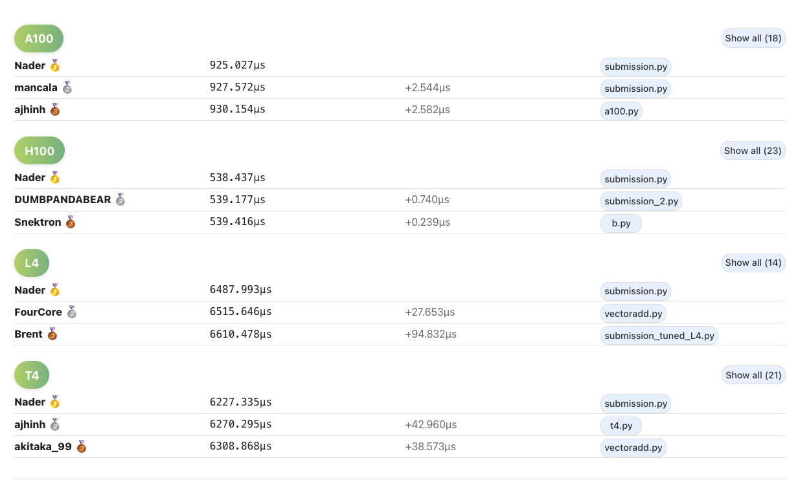
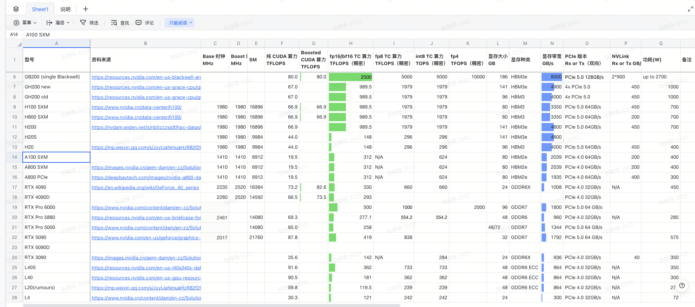
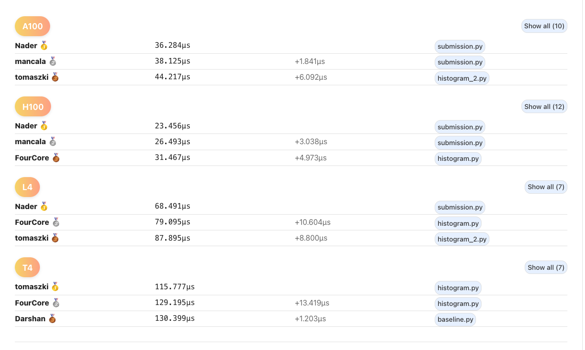
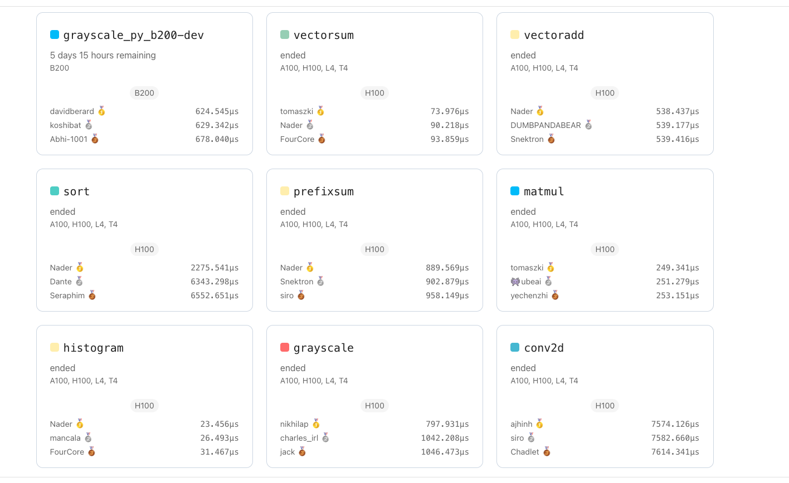
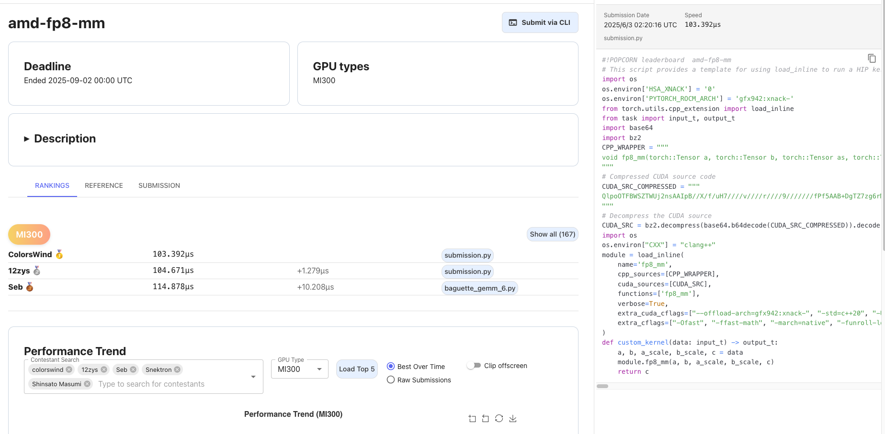

> 제 수업 노트입니다. 관심 있으시면 팔로우해 주세요: https://github.com/BBuf/how-to-optim-algorithm-in-cuda .


# vector_add 

링크: https://www.gpumode.com/leaderboard/345?tab=rankings

## 설명
 
`float16` 벡터 덧셈 Kernel을 구현합니다.
 
입력: `tuple(torch.Tensor, torch.Tensor)`이며, 두 tensor의 shape는 모두 `(N, N)`, dtype은 `torch.float16`입니다. 이 tensor들은 평균 0, 분산 1의 정규분포에서 나옵니다. 출력: shape가 `(N, N)`이고 dtype이 `torch.float16`인 `torch.Tensor`입니다.

## Benchmark Shapes

- {"size":1024}
- {"size":2048}
- {"size":4096}
- {"size":8192}
- {"size":16384}

## 참고 구현

```python
from utils import make_match_reference
import torch
from task import input_t, output_t


def ref_kernel(data: input_t) -> output_t:
    """
    Reference implementation of vector addition using PyTorch.
    Args:
        data: Tuple of tensors [A, B] to be added.
    Returns:
        Tensor containing element-wise sums.
    """
    A, B = data
    return A + B


def generate_input(size: int, seed: int) -> input_t:
    """
    Generates random input tensors of specified shapes.
    Returns:
        Tuple of tensors [A, B] to be added.
    """
    gen = torch.Generator(device='cuda')
    gen.manual_seed(seed)
    A = torch.randn(size, size, device='cuda', dtype=torch.float16, generator=gen).contiguous()
    B = torch.randn(size, size, device='cuda', dtype=torch.float16, generator=gen).contiguous()
    return (A, B)


check_implementation = make_match_reference(ref_kernel)
```

## rank1 코드 구현

A100, H100, L4, T4에서 코드는 모두 같습니다. cccl을 사용한, 꽤 hack에 가까운 방식입니다.

```python
#!POPCORN leaderboard vectoradd

try:
    import cuda.parallel.experimental.algorithms as algorithms
except:
    import os
    import subprocess

    if not os.path.exists("cccl"):
        subprocess.check_call(["git", "clone", "https://github.com/NaderAlAwar/cccl.git"])

    subprocess.check_call(["git", "checkout", "gpu-mode-submissions-a100"], cwd="cccl")
    subprocess.check_call(["git", "checkout", "49b7297dbe3abddbc25f937b132b8e6e16202100"], cwd="cccl")

    env = os.environ.copy()
    env["CC"] = "gcc"
    env["CXX"] = "g++"
    env["CMAKE_ARGS"] = "-DCMAKE_CXX_STANDARD=20"

    subprocess.check_call(["pip", "install", "../cuda_cccl"], cwd="cccl/python/cuda_parallel", env=env)
    subprocess.check_call(["pip", "install", "."], cwd="cccl/python/cuda_parallel", env=env)

import functools
import cuda.parallel.experimental.algorithms as algorithms
import torch

from task import input_t, output_t

d_in1 = torch.tensor([1], dtype=torch.float16).cuda()
d_in2 = torch.tensor([1], dtype=torch.float16).cuda()

def op(a, b):
    return a + b

transform = algorithms.binary_transform(d_in1, d_in2, d_in2, op)

@functools.cache
def initialize(shape):
    return torch.empty(shape, dtype=torch.float16).cuda(), shape[0] * shape[1]

def custom_kernel(data: input_t) -> output_t:
    d_in1, d_in2 = data
    d_out, numel = initialize(d_in1.shape)
    transform(d_in1, d_in2, d_out, numel)
    return d_out
```





## 대역폭 이용률 추정

`vector_add`에서 각 원소의 최소 global memory traffic은 읽기 2번 + 쓰기 1번입니다. 입력과 출력이 모두 `fp16`이므로, 원소 하나당 다음과 같습니다.

`2 bytes + 2 bytes + 2 bytes = 6 bytes`

여기서는 최대 shape인 `16384 x 16384`를 기준으로 계산합니다.

따라서:

- **총 원소 수**: `16384 x 16384 = 268,435,456`
- **총 이동 바이트 수**: `268,435,456 x 6 = 1,610,612,736 bytes ≈ 1.611 GB`
- **유효 대역폭**: `1,610,612,736 / time`
- **대역폭 이용률**: `유효 대역폭 / 이론 대역폭`

스크린샷의 rank1 실행 시간을 기준으로 추정하면:

| GPU | 실행 시간 | 추정 유효 대역폭 | 이론 대역폭 | 대역폭 이용률 |
|--|--:|--:|--:|--:|
| A100 | 925.027 us | 1741.15 GB/s | 2039 GB/s | 85.39% |
| H100 | 538.437 us | 2991.67 GB/s | 3350 GB/s | 89.30% |
| L4 | 6487.993 us | 248.24 GB/s | 300 GB/s | 82.75% |
| T4 | 6227.335 us | 258.64 GB/s | 300 GB/s | 86.21% |

대역폭이 모두 80% 이상까지 나오는 것을 보면, cccl의 elementwise template은 이미 아주 잘 만들어져 있음을 알 수 있습니다. Leaderboards의 다른 손작성 CUDA 코드는 모두 이 코드보다 대역폭 이용률이 낮습니다.


# histogram(히스토그램)

링크: https://www.gpumode.com/leaderboard/341?tab=rankings

## 설명

histogram Kernel을 구현합니다. 입력 tensor 안에서 몇 개의 원소가 각 bin에 들어가는지 세는 작업입니다. 값의 범위는 고정되어 있고 입력 size는 모두 16의 배수입니다. 참고 구현에서 `torch.bincount(data, minlength=256)`을 직접 사용하므로, 여기서는 값이 `[0, 255]` 범위에 있는 discrete integer에 대해 256개 bin을 세는 문제로 이해할 수 있습니다.

입력: shape가 `(size,)`인 tensor `data`.

## Benchmark Shapes

- {"contention":10,"size":1310720}
- {"contention":10,"size":2621440}
- {"contention":40,"size":2621440}
- {"contention":90,"size":2621440}
- {"contention":10,"size":5242880}
- {"contention":10,"size":10485760}

## 참고 구현

```python
from utils import verbose_allequal
import torch
from task import input_t, output_t


def ref_kernel(data: input_t) -> output_t:
    # 참고 구현: PyTorch의 bincount로 각 bin의 count를 바로 계산합니다.
    return torch.bincount(data, minlength=256)


def generate_input(size: int, contention: float, seed: int) -> input_t:
    # histogram 입력을 생성합니다. 기본 분포는 [0, 255] 위의 랜덤 uint8입니다.
    gen = torch.Generator(device='cuda')
    gen.manual_seed(seed)
    
    # 입력 데이터를 랜덤 생성합니다.
    data = torch.randint(0, 256, (size,), device='cuda', dtype=torch.uint8, generator=gen)

    # 어떤 값을 높은 빈도로 등장시켜 atomic contention을 높입니다.
    evil_value = torch.randint(0, 256, (), device='cuda', dtype=torch.uint8, generator=gen)
    evil_loc = torch.rand((size,), device='cuda', dtype=torch.float32, generator=gen) < (contention / 100.0)
    data[evil_loc] = evil_value

    return data.contiguous()


def check_implementation(data, output):
    # 사용자 구현과 참고 구현이 완전히 같은지 비교합니다.
    expected = ref_kernel(data)
    reasons = verbose_allequal(output, expected)

    if len(reasons) > 0:
        return "mismatch found! custom implementation doesn't match reference: " + " ".join(reasons)

    return ''
```

## rank 스크린샷

먼저 leaderboard의 구현 스크린샷을 붙입니다.





## 대역폭 이용률 추정

`histogram` 연산자는 `vector_add`와 다릅니다. 많은 atomic add가 포함되며, 특히 contention이 높은 장면에서는 실제 global memory transaction 양이 이상적인 최소치보다 훨씬 커질 수 있습니다. 그래서 여기서의 대역폭 추정은 **최소 global memory traffic의 하한**만 기준으로 계산하며, 보수적인 참고값으로만 봐야 합니다.

여기서는 최대 shape인 `size = 10485760` 기준으로 추정합니다.

최소 traffic은 대략 다음과 같이 쓸 수 있습니다.

- **입력 읽기**: `10485760 x 1 byte = 10,485,760 bytes`
- **출력 histogram 쓰기**: `256 x 8 bytes = 2,048 bytes`

따라서 총 이동 바이트 수의 하한은 약:

`10,485,760 + 2,048 = 10,487,808 bytes ≈ 10.488 MB`

대응 공식은 다음과 같습니다.

- **유효 대역폭**: `10,487,808 / time`
- **대역폭 이용률**: `유효 대역폭 / 이론 대역폭`

### A100

| 순위 | 실행 시간 | 추정 유효 대역폭 | 이론 대역폭 | 대역폭 이용률 |
|--|--:|--:|--:|--:|
| rank1 | 36.284 us | 289.03 GB/s | 2039 GB/s | 14.18% |
| rank2 | 38.125 us | 275.09 GB/s | 2039 GB/s | 13.49% |
| rank3 | 44.217 us | 237.19 GB/s | 2039 GB/s | 11.63% |

### H100

| 순위 | 실행 시간 | 추정 유효 대역폭 | 이론 대역폭 | 대역폭 이용률 |
|--|--:|--:|--:|--:|
| rank1 | 23.456 us | 447.12 GB/s | 3350 GB/s | 13.35% |
| rank2 | 26.493 us | 395.86 GB/s | 3350 GB/s | 11.82% |
| rank3 | 31.467 us | 333.29 GB/s | 3350 GB/s | 9.95% |

### L4

| 순위 | 실행 시간 | 추정 유효 대역폭 | 이론 대역폭 | 대역폭 이용률 |
|--|--:|--:|--:|--:|
| rank1 | 68.491 us | 153.13 GB/s | 300 GB/s | 51.04% |
| rank2 | 79.095 us | 132.60 GB/s | 300 GB/s | 44.20% |
| rank3 | 87.895 us | 119.32 GB/s | 300 GB/s | 39.77% |

### T4

| 순위 | 실행 시간 | 추정 유효 대역폭 | 이론 대역폭 | 대역폭 이용률 |
|--|--:|--:|--:|--:|
| rank1 | 115.777 us | 90.58 GB/s | 300 GB/s | 30.19% |
| rank2 | 129.195 us | 81.18 GB/s | 300 GB/s | 27.06% |
| rank3 | 130.399 us | 80.43 GB/s | 300 GB/s | 26.81% |

이 결과를 보면 `histogram`의 "표면상 대역폭 이용률"은 `vector_add`보다 명확히 낮습니다. 이는 구현이 반드시 나쁘다는 뜻이 아니라, histogram의 핵심 병목이 단순한 순차 대역폭 읽기/쓰기보다 atomic 충돌, memory hotspot, 동기화 비용에서 더 많이 나오기 때문입니다.

## 코드 구현

A100, H100, L4의 rank1도 모두 cccl 안의 histogram 알고리즘을 직접 호출해 최대 속도를 얻었습니다. 여기서는 A100과 H100에서 rank2인 코드 구현을 보겠습니다. rank1보다 조금 느리지만 차이는 크지 않습니다.

```python
import torch
from torch.utils.cpp_extension import load_inline
from typing import List
from triton.testing import do_bench
input_t = output_t = torch.Tensor

# CUDA extension을 inline compile합니다. 핵심 아이디어는 먼저 shared memory에서 block 내부 local histogram을 만들고,
# block 내부 결과를 reduce한 뒤 global bins에 써서 global memory에 직접 쏟아지는 atomic 충돌을 줄이는 것입니다.
add_cuda_source = """

// 1024 threads/block = 32 warps.
// 여기서는 각 warp에 private 256-bin histogram 하나를 할당합니다. 전체 크기는 256 * 32입니다.
#define HISTOGRAM_SIZE 256 * 32

template <typename scalar_t, typename TVec>
__global__ void histogram_kernel(
    const scalar_t* __restrict__ inp,
    int* __restrict__ bins  // must be int see atomicAdd documentation
) {
    // block 단위 shared histogram입니다.
    // layout은 [warp_id][bin_id]로 이해할 수 있으며, 각 warp가 256개 bin을 독점합니다.
    __shared__ uint32_t local_hist[HISTOGRAM_SIZE];
    const int tid = threadIdx.x;

    #pragma unroll
    for (int k = 0; k < 8; k++) {
        // 1024개 thread가 각각 8개 원소를 초기화해 총 8192개 slot을 모두 0으로 만듭니다.
        local_hist[tid + (k * 1024)] = 0;
    }

    const size_t idx = (blockIdx.x * blockDim.x) + threadIdx.x;
    constexpr size_t elem_per_thread = sizeof(TVec) / sizeof(uint8_t);

    // TVec(int2 / int4 등)를 통해 uint8 여러 개를 한 번에 읽어 load throughput을 높입니다.
    TVec inpV = ((TVec*)inp)[idx];
    // 이후 각 원소로 histogram을 갱신할 수 있도록 vector register를 scalar array처럼 봅니다.
    scalar_t* in = (scalar_t*)&inpV;

    // shared memory 초기화가 끝날 때까지 기다립니다.
    __syncthreads();
    #pragma unroll
    for (int i = 0; i < elem_per_thread; i++){
        scalar_t val = in[i];
        // tid / 32는 warp_id에 해당합니다.
        // 각 warp는 자기 몫의 256-bin histogram만 갱신하므로 shared memory atomic 충돌을 줄일 수 있습니다.
        size_t idx = ((tid / 32) * 256) + val;
        atomicAdd(&local_hist[idx], static_cast<int>(1));
    }
    // 모든 thread의 local histogram 갱신이 끝날 때까지 기다립니다.
    __syncthreads();

    // 32개의 warp-private histogram을 1개의 block histogram으로 reduce한 뒤 global memory에 씁니다.
    #pragma unroll
    for (int k = 1; k < 8; k++) {
        local_hist[tid] += local_hist[tid + (k * 1024)];
    }
    if (tid < 512) {
        __syncthreads();
        local_hist[tid] += local_hist[tid + 512];
    }
    if (tid < 256) {
        __syncthreads();
        local_hist[tid] += local_hist[tid + 256];
        // 서로 다른 block은 여전히 같은 bin을 동시에 갱신할 수 있으므로 여기서는 atomicAdd가 필요합니다.
        atomicAdd(&bins[tid], local_hist[tid]);
    }
}

template <typename scalar_t, typename TVec>
__global__ void histogram_kernel_test(
    const scalar_t* __restrict__ inp,
    int* __restrict__ bins,  // must be int see atomicAdd documentation
    size_t N
) {
    // 작은 크기 fallback: shared memory reduce의 추가 비용을 피하려고 global histogram에 바로 atomic add합니다.
    const size_t idx = (blockIdx.x * blockDim.x) + threadIdx.x;
    constexpr size_t elem_per_thread = sizeof(TVec) / sizeof(uint8_t);

    TVec inpV = ((TVec*)inp)[idx];
    scalar_t* in = (scalar_t*)&inpV;

    #pragma unroll
    for (int i = 0; i < elem_per_thread; i++){
        scalar_t val = in[i];
        // fallback kernel은 직접 out-of-bounds를 처리합니다.
        if (idx + i < N) {
            atomicAdd(&bins[val], static_cast<int>(1));
        }
    }
}


torch::Tensor histogram_cuda(torch::Tensor inp) {
    int N = inp.numel();
    // global output histogram입니다. 총 256개 bin이며, atomicAdd에 맞게 type은 반드시 int여야 합니다.
    at::Tensor bins = at::zeros(
        {256}, 
        at::TensorOptions().device(at::kCUDA).dtype(at::kInt)
    );

    // 1024 threads/block는 32개 warp에 해당하며, 위의 32개 sub-histogram과 정확히 맞습니다.
    constexpr size_t nthreads = 1024;

    if (N < 1310720) {
        // 작은 입력: thread마다 1개 원소를 처리하고 간단한 kernel 버전을 사용합니다.
        constexpr size_t elem_per_thread = sizeof(uint8_t) / sizeof(uint8_t);
        constexpr size_t elem_per_block = elem_per_thread * nthreads;
        dim3 gridSize((N + elem_per_block - 1) / elem_per_block);
        constexpr dim3 blockSize(nthreads);
        AT_DISPATCH_INTEGRAL_TYPES(inp.scalar_type(), "histogram_kernel", ([&] {
            histogram_kernel_test<scalar_t, uint8_t><<<gridSize, blockSize>>>(
                inp.data_ptr<scalar_t>(),
                bins.data_ptr<int>(),
                N
            );
        }));
    } else if (N > 1310720) {
        // 큰 입력: int4를 사용해 한 번에 uint8 16개를 처리하고 vectorized load throughput을 높입니다.
        constexpr size_t elem_per_thread = sizeof(int4) / sizeof(uint8_t);
        constexpr size_t elem_per_block = elem_per_thread * nthreads;
        dim3 gridSize((N + elem_per_block - 1) / elem_per_block);
        constexpr dim3 blockSize(nthreads);
        AT_DISPATCH_INTEGRAL_TYPES(inp.scalar_type(), "histogram_kernel", ([&] {
            histogram_kernel<scalar_t, int4><<<gridSize, blockSize>>>(
                inp.data_ptr<scalar_t>(),
                bins.data_ptr<int>()
            );
        }));
    } else {
        // boundary case: N == 1310720이면 int2를 사용해 절충합니다.
        constexpr size_t elem_per_thread = sizeof(int2) / sizeof(uint8_t);
        constexpr size_t elem_per_block = elem_per_thread * nthreads;
        dim3 gridSize((N + elem_per_block - 1) / elem_per_block);
        constexpr dim3 blockSize(nthreads);
        AT_DISPATCH_INTEGRAL_TYPES(inp.scalar_type(), "histogram_kernel", ([&] {
            histogram_kernel<scalar_t, int2><<<gridSize, blockSize>>>(
                inp.data_ptr<scalar_t>(),
                bins.data_ptr<int>()
            );
        }));
    }
    return bins;
}
```

```python
cpp_source = """
#include <torch/extension.h>
#include <stdint.h>

torch::Tensor histogram_cuda(torch::Tensor inp);
"""

histogram_module = load_inline(
    name='histogram_cuda',
    cpp_sources=cpp_source,
    cuda_sources=add_cuda_source,
    functions=['histogram_cuda'],
    with_cuda=True,
    extra_cuda_cflags=[
        "-arch=sm_90",
        "-O3",
        "--use_fast_math",
    ],  # 실제 사용할 때는 목표 GPU architecture에 맞춰 조정해야 합니다.
    #verbose=True,
)

def histogram(data):
    # Python wrapper 함수입니다. inline compile된 CUDA extension을 직접 호출합니다.
    return histogram_module.histogram_cuda(data)
    #return torch.bincount(data, minlength=256)

def custom_kernel(data: input_t):
    # Leaderboard entry 함수입니다.
    return histogram_module.histogram_cuda(data)

def cmp(data):
    # correctness baseline으로 torch.bincount를 사용합니다.
    expected = torch.bincount(data, minlength=256).cuda().int()
    actual = histogram(data)
    try:
        torch.testing.assert_close(expected, actual)
    except AssertionError as e:
        print(str(e))
        return False
    return True

def generate_input(size: int, contention: float, seed: int) -> input_t:
    """
    histogram 입력을 생성합니다. 기본 분포는 [0, 255] 위의 랜덤 uint8입니다.
    """
    gen = torch.Generator(device='cuda')
    gen.manual_seed(seed)
    # 먼저 uniform distribution의 uint8 입력을 생성합니다.
    data = torch.randint(0, 256, (size,), device='cuda', dtype=torch.uint8, generator=gen)
    # 그런 다음 hotspot 값을 의도적으로 만들어 atomic contention을 높입니다.
    evil_value = torch.randint(0, 256, (), device='cuda', dtype=torch.uint8, generator=gen)
    evil_loc = torch.rand((size,), device='cuda', dtype=torch.float32, generator=gen) < (contention / 100.0)
    data[evil_loc] = evil_value
    return data.contiguous()

def correctness():
    # 문제에서 주어진 benchmark case를 커버합니다.
    cases = (
        (6252, 1310720, 10),
        (8841, 2621440, 10),
        (3411, 2621440, 40),
        (8753, 2621440, 90),
        (6252, 5242880, 10),
        (8841, 10485760, 10),
    )
    """
    cases = (
        (9991, 5120, 10),
        (2105, 7840, 10),
        (9999, 30080, 10),
        (4254, 30080, 90),
        (1212, 100_000, 10),
    ) + cases
    """
    for seed, size, contention in cases:
        data = generate_input(size=size, seed=seed, contention=contention)
        N = data.numel()

        def benchit():
            # 단일 benchmark 호출입니다.
            histogram(data)

        try:
            times = do_bench(benchit, warmup=100, rep=300, return_mode="median")
        except RuntimeError as e:
            if "illegal memory" not in str(e):
                print(e)
            print(f"{N=:>16}: CUDA IMA")
            continue

        flops = int(N / times)
        print(f"{N=:>16}: {cmp(data)} {times=:.4f} {flops=:,}")

#correctness()
```




앞의 작업들에는 hack으로 가득한 코드가 많았습니다. 예를 들어 vector sum에서는 prefix sample만 취한 근사 결과가 correctness를 통과하기도 했고, Nader라는 사람은 cccl 인터페이스를 호출해 sort, vector_add, prefix_sum 등 여러 rank1을 얻었습니다. conv2d에서는 cudnn 인터페이스를 호출해 rank1을 얻는 경우도 있었습니다. 이런 것들을 cuda agent 학습 데이터로 넣으면 모델에 reward hacking 행동이 나타날 수 있으므로 특히 조심해야 할 것 같습니다.

또 하나 발견한 점은 https://www.gpumode.com/leaderboard/399?tab=rankings amd-fp8-mm의 rank1 코드가 cuda 소스에 압축과 디코딩 방식을 사용해 제출했다는 점입니다. 이렇게 하면 대형 모델이 말뭉치로 세탁하는 것을 피할 수 있는 걸까요?



