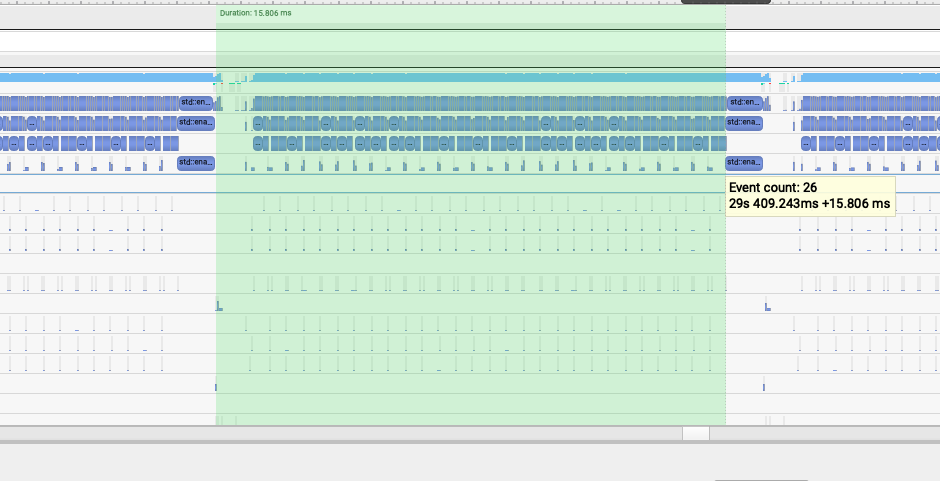
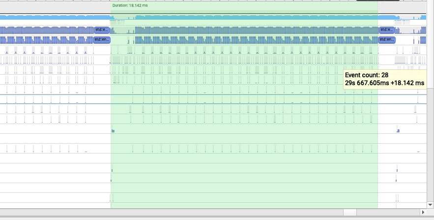
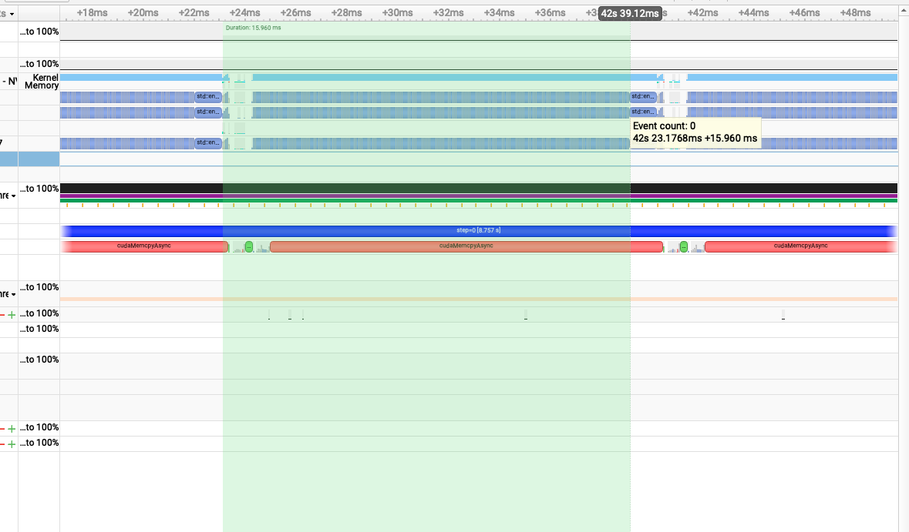
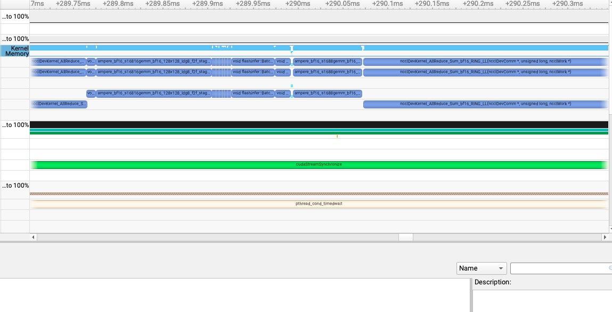
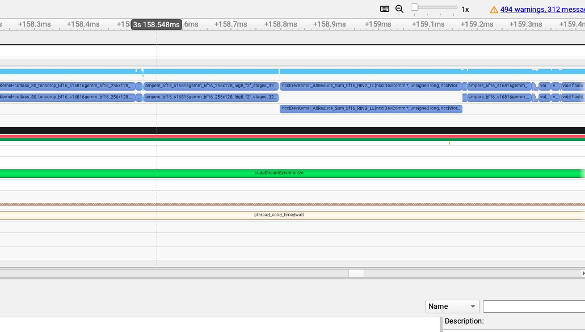
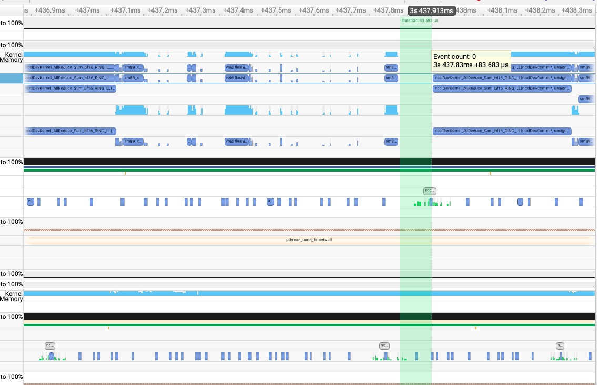
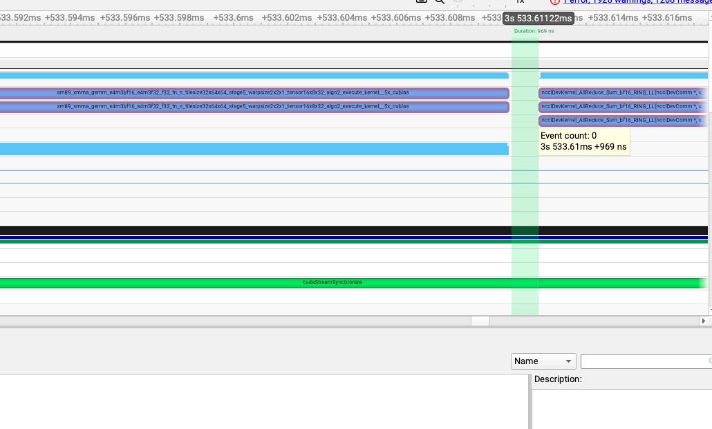

## 0x0. 서문

오늘은 최근의 흥미로운 발견, 즉 모델 추론 시 GTX 4090에서 cuda graph를 켜야 하는지에 대해 이야기해 보려 한다. GTX 4090에서 VLLM/SGLang 같은 추론 프레임워크를 사용할 때 어떤 상황에서 CUDA Graph를 켜야 할까? 현재로서는 내 관찰 과정과 결론만 말할 수 있고, 그 배후의 가능한 원인은 아직 분명히 파악하지 못했다. 고수분들이 알고 있다면 아낌없이 가르쳐 주기 바란다.

# 0x1. 문제가 발생한 배경

어느 날 GTX 4090 단일 카드 환경에서 VLLM과 Qwen2-7B를 사용해 prompt 하나를 offline 추론할 때, HuggingFace 원본 추론과 비교해 성능 향상이 얼마나 되는지 보고 싶었다.

여기서는 주로 decoding 과정에서 iter 하나의 속도에 집중한다. prefill은 한 번뿐이고, VLLM/SGLang 모두 cuda-graph로 prefill 과정을 가속하지 않으며, decoding은 빈번한 cuda kernel launch를 유발하기 때문이다.

그다음 아래 두 스크립트를 작성했다. 각각 VLLM과 HuggingFace Qwen2-7B의 추론 성능을 테스트하는 데 사용했고, nsight system으로 profile했다. 스크립트 맨 앞은 profile 명령이다.

## vllm 추론 스크립트

```python
# /opt/nvidia/nsight-systems/2024.5.1/bin/nsys profile --trace-fork-before-exec=true --cuda-graph-trace=node -o vllm_qwen2.5_7b_eager python3 debug.py
import os
os.environ["CUDA_VISIBLE_DEVICES"] = "0"

import nvtx
import torch
from vllm import LLM, SamplingParams

# Sample prompts.
prompts = "베이징 여행을 한 번 계획해 주세요. 내년 봄에 출발하고, 대략 5일 일정이면 좋겠습니다."
# Create a sampling params object.
sampling_params = SamplingParams(temperature=0.8, top_p=0.95, max_tokens=512)

# Create an LLM.
llm = LLM(model="/mnt/bbuf/Qwen2.5-7B-Instruct/", enforce_eager=True)
# Generate texts from the prompts. The output is a list of RequestOutput objects
# that contain the prompt, generated text, and other information.
# warmup
for _ in range(2):
    outputs = llm.generate(prompts, sampling_params)

torch.cuda.synchronize()

# profile
for i in range(20):
    with nvtx.annotate(f"step={i}", color="blue"):
        outputs = llm.generate(prompts, sampling_params)

# Print the outputs.
for output in outputs:
    prompt = output.prompt
    generated_text = output.outputs[0].text
    print(f"Prompt: {prompt!r}, Generated text: {generated_text!r}")
```

**주의하라. 이 스크립트에서는 CUDA Graph를 끄기 위해 임시로 `enforce_eager=True`를 켰다.**

## HuggingFace 추론 스크립트

```python
# /opt/nvidia/nsight-systems/2024.5.1/bin/nsys profile --trace-fork-before-exec=true --cuda-graph-trace=node -o hf_qwen2.5_7b_flash_attn python3 debug.py
import os
os.environ["CUDA_VISIBLE_DEVICES"] = "0"

import nvtx
import torch

from transformers import AutoModelForCausalLM, AutoTokenizer

model_name = "/mnt/bbuf/Qwen2.5-7B-Instruct"

model = AutoModelForCausalLM.from_pretrained(
    model_name,
    torch_dtype="auto",
    device_map="auto"
)
tokenizer = AutoTokenizer.from_pretrained(model_name)

prompt = "베이징 여행을 한 번 계획해 주세요. 내년 봄에 출발하고, 대략 5일 일정이면 좋겠습니다."

model_inputs = tokenizer(prompt, return_tensors="pt").to(model.device)

# warmup
for _ in range(2):
    generated_ids = model.generate(
        **model_inputs,
        max_new_tokens=512
    )

torch.cuda.synchronize()
# profile

for i in range(20):
    with nvtx.annotate(f"step={i}", color="blue"):
        
        generated_ids = model.generate(
            **model_inputs,
            max_new_tokens=512
        )

generated_ids = [
    output_ids[len(input_ids):] for input_ids, output_ids in zip(model_inputs.input_ids, generated_ids)
]

response = tokenizer.batch_decode(generated_ids, skip_special_tokens=True)[0]
print(response)
```

## nsys 결과 분석

- vllm



- hf



둘 다 Eager 추론을 사용할 때, VLLM의 decoding iter 하나는 15.8ms이고 HF의 decoding iter 하나는 18.1ms임을 발견했다. decoding 단계의 kernel launch 속도를 보면 모두 매우 빨라 ns 수준이다. 이런 경우 CUDA Graph는 역할을 발휘하기 어려울 것이다. 15.8ms와 18.1ms의 차이는 fused rope, fused rmsnorm, packed qkv linear에서 비롯된다. 이 몇 가지 component를 동일하게 조정하면 HF도 VLLM과 같은 단일 카드 추론 성능을 낼 수 있다.

검증을 위해 위 VLLM 스크립트의 `enforce_eager=True`를 제거하고 CUDA Graph를 켠 뒤 다시 실행했다. nsys 결과는 다음과 같다.



decoding iter 하나의 시간은 Eager 모드와 동일하다.

이제 이 글의 질문이 나온다. GTX 4090에서는 언제 CUDA Graph를 켜야 할까?

비교하자면, A800에서 위 스크립트를 실행하면 cuda graph를 켜지 않았을 때 decoding iter 하나가 37ms가 필요하지만, 켜면 13ms만 필요하다. 차이가 매우 뚜렷하다.

# 0x2. SGLang 추론 시 CUDA Graph 활성화 관찰

GTX 4090에서 모델을 추론할 때 어떤 상황에서 CUDA Graph를 켜야 하는지 탐색하기 위해, SGLang 기반으로 일련의 실험을 수행했다.

SGlang v0.3.6을 기반으로 sharegpt 데이터를 사용해 다음 모델들을 테스트했다.

|Model|Parallel Config|cuda graph enabled|qps|throughput|ttft|
|--|--|--|--|--|--|
|qwen2-7b|tp1|yes|11|5029|0.776|
|qwen2-7b|tp1|no|11|5006|0.421|
|qwen2-7b|tp1|yes|12|5059|1.105|
|qwen2-7b|tp1|no|12|5094|0.626|
|llama3-8b|tp2|yes|3.5|7174|0.748|
|llama3-8b|tp2|no|3.5|7172|0.805|
|qwen2-57b|tp4dp2|yes|14|5785|0.181|
|qwen2-57b|tp4dp2|no|14|5477|0.193|
|qwen2-72b|tp4pp2|yes|1.9|3927|0.891|
|qwen2-72b|tp4pp2|no|1.9|3769|1.208|

위 통계 데이터를 기반으로 보면, GTX 4090에서 TP1/TP2로 Serving 모델을 사용할 때 CUDA Graph는 성능에 전혀 영향을 주지 않는다. TP4 또는 TP8을 사용할 때는 높은 성능을 유지하기 위해 cuda graph를 활성화해야 한다.

## nsys 분석

### LLama3-8b tp2

- cuda graph 끄기



- cuda graph 켜기




TP2의 llama3-8b 추론 서비스에서는 cuda graph 활성화 여부와 관계없이 kernel launch 시간이 ns 수준을 유지하는 것을 볼 수 있다. 이는 cuda graph가 실질적인 역할을 하지 않는다는 뜻이다.

### Qwen2-72b tp4dp2

- cuda graph 없음



- cuda graph 있음



TP4의 qwen2-72b 추론 서비스에서는 cuda graph를 활성화한 뒤 kernel launch 시간이 대체로 나노초 수준인 것을 볼 수 있다. 하지만 cuda graph를 활성화하지 않은 경우 kernel launch 시간이 수십 us까지 증가했다.

# 0x3. 관찰을 통해 얻은 결론

현재 결론은 GTX 4090이 매우 신기한 카드라는 것이다. 대부분의 경우 CUDA Garph를 켜야 하는지 살펴봐야 한다. 현재 qwen2-7b, qwen2-57b, qwen2-72b, llama3-8b에 대해 탐색한 바에 따르면 TP4/TP8 같은 구성으로 serving 모델을 하는 것이 아니라면, 높은 확률로 CUDA Graph를 켤 필요가 없다. SGLang에서는 이 CUDA Graph에 쓰일 메모리를 아껴 KV Cache Pool에 줄 수 있다.

# 0x4. 배후의 원인?

현재 원인이 무엇인지는 잘 모르겠다. 하위 수준의 lauch kernel 구현과 관련이 있을 것으로 보는 쪽에 기울어 있다. 그래서 이 글을 던지는 목적도 답을 찾기 위해서이다.

CPU 코어 문제도 의심해 보았고 CPU 코어 수를 조정해 보았지만, 결론은 여전히 위에서 말한 것과 같았다.
