> 내 강의 노트이며, https://github.com/BBuf/how-to-optim-algorithm-in-cuda/tree/master/cuda-mode 에 관심을 가져주기 바란다.

# 20강, prefix sum(Scan) 알고리즘(상)

## 강의 노트

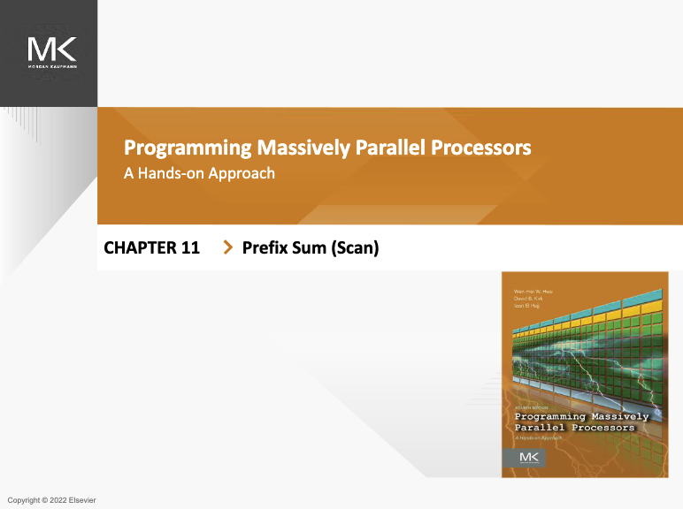

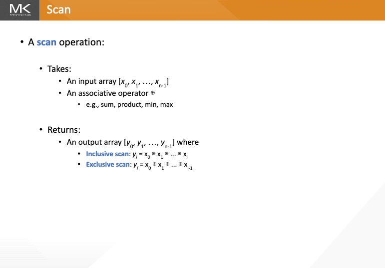

이 Slides는 scan 연산의 기본 개념을 소개한다. scan 연산에는 두 입력이 필요하다. 하나는 입력 배열 `[x₀, x₁, ..., xₙ₋₁]`이고, 다른 하나는 associative operator(예: sum, product, min, max 등)다. 이 연산은 출력 배열 `[y₀, y₁, ..., yₙ₋₁]`을 반환한다. 여기에는 두 가지 scan 방식이 있다. inclusive scan에서는 `yᵢ = x₀ ⊕ x₁ ⊕ ... ⊕ xᵢ`이고, exclusive scan에서는 `yᵢ = x₀ ⊕ x₁ ⊕ ... ⊕ xᵢ₋₁`이다. 여기서 `⊕`는 선택한 associative operator를 나타낸다.

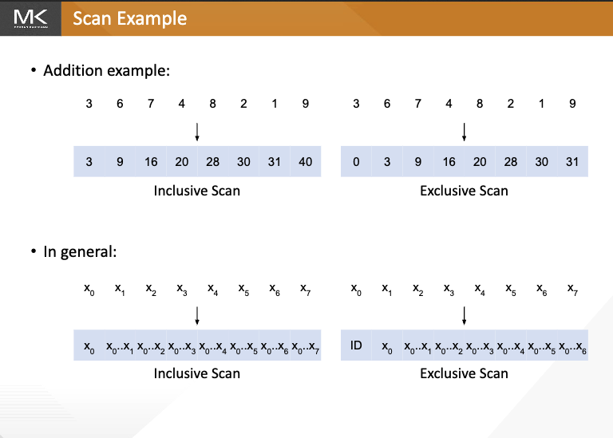

이 Slides는 prefix sum scan의 두 가지 연산 유형인 inclusive scan과 exclusive scan을 소개한다. 구체적인 덧셈 예제와 일반 형식의 수학 표현을 통해 두 scan의 차이를 설명한다.

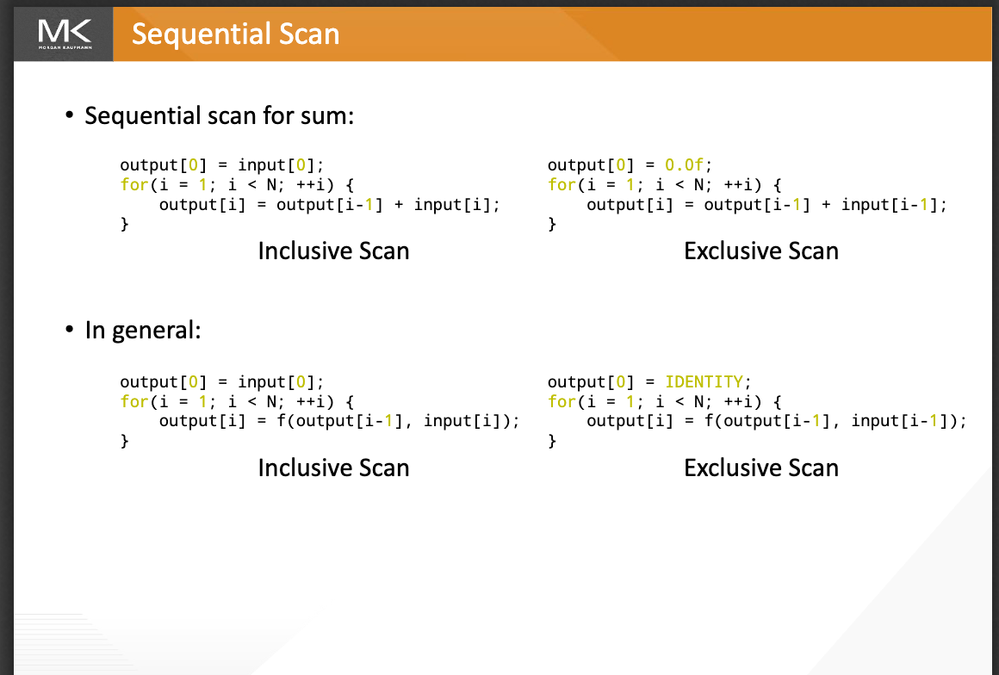

이 Slides는 inclusive scan과 exclusive scan의 sequential implementation 코드를 보여준다. 먼저 덧셈 연산의 구체적인 예제로 두 scan 구현 차이를 보여준 뒤, 일반 형식의 코드 구현을 제시한다. inclusive scan은 현재 element를 계산에 포함하고, exclusive scan은 초기값(덧셈에서는 0, 일반적인 경우 IDENTITY)을 사용하며 현재 element 이전의 결과만 계산한다.

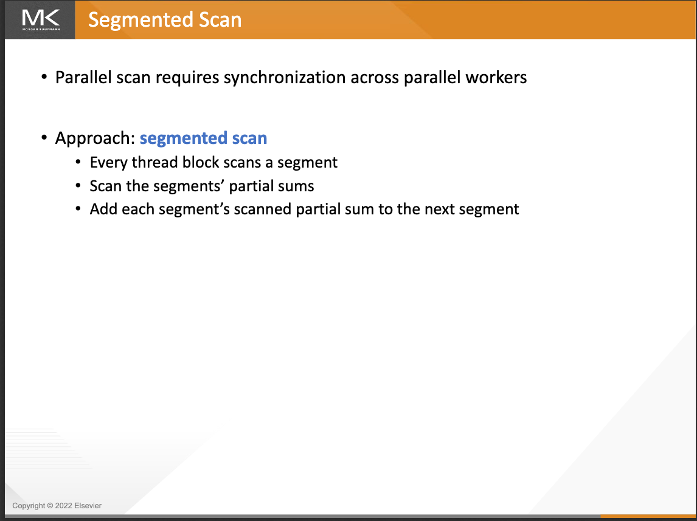

이 Slides는 parallel scan의 segmented scan 전략을 소개한다. parallel scan은 병렬 worker thread 사이에서 synchronization이 필요하므로 segmented scan 방법을 사용한다. 즉 각 thread block이 하나의 data segment를 처리하게 하고, 먼저 각 segment의 partial sum을 계산한 다음 이 partial sum에 대해 scan을 수행하며, 마지막으로 각 segment의 scan 결과를 다음 segment에 누적해 효율적인 parallel processing을 구현한다.

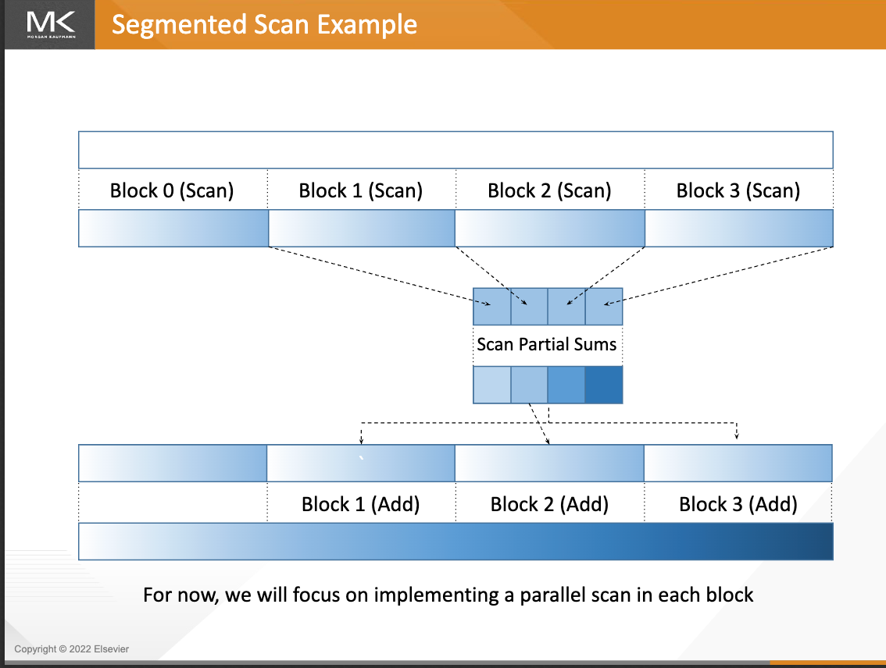

이 Slides는 segmented scan의 구체적인 실행 과정을 그림으로 보여준다. 먼저 데이터를 네 개 block(Block 0-3)으로 나누고, 각 block이 병렬로 scan 연산을 수행한다. 그런 다음 각 block의 partial sum을 수집해 이 partial sum에 대해 scan을 수행하고, 마지막으로 scan된 결과를 대응하는 block에 더해(Block 0 제외) 전체 parallel scan 연산을 완료한다. 마지막에는 현재 초점을 각 block 내부에서 parallel scan을 구현하는 방법에 둘 것이라고 언급한다.

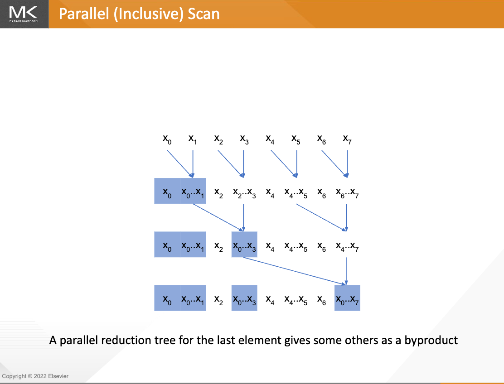

이 Slides는 parallel inclusive scan의 구현 과정을 보여준다. parallel reduction tree 구조를 통해 마지막 element의 결과를 어떻게 계산하는지 설명한다. 계산 과정에서 각 layer는 일부 intermediate result를 부산물로 생성하며, 이 부산물이 실제로는 다른 위치의 scan 결과다. 전체 과정은 tree structure를 사용해 bottom-up으로 병렬 계산하므로 계산 효율을 높인다.

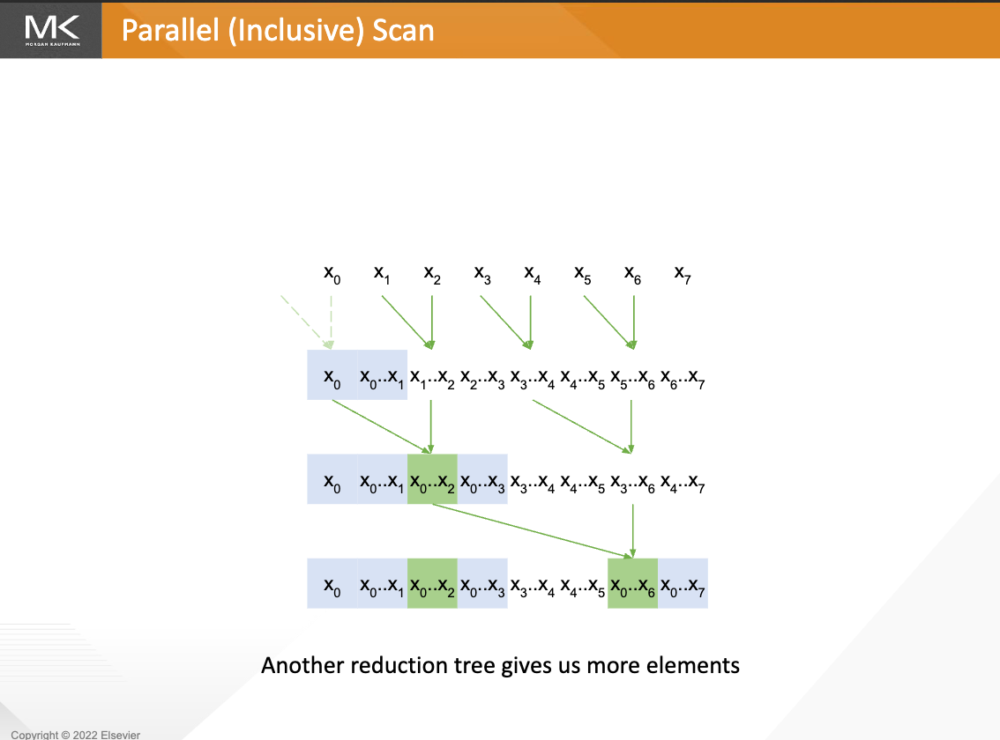

이 Slides는 또 다른 parallel reduction tree 구조를 보여준다. 계산 순서와 조합 방식을 조정하면 계산 과정에서 더 많은 intermediate result를 얻을 수 있고(그림에서는 초록색으로 highlight), 이 intermediate result가 바로 parallel inclusive scan에 필요한 다른 위치의 누적값이므로 전체 scan 연산을 더 효율적으로 완료하고 더 많은 유용한 계산 결과를 얻을 수 있다.

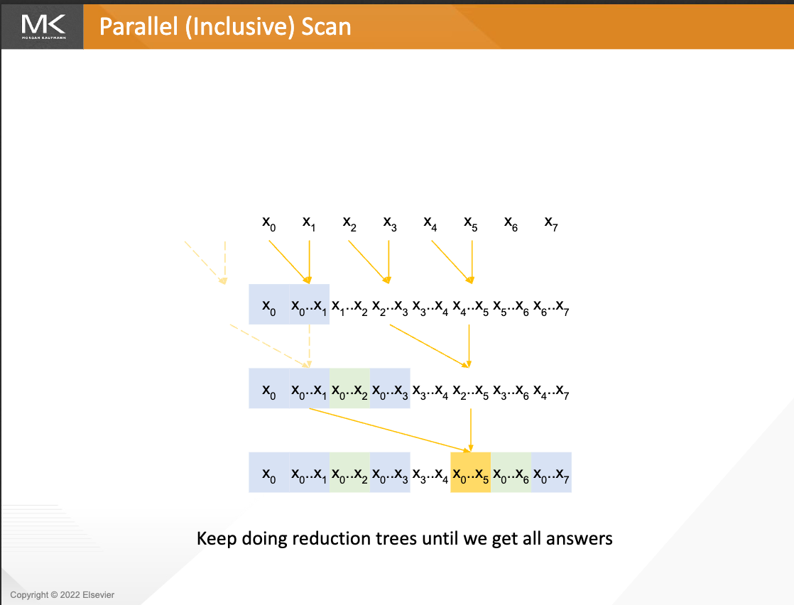

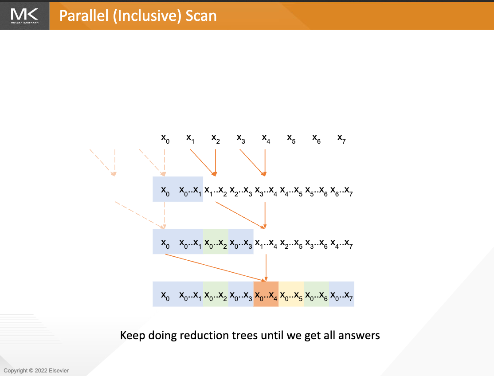

이 두 Slides는 parallel inclusive scan의 지속적인 계산 과정을 보여준다. 새로운 reduction tree(노란색 화살표로 표시)를 계속 구축해 모든 위치의 scan 결과를 점진적으로 계산할 수 있다. 그림에서 노란색으로 highlight된 부분은 이번 reduction tree 계산으로 얻은 새 결과를 나타낸다. 최종적으로 여러 차례의 reduction tree 계산을 통해 모든 위치의 값이 올바르게 계산될 때까지 완전한 scan sequence를 얻을 수 있다.

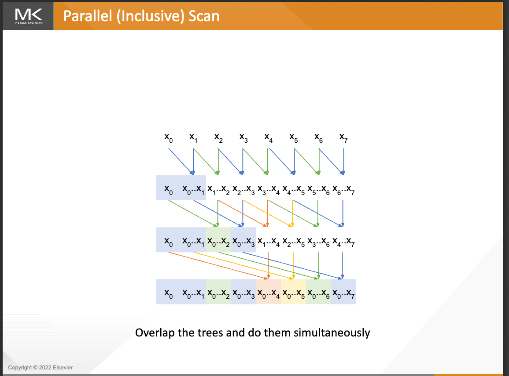

이 Slides는 최적화된 parallel inclusive scan 방법을 보여준다. 여러 reduction tree를 함께 겹치고 동시에 실행하면(서로 다른 색의 화살표가 서로 다른 reduction tree를 나타냄), 같은 시간에 여러 위치의 결과를 병렬 계산할 수 있다. 따라서 계산 효율이 향상되고 필요한 계산 step이 줄어 전체 scan 연산을 더 빠르게 완료할 수 있다.

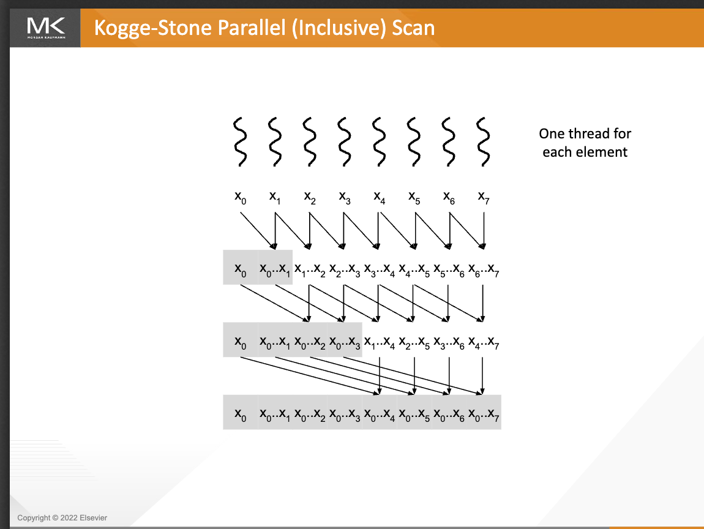

이 Slides는 Kogge-Stone parallel inclusive scan 알고리즘의 구현 방식을 소개한다. 각 입력 element에 독립적인 thread(물결선으로 표시)를 할당하고, 세 단계의 병렬 계산으로 scan 연산을 완료한다. 각 단계는 더 큰 범위의 partial sum을 계산하고, 최종적으로 완전한 scan 결과를 얻는다. 이 알고리즘 구조는 계산을 매우 높은 수준으로 병렬화할 수 있게 하며, 효율적인 parallel scan 구현 방법이다.

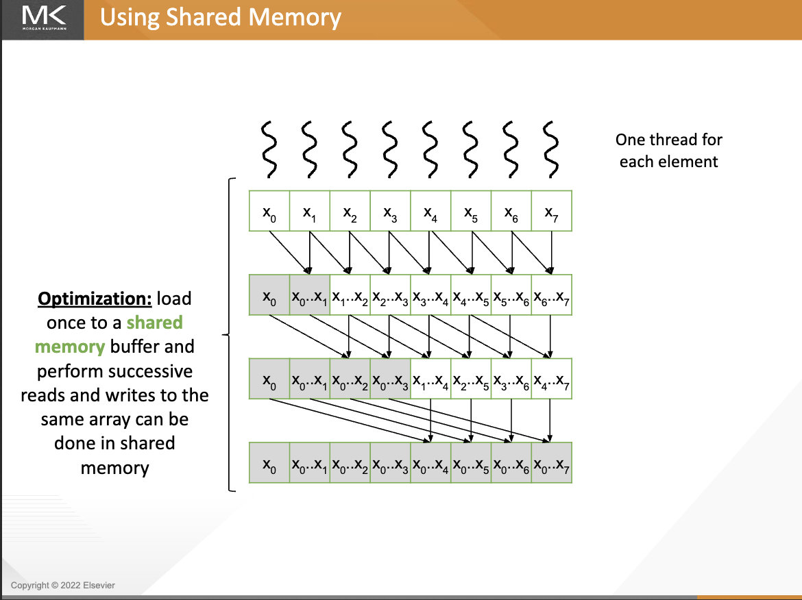

