> 내 강의 노트다. 관심이 있다면 팔로우를 환영한다: https://github.com/BBuf/how-to-optim-algorithm-in-cuda/tree/master/cuda-mode .

> 이번 강의는 LinkedIn이 개발한 Liger Kernel의 핵심 최적화 두 가지, RMSNorm과 Fused Linear Cross Entropy를 소개한다. 이 노트는 강의에 나온 최적화의 수학적 원리, 구현 방법, 테스트 검증 과정을 자세히 기록했으며, 일부 script 해설도 포함한다. RMSNorm 부분은 backward propagation의 유도 과정과 memory 최적화 기법을 보여준다. Fused Linear Cross Entropy 부분은 checkpointing, chunking, gradient-in-forward 같은 기술로 memory 사용량을 줄이는 방법을 보여준다. 또한 강의는 Triton framework 위에서 최적화 kernel을 개발할 때의 몇 가지 실전 경험, 예를 들어 Contiguity 문제와 index out-of-bounds 문제 처리도 공유한다. 이러한 최적화를 통해 Liger Kernel은 multi-GPU training throughput을 20% 높이고 memory 사용량을 60% 줄일 수 있으며, Triton이 산업계에서 잘 적용된 사례다.

# 28강, Liger Kernel

Liger Kernel(https://github.com/linkedin/Liger-Kernel)은 LLM training을 위해 설계된 Triton kernels 모음으로, LinkedIn 엔지니어들이 개발하고 유지한다. multi-GPU training throughput을 효과적으로 20% 높이고 memory 사용량을 60% 줄일 수 있다. 현재 HuggingFace와 호환되는 `RMSNorm`, `RoPE`, `SwiGLU`, `CrossEntropy`, `FusedLinearCrossEntropy` 등의 기능이 구현되어 있으며 앞으로 더 늘어날 예정이다. Liger Kernel은 Flash Attention, PyTorch FSDP, Microsoft DeepSpeed와 바로 함께 사용할 수 있다. 우리는 community contribution을 환영하며, 함께 최고의 LLM training kernel을 모으고자 한다.

## 강의 노트: RMSNorm

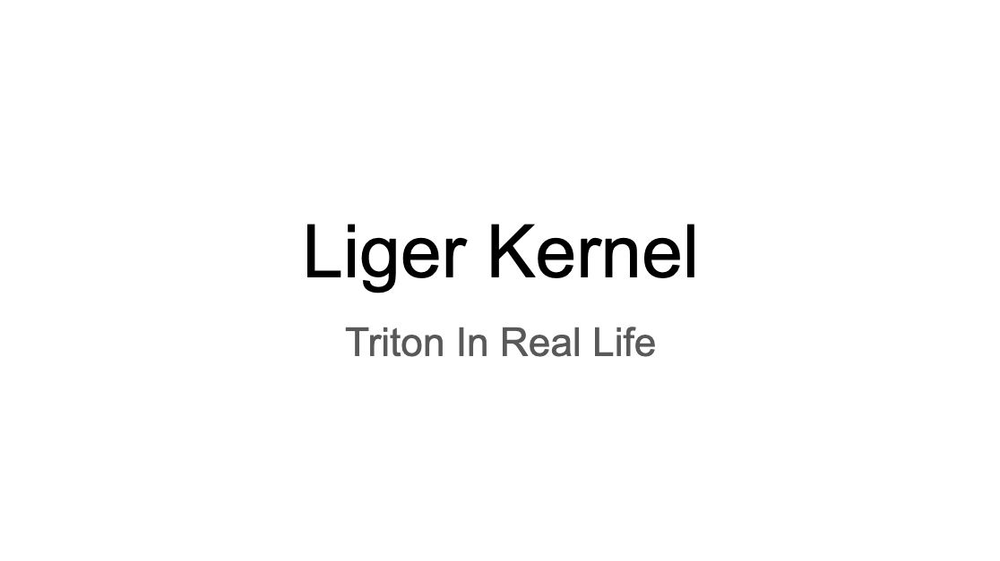

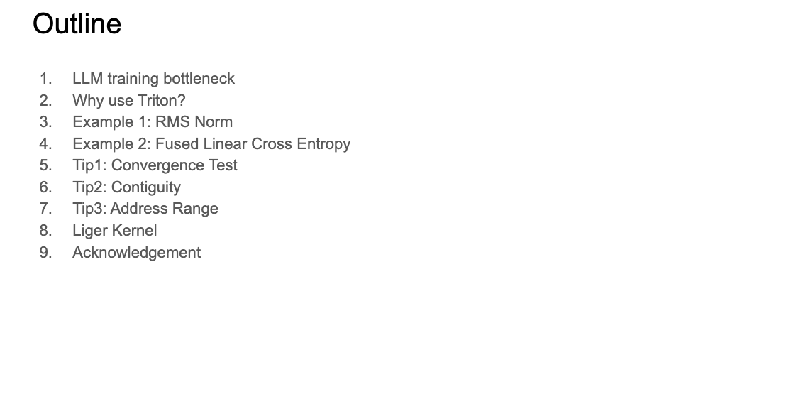

이 Slides는 이번 강의의 개요를 소개한다. 구체적으로는 LLM(대형 언어 모델) training의 성능 병목, 왜 Triton framework를 선택하는지, RMS Norm과 Fused Linear Cross Entropy를 어떻게 구현하는지를 다룬다. 이것은 많은 memory를 줄일 수 있으며, 줄어든 memory를 어떻게 테스트하는지도 언급한다. 동시에 중요한 최적화 기법 세 가지, convergence test, contiguity optimization, address range handling을 제공한다. 마지막에는 Liger kernel 홍보도 한다.

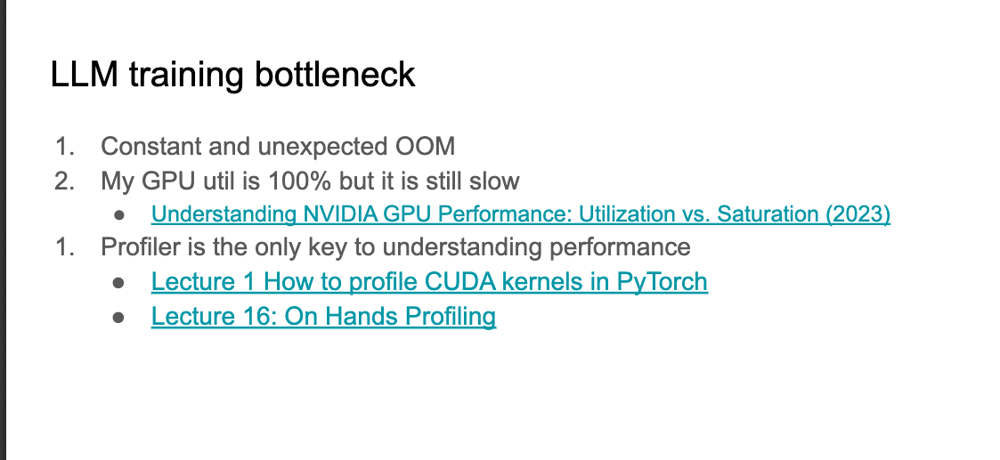

여기서는 대형 모델의 병목이 GPU memory로 인한 OOM뿐 아니라 효율 문제도 포함한다고 말한다. 한 가지 오해는 GPU utilization이 높을수록 속도가 빠르다는 것인데, 실제로는 잘못된 이해다. GPU utilization이 높다는 것은 GPU가 바쁘다는 뜻일 뿐이다. 이 문제를 이해하려면 https://arthurchiao.art/blog/understanding-gpu-performance/ 글을 읽는 것을 추천한다. 또한 Profiler는 모든 성능 문제를 이해하는 기반이다. Profiler 사용법은 cuda-mode lecture1과 lecture16을 참고하면 좋다.

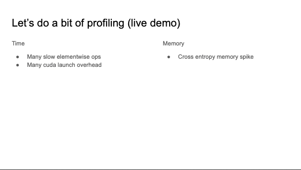

그 다음 저자는 LLama 모델 하나를 online Profile했다. memory 변화 단계에서 Cross entropy에 peak spike가 있으며, 많은 memory를 소비하는 것을 볼 수 있다. 아래 그림과 같다.

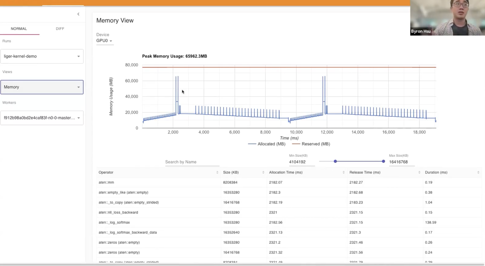

Checkpointing 기술을 사용했기 때문에 forward와 backward 단계의 각 Transformer Block에서도 memory가 오르내리는 것을 관찰할 수 있다. 다음 Transformer Block을 계산할 때 현재 Transformer Block이 차지한 memory를 해제하기 때문이다. 여기서 핵심은 Cross Entropy의 memory 소비다. 그 원인은 logits를 materialize하는 과정에서 생기는 peak memory이며, vocab size가 매우 크기 때문이다.

이어서 저자는 kernel trace 부분을 소개한다. 이 부분에서 LLama 모델에는 많은 elementwise ops와 많은 cuda kernel launch overhead가 있다는 것을 볼 수 있다. 저자는 이 kernel trace가 FSDP로 LLamaT를 training한 것이기 때문에 각 Transformer Block에서 all gather 2회와 reduce scatter 1회를 볼 수 있다고도 언급한다. FSDP의 구체적인 원리 그림은 https://zhuanlan.zhihu.com/p/485208899 를 참고할 수 있고, [번역: PyTorch FSDP로 training throughput 최대화하기](https://mp.weixin.qq.com/s/6wNX38rKcFjxLb4ooYQokw) 도 참고할 수 있다.

간단히 정리하면, FSDP로 LLamaT를 training할 때 두 가지 뚜렷한 병목을 관찰할 수 있다. 첫 번째는 Cross Entropy의 대량 memory 소비이고, 두 번째는 elementwise ops와 많은 cuda kernel launch overhead다.

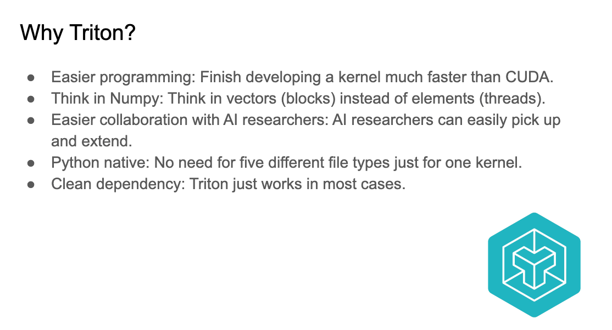

이 Slides는 Triton(GPU programming framework)을 선택하는 주요 이유 몇 가지를 소개한다. CUDA보다 programming이 쉽고 kernel 개발 속도가 빠르다. 전통적인 thread 사고방식 대신 Numpy와 비슷한 vectorized 사고방식을 사용한다. AI researcher에게 더 친화적이어서 이해와 확장이 쉽다. Python native framework라 여러 file type을 다룰 필요가 없다. 또한 dependency가 단순해서 대부분의 경우 정상 동작한다. 전반적으로 이런 장점은 Triton을 더 현대적이고 쓰기 쉬운 GPU programming solution으로 만든다.

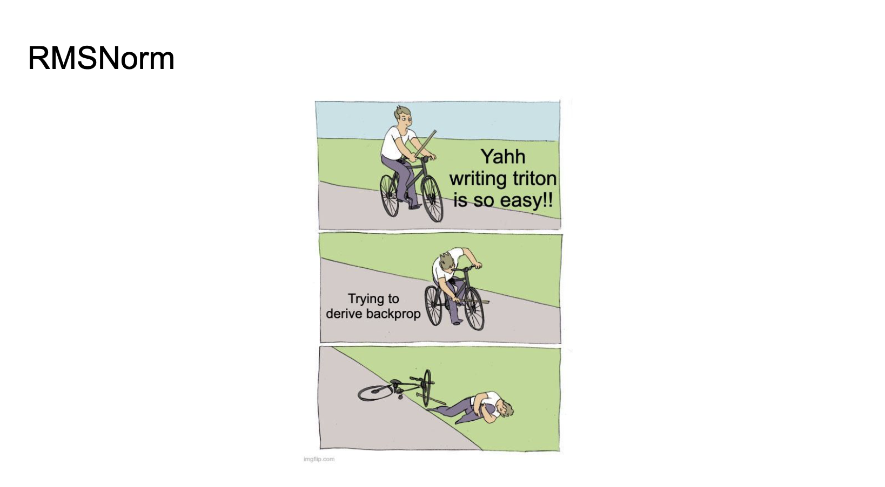

이 Slides는 Triton으로 RMS Forward를 작성하는 것은 매우 간단하지만 Backward를 작성하는 것은 더 어렵다고 설명한다. 아래에서는 저자가 정리한 몇 가지 기법을 보여준다.

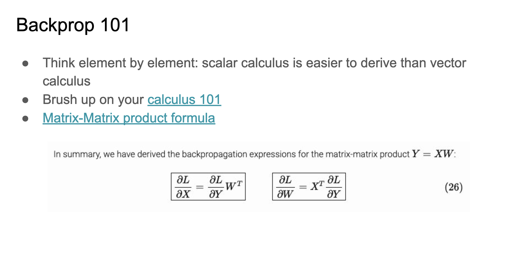

이 slides는 Backward Pass(Backprop)의 기초를 소개한다. 제목은 "Backprop 101"이며, Backward Pass를 배울 때 **원소 단위로 생각하라**고 강조한다. scalar calculus가 vector calculus보다 유도하기 쉽기 때문이다. 동시에 calculus 기본과 matrix-matrix multiplication 공식을 복습하라고 권한다. slides 마지막에는 matrix multiplication Y = XW의 Backward Pass 유도 결과가 제시된다. X에 대한 gradient `∂L/∂X = (∂L/∂Y)W^T`와 W에 대한 gradient `∂L/∂W = X^T(∂L/∂Y)`가 포함된다. 이러한 기본 지식은 RMS Norm 같은 더 복잡한 연산의 Backward Pass를 이해하고 구현하는 데 매우 중요하다.

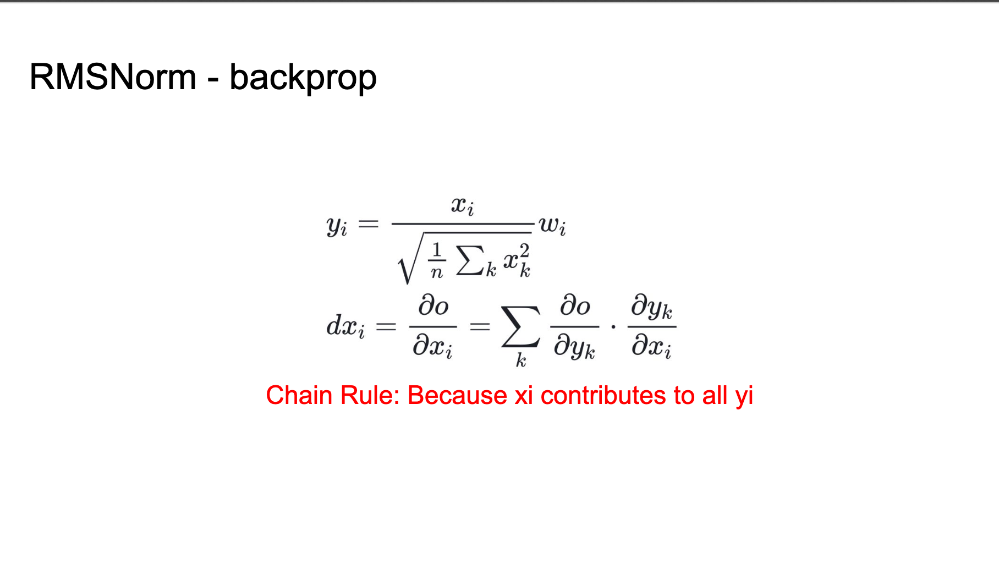

이 Slides는 RMSNorm(Root Mean Square Normalization) 연산의 Backward Pass(backprop) 유도 과정을 보여준다. 주로 두 핵심 공식이 포함된다.

1. Forward Pass 공식: yi = (xi * wi) / sqrt((1/n) * ∑xk²), 입력 xi를 normalize한다는 뜻이다
2. Backward Pass 공식: dxi = ∂o/∂xi = ∑k (∂o/∂yk * ∂yk/∂xi), chain rule로 gradient를 계산한다

여기서는 chain rule을 적용해야 하는 이유를 특히 강조한다. 입력 xi가 모든 출력 yi에 영향을 주기 때문에, gradient를 계산할 때 xi가 모든 yi에 미치는 영향을 고려하고 합산해야 한다. 이것이 RMSNorm Backward Pass 계산의 핵심 아이디어다.

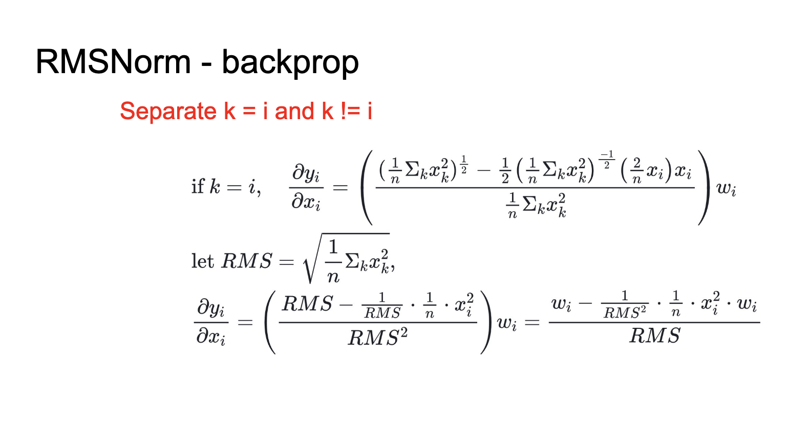

이 Slides는 RMSNorm Backward Pass의 자세한 수학적 유도를 보여주며, 특히 k=i와 k≠i 두 경우를 분리해서 처리해야 한다는 점을 강조한다. 여기서 RMS(Root Mean Square) 변수를 도입해 식을 단순화하고, 최종적으로 k=i일 때의 partial derivative 공식을 얻는다. 수학적 변환을 통해 복잡한 식을 더 간결한 형태, 즉 `(wi - 1/(RMS^2) * 1/n * xi^2 * wi)/RMS`로 단순화한다. 이 유도 과정은 RMSNorm Backward Pass 계산 구현에 매우 중요하며, 이후 code 구현을 위한 이론적 기반을 제공한다.

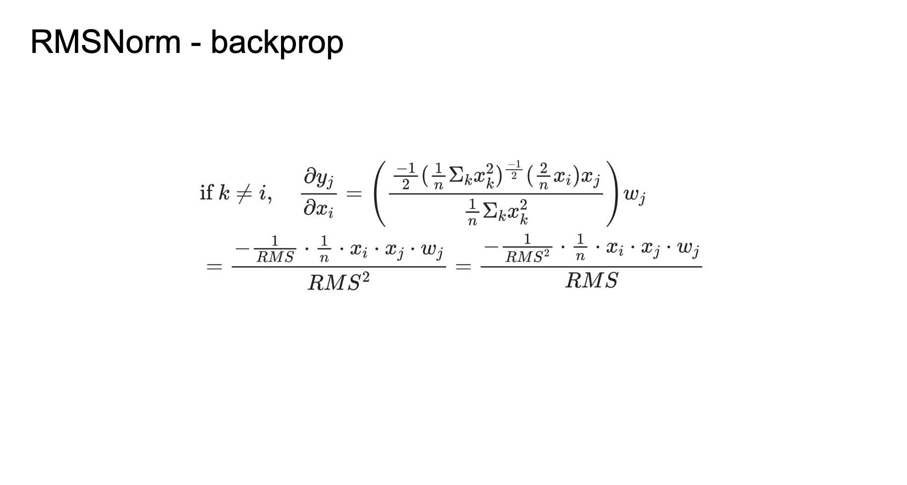

이 Slides는 k≠i일 때 RMS Backward Pass의 수학적 유도를 더 보여준다.

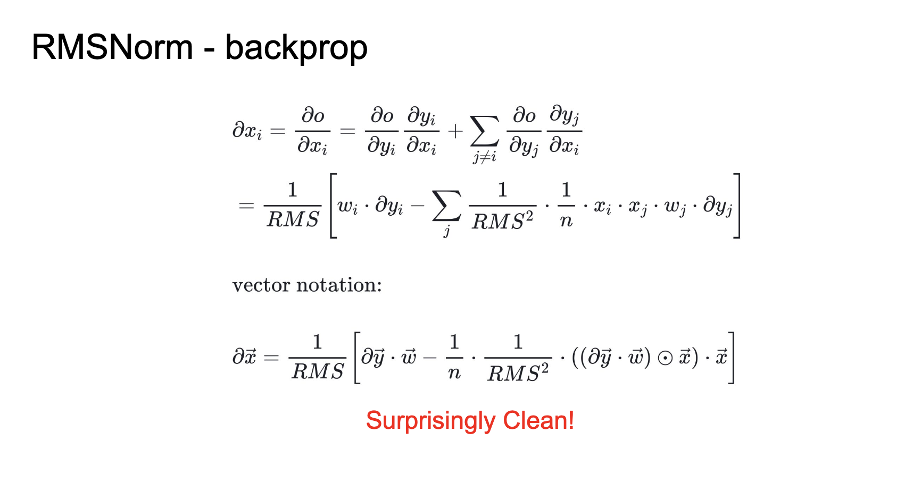

이 Slides는 k=i와 k≠i 두 경우를 합쳐 RMS Backward Pass의 완전한 수학적 유도를 얻는다. 또한 단일 원소 유도에서 vector로 확장할 수 있고, 이렇게 하면 Triton에서 편리하게 구현할 수 있다.

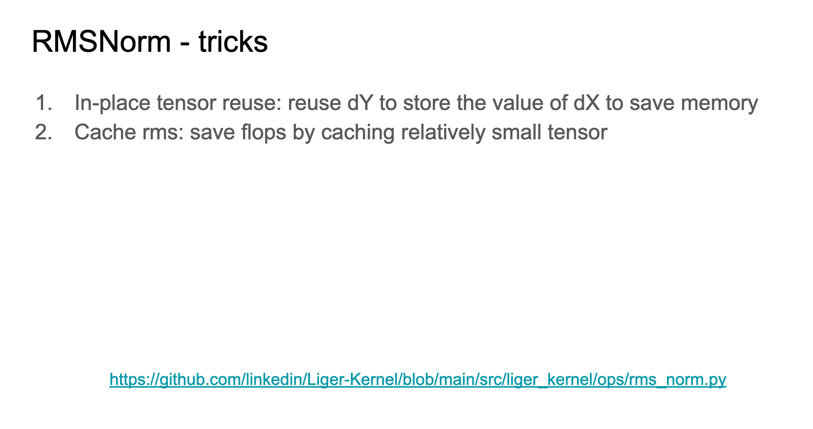

이 Slides는 Liger-Kernel이 RMSNorm을 구현할 때 사용하는 두 가지 기법, Inplace Tensor reuse와 Cache rms를 보여준다. https://github.com/linkedin/Liger-Kernel/blob/main/src/liger_kernel/ops/rms_norm.py 소스에서 확인할 수 있다.

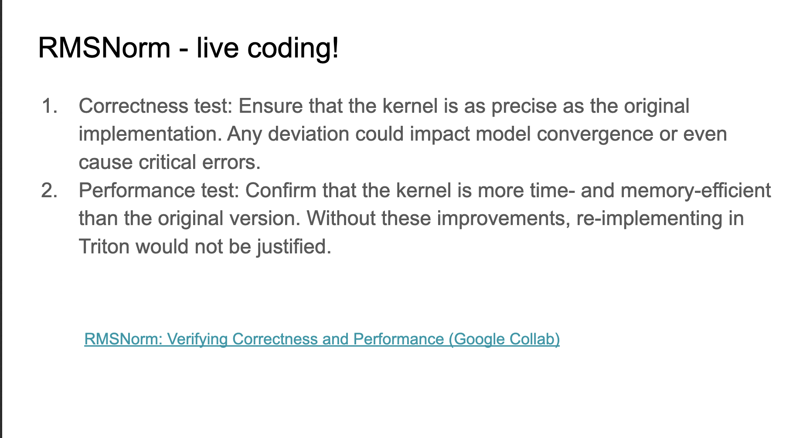

저자는 Liger-Kernel 테스트 과정을 보여주는 jupyter demo를 제공했다. 여기에는 correctness, performance, memory 등 여러 측면의 테스트가 포함된다. https://colab.research.google.com/drive/1CQYhul7MVG5F0gmqTBbx1O1HgolPgF0M?usp=sharing , 이제 이 테스트를 해설해 보자.


## Live Demo: RMSNorm: 정확성과 성능을 확인하는 테스트 해설

이제 RMSNorm의 Backward Pass 유도 방법과 memory saving 기법을 배웠다. 구현 자체는 상대적으로 직접적이다. 따라서 우리는 테스트에 집중하고, Liger Kernel의 기존 구현을 사용한다.

### 왜 테스트가 필요한가?

동작하는 RMSNorm 버전이 이미 있다고 가정하자. 이를 production 환경에 배포하기 전에 다음을 검증해야 한다.

1. 정확성: kernel의 precision이 원래 구현과 일치하는지 보장한다. 어떤 편차든 모델 convergence에 영향을 주거나 심각한 오류를 일으킬 수 있다.
2. 성능: kernel이 시간과 memory 사용 측면에서 모두 원래 버전보다 효율적인지 확인한다. 이런 개선이 없다면 Triton으로 다시 구현할 의미가 없다.

### 정확성 테스트

HuggingFace가 제공하는 버전 같은 순수 PyTorch 구현을 준비한다.

서로 다른 입력 shape과 dtype으로 구현을 테스트해야 한다. 2의 거듭제곱 같은 규칙적인 shape뿐 아니라 irregular shape을 테스트하는 것도 중요하다. boundary case를 올바르게 처리하는지 확인하기 위해서다.

tolerance 설정은 까다로울 수 있다. 보통 `fp32`에는 `atol = 1e-7`과 `rtol = 1e-5`를 사용한다. `bf16`에는 `atol = 1e-3`과 `rtol = 1e-2`를 사용한다. 하지만 실제로는 kernel이 정확하더라도 때로 tolerance를 더 완화해야 할 수 있다.

잠시 후, kernel이 end-to-end convergence에 부정적인 영향을 주지 않는지 검증하는 다른 테스트 방법을 논의한다.

```python
import torch
import torch.nn as nn


# Copy from HuggingFace

class LlamaRMSNorm(nn.Module):
    def __init__(self, hidden_size, eps=1e-6):
        """
        LlamaRMSNorm은 T5LayerNorm과 동등한 구현이다
        인자:
            hidden_size: hidden layer dimension 크기
            eps: numerical stability를 위한 작은 상수
        """
        super().__init__()
        # 학습 가능한 scaling parameter를 초기화한다
        self.weight = nn.Parameter(torch.ones(hidden_size))
        # divide-by-zero를 피하기 위해 epsilon 값을 저장한다
        self.variance_epsilon = eps

    def forward(self, hidden_states):
        # 입력 dtype을 저장한다
        input_dtype = hidden_states.dtype
        # precision을 높이기 위해 float32로 변환한다
        hidden_states = hidden_states.to(torch.float32)
        # variance를 계산한다
        variance = hidden_states.pow(2).mean(-1, keepdim=True)
        # normalization 연산
        hidden_states = hidden_states * torch.rsqrt(variance + self.variance_epsilon)
        # 학습 가능한 parameter를 적용하고 원래 dtype으로 복원한다
        return self.weight * hidden_states.to(input_dtype)
```

```python
import torch
from liger_kernel.transformers.rms_norm import LigerRMSNorm


input_data = [
    (4, 16, 32, torch.float32, 1e-6, 1e-4),
    (8, 32, 64, torch.float32, 1e-6, 1e-4),
    (16, 64, 128, torch.float32, 1e-6, 1e-4),
    (3, 9, 13, torch.float32, 1e-6, 1e-4),
    # T4 GPU doesn't support bf16 :(
    # (16, 64, 128, torch.bfloat32, 1e-3, 1e-2),
]

for bs, sl, hd, dtype, atol, rtol in input_data:
    # h
    _tensor = torch.randn(bs, sl, hd, device="cuda", dtype=dtype)

    h1 = _tensor.clone().requires_grad_(True)
    h2 = _tensor.clone().requires_grad_(True)

    # do
    do = torch.randn(bs, sl, hd, device="cuda", dtype=dtype)

    # llama
    llama_rms = LlamaRMSNorm(hidden_size=hd).to("cuda").to(dtype)
    llama_o = llama_rms(h1)
    llama_o.backward(do.clone(), retain_graph=True)

    # triton
    triton_rms = LigerRMSNorm(hidden_size=hd).to("cuda").to(dtype)
    triton_o = triton_rms(h2)
    triton_o.backward(do.clone(), retain_graph=True)

    assert torch.allclose(llama_o, triton_o, atol=atol, rtol=rtol) is True

    # print(h1.grad, h2.grad)
    assert torch.allclose(h1.grad, h2.grad, atol=atol, rtol=rtol) is True
```

### 성능 테스트

두 dimension을 테스트해야 한다. speed와 memory다. 그런데 어떤 입력 shape으로 테스트해야 할까? training 때의 실제 입력 shape을 사용할 수 있다. 예를 들어 LLaMA 3-8B 모델을 fine-tuning할 때 보통 batch size 4, hidden size 2048을 사용한다. 우리는 sequence length를 변수로 둔다.

이렇게 하면 테스트 결과가 production training에서 기대할 수 있는 실제 이득을 반영한다. 여기서는 Triton이 제공하는 automatic testing tool을 사용했다.

```shell
import os

import torch
import torch.nn as nn
import triton


@triton.testing.perf_report(
    [
        triton.testing.Benchmark(
            x_names=["seq_len"],
            x_vals=[2**i for i in range(8, 11)], # 256, 512, 1024
            xlabel="seq len",
            line_arg="provider",
            line_vals=["liger", "huggingface"],
            line_names=["Liger", "Hugging Face"],
            styles=[("blue", "solid"), ("orange", "solid")],
            ylabel="time (ms)",
            plot_name="rmsnorm-full-speed-benchmark",
            args={"batch_size": 4, "hidden_size": 2048, "dtype": torch.float32, "mode": "full"},
        ),
    ]
)
def bench_speed_rms_norm(batch_size, seq_len, hidden_size, dtype, provider, mode, eps=1e-5, device="cuda"):
    x_shape = (batch_size, seq_len, hidden_size)

    triton_rms = LigerRMSNorm(hidden_size=hidden_size).to("cuda")
    llama_rms = LlamaRMSNorm(hidden_size=hidden_size).to("cuda")

    x = torch.randn(x_shape, dtype=dtype, device="cuda")
    dy = torch.randn_like(x)
    x.requires_grad_(True)

    x = x.view(batch_size * seq_len, hidden_size)
    dy = dy.view(batch_size * seq_len, hidden_size)

    quantiles = [0.5, 0.2, 0.8]


    def full():
        if provider == "liger":
            y = triton_rms(x)
        elif provider == "huggingface":
            y = llama_rms(x)

        y.backward(dy, retain_graph=True)

    ms, min_ms, max_ms = triton.testing.do_bench(
        full, quantiles=quantiles, grad_to_none=[x], rep=500
    )

    return ms, max_ms, min_ms


bench_speed_rms_norm.run(show_plots=True, print_data=True)
```

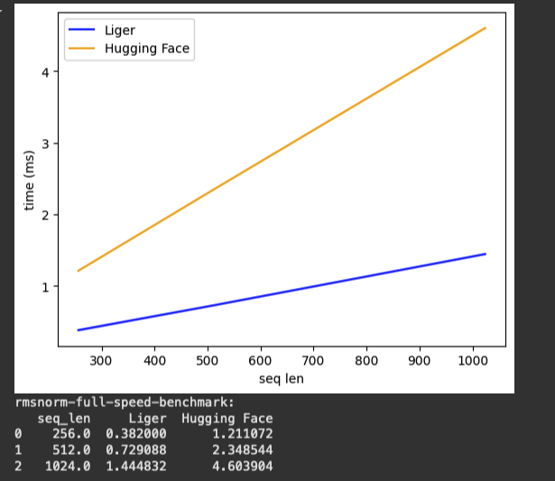

```python
def test_memory(func, _iter):
    total_mem = []

    for _ in range(_iter):
        torch.cuda.memory.reset_peak_memory_stats()
        func()
        mem = torch.cuda.max_memory_allocated() / (2**20)
        total_mem.append(mem)

    return sum(total_mem) / len(total_mem)

@triton.testing.perf_report(
    [
        triton.testing.Benchmark(
            x_names=["seq_len"],
            x_vals=[2**i for i in range(8, 11)], # 256, 512, 1024
            xlabel="seq len",
            line_arg="provider",
            line_vals=["liger", "huggingface"],
            line_names=["Liger", "Hugging Face"],
            styles=[("blue", "solid"), ("orange", "solid")],
            ylabel="Memory (MB)",
            plot_name="rmsnorm-full-memory-benchmark",
            args={"batch_size": 4, "hidden_size": 2048, "dtype": torch.float32, "mode": "full"},
        ),
    ]
)
def bench_memory_rms_norm(batch_size, seq_len, hidden_size, dtype, provider, mode, eps=1e-5, device="cuda"):
    x_shape = (batch_size, seq_len, hidden_size)

    triton_rms = LigerRMSNorm(hidden_size=hidden_size).to("cuda")
    llama_rms = LlamaRMSNorm(hidden_size=hidden_size).to("cuda")

    x = torch.randn(x_shape, dtype=dtype, device="cuda")
    dy = torch.randn_like(x)
    x.requires_grad_(True)

    x = x.view(batch_size * seq_len, hidden_size)
    dy = dy.view(batch_size * seq_len, hidden_size)

    quantiles = [0.5, 0.2, 0.8]


    def full():
        if provider == "liger":
            y = triton_rms(x)
        elif provider == "huggingface":
            y = llama_rms(x)

        y.backward(dy, retain_graph=True)

    mem = test_memory(full, 10)

    return mem

bench_memory_rms_norm.run(show_plots=True, print_data=True)
```

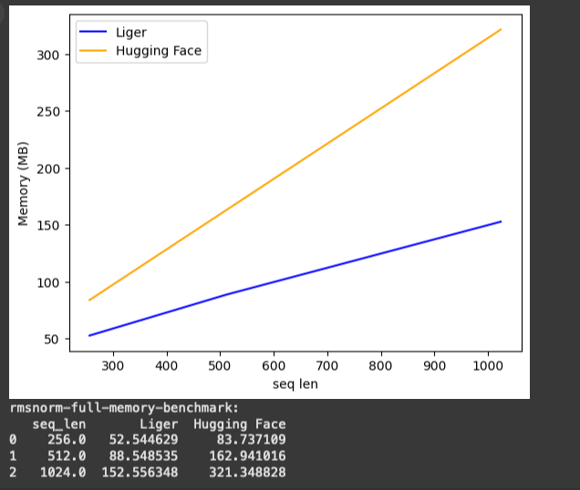

### RMSNorm 테스트 정리

Triton 구현이 speed와 memory 사용 면에서 원래 구현보다 낫다는 것을 명확히 볼 수 있고, 정확성도 검증했다! Google Colab의 GPU 제한 때문에 일부 테스트만 수행했다. Liger-Kernel의 실제 테스트에서는 더 큰 입력 크기로 bf16 성능도 검증했다. 전체 버전은 https://github.com/linkedin/Liger-Kernel 을 참고하라.

## 강의 노트: Fused Linear Cross Entropy

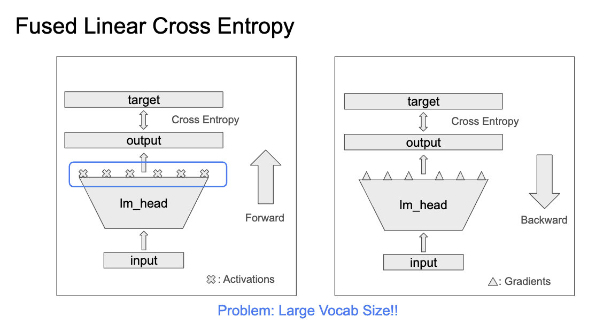

이 Slides는 Transformer 모델 안의 Linear Cross Entropy의 Forward Pass와 Backward Pass 과정을 보여준다. 그림 왼쪽은 Forward Pass(Forward) 흐름을 보여준다. input이 lm_head layer를 통과해 Activations를 만들고, output과 target으로 Cross Entropy를 계산한다. 오른쪽은 Backward Pass(Backward) 흐름을 보여주며, Gradients의 전달 방향을 나타낸다. 그림 아래쪽은 이 모델이 마주한 주요 도전이 큰 vocab size(Large Vocab Size)라고 지적한다.

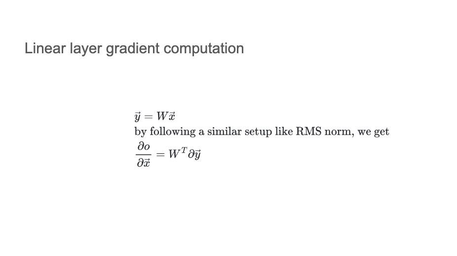

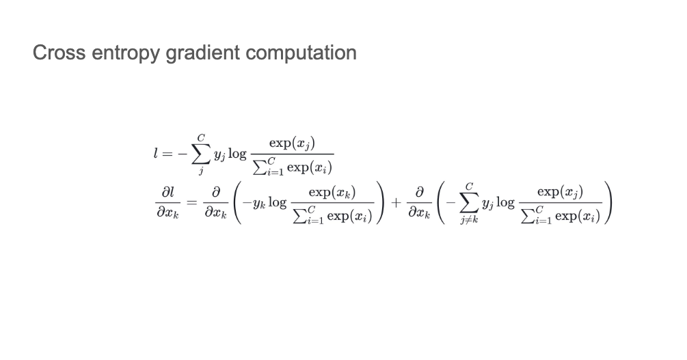

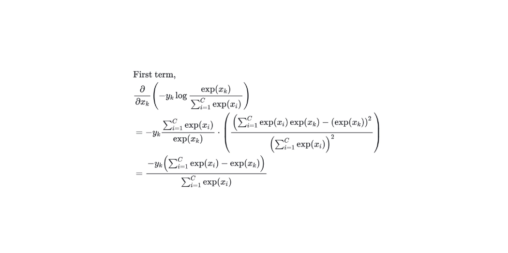

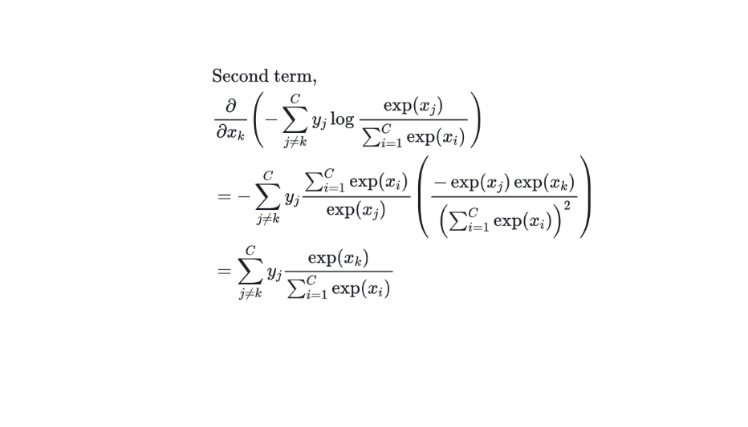

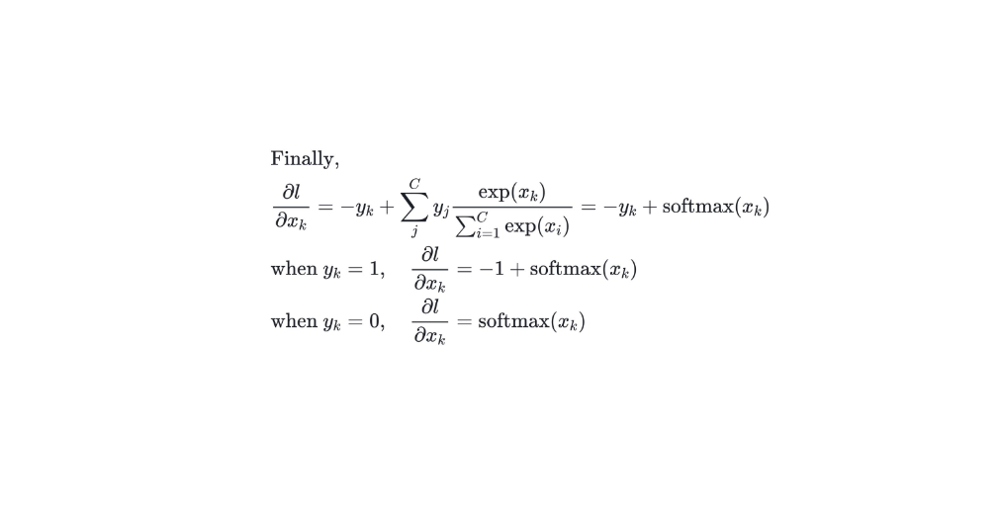

이 5장의 slides는 linear layer와 cross entropy gradient 계산의 전체 유도 과정을 보여준다. 먼저 linear layer의 Forward Pass(`y = Wx`)와 Backward Pass`(∂o/∂x = W^T∂y)`를 소개한다. 이어 cross entropy loss function `l = -∑yⱼlog(exp(xⱼ)/∑exp(xᵢ))`에 대해 partial derivative를 구하고, 이를 두 항으로 나누어 각각 유도한다. 하나는 xₖ를 포함하는 항이고, 다른 하나는 나머지 모든 항이다. 복잡한 algebra 계산과 단순화를 거쳐 최종적으로 간결한 gradient expression `∂l/∂xₖ = -yₖ + softmax(xₖ)`를 얻는다. 그리고 `yₖ=1`과 `yₖ=0` 두 special case의 결과도 논의한다. 이로써 복잡한 gradient 계산 문제를 target 값과 softmax의 차이 형태로 최적화한다. 이 마지막 식이 있으면 Triton에서 vector의 cross entropy gradient를 비교적 편하게 계산할 수 있다.

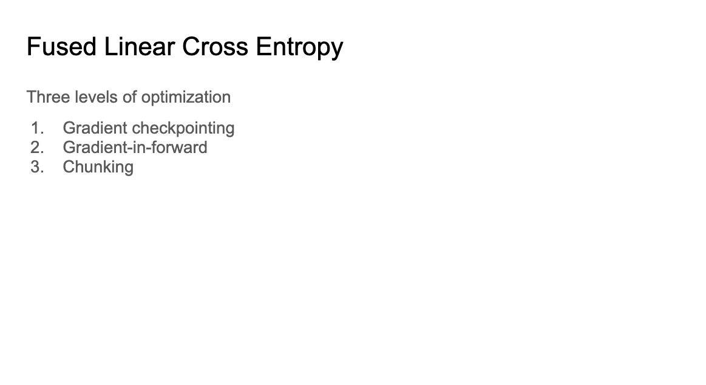

여기서는 두 번째 점에 주의해야 한다. Cross Entropy는 마지막 layer이므로 그 출력은 반드시 scalar다. 따라서 forward 때 gradient를 계산할 수 있다.

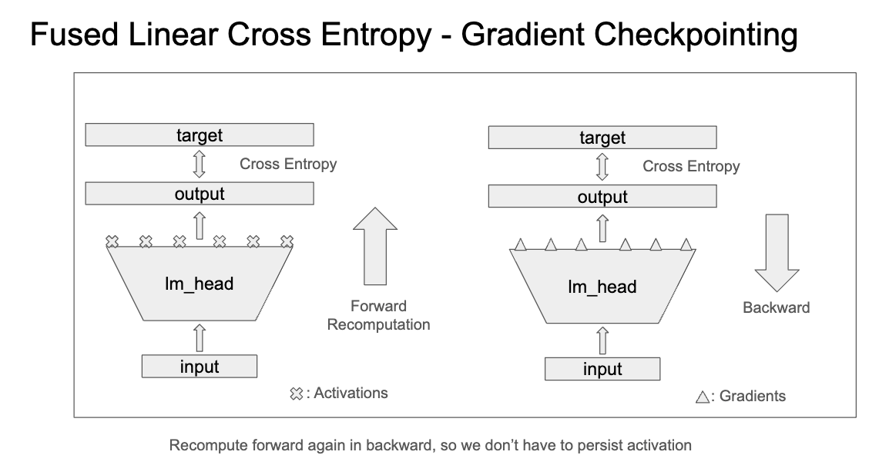

이 Slides는 Fused Linear Cross Entropy의 Gradient Checkpointing 기술을 보여준다. model training 과정에서 왼쪽은 forward propagation path를 보여준다. input이 lm_head layer를 지나 output을 얻고 target과 Cross Entropy를 계산한다. 오른쪽은 Backward Pass path를 보여준다. 핵심은 Backward Pass 때 activation을 저장하는 대신 forward process(Forward Recomputation)를 다시 계산한다는 점이다. 이렇게 하면 storage space를 절약할 수 있다. 그림에서 "×"는 Activations를, "△"는 Gradients를 나타낸다. 아래 설명은 이 전략의 핵심을 강조한다. Backward Pass 때 forward process를 다시 계산해 activation을 persistent storage로 저장할 필요를 피한다.

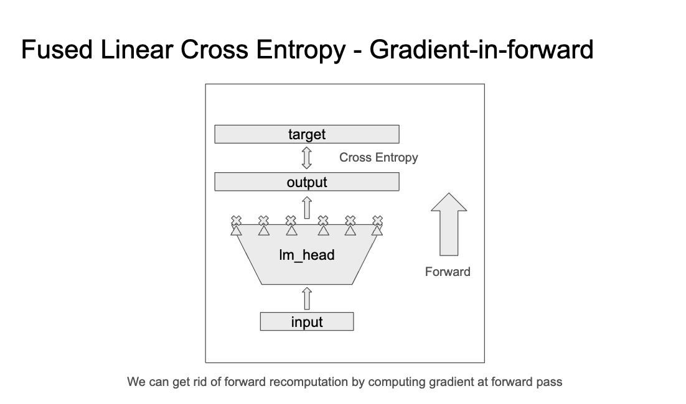

이 Slides는 Fused Linear Cross Entropy의 gradient-in-forward 최적화 기술을 보여준다. 앞의 gradient checkpointing 방법과 달리, 여기서는 Forward Pass 과정에서 gradient도 동시에 계산해 forward process를 다시 계산할 필요를 없앤다. 그림은 input이 lm_head layer를 거쳐 output이 되고 target과 Cross Entropy를 계산하는 흐름을 보여준다. lm_head layer에는 activation("×"로 표시)과 gradient("△"로 표시)가 동시에 포함된다. 아래 설명은 이 방법의 장점을 강조한다. Forward Pass 때 gradient를 계산해 forward process recomputation 필요를 제거하고 계산 효율을 높일 수 있다. Cross Entropy의 output은 Scalar이기 때문에 upstream gradient가 안정적으로 1이며, 이 때문에 forward 과정에서 gradient를 계산할 수 있다. 이렇게 Backward Pass에서 gradient를 계산하고 recomputation하는 일을 피한다.

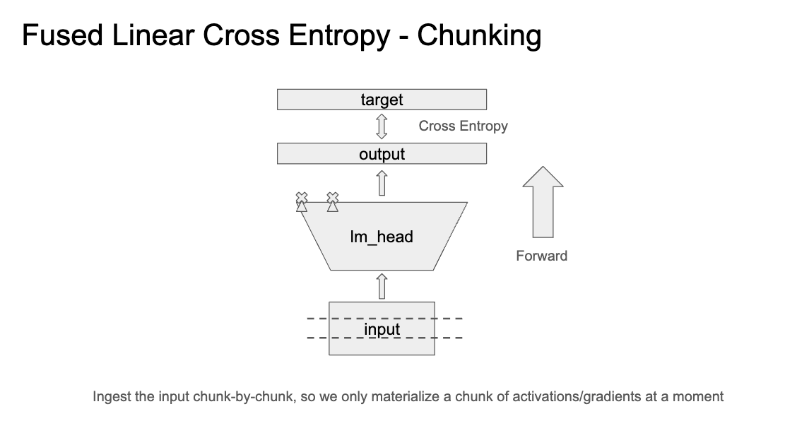

이 Slides는 Fused Linear Cross Entropy의 Chunking 기술을 보여준다. 그림에서 input은 점선으로 여러 chunks로 나뉘어 있으며, 입력 데이터가 여러 작은 chunk로 처리된다는 것을 나타낸다. 이 방법의 핵심 아이디어는 한 번에 입력 데이터의 한 chunk만 처리하는 것이다. 따라서 어느 시점에도 현재 chunk의 activation("×"로 표시)과 gradient("△"로 표시)만 memory에 저장하면 된다. 아래 설명은 이 전략의 장점을 설명한다. 입력 데이터를 chunk 단위로 처리하면 memory 사용량을 크게 줄일 수 있다. 같은 시점에는 전체 데이터가 아니라 작은 chunk 하나의 activation과 gradient 정보만 저장하면 되기 때문이다. 주의할 점은 입력을 chunk로 나누어 처리할 때 Cross Entropy의 gradient 계산에 Softmax 연산이 있다는 것이다. 위 몇 장의 Slides를 보면 알 수 있듯 입력을 chunk로 나누면 Online Softmax 알고리즘처럼 chunk마다 scaling factor를 갱신해야 하고, 그래야 마지막에 hidden_states에 대한 올바른 gradient를 얻을 수 있다.


## Live Demo: FusedLinearCrossEntropy: memory 감소 확인

우리는 checkpointing, chunking, gradient-in-forward 개념을 논의했다. 이 개념들은 logits를 materialize하고 recomputation하는 일을 피할 수 있게 한다. 구현은 비교적 복잡하므로 이 부분은 독자가 직접 학습하도록 남긴다. 이 notebook에서는 FusedLinearCrossEntropy가 비슷한 speed를 유지하면서 peak memory 사용량을 정말 줄일 수 있는지 검증한다.

### FusedLinearCrossEntropy benchmark

FusedLinearCrossEntropy와 Hugging Face 구현을 speed와 memory 측면에서 비교한다.

```python
import os

import torch
import triton

from liger_kernel.transformers.fused_linear_cross_entropy import (
    LigerFusedLinearCrossEntropyLoss,
)


class TorchLMHeadCE(torch.nn.Module):
    """Ground truth implementation of the linear fused with torch based cross entropy loss.

    :param H: hidden size
    :param V: vocab size
    :param ignore_index: index to ignore
    :param reduction: reduction method
    """

    def __init__(self, H: int, V: int, dtype: torch.dtype, ignore_index: int = -100):
        super().__init__()
        # bias 없는 linear layer를 정의한다
        self.lin = torch.nn.Linear(
            in_features=H, out_features=V, bias=False, dtype=dtype
        )
        # cross entropy loss function을 정의한다
        self.ce_loss = torch.nn.CrossEntropyLoss(
            ignore_index=ignore_index, reduction="mean"
        )

    def forward(self, x, y):
        # forward propagation: 먼저 linear layer를 통과하고, 그 다음 cross entropy loss를 계산한다
        logits = self.lin(x)
        return self.ce_loss(logits, y)


class LigerLMHeadCE(torch.nn.Module):
    def __init__(self, H: int, V: int, dtype: torch.dtype, ignore_index: int = -100):
        super().__init__()
        # bias 없는 linear layer를 정의한다
        self.lin = torch.nn.Linear(
            in_features=H, out_features=V, bias=False, dtype=dtype
        )
        # Liger의 fused cross entropy loss function을 정의한다
        self.ce_loss = LigerFusedLinearCrossEntropyLoss(
            ignore_index=ignore_index, reduction="mean"
        )

    def forward(self, x, y):
        # forward propagation: weight matrix, input, target으로 fused cross entropy loss를 직접 계산한다
        return self.ce_loss(self.lin.weight, x, y)


def test_memory(func, _iter):
    # memory 사용량을 테스트하는 helper function
    total_mem = []

    for _ in range(_iter):
        # CUDA peak memory stats를 reset한다
        torch.cuda.memory.reset_peak_memory_stats()
        func()
        # 최대 allocated memory(MB)를 가져온다
        mem = torch.cuda.max_memory_allocated() / (2**20)
        total_mem.append(mem)

    # 평균 memory 사용량을 반환한다
    return sum(total_mem) / len(total_mem)

@triton.testing.perf_report(
    [
        triton.testing.Benchmark(
            x_names=["BT"],
            x_vals=[2**i for i in range(10, 13)], # 1024, 2048, 4096
            xlabel="B x T",
            line_arg="provider",
            line_vals=["liger", "huggingface"],
            line_names=["Liger", "Hugging Face"],
            styles=[
                ("blue", "solid"),
                ("orange", "solid"),
            ],
            ylabel="GPU memory usage (MB)",
            plot_name="fused-linear-cross-entropy-memory-benchmark",
            args={"H": 4096, "V": 128256, "dtype": torch.float32},
        )
    ]
)
def bench_memory_cross_entropy(BT, H, V, provider, dtype, device="cuda"):
    # benchmark parameter를 출력한다
    print(
        f"Running benchmark with BT={BT}, H={H}, V={V}, dtype={dtype} provider={provider}"
    )
    # PyTorch와 Liger model을 초기화한다
    torch_lm_head_ce = TorchLMHeadCE(H=H, V=V, dtype=dtype).to(device)
    liger_lm_head_ce = LigerLMHeadCE(H=H, V=V, dtype=dtype).to(device)

    # random input과 target을 생성한다
    _input = torch.randn(BT, H, requires_grad=True, dtype=dtype, device=device)
    target = torch.randint(V, (BT, 1), dtype=torch.long, device=device).squeeze(1)

    def fwd():
        # provider에 따라 다른 forward 구현을 선택한다
        if provider == "liger":
            return liger_lm_head_ce(_input, target)
        elif provider == "huggingface":
            return torch_lm_head_ce(_input, target)

    def full():
        # full forward + backward propagation
        y = fwd()
        y.backward()

    # memory 사용량을 테스트하고 결과를 반환한다
    mem = test_memory(full, _iter=10)
    return mem


bench_memory_cross_entropy.run(show_plots=True, print_data=True)
```

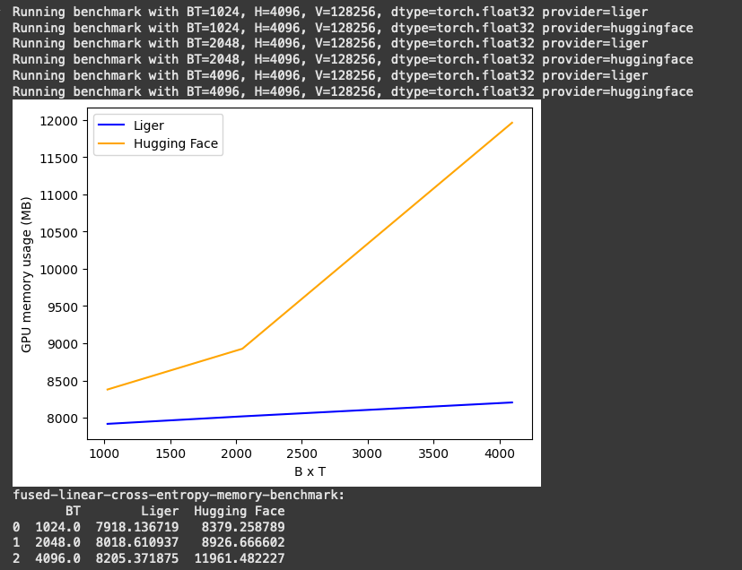

```python
@triton.testing.perf_report(
    [
        triton.testing.Benchmark(
            x_names=["BT"],
            x_vals=[2**i for i in range(10, 13)], # 1024, 2048, 4096
            xlabel="B x T",
            line_arg="provider",
            line_vals=["liger", "huggingface"],
            line_names=["Liger", "Hugging Face"],
            styles=[
                ("blue", "solid"),
                ("orange", "solid"),
            ],
            ylabel="Time (ms)",
            plot_name="fused-linear-cross-entropy-speed-benchmark",
            args={"H": 4096, "V": 128256, "dtype": torch.float32},
        )
    ]
)
def bench_speed_cross_entropy(BT, H, V, provider, dtype, device="cuda"):
    print(
        f"Running benchmark with BT={BT}, H={H}, V={V}, dtype={dtype} provider={provider}"
    )
    torch_lm_head_ce = TorchLMHeadCE(H=H, V=V, dtype=dtype).to(device)
    liger_lm_head_ce = LigerLMHeadCE(H=H, V=V, dtype=dtype).to(device)

    _input = torch.randn(BT, H, requires_grad=True, dtype=dtype, device=device)
    target = torch.randint(V, (BT, 1), dtype=torch.long, device=device).squeeze(1)

    def fwd():
        if provider == "liger":
            return liger_lm_head_ce(_input, target)
        elif provider == "huggingface":
            return torch_lm_head_ce(_input, target)

    def full():
        y = fwd()
        y.backward()

    quantiles = [0.5, 0.2, 0.8]

    ms, min_ms, max_ms = triton.testing.do_bench(full, quantiles=quantiles, rep=100)
    return ms, min_ms, max_ms


bench_speed_cross_entropy.run(show_plots=True, print_data=True)
```

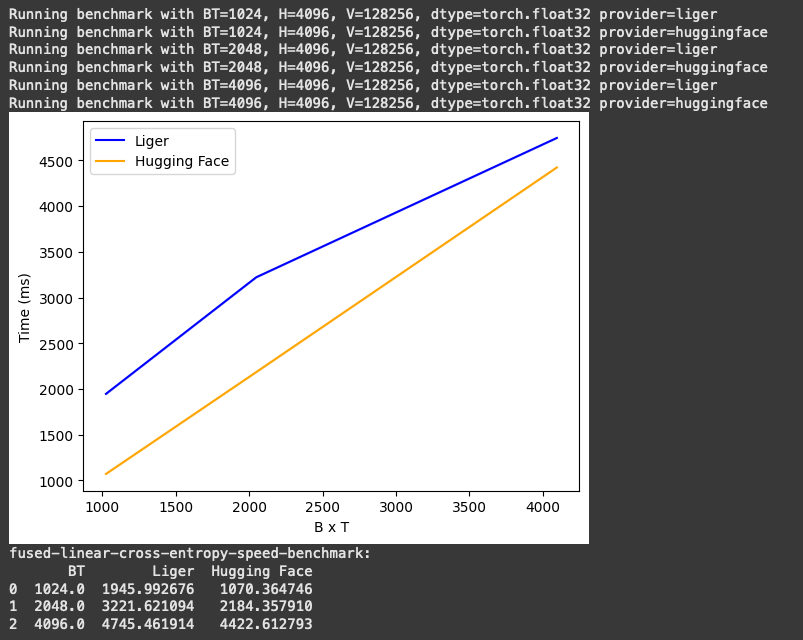

### FusedLinearCrossEntropy 테스트 정리

1. 우리 구현은 memory 사용에서 뚜렷한 장점이 있음을 관찰할 수 있다. 어떤 순간에도 전체 logits를 materialize하지 않기 때문이다.
2. speed는 약간 느려지지만, lm_head + cross_entropy는 한 번만 실행되고 transformer block은 N번 실행되므로 이 overhead는 받아들일 수 있다. 덕분에 batch size, sequence length를 늘리거나 gradient checkpoint를 끌 수 있다.


## Triton은 physical view를 다루므로 Contiguous()가 매우 중요하다

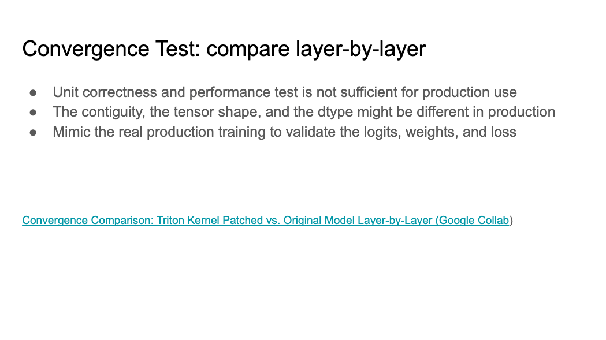

이 Slides는 convergence test에서 layer-by-layer 비교가 중요하다는 점을 주로 소개한다. unit correctness와 performance test만으로는 production 환경에 충분하지 않다고 지적한다. 실제 production에서는 contiguity, tensor shape, dtype 차이를 만날 수 있기 때문이다. 따라서 실제 production training 환경을 모사해 model output(logits), weights, loss를 검증할 것을 권한다. Slides 아래쪽에는 Triton kernel patch 버전과 원래 model을 layer-by-layer로 비교하기 위한 Google Colab 링크도 제공한다. 이 내용은 model을 production에 배포하기 전에 전면적인 테스트가 중요하다는 점을 강조한다(https://colab.research.google.com/drive/1e52FH0BcE739GZaVp-3_Dv7mc4jF1aif?usp=sharing). 이 script는 비교적 간단하고 ChatGPT에게 작성하게 할 수도 있으므로 여기서는 따로 보지 않는다.

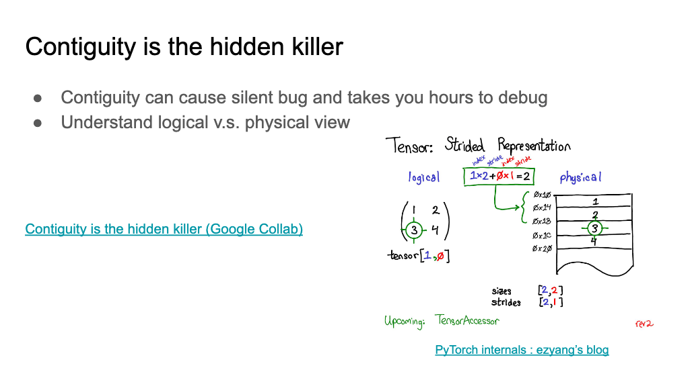

이 Slides는 CUDA programming에서 자주 간과되지만 매우 중요한 "Contiguity" 문제를 설명한다. Contiguity 문제는 디버깅하기 어려운 silent bug를 일으킬 수 있고, 해결에 많은 시간이 든다. slide는 Tensor 예시로 logical view와 physical view의 차이를 보여주며, stride가 있는 tensor 표현 하나로 이 개념을 설명한다. 그림은 2x2 tensor가 logical하게 보이는 모습과 physical storage에서의 다른 표현, 그리고 대응되는 sizes와 strides parameter를 보여준다. Triton은 physical view 위에서 계산하므로 contiguous() 문제에 특히 주의해야 한다. https://colab.research.google.com/drive/1llnAdo0hc9FpxYRRnjih0l066NCp7Ylu?usp=sharing#scrollTo=1jTVlU1NC-TN 이 jupyter는 Liger Kernel의 RoPE 구현을 보여준다. 입력에 contiguous() 연산을 하지 않은 탓에 개별 unit test는 항상 통과했지만, model training에서는 loss divergence가 계속 발생했다. 이 문제 역시 위의 convergence test에서 layer-by-layer 비교를 통해 발견했다.


## Triton의 index out-of-bounds bug

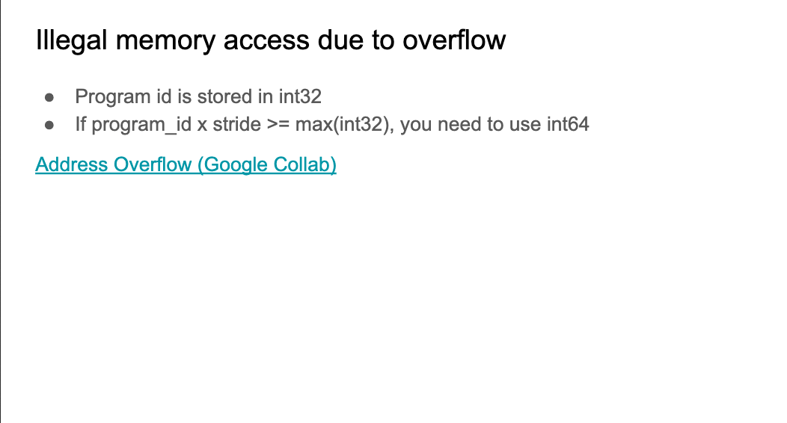

이 Slides는 Triton의 program_id가 int32로 표현된다는 점을 다룬다. Cross Entropy를 개발할 때 이 점을 고려하지 않아 큰 Vocab Size에서 index가 범위를 벗어났다. https://colab.research.google.com/drive/1WgaU_cmaxVzx8PcdKB5P9yHB6_WyGd4T?usp=sharing#scrollTo=X_Dn9wzVNpMC 이 jupyter가 이 문제를 보여준다. 수정 방안은 program_id를 int64로 변환하는 것이다. 다만 32-bit addressing이 성능을 매우 느리게 만들 수 있으므로 이 문제는 매우 신중하게 처리해야 한다. 예를 들어 PyTorch에서는 두 가지 dtype을 C++ template으로 처리한다. 구현은 같은 kernel을 공유할 수 있지만 index overflow 문제를 피할 수 있다.


## Liger Kernel 관련 오픈소스 정보와 반응

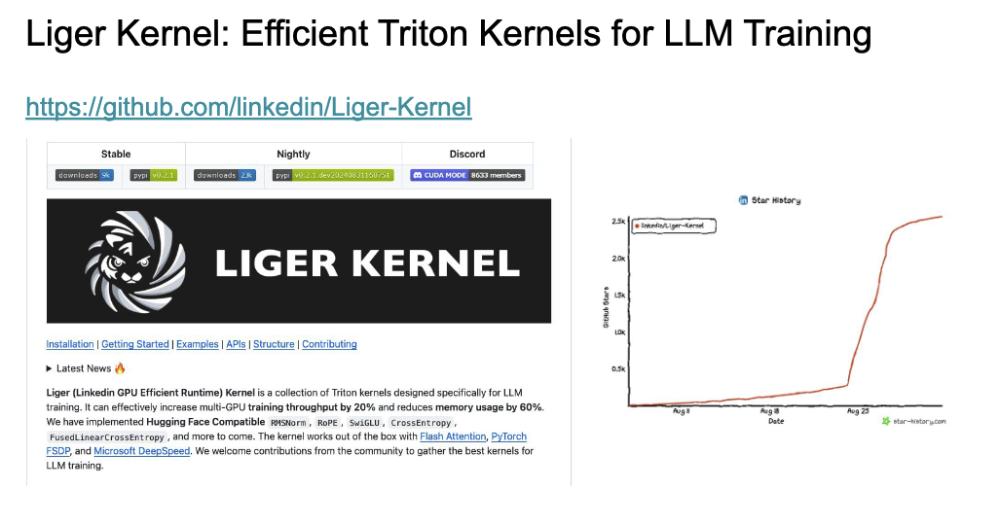

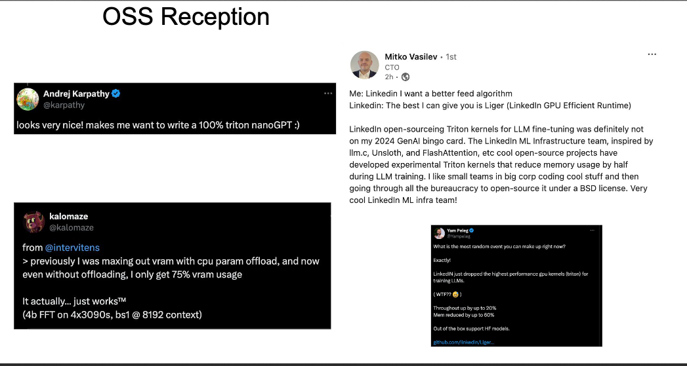

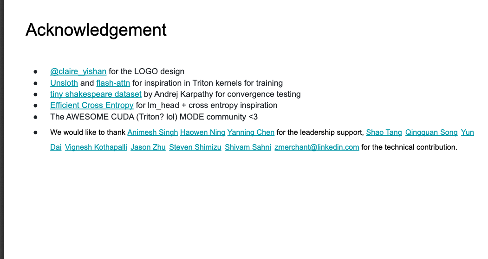

이 몇 장의 Slides를 정리하면, LinkedIn이 개발한 Liger Kernel은 LLM training에 특화해 최적화한 GPU-efficient runtime kernel이다. multi-GPU training throughput을 20% 높이고 memory 사용량을 60% 줄일 수 있으며, 여러 Hugging Face 호환 기능을 지원하고 Flash Attention, PyTorch 등 주류 framework와 함께 동작한다. 이 프로젝트는 오픈소스 community에서 긍정적인 반응을 얻었고, developer feedback에서도 뛰어난 성능이 확인되었다. 프로젝트의 성공은 많은 contributor의 지원 없이는 불가능했다. LOGO design, training inspiration, test dataset 제공 등 여러 도움과 CUDA/Triton community의 강력한 지원이 있었으며, 이는 open-source collaboration의 힘을 잘 보여준다.

## 강의 노트 정리

이번 강의는 RMSNorm과 Fused Linear Cross Entropy라는 두 가지 핵심 최적화를 소개했다. 이 노트는 강의에 나온 최적화의 수학적 원리, 구현 방법, 테스트 검증 과정을 자세히 기록했으며, 일부 script 해설도 포함한다. RMSNorm 부분은 backward propagation의 유도 과정과 memory 최적화 기법을 보여준다. Fused Linear Cross Entropy 부분은 checkpointing, chunking, gradient-in-forward 같은 기술로 memory 사용량을 줄이는 방법을 보여준다. 또한 강의는 Triton framework 위에서 최적화 kernel을 개발할 때의 몇 가지 실전 경험, 예를 들어 Contiguity 문제와 index out-of-bounds 문제 처리도 공유한다. 이러한 최적화를 통해 Liger Kernel은 multi-GPU training throughput을 20% 높이고 memory 사용량을 60% 줄일 수 있으며, Triton이 산업계에서 잘 적용된 사례다.
