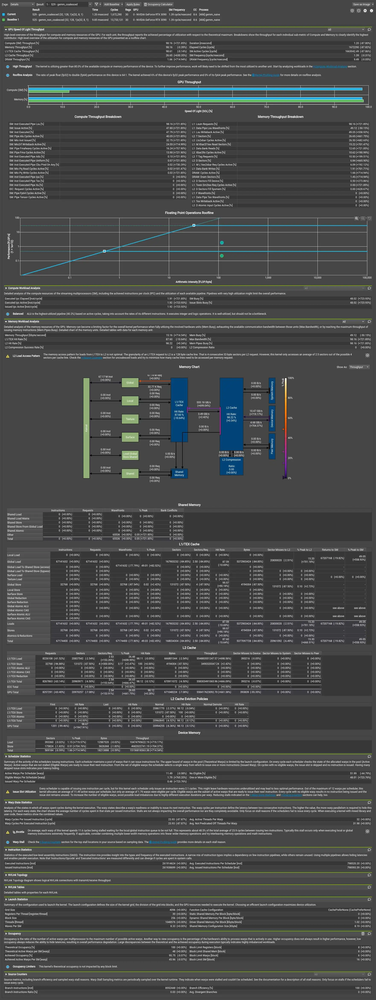

> 블로그 출처: https://leimao.github.io/blog/NVIDIA-Docker-CUDA-Compatibility/ 이 글은 Lei Mao의 글이며, 저자의 전재 허가를 받았다. 이후 Lei Mao의 CUDA 관련 Blog를 몇 편 더 전재할 예정이고, 이는 하나의 완결된 칼럼이다. Blog는 비교적 이른 시기의 CUDA 아키텍처부터 현재 최신 CUDA 아키텍처까지 다루며, 실용적인 엔지니어링 기법, 저수준 명령어 분석, Cutlass 분석 등 여러 주제를 포함한다.

# NVIDIA Docker CUDA Compatibility

## 소개

NVIDIA NGC CUDA Docker container는 CUDA application 개발과 배포에 매우 편리한 도구다. Docker가 설치된 platform에서 거의 모든 CUDA runtime library와 CUDA application을 실행할 수 있게 하므로 code에 portability와 reproducibility를 제공한다. 이 때문에 나는 모든 CUDA 개발과 배포 작업에 NVIDIA NGC CUDA Docker container를 사용해 왔다. 개인 컴퓨터에는 NVIDIA CUDA driver와 Docker만 설치한다. CUDA runtime library가 필요할 때는 NVIDIA NGC CUDA Docker container를 pull해서 실행할 뿐이다. 개인 컴퓨터에는 CUDA runtime library를 설치한 적이 없다.

하지만 최근 NVIDIA NGC CUDA Docker container를 사용하면서 이상한 문제들을 만났다. 조사해 보니 이 문제들은 Docker container 안의 CUDA runtime library version과 host machine의 CUDA driver version이 compatible하지 않아 생긴 것이었다. 이 글에서는 내 경험을 공유하고, 왜 Docker container 안의 CUDA runtime library version과 같은 host CUDA driver version을 최대한 사용해야 하는지 설명한다.

## NVIDIA Docker Compatibility가 일으킨 이상한 문제

최근 Ubuntu에서 NVIDIA NGC CUDA Docker container(https://catalog.ngc.nvidia.com/orgs/nvidia/containers/cuda)를 사용해 CUDA kernel 몇 개를 implementation하다가 설명하기 어려운 문제들을 만났다.

예를 들어 어떤 `for` loop에서는 `#pragma unroll`을 사용해 loop body를 unroll하면 GV100 GPU가 설치된 machine의 CUDA kernel이 올바른 결과를 생성하지 않았다. 그러나 RTX 3090 GPU가 설치된 다른 machine에서는 `#pragma unroll`을 사용하는 같은 코드가 정상적으로 동작했다. 두 machine은 모두 같은 Ubuntu version을 실행했고 같은 NVIDIA NGC CUDA Docker container `nvcr.io/nvidia/cuda:12.0.1-devel-ubuntu22.04`를 사용했다.

또한 다음 두 `if` statement는 완전히 equivalent이다. 그러나 첫 번째 `if` statement를 사용하는 CUDA kernel은 두 machine 모두에서 올바른 결과를 생성했고, 두 번째 `if` statement를 사용하는 CUDA kernel은 GV100 GPU가 설치된 machine에서 잘못된 결과를 생성했다.

```c++
size_t m, n, C_row_idx, C_col_idx, i;
// The following conditions have no numerical overflow.
if (C_row_idx < m && C_col_idx + i < n) // This worked.
{
    // Some math.
}
if (C_row_idx < m && C_col_idx < n && C_col_idx + i < n) // This failed.
{
    // The same math.
}
```

이 문제들은 CUDA compiler에 심각한 문제가 있는 것처럼 보였다. 그러나 나는 CUDA compiler가 이렇게 단순한 오류를 가질 것이라고 믿지 않았다.

조사해 보니 두 machine이 같은 Ubuntu version을 실행하고 같은 NVIDIA NGC CUDA Docker container를 사용했지만 CUDA driver version은 달랐다. GV100 GPU가 설치된 machine의 host에는 `Driver Version: 470.223.02 CUDA Version: 11.4`가 있었고, RTX 3090 GPU가 설치된 machine의 host에는 `Driver Version: 525.147.05 CUDA Version: 12.0`이 있었다. 따라서 GV100 GPU가 설치된 machine에서는 NVIDIA NGC CUDA Docker container `nvcr.io/nvidia/cuda:12.0.1-devel-ubuntu22.04`를 실행했는데, 이 container에는 CUDA runtime library 12.0.1 version이 설치되어 있지만 CUDA driver 11.4 version 위에서 동작했다. 이것이 일부 CUDA kernel이 GV100 GPU가 설치된 machine에서 올바르게 동작하지 않은 이유다.

따라서 GV100 GPU가 설치된 machine에서는 NVIDIA NGC CUDA Docker container `nvcr.io/nvidia/cuda:11.4.3-devel-ubuntu20.04`로 바꿨다. 이번에는 이전에 문제가 있던 CUDA kernel들이 모두 완벽하게 동작했다.

## 결론

CUDA backward/forward compatibility(leimao.github.io/blog/CUDA-Compatibility/)는 Docker container 안에서 거의 모든 CUDA runtime library와 CUDA application을 실행할 수 있게 해 주는 훌륭한 기능이다. 그러나 이것이 host의 CUDA driver version을 자세히 확인하지 않고 NVIDIA NGC CUDA Docker container가 항상 동작한다고 가정해도 된다는 의미는 아니다. Docker container 안의 CUDA runtime library version과 같은 host CUDA driver version을 최대한 사용해야 한다. 그렇지 않으면 설명하기 어려운 이상한 문제들을 만날 수 있다.

## 참고 자료

- CUDA Compatibility(https://leimao.github.io/blog/CUDA-Compatibility/)
- NVIDIA NGC CUDA Docker containers(https://catalog.ngc.nvidia.com/orgs/nvidia/containers/cuda)


------------------------------------------------------------------
------------------------------------------------------------------
------------------------------------------------------------------

# Docker 안의 Nsight Compute

## 소개

NVIDIA Nsight Compute는 CUDA의 interactive profiler이며, user interface와 command-line tool을 통해 상세한 performance metric과 API debugging을 제공한다. 사용자는 guided analysis를 실행하고 customizable data-driven user interface로 결과를 비교할 수 있으며, 자신의 workflow에서 결과를 post-process하고 분석할 수 있다.

이 블로그 글에서는，Docker container 안에서 Nsight Compute를 설치하고 사용하는 방법을 논의한다. 이렇게 하면 Docker가 설치된 어디서든 Nsight Compute와 그 GUI를 사용할 수 있다.

## Nsight Compute

### Docker image 빌드

Docker image 안에 Nsight Compute를 설치하고 어디서든 사용할 수 있다. Nsight Compute를 빌드하는 Dockerfile은 다음과 같다.

```c++
FROM nvcr.io/nvidia/cuda:12.0.1-devel-ubuntu22.04

ENV DEBIAN_FRONTEND=noninteractive

RUN apt-get update -y && \
    apt-get install -y --no-install-recommends \
        apt-transport-https \
        ca-certificates \
        dbus \
        fontconfig \
        gnupg \
        libasound2 \
        libfreetype6 \
        libglib2.0-0 \
        libnss3 \
        libsqlite3-0 \
        libx11-xcb1 \
        libxcb-glx0 \
        libxcb-xkb1 \
        libxcomposite1 \
        libxcursor1 \
        libxdamage1 \
        libxi6 \
        libxml2 \
        libxrandr2 \
        libxrender1 \
        libxtst6 \
        libgl1-mesa-glx \
        libxkbfile-dev \
        openssh-client \
        wget \
        xcb \
        xkb-data && \
    apt-get clean

# QT6 is required for the Nsight Compute UI.
RUN apt-get update -y && \
    apt-get install -y --no-install-recommends \
        qt6-base-dev && \
    apt-get clean

```

Docker image를 빌드하려면 다음 명령을 실행한다.

```shell
$ docker build -f nsight-compute.Dockerfile --no-cache --tag nsight-compute:12.0.1 .
```

### Docker image 업로드

Docker image를 업로드하려면 다음 명령을 실행한다.

```shell
$ docker tag nsight-compute:12.0.1 leimao/nsight-compute:12.0.1
$ docker push leimao/nsight-compute:12.0.1
```

### Docker image pull

Docker image를 pull하려면 다음 명령을 실행한다.

```shell
$ docker pull leimao/nsight-compute:12.0.1
$ docker tag leimao/nsight-compute:12.0.1 nsight-compute:12.0.1
```

### Docker container 실행

Docker container를 실행하려면 다음 명령을 실행한다.

```shell
$ xhost +
$ docker run -it --rm --gpus all -e DISPLAY=$DISPLAY -v /tmp/.X11-unix:/tmp/.X11-unix --cap-add=SYS_ADMIN --security-opt seccomp=unconfined -v $(pwd):/mnt -w /mnt --network host nsight-compute:12.0.1
$ xhost -
```

### Nsight Compute 실행

GUI가 있는 Nsight Compute를 실행하려면 다음 명령을 실행한다.

```shell
$ ncu-ui
```

이제 Docker container에서, Docker mount를 통해 Docker local host machine에서, 그리고 remote workstation이나 embedded device 같은 remote host에서 application을 profile할 수 있다.

## 예제

### Non-Coalesced Memory Access VS Coalesced Memory Access

이 예제에서는 GPU에서 matrix multiplication을 수행하는 naive GEMM kernel을 implementation한다. 이 kernel은 shared memory tiling 같은 advanced technique을 사용하지 않기 때문에 naive하다. 원래 목표는 global memory를 coalesced 방식으로 읽고 쓰는 것이었다. 그러나 kernel의 첫 번째 버전 `gemm_non_coalesced`에서는 output matrix의 row index와 column index를 바꾸는 오류를 만들었다. 따라서 kernel은 global memory를 non-coalesced 방식으로 읽고 쓴다. 두 번째 버전 `gemm_coalesced`에서는 오류를 고치고 global memory를 coalesced 방식으로 읽고 쓴다. Nsight Compute로 두 kernel을 profile하고 두 kernel 사이의 performance 차이를 비교했다.

```c++
#include <iostream>

#include <cuda_runtime.h>

#define CHECK_CUDA_ERROR(val) check_cuda((val), #val, __FILE__, __LINE__)
void check_cuda(cudaError_t err, const char* const func, const char* const file,
                const int line)
{
    if (err != cudaSuccess)
    {
        std::cerr << "CUDA Runtime Error at: " << file << ":" << line
                  << std::endl;
        std::cerr << cudaGetErrorString(err) << " " << func << std::endl;
        std::exit(EXIT_FAILURE);
    }
}

#define CHECK_LAST_CUDA_ERROR() check_cuda_last(__FILE__, __LINE__)
void check_cuda_last(const char* const file, const int line)
{
    cudaError_t const err{cudaGetLastError()};
    if (err != cudaSuccess)
    {
        std::cerr << "CUDA Runtime Error at: " << file << ":" << line
                  << std::endl;
        std::cerr << cudaGetErrorString(err) << std::endl;
        std::exit(EXIT_FAILURE);
    }
}

// non-coalesced global memory read/write access
template <typename T>
__global__ void gemm_non_coalesced(size_t m, size_t n, size_t k, T alpha,
                                   T const* A, size_t lda, T const* B,
                                   size_t ldb, T beta, T* C, size_t ldc)
{
    // calculatehandled by current threadrow and column index of C matrix
    // note：row and column indices are intentionally swapped here，causing non-coalesced access
    size_t const C_row_idx{blockIdx.x * blockDim.x + threadIdx.x};
    size_t const C_col_idx{blockIdx.y * blockDim.y + threadIdx.y};

    // eachthreadcalculate
    // C[C_row_idx, C_col_idx] = alpha * A[C_row_idx, :] * B[:, C_col_idx] +
    // beta * C[C_row_idx, C_col_idx]
    if (C_row_idx < m && C_col_idx < n)
    {
        T sum{static_cast<T>(0)};
        // calculatedot product：row C_row_idx of A and column C_col_idx of B
        for (size_t k_idx{0U}; k_idx < k; ++k_idx)
        {
            sum += A[C_row_idx * lda + k_idx] * B[k_idx * ldb + C_col_idx];
        }
        // apply alpha and beta coefficients，updateCmatrix
        C[C_row_idx * ldc + C_col_idx] =
            alpha * sum + beta * C[C_row_idx * ldc + C_col_idx];
    }
}

// launch non-coalesced memory access GEMM kernel
template <typename T>
void launch_gemm_kernel_non_coalesced(size_t m, size_t n, size_t k,
                                      T const* alpha, T const* A, size_t lda,
                                      T const* B, size_t ldb, T const* beta,
                                      T* C, size_t ldc, cudaStream_t stream)
{
    // define thread block size：32x8 thread block
    dim3 const block_dim{32U, 8U, 1U};
    // calculategridsize，ensure the whole matrix is covered
    dim3 const grid_dim{
        (static_cast<unsigned int>(m) + block_dim.x - 1U) / block_dim.x,
        (static_cast<unsigned int>(n) + block_dim.y - 1U) / block_dim.y, 1U};
    // launchkernel
    gemm_non_coalesced<T><<<grid_dim, block_dim, 0U, stream>>>(
        m, n, k, *alpha, A, lda, B, ldb, *beta, C, ldc);
    CHECK_LAST_CUDA_ERROR();
}

// coalesced global memory read/write access
template <typename T>
__global__ void gemm_coalesced(size_t m, size_t n, size_t k, T alpha,
                               T const* A, size_t lda, T const* B, size_t ldb,
                               T beta, T* C, size_t ldc)
{
    // calculatehandled by current threadrow and column index of C matrix
    // note：row and column indices are assigned correctly here，implementationcoalescedaccess
    size_t const C_col_idx{blockIdx.x * blockDim.x + threadIdx.x};
    size_t const C_row_idx{blockIdx.y * blockDim.y + threadIdx.y};

    // eachthreadcalculate
    // C[C_row_idx, C_col_idx] = alpha * A[C_row_idx, :] * B[:, C_col_idx] +
    // beta * C[C_row_idx, C_col_idx]
    if (C_row_idx < m && C_col_idx < n)
    {
        T sum{static_cast<T>(0)};
        // calculatedot product：row C_row_idx of A and column C_col_idx of B
        for (size_t k_idx{0U}; k_idx < k; ++k_idx)
        {
            sum += A[C_row_idx * lda + k_idx] * B[k_idx * ldb + C_col_idx];
        }
        // apply alpha and beta coefficients，updateCmatrix
        C[C_row_idx * ldc + C_col_idx] =
            alpha * sum + beta * C[C_row_idx * ldc + C_col_idx];
    }
}

// launch coalesced memory access GEMM kernel
template <typename T>
void launch_gemm_kernel_coalesced(size_t m, size_t n, size_t k, T const* alpha,
                                  T const* A, size_t lda, T const* B,
                                  size_t ldb, T const* beta, T* C, size_t ldc,
                                  cudaStream_t stream)
{
    // define thread block size：32x8 thread block
    dim3 const block_dim{32U, 8U, 1U};
    // calculategridsize，note that dimension assignment differs from non-coalesced version
    dim3 const grid_dim{
        (static_cast<unsigned int>(n) + block_dim.x - 1U) / block_dim.x,
        (static_cast<unsigned int>(m) + block_dim.y - 1U) / block_dim.y, 1U};
    // launchkernel
    gemm_coalesced<T><<<grid_dim, block_dim, 0U, stream>>>(
        m, n, k, *alpha, A, lda, B, ldb, *beta, C, ldc);
    CHECK_LAST_CUDA_ERROR();
}

// CPU GEMM implementation，for verifying correctness of GPU result
template <typename T>
void gemm_cpu(size_t m, size_t n, size_t k, T alpha, T const* A, size_t lda,
              T const* B, size_t ldb, T beta, T* C, size_t ldc)
{
    // three nested loopsimplementationmatrixmultiplication：C = alpha * A * B + beta * C
    for (size_t i{0U}; i < m; ++i)
    {
        for (size_t j{0U}; j < n; ++j)
        {
            T sum{static_cast<T>(0)};
            // calculate row i of A and column j of B dot product
            for (size_t k_idx{0U}; k_idx < k; ++k_idx)
            {
                sum += A[i * lda + k_idx] * B[k_idx * ldb + j];
            }
            // apply alpha and beta coefficients
            C[i * ldc + j] = alpha * sum + beta * C[i * ldc + j];
        }
    }
}

// verify GPU calculated result matches CPU reference result
template <typename T>
void verify_outputs(size_t m, size_t n, size_t ldc, T const* C, T const* C_ref,
                    T abs_error_tol)
{
    // compare GPU result and CPU reference result element by element
    for (size_t i{0U}; i < m; ++i)
    {
        for (size_t j{0U}; j < n; ++j)
        {
            T const abs_error{std::abs(C[i * ldc + j] - C_ref[i * ldc + j])};
            // if error exceeds tolerance，report error and exit
            if (abs_error > abs_error_tol)
            {
                std::cerr << "Error: i = " << i << ", j = " << j
                          << ", abs_error = " << abs_error << std::endl;
                std::exit(EXIT_FAILURE);
            }
        }
    }
}

int main()
{
    // define matrix dimensions and GEMM parameters
    size_t const m{1024U};  // A matrix row count，C matrix row count
    size_t const n{1024U};  // B matrix column count，Cmatrix column count
    size_t const k{1024U};  // A matrix column count，B matrix row count
    float const alpha{1.0f}; // scaling factoralpha
    float const beta{0.0f};  // scaling factorbeta
    float const abs_error_tol{1e-5f}; // error tolerance

    // define leading dimensions of matrices（row-major storage）
    size_t const lda{k};  // Amatrix leading dimension
    size_t const ldb{n};  // Bmatrix leading dimension
    size_t const ldc{n};  // Cmatrix leading dimension

    // create CUDA stream
    cudaStream_t stream;
    CHECK_CUDA_ERROR(cudaStreamCreate(&stream));

    // allocate memory on host
    float* A_host{nullptr};
    float* B_host{nullptr};
    float* C_host{nullptr};
    float* C_host_from_device{nullptr};
    CHECK_CUDA_ERROR(cudaMallocHost(&A_host, m * lda * sizeof(float)));
    CHECK_CUDA_ERROR(cudaMallocHost(&B_host, k * ldb * sizeof(float)));
    CHECK_CUDA_ERROR(cudaMallocHost(&C_host, m * ldc * sizeof(float)));
    CHECK_CUDA_ERROR(
        cudaMallocHost(&C_host_from_device, m * ldc * sizeof(float)));

    // initialize matrices A and B
    for (size_t i{0U}; i < m; ++i)
    {
        for (size_t j{0U}; j < k; ++j)
        {
            A_host[i * lda + j] = static_cast<float>(i + j);
        }
    }
    for (size_t i{0U}; i < k; ++i)
    {
        for (size_t j{0U}; j < n; ++j)
        {
            B_host[i * ldb + j] = static_cast<float>(i + j);
        }
    }

    // allocate memory on device
    float* A_device{nullptr};
    float* B_device{nullptr};
    float* C_device{nullptr};
    CHECK_CUDA_ERROR(cudaMalloc(&A_device, m * lda * sizeof(float)));
    CHECK_CUDA_ERROR(cudaMalloc(&B_device, k * ldb * sizeof(float)));
    CHECK_CUDA_ERROR(cudaMalloc(&C_device, m * ldc * sizeof(float)));

    // copy matrices A and B from host to device
    CHECK_CUDA_ERROR(cudaMemcpy(A_device, A_host, m * lda * sizeof(float),
                                cudaMemcpyHostToDevice));
    CHECK_CUDA_ERROR(cudaMemcpy(B_device, B_host, k * ldb * sizeof(float),
                                cudaMemcpyHostToDevice));

    // run CPU version，generate reference result
    gemm_cpu(m, n, k, alpha, A_host, lda, B_host, ldb, beta, C_host, ldc);

    // launch non-coalesced memory access kernel
    launch_gemm_kernel_non_coalesced(m, n, k, &alpha, A_device, lda, B_device,
                                     ldb, &beta, C_device, ldc, stream);
    CHECK_CUDA_ERROR(cudaStreamSynchronize(stream));

    // copy result from device to host
    CHECK_CUDA_ERROR(cudaMemcpy(C_host_from_device, C_device,
                                m * ldc * sizeof(float),
                                cudaMemcpyDeviceToHost));

    // verify non-coalesced version result
    verify_outputs(m, n, ldc, C_host_from_device, C_host, abs_error_tol);

    // launch coalesced memory access kernel
    launch_gemm_kernel_coalesced(m, n, k, &alpha, A_device, lda, B_device, ldb,
                                 &beta, C_device, ldc, stream);
    CHECK_CUDA_ERROR(cudaStreamSynchronize(stream));

    // copy result from device to host
    CHECK_CUDA_ERROR(cudaMemcpy(C_host_from_device, C_device,
                                m * ldc * sizeof(float),
                                cudaMemcpyDeviceToHost));

    // verify coalesced version result
    verify_outputs(m, n, ldc, C_host_from_device, C_host, abs_error_tol);

    // free device memory
    CHECK_CUDA_ERROR(cudaFree(A_device));
    CHECK_CUDA_ERROR(cudaFree(B_device));
    CHECK_CUDA_ERROR(cudaFree(C_device));
    // free host memory
    CHECK_CUDA_ERROR(cudaFreeHost(A_host));
    CHECK_CUDA_ERROR(cudaFreeHost(B_host));
    CHECK_CUDA_ERROR(cudaFreeHost(C_host));
    CHECK_CUDA_ERROR(cudaFreeHost(C_host_from_device));
}
```

`nvcc`로 예제를 빌드하고 Nsight Compute로 예제를 분석하려면 다음 명령을 실행한다.


```shell
$ nvcc gemm_naive.cu -o gemm_naive
$ ncu --set full -f -o gemm_naive gemm_naive
```

Nsight Compute GUI로 분석 결과를 보려면 다음 명령을 실행한다.

```shell
$ ncu-ui
```



Nsight Compute 분석 상세에서 kernel의 첫 번째 버전 `gemm_non_coalesced`는 9.85 ms가 걸렸고, 두 번째 버전 `gemm_coalesced`는 1.20 ms가 걸렸음을 볼 수 있다. 두 kernel 모두 잘 최적화되어 있지는 않지만 Nsight Compute는 두 kernel의 많은 문제를 찾아냈다. 구체적으로 kernel `gemm_non_coalesced`는 memory-bound가 매우 심하며, Nsight Compute는 "This kernel has non-coalesced global accesses resulting in a total of 941339104 excessive sectors (85% of the total 1109395408 sectors)"라고 알려준다. 예를 들어 kernel `gemm_non_coalesced`의 경우 L1/TEX cache statistics는 global load가 request마다 16.51 sectors를 필요로 함을 보여준다. Product 하나를 calculate하기 위해 warp의 각 thread가 서로 다른 sector에서 load하고, warp는 request마다 matrix A buffer에서 32 x 1 sectors를 load하며, warp의 각 thread는 같은 sector에서 load하므로 matrix B buffer에서는 request마다 1 sector를 load한다. 평균은 $\frac{32 \times 1 + 1}{2} = 16.5$이다. Global store는 request마다 32 sectors($\frac{32 \times 1}{1} = 32$)가 필요하다. 반면 global memory coalesced access 문제를 고친 kernel `gemm_coalesced`의 경우 global load는 request마다 2.5 sectors가 필요하다. Product 하나를 calculate하기 위해 warp 안의 32/4 thread마다 같은 sector에서 load하고, warp는 request마다 matrix A buffer에서 32 x 4/32 sectors를 load하며, warp의 각 thread는 같은 sector에서 load하므로 matrix B buffer에서는 request마다 1 sector를 load한다. 평균은 $\frac{32 \times 4/32 + 1}{2} = 2.5$이다. Global store는 request마다 4 sectors($\frac{32 \times 4/32}{1} = 4$)가 필요하다. Sector 하나의 size는 32 bytes이다.

> Sector는 GPU global memory access의 기본 단위이며, 각 sector의 size는 32 bytes이다. GPU가 global memory에서 data를 읽거나 쓸 때 4 bytes data만 필요하더라도 GPU는 전체 32-byte sector를 read/write해야 한다.

## GitHub

모든 Dockerfile과 예제는 GitHub(https://github.com/leimao/Nsight-Compute-Docker-Image)에서 찾을 수 있다.

## 참고 자료


- Nsight Compute Docker Image(https://github.com/leimao/Nsight-Compute-Docker-Image)

