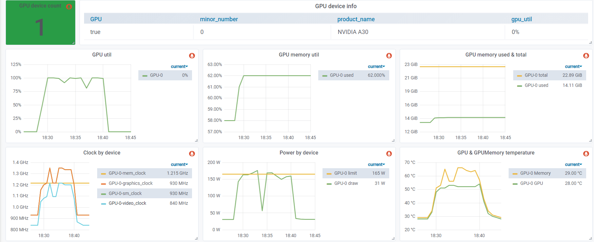
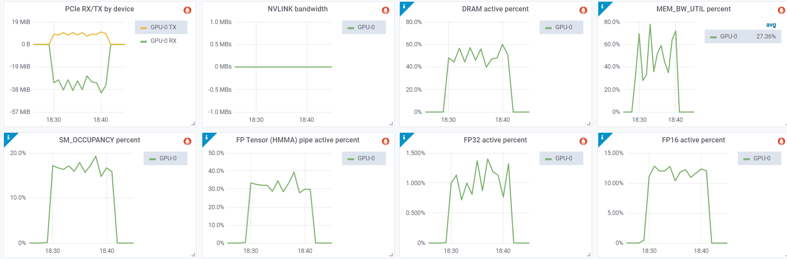
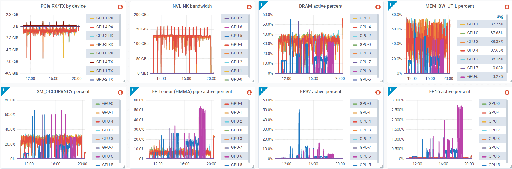

> 원 블로그 주소: https://arthurchiao.art/blog/understanding-gpu-performance/ 여기서는 이를 번역했다.
`nvidia-smi` 같은 tool이 보고하는 GPU performance metric은 오해를 불러일으킬 수 있다. 이 글은 이 문제의 본질을 깊이 살펴보며 더 깊은 이해를 제공한다.

# 1 NVIDIA `GPU util`: 혼란스러운 현상

GPU의 아주 작은 일부에서 task 하나만 실행 중이어도, `nvidia-smi` 또는 nvml 기반의 다른 tool이 보고하는 **"GPU util"** metric은 device가 완전히 점유된 것처럼 표시될 수 있다. 이는 사용자에게 꽤 혼란스럽다.

이를 더 명확히 이해하기 위해 NVIDIA developer forum의 예시(https://forums.developer.nvidia.com/t/some-questions-on-gpu-utilization/191025)를 보자.

```c++
__global__ void simple_kernel() {
    while (true) {}
}

int main() {
    simple_kernel<<<1, 1>>>();
    cudaDeviceSynchronize();
}
```

이 code는 단일 streaming multiprocessor(SM)에서 지정된 kernel(thread) 하나를 launch한다. 전통적인 이해에 따르면 GPU의 "utilization"은 **1 / SM 개수 * 100%** 로 계산되어야 한다. 예를 들어:

- GPU에 SM이 10개 있다면 "GPU utilization"은 10%여야 한다.
- GPU에 SM이 20개 있다면 "GPU utilization"은 5%여야 한다.

하지만 실제로는 아래 예시 output처럼 nvidia-smi가 **"GPU-Util"** 을 100%로 보고할 수 있다.

```shell
$ nvidia-smi
|-------------------------------+----------------------+----------------------+
| GPU  Name        Persistence-M| Bus-Id        Disp.A | Volatile Uncorr. ECC |
| Fan  Temp  Perf  Pwr:Usage/Cap|         Memory-Usage | GPU-Util  Compute M. |
|                               |                      |               MIG M. |
|===============================+======================+======================|
|   0  Tesla V100-SXM2...  Off  | 00000000:1A:00.0 Off |                    0 |
| N/A   42C    P0    67W / 300W |   2602MiB / 32510MiB |    100%      Default |
|                               |                      |                  N/A |
+-------------------------------+----------------------+----------------------+
```

문제는 어디에 있을까? 답을 찾아보자.

# 2 `GPU Util`: 오해하기 쉬운 용어?

먼저 몇 가지를 검색해 이해를 깊게 해보자.

## 2.1 공식 문서의 정의

`nvidia-smi` command-line tool은 NVIDIA Management Library(NVML)를 기반으로 하지만, 아쉽게도 이 library는 open source가 아니다. 몇 가지 설명을 찾기 위해 공식 NVML(https://developer.nvidia.com/management-library-nvml) 문서를 살펴보았다. 문서에 따르면:

> GPU utilization: GPU compute resource와 memory interface의 current utilization을 보고한다.

이 정보는 우리가 원하는 명확한 설명을 제공하지 않는다. 그래서 계속 살펴본다.

## 2.2 code 탐색

NVML library 자체는 open source가 아니지만, 몇 가지 open source language binding이 있다는 것을 발견했다. 이는 적어도 **struct와 field definition** 에 접근할 수 있음을 의미하며, 이런 내용은 보통 C/C++ header file에서 제공된다. 여기서는 NVML용 Golang binding인 gonvml project를 선택했다. 아래는 NVML header file에서 정의한 **"GPU Util"** 과 **"Memory Util"** 용어의 excerpt다.


```c++
// https://github.com/NVIDIA/go-nvml/blob/v0.12.0-1/gen/nvml/nvml.h#L210

/**
 * device의 utilization information.
 * 각 sampling period는 조회되는 product에 따라 1초에서 1/6초 사이일 수 있다.
 */
typedef struct nvmlUtilization_st {
    unsigned int gpu;                //!< 지난 sampling period 동안 하나 이상의 kernel이 GPU에서 실행된 시간 비율
    unsigned int memory;             //!< 지난 sampling period 동안 global(device) memory가 read 또는 write된 시간 비율
} nvmlUtilization_t;
```
위 주석을 통해 답을 찾았다.

## 2.3 설명

NVML의 정의에 따르면 "utilization"은 **지난 sampling period 동안 어떤 activity가 발생한 시간 비율** 을 의미한다. 구체적으로:

- **GPU utilization**: 지난 sampling period 동안 하나 이상의 kernel이 GPU에서 실행된 시간 비율을 나타낸다.
- **memory utilization**: 지난 sampling period 동안 global(device) memory가 read 또는 write된 시간 비율을 나타낸다.

다시 말해, NVML이 정의한 "utilization" 개념은 우리의 일반적인 이해와 다를 수 있다. 이는 주어진 sampling period 동안 device가 사용된 시간 비율만 측정하며, 그 기간에 streaming multiprocessor(SM)가 얼마나 많이 사용되었는지는 고려하지 않는다. 보통 우리는 "utilization"을 사용 중인 GPU processor의 비율로 이해한다.

NVIDIA가 왜 이런 비전통적인 방식으로 "utilization"을 정의했는지는 확실하지 않다. 하지만 이는 "USE"(Utilization/Saturation/Errors) methodology의 "utilization" 정의와 관련이 있을 수 있다.

## 2.4 "USE" methodology

`Systems Performance: Enterprise and the Cloud` 책에 익숙하다면 Brendan Gregg가 소개한 "USE" methodology를 기억할 수 있다. 이 methodology는 세 가지 핵심 metric인 utilization, saturation, errors에 집중한다. "USE" blog에 따르면 이 용어들의 정의는 다음과 같다.
- utilization: resource가 work를 처리하느라 바쁜 **평균 시간**[2]
- saturation: resource가 처리하지 못하는 추가 work의 정도이며, 보통 queueing된 work다.
- errors: error event count

"USE" methodology는 "utilization"에 대해 추가 설명을 제공한다.

> **또 다른 정의도 있는데**, 이때 utilization은 **resource가 사용되는 비율** 을 설명한다. 따라서 100% utilization은 더 이상 work를 받을 수 없음을 의미하며, **이는 위의 "busy" 정의와 다르다**.

종합하면 "USE" methodology에서 "utilization"은 **resource가 active하게 service하거나 work하는 시간 비율** 을 의미하며, allocated capacity는 고려하지 않는다. 후자에는 "saturation"이라는 용어를 사용한다. "USE" methodology는 resource usage evaluation에 가치 있는 insight를 제공하지만, "utilization"처럼 이미 확립된 용어를 재정의하면 혼란을 일으킬 수 있다. 많은 사람은 여전히 "utilization"을 capacity usage 또는 saturation으로 이해하는 경향이 있다.

필요하다면 **"usage frequency"** 라는 대체 용어로 "utilization"을 바꾸어, **device가 얼마나 자주 사용되는지** 를 나타낼 수 있다.

## 2.5 두 metric source: NVML / DCGM

대부분의 경우 우리가 주로 관심을 가지는 metric은 "saturation"과 관련된 metric이다. 그렇다면 이러한 GPU metric은 어디서 찾을 수 있을까?

GPU performance metric을 수집하는 인기 있는 방법은 두 가지가 있다.

- `nvidia-smi` 같은 command-line tool을 사용하면 pretty-print 및 **xml** format과 비슷한 data를 output할 수 있다.
    - 이 tool 내부는 NVML(NVIDIA Management Library)을 기반으로 한다.
    - GPU와 memory의 "utilization"(usage frequency), device temperature, power consumption 같은 high-level metric을 수집한다.

- **dcgm-exporter** 같은 service를 사용하면 Prometheus format으로 data를 output할 수 있다.
    - 이 service는 DCGM(Data Center GPU Manager)을 기반으로 한다.
    - high-level metric 외에도 profiling을 수행하고 GPU device에 대한 상세한 **saturation data** 를 수집할 수 있다.

아래는 `nvidia-smi`와 `dcgm-exporter`에서 수집한 metric을 보여주는 두 dashboard다.





GPU utilization이 100%라는 점에 주목하자. 아래는 `dcgm-exporter`에서 수집한 metric이다.




SM occupancy는 매우 낮고(`<20%`), floating point operation(FP32/FP16/TensorCore)도 매우 낮은 percentage에 머물러 있다. 이는 GPU가 saturated되지 않았음을 나타낸다.

# 3 결론과 일반적인 제안

## 3.1 "utilization" vs. saturation

NVML designer가 의도적으로 위의 "USE" methodology를 채택했는지는 알 수 없지만, 그 "utilization"(GPU와 memory utilization 포함) 정의는 "USE" standard와 일치하는 듯하다. 보고되는 "utilization"은 단지 device가 사용된 frequency, 즉 시간 percentage를 나타낼 뿐이며, 사용된 capacity는 고려하지 않는다.

## 3.2 일반적인 제안: saturation metric을 우선 고려하라

`nvidia-smi`는 흔히 쓰이고 편리한 tool이지만, performance measurement에 가장 좋은 선택은 아니다. 실제 deployment된 GPU application에는 `dcgm-exporter`가 제공하는 metric 같은 DCGM 기반 metric을 사용하는 것을 권장한다.

또한 saturation metric에 주목하는 것이 유익하다. 여기에는 FP64/FP32/FP16 activation, tensor core activation percentage, NVLINK bandwidth, GPU memory bandwidth percentage 등이 포함된다.



