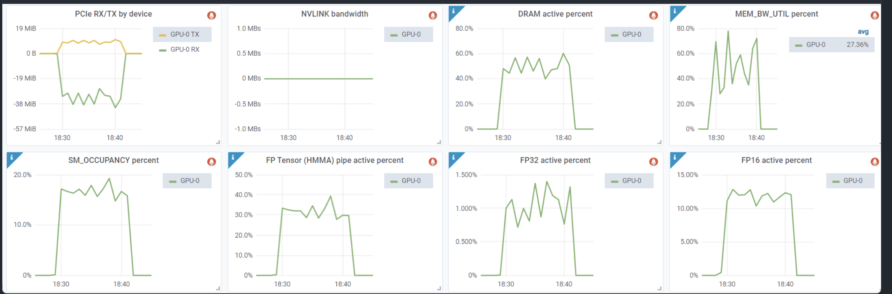

# ml-engineering 번역 시리즈 - GPU debug

## 0x0. 서문

이 문서의 출처는 https://github.com/stas00/ml-engineering 이다. 이 문서는 NVIDIA GPU troubleshooting을 위한 실용 guide이며, 주로 다음 핵심 내용을 담고 있다.

1. Xid error 식별과 처리: system log를 통해 Xid error를 식별하는 방법과, `nvidia-smi` command를 사용해 error count와 구체적 상황을 확인하는 방법을 자세히 설명한다.
2. ECC error 처리: single-bit(SBE)와 double-bit(DBE) ECC error의 차이, 그리고 `nvidia-smi -q` command로 이런 error를 점검하고 처리하는 방법을 소개한다.
3. GPU diagnostic tool 사용: DCGM tool로 GPU diagnostic을 수행하는 방법을 자세히 소개한다. 서로 다른 level(`-r 2/3/4`)의 diagnostic 방법과 각 적용 시나리오를 포함한다.
4. hardware 정보 조회: VBIOS 정보 획득, PCIe bandwidth 점검, NVLink 연결 상태 검증 등 실용 command를 포함한다.
5. GPU utilization monitoring: `nvidia-smi`에 표시되는 가짜 GPU utilization에만 의존하지 않고, `dcgm-exporter`를 통해 실제 GPU utilization metric을 얻는 방법을 소개한다.

이 내용은 대규모 머신러닝 학습을 수행하는 engineer에게 특히 유용하다. GPU cluster를 더 잘 monitoring하고 유지보수하며, hardware 문제를 제때 발견하고 해결하는 데 도움을 줄 수 있다. 문서가 제공하는 command와 tool은 모두 매우 실용적이며, GPU 운영의 중요한 참고 자료로 사용할 수 있다. 전체적으로 매우 실용적인 자료이므로 독자에게 추천한다. 아래는 전문이다.

## NVIDIA GPU troubleshooting

### 용어표

- DBE: double-bit ECC error
- DCGM: NVIDIA Data Center GPU Manager
- ECC: error correction code
- FB: frame buffer
- SBE: single-bit ECC error
- SDC: silent data corruption

### Xid error

완벽한 hardware는 없다. 제조 문제나 마모, 특히 고온 환경에 노출되는 이유로 GPU는 다양한 hardware 문제를 만날 가능성이 있다. 이런 문제 중 상당수는 자동으로 correction되며, 실제로 무슨 일이 일어났는지 알 필요가 없다. application이 계속 실행된다면 보통 걱정할 필요가 없다. 하지만 hardware 문제로 application이 crash된다면 원인을 이해하고 그에 맞는 조치를 취하는 것이 중요하다.

소수의 GPU만 사용하는 일반 사용자라면 GPU 관련 hardware 문제를 영원히 알 필요가 없을 수도 있다. 하지만 대규모 머신러닝 학습을 수행한다면 수백 개에서 수천 개 GPU를 사용할 수 있으므로, 여러 hardware 문제를 이해하고 싶어질 것이다.

system log에서 가끔 다음과 같은 Xid error를 볼 수 있다.

```
NVRM: Xid (PCI:0000:10:1c): 63, pid=1896, Row Remapper: New row marked for remapping, reset gpu to activate.
```
이 log는 다음 중 하나로 얻을 수 있다.
```
sudo grep Xid /var/log/syslog
sudo dmesg -T | grep Xid
```

일반적으로 학습이 crash되지 않는 한, 이런 error는 hardware가 자동으로 correction할 수 있는 문제를 나타내는 경우가 많다.

전체 Xid error 목록과 설명은 여기(https://docs.nvidia.com/deploy/xid-errors/index.html)에서 찾을 수 있다.

`nvidia-smi -q`를 실행해 error count가 보고되었는지 확인할 수 있다. 예를 들어 Xid 63의 경우 다음과 비슷한 내용을 볼 수 있다.

```
Timestamp                                 : Wed Jun  7 19:32:16 2023
Driver Version                            : 510.73.08
CUDA Version                              : 11.6

Attached GPUs                             : 8
GPU 00000000:10:1C.0
    Product Name                          : NVIDIA A100-SXM4-80GB
    [...]
    ECC Errors
        Volatile
            SRAM Correctable              : 0
            SRAM Uncorrectable            : 0
            DRAM Correctable              : 177
            DRAM Uncorrectable            : 0
        Aggregate
            SRAM Correctable              : 0
            SRAM Uncorrectable            : 0
            DRAM Correctable              : 177
            DRAM Uncorrectable            : 0
    Retired Pages
        Single Bit ECC                    : N/A
        Double Bit ECC                    : N/A
        Pending Page Blacklist            : N/A
    Remapped Rows
        Correctable Error                 : 1
        Uncorrectable Error               : 0
        Pending                           : Yes
        Remapping Failure Occurred        : No
        Bank Remap Availability Histogram
            Max                           : 639 bank(s)
            High                          : 1 bank(s)
            Partial                       : 0 bank(s)
            Low                           : 0 bank(s)
            None                          : 0 bank(s)
[...]
```

여기서 Xid 63은 다음에 대응한다는 것을 볼 수 있다.

```
ECC page retirement or row remapping recording event
```

가능한 원인은 3가지다. hardware error / driver error / frame buffer(FB) corruption.

이 error는 memory row 하나에 fault가 발생했으며, reboot 및/또는 GPU reset 시 A100 기준 640개의 예비 memory row 중 하나를 사용해 fault row를 대체한다는 뜻이다. 따라서 위 report에서 남은 bank가 639개(총 640개)임을 볼 수 있다.

`ECC Errors` report의 Volatile 부분은 마지막 reboot/GPU reset 이후 기록된 error를 뜻한다. Aggregate 부분은 GPU가 처음 사용된 이후의 같은 error를 기록한다.

이제 error에는 두 종류가 있다. correctable과 uncorrectable이다. correctable은 single-bit ECC error(SBE)이며, memory에 fault가 있어도 driver가 올바른 값을 복구할 수 있다. uncorrectable은 두 개 이상의 bit에 fault가 생긴 경우이며 double-bit ECC error(DBE)라고 부른다. 일반적으로 같은 memory address에서 DBE error 1회 또는 SBE error 2회가 발생하면 driver는 전체 memory page를 retire한다. 전체 정보는 이 문서(https://docs.nvidia.com/deploy/dynamic-page-retirement/index.html)를 참고하라.

correctable error는 application에 영향을 주지 않는다. uncorrectable error는 application crash를 유발한다. uncorrectable ECC error가 포함된 memory page는 blacklist에 올라가며, GPU reset 전에는 접근할 수 없다.

retire 예정인 page가 있다면 `nvidia-smi -q` output에서 다음과 비슷한 내용을 볼 수 있다.

```
    Retired pages
        Single Bit ECC             : 2
        Double Bit ECC             : 0
        Pending Page Blacklist    : Yes
```

각 retire된 page는 application이 사용할 수 있는 총 memory를 줄인다. 하지만 retire page의 최대 수는 총 4MB뿐이므로 사용 가능한 전체 GPU memory를 크게 줄이지 않는다.

GPU debug를 더 깊이 이해하려면 이 문서(https://docs.nvidia.com/deploy/gpu-debug-guidelines/index.html)를 참고하라. 언제 GPU RMA가 필요한지 판단하는 데 도움이 되는 유용한 classification chart가 들어 있다. 이 문서에는 Xid 63과 비슷한 error에 대한 추가 정보도 포함되어 있다.

예를 들어 다음과 같이 안내한다.

> XID 94와 연관되어 있다면 application은 error를 만났으며 restart가 필요하다. 다른 모든 system의 application은 row remapping을 활성화하기 위한 적절한 reboot 시점까지 계속 실행될 수 있다.
> row remapping failure를 기준으로 언제 GPU RMA가 필요한지 판단하려면 아래 지침을 참고하라.

reboot 후에도 같은 조건이 다시 나타나면 memory remapping이 실패했다는 뜻이며, Xid 64가 다시 발생한다. 이것이 계속되면 자동으로 복구할 수 없는 hardware 문제가 있다는 뜻이고 GPU RMA가 필요하다.

때때로 Xid 63 또는 64 error가 발생하면서 application이 crash될 수 있다. 보통 추가 Xid error도 함께 발생하지만, 대부분의 경우 이 error가 uncorrectable, 즉 DBE type error였고 이후 Xid 48이 되었다는 뜻이다.

앞에서 말했듯이 GPU를 reset하려면 machine을 reboot하거나 다음을 실행하면 된다.

```
nvidia-smi -r -i gpu_id
```
여기서 `gpu_id`는 reset하려는 GPU의 serial number이다. 예를 들어 첫 번째 GPU는 `0`이다. `-i` parameter를 사용하지 않으면 모든 GPU가 reset된다.

#### uncorrectable ECC error를 만났을 때

다음 error를 만났다면:
```
CUDA error: uncorrectable ECC error encountered
```

이전 section과 마찬가지로 이번에도 `nvidia-smi -q` output에서 `ECC Errors` 항목을 확인하면 어떤 GPU가 문제인지 알 수 있다. 하지만 node에 이 문제가 있는 GPU가 하나라도 있을 때 빠르게 회수하기 위해 quick check가 필요하다면 다음처럼 할 수 있다.

```
$ nvidia-smi -q | grep -i correctable | grep -v 0
            SRAM Uncorrectable            : 1
            SRAM Uncorrectable            : 5
```

정상 node에서는 모든 counter가 0이어야 하므로 빈 값이 반환되어야 한다. 위 예에서는 손상된 GPU가 있다. 전체 기록은 다음과 같기 때문이다.

```
    ECC Errors
        Volatile
            SRAM Correctable              : 0
            SRAM Uncorrectable            : 1
            DRAM Correctable              : 0
            DRAM Uncorrectable            : 0
        Aggregate
            SRAM Correctable              : 0
            SRAM Uncorrectable            : 5
            DRAM Correctable              : 0
            DRAM Uncorrectable            : 0
```

여기서 첫 번째 항목은 `Volatile`이다. GPU driver reload 이후부터 error counter가 count된다. 두 번째는 `Aggregate`이며 전체 lifetime의 error counter이다. 이 예에서는 Volatile SRAM Uncorrectable error count가 1이고 Aggregate가 5다. 이 error가 처음 나타난 것이 아니라는 뜻이다.

이것은 보통 Xid 94 error라는 의미지만, 일반적으로 Xid 48 error는 없다.

이 문제를 해결하려면 이 GPU를 reset하면 된다.

```shell
nvidia-smi -r -i gpu_id
```

machine reboot도 같은 효과를 낸다.

이제 누적 SRAM uncorrectable error가 4개를 넘으면, 일반적으로 해당 GPU를 RMA해야 할 이유가 된다.

### diagnostic 실행

특정 node의 NVIDIA GPU 하나 이상에 fault가 있다고 의심된다면, `dcgmi`는 fault GPU를 빠르게 찾아내는 좋은 도구다.

NVIDIA Data Center GPU Manager(DCGM) 문서는 여기(https://docs.nvidia.com/datacenter/dcgm/latest/user-guide/index.html)에 있으며, 여기(https://github.com/NVIDIA/DCGM#quickstart)에서 download할 수 있다.

아래는 매우 깊은 diagnostic(`-r 3`)을 실행하는 slurm script 예시다. 8-GPU node 하나에서 완료하는 데 약 10분이 걸린다.

```
$ cat dcgmi-1n.slurm
#!/bin/bash
#SBATCH --job-name=dcgmi-1n
#SBATCH --nodes=1
#SBATCH --ntasks-per-node=1
#SBATCH --cpus-per-task=96
#SBATCH --gres=gpu:8
#SBATCH --exclusive
#SBATCH --output=%x-%j.out

set -x -e
echo "START TIME: $(date)"
srun --output=%x-%j-%N.out dcgmi diag -r 3
echo "END TIME: $(date)"
```

이제 특정 node에서 실행한다.

```
sbatch --nodelist=node-115 dcgmi-1n.slurm
sbatch --nodelist=node-151 dcgmi-1n.slurm
sbatch --nodelist=node-170 dcgmi-1n.slurm
```

nodelist parameter를 실행하려는 node name으로 수정한다.

node가 excluded 또는 down 상태라면 해당 node에서 command line을 직접 실행할 수 있다.

```
dcgmi diag -r 3
```

diagnostic이 문제를 찾지 못했지만 application이 여전히 제대로 동작하지 않는다면, level 4로 diagnostic을 다시 실행하라. 시간이 더 오래 걸리며 약 1시간이 필요하다.

```
dcgmi diag -r 4
```

참고: silent data corruption(SDC)은 명백히 `dcgmi diag -r 4`로만 detection할 수 있으며, 그마저도 일부를 놓칠 수 있다. 이 문제는 가끔 발생하고, GPU가 때때로 `matmul`을 망가뜨린다는 사실을 알지 못할 수도 있다. 나는 우리가 이런 상황을 겪은 적이 있다고 꽤 확신한다. 학습 중 이상한 failure를 만났고, NVIDIA team과 함께 여러 날 동안 문제를 진단했지만 우리 모두 원인을 찾지 못했다. 결국 문제는 사라졌는데, 아마도 문제가 있는 GPU가 보고된 failure 때문에 교체되었기 때문일 것이다.

예를 들어 반복적인 Xid 64 error를 만난다면 diagnostic report에 다음이 포함될 수 있다.

```
+---------------------------+------------------------------------------------+
| Diagnostic                | Result                                         |
+===========================+================================================+
|-----  Deployment  --------+------------------------------------------------|
| Error                     | GPU 3 has uncorrectable memory errors and row  |
|                           |  remappings are pending                        |
```

따라서 remapping이 실패했다면 이제 그 문제 GPU를 RMA해야 한다는 것을 알 수 있다.

하지만 실제로는 대부분의 경우 `-r 2`만으로도 fault GPU를 detect할 수 있다는 것을 발견했다. 그리고 완료하는 데 몇 분밖에 걸리지 않는다. 아래는 fault node에서 `-r 2` output의 한 예다.

```
| GPU Memory                | Pass - GPUs: 1, 2, 3, 4, 5, 6, 7               |
|                           | Fail - GPU: 0                                  |
| Warning                   | GPU 0 Thermal violations totaling 13.3 second  |
|                           | s started at 9.7 seconds into the test for GP  |
|                           | U 0 Verify that the cooling on this machine i  |
|                           | s functional, including external, thermal mat  |
|                           | erial interface, fans, and any other componen  |
|                           | ts.
```

`dcgmi` tool에는 여러 다른 diagnostic level이 포함되어 있다. 그중 일부는 몇 분 안에 완료되므로 SLURM job epilogue로 빠른 diagnostic을 수행하는 데 사용할 수 있다. 다음 SLURM job이 실행 준비가 되었는지 확인하고, 사용자가 job을 시작한 뒤 crash되고 나서야 발견하는 일을 피할 수 있다.

RMA report를 제출할 때는 `nvidia-bug-report` script를 실행하라는 요청을 받으며, 그 output을 RMA request와 함께 제출해야 한다.

나는 보통 나중을 위해 log도 저장한다. 다음 중 하나를 사용한다.

```
dcgmi diag -r 2 | tee -a dcgmi-r2-`hostname`.txt
dcgmi diag -r 3 | tee -a dcgmi-r3-`hostname`.txt
dcgmi diag -r 4 | tee -a dcgmi-r4-`hostname`.txt
```

### VBIOS 정보를 얻는 방법

문제를 조사할 때 GPU VBIOS version이 중요할 수 있다. query에 name과 bus ID를 추가하면 다음을 얻는다.

```
$ nvidia-smi --query-gpu=gpu_name,gpu_bus_id,vbios_version --format=csv
name, pci.bus_id, vbios_version
NVIDIA H100 80GB HBM3, 00000000:04:00.0, 96.00.89.00.01
[...]
NVIDIA H100 80GB HBM3, 00000000:8B:00.0, 96.00.89.00.01
```

tip: 다른 많은 내용을 query하려면 다음을 실행하라.

```
nvidia-smi --help-query-gpu
```

### GPU의 PCIe generation이 지원되는지 확인하는 방법

system startup message에서 PCIe bandwidth report를 확인한다.

```
$ sudo dmesg | grep -i 'limited by'
[   10.735323] pci 0000:04:00.0: 252.048 Gb/s available PCIe bandwidth, limited by 16.0 GT/s PCIe x16 link at 0000:01:00.0 (capable of 504.112 Gb/s with 32.0 GT/s PCIe x16 link)
[...]
[   13.301989] pci 0000:8b:00.0: 252.048 Gb/s available PCIe bandwidth, limited by 16.0 GT/s PCIe x16 link at 0000:87:00.0 (capable of 504.112 Gb/s with 32.0 GT/s PCIe x16 link)
```

이 예에서는 PCIe 5 specification이 504Gbps이므로, 이 node에서 사용 가능한 bandwidth가 절반뿐임을 볼 수 있다. PCIe switch가 gen4이기 때문이다. PCIe specification은 여기(https://github.com/BBuf/ml-engineering/tree/master/network#pcie)를 참고하라.

대부분의 경우 GPU와 GPU를 연결하는 NVLink(https://github.com/BBuf/ml-engineering/tree/master/network#nvlink)가 있으므로 GPU 사이 communication에는 영향을 주지 않는다. 하지만 host와의 data transfer는 느려진다. data speed가 가장 느린 link(504Gbps)에 의해 제한되기 때문이다.

### NVLink link의 error counter를 확인하는 방법

NVLink에 어떤 우려가 있다면 error counter를 확인할 수 있다.

```
$ nvidia-smi nvlink -e
GPU 0: NVIDIA H100 80GB HBM3 (UUID: GPU-abcdefab-cdef-abdc-abcd-abababababab)
         Link 0: Replay Errors: 0
         Link 0: Recovery Errors: 0
         Link 0: CRC Errors: 0

         Link 1: Replay Errors: 0
         Link 1: Recovery Errors: 0
         Link 1: CRC Errors: 0

         [...]

         Link 17: Replay Errors: 0
         Link 17: Recovery Errors: 0
         Link 17: CRC Errors: 0
```

또 다른 유용한 command는 다음이다.

```
$ nvidia-smi nvlink --status
GPU 0: NVIDIA H100 80GB HBM3 (UUID: GPU-abcdefab-cdef-abdc-abcd-abababababab)
         Link 0: 26.562 GB/s
         [...]
         Link 17: 26.562 GB/s
```

이 command는 각 link의 현재 speed를 알려준다.

더 많은 기능(report, counter reset 등)을 찾으려면 `nvidia-smi nvlink -h`를 실행하라.

### node에 GPU가 빠져 있는지 확인하는 방법

새 VM을 받았을 때 가끔 예상보다 적은 수의 GPU를 받을 수 있다. GPU 8개가 있는지 빠르게 테스트하는 방법은 다음과 같다.

```
cat << 'EOT' >> test-gpu-count.sh
#!/bin/bash

set -e

# node에 8개 gpu가 있는지 테스트한다.
test $(nvidia-smi -q | grep UUID | wc -l) != 8 && echo "broken node: less than 8 gpus" && false
EOT
```

그런 다음:

```
bash test-gpu-count.sh
```


### 같은 fault node를 반복해서 받는지 detection하는 방법

이 내용은 주로 GPU node를 임대하는 cloud 사용자와 관련이 있다.

새 VM을 시작했는데 하나 이상의 NVIDIA GPU가 손상되어 있음을 발견했다. 이를 버리고 새 VM을 시작했지만 GPU가 또 fault 상태다.

같은 node와 같은 fault GPU를 받은 것일 가능성이 높다. 이를 알 수 있는 방법은 다음과 같다.

현재 node를 버리기 전에 다음을 실행하고 기록하라.

```
$ nvidia-smi -q | grep UUID
    GPU UUID                              : GPU-2b416d09-4537-ecc1-54fd-c6c83a764be9
    GPU UUID                              : GPU-0309d0d1-8620-43a3-83d2-95074e75ec9e
    GPU UUID                              : GPU-4fa60d47-b408-6119-cf63-a1f12c6f7673
    GPU UUID                              : GPU-fc069a82-26d4-4b9b-d826-018bc040c5a2
    GPU UUID                              : GPU-187e8e75-34d1-f8c7-1708-4feb35482ae0
    GPU UUID                              : GPU-43bfd251-aad8-6e5e-ee31-308e4292bef3
    GPU UUID                              : GPU-213fa750-652a-6cf6-5295-26b38cb139fb
    GPU UUID                              : GPU-52c408aa-3982-baa3-f83d-27d047dd7653
```

이 UUID는 각 GPU의 unique identifier이다.

VM을 다시 만들 때 이 command를 실행하라. UUID가 같다면 같은 손상 GPU를 가지고 있다는 것을 알 수 있다.

이 과정을 자동화해 항상 이 data를 갖고 있으려면 startup process의 어딘가에 다음을 추가해야 한다.

```
nvidia-smi -q | grep UUID > nvidia-uuids.$(hostname).$(date '+%Y-%m-%d-%H:%M').txt
```

reboot 후에도 보존되도록 log file을 persistent file system 어딘가에 저장하고 싶을 수 있다. 그런 file system이 없다면 local에 저장한 뒤 즉시 cloud로 copy할 수 있다. 그러면 필요할 때 항상 사용할 수 있다.

때로는 node를 reboot하기만 해도 새 hardware를 얻을 수 있다. 어떤 경우에는 거의 매번 reboot할 때 새 hardware를 얻고, 다른 경우에는 그런 일이 일어나지 않는다. 이 동작은 provider마다 다를 수 있다.

같은 fault node를 계속 받는다면, 이를 극복하는 한 가지 technique은 fault VM을 계속 실행한 상태로 새 VM을 할당하고, 새 VM이 시작된 뒤 fault VM을 버리는 것이다. 그러면 확실히 새 GPU를 얻게 된다. 하지만 그 GPU도 fault가 없다는 보장은 없다. use case에 맞다면 static cluster를 만드는 것을 고려할 수 있다. 거기서는 좋은 hardware를 유지하기가 더 쉽다.

이 방법은 GPU가 즉시 fault를 일으키는 것이 아니라 일정 시간 사용 후 fault를 일으킬 때 특히 중요하다. 그러면 문제 발견이 쉽지 않다. 이 node를 cloud provider에 report하더라도 technician이 문제를 즉시 알아차리지 못하고 fault node를 다시 사용 상태로 넣을 수 있다. 따라서 static cluster를 사용하지 않고 필요할 때 random VM을 얻는 방식이라면, fault UUID를 기록해 fault node를 받았다는 사실을 즉시 알 수 있게 해야 한다. node를 10시간 사용한 뒤에야 알아차리는 일을 피하기 위해서다.

cloud provider에는 보통 fault node를 report하는 mechanism이 있다. 따라서 fault node를 버리는 것 외에도 report하는 것은 자신과 다른 사용자 모두에게 도움이 된다. 대부분의 사용자는 fault node를 그냥 버리므로 다음 사용자가 그것을 받게 된다. 나는 어떤 경우 사용자들이 매우 높은 비율의 fault node를 받는 것을 본 적이 있다.

### 실제 GPU 사용량을 얻는 방법

GPU의 실제 사용량을 얻기 위해 `nvidia-smi` output의 `Volatile GPU-Util` column을 사용해볼 수 있다.

측정하고 싶은 것은 GPU가 available capacity를 얼마나 활용하는지, 즉 saturation이다. 아쉽게도 이 정보는 nvidia-smi가 제공하지 않는다. 이 정보를 얻으려면 dcgm-exporter(https://github.com/NVIDIA/dcgm-exporter)를 설치해야 하며, 여기에는 더 새로운 Golang과 DCGM(datacenter-gpu-manager), 그리고 root 권한이 필요하다.

이 tool은 high-end data center용 NVIDIA GPU에만 적용된다는 점에 유의하라. 따라서 consumer GPU를 사용한다면 사용할 수 없다.

관련 dependency를 설치한 뒤 나는 이 tool을 build했다.

```
git clone https://github.com/NVIDIA/dcgm-exporter.git
cd dcgm-exporter
make binary
```

그런 다음 이 dcgm-exporter config file을 사용해 글에서 설명한 "real" utilization metric을 얻을 수 있었다.

```
$ cat << EOT > dcp-metrics-custom.csv
DCGM_FI_PROF_SM_OCCUPANCY,       gauge, The ratio of number of warps resident on an SM.
DCGM_FI_PROF_PIPE_TENSOR_ACTIVE, gauge, Ratio of cycles the tensor (HMMA) pipe is active.
DCGM_FI_PROF_PIPE_FP16_ACTIVE,   gauge, Ratio of cycles the fp16 pipes are active.
DCGM_FI_PROF_PIPE_FP32_ACTIVE,   gauge, Ratio of cycles the fp32 pipes are active.
EOT
```

그런 다음 daemon을 시작했다. root가 필요하다.

```
$ sudo cmd/dcgm-exporter/dcgm-exporter -c 500 -f dcp-metrics-custom.csv
[...]
INFO[0000] Starting webserver
INFO[0000] Listening on                                  address="[::]:9400"
```
`-c 500`은 0.5초마다 refresh한다.

이제 다음 command로 poll할 수 있다.

```
watch -n 0.5 "curl http://localhost:9400/metrics"
```

한 console에서 이것을 실행하고 다른 console에서 GPU workload를 시작한다. output의 마지막 column은 이 metric들의 utilization이며, 여기서 `1.0 == 100%`이다.

repository의 `etc/dcp-metrics-included.csv`에는 사용 가능한 모든 metric이 들어 있으므로 더 많은 metric을 추가할 수 있다.

이것은 빠른 방법이지만, 목적은 Prometheus(https://prometheus.io/)를 사용하는 것이다. Prometheus는 보기 좋은 chart를 제공한다. 예를 들어 글에는 chart의 두 번째 row에서 SM occupancy, Tensor core, FP16, FP32 Core utilization을 볼 수 있는 예시가 포함되어 있다.



(출처(https://arthurchiao.art/blog/understanding-gpu-performance/))

완전성을 위해 같은 글의 예시를 하나 더 든다. CUDA kernel 하나가 실제로 아무 계산도 하지 않고 단 하나의 streaming multiprocessor(SM)만 점유하는데도 100% GPU utilization이 표시되는 사례다.
```
$ cat << EOT > 1_sm_kernel.cu
__global__ void simple_kernel() {
    while (true) {}
}

int main() {
    simple_kernel<<<1, 1>>>();
    cudaDeviceSynchronize();
}
EOT
```

compile한다.

```
nvcc 1_sm_kernel.cu -o 1_sm_kernel
```

window A에서 실행한다.

```
$ ./1_sm_kernel
```
window B에서:

```
$ nvidia-smi
Tue Oct  8 09:49:34 2024
+-----------------------------------------------------------------------------------------+
| NVIDIA-SMI 550.90.12              Driver Version: 550.90.12      CUDA Version: 12.4     |
|-----------------------------------------+------------------------+----------------------|
| GPU  Name                 Persistence-M | Bus-Id          Disp.A | Volatile Uncorr. ECC |
| Fan  Temp   Perf          Pwr:Usage/Cap |           Memory-Usage | GPU-Util  Compute M. |
|                                         |                        |               MIG M. |
|=========================================+========================+======================|
|   0  NVIDIA A100 80GB PCIe          Off |   00000000:01:00.0 Off |                    0 |
| N/A   32C    P0             69W /  300W |     437MiB /  81920MiB |    100%      Default |
|                                         |                        |             Disabled |
```

100% GPU utilization을 볼 수 있다. 여기서는 SM 1개를 사용했지만 A100-80GB PCIe에는 SM이 132개 있다. 게다가 실제 계산조차 하지 않고, 아무것도 하지 않는 infinite loop를 실행할 뿐이다.
