# CUDA 입문의 올바른 자세: how-to-optimize-gemm

> 원문: https://zhuanlan.zhihu.com/p/478846788

**목차**
- 0xFF FAQ
- 0x00 몇 가지 단상
- 0x01 본론
- 0x02 첫 번째 버전: MMult_cuda_2
- 0x03 MMult_cuda_3
- 0x04 MMult_cuda_4와 MMult_cuda_5
- 0x05 MMult_cuda_8 전의 몇 가지 추측
- 0x06 MMult_cuda_9
- 0x07 MMult_cuda_10
- 0x08 MMult_cuda_11
- 0x09 MMult_cuda_12
- 0x0a 끝맺으며
- 0x0b 감사의 글

## 0xFF FAQ

- matmul 두 입력의 shape는 각각 `[m, k]`, `[k, n]`
- 왜 height/width로 표현하지 않을까?
- 음성/물리 계산에도 matmul을 쓰는데, 반드시 이미지의 height 개념이 있는 건 아님
- 역사적인 흔적이며, OpenBLAS와 논문이 이런 식으로 m·n·k 의미를 정해 놓았음
- 이미 사실상의 표준이라, 회사가 달라도 dev들이 `split_k`라고 하면 가운데 차원을 가리킴
- 왜 인덱스 계산에 32가 그렇게 자주 등장할까?
- CUDA의 **사고 단위**는 **warp**이고, 한 warp는 32 thread임
- 그러니까 **사고 단위에 주의**할 것
- 비유하자면... 임원의 사고 단위는 하나의 BU이고, 백 명 단위로만 보지 개별 개발자에 집중하지는 않는 것과 같음

## 0x00 몇 가지 단상

이 글은 직접 겪은 CUDA 입문 여정의 기록입니다. 출발점은 C++과 컴퓨터 구조를 조금 아는 초보, 종착점은 숙련된 커널 개발자 수준의 구현입니다.

본론에 들어가기 전에 “평범한 중년이 어떻게 (기술/비기술 측면에서) 꾸준히 성장할 수 있는가”에 대해 잠깐 얘기하고 싶은데, 핵심은 **장기 계획을 세우지 않는 것**입니다.

`chgemm`을 작성한 후로 GPU kernel도 한번 만들어 보고 싶었습니다. 평소엔 kernel을 쓰지 않고 옆에서 가르쳐 줄 사람도 없는 상태였습니다. 첫 고민은 "이 짧은 여가 시간으로 Vulkan/GLSL을 배우는 게 좋을까, CUDA를 배우는 게 좋을까?"였습니다.


아니, GAMES의 유혹에 더 빠지면 안 됩니다. 그래픽스 전공이 아니니 집중해야죠. 그래서 Vulkan API 튜토리얼을 보기 시작했고... 지금까지도 1500줄로 그 삼각형 하나 그리지 못했습니다. 대신 z-buffer로 C에서 맨손으로 그리는 법은 알게 됐죠...

**장기 계획을 세우지 말라**고 한 이유는 다음과 같습니다.

- 업무 외 시간은 한정적이고, 반년이나 되는 계획을 지탱할 수 없습니다. 프로젝트 기간이 너무 길면 반드시 실패합니다
- “장기 목표”라 정해 두면 “내일 하지 뭐”라는 심리적 면죄부를 갖기 쉽습니다
- 아시잖아요, 나이가 들수록 할 일도 많아집니다. 내일 또 내일, 인생에 내일이 몇 번이나 있을까요?

그래서 개인 성장 항목은 **6~8주 단위 단기 목표**가 최적입니다. 하나만, 단 하나만 진행 중일 것. 나머지는 모두 잡념입니다.

## 0x01 본론

이 튜토리얼은 [tpoisonooo/how-to-optimize-gemm](https://github.com/tpoisonooo/how-to-optimize-gemm/tree/master/cuda) 의 주석본입니다. 신참 시점에서 CUDA FP32 GEMM을 어떻게 최적화하는지 설명합니다.

- 두꺼운 CUDA 공식 문서를 씹어삼키기 전에, 일단 **돌려보세요**
- 자신이 짠 코드와 컨닝페이퍼 구현 사이의 차이를 봅니다
- 새로운 지식을 만날 때마다 공부하고, 문서의 해당 절을 깊이 파헤칩니다
- CPU SIMD의 "고정관념"과 차이가 있는 부분을 만나면 곱씹어 봅니다
- 새 버전을 작성하고, 반복합니다

독자가 이미 다음을 알고 있다고 가정합니다.

- 白牛: [OpenBLAS gemm from scratch 입문](https://example.com) — 블로킹을 다시 설명할 필요가 없도록
- `tpoisonooo/how-to-optimize-gemm`을 어떻게 빌드·실행하는지 — 가는 김에 ⭐도 한 번 눌러 주세요

먼저 최종 결과부터 봅시다. 첫 버전 / 최신 버전 / cuBLAS의 비교:

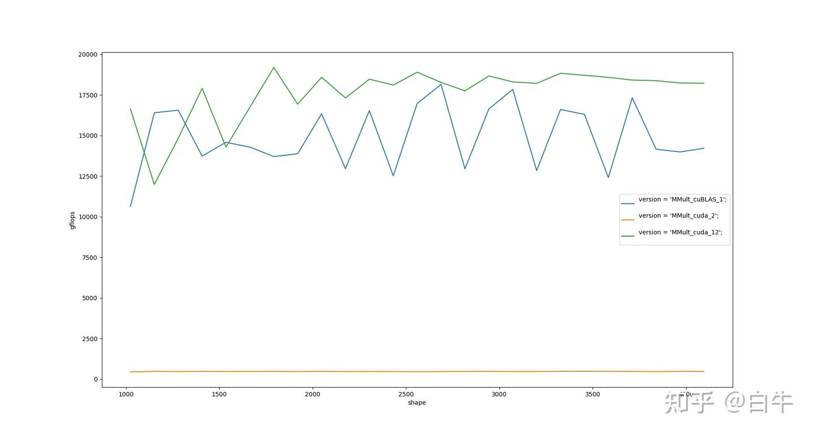
*주황: 최초 버전 / 파랑: cuBLAS / 초록: 최신*

환경:

| 항목 | 값 |
| --- | --- |
| 하드웨어 | NVIDIA GeForce RTX 3080 |
| 가로축 | M·N·K 크기 (편의상 M = N = K) |
| 세로축 | GFLOPS |
| dram_bandwidth | read 661 GB/s, write 674 GB/s, copy 640 GB/s |
| dram_latency | 473 cycle |
| l2cache_bandwidth | 2145 GB/s |
| l2cache_latency | 241 cycle |
| l1cache_latency | 33 cycle |
| smem_latency | 23 cycle |

컨닝페이퍼만 잘 쓰면 결국 cuBLAS도 넘어설 수 있다는 걸 볼 수 있습니다.

핵심 컨닝페이퍼:

- MegEngine Bot: [CUDA 행렬 곱 궁극 최적화 가이드](https://example.com) — 소스코드는 없고, 앞 8개 버전은 모두 이 글의 텍스트만 보고 추측해서 작성했습니다
- 李少侠: [\[공사 중\] CUDA GEMM 이론 성능 분석과 kernel 최적화](https://example.com) — 少侠의 글은 깊이가 있어서 후반 사고 정리용으로 적합합니다
- MegEngine Bot: [MegEngine TensorCore 합성곱 연산자 구현 원리](https://example.com) — 확장 독해용

## 0x02 첫 번째 버전: MMult_cuda_2

MegEngine Bot의 *CUDA 행렬 곱 궁극 최적화 가이드*가 제공하는 naive 버전:

```cuda
template <int BLOCK>
__global__ void sgemm(int m, int n, int k, float *a, int lda, float *b, int ldb,
                      float *c, int ldc) {
  int _m = blockIdx.x * BLOCK + threadIdx.x;
  int _n = blockIdx.y * BLOCK + threadIdx.y;
  if (_m < m and _n < n) {
    float sum = 0.f;
    for (int i = 0; i < k; ++i) {
      sum += a[_m * k + i] * b[i * n + _n];
    }
    c[_m * n + _n] = sum;
  }
}
```

신참의 첫 번째 의문: `threadIdx.xyz`는 헷갈립니다. 특히 `Idx`에도 `x`가 있고 `xyz`에도 `x`가 있으니까요... `threadId`라고 부르면 안 됐던 걸까요?

`xyz`는 그저 소프트웨어 추상이고, 본의는 사용자가 편하게 쓰라고 만든 것입니다. **`chw/hwc` 같은 layout 개념과는 아무 관련이 없습니다**(이미지 코드를 많이 쓴 사람일수록 layout으로 연상하기 쉽습니다). 바닥의 스케줄링 단위는 32이고, 일단 이 숫자만 기억하세요.

총 몇 개의 `threadIdx.xyz`를 쓸 수 있을까요? 다음 API로 알 수 있습니다.

```cpp
cudaDeviceProp prop;
int devCnt = 0;
cudaGetDeviceProperties(&prop, 0);
fprintf(stdout, "%d", prop.maxThreadsPerBlock);
```

2070/T4가 이미 단종됐으니 역사 부담은 신경 쓰지 말고, `threadId` 세 차원의 곱이 최대 1024라고 간단히 생각하면 됩니다. 또 `xyz`는 그저 소프트웨어 추상이므로 개발할 때는 `threadIdx.x`만 쓰고 `y = 1`, `z = 1`로 두면 됩니다. 사고 부담이 훨씬 가벼워집니다.

신참의 두 번째 의문: grid/block의 최대치는? M·N·K가 너무 크면 CPU 레지스터처럼 모자라서 save/load로 전환해야 하나?

```
maxGridSize = {2147483647, 65535, 65535}
```

요즘 살 수 있는 GPU라면 충분합니다. NVIDIA 공식의 `threadId.xyz` 설명은 [2.2 thread-hierarchy](https://docs.nvidia.com/cuda/cuda-c-programming-guide/index.html#thread-hierarchy)를 참고하세요.

## 0x03 MMult_cuda_3

*CUDA 행렬 곱 궁극 최적화 가이드*의 힌트에 따르면, naive 버전은 모든 thread가 global_mem ────→ reg의 초장거리(473 cycle 지연) 이동을 하고 있습니다. 두 번째 버전은 `__shared__` 정적 share_memory를 선언해 16×16 정사각형 블록을 preload하고 여러 thread가 공유하게 만들어 gmem load를 줄입니다.

이 동작은 CPU에서 M 차원을 분할해 A 행렬 일부를 L2 cache에 미리 올리는 것과 비슷합니다.

```cuda
template <int BLOCK>
__global__ void sgemm(int m, int n, int k, float *a, int lda, float *b, int ldb,
                      float *c, int ldc) {
  const int tx = threadIdx.x;
  const int ty = threadIdx.y;
  const int bx = blockIdx.x;
  const int by = blockIdx.y;

  float *begin_a = a + by * BLOCK * k;
  float *begin_b = b + bx * BLOCK;
  float *end_a = begin_a + k;

  float sum = 0.f;
  for (float *a_ptr = begin_a, *b_ptr = begin_b; a_ptr < end_a;
       a_ptr += BLOCK, b_ptr += BLOCK * n) {
    __shared__ float ashare[BLOCK][BLOCK];
    __shared__ float bshare[BLOCK][BLOCK];

    ashare[ty][tx] = a_ptr[ty * k + tx];
    bshare[ty][tx] = b_ptr[ty * n + tx];
    __syncthreads();

#pragma unroll
    for (int kk = 0; kk < BLOCK; ++kk) {
      sum += ashare[ty][kk] * bshare[kk][tx];
    }
    __syncthreads();
  }

  c[(BLOCK * by + ty) * n + BLOCK * bx + tx] = sum;
}
```

개선 효과가 꽤 명확합니다.

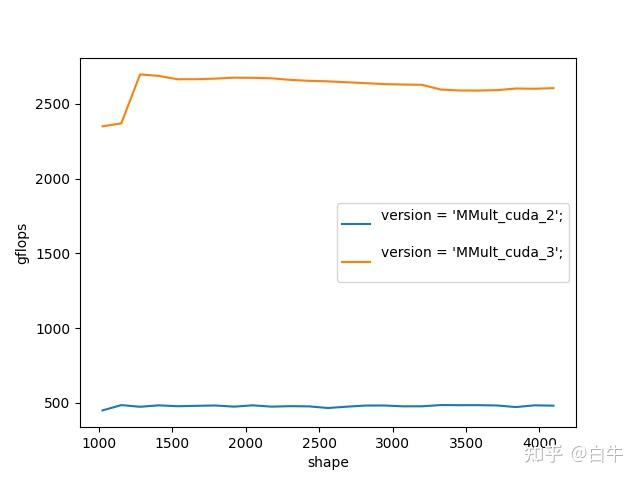

여기서 배워 둘 것이 두 가지 있습니다.

**1) `__shared__`로 선언하는 smem은 정적으로 40 KB만 쓸 수 있습니다.** `BLOCK`을 너무 크게 잡으면 컴파일 오류가 납니다.

```
ptxas error   : Entry function '_Z5sgemmILi16ELi8EEviiiPfiS0_iS0_i' uses too much shared data (0x20000 bytes, 0xc000 max)
```

`0xc000` 제한을 넘기려면 동적 smem만 쓸 수 있습니다.

**2) `__syncthreads()` API.** CUDA의 이른바 SIMT란 여러 thread가 같은 `.text` 영역을 실행한다는 뜻인데(자기 자신은 `threadId.x`로 구분), thread마다 빠르고 느린 차이가 있습니다. 모든 thread를 같은 출발선에 세워 줄 barrier 메커니즘이 필요합니다. smem은 공유되니까 데이터가 준비될 때까지 기다려야 실행할 수 있죠. `__syncthreads()`를 빼먹으면 결과가 "깜빡거려서" 마치 별빛처럼 첫 실행은 1, 두 번째는 2, 세 번째는 다시 1처럼 나옵니다. **이 현상을 이용해 디버깅 방향을 잡을 수도 있습니다**(버그 수리 경험 정리).

[CUDA Toolkit Documentation의 shared_memory 설명](https://docs.nvidia.com/cuda/cuda-c-programming-guide/index.html#shared-memory)을 참고하세요.

## 0x04 MMult_cuda_4와 MMult_cuda_5

컨닝페이퍼는 사고를 더 넓혀 보라고 합니다. thread 하나가 결과 1개만 계산하지 말고, 매번 STRIDE × STRIDE개를 계산하도록 바꿉니다. MMult_cuda_4는 2×2를 사용하며, 각 block에 16×16개의 thread가 있습니다.

```cuda
template <int BLOCK, int STRIDE>
__global__ void sgemm(int m, int n, int k, float *a, int lda, float *b, int ldb,
                      float *c, int ldc) {
  constexpr int STEP = BLOCK * STRIDE;
  ...
  float sum[STRIDE][STRIDE] = {0.f}; // 매번 STRIDE x STRIDE개를 계산, 바깥에 loop 추가
  for (float *a_ptr = begin_a, *b_ptr = begin_b; a_ptr < end_a;
       a_ptr += STEP, b_ptr += STEP * n) {
    __shared__ float ashare[STEP][STEP];
    __shared__ float bshare[STEP][STEP];

    for (int i = 0; i < STRIDE; ++i) {
      for (int j = 0; j < STRIDE; ++j) {
        ashare[ty * STRIDE + i][tx * STRIDE + j] =
            a_ptr[(ty * STRIDE + i) * k + tx * STRIDE + j];
        bshare[ty * STRIDE + i][tx * STRIDE + j] =
            b_ptr[(ty * STRIDE + i) * n + tx * STRIDE + j];
      }
    }
    __syncthreads();
    ...
}
...
constexpr int BLOCK = 16;
constexpr int STRIDE = 2;
sgemm<BLOCK, STRIDE><<<grid, block>>>(m, n, k, d_A, lda, d_B, ldb, d_C, ldc);
```

구현은 MMult_cuda_3과 매우 비슷합니다. 그저 loop를 한 겹 더 둘렀을 뿐, thread 하나가 계산하는 양을 template 인자로 만들어 파라미터 튜닝하기 쉽게 했습니다.

컨닝페이퍼는 occupancy 계산에 `CUDA_Occupancy_Calculator.xls`를 쓰라고 알려 줍니다. 레지스터 사용량은 어떻게 알까요? 직접 세는 방법 외에 `nvcc -Xptxas="-v"` 옵션을 쓸 수 있습니다.

```
✗ nvcc -m64 -arch=sm_86 -c -Xptxas="-v" MMult_cuda_4.cu
ptxas info : 0 bytes gmem
ptxas info : Compiling entry function '_Z5sgemmILi16ELi2EEviiiPfiS0_iS0_i' for 'sm_86'
ptxas info : Function properties for _Z5sgemmILi16ELi2EEviiiPfiS0_iS0_i
    0 bytes stack frame, 0 bytes spill stores, 0 bytes spill loads
ptxas info : Used 40 registers, 8192 bytes smem, 412 bytes cmem[0]
```

occupancy는 참고용일 뿐 정확하진 않습니다.

| 항목 | MMult_cuda_4 | MMult_cuda_5 |
| --- | --- | --- |
| Threads Per Block | 256 | 64 |
| Reg Per Thread | 40 | 157 |
| smem Per Block | 8192 | 20480 |
| Occupancy | 100% | 8% |

예를 들어 MMult_cuda_5는 파라미터만 바꿨는데 occupancy가 가련하게도 8%지만, 실제 FLOPS는 occupancy 100%인 MMult_cuda_4보다 더 높습니다.

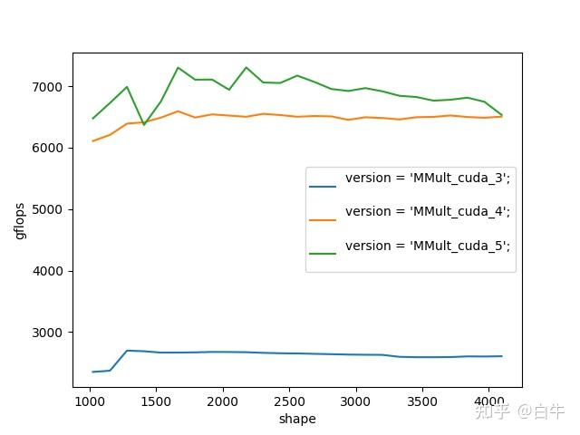
*3·4·5 세 버전 비교*

CPU `perf`처럼 명령어 한 줄씩의 hit rate와 병목 지점을 바로 알려 주는 도구가 있으면 좋겠다고 생각했습니다.

처음에는 Nsight Systems를 다운로드했는데, 유용한 정보가 별로 없었습니다... 화면을 보여드리자면:

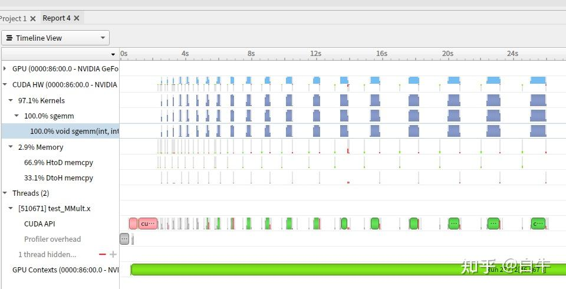

완성된 bin을 분석하기엔 적합하지만 작은 kernel 분석엔 그리 알맞지 않은 느낌입니다.

댓글의 @CC仕님 알려주셔서, 두 번째로는 Nsight Compute를 받았는데 이건 sudo 권한이나 `CAP_SYS_ADMIN`이 필요합니다. 아... 지금 환경이 안 돼서 일단 스크린샷만 보겠습니다.

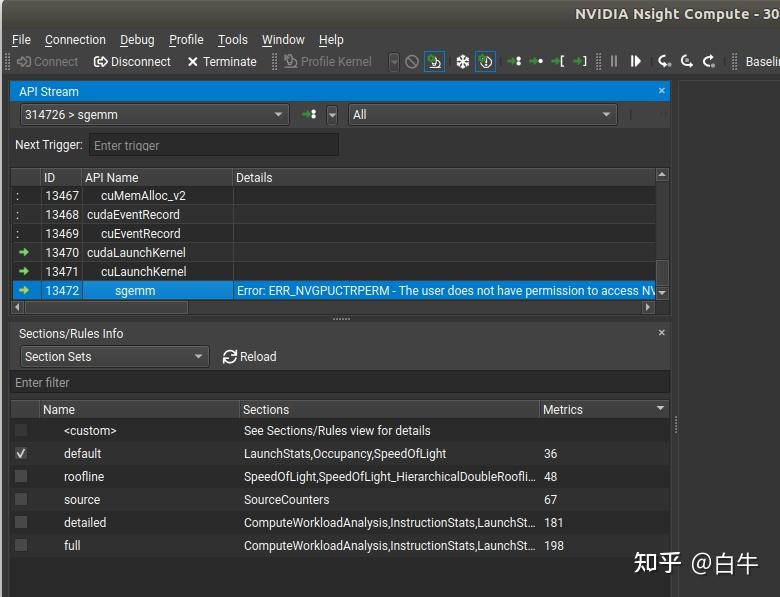
*Nsight Compute의 kernel 분석*

MMult_cuda_5에는 한 가지 효과적인 변경이 더 있습니다. `__align__` 수식어입니다.

```cuda
__shared__ __align__(16 * 1024) float ashare[STEP][STEP];
```

이 문법은 `ashare` 변수의 주소를 16K로 정렬합니다. Huawei Atlas 300의 大页(large page) 주소와 비슷한 향이 납니다. 정렬은 효과가 있습니다. `__align__` 전후 차이를 보세요.

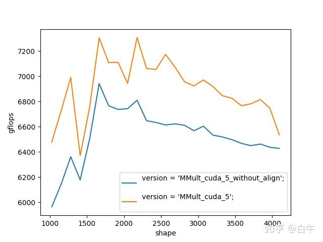
*주소 정렬 전후*

## 0x05 MMult_cuda_8 전의 몇 가지 추측

*CUDA 행렬 곱 궁극 최적화 가이드*는 "극한의 메모리 접근 최적화" 이후로는 소스코드가 별로 없습니다. 신참은 "load_smem_tile_to_reg" 같은 문구만 보고서 멍하게 for 루프/unroll로 펼쳐 작성할 수밖에 없습니다.

MMult_cuda_7은 컨닝페이퍼가 설명하는 2×2를 구현해 봤습니다. block 하나가 128×128 정사각형을 계산하고, 이걸 다시 2×2개의 64×64 정사각형으로 자릅니다. "최종적으로 thread 하나가 2×2개의 4×4 결과를 계산"합니다.

MMult_cuda_8은 컨닝페이퍼의 "지연 은닉"을 시도했습니다. 쉽게 말하면 ping-pong, smem에 load 하자마자 `__syncthreads()`하지 말고, `load0 → cal1 → sync → load1 → cal0 → ...` 식으로 합니다. 이해를 돕기 위해 코드를 매크로로 작성했습니다.

```cpp
  LOAD(0)
  for (; a_ptr < end_a;) {
    __syncthreads();
    LOAD(1)
    SUBKERNEL(0)

    __syncthreads();
    if (a_ptr < end_a) {
      LOAD(0)
    }
    SUBKERNEL(1)
  }
```

이 두 시도 모두 결과가 좋지 않았고, 현재 최선은 여전히 MMult_cuda_5였습니다. 7·8 모두 4 기반에서 개선했지만요.

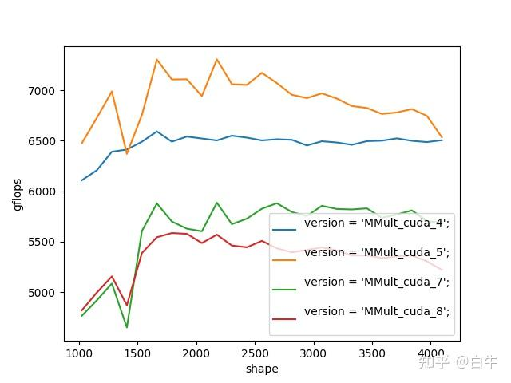
*역효과(negative optimization)*

지금 돌아보면 방향은 틀리지 않았습니다. 틀린 건 구현 수준이었습니다.

- v7은 C에 writeback할 때 메모리 접근 효율이 낮았습니다. 더 나은 블로킹 전략과 코드 구현이 필요했습니다
- v8은 ping-pong을 너무 단순하게 봤습니다. 실제로는 훨씬 더 세밀한 ping-pong을 써야 효과가 있습니다

## 0x06 MMult_cuda_9

이후 며칠 동안 갈피를 잡지 못하고 몇 개 버전을 더 써 봤지만, ping-pong이든 transposeA든 다 소용없었습니다...

다행히 MegEngine Bot의 *MegEngine TensorCore 합성곱 연산자 구현 원리*의 작성자분이 적시에 두 번째 컨닝페이퍼인 [Yinghan-Li/YHs_Sample](https://github.com/Yinghan-Li/YHs_Sample) 을 추천해 줬습니다. 이 버전은 내용이 훨씬 풍부합니다.

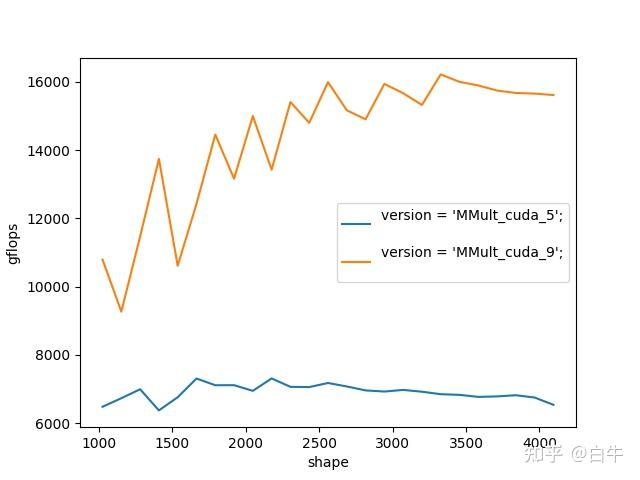
*두 번째 컨닝페이퍼*

**1) 합쳐서 접근(coalesced access)과 transpose A**

GPU의 thread 스케줄링 단위가 32라는 것 기억하시죠? CUDA에서는 이걸 Warp(흔히 *线程束*)이라 부릅니다. CPU SIMD의 **사고 단위**가 thread라면, GPU는 매번 "32개 thread가 함께 어떻게 실행될까"를 생각해야 합니다.

32개 thread가 함께 gmem에서 smem으로 데이터를 가져올 때, **interleave 방식**이 더 환영받습니다. 즉 i번 thread가 i번 데이터에 접근하는 방식이죠. 이는 CPU kernel과 다릅니다. CPU는 interleave를 좋아하지 않습니다. 컨텍스트 스위치 때문에 CPU는 각 thread의 데이터 로드가 연속적이고 상대적으로 독립적이길 원합니다. 이 방식이 coalesced access이며, [stackoverflow 설명](https://stackoverflow.com/questions/5041328/in-cuda-what-is-memory-coalescing-and-how-is-it-achieved)을 참고하면 좋습니다.

> interleave가 뭐냐: Android/iOS 스마트폰 카메라가 읽어 오는 YUV 포맷이 `YYYYYYYY UVUVUV` 같은 식입니다. 여기서 UV의 교차 배치가 일종의 interleave 형태입니다.

coalesced 원리에 따라, subB 행렬 8×128의 로딩을 interleave32로 바꿉니다. thread_i는 i, i+32, i+64, i+96 네 개를 가져옵니다.

```cuda
int from_b = (threadIdx.x / 32) * n + blockIdx.x * 128 + threadIdx.x % 32
...
int to_b = (threadIdx.x / 32) * SMEM_LDB + (threadIdx.x % 32);
...
```

128×8 크기의 subA는 gmem → smem 이동 시 슬쩍 transpose를 했습니다. 각 thread가 4행 1열을 1행으로 바꿉니다. 어쨌든 `trans(A)`가 메모리상 연속이니까요. 白牛의 *OpenBLAS gemm 입문*에 이미 나와 있는 내용입니다.

```cuda
int from_a = (blockIdx.y * 128 + threadIdx.x / 8 * 4) * k + threadIdx.x % 8;

for (int loop = 0; loop < k; loop += 8) {
    // load gmem to smem for ashare
    int to_a = (threadIdx.x % 8) * SMEM_LDA + (threadIdx.x / 8) * 4;
#pragma unroll
    for (int i = 0; i < 4; ++i) {
      ashare[to_a + i] = a[from_a + i * k];
    }
}
```

**2) smem 활용 기법**

smem을 "풀(pool)" 비슷한 개념으로 바꿨습니다. 한 번에 24K를 할당하고, ashare/bshare를 그 안에서 잘라 씁니다. 이러면 반복적으로 재활용할 수 있어, 변수를 여러 개로 일시에 정의할 필요가 없습니다.

**3) panel**

transposeA의 단위가 4라서 매번 2×2개의 4×4 결과를 계산하는데, 이 결과는 연속이 아닙니다. smem → 레지스터 단계에서 panelA, panelB를 써서 계산할 데이터를 적재하고 두 개의 for 루프로 끝냅니다. 그렇지 않으면 `2×2×4×4`짜리 네 겹 for 루프를 써야 하니까요.

이렇게 하는 건 더 세밀한 ping-pong을 짜기 쉽게 만들기 위한 것이지 성능 자체에 차이를 주는 건 아닙니다. 아시잖아요, 코드를 반복하면 할수록 버그가 늘어난다는 걸요.

## 0x07 MMult_cuda_10

CUDA kernel과 CPU kernel의 또 다른 차이는 **어셈블리가 그리 유용하지 않다**는 점입니다. GPU는 thread 하나하나가 약하기 때문에, 간단한 시나리오에선 컴파일러가 손으로 짠 어셈블리를 넘는 일도 드물지 않습니다.

白牛의 *ARMv7 4×4 kernel 게으른 최적화 실습* 처럼 명령어가 몇 번 발사되는지, 몇 cycle 지연인지, 명령어 간 상호 은닉이 어떻게 되는지 따지는 식의 사고는 GPU에선 의미가 없습니다...

MMult_cuda_10에서는 몇 가지 ptxas(어셈블리) 기법을 시도했습니다.

- `st/ld.shared.v4.f32` 명령어로 한 번에 4개씩 읽고 쓰기. SIMD와 다를 게 없음
- smem 사용 방법 조정, 64bit 주소를 32bit로 변환해 이후엔 32bit 주소만 사용
- gmem → smem 이동에서 중간 레지스터 `a_ldg_reg` 보조 사용. 찾아 보니, 이 기법은 Ampere 아키텍처에선 무효...

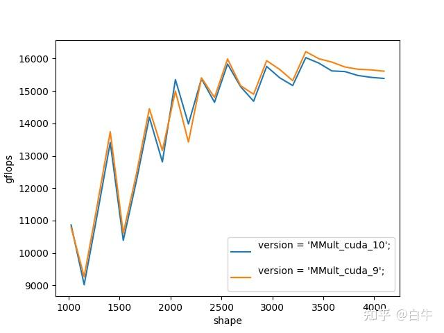
*보세요, 별 효과 없는 ptxas...*

## 0x08 MMult_cuda_11

MMult_cuda_11에서는 subC 행렬의 writeback 부분을 만지작거리기 시작했습니다.

- 어셈블리를 포기하지 않고 계속 `st.global.v4.f32`를 시도, 드디어 약간 효과가 생겼습니다... 그땐 `.o`를 disassemble해서 한 번 봤어야 했죠
- writeback에 smem을 써 보기. coalesced가 read에 효과가 있다면 write에도 효과가 있어야 정상이지 않을까?

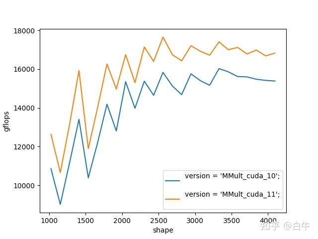
*드디어 ptxas가 조금은 쓸모가 있었던 순간*

## 0x09 MMult_cuda_12

지난번 컨닝페이퍼에서 ping-pong이 미수에 그쳤는데, 이번에 드디어 해결!

MMult_cuda_10에서는 `a_ldg_reg`로 gmem → smem 이동을 보조했습니다. 구현의 디테일은 이렇습니다.

```cpp
// split_k = 8
    for (int subk = 0; subk < 8; ++subk) {

      // 루프 끝부분: 보조 레지스터를 next_smem으로 이동
      if (7 == subk and loop < k - 8) {
        sts128(a_ldg_reg[0], a_ldg_reg[1], a_ldg_reg[2], a_ldg_reg[3],
               a_sts_addr);
#pragma unroll
        for (int i = 0; i < 4; ++i) {
          sts32(b_ldg_reg[i], b_sts_addr + i * 32 * sizeof(float));
        }
        __syncthreads();
        ...
      }

      // 루프 중간: cur_smem을 panel로 옮겨 계산 준비
      ...

      // 루프 시작: next_gmem을 보조 레지스터로 이동
      if (0 == subk and loop < k - 8) {
#pragma unroll
        for (int i = 0; i < 4; ++i) {
          ldg32_nc_0(a_ldg_reg[i],
                     (const char *)(a + from_a) + i * k * sizeof(float));
        }
        // load gmem to smem for bshare
#pragma unroll
        for (int i = 0; i < 4; ++i) {
          ldg32_nc_0(b_ldg_reg[i],
                     (const char *)(b + from_b) + i * 32 * sizeof(float));
        }
      }
      ...
    }
```

핵심은 `gmem → 보조 레지스터 → smem` 와 `smem → panel` 두 흐름이 연동되어 서로를 가려 주는 것입니다.

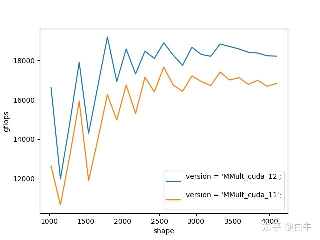
*ping-pong 작동 확인!*

## 0x0a 끝맺으며

少侠의 구현은 MMult_cuda_12보다 훨씬 복잡합니다. 여기서는 단지 step-by-step 입문 해설을 제공할 뿐입니다. 더 깊이 가려면 업무 외 시간만으로는 부족합니다. 화려한 인덱스 계산, SASS, 어셈블러 등을 풀타임으로 익혀야 합니다. 그러니까... 《판샤오팅을 이기고 싶었던 그 밤, 나는 줄곧 공을 치고 있었다》(농담입니다).

## 0x0b 감사의 글

- @李少侠 형님의 설명과 공유에 감사
- @MegEngine Bot에서 제공해 준 3080에 감사

링크:
- https://github.com/MegEngine/MegEngine
- MegStudio — 무료 V100 Python 환경을 제공하는 온라인 딥러닝 플랫폼
