# CUDA : 통용 행렬 곱 GEMM — 입문에서 숙련까지

> 원문: https://zhuanlan.zhihu.com/p/657632577

**목차**
- 1. GEMM의 기본 특성
  - 1.1 GEMM 계산 과정과 복잡도
  - 1.2 단순 구현과 과정 분석
- 2. GEMM 최적화 탐구
  - 2.1 행렬 분할과 Shared Memory 활용
  - 2.2 Bank Conflict 해결
  - 2.3 파이프라인 병렬화: Double Buffering
- 3. cuBLAS 구현 방식 탐구
- 참고 자료

통용 행렬 곱 GEMM (General Matrix Multiplication)은 다양한 모델·연산의 핵심이자, 하드웨어 성능(FLOPS) 평가의 표준 기법입니다. 본 글에서는 GEMM의 구현과 최적화를 통해 고성능 컴퓨팅과 하드웨어·소프트웨어 시스템을 이해해 봅니다.

## 1. GEMM의 기본 특성

### 1.1 GEMM 계산 과정과 복잡도

GEMM의 정의:

```
C ← α · A · B + β · C
```

즉 행렬 `A`와 `B`를 곱하고 결과를 α배 스케일한 뒤, β배 스케일된 `C`와 더해 최종 결과를 `C`에 저장합니다.

계산 복잡도를 분석해 봅시다. `A`의 모양이 `M × K`, `B`의 모양이 `K × N`이면 `C`의 모양은 `M × N` 입니다. 주된 부분은 `AB` 행렬 곱입니다.

```
       │ a₁,₁  ⋯  a₁,K │ │ b₁,₁  ⋯  b₁,N │   │ Σ a₁,k·bk,₁  ⋯  Σ a₁,k·bk,N │
AB  =  │  ⋮   ⋱   ⋮   │ │  ⋮   ⋱   ⋮   │ = │      ⋮       ⋱      ⋮      │
       │ aM,₁  ⋯  aM,K │ │ bK,₁  ⋯  bK,N │   │ Σ aM,k·bk,₁  ⋯  Σ aM,k·bk,N │
```

`i` 행 `j` 열 원소 `Σₖ aᵢ,ₖ · bₖ,ⱼ` 는 곱 K번, 합 K−1번이 필요하므로, `AB` 계산에는 `(2K−1)MN` 회의 부동소수 연산이 필요합니다.

또 `AB`와 `C`의 스케일에도 각각 `MN` 회씩 부동소수 연산이 들어가니, 총 부동소수 연산 수는 `(2K+1)MN`. `K ≫ 1`이므로 보통 `2KMN`으로 근사합니다. 단위는 FLOPs(Float Point Operations)입니다. 하드웨어 입장에서는 이 계산을 끝내는 데 걸리는 시간, 즉 초당 부동소수 연산 수 FLOPS(Float Point Operations Per Second)에 관심이 있고, 보통 GFLOPS(=10⁹ FLOPS), TFLOPS(=10¹² FLOPS)를 씁니다.

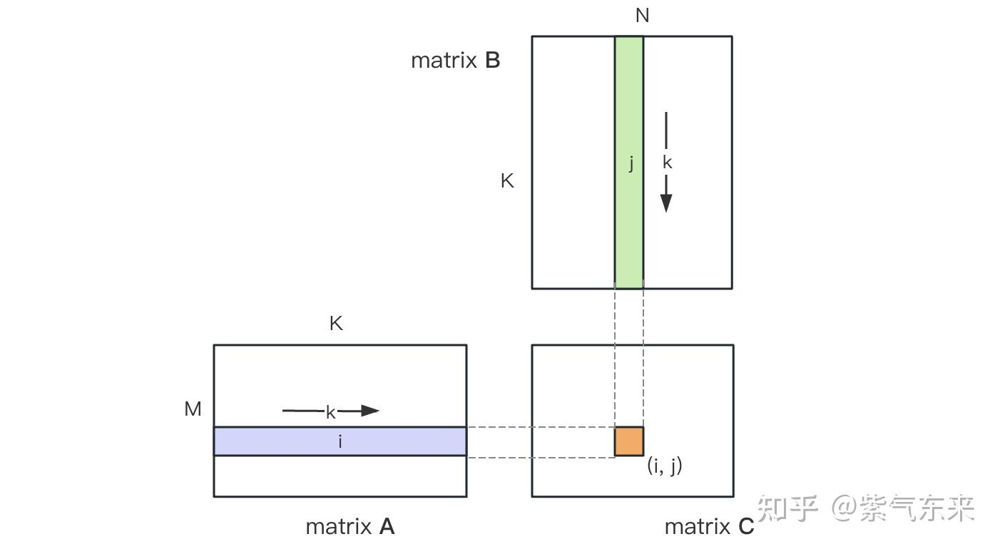
*행렬 곱의 계산 도식*

### 1.2 단순 구현과 과정 분석

GEMM을 직접 구현해 봅시다. 편의를 위해 `α = 1, β = 0`, 단정밀도(FP32) 즉 SGEMM을 사용합니다.

먼저 정확도 비교용으로 정의대로 짠 CPU 코드:

```cpp
#define OFFSET(row, col, ld) ((row) * (ld) + (col))

void cpuSgemm(
    float *a, float *b, float *c, const int M, const int N, const int K) {

    for (int m = 0; m < M; m++) {
        for (int n = 0; n < N; n++) {
            float psum = 0.0;
            for (int k = 0; k < K; k++) {
                psum += a[OFFSET(m, k, K)] * b[OFFSET(k, n, N)];
            }
            c[OFFSET(m, n, N)] = psum;
        }
    }
}
```

이제 CUDA로 가장 단순한 GEMM 커널을 만듭니다. 총 `M × N` 개의 thread를 사용해 행렬 곱을 끝냅니다. 각 thread는 `C`의 한 원소를 담당하고, K번의 곱-누적을 수행합니다. `A`, `B`, `C`는 모두 전역 메모리에 있고(`__global__` 한정자로 보장), 전체 코드는 `sgemm_naive.cu`에 있습니다.

```cuda
__global__ void naiveSgemm(
    float * __restrict__ a, float * __restrict__ b, float * __restrict__ c,
    const int M, const int N, const int K) {

    int n = blockIdx.x * blockDim.x + threadIdx.x;
    int m = blockIdx.y * blockDim.y + threadIdx.y;
    if (m < M && n < N) {
        float psum = 0.0;
        #pragma unroll
        for (int k = 0; k < K; k++) {
            psum += a[OFFSET(m, k, K)] * b[OFFSET(k, n, N)];
        }
        c[OFFSET(m, n, N)] = psum;
    }
}

const int BM = 32, BN = 32;
const int M = 512, N = 512, K = 512;
dim3 blockDim(BN, BM);
dim3 gridDim((N + BN - 1) / BN, (M + BM - 1) / BM);
```

Tesla V100-PCIE-32GB에서 컴파일·실행하면 다음과 같은 결과가 나옵니다. V100 백서에 따르면 FP32 피크 연산은 15.7 TFLOPS이므로, 이 방식의 활용률은 약 11.5%에 불과합니다.

```
M N K =    128    128   1024, Time =   0.00010083   0.00010260   0.00010874 s, AVG Performance =   304.5951 Gflops
M N K =    192    192   1024, Time =   0.00010173   0.00010198   0.00010253 s, AVG Performance =   689.4680 Gflops
M N K =    256    256   1024, Time =   0.00010266   0.00010318   0.00010384 s, AVG Performance =  1211.4281 Gflops
M N K =    384    384   1024, Time =   0.00019475   0.00019535   0.00019594 s, AVG Performance =  1439.7206 Gflops
M N K =    512    512   1024, Time =   0.00037693   0.00037794   0.00037850 s, AVG Performance =  1322.9753 Gflops
M N K =    768    768   1024, Time =   0.00075238   0.00075558   0.00075776 s, AVG Performance =  1488.9271 Gflops
M N K =   1024   1024   1024, Time =   0.00121562   0.00121669   0.00121789 s, AVG Performance =  1643.8068 Gflops
M N K =   1536   1536   1024, Time =   0.00273072   0.00275611   0.00280208 s, AVG Performance =  1632.7386 Gflops
M N K =   2048   2048   1024, Time =   0.00487622   0.00488028   0.00488614 s, AVG Performance =  1639.2518 Gflops
M N K =   3072   3072   1024, Time =   0.01001603   0.01071136   0.01099990 s, AVG Performance =  1680.4589 Gflops
M N K =   4096   4096   1024, Time =   0.01771046   0.01792170   0.01803462 s, AVG Performance =  1785.5450 Gflops
M N K =   6144   6144   1024, Time =   0.03988969   0.03993405   0.04000595 s, AVG Performance =  1802.9724 Gflops
M N K =   8192   8192   1024, Time =   0.07119219   0.07139694   0.07160816 s, AVG Performance =  1792.7940 Gflops
M N K =  12288  12288   1024, Time =   0.15978026   0.15993242   0.16043369 s, AVG Performance =  1800.7606 Gflops
M N K =  16384  16384   1024, Time =   0.28559187   0.28567238   0.28573316 s, AVG Performance =  1792.2629 Gflops
```

`M = 512, K = 512, N = 512`를 예시로 위 계산의 워크플로우를 분석해 봅니다.

- 전역 메모리에 `A`, `B`, `C`를 위한 저장 공간을 할당
- `C`의 각 원소 계산이 서로 독립적이므로, 병렬도 매핑에서 각 thread를 `C`의 한 원소에 대응시킴
- 실행 구성(execution configuration)의 gridSize, blockSize는 x(열 방향), y(행 방향) 두 차원을 가집니다:

```
gridSize.x × blockSize.x = N
gridSize.y × blockSize.y = M
```

각 thread의 워크플로우는: `A`에서 길이 K의 행 벡터를 읽고, `B`에서 길이 K의 열 벡터를 읽어, 두 벡터의 내적(K회 곱-누적)을 계산한 뒤 결과를 `C`에 저장. 이렇게 모든 `C` 원소를 계산할 수 있습니다. `A`, `B`를 읽는 데 각각 `K × M × N × 4 Byte`의 load가 일어나고, `C`에 쓰는 데 `M × N × 4 Byte`의 store가 일어납니다.

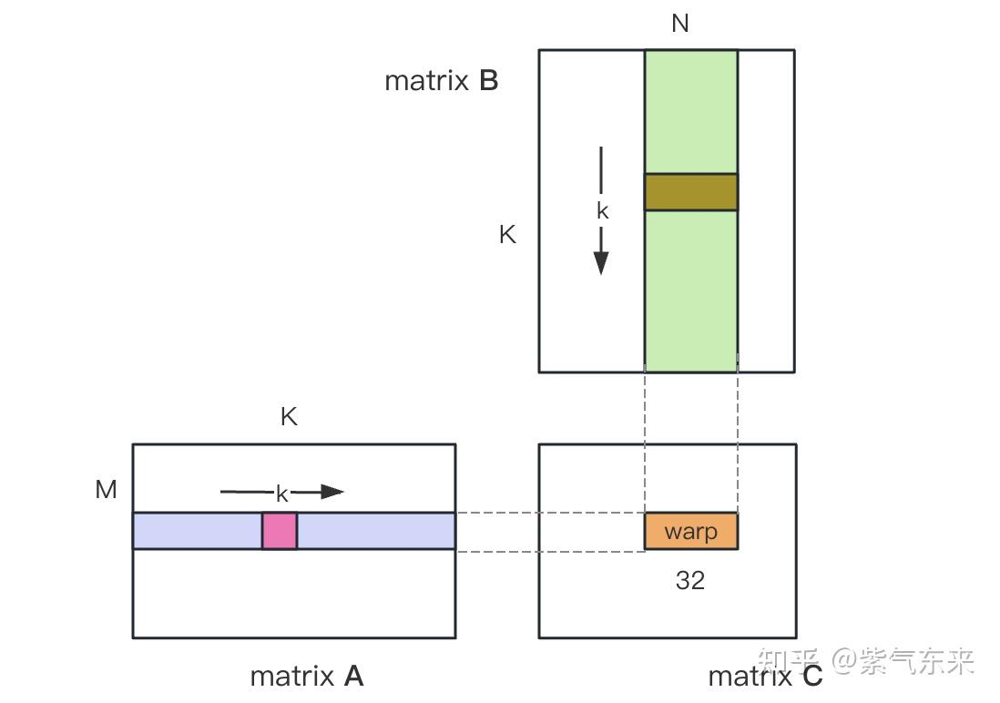

실제로는 GPU 명령 실행 최소 단위가 warp(32 thread)이므로 같은 warp 내 thread들의 R/W를 일부 합칠 수 있습니다. 한 warp의 32 thread는 매 루프마다 `A`의 같은 원소(1 transaction)와 `B`의 연속된 32 원소(이상적인 coalesced 가정 시 최소 4 transaction)를 읽습니다. 합쳐 5 transaction. K 루프 총 `K × 5`. `M × N`개 thread, 즉 `M × N / 32`개 warp가 있으니 총 Global Memory Load Transaction 수는 `M × N / 32 × K × 5`(앞서 본 `K × M × N × 2`가 아님).

계산 대비 메모리 접근 비율(컴퓨트/메모리 비율)은 `2KMN / (KMN/32 × 5 × 4) = 3.2 OP/byte`. 실측 대역폭이 763 GB/s(공식 문서 900 GB/s)이므로, 이 방식의 이론 최고 연산력은 `64/20 × 763 = 2442 TFLOPS`... 가 아니라, `3.2 × 763 ≈ 2442 GFLOPS`로 해석해야 자연스럽습니다.

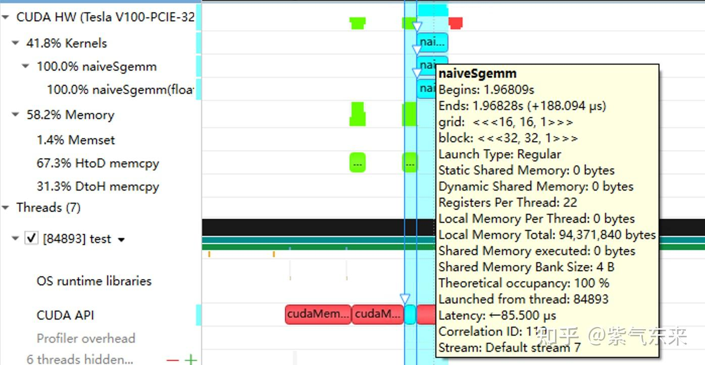
*nsys로 본 naive 버전의 프로파일링*

## 2. GEMM 최적화 탐구

앞에서는 기능적으로만 GEMM을 구현했고 성능은 기대에 한참 못 미칩니다. 이 절에서는 성능 최적화를 다룹니다.

### 2.1 행렬 분할과 Shared Memory 활용

위 계산은 한 번의 곱-누적을 위해 두 번의 전역 메모리 load가 필요해 컴퓨트/메모리 비율이 매우 낮고, 효율적인 데이터 재사용도 없습니다. Shared Memory를 써서 중복된 메모리 읽기를 줄일 수 있습니다.

먼저 `C`를 `BM × BN` 크기로 균등 분할하고, 각 분할을 하나의 Block이 담당합니다. 그 안에서 각 Thread는 `TM × TN` 개 원소를 계산합니다. 이후 계산에 필요한 데이터는 모두 smem에서 가져오게 해 `A`, `B`의 중복된 메모리 읽기를 일부 제거합니다. Shared Memory 용량이 제한적이므로 K 차원에서 매번 `BK` 크기로 읽어 들이며, 이런 루프가 `K/BK` 번 필요해야 행렬 곱이 끝납니다.

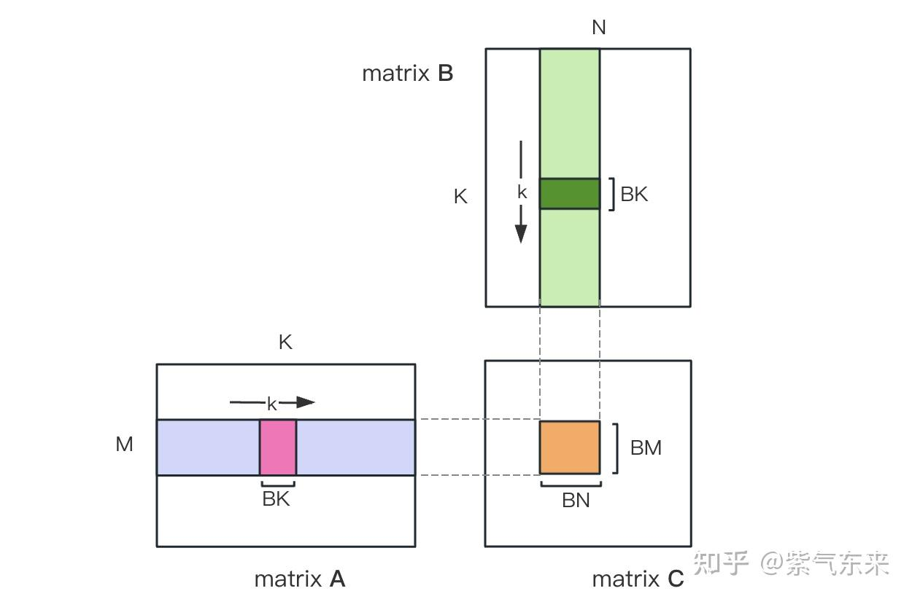

Shared Memory를 적용한 각 분할에 대해:

- 계산량: `BM × BN × K × 2`
- 메모리 접근: `(BM + BN) × K × 4 Byte`
- 컴퓨트/메모리 비율: `BM·BN / (2(BM + BN)) = 1 / (2(1/BN + 1/BM))`

BM, BN이 클수록 비율이 높아지고 성능이 좋아집니다. 하지만 Shared Memory 용량 제한이 있어(V100 한 SM은 96KB) 한 Block은 `BK × (BM + BN) × 4 Byte`를 점유합니다.

TM·TN 선택도 두 가지 제약이 있습니다.

- 스레드 수 제약: 한 Block의 thread는 `(BM/TM) × (BN/TN)` 개. 1024를 넘으면 안 되고 너무 높으면 SM 내 block 병렬에 영향.
- 레지스터 수 제약: 한 thread는 `C` 부분합 저장에 최소 `TM × TN` 개 레지스터가 필요. 다른 레지스터까지 합쳐 총 256을 넘으면 안 되며 너무 높으면 SM 동시 병렬 thread 수에 영향.

최종적으로 `BM = BN = 128, BK = 8, TM = TN = 8`을 선택. 이때 컴퓨트/메모리 비율은 32. V100 이론 15.7 TFLOPS / 32 = 490 GB/s, 실측 HBM 763 GB/s. 이 정도면 대역폭이 더는 병목이 되지 않습니다.

이 분석을 기반으로 한 커널 구현은 다음과 같습니다. 전체 코드는 `sgemm_v1.cu` 참고.

**(1) 행렬 분할 `A[BM,BK]`, `B[BK,BN]` 를 Shared Memory에 적재**

`blockDim(BN/TN, BM/TM)` 즉 block당 `BM·BN/(TM·TN)`개 thread. 분할 `A[BM,BK]`에 대해 thread당 `BK·TM·TN/BN`개 float를 옮겨야 하는데, 이 예에서 4. `FLOAT4` 함수로 한 번에 옮길 수 있습니다. `[128, 8]` 분할에서 thread 인덱스 관계는 다음과 같습니다. `load_a_smem_m = tid >> 1`은 `s_a`의 행, `load_a_smem_k = (tid & 1) << 2`는 `s_a`의 열입니다. `B[BK,BN]`도 같은 방식.

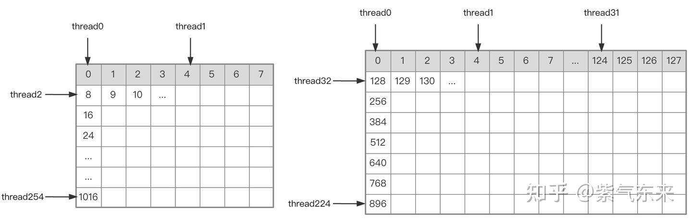
*A·B 행렬 분할의 thread 인덱스 관계*

단일 block 실행을 정했으면, 다중 block 처리 시 분할이 전역 메모리에서 어디에 대응하는지를 정해야 합니다. `A`를 예로 봅시다. 분할 `A[BM,BK]`는 행 방향으로 이동하므로 먼저 행 번호를 정합니다. Grid의 2차원 전역 선형 인덱스 관계에 따라 `by * BM`이 분할의 시작 행이고, `load_a_smem_m`이 분할 내부의 행이므로 전역 행은 `load_a_gmem_m = by * BM + load_a_smem_m`. 분할이 행 방향으로 움직이므로 열은 변하고 루프 안에서 계산해야 합니다. 시작 열 `bk * BK`에 분할 내부 열 `load_a_smem_k`를 더해 `load_a_gmem_k = bk * BK + load_a_smem_k`를 얻고, 분할의 원본 데이터 위치는 `OFFSET(load_a_gmem_m, load_a_gmem_k, K)`로 결정됩니다. `B[BK,BN]`도 동일.

**(2) 분할 `C[TM,TN]` 계산**

`s_a, s_b`를 얻은 다음 정의대로 `r_c`를 계산. `TM × TN`의 더 작은 분할입니다.

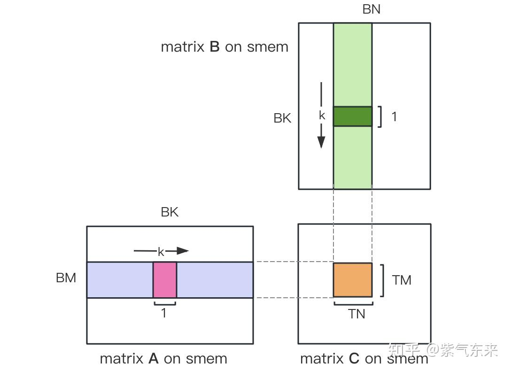

`C[TM,TN]`을 계산한 뒤 전역 메모리에 저장하려면 그 위치를 계산해야 합니다. 더 작은 분할이 있으니, 행·열 각각이 3 요소로 구성됩니다. 전역 행 `store_c_gmem_m` = 대분할 시작 행 `by * BM` + 소분할 시작 행 `ty * TM` + 소분할 내부 상대 행 `i`. 열도 동일.

```cuda
__global__ void sgemm_V1(
    float * __restrict__ a, float * __restrict__ b, float * __restrict__ c,
    const int M, const int N, const int K) {

    const int BM = 128;
    const int BN = 128;
    const int BK = 8;
    const int TM = 8;
    const int TN = 8;

    const int bx = blockIdx.x;
    const int by = blockIdx.y;
    const int tx = threadIdx.x;
    const int ty = threadIdx.y;
    const int tid = ty * blockDim.x + tx;

    __shared__ float s_a[BM][BK];
    __shared__ float s_b[BK][BN];

    float r_c[TM][TN] = {0.0};

    int load_a_smem_m = tid >> 1;        // tid/2, row of s_a
    int load_a_smem_k = (tid & 1) << 2;  // (tid % 2 == 0) ? 0 : 4, col of s_a
    int load_b_smem_k = tid >> 5;        // tid/32, row of s_b
    int load_b_smem_n = (tid & 31) << 2; // (tid % 32) * 4, col of s_b

    int load_a_gmem_m = by * BM + load_a_smem_m;
    int load_b_gmem_n = bx * BN + load_b_smem_n;

    for (int bk = 0; bk < (K + BK - 1) / BK; bk++) {
        int load_a_gmem_k = bk * BK + load_a_smem_k;
        int load_a_gmem_addr = OFFSET(load_a_gmem_m, load_a_gmem_k, K);
        FLOAT4(s_a[load_a_smem_m][load_a_smem_k]) = FLOAT4(a[load_a_gmem_addr]);
        int load_b_gmem_k = bk * BK + load_b_smem_k;
        int load_b_gmem_addr = OFFSET(load_b_gmem_k, load_b_gmem_n, N);
        FLOAT4(s_b[load_b_smem_k][load_b_smem_n]) = FLOAT4(b[load_b_gmem_addr]);
        __syncthreads();

        #pragma unroll
        for (int k = 0; k < BK; k++) {
            #pragma unroll
            for (int m = 0; m < TM; m++) {
                #pragma unroll
                for (int n = 0; n < TN; n++) {
                    int comp_a_smem_m = ty * TM + m;
                    int comp_b_smem_n = tx * TN + n;
                    r_c[m][n] += s_a[comp_a_smem_m][k] * s_b[k][comp_b_smem_n];
                }
            }
        }

        __syncthreads();
    }

    #pragma unroll
    for (int i = 0; i < TM; i++) {
        int store_c_gmem_m = by * BM + ty * TM + i;
        #pragma unroll
        for (int j = 0; j < TN; j += 4) {
            int store_c_gmem_n = bx * BN + tx * TN + j;
            int store_c_gmem_addr = OFFSET(store_c_gmem_m, store_c_gmem_n, N);
            FLOAT4(c[store_c_gmem_addr]) = FLOAT4(r_c[i][j]);
        }
    }
}
```

결과는 다음과 같으며 이론 최대 성능의 51.7%에 달합니다.

```
M N K =    128    128   1024, AVG Performance =    98.4974 Gflops
M N K =    192    192   1024, AVG Performance =   221.6661 Gflops
M N K =    256    256   1024, AVG Performance =   396.4287 Gflops
M N K =    384    384   1024, AVG Performance =   884.0425 Gflops
M N K =    512    512   1024, AVG Performance =  1562.1563 Gflops
M N K =    768    768   1024, AVG Performance =  3268.5245 Gflops
M N K =   1024   1024   1024, AVG Performance =  5748.3952 Gflops
M N K =   1536   1536   1024, AVG Performance =  6523.3424 Gflops
M N K =   2048   2048   1024, AVG Performance =  5858.5604 Gflops
M N K =   3072   3072   1024, AVG Performance =  6590.6331 Gflops
M N K =   4096   4096   1024, AVG Performance =  7175.4698 Gflops
M N K =   6144   6144   1024, AVG Performance =  7574.0999 Gflops
M N K =   8192   8192   1024, AVG Performance =  7779.8733 Gflops
M N K =  12288  12288   1024, AVG Performance =  8005.7066 Gflops
M N K =  16384  16384   1024, AVG Performance =  8118.7715 Gflops
```

`M = 512, K = 512, N = 512` 결과를 분석합니다. 프로파일링상 Shared Memory 점유는 8192 bytes로 이론값 `(128 + 128) × 8 × 4`와 일치합니다.

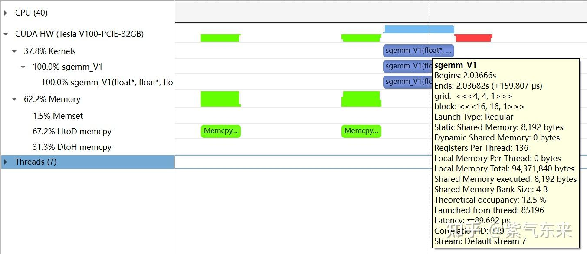
*nsys로 본 V1 프로파일링*

Occupancy는 12.5%. cuda-calculator로도 확인 가능합니다. 이 예에서 threads/block = 256, registers/thread = 136이고, SM당 활성 warp가 8개. V100의 SM당 총 warp는 64이므로 Occupancy = `8/64 = 12.5%`.

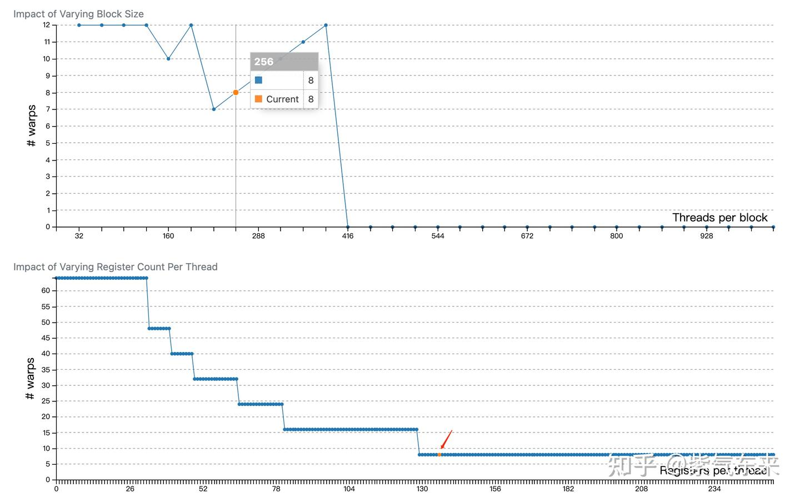

### 2.2 Bank Conflict 해결

앞 절에서 Shared Memory로 접근 효율을 크게 끌어올렸습니다. 이번 절에서는 Shared Memory 사용을 더 최적화합니다.

Shared Memory는 32개 Bank로 나뉘고 각 Bank의 폭은 4 Bytes입니다. 같은 Bank에 있는 여러 데이터를 동시에 접근하려 하면 **Bank Conflict** 가 발생합니다. 예를 들어 한 warp의 32 thread가 주소 0, 4, 8, ..., 124를 읽으면 conflict가 없고 Shared Memory 한 박자(cycle)면 됩니다. 반면 주소 0, 8, 16, ..., 248을 읽으면 0과 128, 4와 132처럼 같은 Bank에 속한 데이터가 충돌하므로 두 박자가 필요합니다.

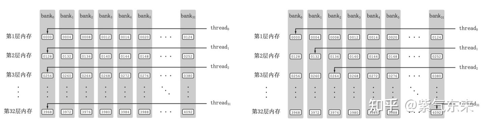
*Bank Conflict 있음 vs 없음*

V1 버전의 3중 루프를 다시 보면, 매번 Shared Memory에서 `A`의 길이 TM 벡터와 `B`의 길이 TN 벡터를 가져와 외적(outer product)으로 부분합에 누적합니다. 한 번의 외적은 `TM × TN`회 곱-누적이며, BK번 반복합니다.

Shared Memory load 과정의 Bank Conflict 분석:

i) `A`에서는 열 벡터를 가져와야 하는데, `A`는 Shared Memory에 행 단위로 저장돼 있음
ii) `TM = TN = 8`이면 `A`나 `B` 모두 연속된 8개를 가져와야 함. `LDS.128` 명령으로 한 번에 4개씩 가져와도 두 명령이 필요. 한 thread의 두 load 명령 주소는 연속이지만, 같은 warp의 서로 다른 thread의 같은 load 명령 주소는 간격이 벌어져 Bank Conflict 발생.

해결을 위한 두 가지 최적화:

i) `A`의 Shared Memory를 `[BK][BM]` 모양으로 잡아 열 단위 저장하도록 함
ii) 원래 한 thread가 계산하던 `TM × TN`의 `C` 블록을 아래 그림처럼 두 개의 `TM/2 × TN` 블록으로 나눔. `TM/2 = 4`이므로 한 명령으로 `A` 한 블록 load가 가능하고, 두 load를 동시에 진행 가능.

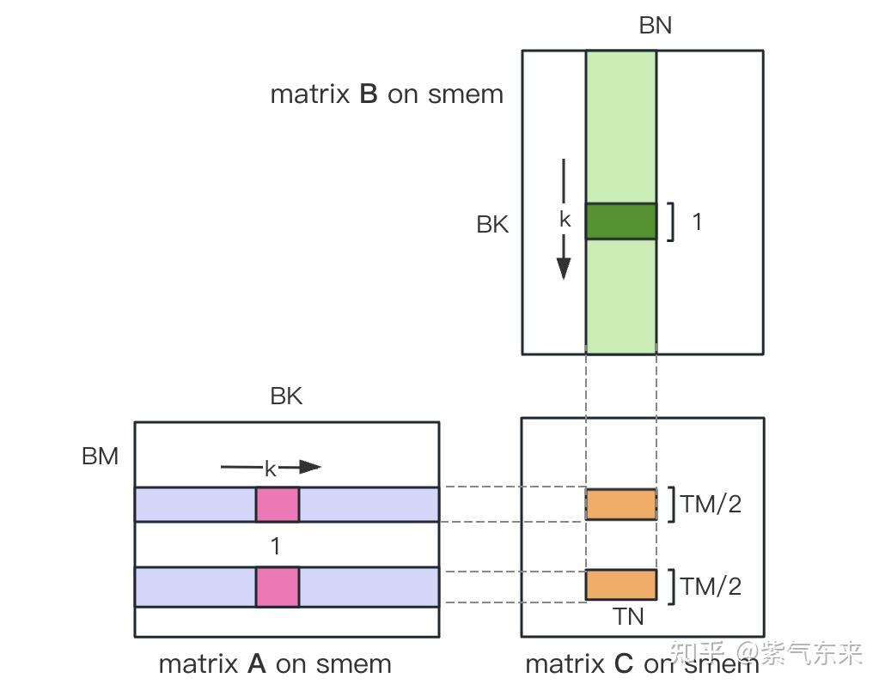

커널 핵심 부분 (전체는 `sgemm_v2.cu`):

```cuda
    __shared__ float s_a[BK][BM];
    __shared__ float s_b[BK][BN];

    float r_load_a[4];
    float r_load_b[4];
    float r_comp_a[TM];
    float r_comp_b[TN];
    float r_c[TM][TN] = {0.0};

    int load_a_smem_m = tid >> 1;
    int load_a_smem_k = (tid & 1) << 2;
    int load_b_smem_k = tid >> 5;
    int load_b_smem_n = (tid & 31) << 2;

    int load_a_gmem_m = by * BM + load_a_smem_m;
    int load_b_gmem_n = bx * BN + load_b_smem_n;

    for (int bk = 0; bk < (K + BK - 1) / BK; bk++) {

        int load_a_gmem_k = bk * BK + load_a_smem_k;
        int load_a_gmem_addr = OFFSET(load_a_gmem_m, load_a_gmem_k, K);
        int load_b_gmem_k = bk * BK + load_b_smem_k;
        int load_b_gmem_addr = OFFSET(load_b_gmem_k, load_b_gmem_n, N);
        FLOAT4(r_load_a[0]) = FLOAT4(a[load_a_gmem_addr]);
        FLOAT4(r_load_b[0]) = FLOAT4(b[load_b_gmem_addr]);

        s_a[load_a_smem_k    ][load_a_smem_m] = r_load_a[0];
        s_a[load_a_smem_k + 1][load_a_smem_m] = r_load_a[1];
        s_a[load_a_smem_k + 2][load_a_smem_m] = r_load_a[2];
        s_a[load_a_smem_k + 3][load_a_smem_m] = r_load_a[3];
        FLOAT4(s_b[load_b_smem_k][load_b_smem_n]) = FLOAT4(r_load_b[0]);

        __syncthreads();

        #pragma unroll
        for (int tk = 0; tk < BK; tk++) {
            FLOAT4(r_comp_a[0]) = FLOAT4(s_a[tk][ty * TM / 2         ]);
            FLOAT4(r_comp_a[4]) = FLOAT4(s_a[tk][ty * TM / 2 + BM / 2]);
            FLOAT4(r_comp_b[0]) = FLOAT4(s_b[tk][tx * TN / 2         ]);
            FLOAT4(r_comp_b[4]) = FLOAT4(s_b[tk][tx * TN / 2 + BN / 2]);

            #pragma unroll
            for (int tm = 0; tm < TM; tm++) {
                #pragma unroll
                for (int tn = 0; tn < TN; tn++) {
                    r_c[tm][tn] += r_comp_a[tm] * r_comp_b[tn];
                }
            }
        }

        __syncthreads();
    }

    #pragma unroll
    for (int i = 0; i < TM / 2; i++) {
        int store_c_gmem_m = by * BM + ty * TM / 2 + i;
        int store_c_gmem_n = bx * BN + tx * TN / 2;
        int store_c_gmem_addr = OFFSET(store_c_gmem_m, store_c_gmem_n, N);
        FLOAT4(c[store_c_gmem_addr]) = FLOAT4(r_c[i][0]);
        FLOAT4(c[store_c_gmem_addr + BN / 2]) = FLOAT4(r_c[i][4]);
    }
    #pragma unroll
    for (int i = 0; i < TM / 2; i++) {
        int store_c_gmem_m = by * BM + BM / 2 + ty * TM / 2 + i;
        int store_c_gmem_n = bx * BN + tx * TN / 2;
        int store_c_gmem_addr = OFFSET(store_c_gmem_m, store_c_gmem_n, N);
        FLOAT4(c[store_c_gmem_addr]) = FLOAT4(r_c[i + TM / 2][0]);
        FLOAT4(c[store_c_gmem_addr + BN / 2]) = FLOAT4(r_c[i + TM / 2][4]);
    }
```

결과: V1 대비 14.4% 성능 향상, 이론 최대 성능의 74.3% 도달.

```
M N K =    128    128   1024, AVG Performance =   104.4530 Gflops
M N K =    192    192   1024, AVG Performance =   235.7252 Gflops
M N K =    256    256   1024, AVG Performance =   423.2949 Gflops
M N K =    384    384   1024, AVG Performance =   942.2843 Gflops
M N K =    512    512   1024, AVG Performance =  1669.7479 Gflops
M N K =    768    768   1024, AVG Performance =  3465.1038 Gflops
M N K =   1024   1024   1024, AVG Performance =  6155.0281 Gflops
M N K =   1536   1536   1024, AVG Performance =  9331.3912 Gflops
M N K =   2048   2048   1024, AVG Performance =  8453.4569 Gflops
M N K =   3072   3072   1024, AVG Performance =  9569.5816 Gflops
M N K =   4096   4096   1024, AVG Performance = 10029.7885 Gflops
M N K =   6144   6144   1024, AVG Performance = 10926.6372 Gflops
M N K =   8192   8192   1024, AVG Performance = 11467.5446 Gflops
M N K =  12288  12288   1024, AVG Performance = 11675.4946 Gflops
M N K =  16384  16384   1024, AVG Performance = 11669.5995 Gflops
```

프로파일링상 Static Shared Memory는 여전히 8192 Bytes인데, 묘하게 Shared Memory executed가 두 배인 16384 Bytes입니다 (왜 그런지 아시는 분은 알려 주세요).

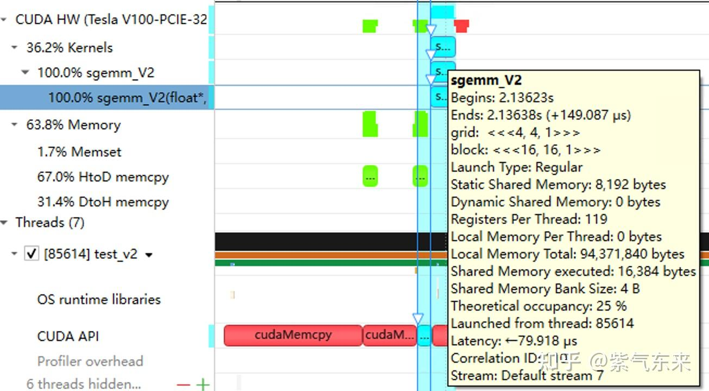

### 2.3 파이프라인 병렬화: Double Buffering

Double Buffering은 buffer를 두 배로 만들어 "접근-계산" 직렬 모드를 파이프라인화함으로써 대기 시간을 줄이고 효율을 높이는 기법입니다.

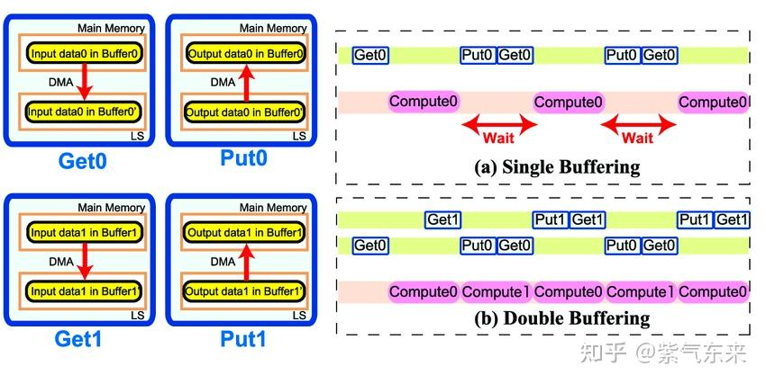
*Single Buffering vs Double Buffering*

GEMM에 적용하면, 원래 `BK × (BM + BN) × 4 Byte`였던 Shared Memory가 두 배인 `2BK × (BM + BN) × 4 Byte`로 늘고, 파이프라인을 흘립니다.

핵심 코드 (전체는 `sgemm_v3.cu`). 주의할 점:

1. 메인 루프는 `bk = 1`부터 시작. 첫 데이터 로드는 메인 루프 전, 마지막 계산은 메인 루프 후. 파이프라인 특성상.
2. 계산용과 다음 접근용 Shared Memory가 다르므로, 메인 루프 안의 `__syncthreads()`는 매 회 1회면 충분.
3. GPU는 CPU 같은 out-of-order 실행을 지원하지 않으므로, 메인 루프 안에서 다음 루프에 필요한 전역 데이터를 먼저 레지스터로 load하고 현재 계산을 수행한 뒤 레지스터의 데이터를 Shared Memory에 씁니다. 이렇게 하면 LDG 명령이 전역 메모리에서 load 하는 동안 후속 FFMA 등의 명령 발사를 방해하지 않아 Double Buffering 효과가 납니다.

```cuda
    __shared__ float s_a[2][BK][BM];
    __shared__ float s_b[2][BK][BN];

    float r_load_a[4];
    float r_load_b[4];
    float r_comp_a[TM];
    float r_comp_b[TN];
    float r_c[TM][TN] = {0.0};

    int load_a_smem_m = tid >> 1;
    int load_a_smem_k = (tid & 1) << 2;
    int load_b_smem_k = tid >> 5;
    int load_b_smem_n = (tid & 31) << 2;

    int load_a_gmem_m = by * BM + load_a_smem_m;
    int load_b_gmem_n = bx * BN + load_b_smem_n;

    {
        int load_a_gmem_k = load_a_smem_k;
        int load_a_gmem_addr = OFFSET(load_a_gmem_m, load_a_gmem_k, K);
        int load_b_gmem_k = load_b_smem_k;
        int load_b_gmem_addr = OFFSET(load_b_gmem_k, load_b_gmem_n, N);
        FLOAT4(r_load_a[0]) = FLOAT4(a[load_a_gmem_addr]);
        FLOAT4(r_load_b[0]) = FLOAT4(b[load_b_gmem_addr]);

        s_a[0][load_a_smem_k    ][load_a_smem_m] = r_load_a[0];
        s_a[0][load_a_smem_k + 1][load_a_smem_m] = r_load_a[1];
        s_a[0][load_a_smem_k + 2][load_a_smem_m] = r_load_a[2];
        s_a[0][load_a_smem_k + 3][load_a_smem_m] = r_load_a[3];
        FLOAT4(s_b[0][load_b_smem_k][load_b_smem_n]) = FLOAT4(r_load_b[0]);
    }

    for (int bk = 1; bk < (K + BK - 1) / BK; bk++) {

        int smem_sel = (bk - 1) & 1;
        int smem_sel_next = bk & 1;

        int load_a_gmem_k = bk * BK + load_a_smem_k;
        int load_a_gmem_addr = OFFSET(load_a_gmem_m, load_a_gmem_k, K);
        int load_b_gmem_k = bk * BK + load_b_smem_k;
        int load_b_gmem_addr = OFFSET(load_b_gmem_k, load_b_gmem_n, N);
        FLOAT4(r_load_a[0]) = FLOAT4(a[load_a_gmem_addr]);
        FLOAT4(r_load_b[0]) = FLOAT4(b[load_b_gmem_addr]);

        #pragma unroll
        for (int tk = 0; tk < BK; tk++) {
            FLOAT4(r_comp_a[0]) = FLOAT4(s_a[smem_sel][tk][ty * TM / 2         ]);
            FLOAT4(r_comp_a[4]) = FLOAT4(s_a[smem_sel][tk][ty * TM / 2 + BM / 2]);
            FLOAT4(r_comp_b[0]) = FLOAT4(s_b[smem_sel][tk][tx * TN / 2         ]);
            FLOAT4(r_comp_b[4]) = FLOAT4(s_b[smem_sel][tk][tx * TN / 2 + BN / 2]);

            #pragma unroll
            for (int tm = 0; tm < TM; tm++) {
                #pragma unroll
                for (int tn = 0; tn < TN; tn++) {
                    r_c[tm][tn] += r_comp_a[tm] * r_comp_b[tn];
                }
            }
        }

        s_a[smem_sel_next][load_a_smem_k    ][load_a_smem_m] = r_load_a[0];
        s_a[smem_sel_next][load_a_smem_k + 1][load_a_smem_m] = r_load_a[1];
        s_a[smem_sel_next][load_a_smem_k + 2][load_a_smem_m] = r_load_a[2];
        s_a[smem_sel_next][load_a_smem_k + 3][load_a_smem_m] = r_load_a[3];
        FLOAT4(s_b[smem_sel_next][load_b_smem_k][load_b_smem_n]) = FLOAT4(r_load_b[0]);

        __syncthreads();
    }

    #pragma unroll
    for (int tk = 0; tk < BK; tk++) {
        FLOAT4(r_comp_a[0]) = FLOAT4(s_a[1][tk][ty * TM / 2         ]);
        FLOAT4(r_comp_a[4]) = FLOAT4(s_a[1][tk][ty * TM / 2 + BM / 2]);
        FLOAT4(r_comp_b[0]) = FLOAT4(s_b[1][tk][tx * TN / 2         ]);
        FLOAT4(r_comp_b[4]) = FLOAT4(s_b[1][tk][tx * TN / 2 + BN / 2]);

        #pragma unroll
        for (int tm = 0; tm < TM; tm++) {
            #pragma unroll
            for (int tn = 0; tn < TN; tn++) {
                r_c[tm][tn] += r_comp_a[tm] * r_comp_b[tn];
            }
        }
    }

    #pragma unroll
    for (int i = 0; i < TM / 2; i++) {
        int store_c_gmem_m = by * BM + ty * TM / 2 + i;
        int store_c_gmem_n = bx * BN + tx * TN / 2;
        int store_c_gmem_addr = OFFSET(store_c_gmem_m, store_c_gmem_n, N);
        FLOAT4(c[store_c_gmem_addr]) = FLOAT4(r_c[i][0]);
        FLOAT4(c[store_c_gmem_addr + BN / 2]) = FLOAT4(r_c[i][4]);
    }
    #pragma unroll
    for (int i = 0; i < TM / 2; i++) {
        int store_c_gmem_m = by * BM + BM / 2 + ty * TM / 2 + i;
        int store_c_gmem_n = bx * BN + tx * TN / 2;
        int store_c_gmem_addr = OFFSET(store_c_gmem_m, store_c_gmem_n, N);
        FLOAT4(c[store_c_gmem_addr]) = FLOAT4(r_c[i + TM / 2][0]);
        FLOAT4(c[store_c_gmem_addr + BN / 2]) = FLOAT4(r_c[i + TM / 2][4]);
    }
```

성능은 다음과 같으며 이론 최대 80.6%에 도달합니다.

```
M N K =    128    128   1024, AVG Performance =   128.9191 Gflops
M N K =    192    192   1024, AVG Performance =   292.3840 Gflops
M N K =    256    256   1024, AVG Performance =   518.3728 Gflops
M N K =    384    384   1024, AVG Performance =  1164.8394 Gflops
M N K =    512    512   1024, AVG Performance =  2062.9786 Gflops
M N K =    768    768   1024, AVG Performance =  4584.3820 Gflops
M N K =   1024   1024   1024, AVG Performance =  8119.7302 Gflops
M N K =   1536   1536   1024, AVG Performance =  9829.5167 Gflops
M N K =   2048   2048   1024, AVG Performance =  8891.8924 Gflops
M N K =   3072   3072   1024, AVG Performance = 10095.9883 Gflops
M N K =   4096   4096   1024, AVG Performance = 10320.6843 Gflops
M N K =   6144   6144   1024, AVG Performance = 11615.0253 Gflops
M N K =   8192   8192   1024, AVG Performance = 12248.2036 Gflops
M N K =  12288  12288   1024, AVG Performance = 12599.3212 Gflops
M N K =  16384  16384   1024, AVG Performance = 12658.1556 Gflops
```

프로파일링에선 Shared Memory가 두 배로 점유된 것이 보입니다.

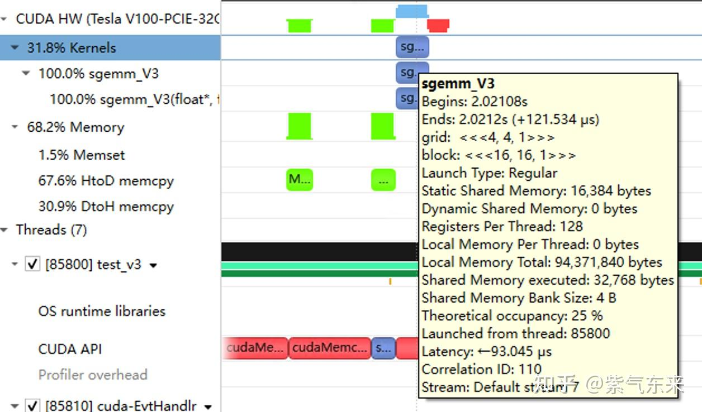

## 3. cuBLAS 구현 방식 탐구

이 절에서는 CUDA 표준 라이브러리 cuBLAS, 즉 NVIDIA 버전의 BLAS (Basic Linear Algebra Subprograms) 규약 구현을 살펴봅니다. Level 1(벡터·벡터), Level 2(벡터·행렬), Level 3(행렬·행렬) 표준 연산을 지원합니다.

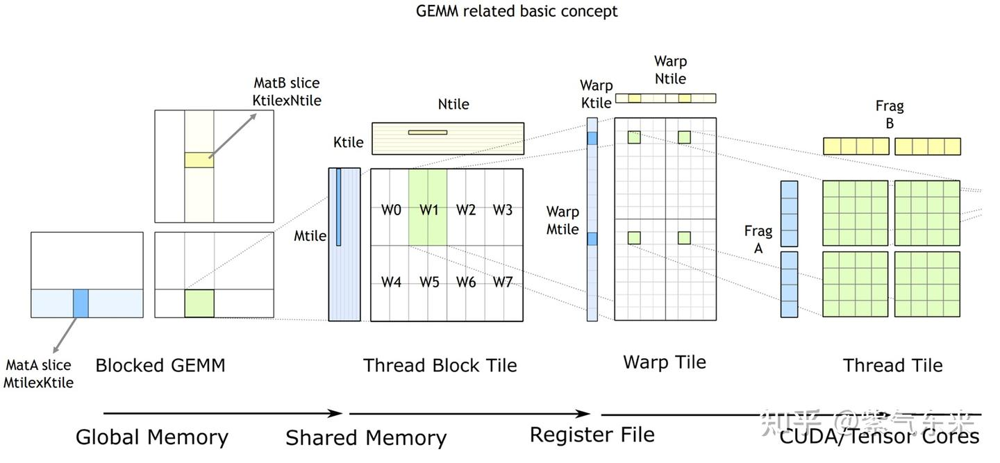
*cuBLAS/CUTLASS GEMM 기본 과정*

위 그림처럼 계산이 **thread block tile**, **warp tile**, **thread tile** 의 계층 구조로 분해되고, AMP 전략을 이 계층에 적용해 GPU 기반 tile-GEMM을 효율적으로 끝냅니다. 이 계층은 NVIDIA CUDA 프로그래밍 모델을 그대로 반영합니다. 전역 메모리 → 공유 메모리(행렬 → thread block tile), 공유 메모리 → 레지스터(thread block tile → warp tile), 레지스터 → CUDA core(warp tile → thread tile)의 데이터 이동을 볼 수 있습니다.

cuBLAS는 단정밀도 행렬 곱 함수 `cublasSgemm`을 제공합니다. 주요 파라미터는 다음과 같습니다.

```cpp
cublasStatus_t cublasSgemm(
    cublasHandle_t handle,    // cuBLAS 호출용 핸들
    cublasOperation_t transa, // A 전치 여부
    cublasOperation_t transb, // B 전치 여부
    int m,                    // A의 행 수
    int n,                    // B의 열 수
    int k,                    // A의 열 수
    const float *alpha,       // 계수 α, host or device pointer
    const float *A,           // A 포인터, device pointer
    int lda,                  // A의 leading dim. 전치 시 max(1, k), 아니면 max(1, m)
    const float *B,           // B 포인터, device pointer
    int ldb,                  // B의 leading dim. 전치 시 max(1, n), 아니면 max(1, k)
    const float *beta,        // 계수 β, host or device pointer
    float *C,                 // C 포인터, device pointer
    int ldc                   // C의 leading dim, ldc >= max(1, m)
);
```

호출 예:

```cpp
cublasHandle_t cublas_handle;
cublasCreate(&cublas_handle);
float cublas_alpha = 1.0;
float cublas_beta = 0;
cublasSgemm(cublas_handle, CUBLAS_OP_N, CUBLAS_OP_N, N, M, K, &cublas_alpha, d_b, N, d_a, K, &cublas_beta, d_c, N);
```

성능은 다음과 같으며 이론 최대 82.4%에 달합니다.

```
M N K =    128    128   1024, AVG Performance =   860.0286 Gflops
M N K =    192    192   1024, AVG Performance =  1863.6689 Gflops
M N K =    256    256   1024, AVG Performance =  2762.9438 Gflops
M N K =    384    384   1024, AVG Performance =  4705.0655 Gflops
M N K =    512    512   1024, AVG Performance =  4863.9646 Gflops
M N K =    768    768   1024, AVG Performance =  7567.1560 Gflops
M N K =   1024   1024   1024, AVG Performance =  8176.5614 Gflops
M N K =   1536   1536   1024, AVG Performance =  9452.3201 Gflops
M N K =   2048   2048   1024, AVG Performance =  9105.2126 Gflops
M N K =   3072   3072   1024, AVG Performance = 10686.6837 Gflops
M N K =   4096   4096   1024, AVG Performance = 10994.0128 Gflops
M N K =   6144   6144   1024, AVG Performance = 12109.2611 Gflops
M N K =   8192   8192   1024, AVG Performance = 12580.2896 Gflops
M N K =  12288  12288   1024, AVG Performance = 12892.7969 Gflops
M N K =  16384  16384   1024, AVG Performance = 12931.6086 Gflops
```

이상의 방법별 성능을 비교해 보면, 수동 구현 성능이 공식 라이브러리에 근접합니다.

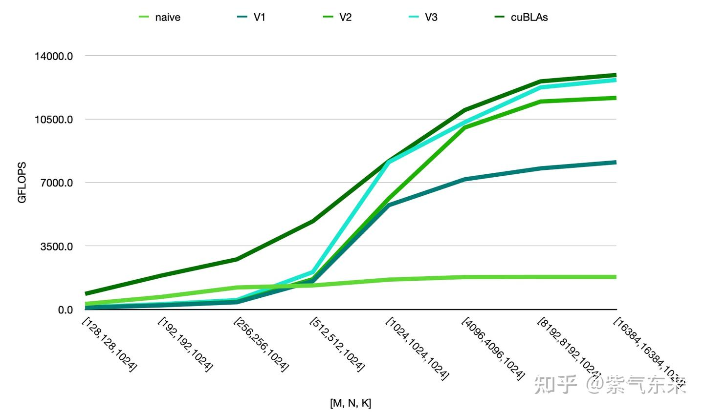

## 참고 자료

1. nicholaswilde: CUDA SGEMM 행렬 곱 최적화 노트 — 입문부터 cuBLAS까지
2. 행렬 곱의 CUDA 구현·최적화·성능 분석
3. a hgemm tvm schedule
4. https://www.cnblogs.com/sinkinben/p/16244156.html
5. Matrix Multiplication CUDA
6. LustofLife: [CUDA] 병렬 컴퓨팅 최적화 전략
7. https://xmartlabs.github.io/cuda-calculator/
8. CUTLASS: Software Primitives for Dense Linear Algebra at All Levels and Scales within CUDA | NVIDIA On-Demand
9. CUTLASS로 다중 GEMM을 fuse해 비범한 성능을 끌어내는 방법 | NVIDIA On-Demand
