# CUDA GEMM 연산자 상세

> 원문: https://zhuanlan.zhihu.com/p/1910636263666610461

**목차**
- 개념
- 표기
- 테스트 환경
- 연산자 구현
  - 0. cuBLAS
  - 1. 단순 구현: naiveGEMM
  - 2. 행렬 분할: blockTileGEMM
  - 3. thread 분할: threadTileGEMM
  - 4. warp 크기 조정: warpGEMM
  - 5. 벡터화 shared memory 적재: float4GEMM
  - 6. Bank Conflict 해결: float4GEMMnoBC
  - 7. z-order로 메모리 transaction 감소: zorderGEMM
  - 8. 코드 작성 최적화: optimGEMM
  - 9. Double Buffering: doublebufferingGEMM
- 마무리
- 참고 자료

## 개념

GEMM(General Matrix Multiply, 통용 행렬 곱)은 선형대수의 기본 연산으로 과학 계산·머신러닝·딥러닝·이미지 처리 등 다양한 분야에서 사용됩니다. 많은 알고리즘의 핵심이고 성능 최적화가 매우 중요합니다.

```
C = α·A·B + β·C
```

`A`는 `M×K`, `B`는 `K×N`, `C`는 `M×N`, `α`/`β`는 스칼라. 본 글은 `float` 데이터를 대상으로 `C = AB` (즉 `α = 1.0, β = 0.0`)의 CUDA 구현·최적화에 집중합니다.

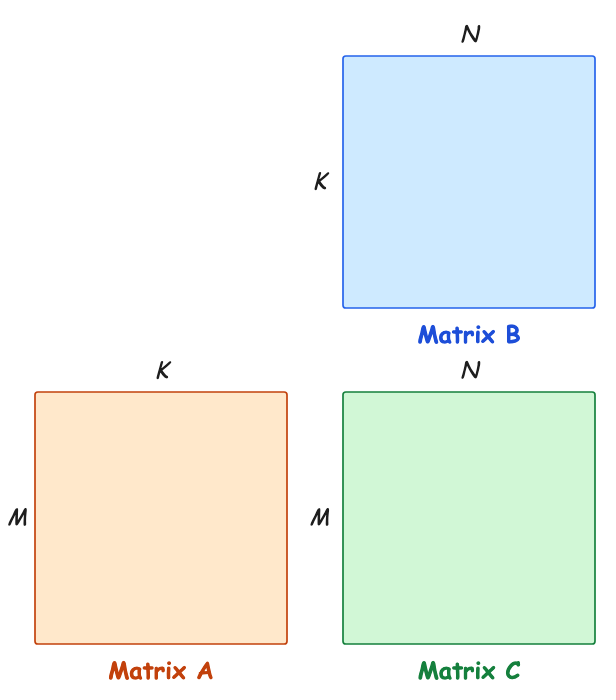
*그림 1. C = AB*

## 표기

- `M, K, N`: 행렬 크기
- `A`: `M×K`, `B`: `K×N`, `C`: `M×N`
- `A[r, c]`, `A[r, :]`, `A[:, c]` (B, C 동일)
- `tileC`: 행렬 C의 분할. tileA, tileB도 동일
- `block_size`: block당 thread 수, 본 글 기본 **256**
- `tid`: 현재 thread id, 0~255
- warp 크기 표기는 **"x 먼저, y 나중"** — 시각적으로 **"열 먼저, 행 나중"** 으로 행렬 표기와 **반대** 임에 주의

## 테스트 환경

- GPU: NVIDIA GeForce RTX 4060 Ti (CC 8.9)
- CUDA: 12.8

## 연산자 구현

### 0. cuBLAS

기준 라이브러리 `cublasSgemm`. `C = α · op(A) · op(B) + β · C` 형식. `op(A)`는 `OP_N`(원본), `OP_T`(전치), `OP_H`(켤레전치) 중 하나.

```cpp
cublasStatus_t cublasSgemm(cublasHandle_t handle,
                          cublasOperation_t transa,
                          cublasOperation_t transb,
                          int m, int n, int k,
                          const float* alpha,
                          const float* A, int lda,
                          const float* B, int ldb,
                          const float* beta,
                          float* C, int ldc);
```

| | Time (ms) |
| --- | --- |
| cublasSgemm | 1.44 |

### 1. 단순 구현: naiveGEMM

`C[r, c]`는 `A[r, :]`와 `B[:, c]`의 내적. 독립적으로 계산 가능 → **thread 하나가 C의 한 원소 담당**.

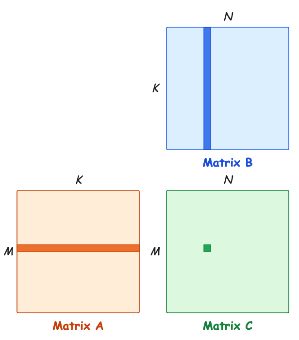
*그림 2. naiveGEMM*

```cuda
__global__ void naiveGEMM(float* A, float* B, float* C, const int M, const int K, const int N) {
    int r = blockIdx.y * blockDim.y + threadIdx.y;
    int c = blockIdx.x * blockDim.x + threadIdx.x;
    if (r >= M || c >= N) return;
    float value = 0.f;
    for (int k = 0; k < K; ++k) value += A[r * K + k] * B[k * N + c];
    C[r * N + c] = value;
}
```

| | Time (ms) | 상대 효율 |
| --- | --- | --- |
| cublasSgemm | 1.44 | 100% |
| naiveGEMM | 13.85 | 10.4% |

> 상대 효율 = cublasSgemm 시간 / kernel 시간

**대역폭 분석**

warp `32×1`에서 `value += A[r*K+k] * B[k*N+c]`를 실행할 때, 32 thread가 A의 같은 원소 1개, B의 32 원소를 읽음 → `(1+32)·4 = 132 byte`. thread당 곱 1, 합 1, 총 `32·2 = 64 OP`. 컴퓨트/메모리 비율 `64 OP / 132 byte = 0.48`. 4060 Ti의 FP32 22 TFLOP/s를 채우려면 `22 / 0.48 = 45.8 TB/s` 대역폭 필요. 그러나 4060 Ti의 global memory 처리량은 288 GB/s, L2 hit 100%여도 약 1586 GB/s 정도라 절대 못 채움. naiveGEMM은 **대역폭 제한**.

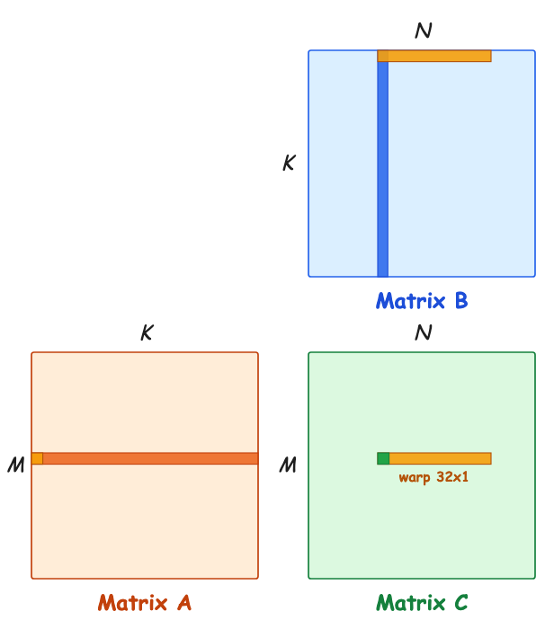
*그림 3. naiveGEMM 단일 warp*

**메모리 접근량**

thread당 A 한 행, B 한 열 = 2K 원소 적재. 총 thread `M·N`개 → 총 `2MNK` global 접근. global memory는 저대역폭·고지연이라 데이터 전송에 시간 소비 막대.

### 2. 행렬 분할: blockTileGEMM

global → shared로 옮겨 중복 접근 회피. block당 C의 한 `Bm × Bn` 영역을 담당.

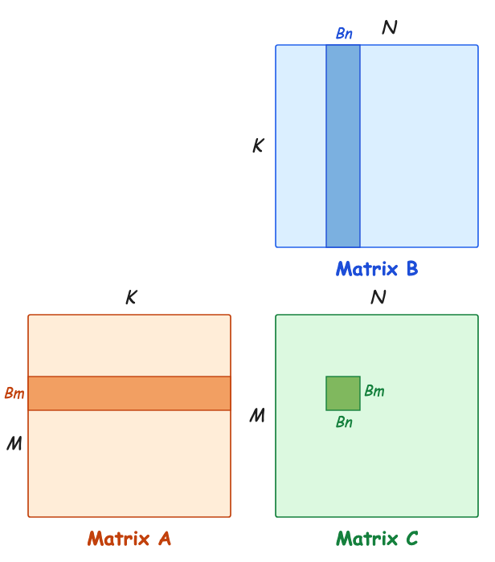
*그림 4. 행렬 분할*

K가 크기 때문에 K 축도 `Bk` 단위로 쪼개 반복합니다.

**K-Loop**

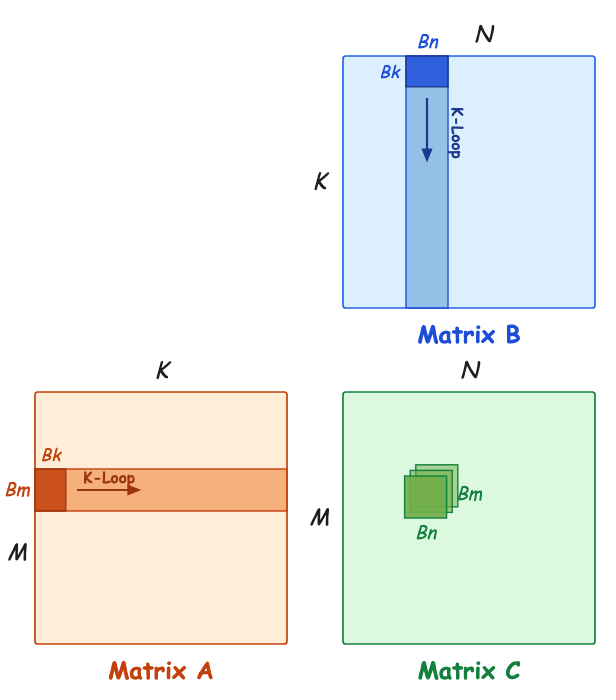
*그림 5. K-Loop tileC*

매 회 `Bm×Bk`의 tileA, `Bk×Bn`의 tileB. 결과 `Bm×Bn` 누적.

```cuda
for (int k = 0; k < K; k += Bk) {
    // ...
}
```

**Bm, Bn, Bk 선택**

K-Loop 1회 계산 `2·Bm·Bn·Bk`, 적재 `4·(Bm+Bn)·Bk` byte. 컴퓨트/메모리 비율 `1 / (2·(1/Bm + 1/Bn))`. Bk와 무관. `Bm = Bn = 128`이면 비율 32. `22 / 32 = 704 GB/s` 필요. 4060 Ti는 L2 hit 33% 이상이면 충분 — 같은 행 block은 같은 A 분할을 쓰고 같은 열 block은 같은 B 분할 → 33% 쉽게 넘김.

Bk는 shared memory 크기 영향. 너무 크면 SM 동시 thread 수 감소(Occupancy 하락). 너무 작으면 비효율(예: `Bk = 1`이면 A의 같은 열에서 `Bm`개 원소를 비연속 적재).

실험적으로 `Bm = Bn = 128, Bk = 8`이 최적.

**blockTileGEMM 흐름**

- shared `As[Bm][Bk]`, `Bs[Bk][Bn]` 선언
- thread당 담당 C 원소 수 만큼 레지스터 `Ct` 선언
- K-Loop:
  - tileA, tileB를 global → shared
  - `__syncthreads()`
  - `As × Bs` 계산, `Ct`에 누적
  - `__syncthreads()`
- 끝나면 `Ct`를 C로 기록

**(1) global → shared**

global memory의 최적 접근은 **정렬·연속**. tileA `128×8`에선 한 행의 `Bk=8` 원소가 인접 thread에 할당되어야 합니다. block_size 256일 때 thread 배치 `8×32` (`A_block`). tileB는 한 행 `Bn=128`을 인접 thread가 → `32×8` 등 가능. 본 글은 `32×8` 사용 (`B_block`).

이 배치는 warp 32 thread가 shared의 연속 32 위치에 씀 → **bank conflict 없음**.

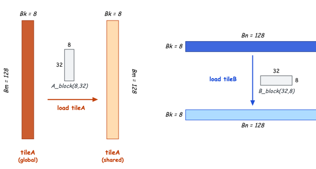
*그림 6. tileA·tileB 적재*

`A_block(8, 32)`로 256 thread를 행 8개·32행으로 재배치. `tid` thread는 `(tid/8, tid%8)` 위치.

- `A_BLOCK_X = 8`, `A_BLOCK_Y = 32`
- `A_THREAD_X = tid % A_BLOCK_X`, `A_THREAD_Y = tid / A_BLOCK_X`

`B_block(32, 8)`도 비슷.

block을 2D 컨볼루션처럼 tile 위에서 stride만큼 이동.

```cuda
// in K-Loop
for (int i = A_THREAD_Y; i < Bm; i += A_BLOCK_Y) {
    int r = r0 + i;
    for (int j = A_THREAD_X; j < Bk; j += A_BLOCK_X) {
        int c = k + j;
        As[i][j] = (r < M && c < K) ? A[r * K + c] : 0.f;
    }
}
for (int i = B_THREAD_Y; i < Bk; i += B_BLOCK_Y) {
    int r = k + i;
    for (int j = B_THREAD_X; j < Bn; j += B_BLOCK_X) {
        int c = c0 + j;
        Bs[i][j] = (r < K && c < N) ? B[r * N + c] : 0.f;
    }
}
__syncthreads();
```

**행렬 좌표 vs tile 좌표** — 행렬 좌표는 global의 A·B·C 위치, tile 좌표는 shared의 As·Bs 위치.

tileA 좌상단 행렬 좌표 `(r0, k)`, tileB `(k, c0)`.

```cuda
int r0 = blockIdx.y * Bm;
int c0 = blockIdx.x * Bn;
```

**(2) As × Bs → Ct**

tileC `128×128`, block 256 thread → thread당 `64`개 원소 = 8×8. `C_block(16, 16)` 사용.

```cuda
constexpr int Tm = Bm / C_BLOCK_Y;
constexpr int Tn = Bn / C_BLOCK_X;
float Ct[Tm][Tn] = {0.0};
```

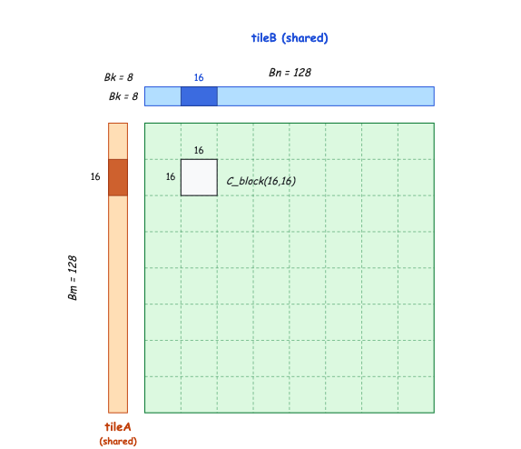
*그림 7. tileA × tileB*

각 thread가 `Tm × Tn`의 비연속 원소(간격 16) 계산.

**행렬 곱 두 방식 — 내적 vs 외적**

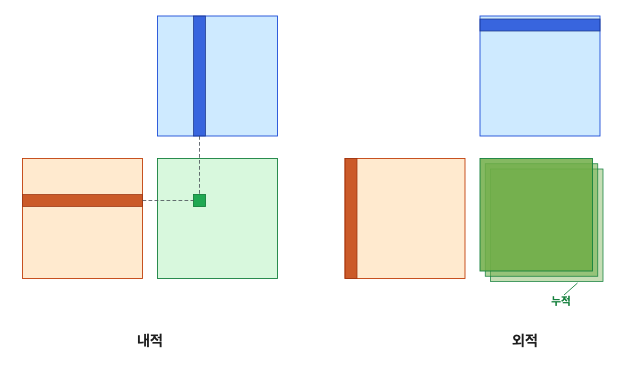
*그림 8. 두 방식*

- **내적**: A의 행, B의 열 → 내적 → C 한 원소
- **외적**: A의 열, B의 행 → 외적 → C 크기 행렬, 반복 누적

```cpp
// 내적
for (i) for (j) for (p) c[i][j] = a[i][p] * b[p][j];
// 외적
for (p) for (i) for (j) c[i][j] += a[i][p] * b[p][j];
```

외적의 장점: A의 열, B의 행이 한 번만 사용. 한 번에 가져온 뒤 버리고 다음을 읽으면 됨 → 레지스터로 임시 저장, 벡터화, double buffering 활용 가능.

```cuda
for (int p = 0; p < Bk; ++p) {
    for (int i = 0; i < Tm; ++i) {
        int r = C_THREAD_Y + i * C_BLOCK_Y;
        for (int j = 0; j < Tn; ++j) {
            int c = C_THREAD_X + j * C_BLOCK_X;
            Ct[i][j] += As[r][p] * Bs[p][c];
        }
    }
}
```

**(3) Ct → C**

```cuda
for (int i = 0; i < Tm; ++i) {
    int r = r0 + C_THREAD_Y + i * C_BLOCK_Y;
    for (int j = 0; j < Tn; ++j) {
        int c = c0 + C_THREAD_X + j * C_BLOCK_X;
        if (r < M && c < N) C[r * N + c] = Ct[i][j];
    }
}
```

전체 kernel은 위 흐름의 합 (코드는 원문 참고). 성능:

| | Time (ms) | 효율 |
| --- | --- | --- |
| cublasSgemm | 1.44 | 100% |
| naiveGEMM | 13.85 | 10.4% |
| blockTileGEMM | 2.86 | 50.3% |

cuBLAS의 50.3%로 큰 향상.

### 3. thread 분할: threadTileGEMM

block에서 한 단계 더 내려가 thread 레벨에서 외적 활용. subA `Tm × Bk`, subB `Bk × Tn`. p-Loop에서 A의 열·B의 행을 레지스터 `regA`, `regB`로.

```cuda
float regA[Tm] = {0.0f};
float regB[Tn] = {0.0f};

for (int p = 0; p < Bk; ++p) {
    for (int i = 0; i < Tm; ++i) {
        int r = C_THREAD_Y + i * C_BLOCK_Y;
        regA[i] = As[r][p];
    }
    for (int j = 0; j < Tn; ++j) {
        int c = C_THREAD_X + j * C_BLOCK_X;
        regB[j] = Bs[p][c];
    }
    for (int i = 0; i < Tm; ++i)
        for (int j = 0; j < Tn; ++j) Ct[i][j] += regA[i] * regB[j];
}
```

shared 접근 `2·Bk·Tm·Tn` → `Bk·(Tm + Tn)` 회. 레지스터 `Tm + Tn`개 증가. 더 빠른 메모리로 교환.

| | Time (ms) | 효율 |
| --- | --- | --- |
| threadTileGEMM | 2.85 | 50.5% |

### 4. warp 크기 조정: warpGEMM

기본 행 우선 thread 배치에서 `A_block(8, 32)`의 warp는 `8×4`, `B_block(32, 8)`의 warp는 `32×1` — 적재 효율 최적. `C_block(16, 16)`의 warp는 기본 `16×2`.

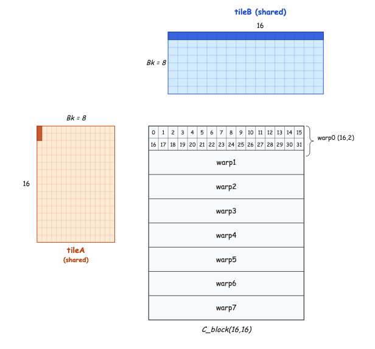
*그림 9. 16×2 warp*

warp0 기준 As에서 2 float, Bs에서 16 float를 읽음 (shared broadcast 덕). p-Loop 한 번에 `8 · (2 + 16) · 4 byte` 적재. 계산은 `32 · 64 · 2`. 컴퓨트/메모리 비율 `128 / (2 + 16)`. 일반화하면 warp `Wx × Wy`이면 `128 / (Wy + Wx)`. **`Wy + Wx`를 작게**하려면 `C_block(16, 16)` 안에서 warp `8×4` 또는 `4×8`. 본 글 `8×4`.

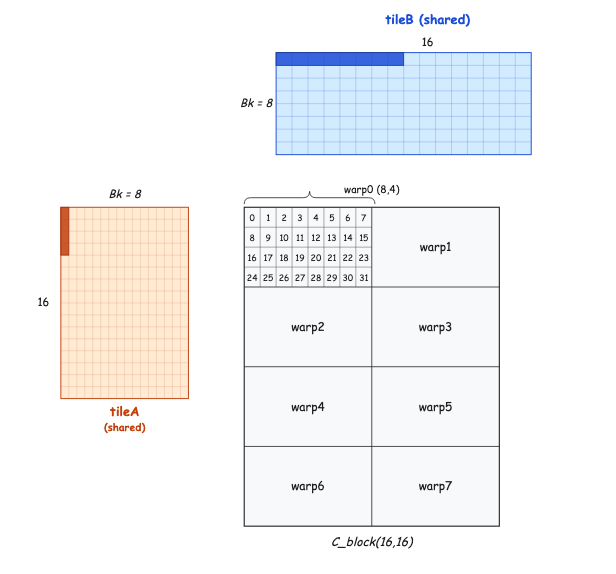
*그림 10. 8×4 warp*

`C_block(16, 16)`이 `2×4` warp로 나뉘고 각 warp가 `8×4` thread.

```cuda
int warpId = tid / WARP_SIZE;
int laneId = tid % WARP_SIZE;
constexpr int C_WARP_DIM_X = C_BLOCK_X / C_WARP_X;
int warpX = warpId % C_WARP_DIM_X;
int warpY = warpId / C_WARP_DIM_X;
int laneY = laneId / C_WARP_X;
int laneX = laneId % C_WARP_X;
int C_THREAD_Y = warpY * C_WARP_Y + laneY;
int C_THREAD_X = warpX * C_WARP_X + laneX;
```

| | Time (ms) | 효율 |
| --- | --- | --- |
| warpGEMM | 2.83 | 50.9% |

### 5. 벡터화 shared memory 적재: float4GEMM

float4로 한 명령에 4개 float 적재. 단 **데이터 주소가 float4 정렬되어야** 함. global의 A·B 열 수가 4 배수여야 함. shared의 tileA, tileB는 128·8 — OK.

p-Loop에서 shared 적재 방식 변경. 기존엔:

- As: **같은 열**에서 8개, 간격 `C_BLOCK_Y` 행
- Bs: 같은 행에서 8개, 간격 `C_BLOCK_X` 열

float4는 **연속 4 데이터** 만 읽기에, 같은 열에서 8 원소 적재라는 As 요구와 충돌.

**tileA 전치**

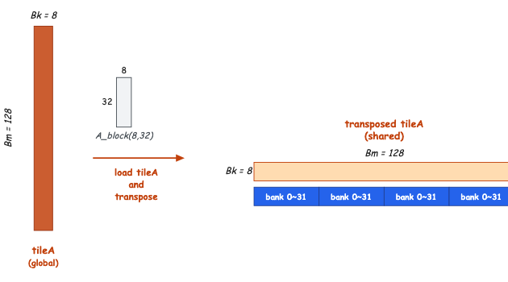
*그림 11. 전치된 tileA*

`As[Bk][Bm]`로 모양 변경, 쓸 때 인덱스 순서 교환:

```cuda
__shared__ float As[Bk][Bm];
// write
As[j][i] = (r < M && c < K) ? A[r * K + c] : 0.f;  // 전치
```

**벡터화 적재**

`regA`, `regB`가 각 한 행에서 연속 4개씩 두 그룹(간격 `4·C_BLOCK_Y` 또는 `4·C_BLOCK_X`).

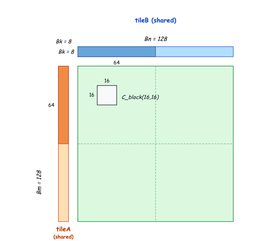
*그림 12. float4 적재의 외적*

```cuda
for (int i = 0; i < Tm / 4; ++i) {
    int r = (C_THREAD_Y + i * C_BLOCK_Y) * 4;
    FLOAT4(regA[i * 4]) = FLOAT4(As[p][r]);
}
for (int j = 0; j < Tn / 4; ++j) {
    int c = (C_THREAD_X + j * C_BLOCK_X) * 4;
    FLOAT4(regB[j * 4]) = FLOAT4(Bs[p][c]);
}
```

```cpp
#define FLOAT4(value) (reinterpret_cast<float4*>(&(value))[0])
```

**Ct → C** 좌표도 바뀜:

```cuda
for (int i = 0; i < Tm; ++i) {
    int r = r0 + 4 * C_THREAD_Y + i / 4 * 4 * C_BLOCK_Y + i % 4;
    for (int j = 0; j < Tn; ++j) {
        int c = c0 + 4 * C_THREAD_X + j / 4 * 4 * C_BLOCK_X + j % 4;
        if (r < M && c < N) C[r * N + c] = Ct[i][j];
    }
}
```

| | Time (ms) | 효율 |
| --- | --- | --- |
| float4GEMM | 2.39 | 60.3% |

### 6. Bank Conflict 해결: float4GEMMnoBC

전치된 As에 thread 0~7이 첫 행 8개를 읽어 As의 첫 열에 쓰는데, 같은 열이 같은 bank로 매핑 → conflict.

[B63 transpose](../B63_transpose_detail/README.md)에 다룬 두 방법:

- 패딩: `As[Bk][Bm+1]` — 그러나 129가 4 배수 아니어서 float4 불가 → 불가
- swizzling — 채택

**Swizzling**

요구: (a) warp가 conflict 없이 씀, (b) 연속 4 원소가 swizzling 후에도 연속.

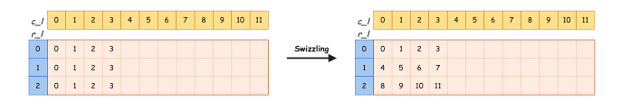
*그림 13. 처음 4열 재배치*

매핑: `c_p = r_l ⊕ (4 · c_l)`, `r_p = r_l`.

```cuda
// 쓰기
As[j][i ^ (4 * j)] = ...;
// 읽기
FLOAT4(regA[i * 4]) = FLOAT4(As[p][r ^ (4 * p)]);
```

| | Time (ms) | 효율 |
| --- | --- | --- |
| float4GEMMnoBC | 2.50 | 57.6% |

결과상 효율이 약간 하락(루프 언롤 작성과의 상호작용). 후속 작성 최적화 후엔 노 conflict가 더 빨라짐.

### 7. z-order로 메모리 transaction 감소: zorderGEMM

**Shared Memory 접근 메커니즘** (참고: CUDA Shared Memory 벡터화 명령 하의 접근 메커니즘)

shared 접근은 **memory transaction** 단위, 한 transaction 최대 **128 byte**. 한 warp가 128 byte를 넘으면 여러 transaction. bank conflict는 transaction 내에서 판정.

- **float**: thread당 4 byte, warp 128 byte → 1 transaction
- **float2**: thread당 8 byte, warp 256 byte → conflict 없으면 2 transaction. 분할은 0~15, 16~31의 half-warp 단위
- **float4**: thread당 16 byte, warp 512 byte → conflict 없으면 4 transaction. 분할은 0~7, 8~15, ... quarter-warp 단위

**Broadcast**

- float: warp 내 thread가 같은 데이터를 읽으면 broadcast
- float2: half-warp 단위 transaction. broadcast 트리거 조건은 다음 중 하나
  - 활성 i번 thread에 대해 `i XOR 1` thread가 비활성 또는 같은 주소
  - `i XOR 2` thread가 비활성 또는 같은 주소
- float4: quarter-warp 단위. broadcast 조건은 float2와 동일

**기본 C_block에서 quarter-warp = 8×1**

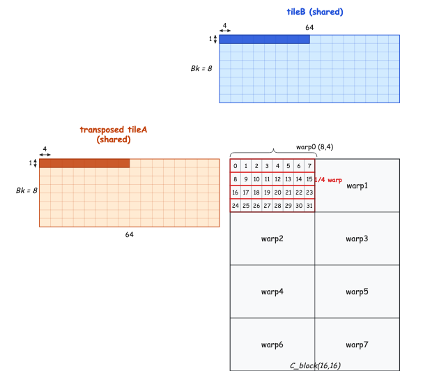
*그림 14. float4 적재, 8×1 quarter-warp*

tileA: quarter-warp가 같은 float4 → broadcast, warp 내 두 quarter-warp 합쳐 1 transaction × 2 → **2 transactions**
tileB: quarter-warp가 서로 다른 8 bank의 float4 → conflict 없지만 broadcast 미발생 → **4 transactions**

**z-order**

quarter-warp `4×2` 형태로 바꾸면 둘 다 broadcast 가능:

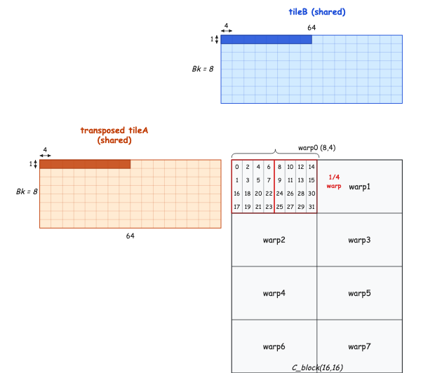
*그림 15. float4 적재, 4×2 quarter-warp*

tileA에선 i와 `i XOR 2` thread가 같은 원소 → 두 번째 조건 → **2 transactions**
tileB에선 i와 `i XOR 1` thread가 같은 원소 → 첫 번째 조건 → **2 transactions**

```cuda
int laneY = laneId % 2 + laneId / 16 * 2;
int laneX = laneId % 16 / 2;
```

| | Time (ms) | 효율 |
| --- | --- | --- |
| zorderGEMM | 2.45 | 58.8% |

### 8. 코드 작성 최적화: optimGEMM

zorderGEMM에서 더 손볼 곳:

**(1) 비트 연산으로 나눗셈·나머지 대체**

2의 거듭제곱에 대해 `x / 2^n` → `x >> n`, `x % 2^n` → `x & (2^n - 1)`.

코드 내 거의 모든 곱·나눗셈·나머지가 2 거듭제곱과의 연산이므로 모두 비트 연산으로.

→ 계산 시간 **1.85 ms, 효율 77.8%**, **약 19% 향상**!

**(2) 루프 최적화: 언롤 + 잉여 제거**

global → shared 적재 루프에서 `#pragma unroll`이 실제로 효과를 못 봄. 이유 (a) 내부 루프가 1회뿐이어서 (`Bk = A_BLOCK_X = 8`), (b) 외부 변수 `i = A_THREAD_Y`로 시작 → thread별로 다른 값이라 컴파일 타임에 횟수 결정 불가.

```cuda
int c = k + A_THREAD_X;
#pragma unroll
for (int i = 0; i < Bm; i += A_BLOCK_Y) {
    int r = r0 + i + A_THREAD_Y;
    As[A_THREAD_X][i + A_THREAD_Y] = (r < M && c < K) ? A[r * K + c] : 0.f;
}
```

→ 1.55 ms, 효율 **92.9%**, **약 15.1% 향상**.

**(3) 상수 최적화: 템플릿 인자**

`constexpr` 상수를 템플릿 인자로 통일. 본질적 차이 없음.

optimGEMM 전체 코드(가독성을 위해 일부 나눗셈을 비트로 풀지 않음):

```cuda
template<int Bm = 128, int Bn = 128, int Bk = 8, int blockSize = 256, int A_BLOCK_X = 8,
         int A_BLOCK_Y = 32, int B_BLOCK_X = 32, int C_BLOCK_X = 16, int C_BLOCK_Y = 16,
         int C_WARP_X = 8, int C_WARP_Y = 4, int C_WARP_DIM_X = 2, int Tm = 8, int Tn = 8>
__global__ void optimGEMM(float* A, float* B, float* C, const int M, const int K, const int N) {
    __shared__ float As[Bk][Bm];
    __shared__ float Bs[Bk][Bn];

    int r0 = blockIdx.y * Bm;
    int c0 = blockIdx.x * Bn;
    int tid = threadIdx.x;

    int A_THREAD_Y = tid / A_BLOCK_X;
    int A_THREAD_X = tid & (A_BLOCK_X - 1);
    int B_THREAD_Y = tid / B_BLOCK_X;
    int B_THREAD_X = tid & (B_BLOCK_X - 1);

    int warpId = tid / WARP_SIZE;
    int laneId = tid & (WARP_SIZE - 1);
    int warpX = warpId & (C_WARP_DIM_X - 1);
    int warpY = warpId / C_WARP_DIM_X;
    int laneY = (laneId & 1) + ((laneId >> 4) << 1);
    int laneX = (laneId & 15) >> 1;

    int C_THREAD_Y = warpY * C_WARP_Y + laneY;
    int C_THREAD_X = warpX * C_WARP_X + laneX;

    float Ct[Tm][Tn] = {0.0};
    float regA[Tm] = {0.0f};
    float regB[Tn] = {0.0f};

    for (int k = 0; k < K; k += Bk) {
        int c = k + A_THREAD_X;
#pragma unroll
        for (int i = 0; i < Bm; i += A_BLOCK_Y) {
            int r = r0 + i + A_THREAD_Y;
            As[A_THREAD_X][(i + A_THREAD_Y) ^ (A_THREAD_X << 2)] =
                (r < M && c < K) ? A[r * K + c] : 0.f;
        }

        int r = k + B_THREAD_Y;
#pragma unroll
        for (int j = 0; j < Bn; j += B_BLOCK_X) {
            c = c0 + j + B_THREAD_X;
            Bs[B_THREAD_Y][j + B_THREAD_X] = (r < K && c < N) ? B[r * N + c] : 0.f;
        }

        __syncthreads();

#pragma unroll
        for (int p = 0; p < Bk; ++p) {
#pragma unroll
            for (int i = 0; i < (Tm >> 2); ++i) {
                int r = (C_THREAD_Y + i * C_BLOCK_Y) << 2;
                FLOAT4(regA[i << 2]) = FLOAT4(As[p][r ^ (p << 2)]);
            }
#pragma unroll
            for (int j = 0; j < (Tn >> 2); ++j) {
                int c = (C_THREAD_X + j * C_BLOCK_X) << 2;
                FLOAT4(regB[j << 2]) = FLOAT4(Bs[p][c]);
            }
#pragma unroll
            for (int i = 0; i < Tm; ++i)
#pragma unroll
                for (int j = 0; j < Tn; ++j) Ct[i][j] += regA[i] * regB[j];
        }

        __syncthreads();
    }

#pragma unroll
    for (int i = 0; i < Tm; ++i) {
        int r = r0 + (C_THREAD_Y << 2) + ((i >> 2) << 2) * C_BLOCK_Y + (i & 3);
#pragma unroll
        for (int j = 0; j < Tn; ++j) {
            int c = c0 + (C_THREAD_X << 2) + ((j >> 2) << 2) * C_BLOCK_X + (j & 3);
            if (r < M && c < N) C[r * N + c] = Ct[i][j];
        }
    }
}
```

| | Time (ms) | 효율 |
| --- | --- | --- |
| optimGEMM | 1.55 | **92.9%** |

(no bank conflict 미적용 버전은 88.9%)

### 9. Double Buffering: doublebufferingGEMM

FFMA(계산)와 Load/Store가 병렬 가능한 점을 이용해 데이터 적재와 계산을 시간상 겹침.

**직렬 p-Loop**

기존 p-Loop는 적재 → 계산 → 동기화 순서. 직렬.

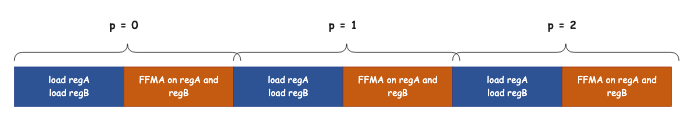
*그림 16. 직렬 p-Loop*

**Double Buffering p-Loop**

```cuda
float regA[2][Tm] = {0.0f};
float regB[2][Tn] = {0.0f};
```

p번째 반복(버퍼 2 사용 가정):

- **계산**: `regA[0] × regB[0]` (p-1 반복의 결과)
- **선적재**: `regA[1], regB[1]`에 p번째 데이터

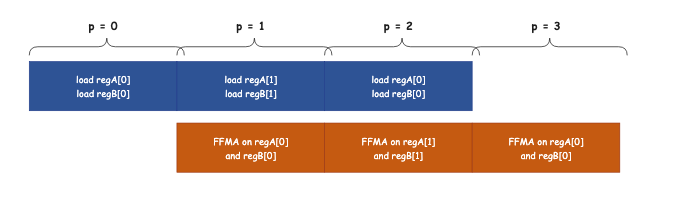
*그림 17. Double Buffering p-Loop*

```cuda
#pragma unroll
for (int p = 0; p < Bk + 1; ++p) {
    if (p > 0) {
#pragma unroll
        for (int i = 0; i < Tm; ++i)
#pragma unroll
            for (int j = 0; j < Tn; ++j) Ct[i][j] += regA[(p - 1) & 1][i] * regB[(p - 1) & 1][j];
    }

    if (p < Bk) {
#pragma unroll
        for (int i = 0; i < (Tm >> 2); ++i) {
            int r = (C_THREAD_Y + i * C_BLOCK_Y) << 2;
            FLOAT4(regA[p & 1][i << 2]) = FLOAT4(As[p][r ^ (p << 2)]);
        }
#pragma unroll
        for (int j = 0; j < (Tn >> 2); ++j) {
            int c = (C_THREAD_X + j * C_BLOCK_X) << 2;
            FLOAT4(regB[p & 1][j << 2]) = FLOAT4(Bs[p][c]);
        }
    }
}
```

**Double Buffering K-Loop**

두 shared 버퍼로 global memory 지연을 덮음.

```cuda
__shared__ float As[2][Bk][Bm];
__shared__ float Bs[2][Bk][Bn];
```

K-Loop도 동일 구조. 첫 반복은 사전 적재, k=0은 루프 밖에 둠.

전체 코드는 길어서 핵심만 보면 K-Loop가 다음과 같이 짜입니다.

```cuda
int buffer_id = 0;
// k=0 사전 적재 ...
__syncthreads();

for (int k = Bk; k < K + Bk; k += Bk) {
    // double-buffer p-Loop (As[buffer_id], Bs[buffer_id] 사용)
    // ...

    if (k < K) {
        // k번째 tileA, tileB → As[buffer_id^1], Bs[buffer_id^1]
        __syncthreads();
    }
    buffer_id ^= 1;
}
```

성능:

| | Time (ms) | 효율 |
| --- | --- | --- |
| doublebufferingGEMM | 1.49 | **96.6%** |

**전체 비교**

| | Time (ms) | 효율 |
| --- | --- | --- |
| cublasSgemm | 1.44 | 100% |
| naiveGEMM | 13.85 | 10.4% |
| blockTileGEMM | 2.86 | 50.3% |
| threadTileGEMM | 2.85 | 50.5% |
| warpGEMM | 2.83 | 50.9% |
| float4GEMM | 2.39 | 60.3% |
| float4GEMMnoBC | 2.50 | 57.6% |
| zorderGEMM | 2.45 | 58.8% |
| optimGEMM | 1.55 | 92.9% |
| doublebufferingGEMM | 1.49 | 96.6% |

