# Worklog - H100에서 cuBLAS급 성능을 향한 GEMM 최적화

> 원문: https://hamzaelshafie.bearblog.dev/worklog-optimising-gemm-on-nvidia-h100-for-cublas-like-performance-wip/

*2026년 1월 12일*

> 🚧 작업 진행 중(Work in progress). 잘못된 부분을 발견하면 LinkedIn 으로 알려주기 바란다.

## 소개

행렬 곱셈은 현대 딥러닝의 핵심에 자리한다. transformer 든 CNN 이든, 심지어 단순한 MLP 든 결국 모든 것은 GEMM 으로 환원된다. GPU 는 이 연산을 대규모로 수행하도록 만들어졌고, cuBLAS 같은 라이브러리는 마지막 명령어 하나까지 튜닝한 커널로 성능의 기준선을 세운다.

이 글에서는 NVIDIA H100 위에서 그 경로를 바닥부터 다시 쌓아 올린다. 가장 기본적인 커널에서 출발해 shared memory 로의 tiling, register blocking, 벡터화, warp tiling, 그리고 Tensor Core 와 Tensor Memory Accelerator 같은 Hopper 전용 기능까지 최적화를 차례로 얹어 나간다. 이 프로젝트는 [Pranjal Shankhdhar](https://cudaforfun.substack.com/p/outperforming-cublas-on-h100-a-worklog) 와 [Simon Boehm](https://siboehm.com/articles/22/CUDA-MMM) 의 훌륭한 작업에서 영감을 받았으며, 거기에 필자 나름의 기여를 더해 전체 최적화 경로를 탐색하는 동시에 결과를 재현할 수 있는 일관된 저장소를 제공하려고 한다. 처음 일곱 개 커널에서는 FP32 정밀도만 사용한다. 이 단계에서는 GEMM 성능 튜닝의 기반이 되고 대체로 아키텍처에 독립적인 기본 최적화 기법에 집중하고자 했다. FP32 를 쓰면 Nsight Compute 로 디버깅하기 쉽고 PTX 와 SASS 를 들여다보기도 깔끔하다. 두 번째 단계로 넘어가 Tensor Core 와 H100 전용 기능을 활용하기 시작하면 mixed precision 으로 전환한다. 그 시점부터 모든 벤치마크는 Tensor Core 를 켠 cuBLAS 와 비교하며, 첫 번째 단계에서는 순수 FP32 모드로 동작하는 cuBLAS 와 비교한다(저장소에는 mixed precision 구현도 함께 들어 있다).

목표는 단순히 날것의 속도가 아니다. 각 변경이 실제로 무엇을 벌어다 주는지, 단계마다 프로파일러가 무엇을 말해 주는지, 그리고 커널이 naive 한 형태에서 고도로 튜닝된 형태로 어떻게 진화하는지를 보는 것이다. 마지막에는 손으로 짠 CUDA 가 cuBLAS 에 얼마나 근접할 수 있는지, 그리고 고정된 행렬 크기에서는 그것을 넘어설 수도 있는지를 측정한다.

전체 코드는 필자의 GitHub 에 있다. FP32 와 BF16+FP32 mixed precision 을 모두 지원하는 코드가 [GitHub](https://github.com/HamzaElshafie/h100_gemm) 에 공개되어 있다.

그럼 시작해 보자.

## H100 아키텍처

코드로 들어가기 전에, GPU 내부 하드웨어 구성 요소에 대한 명확한 멘탈 모델을 갖춰 두면 도움이 된다. GPU 안의 메모리 계층, on-chip 메모리와 off-chip 메모리가 크기와 지연 시간 면에서 어떻게 다른지, 그리고 Hopper 아키텍처 계열에서 새로 도입된 구성 요소가 무엇인지를 이해하면 이후의 모든 내용을 훨씬 쉽게 따라갈 수 있다. 이 절에서는 CUDA 프로그래밍 모델을 아직 다루지 않는다. 대신 커널을 하나씩 진행하면서 개념을 점진적으로 소개하려 한다. 이 글은 worklog 에 가깝기 때문이다. 따라서 이 절은 일종의 입문서 역할을 한다. 아래 그림은 Aleksa 의 [글](https://www.aleksagordic.com/blog/matmul#cpt1) 에서 가져와 확장한 것으로, 전체 아키텍처를 상세히 보여준다.

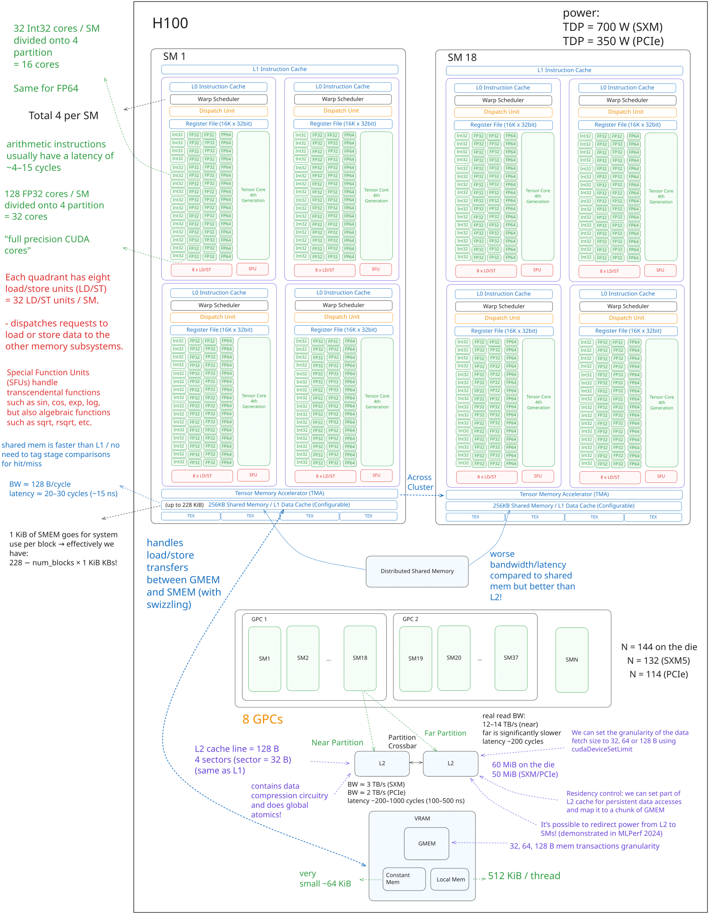

최상위 수준에서 H100 은 여러 개의 **Graphics Processing Cluster**(GPC)로 구성된다. 총 8 개의 GPC 가 있고 각 GPC 는 18 개의 **Streaming Multiprocessor**(SM)를 담는다. GPC 네 개가 하나의 L2 파티션에 직접 연결되고 나머지 네 개가 두 번째 파티션에 연결된다. 이 SM 들은 칩 위의 주요 연산 유닛과 일부 "on-chip" 메모리 구성 요소를 담고 있다. H100 의 SXM 모델은 132 개의 SM 을 가지며(여기서 사용하는 것이 이 모델이다), PCIe 모델은 114 개다. 8 \* 18 = 144 이므로 사실 132 개보다 많아야 하지만, 그 144 는 완전한 GH100 다이에 해당하는 수치다. 실제로는 일부 SM 이 fuse off 되어 SXM 변종에는 132 개의 동작하는 SM 이 남는다. H100 같은 현대 GPU 는 거대하고 극도로 복잡한 실리콘 조각이어서 결함 없이 제조하는 것이 사실상 불가능하다. SM 하나만 불량이어도 칩 전체를 못 쓰게 될 수 있다. 이런 낭비를 피하기 위해 NVIDIA 는 결함이 있거나 부분적으로 결함이 있는 SM 을 fuse off 해서, 더 적은 SM 으로도 칩이 정상 동작하도록 만든다. 이 과정은 제조 수율을 높여 준다. 다음은 SM 내부를 좀 더 자세히 본 모습이다.

SM 내부에는 위 그림에서 보듯 네 개의 파티션이 있다. 각 SM 은 다음과 같은 핵심 자원을 포함한다.

- **CUDA core:** 표준 부동소수점 연산(FLOPS)과 정수 연산(IOPS)을 담당한다.

  - FP32(full-precision) CUDA core 128 개로, 네 파티션에 논리적으로 나뉜다(파티션당 32 개).
  - 정수 및 제어 연산 전용 INT32 core 64 개(파티션당 16 개).
  - 고정밀 연산에 쓰이는 FP64(double-precision) core 64 개(파티션당 16 개).

- **4 세대 Tensor Core:** 각 SM 에 4 개씩 들어 있는 전용 유닛이다. 고처리량 matrix-multiply-accumulate 연산을 위해 설계되었으며, 현대 GPU 워크로드의 최대 성능을 내는 데 필수적이다.

- **Load/Store(LD/ST) 유닛:** SM 과 메모리 계층 사이에서 데이터를 옮기는 역할을 한다.

- **SFU 유닛:** `sin`, `cos`, `sqrt`, `exp` 같은 복잡한 수학 연산을 처리해 그 작업을 CUDA core 에서 덜어낸다. 각 SM 파티션이 자체 SFU 를 가지므로 이런 연산이 일반 산술 연산과 병렬로 실행될 수 있다. SASS 명령어 중 `MUFU` 로 시작하는 것(예: `MUFU.SQRT`, `MUFU.EX2`)을 보게 된다면 그것은 SFU 가 실행하는 것이다.

- **Dispatch 유닛:** warp scheduler 와 실행 파이프라인 사이의 다리 역할을 한다. warp scheduler 가 warp 와 그 다음 명령어를 고르면, dispatch 유닛이 그 명령어를 SM 내부의 적절한 기능 유닛으로 보낸다. 각 SM 파티션이 자체 dispatch 유닛을 가지므로 서로 다른 warp 의 여러 명령어를 서로 다른 실행 유닛으로 동시에 내보낼 수 있다.

- **Warp scheduler:** 각 SM 은 파티션마다 하나씩 네 개의 warp scheduler 를 가지며, 각각 warp — 32 개 thread 의 묶음(뒤에서 더 다룬다!) — 에 명령어를 발행하는 일을 맡는다. warp scheduler 는 클럭 사이클당 단 하나의 warp 에만 하나의 명령어를 발행할 수 있다. 따라서 네 파티션을 합치면 SM 은 사이클당 최대 네 개의 warp 명령어를 발행할 수 있고, 이는 어느 순간에나 128 개 thread 가 병렬로 실행될 수 있다는 뜻이다. 모든 scheduler 를 완전히 활용하려면 block 당 활성 warp 가 충분해서 어느 scheduler 도 놀지 않도록 해야 한다. block 당 thread 수를 128 개 미만으로 띄우는 것을 일반적으로 피하는 이유가 바로 이것이며, 그래야 모든 scheduler 가 다룰 warp 를 갖게 된다. 실제로는 SM 하나가 여러 thread block 을 올릴 수 있고 필요하면 다른 block 의 warp 를 가져올 수도 있지만, SM 이 단 하나의 block 만 수용할 자원밖에 없는 경우를 생각하면 여전히 염두에 둘 만한 휴리스틱이다.

이제 메모리 계층을 보자. 각 메모리 종류가 GPU 내부 물리적으로 어디에 있고 접근 지연 시간이 어떻게 다른지 살펴본다. 역시 Aleksa 의 [글](https://www.aleksagordic.com/blog/matmul#cpt1) 에 있는 피라미드 그림을 가져왔다.

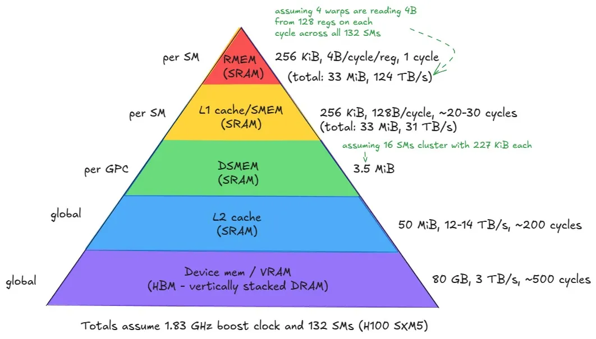

계층의 가장 아래, 즉 가장 크고 느린 메모리에서 시작해 가장 작고 빠른 메모리로 올라가 보자.

- **Global Memory(GMEM) / Device Memory(VRAM):** GPU 패키지 위에 올라간 큰 off-chip 메모리로, 적층된 HBM3 DRAM 으로 구성된다. 일반적으로 SM 과 같은 다이에 있지 않지만, H100 같은 현대 데이터센터 GPU 에서는 지연 시간을 줄이고 대역폭을 늘리기 위해 GPU 다이와 함께 공유 [interposer](https://en.wikipedia.org/wiki/Interposer) 위에 놓인다. **Dynamic RAM(DRAM)** 셀을 사용하는데, 이는 캐시와 register 에 쓰이는 **Static RAM(SRAM)** 보다 느리지만 집적도가 높다. 이 메모리는 용량이 가장 크다. 예를 들어 H100 은 80 GiB(≈ 687 billion bits)를 제공한다. 하지만 지연 시간도 가장 커서 약 500 클럭 사이클이다. 모든 SM 은 L2 캐시를 통해 global memory 에 접근하며, 이곳이 모든 텐서/행렬의 저장소 역할을 한다. CUDA 프로그래밍 모델의 GMEM(뒤에서 이야기한다)을 구현하는 데 쓰이고, register file 에서 넘쳐 local memory 로 spill 된 register 데이터를 저장하는 데도 쓰인다.

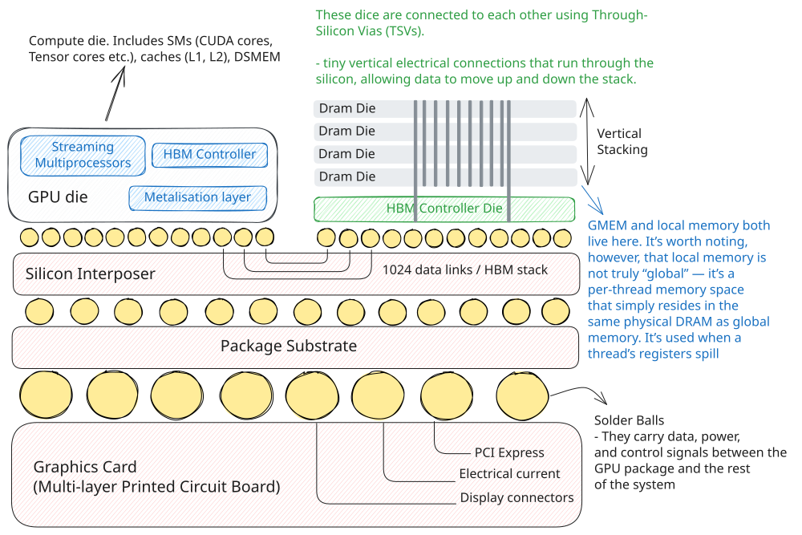

- **L2 캐시:** global memory 위에는 L2 캐시가 있다. 모든 SM 이 공유하는 큰 on-chip 캐시(SRAM 으로 만들어졌다)다. 연산 core 와 느린 off-chip HBM 사이의 주된 다리 역할을 하며, 최근 접근한 데이터를 캐싱해 지연 시간을 줄인다. 물리적으로 두 부분으로 분할되어 있고, 각 SM 은 한쪽 파티션에 직접 연결되며 다른 쪽에는 crossbar 를 통해 간접적으로 연결된다.

- **Distributed Shared Memory(DSMEM):** 메모리 계층에 새로 들어온 것이다. DSMEM 은 같은 GPC 안에 있는 여러 thread block 이 SM 을 넘나들며 데이터를 직접 공유할 수 있게 한다. 전통적인 shared memory 를 단일 SM 바깥으로 확장해, 하나의 thread block cluster 안의 최대 16 개 block 사이 협력을 가능하게 한다. L2 보다는 지연 시간이 낮지만 SM 별 shared memory 와 L1 보다는 당연히 높다.

- **Shared Memory(SMEM) & L1 캐시:** 둘은 on-chip 의 같은 물리적 저장소에 공존하므로 함께 묶었다. 역시 SRAM 셀로 만들어져 매우 빠르고, 피라미드 아래쪽의 다른 메모리들보다 지연 시간이 훨씬 낮고 대역폭이 높다. 둘을 합친 최대 크기는 256 KiB 이고 메모리 대역폭은 31 TB/s 다. L1 데이터 캐시는 SM 의 LD/ST 유닛이 접근한다. 이 256 KiB 는 shared memory 를 키우고 L1 캐시를 줄이거나 그 반대로 조정할 수 있다. 다만 shared memory 에 할당할 수 있는 최대치는 228 KiB 인데, L1 캐시를 위한 메모리도 충분히 남겨 두어야 하기 때문이다. 사실 위의 H100 아키텍처 그림에서 보듯 이 228 KiB 도 정확한 값은 아니다. 어차피 block 당 1 KiB 의 SMEM 이 시스템 용도로 쓰이므로, 실질적으로 설정 가능한 최대 크기는 `228 − num_blocks * 1 KiB` 가 남는다.

- **Register Memory(RMEM):** 마지막으로 메모리 계층의 가장 아래이자 피라미드의 꼭대기에는 register 가 있다. 단일 thread 가 다루는 값을 저장한다. register 는 각 thread 에 사적이지만 한 가지 예외가 있다. thread 는 같은 warp 안의 thread 에 한해 다른 thread 의 register 를 읽을 수 있다. 이는 [warp level shuffle primitive](https://developer.nvidia.com/blog/using-cuda-warp-level-primitives/) 로 가능하다. thread 간 극도로 빠른 통신을 가능하게 하므로 reduction 커널 같은 곳에서 자주 볼 수 있다. register 는 극도로 빨라서 실효 대역폭이 124 TB/s 수준이고 지연 시간은 대략 한 클럭 사이클이다. thread 의 register 사용량이 가용 register file 을 넘어서면 컴파일러는 값을 local memory 로 spill 하는데, 이는 global memory 에 있으므로 훨씬 느리다. CPU 프로그래밍과 마찬가지로 register 는 CUDA C/C++ 수준에서 직접 조작하지 않는다. PTX 에서만 보이고 궁극적으로는 컴파일 과정에서 ptxas 가 할당한다(아래 Compilation Story 참고). 컴파일러의 목표 중 하나는 thread 당 register 사용량을 충분히 낮게 유지해 더 많은 thread block 이 동시에 SM 에 상주할 수 있게 하는 것이다. register pressure 가 높으면 occupancy 가 떨어지기 때문이다.

- **Tensor Memory Accelerator(TMA):** Hopper 아키텍처와 함께 도입되었으며, global memory 와 shared memory 사이, 그리고 thread block cluster 내부의 shared memory 들 사이에서 async 데이터 전송을 가능하게 한다. 또한 shared memory bank conflict 를 막기 위한 swizzle 도 자동으로 수행해, 이전에는 개발자가 직접 관리해야 했던 복잡한 데이터 이동과 레이아웃 패턴을 추상화해 준다.

> 📖 **Compilation Story**\
> CUDA 프로그램이 소스 코드에서 최종 실행에 이르는 여정은 **NVCC** 컴파일러 드라이버가 조율하는 다단계 컴파일 과정이 지배한다. NVCC 컴파일러 드라이버는 프로그램을 Host Code(CPU)와 Device Code(GPU)로 나누며 이 과정을 조율한다.\
> \
> Device Code 는 먼저 **PTX**(Parallel Thread Execution)로 컴파일된다. "피-티-엑스"라고 읽는다(적어도 필자는 그렇게 읽는다 :)). PTX 는 NVIDIA 의 **Virtual ISA**(Instruction Set Architecture)로, 아키텍처에 독립적인 코드의 중간 표현(IR)을 제공한다. 그다음 **ptxas** 어셈블러가 PTX 코드를 받아 필요한 최적화를 수행하고 이를 **SASS**(Streaming ASSembler)라는 Native ISA 로 번역한다. 사람이 읽을 수 있는 형태로 코드를 쓸 수 있는 가장 낮은 수준의 포맷이다. SASS 코드는 다른 메타데이터와 함께 **CUBIN**(CUDA Binary)으로 묶이는데, 이는 특정 GPU 아키텍처용 실행 컨테이너다. 마지막으로 NVCC 는 하나 이상의 CUBIN 을 원본 PTX 와 함께 Fat Binary 로 묶고, 이것이 CPU 바이너리 코드와 나란히 최종 실행 파일 안에 내장된다.\
> \
> PTX 를 함께 넣는 것은 상위 호환성에 결정적이다. Fat Binary 가 일치하는 CUBIN 이 없는 미래의 GPU 에서 실행되면, 런타임이 내장된 PTX 로 **Just-In-Time**(JIT) 컴파일을 수행해 필요한 SASS 를 생성하고 실행을 보장한다. 커널 2 와 5 에서 PTX 와 SASS 를 분석하며 이것들이 왜 유용한지 살펴볼 것이다.
>
> 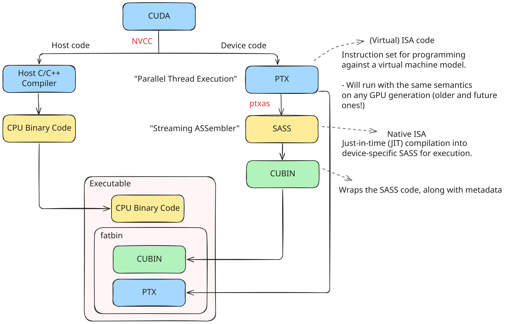

이제 탄탄한 멘탈 모델을 갖췄으니, 지금까지 이야기한 모든 것을 하나로 모은 H100 아키텍처의 전체 그림으로 이 절을 마무리하자.

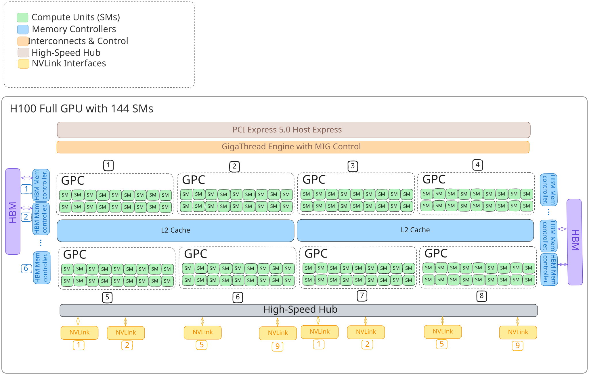

## Kernel 1: Naive

CUDA 프로그래밍 모델에서 연산은 두 단계 계층으로 조직된다. CUDA 커널을 호출할 때마다 새로운 grid 가 만들어지고, grid 는 여러 block 으로 구성된다. 각 block 안에는 thread 가 1D, 2D, 3D 어떤 방식으로 배치되든 관계없이 총 1024 개까지 들어갈 수 있다. 즉 `blockDim.x * blockDim.y * blockDim.z <= 1024` 다. grid 안의 모든 thread 는 같은 커널 함수를 실행하며, 자기 자신을 구별하고 처리할 데이터의 적절한 부분을 식별하기 위해 thread 인덱스에 의존한다. 일반적으로 하드웨어 효율성 측면에서 thread block 의 각 차원의 thread 수를 32 의 배수로 두는 것이 권장된다. 이는 곧 소개할 warp 라는 개념과 맞아떨어진다. 지금은 warp 가 32 개 thread 의 묶음이라는 것만 기억해 두면 되고, 차원을 거기에 맞추는 것이 유리하다. 커널은 **SIMT**(Single Instruction, Multiple Threads) 실행 모델을 따라 단일 thread 의 관점에서 작성된다. 따라서 CUDA 프로그래밍은 **SPMD**(Single Program, Multiple Data) 패러다임의 한 사례다.

커널 안의 thread 가 `__device__` 함수를 호출하면 그 thread 자신이 함수를 실행한다. 그 함수는 자신을 호출한 thread 만 알고 있다. 기본적으로 C++ 의 일반 함수와 같지만 GPU thread 하나 안에서 일어나는 것이며, 이런 함수 인스턴스 수천 개가 병렬로 돌아간다고 상상하면 된다.

`__global__` 함수가 커널이다. GPU 실행용으로 컴파일되지만 CPU(host)에서 실행된다. 커널 실행은 block 들의 grid 를 만들고, 그 block 안의 각 thread 가 커널 코드를 독립적으로 실행하기 시작한다.

모든 thread block 은 입력의 서로 다른 부분을 다루므로 임의의 순서로 실행될 수 있다. 따라서 block 의 실행 순서나 block 안의 어떤 thread 가 먼저 실행될지에 대해 절대 가정해서는 안 된다.

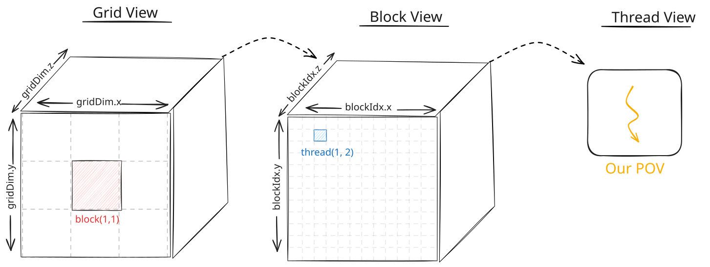

CUDA 프로그래밍 모델에 대한 새로운 이해를 기저 하드웨어의 멘탈 모델과 연결해 보자. 다음 그림은 단일 thread 의 관점을 시각화해, 그 thread 가 커널과 하드웨어 안에서 어디에 위치하는지, 서로 다른 메모리 공간과 어떻게 상호작용하는지, 그리고 전체 grid 구조에 어떻게 들어맞는지를 보여준다. L1 과 L2 캐시는 하드웨어가 관리하고 우리가 직접 제어하지 않으므로 의도적으로 뺐다.

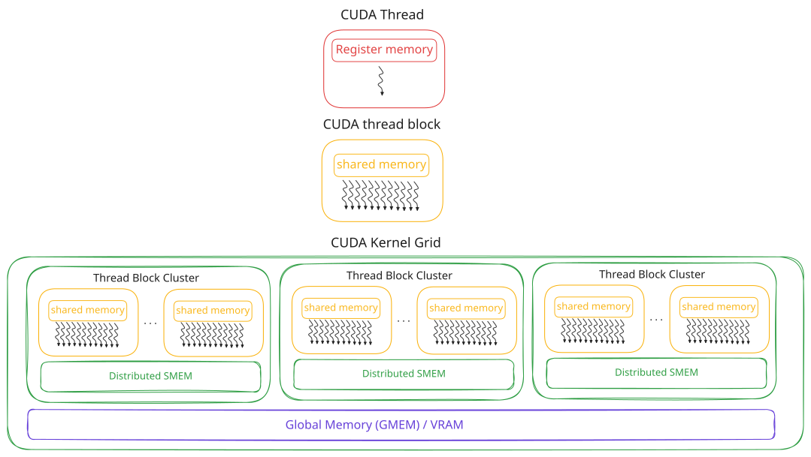

이 첫 번째 커널에서는 grid 안 block 의 각 thread 가 정확히 C 의 원소 하나를 계산하도록 배정한다. 각 thread 는 자기 좌표를 가지고 공유 차원 N 을 따라 A 의 해당 행을 훑는다(대부분의 공식 자료는 여기에 K 를 쓰지만, 필자는 이미 모든 커널에서 N 으로 정해 두었으므로 일관성을 위해 그대로 간다). 동시에 그 thread 는 B 의 대응하는 열을 아래로 훑으며 곱들을 누적한다. 루프가 끝나면 결과를 같은 좌표의 C 에 다시 쓴다.

*스포일러*: thread 결과와 출력을 이렇게 1 대 1 로 대응시키는 것은 사실 가장 효율적이지 않다(그렇게 짐작했다면 맞다). 뒤의 커널에서는 thread 하나가 출력의 여러 원소를 계산하게 하겠지만, 지금은 넘어가자.

아래는 이것이 어떻게 동작하는지를 보여주는 간단한 시각화이며, 단일 thread 관점의 예시도 포함되어 있다.

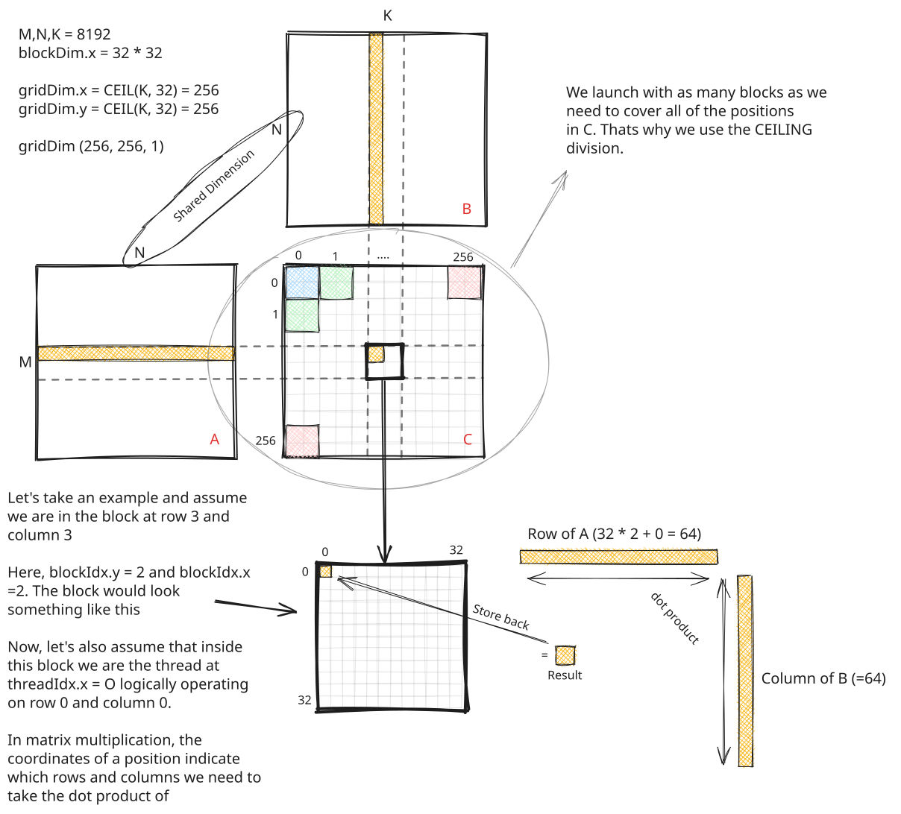

CUDA 프로그래밍 모델이 2D 좌표 (x, y) 를 지원함에도 우리는 block 을 1D 로 띄운다는 점에 주목하자. Simon 의 작업(Kernel 2)에서 그는 2D 실행에서 1D 실행 + 재매핑으로 바꾸면 병합된(coalesced) global memory 접근을 얻는 데 도움이 된다고 언급한다. 아이디어는 1D block 을 띄운 뒤 `%` 와 `/` 를 써서 `threadIdx.x` 를 2D 좌표로 재해석하는 것이다.

그런데 재매핑을 쓴 1D 실행과 일반적인 2D 실행 두 방식을 모두 테스트해 보니 성능이 동일했다. Simon 은 자기 버전에서 속도 향상을 보고했기 때문에 처음에는 이것이 의아했다. 핵심 차이는 Simon 의 naive 커널이 행렬 A 를 열 방향으로 접근했다는 점이다. 이는 비병합(non-coalesced) 패턴이다. 반면 그의 coalesced 커널은 `blockIdx.x` 와 `threadIdx.x` 가 열이 아니라 행에 대응하도록 해서 A 를 행 방향으로 접근했다. 이는 필자의 버전과 정반대다. 필자의 구현에서는 naive 커널조차 이미 A 를 병합된 row-major 방식으로 접근하므로, 두 버전이 자연스럽게 같은 효율을 낸다. 재미있게도 이건 아마 아주 기초적인 내용이었겠지만, 처음에는 coalescing 이 재매핑 트릭에서 나온다고 생각해서 한동안 헷갈렸다.

그러니까 Simon 의 속도 향상은 메모리 접근 패턴을 고친 데서 나온 것이지, 1D 와 2D block 레이아웃 자체에서 나온 것이 아니다. 필자의 naive 커널은 이미 병합된 로드를 쓰므로 실행 구성(launch configuration)은 차이를 만들지 않는다. 그래도 여기서는 1D 실행 + 재매핑 방식을 쓰겠다. memory coalescing 을 이야기하기 자연스러운 계기가 되기 때문이고, 그의 버전이 어떻게 비병합 패턴으로 이어지는지도 보여줄 것이다. 먼저 warp 가 무엇인지 정의하자.

각 SM 은 thread block 안의 thread 들을 32 개씩 묶어 warp 로 만든다. warp 는 스케줄링의 단위로, warp scheduler 는 한 번에 하나의 warp 에만 명령어를 발행할 수 있으며 그 warp 안의 32 개 thread 전부가 같은 명령어를 lockstep 으로 실행한다. block 은 1D 배열로(row-major 순서로) 선형화된 뒤 연속된 32 개 thread 씩 나뉜다. warp 0 은 thread 0–31, warp 1 은 32–63 을 실행하는 식이다.

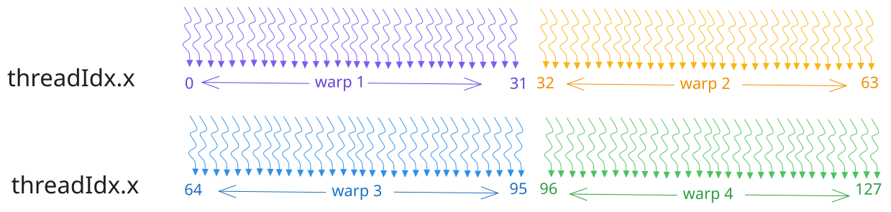

이 커널의 코드는 다음과 같다.

``` code-block
template <const uint BLOCK_SIZE>
__global__ void sgemm_coalesced(const float* __restrict__ A, const float* __restrict__ B, float* __restrict__ C,
    int M, int N, int K, float alpha, float beta) {
        // flattened IDs remapping
        uint row = blockIdx.y * BLOCK_SIZE + (threadIdx.x / BLOCK_SIZE);
        uint column = blockIdx.x * BLOCK_SIZE + (threadIdx.x % BLOCK_SIZE);

        if (row < M && column < K) {
            float cumulative_sum = 0.0f;
            for (int n = 0; n < N; n++) {
                cumulative_sum += A[row * N + n] * B[n * K + column];
            }
            C[row * K + column] = (alpha * cumulative_sum) + (beta * (C[row * K + column]));
        }
    }
```

앞서 말한 재매핑이 여기서 일어난다. block 을 2 차원으로 띄웠다면 `threadIdx.x % BLOCK_SIZE` 와 `threadIdx.x / BLOCK_SIZE` 로 계산하는 대신 `threadIdx.x` 와 `threadIdx.y` 를 그대로 썼을 것이다.


필자는 이 재매핑을, 영화관에서 몇 번째 줄 몇 번째 자리인지는 모른 채 좌석 번호만 받은 상황으로 상상하기를 좋아한다. 한 줄에 여섯 자리가 있고 7 번 좌석을 받았다고 하자. 필자의 그림은 1 부터 시작하는 번호를 쓰므로 먼저 1 을 빼서 0 부터 시작하는 체계로 바꾼다. `6 = 7 - 1`. 줄당 좌석 수로 나누면 줄 인덱스가 나온다. `6 / 6 = 1` 이고 이는 1 부터 세는 체계에서 2 번째 줄에 해당한다. 나머지는 그 줄 안에서의 자리를 알려 준다. `6 % 6 = 0` 이고 이는 1 부터 세면 1 번 자리다. 즉 7 번 좌석은 두 번째 줄의 첫 번째 자리다. 줄당 좌석 수로 나누면 완전히 건너뛴 줄이 몇 개인지 알 수 있고, 나머지는 그 줄 안에서의 자리 위치를 준다.

``` code-block
uint row = blockIdx.y * BLOCK_SIZE + (threadIdx.x / BLOCK_SIZE);
uint column = blockIdx.x * BLOCK_SIZE + (threadIdx.x % BLOCK_SIZE);
```

32 개 thread 로 이루어진 각 warp 는 다음과 같이 global memory 로드를 병렬로 실행한다.

``` code-block

cumulative_sum += A[row * N + n] * B[n * K + column];
```

메모리 명령어는(global 이든 shared 든) 주소가 warp 안에서 어떻게 분포하는지에 따라 재발행이 필요할 수 있다. 아직 shared memory 를 (프로그래밍 측면에서) 소개하지 않았으니 **global memory** 에 집중하자.

warp 가 로드를 실행할 때 하드웨어는 32 개 thread 가 **연속된 메모리 위치**에 접근하는지 확인한다. 최선의 경우는 모든 thread 가 연속된 주소를 읽는 경우로, 이때 하드웨어는 32 개 요청을 단일 transaction 으로 병합할 수 있다.

global memory 는 device DRAM 에 있고, DRAM 은 32, 64, 128 바이트 단위로 접근된다. transaction 이 적을수록 효율이 높다. 여기서는 FP32 로드(thread 당 4 바이트) 기준으로 설명하겠다. 각 thread 의 4 바이트 로드가 저마다 32 바이트 transaction 을 필요로 한다면 처리량은 8 배 떨어진다.\
예를 들어:

- thread 0 이 위치 $n$ 을 읽고, thread 1 이 $n + 1$, thread 2 가 $n + 2$, … 이렇게 thread 31 이 $n + 31$ 을 읽는다면, 32 개 로드 전부가 단일 메모리 transaction 으로 병합될 수 있다($4\times 32 = 128B$).
- 접근 패턴이 불규칙하면 여러 transaction 이 필요해 대역폭이 낭비되고 처리량이 떨어진다.

이 coalesced 커널의 global memory 접근 패턴과, 비병합 커널이라면 어떤 모습일지를 비교해 분석해 보자.

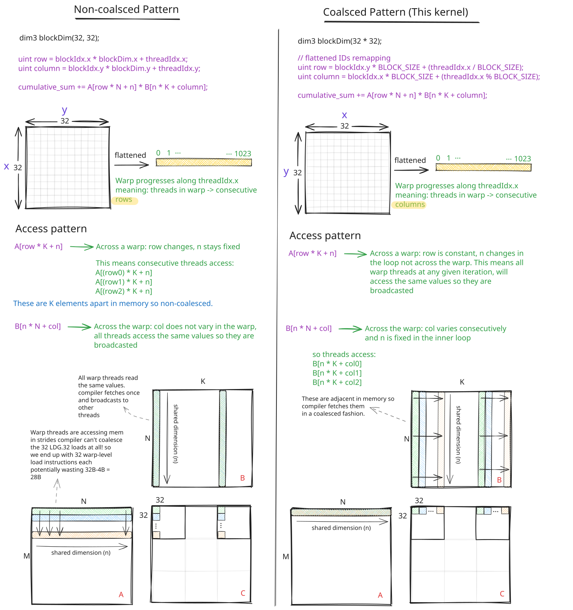

이 커널을 돌리면 **4.2 TFLOP/s** 의 처리량이 나오고, 이는 FP32 cuBLAS 커널 성능 대비 약 **8.2%** 다. 흔히 Speed of Light(SoL)라 불리는, 하드웨어가 이론적으로 낼 수 있는 성능과는 아직 한참 멀다. Speed of Light 는 순전히 물리와 칩 설계에 근거해 GPU 가 낼 수 있는 연산 처리량의 이론적 상한을 말한다. Tensor Core 워크로드의 경우 이 천장은 `perf = freq_clk_max * num_tc * flop_per_tc_per_clk` 로 주어진다([H100 SXM5 에서 Peak BF16 Tensor Core 989 TFLOP/s, peak FP32 66.9 TFLOP/s](https://resources.nvidia.com/en-us-hopper-architecture/nvidia-h100-tensor-c)).

이 수치는 보통 고정값으로 제시되지만 실제로는 전혀 일정하지 않다. GPU 가 지속할 수 있는 실제 클럭 주파수에 따라 움직이고, 그 주파수 자체가 전력과 온도 한계에 따라 변한다. GPU 가 전력 상한에 다가가면 전압 레귤레이터가 전압을 낮추고 클럭 속도가 떨어지며 실효 SoL 도 함께 떨어진다. 이 현상을 **power throttling** 이라고 한다.

Horace He 가 [간단한 matmul 벤치마크](https://www.thonking.ai/p/strangely-matrix-multiplications)로 이를 아름답게 탐구했다. PyTorch 의 큰 matmul 은 약 258 TFLOPs 를 냈는데, 같은 연산을 CUTLASS 프로파일러 안에서 돌리니 약 288 TFLOPs 가 나와 10–11% 개선된 것처럼 보였다. 진짜 커널 수준의 속도 향상처럼 보였다. 그러나 CUTLASS 커널을 Python 에서 바인딩해 같은 입력으로 돌리자 그 이득은 사라졌다. 유일한 차이는 CUTLASS 프로파일러가 텐서를 정수로 초기화하는 반면 PyTorch 는 난수를 쓴다는 점이었다.

이것이 중요한 이유는 칩에서 전력이 소비되는 방식에 뿌리가 있다. 정적 전력은 트랜지스터를 켜 두는 데 쓰이고, 동적 전력은 트랜지스터가 상태를 바꿀 때마다 쓰인다. 난수는 수십억 개 트랜지스터에서 무질서한 비트 플립을 일으켜 동적 전력을 높이고 throttling 을 촉발한다. 0 이나 단순한 정수 패턴처럼 예측 가능한 값은 훨씬 적은 비트를 뒤집어 동적 전력을 낮게 유지하고, GPU 가 더 높은 클럭을 유지하도록 해 준다. 다시 말해 커널이 "더 빨라" 보이는 것은 코드가 더 효율적이어서가 아니라 하드웨어가 전기적으로 덜 스트레스를 받기 때문이다.

이것이 실제 커널이 광고된 peak TFLOP/s 에 좀처럼 도달하지 못하는 이유다. 이론적 SoL 은 최대 클럭 주파수를 가정하지만, 실제 워크로드는 끊임없이 전력과 온도 제약으로 밀려 들어간다. 진짜 천장은 전압, 클럭 속도, 온도, 심지어 입력 데이터의 무작위성에 따라 움직인다.

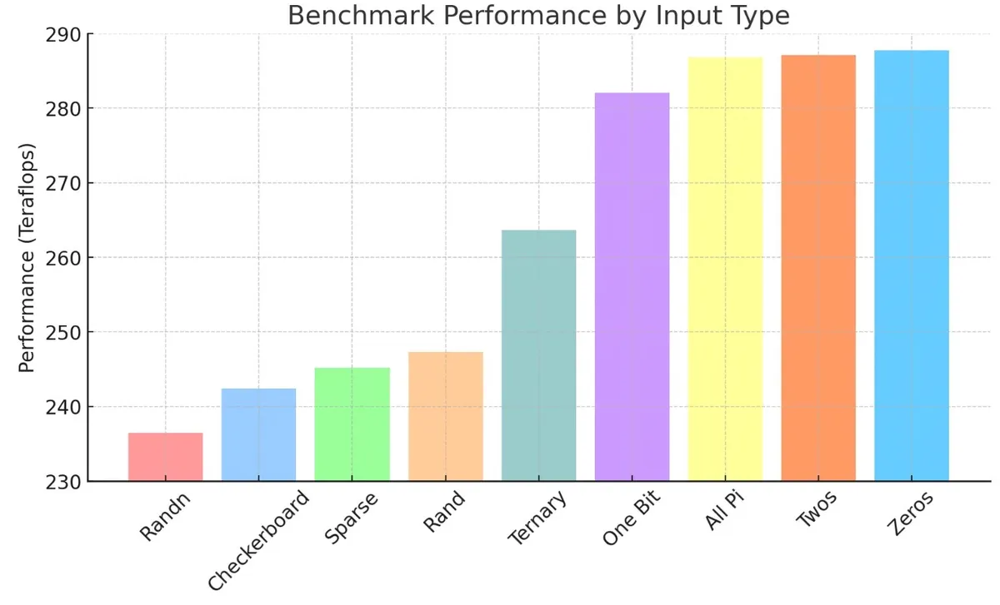

이는 예상된 결과다. 아직 초반이고, 가장 명백한 병목 중 하나는 매 반복마다 global memory 로 나가야 한다는 사실이기 때문이다. 앞서 말했듯 GMEM 접근은 약 500 사이클이 드는 반면 shared memory(SMEM) 접근은 20~30 사이클 정도다. 다음 커널에서는 연산을 수행하기 전에 thread 들이 협력해 GMEM 에서 SMEM 으로 값을 적재하도록 해서 성능을 개선한다. tile 이 SMEM 에 올라오면 thread 는 GMEM 으로 반복해서 나가는 대신 거기서 피연산자를 가져올 수 있다. 이것만으로도 상당히 빨라지고 더 높은 처리량에 가까워진다.

## Kernel 2: Shared Memory Tiling

이 커널의 논리는 다음과 같다. A 와 B 에서 tile 을 적재하기 위한 shared memory 공간을 각각 `sharedA`, `sharedB` 라는 이름으로 할당한다. 각 tile 의 원소 개수는 `TILE_SIZE * TILE_SIZE` 이며, 이는 `dim3 blockDim(32 * 32)` 로 grid 를 띄울 때 각 block 의 thread 수와 일치한다. 즉 이전과 마찬가지로 각 thread 는 출력의 원소 하나를 계산하는 일을 맡는다. 거기에 더해 각 thread 는 tile 반복마다 A 에서 하나, B 에서 하나씩 두 개의 값을 shared memory 로 적재한다.

이 점을 짚는 이유는, 뒤에서는 각 thread 가 하나 이상의 원소를 적재하는 커널이 나오고 그때는 해당 thread 가 shared memory 안 어디에 써야 하는지를 정하기 위한 추가 인덱싱 로직이 필요하기 때문이다. 이 커널에서는 각 thread 가 두 행렬에서 정확히 하나씩만 적재하므로 `ty` 와 `tx` 만 알면 충분하고 아직 그런 로직이 필요 없다.

이것은 말보다 그림으로 보는 편이 쉬우므로, 아이디어를 보여주기 위해 4×4 행렬 A 와 B 를 쓰는 작은 예제부터 시작한다. 그다음 실제 커널 안에서 같은 논리가 어떻게 보이는지 살펴본다.

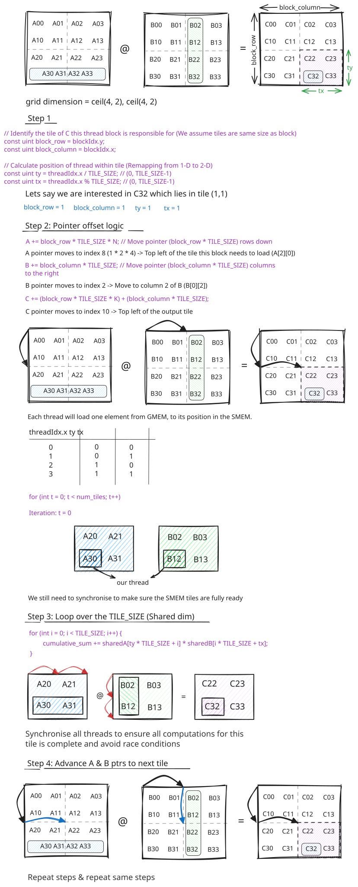

논리를 합쳐 실제 실행 구성에 적용하면 커널은 다음과 같은 모습이 된다.

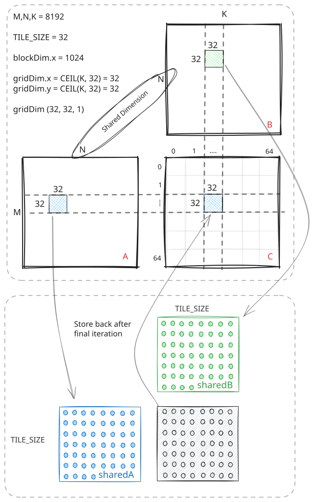

전체 코드는 다음과 같다.

``` code-block
template <const uint TILE_SIZE>
__global__ void sgemm_tiled_shared(const float* __restrict__ A, const float* __restrict__ B, float* __restrict__ C,
    int M, int N, int K, float alpha, float beta) {
        // Allocate shared memory
        __shared__ float sharedA[TILE_SIZE * TILE_SIZE];
        __shared__ float sharedB[TILE_SIZE * TILE_SIZE];

        // Identify the tile of C this thread block is responsible for (We assume tiles are same size as block)
        const uint block_row = blockIdx.y;
        const uint block_column = blockIdx.x;

        // Calculate position of thread within tile (Remapping from 1-D to 2-D)
        const uint ty = threadIdx.x / TILE_SIZE; // (0, TILE_SIZE-1)
        const uint tx = threadIdx.x % TILE_SIZE; // (0, TILE_SIZE-1)

        // Move pointers from A[0], B[0] and C[0] to the starting positions of the tile
        A += block_row * TILE_SIZE * N; // Move pointer (block_row * TILE_SIZE) rows down
        B += block_column * TILE_SIZE; // Move pointer (block_column * TILE_SIZE) columns to the right 
        C += (block_row * TILE_SIZE * K) + (block_column * TILE_SIZE); // Move pointer (block_row * TILE_SIZE * K) rows down then (block_column * TILE_SIZE) columns to the right

        // Calculate how many tiles we have
        const uint num_tiles = CEIL_DIV(N, TILE_SIZE);
        float cumulative_sum = 0.0f;

        // Iterate over tiles (Phase 1: Loading data)
        for (int t = 0; t < num_tiles; t++) {
            sharedA[ty * TILE_SIZE + tx] = A[ty * N + tx];
            sharedB[ty * TILE_SIZE + tx] = B[ty * K + tx];

            __syncthreads();

            // Phase 2: Compute partial results iteratively
            for (int i = 0; i < TILE_SIZE; i++) {
                cumulative_sum += sharedA[ty * TILE_SIZE + i] * sharedB[i * TILE_SIZE + tx];
            }

            __syncthreads();

            // Move all pointers to the starting positions of the next tile
            A += TILE_SIZE; // Move right
            B += TILE_SIZE * K; // Move down
        }
        // Write results back to C
        C[ty * K + tx] = (alpha * cumulative_sum) + (beta * C[ty * K + tx]);
    }
```

이 커널은 이전 커널 대비 약 **1.7×** 의 처리량 개선을 달성해 cuBLAS(FP32) 대비 **13.9%** 에 도달하지만, NVIDIA 의 Nsight Compute 로 프로파일링해 보면 몇 가지 핵심적인 문제가 드러난다.

먼저 프로파일러의 Speed of Light 절을 보면 흥미로운 점이 눈에 띈다. Compute throughput 이 76.63%, Memory throughput 이 91.13% 로 나온다. 이는 FP32 기준 하드웨어 SoL 대비 백분율이다. 처음에는 76.63% 의 compute throughput 이 꽤 괜찮아 보여 헷갈릴 수 있지만, 이것은 비교적 기본적인 GEMM 커널이므로 말이 되지 않는다.

병목을 백분율로 보여주는 throughput breakdown 을 보면 그 오해가 바로 풀린다. `SM: Inst Executed Pipe Lsu` = 76.63%(개요가 명령어 breakdown 중 가장 높은 백분율을 그대로 표시하기 때문에 개요와 같은 숫자다). Pipe LSU 는 load store 유닛이다. 프로파일러의 설명에 따르면 그 역할은 이렇다.

*"LSU 파이프라인은 global, local, shared memory 에 대한 load, store, atomic, reduction 명령어를 L1TEX 유닛으로 발행한다. 또한 특수 register 읽기(S2R), shuffle, CTA 수준의 arrive 또는 wait barrier 명령어도 L1TEX 유닛으로 발행한다."*

그다음으로 많이 발행된 명령어는 `SM: Mio Inst Issued` 로 40.08% 인데, 이는 memory input/output 유닛이다. 즉 명령어 발행이 LSU 연산과 비메모리 연산 사이에 거의 반반으로 나뉜다는 뜻이며, 여기서도 메모리 쪽이 지배적인 힘임을 가리킨다.

FP32 연산을 수행하는 명령어 수는 어떨까? `SM: Pipe FMA Cycles Active` = 14.81% 다. 이것이 우리가 정말 신경 쓰는 숫자인데, FP32 하드웨어 능력을 전혀 제대로 활용하지 못하고 있음을 보여준다. 이 단계에서는 당연히 예상되는 결과다. 이 지표는 활성 SM 사이클 중 몇 퍼센트에서 FP32 FMA 실행 파이프가 실제로 일을 했는지에 답한다. 좋은 GEMM 이라면 이 수치가 매우 높기를(60~80% 이상) 바란다. GEMM 은 거의 전부 FMA 이기 때문이다. *스포일러: 커널 6 에서 이 숫자를 62% 까지 끌어올리는 것을 보게 된다.*

따라서 (최댓값으로 선택된) 개요의 compute throughput 숫자는 다소 오해를 불러일으킨다. 전체 값이 SM 에서 실행된 모든 명령어(ALU, FMA, SFU, LSU 등)를 고려하기 때문이다. 유용한 지표가 더 있지만 지금은 넘어가자. Nsight Compute 에서 열어 자세히 살펴보고 싶다면, 모든 프로파일링 리포트를 다운로드 가능한 `.ncu-rep` 형식으로 [GitHub 저장소](https://github.com/HamzaElshafie/h100_gemm/tree/main) 에 올려 두었다. 지금은 memory throughput breakdown 으로 눈을 돌리자.

상위 세 개 지표는 `L1: Data Pipe Lsu Wavefronts` = 91.13%, `L1: Lsu Writeback Active` = 87.07%, `L1: Lsuin Requests` = 76.63% 다. 이 시점에서 우리가 shared memory 에 요청하는 로드와 스토어의 순전한 양으로 shared memory 를 압도하고 있다는 것이 명백해진다.

프로파일러에서 볼 만한 흥미로운 지표와 관점이 더 있으므로, 아래 그림에서 프로파일러의 세 가지 다른 뷰에 주석을 달아 보여준다. SASS 코드는 프로파일러의 source 섹션에서 직접 보거나 이 [GoodBolt 링크](https://godbolt.org/z/86M7brE1K) 에서 이 커널의 전체 SASS 코드를 볼 수 있다.


roofline 플롯에서 짚은 대로,

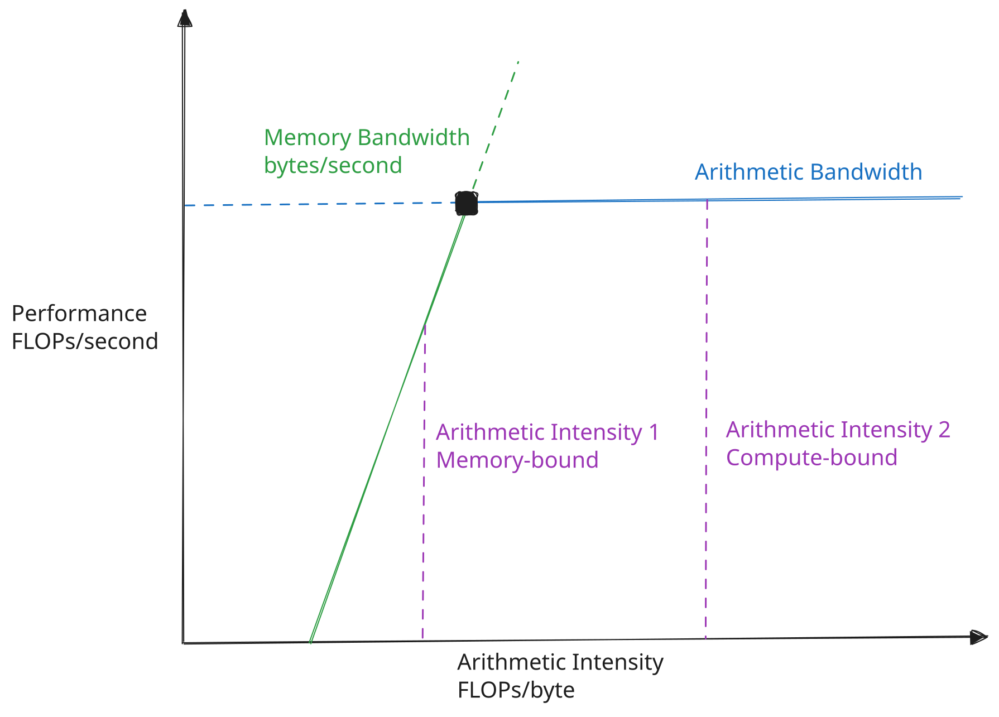

arithmetic intensity 는 커널에서 산술 연산 대 메모리 연산의 비율이다. 우리는 arithmetic intensity 를 높이고 싶다. 플롯에서는 시각적으로 오른쪽으로 이동하는 것이다. 현대 GPU 에서 산술 대역폭과 메모리 대역폭의 비율이 크기 때문에, 가장 효율적인 커널은 높은 arithmetic intensity 를 가진다. 이는 메모리 병목을 해결할 때 작업을 메모리 서브시스템에서 연산 서브시스템으로 옮겨, 메모리 대역폭을 아끼면서 산술 유닛의 부하를 높일 수 있다는 뜻이다.

따라서 다음 커널에서는 각 thread 가 출력 행렬의 원소 하나만 계산하게 하는 대신 여러 원소를 계산하게 한다. 각 thread 는 자신의 register 에 여러 결과를 부분적으로 누적하고, 연산이 모두 끝난 뒤에야 register 에서 C 로 최종 값을 저장한다.

## Kernel 3: 1D Register Tiling

작성 중이다. 모든 커널의 코드는 GitHub 에서 볼 수 있다.

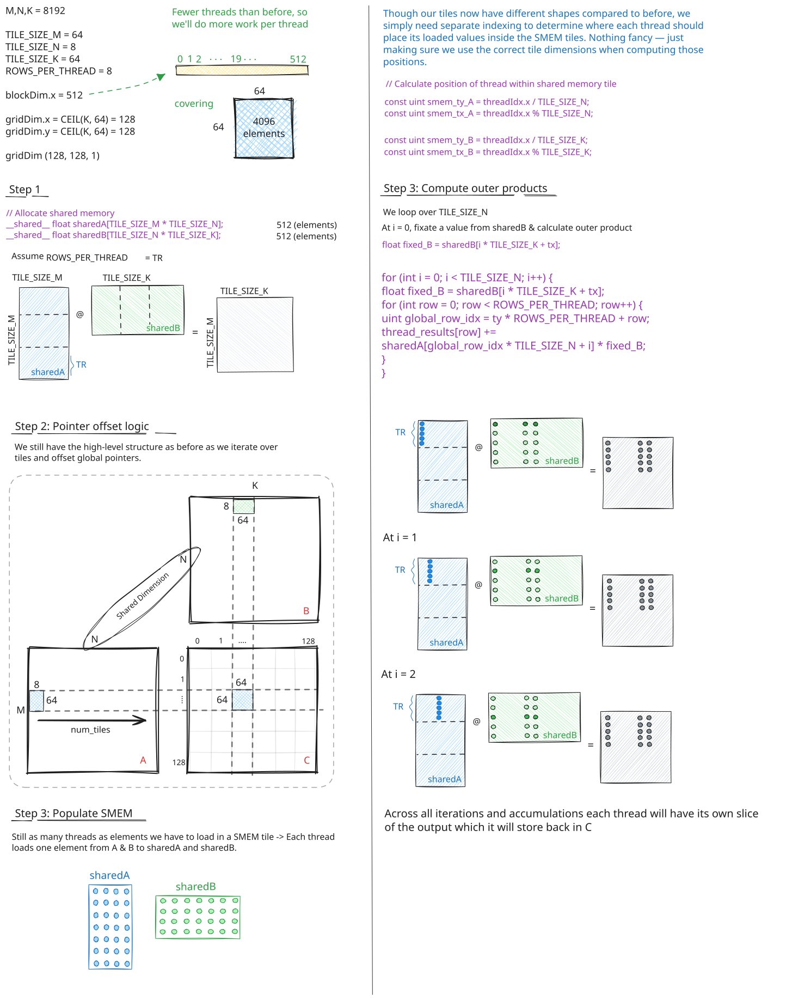

## Kernel 4: 2D Register Tiling

커널의 arithmetic intensity 를 조금 더 짜내기 위해, 이제 각 thread 가 출력 원소 하나보다 많이 계산하게 한다. 아래 그림처럼, thread block 이 출력 행렬의 한 tile 을 담당하고 그 tile 안에서 각 thread 가 자기만의 작은 2D 패치를 맡아 `ROWS_PER_THREAD * COLS_PER_THREAD` 개의 결과를 계산한다는 것이 아이디어다.

이제 shared memory tile 의 원소 수보다 적은 수의 thread 를 띄우므로, 각 thread 는 global memory 에서 shared memory 로 여러 원소를 적재해야 하며, tile 의 모든 원소가 겹치지 않게 덮이도록 stride 를 사용한다. A 와 B 의 shared memory tile 이 완전히 채워지면, 각 thread 는 필요한 A 와 B 조각을 shared memory 에서 register 로 반복해 적재하고 부분 outer product 갱신을 수행하며, 자기 몫인 `ROWS_PER_THREAD * COLS_PER_THREAD` 크기의 C 블록이 완성될 때까지 로컬 register 에 누적한다.

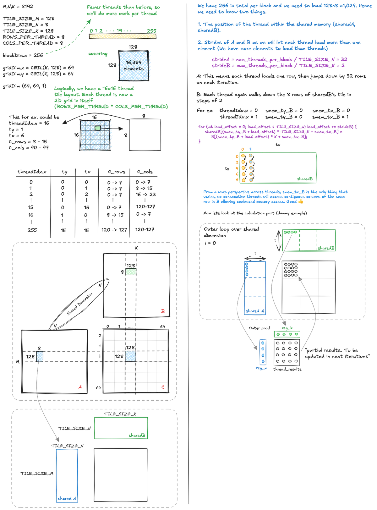

이 커널의 코드는 다음과 같다.

``` code-block
template <const uint TILE_SIZE_M, const uint TILE_SIZE_N, const uint TILE_SIZE_K, const uint ROWS_PER_THREAD>
__global__ void sgemm_1D_registertiling(const float* __restrict__ A, const float* __restrict__ B, float* __restrict__ C,
    int M, int N, int K, float alpha, float beta) {

    // Allocate shared memory
    __shared__ float sharedA[TILE_SIZE_M * TILE_SIZE_N];
    __shared__ float sharedB[TILE_SIZE_N * TILE_SIZE_K];

    // Identify the tile of C this thread block is responsible for
    const uint block_row = blockIdx.y;
    const uint block_column = blockIdx.x;

    // Calculate position of thread within tile (Remapping from 1-D to 2-D)
    const uint ty = threadIdx.x / TILE_SIZE_K;
    const uint tx = threadIdx.x % TILE_SIZE_K;

    // Move pointers from A[0], B[0] and C[0] to the starting positions of the tile
    A += block_row * TILE_SIZE_M * N;
    B += block_column * TILE_SIZE_K;
    C += (block_row * TILE_SIZE_M * K) + (block_column * TILE_SIZE_K);

    // Calculate position of thread within shared memory tile
    const uint smem_ty_A = threadIdx.x / TILE_SIZE_N;
    const uint smem_tx_A = threadIdx.x % TILE_SIZE_N;

    const uint smem_ty_B = threadIdx.x / TILE_SIZE_K;
    const uint smem_tx_B = threadIdx.x % TILE_SIZE_K;

    // Calculate number of tiles
    const uint num_tiles = CEIL_DIV(N, TILE_SIZE_N);

    // Initialise thread-local results in registers
    float thread_results[ROWS_PER_THREAD] = {0.0f};

    // Iterate over tiles
    for (int t = 0; t < num_tiles; t++) {
        sharedA[smem_ty_A * TILE_SIZE_N + smem_tx_A] =
            A[smem_ty_A * N + smem_tx_A];

        sharedB[smem_ty_B * TILE_SIZE_K + smem_tx_B] =
            B[smem_ty_B * K + smem_tx_B];

        __syncthreads();

        // Inner computation loop
        for (int i = 0; i < TILE_SIZE_N; i++) {
            float fixed_B = sharedB[i * TILE_SIZE_K + tx];
            for (int row = 0; row < ROWS_PER_THREAD; row++) {
                uint global_row_idx = ty * ROWS_PER_THREAD + row;
                thread_results[row] +=
                    sharedA[global_row_idx * TILE_SIZE_N + i] *
                    fixed_B;
            }
        }

        __syncthreads();

        // Move to next tile
        A += TILE_SIZE_N;
        B += TILE_SIZE_N * K;
    }

    // Write results back to C
    for (int row = 0; row < ROWS_PER_THREAD; row++) {
        uint global_row_idx = ty * ROWS_PER_THREAD + row;
        C[global_row_idx * K + tx] =
            (alpha * thread_results[row]) +
            (beta * C[global_row_idx * K + tx]);
    }
}
```

지난 커널은 메모리 IO stall 을 줄였지만, 출력 하나당 thread 당 shared memory 읽기가 여전히 너무 많았다.

- 출력당 SMEM 읽기 9108 회
- 출력당 GMEM 읽기 254 회

이 커널에서는 각 thread 가 세로 한 줄이 아니라 행과 열로 이루어진 tile 을 계산한다. 그 결과 다음으로 줄었다.

- 출력당 SMEM 읽기 2024 회
- 출력당 GMEM 읽기 128 회

출력당 SMEM 로드 트래픽이 **4.5x** 줄고 GMEM 이 **2×** 줄었으며, 동시에 thread 당 **8×** 더 많은 결과를 계산한다.

이 커널을 프로파일링하면 H100 FP32 peak 의 38% 에 도달하는데, 이는 곧 compute-bound 가 아님을 알려 준다. global memory 도 전혀 포화 근처가 아니다. 커널은 DRAM 대역폭의 2.90%, L2 의 약 10.13% 만 쓰는데 둘 다 GEMM 워크로드로서는 극도로 낮다. 따라서 global 대역폭도 L2 트래픽도 아무것도 제한하지 않는다.

첫 번째 의미 있는 신호는 Speed of Light 절에 나타난다.

- Compute Throughput: 55.50%
- Memory Throughput: 85.88%
- L1/TEX Throughput: 87.74%

프로파일러는 병목을 직접 가리키기까지 한다.

*"이 커널은 가용 compute 또는 memory 성능의 80% 이상을 사용하고 있다. 성능을 더 개선하려면 가장 많이 쓰이는 유닛에서 다른 유닛으로 작업을 옮겨야 할 가능성이 크다. Memory Workload Analysis 섹션에서 L1 을 분석하는 것부터 시작하라."*

DRAM 과 L2 는 거의 건드려지지 않는데 L1/TEX 는 90% 활용률에 근접하므로, 압력이 on-chip 메모리 계층에 명확히 집중되어 있다. 다시 말해 이것은 DRAM 문제가 전혀 아니다. 제한 요인은 L1 캐시/SMEM 경로의 대역폭과 지연 시간이다.

이 그림은 scheduler 지표로도 뒷받침된다. `SM Issue Active` 는 55.50% 로, warp scheduler 가 전체 사이클의 절반을 약간 넘는 동안만 명령어를 발행한다는 뜻이다. 나머지 약 45% 의 사이클은 stall 상태로, 보통 DRAM 이나 L2 가 아니라 L1/SMEM 을 거치는 데이터 이동을 기다린다.

scheduler 통계를 보면 다음과 같다.

*"모든 scheduler 는 사이클당 명령어 하나를 발행할 수 있지만, 이 커널에서는 각 scheduler 가 **1.8 사이클**마다 하나의 명령어만 발행한다. 이는 하드웨어 자원을 충분히 활용하지 못하게 하고 성능을 떨어뜨릴 수 있다."*

`Stall MIO throttle` 도 0.59 이므로 이것을 줄이고 싶다. 종합하면 극도로 낮은 DRAM 사용률, 극도로 낮은 L2 사용률, 높은 L1/TEX 활용률(약 88%), 그리고 50% 대 중반에 그치는 SM issue 가 모두 같은 결론으로 수렴한다.

이 커널은 L1-bound 혹은 SMEM-bound 다. compute-bound 가 아니며 GMEM-bound 는 더더욱 아니다. 병목은 register, shared memory, L1/TEX 경로 사이의 on-chip 데이터 이동이다. 다음 최적화에서는 L1/SMEM 파이프라인 안의 명령어 오버헤드를 줄여서, 명령어당 1.8 사이클이라는 비율을 직접 공략하고 warp scheduler 를 풀어 SM Issue Active 를 높여야 한다.

이런 한계에도 불구하고 이전 커널 대비 **1.40×** 의 이득은 얻었다. 12.2 TFLOPs 에서 19.1 TFLOPs 로, cuBLAS 의 **36.8%** 까지 올라왔다.

## Kernel 5: Vectorised 2D Register Tiling

지금까지 모든 커널에서 우리는 스칼라 하나당 하나의 로드 명령어를 발행했다. 우리가 최적화한 coalescing 때문에 스칼라당 로드 하나가 아닌 것처럼 보일 수 있어 다소 혼란스럽다. 빠진 부분은 다음 둘 사이에 중요한 구분이 있다는 점이다.

1.  **메모리 transaction**
2.  **발행되는 명령어 수**

coalescing 은 첫 번째에만 도움이 된다. 서로 다른 thread 가 요청한 데이터를 하드웨어가 하나의 연속된 메모리 transaction 으로 합칠 수 있게 해 준다. 두 번째는 전혀 바꾸지 않는다. 모든 스칼라 로드는 여전히 별개의 명령어로 나타나고, 각각 **warp scheduler** 가 발행해 load/store 파이프라인으로 밀어 넣어야 한다.

이를 확인하기 위해 이전 커널의 SASS 를, 특히 GMEM 에서 SMEM 으로 적재하는 부분을 들여다보면, 실제로 **루프 반복마다 thread 당 별도의 명령어 발행이 생긴다**는 것을 확인할 수 있다. 예컨대 B 에 대한 접근이 병합되어 메모리 컨트롤러 수준에서는 목적을 달성하지만, 하드웨어는 여전히 thread 당 네 번의 별도 명령어 발행을 요구한다. coalescing 은 컴파일 시점에 일어나지 않는다. 실제 주소를 알게 된 런타임에 하드웨어가 동적으로 수행한다. 행렬 포인터가 함수 인자로 전달되기 때문에 컴파일러가 정렬이나 레이아웃을 가정할 수 없으므로 이는 합리적이다. 이제 이것을 warp 전체로 확장해 보자. 커널이 이 구간을 한 번 돌 때마다 warp scheduler 는 총 **thread 32 개 \* thread 당 로드 4 회 = 128 개의 별도 로드 명령어**를 발행해야 한다. 메모리 컨트롤러가 이 128 개 스칼라 요청을 몇 개의 크고 효율적인 메모리 transaction 으로 합쳐 주더라도, 파이프라인 병목은 프런트엔드에 남는다. warp scheduler 는 과로하고 load/store 파이프라인은 반복적인 요청으로 포화되어, 정작 연산 유닛은 귀중한 클럭 사이클을 굶는다.

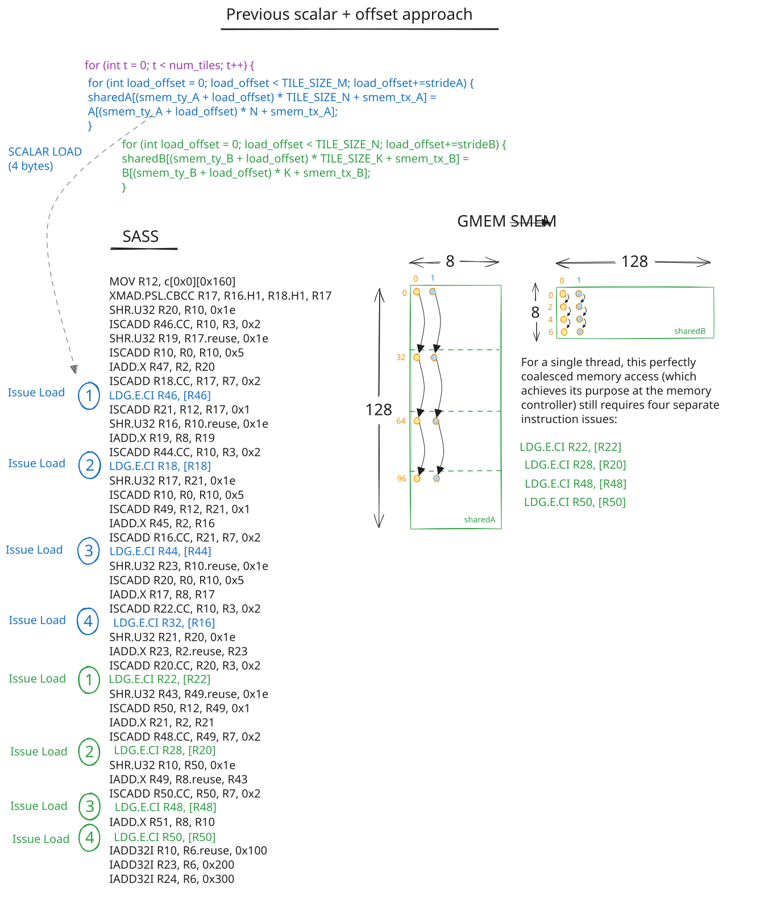

이 명령어 압력을 해소할 유일한 방법은 컴파일러가 데이터 전송을 보는 방식을 근본적으로 바꾸는 것이다. 로드 요청 하나를 볼 때 여러 스칼라를 한꺼번에 가져오라고 컴파일러에 알려 주어야 한다. CUDA 는 이 명령어 압력을 줄여 주는 **벡터화 변수**를 제공한다. `float2` 나 `float4` 같은 더 넓은 데이터 타입을 말한다. 일반 `float` 는 32 비트(4 바이트)다. `float4` 는 128 비트(16 바이트)다. `float*` 를 `float4*` 로 캐스팅하고 로드 하나를 발행하면 **128 비트** global memory **명령어** 하나가 발생한다. SASS 에서는 `LDG.E.128`, 때로는 `LDG.E.CI.128` 로 나타난다. 이는 로드 명령어 수를 크게 줄이고 하드웨어 메모리 경로를 더 효율적으로 쓰게 한다.

그럼 다음 커널을 보자. 전체 구조는 그대로이고, 유일한 차이는 `sharedA` 를 전치한다는 점이다. 따라서 GMEM 에서 행을 적재하면 `sharedA` 에는 열로 저장된다. 벡터화된 로드 명령어를 발행하려면 주소가 물리적으로 연속이어야 하므로, 벡터화된 로드를 쓸 수 있게 하려고 이렇게 한다.

이 논리의 중심은 행렬 A 의 접근 패턴이다. 각 thread 는 자기 계산에 필요한 `ROWS_PER_THREAD` 개의 원소를(열을 따라 훑는 것에 해당) 적재해야 하므로 기본 메모리 접근은 strided 하다. 열 데이터를 전치하면 `sharedA` 에 물리적으로 연속된 행으로 저장된다. 덕분에 나중에 SMEM 에서 `reg_m` 으로 데이터를 옮길 때 `float4` 로드를 발행할 수 있다.

`sharedB` 에도 같은 접근을 적용하지만 전치하지는 않는다. 지난 커널에서 보았듯 각 thread 는 `COLS_PER_THREAD` 개를 `reg_k` 로 적재하고, 이 원소들은 이미 같은 행에서 서로 붙어 있으므로 전치할 필요가 없다.

이렇게 하면 스칼라 + 오프셋 방식을 완전히 버리게 되고, 따라서 GMEM 에서 SMEM 으로 적재할 때 stride 를 두고 루프를 돌 필요가 없어진다. 또한 register 로 적재할 때도 `float4` 를 발행할 수 있고 `ROWS_PER_THREAD` 와 `COLS_PER_THREAD` 가 모두 8 이므로, 여전히 루프로 register 에 적재하되 이제는 4 단위로 stride 한다는 뜻이다. 말로는 헷갈릴 수 있으니 늘 그렇듯 그림으로 그려 보겠다.

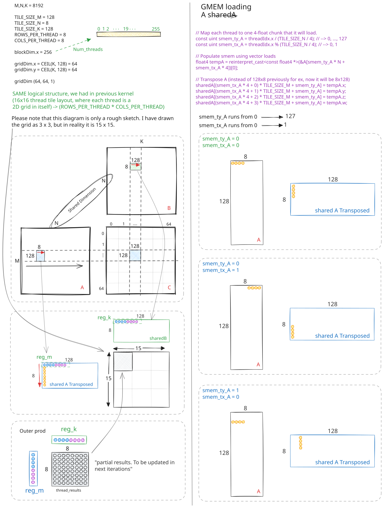

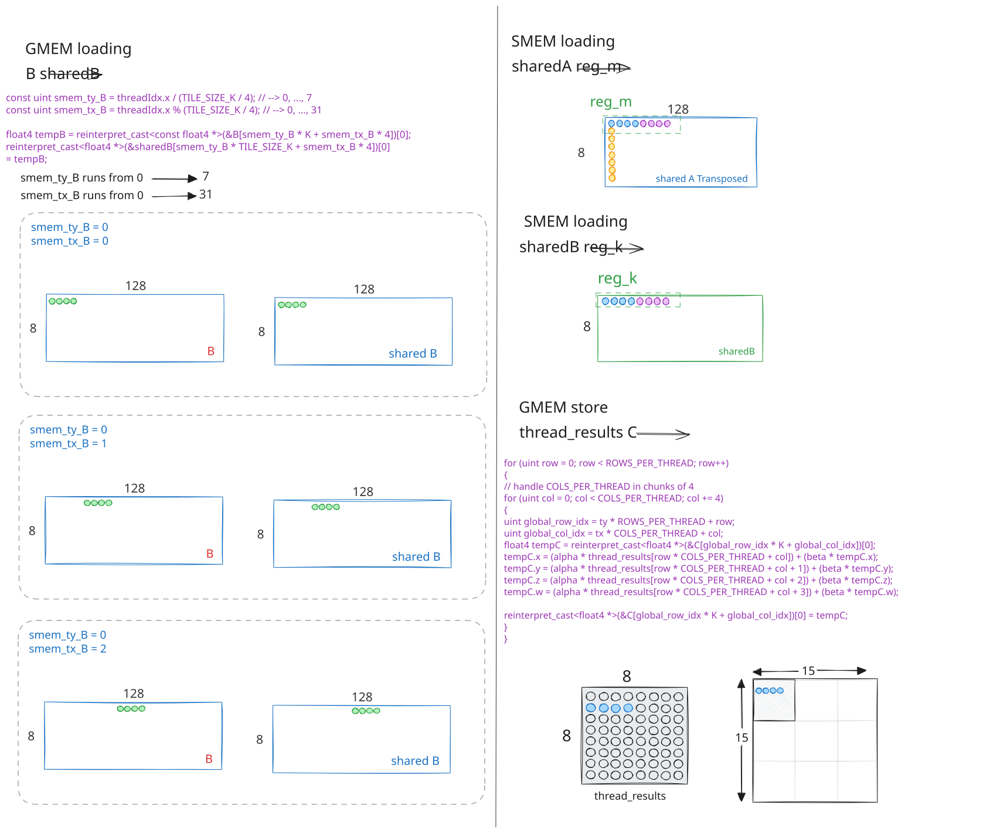

이제 이 커널의 SASS 를 들여다보고 이전 버전과 비교한 뒤, 프로파일러가 무엇을 말해 주는지 보자.

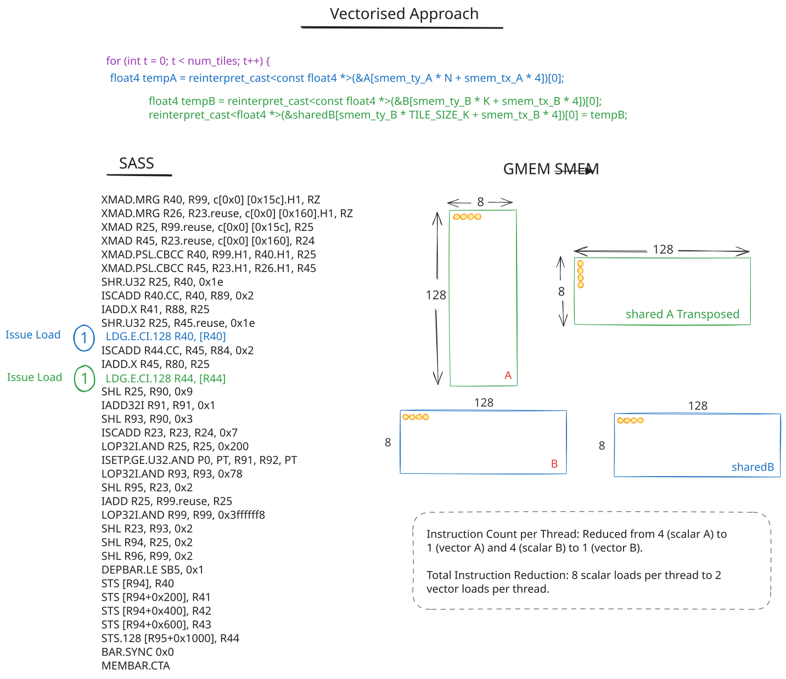

우리 방식으로 thread 당 발행 명령어 수가 8 개에서 단 2 개로 줄어든 것을 볼 수 있다. 위 그림은 `LDG.E.CI.128` 을 쓰는 GMEM 적재 단계만 보여주지만, SMEM 에서 RMEM(Register Memory)으로 읽을 때도 마찬가지로 명령어 수를 줄였다. 훨씬 길어서 여기에 싣지는 않지만, SASS 에서 `LDS.U.128` 명령어를 분명히 볼 수 있어 shared memory 읽기의 벡터화도 성공했음을 확인할 수 있다. 더 깊이 보고 싶다면 이 커널의 전체 [SASS/PTX](https://godbolt.org/z/qqhYvYoP1) 를 볼 수 있다.

이 커널을 돌리면 또 한 번 **약 2 배의 속도 향상**이 나와, **37.2 TFLOP/s** 로 **cuBLAS 의 72%** 에 도달한다. 좋다, 점점 다가가고 있다(물론 아직 FP32 경로뿐이다! Tensor Core 를 쓰는 cuBLAS 를 이기기까지는 아직 갈 길이 멀다).

프로파일러를 보면 커널이 이제 GPU 를 꽤 잘 쓰고 있다. compute throughput 은 peak 의 약 66%, memory throughput 은 약 85%, 그리고 device FP32 roofline 의 56% 에 도달한다.\
다만 cuBLAS 가 약 85% 수준이고, 실제 워크로드가 하드웨어 이론 peak 의 100% 에 도달하는 일은 없다는 점을 염두에 두자.

이제 앞서 발견한 문제들을 이 커널의 새 프로파일러 결과와 비교해 보자.

- `SM Issue Active`: 55.50% → 66.05% 로 증가(연산에 쓰는 시간이 늘었다. scheduler 가 약 19% 더 바빠졌다).
- `SM Pipe Fma Cycles Active`: 42.00% → 56.73% 로 증가(연산이 더 많이 수행되고 있다).
- `SM Inst Executed Pipe Lsu`(Load Store Unit): 28.78% → 17.09% 로 감소(명령어 수가 줄었다는 증거).
- `SM Mio Inst Issued`: 14.99% → 9.21% 로 감소.
- `Stall MIO Throttle`: 0.59 → 0.02 로 감소.

또한 scheduler 가 명령어당 1.8 사이클만 발행한다는 경고도 이제 사라졌다. 엄청난 개선이지만 아직 개선할 여지가 남아 있다.

자세히 보면 지금 성능을 깎아먹어 더 높은 compute throughput 을 막고 있는 몇 가지 미묘한 핵심 지표가 있다.

가장 결정적으로 shared memory 접근에서 심한 **bank conflict** 가 나타난다. 로드에서 약 5-way, 스토어에서 2.6-way conflict 이고, 전체 shared memory wavefront 의 40% 이상이 직렬화로 낭비된다.\
Nsight Compute 에서 wavefront 는 한 사이클에 처리할 수 있는 shared memory 요청의 하드웨어 단위를 뜻한다. bank conflict 가 발생하면 요청이 여러 wavefront 로 쪼개져 차례로 처리되므로 stall 이 생긴다.

지금까지 커널에서 bank conflict 를 제대로 고려하지 않았으니, 개념을 소개하기에 적절한 시점이다.

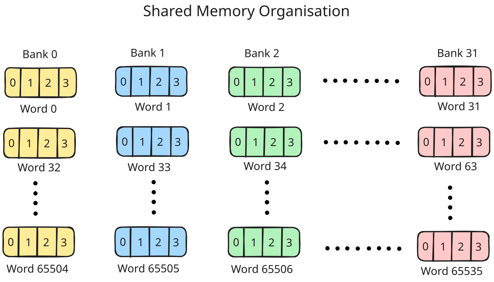

shared memory 구성을 더 잘 시각화하려고 그림을 그려 보았는데, 핵심은 NVIDIA GPU(H100 포함)의 shared memory 가 32 개 bank 로 나뉘고 각 bank 가 사이클당 4 바이트 word 하나를 처리할 수 있다는 점이다. 필자는 이것을 슈퍼마켓의 계산대 32 개로 상상하기를 좋아한다. 각 계산대가 사이클당 손님 한 명을 처리한다. 여기서 "word" 는 저장의 기본 단위, 즉 4 바이트(예컨대 float 하나)를 뜻한다.

bank 인덱스는 흔한 모듈로 트릭으로 간단히 계산할 수 있다.\
`bank_index = word_index % 32`

- Bank 0: word 0, 32, 64, …
- Bank 1: word 1, 33, 65, …
- …
- Bank 31: word 31, 63, 95, …

이제 32 개 thread 로 이루어진 warp 가 shared memory 접근을 발행할 때:

- 각 thread 가 **서로 다른 bank** 를 건드리면 conflict 가 없고 모두 병렬로 처리된다. 좋다!
- 여러 thread 가 **같은 bank** 안의 서로 다른 주소를 읽거나 쓰려고 하면 그 요청들은 차례로 직렬화된다. 이것이 **bank conflict** 다.
- 모든 thread 가 정확히 같은 word 를 읽으면 하드웨어는 대신 **broadcast** 를 수행하며, 이는 효율적이다. 이것도 좋다!

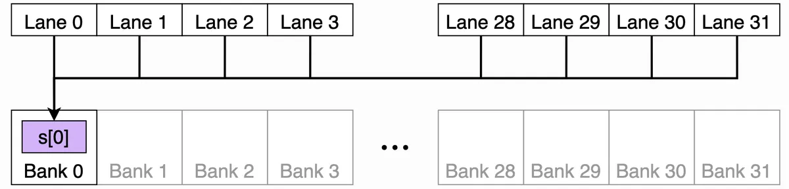

이 [그림](https://feldmann.nyc/blog/smem-microbenchmarks) 에서는 32 개 lane 전부가 같은 bank 의 word 를 읽을 수 있다. 하드웨어가 conflict 를 일으키는 대신 값을 효율적으로 broadcast 한다.

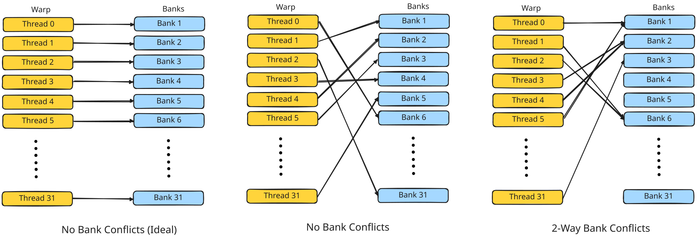

store conflict 부터 보자. 우리 코드에서 스토어의 약 2.6-way conflict 는 전치된 tile 로 `sharedA` 를 채울 때 나타난다.

``` code-block
// Populate smem using vector loads
float4 tempA = reinterpret_cast<const float4*>(&A[smem_ty_A * N + smem_tx_A*4])[0]; // [0] dereference issues one ld.global.nc.v4.f32

// Transpose A (instead of 128x8 previously for ex, now it will be 8x128)
sharedA[(smem_tx_A * 4 + 0) * TILE_SIZE_M + smem_ty_A] = tempA.x;
sharedA[(smem_tx_A * 4 + 1) * TILE_SIZE_M + smem_ty_A] = tempA.y;
sharedA[(smem_tx_A * 4 + 2) * TILE_SIZE_M + smem_ty_A] = tempA.z;
sharedA[(smem_tx_A * 4 + 3) * TILE_SIZE_M + smem_ty_A] = tempA.w;
```

`smem_ty_A` 는 전치된 `sharedA` 의 열 전체에 걸쳐 변하고 `smem_tx_A` 는 (물론 이 커널 구성에서는) 0 아니면 1 이다. 각 스칼라 스토어의 word 인덱스는 다음과 같다.

- `word_index = (smem_tx_A*4 + q) * TILE_SIZE_M + smem_ty_A` → q 는 {0,1,2,3}
- `bank = word_index % 32`

`TILE_SIZE_M = 128` 이면 leading stride 가 32 개 bank 로 나누어떨어진다. 128 % 32 = 0 이므로, **bank 는 stride 인자가 아니라 계산 후 남는 오프셋에만 의존**한다.

bank 는 사실상 `smem_ty_A` 값(열 오프셋)에만 의존하고 `smem_tx_A` 값(행 인덱스)에는 의존하지 않는다. thread 두 개마다 같은 `smem_ty_A` 값을 공유하므로, 네 번의 스칼라 스토어 각각에서 같은 bank 를 겨냥하게 된다. 이것이 바로 프로파일러가 2-way store conflict 로 지적한 패턴이다.

leading stride 가 32 word 의 배수일 때 이런 종류의 conflict 를 피하는 흔한 트릭이 **padding** 이다.

``` code-block
// Allocate shared memory. Use padded leading strides that keep float4 alignment
constexpr uint STRIDE_A = (TILE_SIZE_M % 32u == 0u) ? (TILE_SIZE_M + 4u) : TILE_SIZE_M;
constexpr uint STRIDE_B = (TILE_SIZE_K % 32u == 0u) ? (TILE_SIZE_K + 4u) : TILE_SIZE_K;
static_assert((STRIDE_A % 4u) == 0u, "STRIDE_A must keep float4 alignment");
static_assert((STRIDE_B % 4u) == 0u, "STRIDE_B must keep float4 alignment");
```

leading stride 를 132 word 로 패딩하고 `sharedA` 를 건드리는 모든 곳에서(전치를 쓸 때와 나중에 읽을 때 모두) 그 패딩된 stride 를 쓰면, 행을 결정하는 인덱스 `smem_tx_A` 가 이제 bank 에 영향을 준다. 예전에 충돌하던 두 lane 은 16 개 bank 만큼 떨어져 나뉘고, x, y, z, w 네 번의 스칼라 스토어는 한 bank 에 쌓이는 대신 bank 들을 돌아가며 쓰게 된다. 이를 증명하기 위해 패딩 후 커널을 프로파일링했고, **결과는 store conflict 가 제거되었음을 보여주었다.**

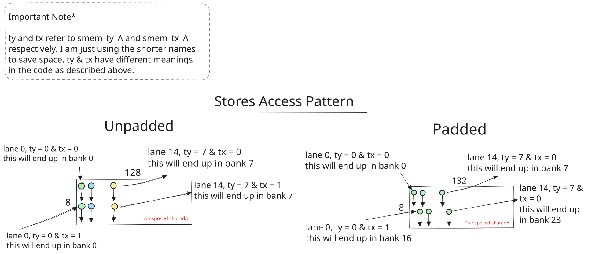

이제 실제로 더 큰 문제인 **로드의 5-way bank conflict** 가 남아 있다. 이 conflict 는 주로 `sharedB` 에서 적재할 때, 특히 다음 지점에서 발생한다.

``` code-block
for (int col = 0; col < COLS_PER_THREAD; col += 4) {
  uint global_smem_col_idx = tx * COLS_PER_THREAD + col;
  float4 temp_shared_B =
      reinterpret_cast<float4*>(&sharedB[i * TILE_SIZE_K + global_smem_col_idx])[0];
  reg_k[col + 0] = temp_shared_B.x;
  reg_k[col + 1] = temp_shared_B.y;
  reg_k[col + 2] = temp_shared_B.z;
  reg_k[col + 3] = temp_shared_B.w;
}
```

lane 0..15 에서 `ty` 는 여전히 0 이지만 `tx` 는 0..15 를 훑는다. 단순하게 col = 0 으로 고정하면 각 lane 의 float4 첫 word 에 대한 bank 는 다음과 같다.

- `bank = (i* 128 + 8 * tx) % 32 = (8 * tx) % 32`
- = 0, 8, 16, 24, 0, 8, 16, 24, ... 반쪽 warp 가 단 네 개의 bank 만 사용한다

이제 우리가 벡터화된 float4 로드를 하고 있다는 점을 기억하자. 따라서 해당 lane 에 대해 연속된 네 개 bank 에 걸친다. bank 시작이 0 인 lane 은 bank {0,1,2,3} 을, 8 인 lane 은 {8,9,10,11} 을, 16 인 lane 은 {16,17,18,19} 를, 24 인 lane 은 {24,25,26,27} 을 건드리는 식이다.

패턴이 네 lane 마다 반복되므로 네 개 lane 이 동시에 bank {0..3} 을 원하고, 또 다른 네 개가 {8..11} 을 원하는 식이 된다. 여기서 이 명령어에 대한 4-way conflict 가 생긴다.

`sharedA` 로드는 다르다. 반쪽 warp 안에서 lane 마다 달라지는 것은 `tx` 인데, `tx` 는 주소에 나타나지 않는다. 하나의 반쪽 warp 안에서 `ty` 는 상수다. `i` 와 `row` 가 고정되면 모든 lane 이 같은 주소를 계산한다. 따라서 반쪽 warp 의 16 개 lane 전부가 그 단계에서 `sharedA` 의 같은 네 word 를 읽는다. 앞서 말했듯 이것은 broadcast 될 수 있으므로 로드 측면에서는 conflict 가 없다.

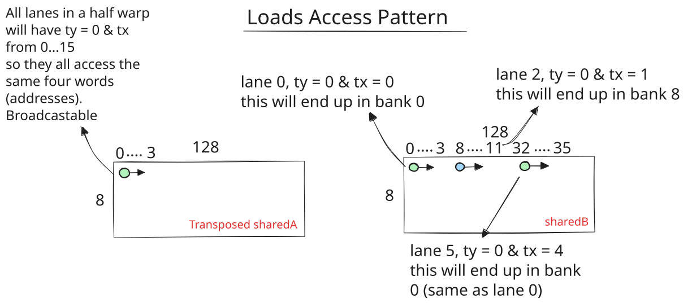

여기서 중요한 점은 padding 이 이 로드 conflict 를 고쳐 주지 않는다는 것이다. padding 은 주소에서 변하는 부분이 32 word 의 배수인 stride 와 곱해질 때 도움이 된다. 위의 `sharedB` 로드에서 변하는 부분은 `tx * COLS_PER_THREAD + col` 이고, 이 부분은 패딩된 stride 와 곱해지지 않는다. 따라서 `STRIDE_B` = 132 로 설정하더라도 반쪽 warp 안의 lane 들은 여전히 같은 네 개 bank 그룹에 몰린다. 즉 padding 은 스토어 쪽은 해결했지만 sharedB 로드 conflict 에는 다른 접근이 필요하다.

패딩된 벡터화 2D register tiling 커널의 최종 코드는 다음과 같다.

``` code-block
template <const uint TILE_SIZE_M, const uint TILE_SIZE_N, const uint TILE_SIZE_K, const uint ROWS_PER_THREAD, const uint COLS_PER_THREAD>
__global__ void sgemm_vectorised(const float *__restrict__ A, const float *__restrict__ B, float *__restrict__ C,
                                 int M, int N, int K, float alpha, float beta)
{
    // Allocate shared memory. Use padded leading strides that keep float4 alignment
    constexpr uint STRIDE_A = (TILE_SIZE_M % 32u == 0u) ? (TILE_SIZE_M + 4u) : TILE_SIZE_M;
    constexpr uint STRIDE_B = (TILE_SIZE_K % 32u == 0u) ? (TILE_SIZE_K + 4u) : TILE_SIZE_K;
    static_assert((STRIDE_A % 4u) == 0u, "STRIDE_A must keep float4 alignment");
    static_assert((STRIDE_B % 4u) == 0u, "STRIDE_B must keep float4 alignment");

    // Allocate shared memory
    __shared__ float sharedA[STRIDE_A * TILE_SIZE_N];
    __shared__ float sharedB[TILE_SIZE_N * STRIDE_B];

    // Identify the tile of C this thread block is responsible for
    const uint block_row = blockIdx.y;
    const uint block_column = blockIdx.x;

    // Calculate position of thread within tile (Remapping from 1-D to 2-D)
    const uint ty = threadIdx.x / (TILE_SIZE_K / COLS_PER_THREAD);
    const uint tx = threadIdx.x % (TILE_SIZE_K / COLS_PER_THREAD);

    // Move pointers from A, B, C to tile starts
    A += block_row * TILE_SIZE_M * N;
    B += block_column * TILE_SIZE_K;
    C += (block_row * TILE_SIZE_M * K) + (block_column * TILE_SIZE_K);

    // Map each thread to one 4-float chunk
    const uint smem_ty_A = threadIdx.x / (TILE_SIZE_N / 4);
    const uint smem_tx_A = threadIdx.x % (TILE_SIZE_N / 4);

    const uint smem_ty_B = threadIdx.x / (TILE_SIZE_K / 4);
    const uint smem_tx_B = threadIdx.x % (TILE_SIZE_K / 4);

    // Tile count
    const uint num_tiles = CEIL_DIV(N, TILE_SIZE_N);
    float thread_results[ROWS_PER_THREAD * COLS_PER_THREAD] = {0.0f};
    float reg_m[ROWS_PER_THREAD] = {0.0f};
    float reg_k[COLS_PER_THREAD] = {0.0f};

    // Outer loop iterate over tiles
    for (int t = 0; t < num_tiles; t++)
    {
        // Populate smem using vector loads
        float4 tempA = reinterpret_cast<const float4 *>(&A[smem_ty_A * N + smem_tx_A * 4])[0];
        sharedA[(smem_tx_A * 4 + 0) * STRIDE_A + smem_ty_A] = tempA.x;
        sharedA[(smem_tx_A * 4 + 1) * STRIDE_A + smem_ty_A] = tempA.y;
        sharedA[(smem_tx_A * 4 + 2) * STRIDE_A + smem_ty_A] = tempA.z;
        sharedA[(smem_tx_A * 4 + 3) * STRIDE_A + smem_ty_A] = tempA.w;

        float4 tempB = reinterpret_cast<const float4 *>(&B[smem_ty_B * K + smem_tx_B * 4])[0];
        reinterpret_cast<float4 *>(&sharedB[smem_ty_B * STRIDE_B + smem_tx_B * 4])[0] = tempB;

        __syncthreads();

        // Outer loop over shared dimension N
        for (int i = 0; i < TILE_SIZE_N; i++)
        {
            // Load regs from sharedA
            for (int row = 0; row < ROWS_PER_THREAD; row += 4)
            {
                uint global_smem_row_idx = ty * ROWS_PER_THREAD + row;
                float4 temp_shared_A = reinterpret_cast<float4 *>(&sharedA[i * STRIDE_A + global_smem_row_idx])[0];
                reg_m[row + 0] = temp_shared_A.x;
                reg_m[row + 1] = temp_shared_A.y;
                reg_m[row + 2] = temp_shared_A.z;
                reg_m[row + 3] = temp_shared_A.w;
            }

            // Load regs from sharedB
            for (int col = 0; col < COLS_PER_THREAD; col += 4)
            {
                uint global_smem_col_idx = tx * COLS_PER_THREAD + col;
                float4 temp_shared_B = reinterpret_cast<float4 *>(&sharedB[i * STRIDE_B + global_smem_col_idx])[0];
                reg_k[col + 0] = temp_shared_B.x;
                reg_k[col + 1] = temp_shared_B.y;
                reg_k[col + 2] = temp_shared_B.z;
                reg_k[col + 3] = temp_shared_B.w;
            }

            // Outer product
            for (uint m = 0; m < ROWS_PER_THREAD; m++)
                for (uint k = 0; k < COLS_PER_THREAD; k++)
                    thread_results[m * COLS_PER_THREAD + k] += reg_m[m] * reg_k[k];
        }

        __syncthreads();

        A += TILE_SIZE_N;
        B += TILE_SIZE_N * K;
    }

    // Write results back
    for (uint row = 0; row < ROWS_PER_THREAD; row++)
        for (uint col = 0; col < COLS_PER_THREAD; col += 4)
        {
            uint global_row_idx = ty * ROWS_PER_THREAD + row;
            uint global_col_idx = tx * COLS_PER_THREAD + col;
            float4 tempC = reinterpret_cast<float4 *>(&C[global_row_idx * K + global_col_idx])[0];

            tempC.x = (alpha * thread_results[row * COLS_PER_THREAD + col]) + (beta * tempC.x);
            tempC.y = (alpha * thread_results[row * COLS_PER_THREAD + col + 1]) + (beta * tempC.y);
            tempC.z = (alpha * thread_results[row * COLS_PER_THREAD + col + 2]) + (beta * tempC.z);
            tempC.w = (alpha * thread_results[row * COLS_PER_THREAD + col + 3]) + (beta * tempC.w);

            reinterpret_cast<float4 *>(&C[global_row_idx * K + global_col_idx])[0] = tempC;
        }
}
```

## Kernel 6: Warp Tiling

지금까지 우리는 두 단계의 **병렬성**을 활용했다.

1.  **Block tiling**: 각 thread block 이 출력 행렬 C 의 큰 tile 을 계산하며, shared memory 에서 A 와 B 의 tile 을 재사용했다.
2.  **Register tiling**: 각 thread 가 C 의 작은 sub-tile `(ROWS_PER_THREAD × COLS_PER_THREAD)` 을 전부 register 안에서 계산해, 결과를 global memory 로 쓰기 전에 데이터 재사용을 최대화했다.

이 커널에서는 block tiling 과 thread tiling 사이에 새로운 tiling 단계를 도입한다. 바로 **warp tiling** 이다.

warp tiling 은 최적화 계층에서 block tiling 과 thread tiling 사이에 위치한다. block 의 모든 thread 가 하나의 큰 tile 을 협력해서 다루게 하는 대신, 그 tile 을 더 작은 sub-tile 로 나누어 각각을 하나의 warp 에 배정한다. 이렇게 하면 warp 가 중간 단계의 연산 단위가 된다. block 은 여전히 C 의 128 × 128 패치를 담당하지만, 이를 네 개의 64 × 64 sub-tile 로 쪼갠다. M 방향으로 warp 두 개, K 방향으로 warp 두 개여서 block 당 warp 네 개가 된다.

``` code-block
TILE_SIZE_M = 128
TILE_SIZE_N = 16
TILE_SIZE_K = 128

WARP_TILE_M  = 64
WARP_TILE_K  = 64
WARP_STEPS_K = 4

ROWS_PER_THREAD = 8
COLS_PER_THREAD = 4
NUM_THREADS     = 128   // four warps per block
```

block 은 여전히 협력해서 GMEM 에서 SMEM 으로 데이터를 적재한다(이전 커널의 벡터화, 패딩, 전치 기법을 사용한다). 데이터가 on-chip 에 올라오면 thread 들은 네 개 warp 로 나뉘고, 각 warp 는 `warp_row` 와 `warp_col` 로 식별되는 출력 행렬의 한 사분면을 독점적으로 맡는다.

warp 안의 32 개 thread 는 (8×4 thread 서브그리드에서 유도된) 각자의 하위 인덱스 `ty`, `tx` 를 이용해 배정된 64×64 영역을 공략한다. warp 는 세로 차원을 한 번에 덮지만(`WARP_STEPS_M = 1`) 가로로는 `WARP_STEPS_K=4` 번 반복해야 한다(물론 이 값들은 조정 가능하지만 신중해야 한다!). 부분 결과의 누적은 `TILE_SIZE_N` 공유 차원을 도는 루프(`i` 루프) 안에서 일어난다. 연산 루프에서 이 설계는 thread 가 `sharedA` 에서 `reg_m` fragment 를 한 번만 적재하고 네 번의 가로 단계에 걸쳐 재사용하게 해 주며, 각 단계마다 `sharedB` 에서 새로운 `reg_k` 데이터를 적재한 뒤 (`reg_m` 과 `reg_k` 사이의) outer product 결과를 큰 `thread_results` 배열에 더해 모든 `i` 반복에 걸쳐 최종 결과를 누적한다.

먼저 커널의 상위 수준 구조를 보여주며 **warp tiling** 이 새로운 계층 단계로 어떻게 통합되는지 설명하겠다. 그다음 몇 가지 임의의 파라미터를 써서 단일 thread 의 관점을 취해, 그 thread 의 전체 생애 — 연산이 어디서 일어나고 로드와 스토어를 정확히 어디서 수행하는지 — 를 시각화해 보겠다.

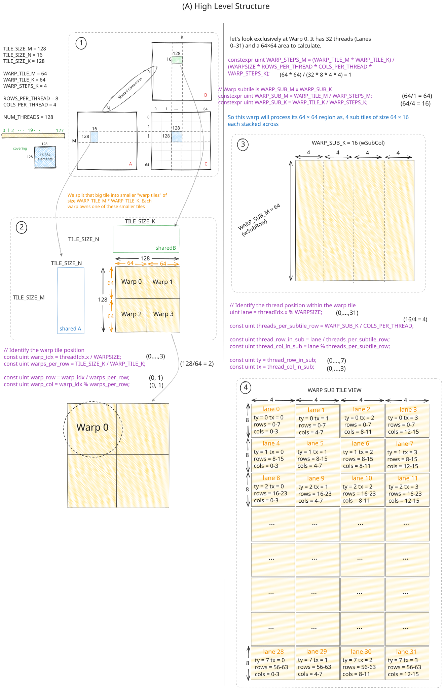

이제 단일 thread 의 관점에서 연산 흐름을 시각화한다.

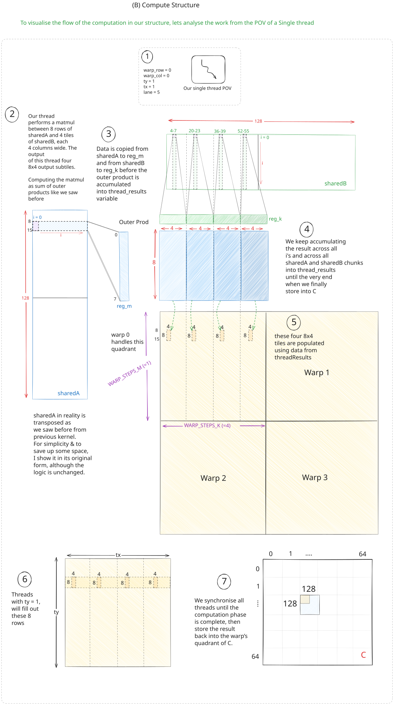

이 추가 tiling 단계는 여러 이점을 제공한다.

### 하드웨어 스케줄링과의 정렬

warp 는 NVIDIA GPU 의 기본 실행 단위다. 각 warp 에 자기만의 출력 sub-tile 을 줌으로써, 작업 분할을 하드웨어가 실제로 명령어를 스케줄링하는 방식과 맞추게 된다.

그렇게 하면 각 warp 가 독립적으로 실행될 수 있다. 한 warp 가 메모리에서 stall 되어도 다른 warp 는 계속 실행할 수 있어, warp scheduler 슬롯을 채운 상태로 유지하고 유휴 사이클을 줄인다.

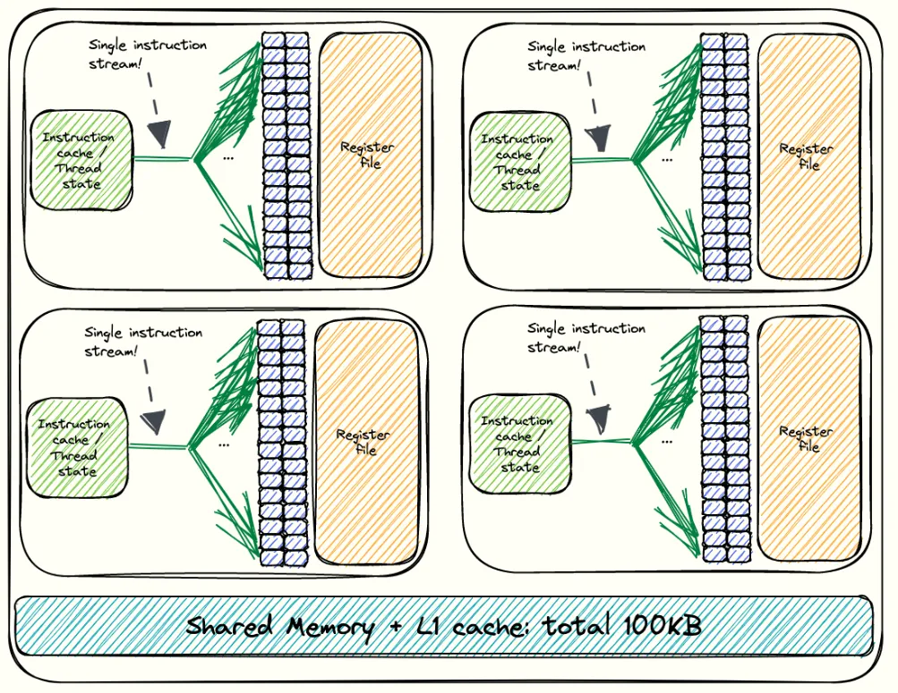

### shared memory 접근에 대한 제어

warp tile 은 각 warp 의 footprint 를 작게 유지하고 lane 별 stride 를 단순하고 반복적으로 만든다. 덕분에 bank 친화적인 레이아웃을 설계하기 쉬워진다. 스포일러! 이것이 이 커널에서 SMEM 로드 conflict 가 나타나지 않은 이유다.

### register 캐시 지역성 개선

각 Streaming Multiprocessor 안의 register file(RF)은 thread 별 변수를 저장한다. Hopper 에서는 이것이 여러 개의 single-ported bank 로 나뉜다(SMEM bank 와 비슷하다!). 한 bank 는 사이클당 하나의 접근만 처리할 수 있다. 같은 warp 의 두 thread 가 같은 사이클에 같은 bank 에서 읽으려 하면 접근이 직렬화된다. 이것도 bank conflict 라고 부르는데 register 에 대한 것이며, 명령어의 피연산자를 가져오는 데 걸리는 시간을 늘린다. 안타깝게도 NVIDIA 의 프로파일링 도구는 이런 conflict 에 대한 지표를 제공하지 않아, 이 커널에서 실제로 개선되었는지 확인하기 어렵다.

RF 와 실행 유닛 사이에는 Operand Collector Unit(OCU)이 있다. 논문: [BOW Breathing Operand Windows to Exploit Bypassing in GPUs](https://microarch.org/micro53/papers/738300a996.pdf). 각 OCU 는 register bank 에서 소스 피연산자를 가져와 128 바이트 엔트리 세 개가 들어가는 작은 버퍼에 저장한다. 어떤 피연산자가 곧 다시 필요해지면 메인 RF 로 돌아가는 대신 이 버퍼에서 직접 제공될 수 있다. 이는 bank conflict 와 추가 RF 트래픽을 모두 피하게 해 준다.

warp tiling 은 여기서 도움이 된다. 각 warp 가 출력 행렬의 작고 고정된 sub-tile 을 다루므로 안쪽 루프에서 같은 register 를 반복해서 재사용하는 경향이 있기 때문이다. 이는 bank conflict 가능성을 낮추고 피연산자가 OCU 버퍼에서 바로 재사용될 가능성을 높인다.

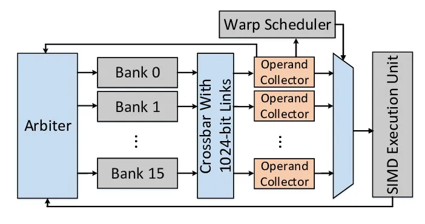

다시 말하지만 이는 추측이며 실제로 차이를 만드는지는 잘 모르겠다. 다만 그럴듯해 보인다.

바뀐 주요 코드 부분은 다음과 같다.

``` code-block
// Iterate over the shared dimension of the SMEM tiles
for (int i = 0; i < TILE_SIZE_N; i++)
{
    // Load slice at current i iteration in sharedA's register
    for (int wSubRow = 0; wSubRow < WARP_STEPS_M; wSubRow++)
    {
        uint base_row =
            (warp_row * WARP_TILE_M) +
            (wSubRow * WARP_SUB_M) +
            (ty * ROWS_PER_THREAD);

        // Each thread loads ROWS_PER_THREAD into the register
        #pragma unroll
        for (int row = 0; row < ROWS_PER_THREAD; row += 4)
        {
            const float4 va =
                reinterpret_cast<const float4*>(
                    &sharedA[i * STRIDE_A + base_row + row])[0];

            reg_m[wSubRow * ROWS_PER_THREAD + row + 0] = va.x;
            reg_m[wSubRow * ROWS_PER_THREAD + row + 1] = va.y;
            reg_m[wSubRow * ROWS_PER_THREAD + row + 2] = va.z;
            reg_m[wSubRow * ROWS_PER_THREAD + row + 3] = va.w;
        }

        for (int wSubCol = 0; wSubCol < WARP_STEPS_K; wSubCol++)
        {
            uint col_base =
                (warp_col * WARP_TILE_K) +
                (wSubCol * WARP_SUB_K) +
                (tx * COLS_PER_THREAD);

            // Each thread loads COLS_PER_THREAD into the register x 4 times in our case since WARP_STEPS_K = 4
            #pragma unroll
            for (int col = 0; col < COLS_PER_THREAD; col += 4)
            {
                const float4 vb =
                    reinterpret_cast<const float4*>(
                        &sharedB[i * STRIDE_B + col_base + col])[0];

                reg_k[wSubCol * COLS_PER_THREAD + col + 0] = vb.x;
                reg_k[wSubCol * COLS_PER_THREAD + col + 1] = vb.y;
                reg_k[wSubCol * COLS_PER_THREAD + col + 2] = vb.z;
                reg_k[wSubCol * COLS_PER_THREAD + col + 3] = vb.w;
            }
        }

        // Compute outer product
        for (int wSubRow = 0; wSubRow < WARP_STEPS_M; wSubRow++)
        {
            for (int wSubCol = 0; wSubCol < WARP_STEPS_K; wSubCol++)
            {
                #pragma unroll
                for (int im = 0; im < ROWS_PER_THREAD; im++)
                {
                    float fixed_temp =
                        reg_m[wSubRow * ROWS_PER_THREAD + im];

                    #pragma unroll
                    for (int ik = 0; ik < COLS_PER_THREAD; ik++)
                    {
                        float out =
                            fixed_temp * reg_k[wSubCol * COLS_PER_THREAD + ik];

                        int out_idx =
                            (wSubRow * ROWS_PER_THREAD + im) *
                            (WARP_STEPS_K * COLS_PER_THREAD) +
                            (wSubCol * COLS_PER_THREAD + ik);

                        thread_results[out_idx] += out;
                    }
                }
            }
        }
    }
}
__syncthreads();

A += TILE_SIZE_N;     // Move right
B += TILE_SIZE_N * K; // Move down
```

이 커널을 padding 전후로 테스트해 보았다.

#### 패딩 없는 warp tiling

- Compute: SM busy 74%, FMA 가 최상위 파이프(활성 사이클의 64%), executed IPC 약 2.97.
- Memory: 약 372 GB/s, L1/TEX hit 약 4.3%, Mem Busy 약 55%.
- Conflict: shared store 에서 평균 약 4-way bank conflict 보고, shared load 는 지적되지 않음.
- 압력/occupancy: thread 당 약 165 register → achieved occupancy 18%, scheduler 에서 "not selected" 공백이 많이 보임(발행 간 사이클의 33%).

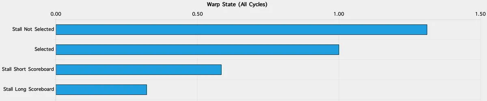

#### 패딩한 warp tiling

- Compute: SM busy 약 75–76%, executed IPC 약 3.03–3.04(소폭 상승).
- Memory: 약 394–396 GB/s, L1/TEX hit 약 7–9% 로 상승, Mem Busy 약 52%.
- Conflict: shared store 가 평균 약 2.5-way 로 감소. shared load 는 여전히 지적되지 않음.
- 압력/occupancy: thread 당 약 167 register, achieved occupancy 는 여전히 18%, "not selected" stall 이 여전히 눈에 띄는 비중(31%)을 차지.

정리하면 이렇다. 이 warp tiling 커널에서 padding 은 주로 스토어 경로(sharedA 로의 전치 쓰기)에 도움이 되었고, store conflict 카운터가 약 4.0 에서 대략 2.5-way 로 떨어진 것과 일치한다. **앞선 벡터화 커널과 달리 여기서는 load conflict 가 문제가 아니었다**. 우리가 특별히 뭘 하지 않았는데도 로드 쪽에서 조용히 도움을 준 것이 두 가지 있다. `COLS_PER_THREAD = 4` 를 쓰는데 이것이 `sharedB` lane 들을 더 많은 bank 그룹에 분산시켜 주고, warp 로컬 sub-tile 이 lane 패턴의 aliasing 을 줄여 준다. 이 둘이 합쳐져서 패딩 전후 어느 실행에서도 프로파일러가 shared load conflict 를 지적하지 않은 것이다.

여전히 발목을 잡는 것은 다른 데 있다. register pressure 때문에 achieved occupancy 가 약 18% 에 머물고, 이것이 "not selected" scheduler stall 로 나타난다. 그리고 메모리가 약 52% 인 데 비해 FMA busy 는 60% 대 후반이라 여전히 대체로 compute-bound 이므로, 몇 GB/s 를 더 짜내는 것보다 복사와 연산을 겹치거나 register 를 줄여 상주 warp 를 하나 더 확보하는 편이 훨씬 효과가 크다.

## Kernel 7: Tensor Cores (Async TMA + WGMMA)

> 📝 **중요한 참고:** 이 커널부터 차원 표기를 뒤집어 `A = MxK`, `B=KxN` 으로 쓴다. 뒤에 나올 Tensor Core 명령어가 행렬이 그 형식이기를 기대하기 때문이다. 이전 커널들의 논리는 그대로이고 명명 규칙만 다르다. **이후 반복 작업에서는 일관성을 위해 위의 모든 코드와 그림도 바꿀 예정이다.**

서론에서 H100 의 Tensor Core 구성 요소를 짧게 언급했다. 이제 그것이 어떻게 동작하고 성능을 크게 높이는 데 어떻게 쓸 수 있는지 자세히 보자. 이 커널이 끝날 무렵에는 성능이 치솟는 것을 보게 될 것이다.

NVIDIA 의 최근 GPU 아키텍처에서 가장 중요한 진전 중 하나는 Tensor Core 의 도입과 진화다. 진지한 병렬 연산을 위해 고급 GPU 를 사는 주된 이유가 바로 이것이다. 처음부터 있던 것은 아니고 Volta 아키텍처(V100)에서 처음 도입되었다. 즉 표준 CUDA core 에 맞춰 최적화한 우리의 이전 커널들은 Volta 이전 아키텍처에서는 최신 기법에 해당한다.

Tensor Core 는 GPU 의 연산 모델을 근본적으로 바꾼다. **matrix multiplication and accumulation(MMA)** 을 가속하기 위해 전용으로 설계된 엔진이다.

- 단순한 스칼라 명령어(`a @ b + c` 같은)를 실행하는 CUDA Core 와 달리, Tensor Core 는 `D = A @ B + C` 같은 행렬 연산 전체를 수행하는 단일 명령어를 실행한다. 이 구조는 흔히 **Complex Instruction Set Computer(CISC)** 에 비유된다. 단일 **CISC** 명령어는 메모리에서 값을 적재하고, 산술 연산을 수행하고, 결과를 메모리에 다시 쓰는 것 같은 여러 저수준 연산을 한 단계로 수행할 수 있다. 반면 **RISC** 아키텍처는 각각 하나의 기본 연산만 수행하는 매우 단순한 명령어를 쓴다.

- 전력 밀도: 이 CISC 같은 접근이 엄청난 속도의 열쇠다. 명령어 하나가 큰 데이터 블록을 다루므로 명령어 디코딩 같은 연산당 오버헤드가 극적으로 줄어든다.

예를 들어 보자.

나중에 사용할 **Warp Group Matrix Multiply and Accumulate(WGMMA)** 명령어는 `wgmma.mma_async.sync.aligned.m64n64k16.f32.bf16.bf16` 와 같이 쓴다. 여기서 `m64n64k16` 은 행렬 차원을 나타낸다. 바깥 차원은 `m` 과 `n` 으로 맨 앞과 맨 뒤에 오고, 누적을 위한 공유 내부 차원 `k` 는 가운데에 있다. 이 복잡한 명령어는 행렬 `A`, `B` 와 accumulator `C` 에 대해 `D = A @ B + C` 를 계산한다(`C` 는 흔히 `D` 와 물리적으로 같은 행렬이다). 곱해 보면 이 명령어가 64 \* 16 \* 64 = 65,536 번의 multiply-accumulate(MAC) 연산을 수행함을 알 수 있다.

CUDA core 만 쓰는 우리의 warp tiling 커널과 비교해 보자.

``` code-block
float out = fixed_temp * reg_k[...]; // multiplication
thread_results[out_idx] += out;       // addition (accumulation)
```

우리는 명령어(FMA)당 **MAC 1 회**만 했다. 같은 작업을 끝내려면 CUDA Core 는 65,536 번의 FMA 명령어를 실행해야 한다. WGMMA 에서는 하나의 **warp group**(128 thread)이 하나의 WGMMA 명령어로 65,536 번의 MAC 을 전부 수행한다.

**WGMMA** 와 **warp group** 이라는 새 개념이 나왔으니 잠시 물러서 보자. 이 개념들은 Hopper 아키텍처 고유의 것으로 이전 GPU 에는 없었다. 왜 이것이 중요한지, 그리고 이 커널에서 왜 WGMMA 에 의존하게 되는지를 이해하려면, Hopper 이전에 Tensor Core 를 어떻게 프로그래밍했는지, 그리고 프로그래밍 모델이 여기까지 어떻게 진화했는지를 짧게 살펴보는 것이 도움이 된다.

Hopper 이전에 Tensor Core 를 프로그래밍하는 일반적인 방법은 **WMMA** API(Warp Matrix Multiply Accumulate)였다. 이 인터페이스는 Volta 에서 도입되어 Turing 과 Ampere 로 이어졌고 `nvcuda::wmma` 로 제공되었다. Tensor Core 를 활용하는 높은 수준의 추상화를 제공했고 내부의 세부 사항 대부분을 API 가 처리했다.

이후 NVIDIA 는 하부의 Tensor Core 명령어를 직접 노출했다. 이것이 Turing 과 Ampere 의 `MMA PTX` 명령어다. 이들도 warp 수준에서 동작하며, 32 개 thread 가 협력해 행렬에 대한 더 작은 MMA 연산을 수행한다. 이 명령어에 데이터를 올바르게 공급하기 위해 아키텍처는 `ldmatrix` 라는 특별한 warp 단위 로드 명령어를 추가했다. 이는 필요한 packed fragment 를 shared memory 에서 register 로 끌어온다. 이 단계에서 전형적인 Tensor Core 커널은 각 warp 안에서 명확한 패턴을 따랐다. `ldmatrix` 로 SMEM 에서 `A` 와 `B` 의 fragment 를 적재하고, 하나 이상의 `mma.sync` 명령어를 발행한 뒤, 누적된 결과를 내보낸다.

Hopper 에서는 tensor 연산이 warp 수준에서 **warp group** 수준으로 올라가, **128(32\*4)** 개 thread 가 훨씬 큰 단일 MMA 에 협력한다. 이 명령어들은 더 이상 작은 warp 크기 tile 에서 동작하지 않고, 대신 이미 shared memory 에 올라와 있어야 하는 훨씬 큰 `A` 와 `B` 블록을 다룬다. WGMMA 는 이 tile 들이 특정한 **swizzle** 레이아웃으로 나타나기를 기대하므로 자연스러운 질문이 생긴다.

필요한 행렬 tile 을 WGMMA 가 기대하는 정확한 형식으로 shared memory 에 올리되, Tensor Core 가 놀지 않을 만큼 빠르게 하려면 어떻게 해야 할까?

여기서 서론에서 이야기한 **Tensor Memory Accelerator(TMA)** 가 등장한다.

H100 에서 TMA 는 전용 병렬 복사 엔진으로 동작하며 데이터 병목을 해결한다.

- **Bulk Loading:** 단 하나의 하드웨어 명령으로 GMEM 에서 SMEM 으로 2D tile 전체(`A` 와 `B` 의 블록)를 옮긴다.

- **Asynchronous Transfer:** 결정적으로 전송이 백그라운드에서 돌아간다. 덕분에 TMA 가 다음 반복을 위한 2D tile 을 이미 가져오는 동안 Tensor Core 는 현재 데이터를 처리할 수 있다.

"bulk loading" 부분은 예전에 프로그래머의 몫이었던 많은 복잡성을 감춰 준다. 이전 커널에서는 각 thread 에게 정확히 어떤 원소를 가져오라고 알려 주는 번거로운 코드를 써야 했다. 이제 수동 인덱싱은 하드웨어로 넘어갔다. 더 이상 GMEM 에서 SMEM 으로 특정 원소를 적재하기 위해 thread 를 일일이 관리할 필요가 없다.

게다가 전처럼 SMEM bank conflict 를 피하려고 padding 을 수동으로 다룰 필요도 없다. 하드웨어가 **swizzling** 이라 불리는 것을 자동으로 적용한다. 이 레이아웃은 손으로 코딩하기 복잡한데, 다행히 NVIDIA 가 이 패턴을 TMA 에 직접 구현해 두었다. 우리가 알아야 할 것은 bank conflict 가 사실상 "공짜로" 처리된다는 점뿐이다. swizzling 패턴의 "어떻게"에 대한 자세한 내용은 [Aleksa 의 글](https://www.aleksagordic.com/blog/matmul#cpt4) 이 깊이 다룬다. 다음은 SMEM 으로의 swizzle 된 복사가 상위 수준에서 어떤 모습인지 보여주려고 그가 쓴 그림이다.

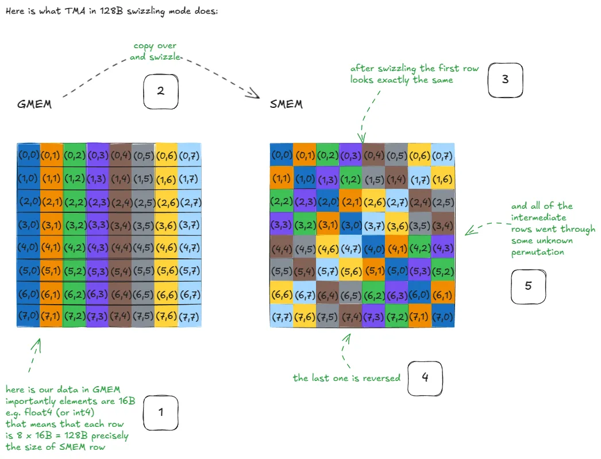

TMA 를 쓰려면 세 가지 주요 단계가 필요하다.

1.  행렬 `A` 와 `B` 에 대한 tensor map 을 (host 에서) 구성한다.
2.  커널에서 TMA 연산을 트리거한다(보통 block 안의 thread 하나만 발행한다).
3.  전용 Shared Memory barrier 로 동기화한다.

### Tensor Map

Tensor Map 은 하드웨어가 해석할 수 있는 디스크립터다. 메모리 안 텐서의 shape, 레이아웃, stride 를 기술해, TMA 가 thread 수준의 주소 계산 없이 다차원 tile 전체를 옮길 수 있게 한다.

이전 커널들과 달리 `const float* A` 같은 raw 포인터를 커널 인자로 넘기지 않는다. 대신 `CUtensorMap` 디스크립터에 대한 포인터를 넘긴다. 이는 CUDA Driver 가 정의한 구조체로, 행렬의 전체 메타데이터(shape, stride, swizzle 패턴)를 인코딩해 하드웨어가 tile 을 직접 가져올 수 있게 한다.

이 map 을 만들기 위해 **CUDA Driver API** 의 [`cuTensorMapEncodeTiled`](https://docs.nvidia.com/cuda/cuda-driver-api/group__CUDA__TENSOR__MEMORY.html#group__CUDA__TENSOR__MEMORY_1ga7c7d2aaac9e49294304e755e6f341d7) 함수를 사용한다.

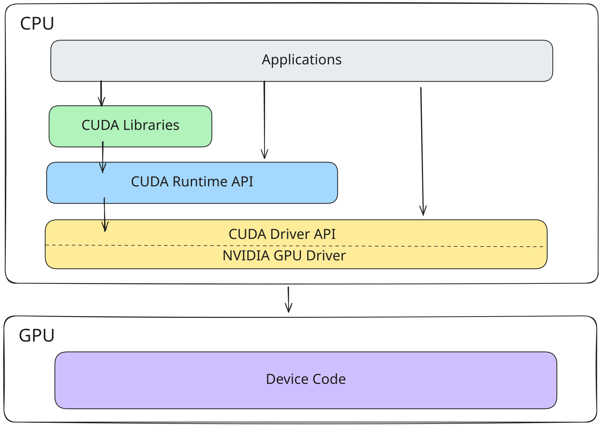

이것들은 CUDA 소프트웨어 플랫폼을 구성하는 서로 다른 요소들이며, 무엇을 host 에서 호출해야 하고 무엇이 device 에서 허용되는지 보려면 이를 이해하는 것이 중요하다.

스택의 맨 아래에는 **CUDA Driver API** 가 있다. GPU 에 대해 가장 세밀한 제어를 제공하지만 더 장황하고 복잡하다. tensor map 생성 같은 저수준 연산은 이 수준에서 명시적으로 노출된다.

Driver API 위에는 **CUDA Runtime API** 가 있어 이 기능의 상당 부분을 감싸고 더 높은 수준의 인터페이스를 제공한다. 예를 들어 runtime API 의 `cudaMalloc` 은 driver API 의 `cuMemAlloc` 을 얇게 감싼 것이다.

두 API 위에는 일반 워크로드와 도메인별 워크로드에 고도로 최적화된 커널을 제공하는 **CUDA 라이브러리** 가 있다. 선형대수를 위한 cuBLAS, 심층 신경망을 위한 cuDNN 같은 것들이다. 실무에서는 대부분의 코드가 runtime API 를 쓰지만, TMA tensor map 같은 일부 Hopper 기능은 현재 CUDA Driver API 로만 노출된다.

이 함수는 우리가 기술한 행렬 정보를 받아 TMA 엔진이 이해하는 128B 하드웨어 디스크립터로 포장한다. TMA 하드웨어가 매우 특수하기 때문에 이 128B 객체는 메모리에서 128B 경계에 정렬되어야 하며, 그렇지 않으면 하드웨어가 아예 읽지도 못한다!

과정은 다음과 같다.

1.  `cudaMalloc` 으로 device 에 tensor map 용 메모리를 할당한다.
2.  Driver API 를 써서 Host(CPU)에서 map 을 인코딩한다.
3.  `cudaMemcpy` 로 map 을 Host 에서 Device 로 복사한다.

다음 코드 조각에서 이 단계들을 다음과 같이 수행한다.

``` code-block
template <const uint BlockMajorSize, const uint BlockMinorSize>
__host__ static inline CUtensorMap *
create_and_allocate_tensor_map(bf16 *tensor_ptr, uint blocks_height, uint blocks_width) {
    CUtensorMap *tensor_map;
    // Allocate device memory for the tensor map descriptor.
    CUDA_CHECK(cudaMalloc((void **)&tensor_map, sizeof(CUtensorMap)));
    // Register the tensorMap in our device memory pointers
    // resources.add_device_ptr(tensor_map);
    // Create on host
    CUtensorMap tensor_map_host;
    create_tensor_map<BlockMajorSize, BlockMinorSize>(&tensor_map_host, tensor_ptr, blocks_height, blocks_width);
    // Copy descriptor to device
    CUDA_CHECK(cudaMemcpy(tensor_map, &tensor_map_host, sizeof(CUtensorMap), cudaMemcpyHostToDevice));
    return tensor_map;
}
```

그리고 텐서의 메타데이터를 인코딩해 실제로 tensor map 을 만드는 함수는 다음과 같다.

``` code-block
template <const uint BlockMajorSize, const uint BlockMinorSize>
void create_tensor_map(CUtensorMap *tensor_map, bf16 *tensor_ptr, uint blocks_height, uint blocks_width) {
    // Starting address of memory region described by tensor (casting to void
    // as the tensor map descriptor is type-agnostic.)
    void *gmem_address = static_cast<void *>(tensor_ptr);
    uint num_tiles_major = blocks_height;
    uint num_tiles_minor = blocks_width;
    // full size of the tensor in global memory (API expects the 5D supported
    // tensor ranks to be defined)
    uint64_t global_dim[5] = {
        static_cast<uint64_t>(BlockMinorSize * num_tiles_minor),
        static_cast<uint64_t>(BlockMajorSize * num_tiles_major),
        1, 1, 1};
    // Define the tensor strides (in bytes) along each of the tensor ranks dims - 1
    uint64_t global_strides[5] = {
        sizeof(bf16),
        sizeof(bf16) * BlockMinorSize * num_tiles_minor,
        0, 0, 0};
    // Define the shape of the "box_size" -> the tile shapes a TMA ops will load
    uint32_t box_dim[5] = {
        static_cast<uint32_t>(BlockMinorSize),
        static_cast<uint32_t>(BlockMajorSize),
        1, 1, 1};
    uint32_t elem_strides[5] = {1, 1, 1, 1, 1};
    // Create tensor map
    CU_CHECK(cuTensorMapEncodeTiled(
        tensor_map, CU_TENSOR_MAP_DATA_TYPE_BFLOAT16, 2, gmem_address,
        global_dim, global_strides + 1, box_dim, elem_strides,
        CU_TENSOR_MAP_INTERLEAVE_NONE, CU_TENSOR_MAP_SWIZZLE_128B,
        CU_TENSOR_MAP_L2_PROMOTION_NONE, CU_TENSOR_MAP_FLOAT_OOB_FILL_NONE));
}
```

다음으로 WGMMA 명령어를 이야기하자. WGMMA 명령어는 이전 커널의 일반적인 로드/스토어처럼 raw 바이트 주소를 직접 쓰지 않는다. 대신 행렬이 shared memory 어디에 있고 어떻게 배치되어 있는지를 하드웨어에 알려 주는 packed 64 비트 matrix descriptor 를 받는다.

matrix descriptor 의 형식은 [문서](https://docs.nvidia.com/cuda/parallel-thread-execution/index.html?spm=a2ty_o01.29997173.0.0.883dc921B6BCcR#asynchronous-warpgroup-level-matrix-shared-memory-layout-matrix-descriptor) 에 다음과 같이 기술되어 있다.

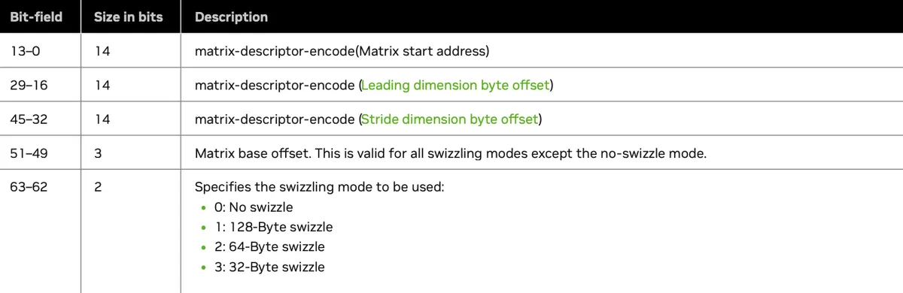

원래 주소는 바이트 주소다. 예를 들어 16384 바이트 위치의 주소는 16 진수로 0x4000 이다. 디스크립터가 raw 바이트 주소를 그대로 저장한다면 비트가 매우 빠르게 모자라서 주소 지정 범위가 심하게 제한될 것이다.

대신 하드웨어는 중요한 성질을 활용한다. WGMMA 가 쓰는 SMEM 피연산자는 항상 최소 16B 로 정렬된다는 점이다. 즉 유효한 주소의 하위 4 비트는 항상 0 이고 유용한 정보를 담지 않는다.

그래서 디스크립터는 바이트 주소 대신 16B 단위의 주소를 저장한다. 위 표에서 볼 수 있듯 이 인코딩은 base address 뿐 아니라 leading dimension 과 stride 오프셋에도 적용된다. 이렇게 함으로써 디스크립터는 필요한 모든 메타데이터를 하드웨어가 warp group 전체에 효율적으로 broadcast 하고 디코딩할 수 있는 단일 64 비트 값 안에 담으면서도 훨씬 큰 SMEM 영역을 표현할 수 있다.

이 인코딩이 어떻게 일어나는지에 대한 개념적 예시는 다음과 같다.

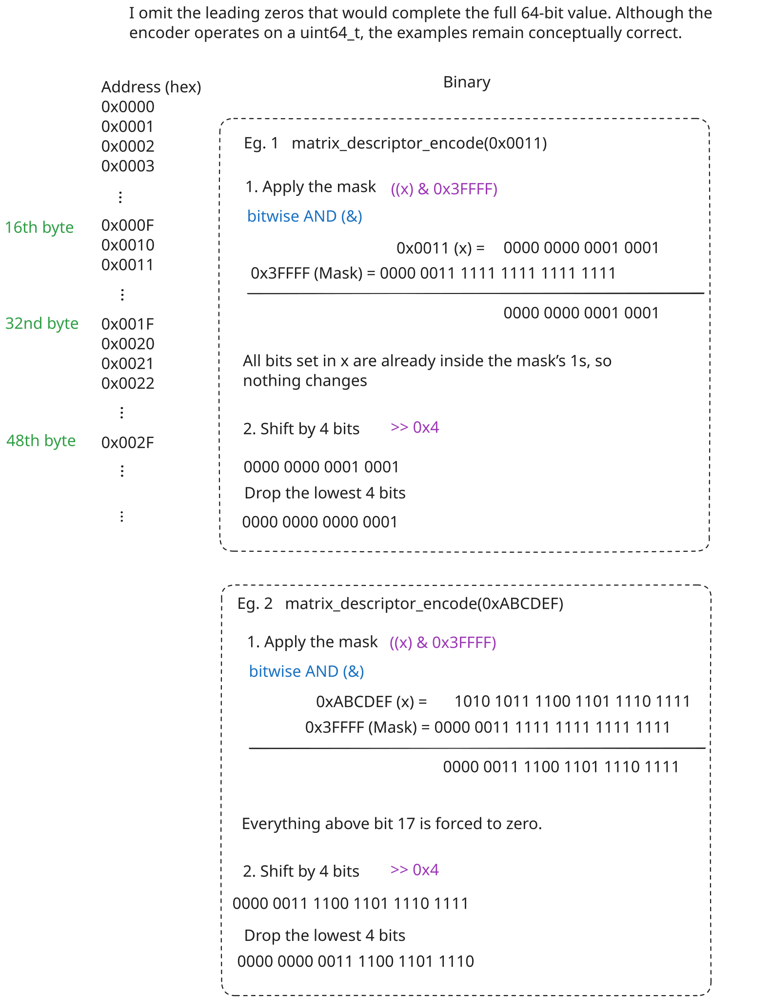

WGMMA matrix descriptor 는 커널 안에서 만들어지므로 인코딩 로직과 디스크립터 구성은 device 에서 실행되어야 한다. 우리는 `make_smem_descriptor` 함수에서 matrix descriptor 를 구성한다.

또한 인코딩하기 전에 먼저 일반 포인터 `bf16*` 를 `__cvta_generic_to_shared` 로 shared memory 주소로 변환해야 한다. 이 단계는 미묘하지만 필수적이다. WGMMA 는 C++ 추상화가 아니라 매우 특정한 형식의 SMEM 바이트 주소를 기대하는 저수준 하드웨어 명령어다. 일반적인 CUDA C++ 포인터는 자신의 주소 공간(global, shared 등)을 명시적으로 인코딩하지 않으므로 그대로 쓰거나 인코딩할 수 없다. 대신 먼저 포인터를 하드웨어가 이해하는 구체적인 SMEM 주소로 변환한 뒤에야 그것을 압축해 matrix descriptor 에 담을 수 있다. CUDA C++ 포인터는 generic 하다. 즉 주소 공간을 명시적으로 인코딩하지 않고도 global 이나 shared memory 의 객체를 가리킬 수 있다. 이 추상화는 일반적인 C++ 로드/스토어에서는 잘 동작하지만, PTX 명령어나 WGMMA 같은 하드웨어 인터페이스와 직접 상호작용할 때는 무너진다. 이런 인터페이스는 특정 메모리 공간을 명시적으로 가리키는 주소를 요구한다. 이 간극을 메우기 위해 CUDA 는 generic 포인터를 PTX 명령어와 하드웨어 디스크립터가 소비할 수 있는 shared memory 주소로 변환하는 \_\_cvta_generic_to_shared 같은 주소 공간 변환 intrinsic 을 제공한다. 두 함수의 코드는 다음과 같다.

``` code-block
__device__ static inline uint64_t matrix_descriptor_encode(uint64_t x) {
    return ((x) & 0x3FFFF) >> 4;
}

__device__ uint64_t make_smem_desc(bf16* ptr) {
    uint32_t address = static_cast<uint32_t>(__cvta_generic_to_shared(ptr));
    // Initialise an empty 64 bit descriptor
    uint64_t desc = 0x0000000000000000;
    // bitwise OR
    // sets bits [13:0] encoded matrix start address
    desc |= matrix_descriptor_encode(address);
    // sets bits [29:16] leading dimension byte offset
    desc |= matrix_descriptor_encode(static_cast<uint64_t>(16)) << 16;
    // sets bits [45: 32] stride dimension byte offset
    desc |= matrix_descriptor_encode(static_cast<uint64_t>(1024)) << 32;
    // sets bits [62: 63] swizzle mode
    desc |= 1llu << 62;
    return desc;
}
```

`make_smem_desc` 함수에서는 먼저 최종적으로 반환할 빈 64 비트 디스크립터를 초기화한다. 그다음 위의 matrix descriptor 레이아웃에 따라 필드를 하나씩 채운다.

먼저 matrix start address 를 인코딩해 디스크립터의 비트 [13:0] 에 넣는다. 이는 shared memory 안 행렬의 base address 를 16 바이트 단위로 인코딩한 것이다. 다음으로 leading dimension byte offset 을 인코딩해 비트 [29:16] 에 넣는다. 이는 행렬의 leading dimension 을 따라 한 칸 나아가기 위해 하드웨어가 몇 바이트를 움직여야 하는지를 기술한다.

세 번째 필드는 stride dimension byte offset 으로 비트 [45:32] 에 들어간다. 문서의 설명은 다음과 같다.

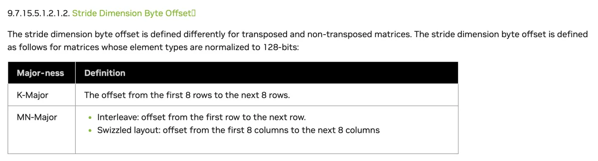

개념적으로 이 필드는 다음 질문에 답한다.

*"(K 차원을 따라) 열 0–7 에서 열 8–15 로 가려면 몇 바이트를 움직여야 하는가?"*

아직 정확한 tile shape 을 소개하지 않았지만 미리 말하면 `sharedA` 는 64 × 64 행렬이 된다. 각 열은 64 개의 bf16 원소를 담고 bf16 하나는 2 바이트이므로 한 열은 128 바이트 폭이다. 따라서 K 를 따라 8 개 열을 건너뛰려면 `8 × 128 bytes = 1024 bytes` 가 필요하다. 그래서 stride dimension byte offset 을 1024 로 인코딩한다.

마지막 필드는 swizzling 모드를 지정하며 비트 [63:62] 에 저장된다. 128 바이트 swizzling 을 쓰므로 이 필드를 1 로 설정한다. 이 필드는 바이트 오프셋이 아니라 고정된 열거값이므로 인코딩 함수를 거치지 않는다.

### 커널 구조

이제 본론으로 들어가 커널 자체를 이야기하며 모든 것을 합쳐 보자. 다만 지금은 WGMMA 명령어를 어떻게 정의하는지 세부로 들어가지 않는다는 단서를 붙인다. 이야기의 흐름을 위해 당분간 블랙박스로 두고 나중에 자세히 돌아오겠다.

커널 코드를 보기 전에 먼저 상위 수준의 커널 흐름 구조를 정리하고 그것이 어떤 모습인지 시각적으로 보여주고 싶다.

1.  이 시리즈 내내 써 온 동일한 block tiling 전략으로 시작한다. 이것이 GMEM 관점이자 가장 높은 수준의 추상화다.
2.  K 차원을 도는 각 반복에서 TMA 로 `A` 와 `B` 의 완전한 2D tile 을 GMEM 에서 SMEM 으로 적재한다.
3.  그다음 warp group 이 이 tile 에 대해 WGMMA 연산을 발행한다. 우리 커널에서는 `K` 반복마다 네 개의 `m64n64k16` WGMMA 명령어를 발행한다는 뜻이다.
4.  모든 `K` tile 이 처리될 때까지 이를 반복하며 결과는 register 에 누적된다.
5.  마지막에 각 thread 가 자신의 register fragment 를 global memory 로 저장해 `C` 의 최종 출력 tile 을 만든다.

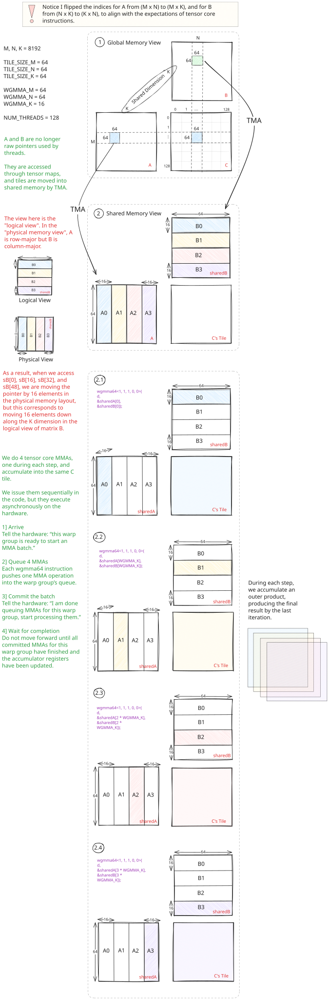

보다시피 각 Tensor Core MMA 에서 우리는 `sharedA` 의 subtile 과 `sharedB` 의 subtile 의 outer product 를 취해 크기 `TILE_SIZE_M(64) × TILE_SIZE_N(64)` 의 accumulator tile 을 갱신한다.

피연산자 배치 규칙은 다음과 같다.

- `sharedA` 는 register 나 shared memory 에 있을 수 있다.
- `sharedB` 는 반드시 shared memory 에 있어야 한다.
- accumulator `D` 는 반드시 register 에 있어야 한다(그림에서 `C 의 tile`).

명백히 단일 thread 는 64 × 64 accumulator 전체를 담을 수 없다. 대신 accumulator 는 warp group 전체에 분산된다. 우리 경우 warp group 은 128 개 thread 로 이루어지고, 128 개 thread 전부가 협력해 각 `m64n64k16` WGMMA 명령어를 실행한다. 하나의 `K` 반복 안에서 warp group 은 여러 WGMMA 명령어를 연달아 발행하며, 각각은 `K` 차원의 서로 다른 조각(2.1, 2.2 등)을 다루면서 동일한 thread 별 register 에 누적한다. 이 명령어들이 함께 완전한 64 × 64 출력 tile 을 쌓아 올린다.

이 레이아웃은 우리가 수동으로 고르는 것이 아니다. 하드웨어가 고정하며 PTX 문서의 [9.7.15.5.1.1.](https://docs.nvidia.com/cuda/parallel-thread-execution/#asynchronous-warpgroup-level-matrix-fragment) 절에 기술되어 있다. 이 절은 `m64n64k16` 에 대한 register fragment 레이아웃을 정의하고 accumulator tile 이 warp group 에 어떻게 분산되는지 설명한다.

코드에서는 thread 별 accumulator register 를 초기화할 때 이것이 드러난다.

``` code-block
// Initialise thread's accumilator
// d[4][8] = 32 floats per thread
float d[WGMMA_N / 16][8];
memset(d, 0, sizeof(d));
```

각 thread 는 정확히 32 개의 부동소수점 accumulator 값을 소유하며, 이들이 모여 전체 64 × 64 출력 tile 에서 그 thread 의 fragment 를 이룬다. 각 WGMMA 단계에서 이 register 들은 제자리에서 갱신된다. 다음으로 `sharedA` 와 `sharedB` 로의 쓰기를 동기화하기 위해 두 개의 SMEM barrier 를 만들고 초기화한다. 두 barrier 모두 warp group 의 128 개 thread 전부로 초기화된다.

``` code-block
// SMEM barriers for A and B
__shared__ barrier barA; 
__shared__ barrier barB;

if (threadIdx.x == 0) {
    init(&barA, blockDim.x);
    init(&barB, blockDim.x);
    cde::fence_proxy_async_shared_cta();
}
__syncthreads();
```

`cuda::barrier<cuda::thread_scope_block>` API(`barrier` 로 별칭을 붙였다)를 쓰면서도 여전히 `__syncthreads()` 를 한 번 발행한다는 점에 주목하자. 이는 부트스트랩 문제 때문이다.

[문서](https://docs.nvidia.com/cuda/cuda-programming-guide/04-special-topics/async-barriers.html) 에 나와 있듯, thread 들이 이 barrier 로 동기화를 시작하려면 먼저 커널 안에서 barrier 가 초기화되어야 한다. 그런데 애초에 barrier 를 초기화하기 위해 thread 들은 어떻게 동기화할까?

그래서 여전히 `__syncthreads()` 를 쓴다. barrier 가 초기화된 뒤 모든 thread 가 동기화되도록 보장하기 위해, 더 오래된 동기화 primitive 로 딱 한 번 잠깐 돌아가는 것이다(앞선 커널에서 보았듯 `__syncthreads()` 는 초기화가 필요 없다). 이 일회성 부트스트랩 이후에는 커널의 나머지 부분에서 `cuda::barrier` 를 안전하게 정상적으로 쓸 수 있다.

그다음 이전의 모든 커널과 마찬가지로 `num_blocks_k`(공유 차원)를 도는 바깥 루프를 시작하고 TMA 로 bulk 로드를 발행하기 시작한다.

``` code-block
barrier::arrival_token tokenA, tokenB;
for (int block_k_iter = 0; block_k_iter < num_blocks_k; block_k_iter++) {
    // Async loads (Only 1 thread launches the TMA op)
    if (threadIdx.x == 0) {
        // Thread 0 launches async bulk tensor copy operations for both matrices
        cde::cp_async_bulk_tensor_2d_global_to_shared(&sharedA[0], tensorMapA, block_k_iter * TILE_SIZE_K, num_block_m * TILE_SIZE_M, barA);
        // Signal barrier and wait for both loads to complete
        tokenA = cuda::device::barrier_arrive_tx(barA, 1, sizeof(sharedA));
        cde::cp_async_bulk_tensor_2d_global_to_shared(&sharedB[0], tensorMapB, block_k_iter * TILE_SIZE_K, num_block_n * TILE_SIZE_N, barB);
        tokenB = cuda::device::barrier_arrive_tx(barB, 1, sizeof(sharedB));
    }
    else {
        // Other threads arrive at barrier to synchronise data loads
        tokenA = barA.arrive();
        tokenB = barB.arrive();
    }
    // All threads wait for async loads to complete
    barA.wait(std::move(tokenA));
    barB.wait(std::move(tokenB));
    __syncthreads();
}
```

`K` 차원을 도는 각 반복에서 block 안의 thread 하나(thread 0)가 `cp_async_bulk_tensor_2d_global_to_shared` 를 써서 행렬 `A` 와 `B` 모두에 대한 TMA 로드를 시작하는 일을 맡는다. 이 명령어들은 앞서 구성한 tensor map 을 바탕으로 완전한 2D tile 을 GMEM 에서 SMEM 으로 옮기는 async bulk 복사를 큐에 넣는다. 각 복사를 발행한 직후 thread 0 은 `barrier_arrive_tx` 를 호출하는데, 이는 두 가지 일을 한다. barrier 에 자신의 도착을 알리고, async 복사가 쓸 것으로 예상되는 바이트 수를 barrier 에 알린다. block 의 다른 모든 thread 는 그냥 `bar.arrive()` 를 호출해 데이터 전송을 붙이지 않고 도착만 기여한다. 마지막으로 모든 thread 가 `bar.wait(token)` 으로 barrier 를 기다린다(이에 대해서는 [문서](https://docs.nvidia.com/cuda/cuda-programming-guide/04-special-topics/async-barriers.html#a-barrier-s-phase-arrival-countdown-completion-and-reset) 참고). 이 wait 는 block 의 모든 thread 가 도착하고 TMA 엔진이 tile 전체를 SMEM 에 다 쓴 뒤에야 완료된다.

그 시점에서 SMEM tile 이 완전히 채워져 모든 thread 에 보인다는 것이 보장되고, WGMMA 연산 단계로 넘어가도 안전하다. 여기서 warp group 이 실제로 MMA 를 수행하는 WGMMA 명령어를 실행한다. 연산 단계는 다음 순서를 따른다.

1.  **warp group 상태를 fence 한다**: 먼저 `wgmma.fence.sync.aligned` 를 발행한다. 개념적으로 이는 warp group 전체의 관련 register 와 SMEM 쓰기가 모두 완료되어 보이며, warp group 이 WGMMA 명령어 발행을 시작할 준비가 되었음을 나타낸다.
2.  **WGMMA 연산을 발행한다**: 그다음 `wgmma.mma_async` 로 여러 async WGMMA 연산을 순차적으로 발행한다. 코드에서 `wgmma64` 호출 하나하나는 단일 `wgmma.mma_async.m64n64k16` 명령어를 얇게 감싼 것이며, 지금은 의도적으로 블랙박스로 두고 다음에 자세히 보겠다. 각 WGMMA 명령어는 `64 × 64 × 16` 행렬 곱을 계산해 동일한 thread 별 accumulator register 에 누적한다. 네 번의 호출에 걸쳐 사실상 `K` 차원의 서로 다른 조각들을 밟아 나가면서 동일한 `64 × 64` 출력 tile 에 누적하는 것이다. 이 `wgmma.mma_async` 명령어는 async 이므로 발행한다고 즉시 완료되는 것은 아니다. 대신 하드웨어가 나중에 실행하도록 큐에 넣는다.
3.  **WGMMA group 을 commit 한다:** `wgmma.commit_group` 연산으로 wgmma-group 을 만들고 앞서 발행한 모든 미완료 `wgmma.mma_async` 연산을 그 group 에 commit 한다.
4.  `wgmma.wait_group` 으로 필요한 wgmma-group 의 **완료를 기다린다**.
5.  **완료되면 진행한다:** WGMMA group 이 완료되면 발행된 모든 `wgmma.mma_async` 연산이 실행되었고 누적 결과가 register 에 안전하게 있다. 이 시점에서 커널은 다음 K tile 로 넘어가거나 저장 단계로 진행할 수 있다.

``` code-block
// Compute phase using WGMMA tensor cores
warpgroup_arrive(); // asm volatile("wgmma.fence.sync.aligned;\n" ::: "memory");
wgmma64<1, 1, 1, 0, 0>(d, &sharedA[0], &sharedB[0]);
wgmma64<1, 1, 1, 0, 0>(d, &sharedA[WGMMA_K], &sharedB[WGMMA_K]);
wgmma64<1, 1, 1, 0, 0>(d, &sharedA[2 * WGMMA_K], &sharedB[2 * WGMMA_K]);
wgmma64<1, 1, 1, 0, 0>(d, &sharedA[3 * WGMMA_K], &sharedB[3 * WGMMA_K]);
warpgroup_commit_batch(); // asm volatile("wgmma.commit_group.sync.aligned;\n" ::: "memory");
warpgroup_wait<0>();      // asm volatile("wgmma.wait_group.sync.aligned %0;\n" ::"n"(N) : "memory");
```

마지막 남은 조각이 바로 WGMMA 명령어 자체다. 위에서는 의도적으로 전체 커널 구조를 먼저 다뤘다. TMA 로 tile 을 어떻게 적재하는지, 동기화가 어떻게 동작하는지, 연산 단계가 어떻게 구성되는지 말이다. 연산 단계에서 `wgmma64` 함수가 호출되는 것은 이미 보았지만 지금까지는 블랙박스로 취급했다. 이제 드디어 열어 보자.

`wgmma64` 함수는 인라인 PTX 명령어 `wgmma.mma_async.m64n64k16.f32.bf16.bf16` 을 얇게 감싼 것이다. 그 형태와 시그니처 전체가 하드웨어 인터페이스에 의해 정해진다.

``` code-block
template <int ScaleD, int ScaleA, int ScaleB, int TransA, int TransB>
__device__ void wgmma64(float d[4][8], bf16 *sharedA, bf16 *sharedB)
{
    uint64_t desc_a = make_smem_desc(&sharedA[0]);
    uint64_t desc_b = make_smem_desc(&sharedB[0]);
```

각 호출은 행렬 `A` 용과 `B` 용 두 개의 matrix descriptor 를 구성하는 것으로 시작한다. 이 디스크립터들은 행렬이 SMEM 어디에 있고 어떻게 배치되어 있는지를 인코딩한다. 앞서 이야기했듯 WGMMA 는 raw 포인터를 받지 않고 이 packed 64 비트 디스크립터를 소비한다.

이 함수의 핵심은 인라인 PTX 블록이다.

``` code-block
    asm volatile(
        "{\n"
        "wgmma.mma_async.sync.aligned.m64n64k16.f32.bf16.bf16 "
        "{%0,   %1,   %2,   %3,   %4,   %5,   %6,   %7,   "
        " %8,   %9,   %10,  %11,  %12,  %13,  %14,  %15,  "
        " %16,  %17,  %18,  %19,  %20,  %21,  %22,  %23,  "
        " %24,  %25,  %26,  %27,  %28,  %29,  %30,  %31},""
        " %32,"
        " %33,"
        " %34, %35, %36, %37, %38;\n"
        "}\n"
        : "+f"(d[0][0]), "+f"(d[0][1]), "+f"(d[0][2]), "+f"(d[0][3]), "+f"(d[0][4]), "+f"(d[0][5]),
          "+f"(d[0][6]), "+f"(d[0][7]), "+f"(d[1][0]), "+f"(d[1][1]), "+f"(d[1][2]), "+f"(d[1][3]),
          "+f"(d[1][4]), "+f"(d[1][5]), "+f"(d[1][6]), "+f"(d[1][7]), "+f"(d[2][0]), "+f"(d[2][1]),
          "+f"(d[2][2]), "+f"(d[2][3]), "+f"(d[2][4]), "+f"(d[2][5]), "+f"(d[2][6]), "+f"(d[2][7]),
          "+f"(d[3][0]), "+f"(d[3][1]), "+f"(d[3][2]), "+f"(d[3][3]), "+f"(d[3][4]), "+f"(d[3][5]),
          "+f"(d[3][6]), "+f"(d[3][7])
        : "l"(desc_a), "l"(desc_b), "n"(int32_t(ScaleD)), "n"(int32_t(ScaleA)),
          "n"(int32_t(ScaleB)), "n"(int32_t(TransA)), "n"(int32_t(TransB)));
```

긴 목록 `{%0 … %31}` 은 호출한 thread 가 소유한 accumulator register 에 대응한다. 이들은 입력이자 출력이므로 피연산자 목록에서 `"+f"` 로 표시된다. 각 WGMMA 명령어는 이 register 들의 현재 값을 읽고 MMA 를 수행한 뒤 갱신된 결과를 같은 register 에 다시 쓴다.

다음 두 피연산자 `%32` 와 `%33` 은 SMEM 에 있는 `A` 와 `B` 의 matrix descriptor 다. 마지막 피연산자들은 스케일링과 전치 플래그를 인코딩하는데, 이들은 템플릿 파라미터여서 컴파일 타임 상수가 되어 명령어에 직접 박힐 수 있다.

주어진 `K` 반복에 대한 모든 WGMMA 명령어가 발행되고 완료되면 accumulator register 에는 출력 tile 의 최종 결과가 들어 있다. 마지막 단계는 이 값들을 global memory 로 다시 쓰는 것이다.

먼저 저장을 담당하는 코드 조각을 보여주겠다. 그다음 문서에 정의된 대로 accumulator `D`(우리 코드의 `C` 에 해당)의 전체 register fragment 레이아웃을 다시 살펴보겠다. 다만 warp group 레이아웃 전체를 한 번에 해석하려 하기보다, 단일 thread(구체적으로 thread 0)에 집중해 설명하겠다. 한 thread 의 register fragment 가 출력 원소에 어떻게 대응되는지 이해하면 전체 레이아웃은 자연스럽게 따라온다.

``` code-block
for (int m_it = 0; m_it < TILE_SIZE_M / WGMMA_M; ++m_it) {
    for (int n_it = 0; n_it < TILE_SIZE_N / WGMMA_N; ++n_it) {
        for (int w = 0; w < WGMMA_N / 16; ++w) { // w = {0, 1, 2, 3}
            // (16 * w) selects the base col of the 16 col block
            int col = 16 * w + 2 * (tid % 4);
            #define IDX(i, j) ((j + n_it * WGMMA_N) * M + ((i) + m_it * WGMMA_M))
            // Apply alpha scaling to accumulator results and add beta*C
            block_C[IDX(row, col)] = __float2bfloat16(alpha * d[w][0] + beta * __bfloat162float(block_C[IDX(row, col)]));
            block_C[IDX(row, col + 1)] = __float2bfloat16(alpha * d[w][1] + beta * __bfloat162float(block_C[IDX(row, col + 1)]));
            block_C[IDX(row + 8, col)] = __float2bfloat16(alpha * d[w][2] + beta * __bfloat162float(block_C[IDX(row + 8, col)]));
            block_C[IDX(row + 8, col + 1)] = __float2bfloat16(alpha * d[w][3] + beta * __bfloat162float(block_C[IDX(row + 8, col + 1)]));
            block_C[IDX(row, col + 8)] = __float2bfloat16(alpha * d[w][4] + beta * __bfloat162float(block_C[IDX(row, col + 8)]));
            block_C[IDX(row, col + 9)] = __float2bfloat16(alpha * d[w][5] + beta * __bfloat162float(block_C[IDX(row, col + 9)]));
            block_C[IDX(row + 8, col + 8)] = __float2bfloat16(alpha * d[w][6] + beta * __bfloat162float(block_C[IDX(row + 8, col + 8)]));
            block_C[IDX(row + 8, col + 9)] = __float2bfloat16(alpha * d[w][7] + beta * __bfloat162float(block_C[IDX(row + 8, col + 9)]));
            #undef IDX
        }
    }
}
```

여기서 각 thread 는 자신의 `warp` 와 `lane` 을 바탕으로 자신이 맡은 `row` 인덱스를 계산한다. 뒤따르는 중첩 루프는 `M` 과 `N` 차원의 논리적 tile 들과 내부 fragment 구조를 순회한다. 각 반복에서 thread 는 자신의 accumulator register 에서 대응하는 원소들을 GMEM 의 올바른 위치로 써 낸다.

모든 thread 에 대한 register fragment 레이아웃은 다음과 같으며, 예시로 thread 0 에만 집중한다.

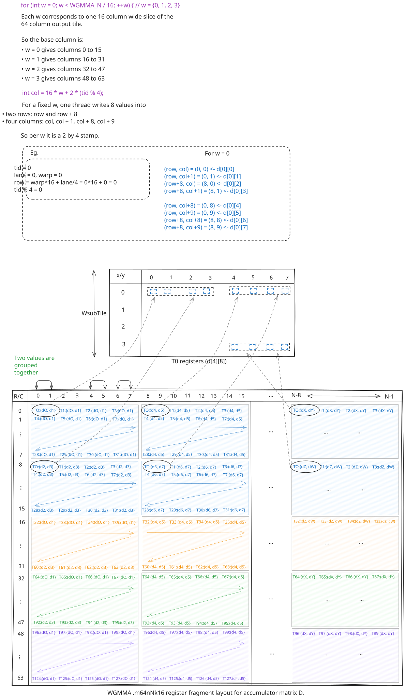

이 시점에서 우리는 코드 관점과 기저 하드웨어 실행 모델 관점 모두에서 커널 전체를 처음부터 끝까지 훑었다. 모든 조각이 제자리에 놓였으니 다음 단계는 커널을 벤치마크하고 성능 결과를 보는 것이다.

**280.4 TFLOP/s** 의 처리량을 달성했다. 지난 커널이 전체 FP32 경로에서 41.4, mixed precision 에서 31.5 에 그쳤던 것에 비하면 엄청난 개선이다. 그야말로 차원이 다른 이야기다.

전체 FP32 cuBLAS 벤치마크 대비 성능은 이제 **약 544%** 지만, 이 cuBLAS 버전은 Tensor Core 를 쓰지 않으므로 이제부터 이 비교는 당연히 "공정"하지 않다. 그저 차이가 얼마나 큰지 보려고 나란히 놓아 본 것이다.

이제부터 진짜 기준은 bf16 과 Tensor Core 를 켠 cuBLAS 다. 그에 대해서는 **37.8%** 를 달성한다. (덧붙이면, 앞선 커널들에서는 FP32 기준 상대 성능을 보고했지만 Tensor Core 를 쓰는 cuBLAS 대비 mixed precision 으로도 테스트해 보았는데, warp tiling 은 **4.3%** 에 그쳤다. 그러니 엄밀히 말해 4.3% 에서 37.8% 로, 거의 **9 배** 개선된 셈이다.)

## Kernel 8: Exploring WGMMA Shapes

지금까지 우리는 `m64n64k16` 이라는 단 하나의 WGMMA shape 만 실험했다. 수학만 맞으면 임의의 tile 크기를 자유롭게 실험할 수 있는 전통적인 CUDA 커널과 달리, Tensor Core MMA 연산은 훨씬 제약이 많다. NVIDIA 는 피연산자 `A`, `B` 와 accumulator `C` 에 대해 제한된 고정 집합의 행렬 shape 만 지원하며, 이는 [PTX ISA 명세](https://docs.nvidia.com/cuda/parallel-thread-execution/#asynchronous-warpgroup-level-matrix-shape) 에 문서화되어 있다(아래 표 참고).

이렇게 지원되는 각 MMA shape 은 특정 하드웨어 명령어에 대응하며, 단일 WGMMA 연산이 만드는 출력 tile 의 크기를 결정한다. 어떤 shape 은 자연히 더 큰 accumulator tile 을 만들고 어떤 것은 더 작은 것을 만든다. 이는 warp group 이 명령어당 수행하는 작업량에 직접 영향을 주고, 따라서 커널을 그 주위로 어떻게 구성해야 하는지에도 영향을 준다.

당연히 warp group 이 명령어당 더 많은 출력 원소를 만들 수 있는 MMA shape 을 고를 수 있다면, 발행되는 WGMMA 당 더 많은 산술 작업이 수행되므로 더 높은 성능을 기대할 수 있다. 물론 이는 register pressure 같은 다른 요인에 제약받지 않는 한에서만 성립하며, register pressure 는 occupancy 감소로 이어질 수 있다.

이 커널의 목표는 서로 다른 WGMMA 구성을 탐색하고 어느 것이 H100 아키텍처에 가장 잘 맞는지 평가하는 것이다. 가능한 모든 선택지를 전수 조사하기보다 bf16 이 지원하는 shape 중 작은 부분집합에 집중해 성능에 미치는 영향을 비교한다.

아래는 하드웨어가 지원하는 bf16 WGMMA shape 이다. 이 목록에서 대표적인 후보 몇 개를 골라 실험하고 더 분석해 본다.

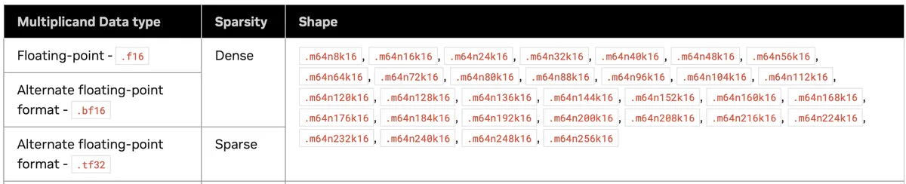

> 바뀌는 것은 `N` 차원뿐이다. 이 bf16 dense shape 들에서 `M` 은 64 로, `K` 는 16 으로 고정된다.

시각적으로 이 커널은 이전 커널과 거의 동일하다. 핵심 차이는 더 큰 `TILE_SIZE_M` 을 덮을 수 있게 해 주는 바깥 루프의 도입이다. 구체적으로 보기 위해 `TILE_SIZE_M` 을 64 에서 128 로 늘리고, 커널이 한 block 안에서 하나가 아니라 두 개의 M-tile 을 어떻게 순회하는지 상상해 보자.

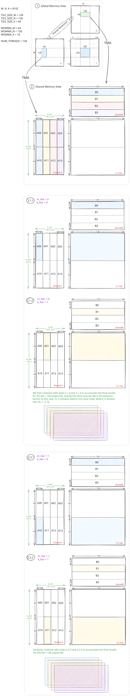

`TILE_SIZE_M` = 128, `TILE_SIZE_N` = 128, `TILE_SIZE_K` = 64 이고 WGMMA shape 표에서 `WGMMA_K` 가 16 으로 고정됨을 알고 있으므로, `K` 차원은 이전 커널과 똑같이 네 개의 세로 패널로 나뉜다.

바뀌는 것은 `TILE_SIZE_M` 차원이다. WGMMA shape 표에 따르면 `WGMMA_M` 은 64 로 고정되므로 단일 WGMMA 연산은 한 번에 64 행의 출력만 만들 수 있다. 이제 block 이 128 행을 덮으므로, 전체 출력 tile 을 덮으려면 `TILE_SIZE_M` 차원을 명시적으로 순회하며 WGMMA 를 두 번 — 첫 64 행에 한 번, 두 번째 64 행에 한 번 — 호출해야 한다.

따라서 이 커널의 구조는 다음과 같다.

1.  지원되는 경우 `WGMMA_N` = `TILE_SIZE_N` 으로 골라 block 폭 전체를 명령어 하나로 덮는다.
2.  `m_it` 을 순회해 `TILE_SIZE_M` 을 덮는다.
3.  `k_it` 을 순회해 `TILE_SIZE_K` 를 덮는다.

그 외에 TMA 로드, SMEM 레이아웃, 저장 측면에서 커널은 논리적으로 동일하다. 주된 차이는 WGMMA 명령어 shape 을 중심으로 연산 단계를 어떻게 구성하느냐에 있다. 예를 들어 아래는 `m64n128k16` shape 을 쓰고 `TILE_SIZE_M` = 128 로 늘렸을 때 새 커널의 연산 단계가 어떤 모습일지 보여준다.

따라서 이 커널의 핵심은 연산 단계이며 다음과 같다.

``` code-block
// 2. Compute phase using WGMMA tensor cores instructions
warpgroup_arrive();
// Outer loop over TILE_SIZE_M in WGMMA_M steps
// If we have two warp groups, we let each work on a different partition of TILE_SIZE_M
// @example:
#pragma unroll
for (int m_iter = 0; m_iter < rows_per_warp_group / WGMMA_M; m_iter++) {
    bf16* sharedA_wgmma_tile_base = sharedA + ((warp_group_idx * rows_per_warp_group) + (m_iter * WGMMA_M)) * TILE_SIZE_K;
    // Inner loop iterating over TILE_SIZE_K in WGMMA_K steps
    #pragma unroll
    for (int k_iter = 0; k_iter < TILE_SIZE_K / WGMMA_K; k_iter++) {
        wgmma<WGMMA_N, 1, 1, 1, 0, 0>(d[m_iter], &sharedA_wgmma_tile_base[k_iter * WGMMA_K], &sharedB[k_iter * WGMMA_K]);
    }
}
warpgroup_commit_batch(); // asm volatile("wgmma.commit_group.sync.aligned;\n" ::: "memory");
warpgroup_wait<0>(); // asm volatile("wgmma.wait_group.sync.aligned %0;\n" ::"n"(N) : "memory");
}
```

| WGMMA_N | TFLOP/s | cuBLAS 대비 성능 % |
|:-------:|:-------:|:--------------------------:|
|   32    |  230.2  |           31.7%            |
|   128   |  407.7  |           56.9%            |
|   256   |  70.3   |            9.7%            |

몇 가지 서로 다른 `WGMMA_N` shape 을 실험해 보니 앞서 암시한 예상대로의 거동이 나타난다. 128 이 명령어 효율과 메모리 재사용 사이의 최적 균형을 주고, 64 가 그 뒤를 바짝 따르며 이전 커널과 일치한다. 32 는 Tensor Core 를 충분히 쓰지 못하고, 256 은 register pressure 를 폭발시켜 성능을 무너뜨린다. 전체적으로 이는 지난 커널 대비 또 한 번 **약 1.5×** 개선을 주고, 이제 cuBLAS 성능의 **56.9%** 에 도달해 대략 절반쯤 온 셈이다.

### 프로파일링

이전 커널 절의 서두에서 우리는 이런 질문을 던졌다.

"필요한 행렬 tile 을 WGMMA 가 기대하는 정확한 형식으로 shared memory 에 올리되, **Tensor Core 가 놀지 않을 만큼 빠르게** 하려면 어떻게 해야 할까?"

첫 번째 부분에는 답했지만, 이 커널의 프로파일링 결과를 보면 두 번째 질문에는 아직 분명히 답하지 못했다.

먼저 SoL 절의 compute throughput breakdown 을 보면 tensor 파이프라인이 심하게 활용되지 못하고 있음을 알 수 있다. 지표 `SM: Pipe Tensor Cycles Active` 는 peak sustained rate 의 **51.17%** 에 그치며, 이는 tensor MMA 유닛이 커널 실행 시간의 거의 절반 동안 놀고 있음을 뜻한다. 동시에 어떤 메모리 시스템도 이론적 peak 근처에 가지 않는데, 이는 커널이 **memory bound 가 아니라 scheduling bound** 임을 강하게 시사한다. 이유를 이해하기 위해 이제 scheduler 와 warp 통계로 눈을 돌리자.

scheduler 통계를 보면 다음과 같다.

- scheduler 당 Active warps = 2.94
- scheduler 당 Eligible warps = 0.19
- scheduler 당 Issued warps = 0.17

이는 각 scheduler 에 여러 warp 가 상주하고 있지만 어느 사이클에서도 실행 준비가 된 warp 가 거의 없음을 알려 준다. 다시 말해 scheduler 는 자주 작업을 발행하고 싶어 하지만 고를 수 있는 eligible warp 가 없다. 이는 정의상 스케줄링과 의존성 문제다.

처음에는 `NUM_THREADS` 를 256 으로 늘려 각 block 이 두 개의 warp group 을 담도록 해 보았다. occupancy 와 active warp 수를 늘려 지연을 숨기는 데 도움이 되리라는 직관이었다. occupancy 와 active warp 둘 다 늘어나기는 했지만 성능은 개선되지 않았고 오히려 약간 나빠졌다. 이유는 occupancy 만으로는 eligible warp 가 생기지 않기 때문이다. 이 경우 scheduler 당 eligible warp 는 **0.19** 에서 **0.23** 으로 미미하게 늘었을 뿐이고, 이는 스케줄링 거동을 유의미하게 바꾸기에는 턱없이 작다.

> 🔎 아래는 128-thread 커널(기준)과 256-thread 커널(현재)의 scheduler 및 warp 통계를 비교한 것으로, active warp 는 늘었지만 warp 들이 여전히 비슷한 stall 문제를 겪어 아무런 개선으로 이어지지 않았음을 보여준다(지표를 또렷이 보려면 확대하기 바란다).\
> \
> 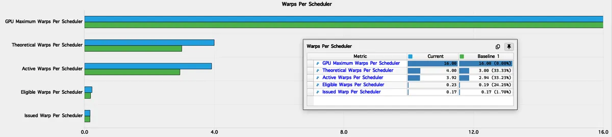\
> \
> 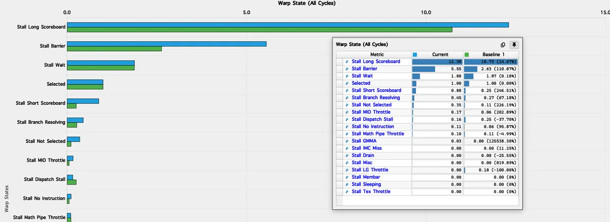

thread 수를 늘리면 occupancy 는 올릴 수 있지만, 그 warp 들이 전부 barrier, wait, 의존성 사슬에 막혀 있다면 scheduler 가 발행할 쓸모 있는 작업은 여전히 거의 없다. 이는 원래의 128 thread 커널에 대한 warp state 통계를 더 자세히 보게 만든다.

가장 지배적인 stall 사유는 `Long Scoreboard` 로 **10.73** 인데, 이는 warp 가 실행 및 메모리 파이프라인을 흐르는 미완료 의존성에 자주 막힌다는 뜻이다. 이 커널에서 이런 의존성의 주된 원천은 누적 루프 자체다. **각 WGMMA 명령어가 동일한 accumulator register 를 읽고 쓰므로 연속된 WGMMA 연산은 본질적으로 서로 의존한다.** 누적 루프 안의 이 직렬 의존성은 GEMM 알고리즘의 근본적인 성질이며 **바뀌지 않는다.**

`Barrier` 와 `Wait` stall 도 상당하다. `K` 차원을 도는 모든 반복이 똑같이 엄격한 직렬 패턴을 따른다. TMA 로드를 발행하고, 그 로드가 끝나기를 기다리고, CTA 를 동기화하고, WGMMA 연산을 실행하고, 마지막으로 다음 반복이 시작되기 전에 모든 미완료 WGMMA 작업을 비워 낸다. scheduler 당 eligible warp 가 이렇게 적으면 이 지연들을 하나도 숨길 수 없어 tensor 파이프라인이 실행 시간의 상당 부분 동안 놀게 된다.

결과적으로 이 커널은 반복 수준에서 큰 **pipeline bubble** 을 보인다. WGMMA 연산 단계 동안 메모리 시스템이 논다. TMA 로드와 동기화 단계 동안 Tensor Core 가 논다. 이 패턴이 128 번의 `K` 반복 전부에서 똑같이 반복되므로 이 유휴 구간들이 쌓여 큰 효율 손실이 되고, 이것이 프로파일링에서 관측된 낮은 tensor pipe 활용률을 직접 설명한다.

아래는 이런 stall 이 생기는 코드상의 위치다.

``` code-block
// TMA launch on one thread
if (threadIdx.x == 0) {
    cde::cp_async_bulk_tensor_2d_global_to_shared(..., barA);
    tokenA = cuda::device::barrier_arrive_tx(barA, 1, sizeof(s.A));
    cde::cp_async_bulk_tensor_2d_global_to_shared(..., barB);
    tokenB = cuda::device::barrier_arrive_tx(barB, 1, sizeof(s.B));
}
else {
    tokenA = barA.arrive();
    tokenB = barB.arrive();
}
// Stall Barrier: arrival skew (other warps reach arrive/wait earlier than thread 0)
// Stall Wait: arrive_tx ties barrier completion to async copy bytes landing

barA.wait(std::move(tokenA));
barB.wait(std::move(tokenB));
// Stall Wait: waiting for TMA transaction completion (bytes written to SMEM)
// Stall Barrier: waiting for all warps to arrive at the barrier phase

__syncthreads();
// Stall Barrier: explicit CTA barrier each K-iteration (often redundant here)

for (int k_iter = 0; k_iter < TILE_SIZE_K / WGMMA_K; k_iter++) {
    wgmma(...)(d[m_iter], ...);
    // Stall Long Scoreboard: dependency chain on d[m_iter] registers
    // each WGMMA reads+writes d, next WGMMA needs updated d
}

warpgroup_wait<0>();
// Stall Wait: explicit drain of all WGMMA work before next iteration
```

시각적으로 각 thread 의 파이프라인은 다음과 같다.

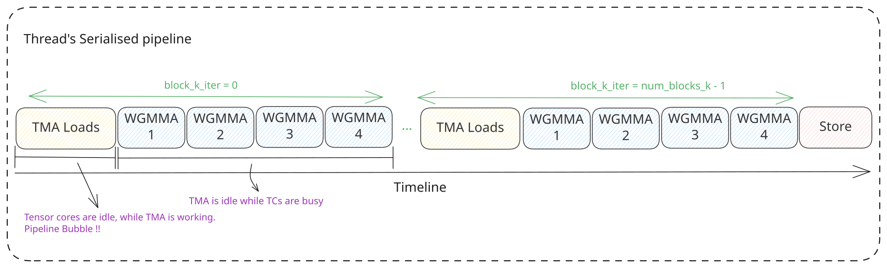

## Kernel 9: Epilogue Shared Memory Staging 을 갖춘 비동기 Producer–Consumer Pipeline

이전 커널에서 확인한 파이프라인 직렬화를 감안하면, 다음 단계는 커널을 **producer-consumer 패턴**으로 재구성하는 것이다. 이 설계에서는 한 warp group 이 producer 역할을 맡아 TMA 로드를 발행하는 일을 주로 담당하고, 나머지 warp group 이 consumer 로서 WGMMA 로 Tensor Core 연산을 실행한다.

결정적으로 이 역할들은 병렬로 동작한다. consumer warp group 이 현재 `K` tile 에 대해 WGMMA 를 실행하는 동안, producer warp group 은 이미 다음 tile 을 위한 async TMA 로드를 발행할 수 있다. 이는 TMA 전송이 Tensor Core 파이프라인과 독립적으로 돌아간다는 사실을 활용한 것이다.

이 커널의 목표는 WGMMA 안의 직렬 누적 의존성을 없애는 것이 아니다. 그것은 GEMM 의 근본이라 제거할 수 없다. 목표는 TMA 로드와 Tensor Core 연산을 겹쳐 `K` 반복에 걸친 로드와 동기화 지연을 숨기는 것이다. 그렇게 해서 **(1)** pipeline bubble 을 줄이고, **(2)** Tensor Core pipe 활용률을 높이고, **(3)** eligible warp 수를 늘려 scheduler 거동을 개선하며, **(4)** long scoreboard stall 을 줄이는 것을 노린다.

구현에 들어가기 전에 아래 그림이 우리가 목표로 하는 실행 모델을 시각적으로 보여준다.

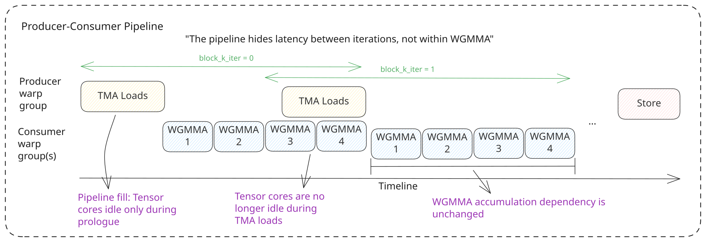

커널의 핵심은 다음과 같다.

``` code-block
#pragma nv_diag_suppress static_var_with_dynamic_init
__shared__ barrier full[NUM_STAGES];  // Signals data is ready
__shared__ barrier empty[NUM_STAGES]; // Signals slot is available

if (threadIdx.x == 0) {
    for (int i = 0; i < NUM_STAGES; i++) {
        init(&full[i], num_consumer_groups * 128 + 1); // consumers + producer thread 0
        init(&empty[i], num_consumer_groups * 128 + 1);
    }
    cde::fence_proxy_async_shared_cta();
}
__syncthreads();

if (is_producer) {
    // Producer warp group: Issues TMA loads
    if (threadIdx.x == 0) {
        // Fill the pipeline
        for (int stage = 0; stage < NUM_STAGES && stage < num_blocks_k; stage++) {
            int block_k_iter = stage;
            
            // Wait for empty slot (initially all are empty, so this passes immediately)
            empty[stage].wait(empty[stage].arrive());

            // Get pointers for this stage in the flat arrays
            bf16* A_stage = s.A + (stage * A_stage_size);
            bf16* B_stage = s.B + (stage * B_stage_size);

            // TMA loads for A and B
            cde::cp_async_bulk_tensor_2d_global_to_shared(A_stage, tensorMapA, block_k_iter * TILE_SIZE_K, num_block_m * TILE_SIZE_M, full[stage]);
            cde::cp_async_bulk_tensor_2d_global_to_shared(B_stage, tensorMapB, block_k_iter * TILE_SIZE_K, num_block_n * TILE_SIZE_N, full[stage]);

            // Signal data is ready
            barrier::arrival_token token = cuda::device::barrier_arrive_tx(full[stage], 1, A_stage_size * sizeof(bf16) + B_stage_size * sizeof(bf16));
        }

        // Main loop: Continue issuing loads
        for (int block_k_iter = NUM_STAGES; block_k_iter < num_blocks_k; block_k_iter++) {
            int stage = block_k_iter % NUM_STAGES;
            
            // Wait for this stage to be empty before overwriting
            empty[stage].wait(empty[stage].arrive());

            // Get pointers for this stage in the flat arrays
            bf16* A_stage = s.A + (stage * A_stage_size);
            bf16* B_stage = s.B + (stage * B_stage_size);

            // Issue next TMA loads
            cde::cp_async_bulk_tensor_2d_global_to_shared(A_stage, tensorMapA, block_k_iter * TILE_SIZE_K, num_block_m * TILE_SIZE_M, full[stage]);
            cde::cp_async_bulk_tensor_2d_global_to_shared(B_stage, tensorMapB, block_k_iter * TILE_SIZE_K, num_block_n * TILE_SIZE_N, full[stage]);

            // Signal data is ready
            barrier::arrival_token token = cuda::device::barrier_arrive_tx(full[stage], 1, A_stage_size * sizeof(bf16) + B_stage_size * sizeof(bf16));
        }
    }
    
} else {
    // Consumer warp groups: Execute WGMMA compute
    // Accumulator registers - declared inside consumer branch only so
    // ptxas doesn't allocate them for the producer warp group
    float d[TILE_SIZE_M / WGMMA_M / num_consumer_groups][WGMMA_N / 16][8];
    memset(d, 0, sizeof(d));

    // Initially signal all empty slots are available
    for (int i = 0; i < NUM_STAGES; i++) {
        barrier::arrival_token token = empty[i].arrive();
    }

    // Main compute loop
    for (int block_k_iter = 0; block_k_iter < num_blocks_k; block_k_iter++) {
        int stage = block_k_iter % NUM_STAGES;
        
        // Get pointers for this stage in the flat arrays
        bf16* A_stage = s.A + (stage * A_stage_size);
        bf16* B_stage = s.B + (stage * B_stage_size);
        
        // Wait for data to be ready
        full[stage].arrive_and_wait();

        // Compute phase using WGMMA
        warpgroup_arrive();
        
        #pragma unroll
        for (int m_iter = 0; m_iter < rows_per_consumer_warp_group / WGMMA_M; m_iter++) {
            bf16* sharedA_wgmma_tile_base = A_stage + ((consumer_warp_group_idx * rows_per_consumer_warp_group) + (m_iter * WGMMA_M)) * TILE_SIZE_K;
            
            #pragma unroll
            for (int k_iter = 0; k_iter < TILE_SIZE_K / WGMMA_K; k_iter++) {
                wgmma<WGMMA_N, 1, 1, 1, 0, 0>(d[m_iter], &sharedA_wgmma_tile_base[k_iter * WGMMA_K], &B_stage[k_iter * WGMMA_K]);
            }
        }
        
        warpgroup_commit_batch();
        warpgroup_wait<0>();

        // Signal this slot is now empty and can be reused
        barrier::arrival_token empty_token = empty[stage].arrive();
    }
}
```

파이프라인을 제대로 조율하기 위해 파이프라인 stage 마다 두 종류의 shared memory barrier 배열을 할당한다. `empty[stage]` 는 "이 stage 버퍼에 써도 된다"는 뜻이고, `full[stage]` 는 "이 stage 버퍼에 이제 유효한 A, B tile 이 들어 있다"는 뜻이다. thread 0 이 모든 barrier 를 예상 참가자 수로 초기화하고, 이후 모든 thread 가 한 번 동기화해 barrier 가 준비되게 한다. 그다음 producer(역시 thread 0 이 주도한다)가 먼저 파이프라인을 "예열"한다. 처음 몇 개의 `K` tile 을 돌며 각 stage 가 비기를 기다리고, 그 stage 의 `s.A` 와 `s.B` 슬라이스로 두 번의 TMA 로드를 발행한 뒤, transaction arrive 로 `full[stage]` 에 신호를 보내 바이트가 도착했을 때 consumer 가 깨어날 수 있게 한다. 파이프라인이 채워지면 producer 는 정상 상태로 계속한다. 새로운 `K` tile 마다 `stage = block_k_iter % NUM_STAGES` 를 재사용하고, consumer 가 그 stage 를 비었다고 표시할 때까지 기다린 뒤 다음 TMA 로드로 덮어쓰고 다시 full 신호를 보낸다. 한편 각 consumer warpgroup 은 자신의 accumulator fragment `d` 를 register 에 할당하고, 모든 stage 를 처음에 비었다고 표시해(producer 가 즉시 시작할 수 있게) 둔 뒤, `K` 루프를 돈다. 그 안에서 동일한 순환 stage 를 고르고, producer 가 그 stage 의 적재를 끝낼 때까지 `full[stage]` 를 기다리고, 자신이 맡은 A subtile 들과 그 stage 의 B tile 에 대해 WGMMA 마이크로 루프를 돌리고, WGMMA 배치가 끝나기를 commit 하고 기다린 다음, `empty[stage]` 를 표시해 그 stage 버퍼를 producer 가 다음 사이클에 재사용하도록 돌려준다.

다음 그림을 보면 producer 와 consumer 가 어떻게 협력하는지 더 분명해질 것이다.

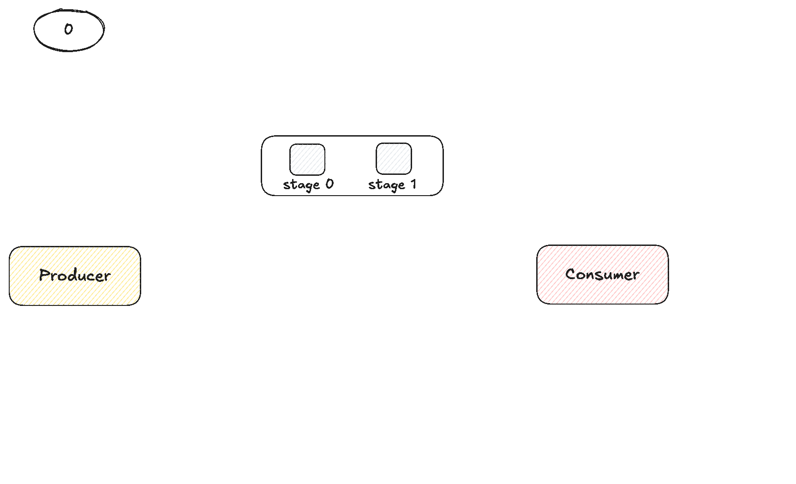

### 디버깅

커널을 구현한 뒤 [Pranjal 의](https://github.com/pranjalssh/fast.cu/blob/main/examples/matmul/matmul_4.cuh) 구현이 보고한 것과 같은 성능 개선을 기대했다. 이전 커널이 이미 그의 성능과 거의 정확히 일치했으므로 비교는 공정했다. 그의 커널이 파이프라인 추가로 큰 향상을 보였다면 필자의 것도 비슷한 이득을 보여야 했다. 그런데 그렇지 않았다. 이는 곧 필자의 구현이 제대로 겹침을 막는 방식으로 구조적으로 달랐거나, 아니면 더 근본적인 무언가가 파이프라인의 효과를 제한하고 있음을 시사했다. 필자는 producer 쪽을 약간 재구성해 prefill 단계와 정상 상태를 별도 루프로 나누고 stage 주소 지정을 다시 짰다. 이 변경들은 의미상으로는 정확했지만 그의 구현 구조와는 달랐기 때문에 문제가 어디서 비롯되었는지 불분명했다.

프로파일링이 일련의 표적 실험을 통해 무엇이 잘못되었는지 밝히는 열쇠가 되었다. 모든 프로파일링 리포트는 저장소의 `h100_gemm/profiling_reports/producer-consumer-pipeline` 에서 볼 수 있다.

#### 변수 분리하기

핵심 착안은 구현 차이와 무관하게 출력 스케일링의 효과만 분리하는 것이었다. Pranjal 의 구현을 두 가지 구성으로 직접 프로파일링했다.

1.  Baseline: alpha 나 beta 스케일링이 없는 원래 커널
2.  Scaled: 우리의 모든 커널에서 쓰는 스케일링을 넣은 동일한 커널. 이 작업의 목표는 alpha 와 beta 를 어떻게 설정하든 GEMM 을 완전한 형태로 지원하는 것이기 때문이다.

이 실험 설계가 결정적이었다. 스케일링을 넣은 참조 커널이 필자가 관측한 것과 같은 성능 저하를 보인다면, 문제가 필자의 파이프라인 구조가 아니라 epilogue 스케일링 자체에 있음을 확인해 주는 셈이기 때문이다.

#### 프로파일링 결과

**Baseline(스케일링 없음)**: 기준 커널은 잘 튜닝된 파이프라인에서 기대되는 특성을 보였다.

- 높은 compute throughput 과 강한 tensor pipe 활동
- Register pressure: thread 당 189 register (이를 보고하는 이유는 scaled 구성에서는 thread 당 register 가 더 적은데도 성능 저하가 나타나므로 occupancy 문제가 아니기 때문이다)

Nsight Compute 는 global store 에 대해 "섹터당 전송되는 32 바이트 중 평균 16 바이트만 활용된다"는 비효율 하나를 지적하기는 했지만, 이 경고가 성능 병목으로 이어지지는 않았다.

**Scaled(alpha 와 beta 스케일링이 있는 epilogue)**: epilogue 에 스케일링을 추가하자 성능 프로파일이 근본적으로 달라졌다. 처리량 저하는(기준 성능 대비) 다음과 같다.

- 전체 처리량: -35%
- L1TX throughput: -33%
- L2 throughput: -20%
- 커널 실행 시간: +53%
- SM busy: -35%
- Tensor pipe active cycles: 비슷한 수준의 감소
- Register pressure: 어쩐 일인지 thread 당 156 register 로 감소

메모리 거동:

- 새 경고: "L2 global load 접근 패턴이 최적이 아닐 수 있다. 섹터당 32 바이트 중 평균 16 바이트만 활용된다"(C 를 읽고 스케일링한 뒤 다시 저장하므로 예상된 결과다)
- L2 로 들어오는 DRAM 트래픽: 5.41 GB -\> 7.72 GB (+42%)

**메모리 트래픽의 42% 증가가 특히 시사적이었다**. 스케일링된 epilogue 는 추가 메모리 연산을 도입했을 뿐 아니라 그것을 비효율적으로 수행하고 있었다.

결정적인 발견은, 스케일링된 참조 커널이 이제 필자의 구현과 거의 동일한 성능 특성을 보인다는 점이었다. 처리량 감소, 메모리 트래픽 증가, 연산 활동 감소(`Pipe Tensor Cycles Active [%]` 지표로 드러난다)가 두 커널 모두에 나타났다. 이로써 성능 문제가 필자의 커널 구조나 심지어 thread 당 register 때문이라는 최초 가설이 배제되었다. local memory 로의 spill 조차 겪지 않고 있었기 때문이다. 스케일링을 켜는 순간 참조 구현 자체에서도 이 저하가 재현되었다. 파이프라인 구조는 멀쩡했고 병목이 epilogue 로 옮겨 간 것이다.

이 관찰을 구체적인 측정으로 더 뒷받침하기 위해, 이 작업 전반에서 일관되게 써 온 문제 크기에서 필자의 정확한 파이프라인 커널을 두 구성으로 벤치마크했다. (덧붙이면 코드는 512, 1024, 2048, 4096, 8192 크기에서 벤치마크하며, 전에 이에 대한 지적을 받은 적이 있는데 지금까지는 8192 기준으로 보고해 왔다.)

`M=N=K= 8192` 에서 alpha, beta **스케일링이 없고** shared memory epilogue staging 도 없는 파이프라인 커널은 **436.7 TFLOPs** 를 달성하며, 이는 **cuBLAS 의 58.4%** 에 해당한다. 반면 완전한 alpha, beta 스케일링과 shared memory staged epilogue 를 갖춘 버전은 **356 TFLOPs**, 즉 **cuBLAS 의 49.5%** 에 그친다.

`M=N=K= 4096` 에서는 스케일링 없는 변종이 **cuBLAS 의 73.8%** 에 도달해 그 크기에서 Pranjal 이 보고한 파이프라인 성능을 약간 앞선다. 다만 cuBLAS 가 더 큰 문제 크기에서 더 효율적으로 확장하기 때문에 이 이점은 8192 에서 줄어들어 상대 성능이 58.4% 로 떨어진다.

따라서 효과는 명확하다. 스케일링을 도입하면 8192 에서 대략 **80 TFLOPs** 를 잃는다. 이 저하는 주로 producer–consumer 파이프라인 자체 때문이 아니다. 오히려 mainloop 이 충분히 효율적으로 되고 나자 read–modify–write epilogue 가 지배적인 제한 요인으로 떠오른 것이다.

성능 차이는 두 epilogue 변종이 메모리와 상호작용하는 방식에서 비롯된다. 스케일링이 없으면 `C = accumulator` 인 write-only 경로다. 각 thread 가 global store 를 한 번 수행한다. 접근 패턴이 완벽히 병합되지는 않지만(그래서 섹터 활용률 경고가 뜬다) 커널은 여전히 compute-bound 로 남는다. Tensor Core 가 충분히 포화되어 있어 이 메모리 비효율이 실행 시간을 지배하지 않는다.

스케일링이 있으면 `C = α × accumulator + β × C` 인 read-modify-write 경로가 된다. 이제 epilogue 는 다음을 요구한다.

1.  메모리에서 C 를 global load
2.  fp32 로 타입 변환
3.  스케일링: `β × C`
4.  누적: `α × accumulator + (β × C)`
5.  bf16 으로 타입 역변환
6.  Global store

결정적인 변화는 global load 스트림의 도입이다. thread 별 접근 패턴이 완전히 병합되지 않는다면(프로파일러가 그렇지 않음을 확인해 준다) 이제 비효율 비용을 두 번, 즉 로드 경로에서 한 번, 스토어 경로에서 한 번 치르게 된다.

그러면 이런 질문이 생긴다. **이전 커널에도 스케일링이 있었는데 왜 이 문제가 보이지 않았을까?** 추론하기 어려웠지만, 필자의 추측은 파이프라인이 TMA 로드와 WGMMA 연산을 성공적으로 겹쳤다는 것이다. 그렇게 해서 커널을 peak compute throughput 에 더 가깝게 밀어붙였고, 그 결과 epilogue 의 메모리 접근 패턴이 새로운 제한 요인으로 드러난 것이다. epilogue 의 메모리 접근 패턴은 두 경우 모두 비효율적이었지만, 직렬 커널에서는 그 비효율이 다른 stall 뒤에 숨어 있었다.

또 하나 궁금했던 점은 이것이다. **epilogue 가 문제이고 그것이 연산 이후에 돌아간다면, Tensor Core 활용률은 여전히 높게 나와야 하지 않을까?**

핵심은 프로파일러 지표가 커널 전체 실행 시간에 대해 평균된다는 점이다. 겹침 덕분에 mainloop 이 빨라지면 epilogue 가 전체 실행 시간에서 차지하는 비중이 커진다. 그동안 Tensor Core 는 놀고 있으므로 전체 tensor pipe 활동이 떨어진다. 직렬 커널에서는 연산 단계가 더 길고 이미 stall 되어 있었기 때문에 비효율적인 epilogue 가 단지 덜 보였을 뿐이다.

epilogue 가 병목임을 확인했으니 다음 질문은 이것이었다. **왜 메모리 접근 패턴이 비효율적인가?**

커널 7 에서 보았듯 thread 는 WGMMA 를 효율적으로 실행하도록 조직된 register fragment 에 결과를 누적한다. 그러나 하드웨어 소개 절과 앞선 커널들에서 이야기했듯 global memory 는 최적 처리량을 위해 병합된 128 바이트 섹터 접근을 요구한다. 이 두 레이아웃은 자연스럽게 호환되지 않는다.

그런데 현재 epilogue 는 register 에서 global memory 로 직접 쓴다. 이는 레이아웃 조정 단계를 건너뛰는 것이고 그 결과 섹터 활용률이 나빠진다.

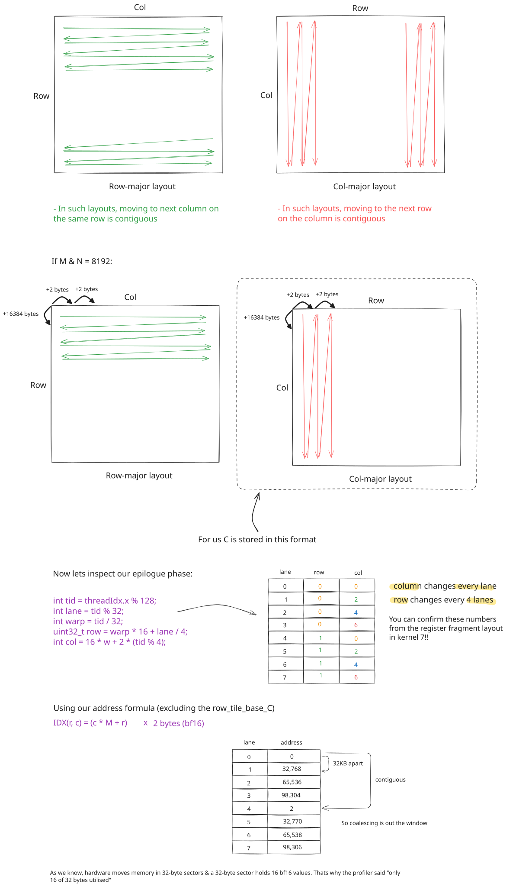

#### Shared Memory Staged Epilogue

CUTLASS 의 프로덕션 GEMM 커널은 register 에서 global memory 로 직접 쓰지 않는다. 대신 epilogue 가 staged 접근을 따른다.

epilogue 는 보통 다음 구조를 따른다.

1.  논리적 출력 tile 을 재구성하는 매핑을 써서 register fragment 를 shared memory 에 쓴다. 필요하면 shared memory bank conflict 를 줄이기 위해 padding 을 적용한다.
2.  thread 를 재매핑해, column major 인 경우 각 lane 이 같은 열의 연속된 여러 행을 담당하게 함으로써 완전히 병합된 global 로드와 스토어를 수행한다.

CUTLASS 는 epilogue 에 SMEM swizzle 을 적용하는 것으로 보이지만, 필자는 padding 을 쓰고 나서 bank conflict 가 여전히 있는지 확인해 보겠다.

따라서 epilogue 는 다음과 같은 모습이 된다.

``` code-block
int tid  = threadIdx.x % 128;
int lane = tid % 32;
int warp = tid / 32;
uint32_t row = warp * 16 + lane / 4;

// @note C is column-major
bf16* block_C = C + (num_block_n * TILE_SIZE_N * M) + (num_block_m * TILE_SIZE_M);

constexpr int TILE_M_PAD = TILE_SIZE_M + 8;
#define IDX_GMEM(r, c) ((c) * M + (r))
#define IDX_SMEM(r, c) ((c) * TILE_M_PAD + (r))

// Phase 1: alpha-scaled accumulators -> shared staging tile
for (int m_iter = 0; m_iter < rows_per_consumer_warp_group / WGMMA_M; m_iter++) {
    int row_tile_base_C = (consumer_warp_group_idx * rows_per_consumer_warp_group) + (m_iter * WGMMA_M);
    for (int w = 0; w < WGMMA_N / 16; w++) {
        int col = 16 * w + 2 * (tid % 4);
        s.C_epi[IDX_SMEM(row + row_tile_base_C, col)] = __float2bfloat16(alpha * d[m_iter][w][0]);
        s.C_epi[IDX_SMEM(row + row_tile_base_C, col + 1)] = __float2bfloat16(alpha * d[m_iter][w][1]);
        s.C_epi[IDX_SMEM(row + 8 + row_tile_base_C, col)] = __float2bfloat16(alpha * d[m_iter][w][2]);
        s.C_epi[IDX_SMEM(row + 8 + row_tile_base_C, col + 1)] = __float2bfloat16(alpha * d[m_iter][w][3]);
        s.C_epi[IDX_SMEM(row + row_tile_base_C, col + 8)] = __float2bfloat16(alpha * d[m_iter][w][4]);
        s.C_epi[IDX_SMEM(row + row_tile_base_C, col + 9)] = __float2bfloat16(alpha * d[m_iter][w][5]);
        s.C_epi[IDX_SMEM(row + 8 + row_tile_base_C, col + 8)] = __float2bfloat16(alpha * d[m_iter][w][6]);
        s.C_epi[IDX_SMEM(row + 8 + row_tile_base_C, col + 9)] = __float2bfloat16(alpha * d[m_iter][w][7]);
    }
}
__syncthreads();

// Phase 2: coalesced write to GMEM (alpha*D + beta*C)
int row4_in_group = lane * 4;
int group_base_row = consumer_warp_group_idx * rows_per_consumer_warp_group;
if (row4_in_group < rows_per_consumer_warp_group) {
    int r0 = group_base_row + row4_in_group;
    for (int c = warp; c < TILE_SIZE_N; c += 4) {
        block_C[IDX_GMEM(r0 + 0, c)] = __float2bfloat16(__bfloat162float(s.C_epi[IDX_SMEM(r0 + 0, c)]) + beta * __bfloat162float(block_C[IDX_GMEM(r0 + 0, c)]));
        block_C[IDX_GMEM(r0 + 1, c)] = __float2bfloat16(__bfloat162float(s.C_epi[IDX_SMEM(r0 + 1, c)]) + beta * __bfloat162float(block_C[IDX_GMEM(r0 + 1, c)]));
        block_C[IDX_GMEM(r0 + 2, c)] = __float2bfloat16(__bfloat162float(s.C_epi[IDX_SMEM(r0 + 2, c)]) + beta * __bfloat162float(block_C[IDX_GMEM(r0 + 2, c)]));
        block_C[IDX_GMEM(r0 + 3, c)] = __float2bfloat16(__bfloat162float(s.C_epi[IDX_SMEM(r0 + 3, c)]) + beta * __bfloat162float(block_C[IDX_GMEM(r0 + 3, c)]));
    }
}
#undef IDX_GMEM
#undef IDX_SMEM
```

이 커널을 프로파일링하면 분명한 개선이 보인다. **Tensor Core 활동이 거의 32% 증가**하고, L1/TEX, L2, DRAM throughput 이 모두 오르며, 커널 실행 시간이 줄고 전체 처리량이 개선된다. global memory 로드와 스토어의 비병합 접근 경고도 사라진다. 비교 대상은 초기 pipelining 버전이다.

그러나 **producer–consumer 파이프라인이 제대로 동작**하고 staged epilogue 가 메모리 접근 비효율을 해결했음에도, 커널은 여전히 커널 8 을 넘어서지 못한다. **Tensor Core 활용률이 기대보다 여전히 약간 낮다.**

파이프라인이 의도대로 동작하는지 확인하기 위해 **Nsight Systems** 로 커널을 프로파일링했다. 트레이스는 **TMA 전송과 WGMMA 실행이 직렬이 아니라 시간상 겹친다**는 것을 확인해 준다. 즉 producer–consumer 메커니즘이 로드 지연을 제대로 숨기고 있다는 뜻이다. 그렇다고는 해도, 수많은 실험과 Nsight Compute 지표에 대한 꼼꼼한 검토에도 불구하고 이 커널이 왜 이전 커널을 넘어서지 못하는지에 대해 아직 완전히 만족스러운 설명을 갖지 못했다. 더 조사할 여지가 남아 있다. 이 거동에 대한 통찰이 있다면 연락 바란다.

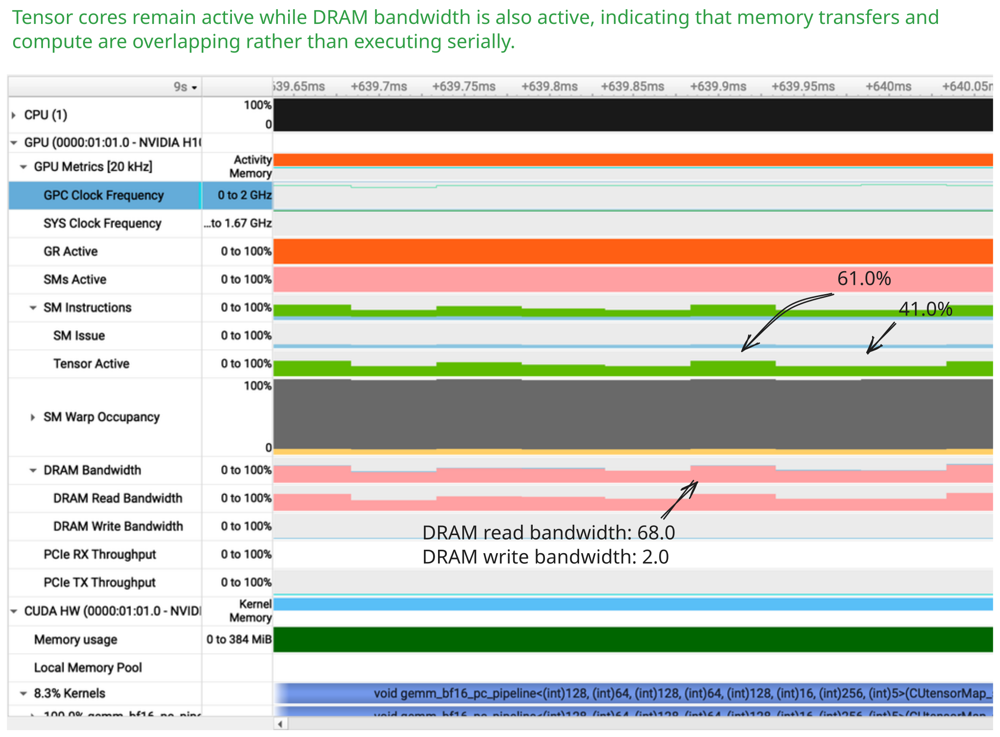

따라서 남은 성능 격차는 파이프라인이 망가져서 생긴 것이 아니라, barrier 단계, warpgroup fencing, stage 인계, epilogue 같은 고정 오버헤드 대비 파이프라인 stage 당 얼마나 많은 유효 연산을 뽑아내느냐에서 비롯되는 것으로 보인다.

자연스러운 다음 단계는 더 큰 `WGMMA_N` 을 사용하고 consumer warpgroup 을 하나 더 도입해 출력 tile 폭을 키우는 것이다. 이렇게 하면 `K` tile 당 수행되는 연산량이 늘어나 파이프라인 오버헤드가 더 많은 산술 작업에 분산되는데, 이는 겹침을 이미 달성한 뒤에 우리가 원하는 바로 그 트레이드오프다.

이 변경을 구현해 구체적으로 `WGMMA_N` 을 256 으로 늘리고 consumer warpgroup 두 개로 실행하면 성능이 더 올라간다. `M=N=K= 8192` 에서 커널은 이제 **463.9 TFLOPs** 에 도달하며 이는 **cuBLAS 의 63.1%** 에 해당한다. `4096` 에서는 **상대 성능 70.5%** 를 달성한다.

이는 직관을 확인해 준다. 메모리와 연산이 제대로 겹치고 나면, 파이프라인 stage 당 더 많은 작업을 뽑아내는 것이 효과적인 지렛대가 된다. 각 stage 의 arithmetic intensity 를 높이고 register 자원을 producer 와 consumer warpgroup 에 더 의도적으로 배분함으로써 Tensor Core 파이프라인 포화에 한 걸음 더 다가간다.

그럼에도 아직 상당한 성능이 테이블 위에 남아 있다. 특히 epilogue 가 유발한 저하를 완화하는 부분이 그렇다.
