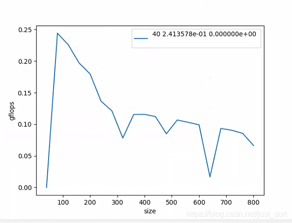
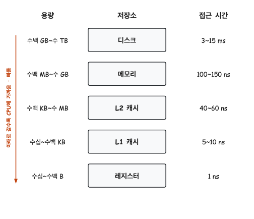
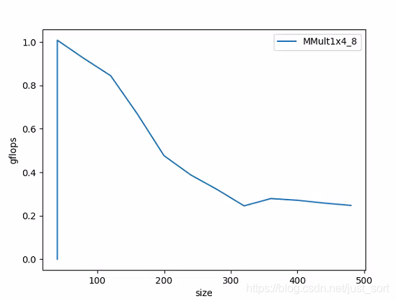
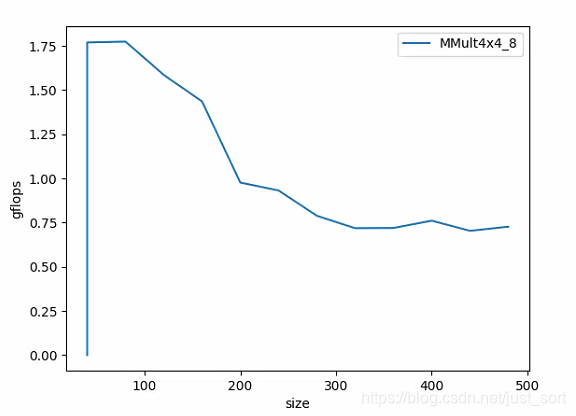
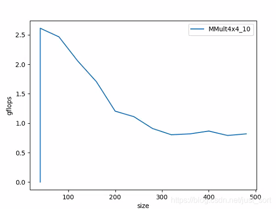
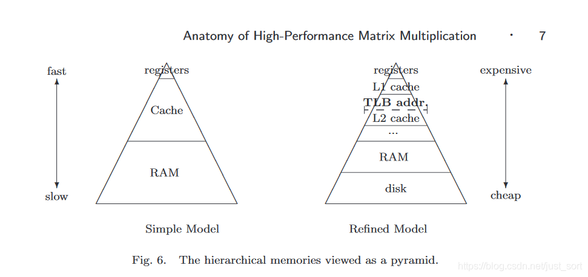
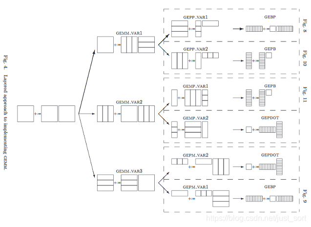
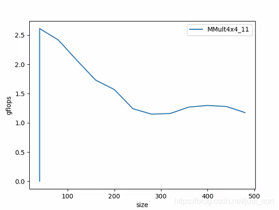
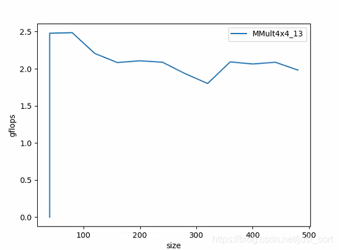

# how-to-optimize-gemm 기반 행렬 곱 최적화 탐구

# 1\. 머리말

이번에는 비교적 가벼운 주제를 다뤄보려 합니다. 행렬 A와 행렬 B가 주어졌을 때, matrix multiplication을 통해 목표 행렬 C를 얻는 문제입니다. 다음과 같은 코드는 누구나 어렵지 않게 작성할 수 있을 것입니다.
    
    
    #define A( i, j ) a[ (i)*lda + (j) ]  
    #define B( i, j ) b[ (i)*ldb + (j) ]  
    #define C( i, j ) c[ (i)*ldc + (j) ]  
    // gemm C = A * B + C  
    void MatrixMultiply(int m, int n, int k, float *a, int lda, float *b, int ldb, float *c, int ldc)  
    {  
        for(int i = 0; i < m; i++){  
            for (int j=0; j<n; j++ ){      
                for (int p=0; p<k; p++ ){        
                    C(i, j) = C(i, j) + A(i, p) * B(p, j);  
                }  
            }  
        }  
    }  
    

이전 글 [알고리즘에 최적화 여지가 있는지 어떻게 판단할까?](<https://mp.weixin.qq.com/s?__biz=MzA4MjY4NTk0NQ==&mid=2247490615&idx=1&sn=4fca4b963adcba01553371c6d566a597&scene=21#wechat_redirect>)에서 위 코드를 단일 코어 A53(이전 글에서 A17로 잘못 표기했습니다. 정말 죄송합니다)에서 GFLOPs로 측정한 결과를 다뤘는데, 이 구현의 GFLOPs는 하드웨어의 2%~3% 수준에 불과해 매우 비효율적입니다. 따라서 이 글에서는 `https://github.com/flame/how-to-optimize-gemm` 프로젝트를 기반으로 matrix multiplication을 어떤 방법으로 최적화할 수 있는지 소개합니다.

주의할 점은, 이 프로젝트는 x86의 열 기준(column-major) 프로그램을 대상으로 합니다. 저는 모바일 환경인 A53에서 테스트하므로, 코드를 ARM 명령어 집합에 맞게 수정하고, 보다 일반적인 행 기준(row-major) 형태로 바꾸어 테스트했습니다.

원본 버전의 GFLOPs 측정 결과는 다음 그림과 같습니다.

원본 버전의 GFLOPs 측정 결과

# 2\. 최적화 이전의 작업

최적화를 논하기에 앞서, 머리말의 코드를 `https://github.com/flame/how-to-optimize-gemm`과 유사한 스타일로 다시 작성해 두는 것이 좋습니다. 이렇게 하면 이후 다양한 최적화 기법 코드를 이해하기가 쉬워집니다. 스타일을 바꿔 작성한 코드는 다음과 같습니다.
    
    
    #include <stdio.h>  
      
    #define A( i, j ) a[ (i)*lda + (j) ]  
    #define B( i, j ) b[ (i)*ldb + (j) ]  
    #define C( i, j ) c[ (i)*ldc + (j) ]  
      
    /* Routine for computing C = A * B + C */  
      
    /* Create macro to let X( i ) equal the ith element of x */  
      
    #define Y(i) y[ (i)*incx ]  
      
    void AddDot( int k, float *x, int incx,  float *y, float *gamma )  
    {  
      /* compute gamma := x' * y + gamma with vectors x and y of length n.  
         Here x starts at location x with increment (stride) incx and y starts at location y and has (implicit) stride of 1.  
      */  
       
      int p;  
      
      for ( p=0; p<k; p++ ){  
        *gamma += x[p] * Y(p);       
      }  
    }  
    void MY_MMult1( int m, int n, int k, float *a, int lda,   
                                        float *b, int ldb,  
                                        float *c, int ldc )  
    {  
      int i, j;  
      for ( j=0; j<n; j+=1 ){        /* Loop over the columns of C */  
        for ( i=0; i<m; i+=1 ){        /* Loop over the rows of C */  
          /* Update the C( i,j ) with the inner product of the ith row of A  
      and the jth column of B */  
        // for (int p=0; p<k; p++ ){        
        //             C(i, j) = C(i, j) + A(i, p) * B(p, j);  
        //         }  
          AddDot( k, &A( i,0 ), lda, &B( 0,j ), &C( i,j ) );  
        }  
      }  
    }  
    

지면과 분량을 고려해 이후 최적화 부분에서는 가장 핵심적인 코드만 싣습니다. 전체 코드는 `https://github.com/BBuf/ArmNeonOptimization`에서 확인할 수 있으며, 이 프로젝트에 Star도 환영합니다.

# 3\. 메모리 정렬

여기서는 cache의 개념과 관련이 있습니다. 왜 메모리 정렬이 cache 적중에 유리한지 짧게 설명해 보겠습니다. 메모리 정렬의 원칙은 다음과 같습니다. 임의의 K바이트 기본 객체의 주소는 반드시 K의 배수여야 합니다.

cache는 고속 캐시 메모리로 번역되며, **지역성 원리(locality)** 를 잘 활용해 CPU가 메인 메모리에 접근하는 횟수를 줄여줍니다. 컴퓨터의 저장 체계도 간단히 다시 정리해 보면, 현대 컴퓨터에서 메모리는 계층(level)으로 나뉘어 있으며 CPU에 가까울수록 속도가 빠르고 제조 비용이 높으며 용량은 작습니다. CPU에 가장 가까운 것은 register이고, 제조 비용이 가장 높기 때문에 개수도 매우 제한적입니다. 두 번째로 가까운 것이 cache이며, cache도 L1, L2, L3 등 여러 단계로 나뉩니다. 그다음이 메인 메모리, 즉 일반 RAM이고, 마지막은 로컬 디스크입니다. 이들의 용량과 접근 시간은 다음 그림과 같습니다.

컴퓨터 저장 계층 구조

위에서 cache가 지역성 원리를 활용한다고 했는데, 지역성 원리란 현재 찾고자 하는 데이터를 CPU에 가까운 저장 구조에서 우선적으로 찾음으로써 데이터 접근 속도를 높이고 프로그램 내 각 변수의 접근 시간을 줄이는 원리를 말합니다.

cache에 관한 더 자세한 개념은 글 말미의 참고 자료 1을 참조하시기 바랍니다. 매우 잘 정리되어 있습니다.

**"cache line이 32B이고, 접근할 데이터의 크기가 64B, 주소가 0x80000001이라고 하면 3개의 cache 매핑 항목을 차지해야 합니다. 반면 주소가 0x80000000이라면 2개만 필요합니다. 메모리 정렬은 간접적으로 cache 적중률을 높입니다."** kernel이 한 번 계산할 때 일정 크기의 block을 처리한다고 가정해 봅시다. MMult_4x4_7.c (`https://github.com/flame/how-to-optimize-gemm/blob/master/src/MMult_4x4_7.c`)와 MMult_4x4_8.c (`https://github.com/flame/how-to-optimize-gemm/blob/master/src/MMult_4x4_8.c`) 코드를 보면, MMult_4x4_8.c는 offset을 사용해 메모리 정렬을 수행한 것을 볼 수 있습니다.

이런 방식으로 프로젝트의 `MMult_1x4_3.c`를 참고하면, FLOPs가 꽤 괜찮은 blocking 기반의 matrix multiplication을 작성할 수 있습니다. 코드는 다음과 같으며, 분량을 줄이기 위해 주석은 생략했습니다. 궁금한 점이 있다면 댓글로 토론을 환영합니다.
    
    
    void AddDot1x4( int k, float *a, int lda,  float *b, int ldb, float *c, int ldc )  
    {  
      int p;  
      register float  c_00_reg,   c_01_reg,   c_02_reg,   c_03_reg, b_0p_reg;  
      float  *ap0_pntr, *ap1_pntr, *ap2_pntr, *ap3_pntr;   
          
      ap0_pntr = &A( 0, 0 );  
      ap1_pntr = &A( 1, 0 );  
      ap2_pntr = &A( 2, 0 );  
      ap3_pntr = &A( 3, 0 );  
      
      c_00_reg = 0.0;   
      c_01_reg = 0.0;   
      c_02_reg = 0.0;   
      c_03_reg = 0.0;  
       
      for ( p=0; p<k; p+=4 ){  
        b_0p_reg = B( p, 0 );  
      
        c_00_reg += b_0p_reg * *ap0_pntr++;  
        c_01_reg += b_0p_reg * *ap1_pntr++;  
        c_02_reg += b_0p_reg * *ap2_pntr++;  
        c_03_reg += b_0p_reg * *ap3_pntr++;  
      
        b_0p_reg = B( p+1, 0 );  
      
        c_00_reg += b_0p_reg * *ap0_pntr++;  
        c_01_reg += b_0p_reg * *ap1_pntr++;  
        c_02_reg += b_0p_reg * *ap2_pntr++;  
        c_03_reg += b_0p_reg * *ap3_pntr++;  
      
        b_0p_reg = B( p+2, 0 );  
      
        c_00_reg += b_0p_reg * *ap0_pntr++;  
        c_01_reg += b_0p_reg * *ap1_pntr++;  
        c_02_reg += b_0p_reg * *ap2_pntr++;  
        c_03_reg += b_0p_reg * *ap3_pntr++;  
      
        b_0p_reg = B( p+3, 0 );  
      
        c_00_reg += b_0p_reg * *ap0_pntr++;  
        c_01_reg += b_0p_reg * *ap1_pntr++;  
        c_02_reg += b_0p_reg * *ap2_pntr++;  
        c_03_reg += b_0p_reg * *ap3_pntr++;  
      }  
      
      C( 0, 0 ) += c_00_reg;   
      C( 1, 0 ) += c_01_reg;   
      C( 2, 0 ) += c_02_reg;   
      C( 3, 0 ) += c_03_reg;  
    }  
      
    void MY_MMult_1x4_8( int m, int n, int k, float *a, int lda,   
                                        float *b, int ldb,  
                                        float *c, int ldc )  
    {  
      int i, j;  
      for ( j=0; j<n; j+=1 ){        
        for ( i=0; i<m; i+=4 ){      
          AddDot1x4( k, &A( i,0 ), lda, &B( 0,j ), ldb, &C( i,j ), ldc );  
        }  
      }  
    }  
      
    

그렇다면 이 버전의 GFLOPs 성능은 어떨까요? 단일 코어 A53에서의 측정 결과는 다음과 같습니다.

1x4_8 GFLOPs

피크 성능이 원본 버전의 4배까지 올라간 것을 볼 수 있으며, 위의 최적화가 효과적이라는 점을 확인할 수 있습니다.

다음으로, blocking 전략을 더 확장해 보겠습니다. 코드는 다음과 같습니다.
    
    
    void AddDot4x4( int k, float *a, int lda,  float *b, int ldb, float *c, int ldc )  
    {  
      int p;  
      register float   
           c_00_reg,   c_01_reg,   c_02_reg,   c_03_reg,    
           c_10_reg,   c_11_reg,   c_12_reg,   c_13_reg,    
           c_20_reg,   c_21_reg,   c_22_reg,   c_23_reg,    
           c_30_reg,   c_31_reg,   c_32_reg,   c_33_reg,  
           a_0p_reg,  
           a_1p_reg,  
           a_2p_reg,  
           a_3p_reg,  
           b_p0_reg,  
           b_p1_reg,  
           b_p2_reg,  
           b_p3_reg;  
      
      float   
        /* Point to the current elements in the four rows of A */  
        *a_0p_pntr, *a_1p_pntr, *a_2p_pntr, *a_3p_pntr;  
        
      a_0p_pntr = &A( 0, 0);  
      a_1p_pntr = &A( 1, 0);  
      a_2p_pntr = &A( 2, 0);  
      a_3p_pntr = &A( 3, 0);  
      
      c_00_reg = 0.0;   c_01_reg = 0.0;   c_02_reg = 0.0;   c_03_reg = 0.0;  
      c_10_reg = 0.0;   c_11_reg = 0.0;   c_12_reg = 0.0;   c_13_reg = 0.0;  
      c_20_reg = 0.0;   c_21_reg = 0.0;   c_22_reg = 0.0;   c_23_reg = 0.0;  
      c_30_reg = 0.0;   c_31_reg = 0.0;   c_32_reg = 0.0;   c_33_reg = 0.0;  
      
      for ( p=0; p<k; p++ ){  
        a_0p_reg = *a_0p_pntr++;  
        a_1p_reg = *a_1p_pntr++;  
        a_2p_reg = *a_2p_pntr++;  
        a_3p_reg = *a_3p_pntr++;  
      
        b_p0_reg = B( p, 0);  
        b_p1_reg = B( p, 1);  
        b_p2_reg = B( p, 2);  
        b_p3_reg = B( p, 3);  
      
        /* First row */  
        c_00_reg += a_0p_reg * b_p0_reg;  
        c_01_reg += a_0p_reg * b_p1_reg;  
        c_02_reg += a_0p_reg * b_p2_reg;  
        c_03_reg += a_0p_reg * b_p3_reg;  
      
        /* Second row */  
        c_10_reg += a_1p_reg * b_p0_reg;  
        c_11_reg += a_1p_reg * b_p1_reg;  
        c_12_reg += a_1p_reg * b_p2_reg;  
        c_13_reg += a_1p_reg * b_p3_reg;  
      
        /* Third row */  
        c_20_reg += a_2p_reg * b_p0_reg;  
        c_21_reg += a_2p_reg * b_p1_reg;  
        c_22_reg += a_2p_reg * b_p2_reg;  
        c_23_reg += a_2p_reg * b_p3_reg;  
      
        /* Four row */  
        c_30_reg += a_3p_reg * b_p0_reg;  
        c_31_reg += a_3p_reg * b_p1_reg;  
        c_32_reg += a_3p_reg * b_p2_reg;  
        c_33_reg += a_3p_reg * b_p3_reg;  
      }  
      
      C( 0, 0 ) += c_00_reg;   C( 0, 1 ) += c_01_reg;   C( 0, 2 ) += c_02_reg;   C( 0, 3 ) += c_03_reg;  
      C( 1, 0 ) += c_10_reg;   C( 1, 1 ) += c_11_reg;   C( 1, 2 ) += c_12_reg;   C( 1, 3 ) += c_13_reg;  
      C( 2, 0 ) += c_20_reg;   C( 2, 1 ) += c_21_reg;   C( 2, 2 ) += c_22_reg;   C( 2, 3 ) += c_23_reg;  
      C( 3, 0 ) += c_30_reg;   C( 3, 1 ) += c_31_reg;   C( 3, 2 ) += c_32_reg;   C( 3, 3 ) += c_33_reg;  
    }  
    

그리고 다시 GFLOPs를 측정해 봅니다.

4x4_8의 GFLOPs

이제 GFLOPs가 1.75GFLOPs까지 올라가, 성능이 꽤 좋아진 것처럼 보입니다. 하지만 행렬 크기가 커질수록 성능이 빠르게 떨어지는 문제가 여전히 남아 있습니다. 이 문제는 6절에서 다룹니다.

# 4\. 벡터화 SIMD

비교적 자명한 최적화는, k 차원의 계산에서 Neon 명령어 집합을 사용해 vectorize 하는 것입니다. 이전 시리즈 글들에서 이미 충분히 다뤘으므로 여기서는 자세히 다루지 않고, `MMult_4x4_8` 버전을 기반으로 한 핵심 수정 부분만 싣습니다.
    
    
    void AddDot4x4( int k, float *a, int lda,  float *b, int ldb, float *c, int ldc )  
    {  
      float   
        *a_0p_pntr, *a_1p_pntr, *a_2p_pntr, *a_3p_pntr;  
      
      a_0p_pntr = &A(0, 0);  
      a_1p_pntr = &A(1, 0);  
      a_2p_pntr = &A(2, 0);  
      a_3p_pntr = &A(3, 0);  
      
      float32x4_t c_p0_sum = {0};  
      float32x4_t c_p1_sum = {0};  
      float32x4_t c_p2_sum = {0};  
      float32x4_t c_p3_sum = {0};  
      
      register float  
        a_0p_reg,  
        a_1p_reg,     
        a_2p_reg,  
        a_3p_reg;  
      
      for (int p = 0; p < k; ++p) {  
        float32x4_t b_reg = vld1q_f32(&B(p, 0));  
      
        a_0p_reg = *a_0p_pntr++;  
        a_1p_reg = *a_1p_pntr++;  
        a_2p_reg = *a_2p_pntr++;  
        a_3p_reg = *a_3p_pntr++;  
      
        c_p0_sum = vmlaq_n_f32(c_p0_sum, b_reg, a_0p_reg);  
        c_p1_sum = vmlaq_n_f32(c_p1_sum, b_reg, a_1p_reg);  
        c_p2_sum = vmlaq_n_f32(c_p2_sum, b_reg, a_2p_reg);  
        c_p3_sum = vmlaq_n_f32(c_p3_sum, b_reg, a_3p_reg);  
      }  
      
      float *c_pntr = 0;  
      c_pntr = &C(0, 0);  
      float32x4_t c_reg = vld1q_f32(c_pntr);  
      c_reg = vaddq_f32(c_reg, c_p0_sum);  
      vst1q_f32(c_pntr, c_reg);  
      
      c_pntr = &C(1, 0);  
      c_reg = vld1q_f32(c_pntr);  
      c_reg = vaddq_f32(c_reg, c_p1_sum);  
      vst1q_f32(c_pntr, c_reg);  
      
      c_pntr = &C(2, 0);  
      c_reg = vld1q_f32(c_pntr);  
      c_reg = vaddq_f32(c_reg, c_p2_sum);  
      vst1q_f32(c_pntr, c_reg);  
      
      c_pntr = &C(3, 0);  
      c_reg = vld1q_f32(c_pntr);  
      c_reg = vaddq_f32(c_reg, c_p3_sum);  
      vst1q_f32(c_pntr, c_reg);  
    }  
    

이 최적화를 적용한 후 현재 버전(`MMult_4x4_10`)의 GFLOPs 성능을 다시 측정해 봅니다.

4x4_10 GFLOPs

행렬의 변의 길이가 200보다 작을 때는 뚜렷한 향상이 있으며, 피크 성능은 2.5GFLOPs까지 올라갔습니다. 이는 행렬 규모가 크지 않을 때 이 최적화가 비교적 효과적임을 보여줍니다.

# 5\. 왜 blocking이 필요한가? 그리고 blocking이란 무엇인가?

앞의 두 가지 핵심 최적화는 행렬 규모가 커지면 GFLOPs가 급격히 떨어집니다. 왜 그럴까요?

Fig6

이는 3절에서 다룬 컴퓨터 저장 계층 구조와 관련이 있으며, Fig6에 나타나 있습니다. A, B 행렬의 크기가 L2 cache보다 작을 때는, 프로그램이 RAM에서 A, B 크기만큼의 메모리를 한 번만 읽어오면 A, B 행렬 데이터를 모두 cache에 담을 수 있습니다. 그러나 행렬 크기가 커져 A, B 행렬의 크기가 L2 cache를 초과하게 되면, row-major일 때의 B 행렬 또는 column-major일 때의 A 행렬이 메모리상 contiguous하지 않기 때문에, 프로그램은 RAM에서 A, B 행렬 데이터를 여러 번 읽어와야 합니다. 이로 인해 데이터 접근이 전체 프로그램 GFLOPs 향상의 병목이 됩니다.

따라서 이 문제를 해결하기 위해 gemm 논문은 핵심을 짚어, matrix multiplication에 대해 다음 그림과 같이 6가지 서로 다른 blocking 방식을 제시했습니다.

matrix blocking의 여러 분할 방식

이 그림에는 매우 중요한 두 가지 포인트가 담겨 있습니다.

첫째, row-major에서 A의 한 행과 한 열을 곱해 C의 원소를 얻는 과정(A * B = C, 여기서 A는 m * k, B는 k * n, C는 m * n 크기라고 가정)은 다음과 같이 등가로 볼 수 있습니다. **A의 한 열과 B의 한 행이 연산되어 m * n 크기의 C 한 장의 "부채꼴"을 얻고, 여러 "부채꼴"을 누적한 것이 완전한 C가 됩니다.** 따라서 여기서 말하는 blocking 전략은 원본 행렬의 가로/세로 차원에서 잘게 나누는 것을 의미하는 게 아니라, z축 방향에서 분할하는 사고방식에 가까우며, 꽤 흥미로운 접근입니다. 여기서 z축이란 행렬의 가로/세로에 수직인 축을 말합니다. `MMult_4x4_10`의 코드를 참고하면 이해에 도움이 됩니다.

`MMult_4x4_10`의 결과를 보면, 이 개선판은 행렬 규모가 커질 때의 GFLOPs도 이전 버전들보다 우수합니다. 또한 위의 가설(**A, B 행렬의 크기가 L2 cache를 초과하면, row-major일 때 B 행렬, column-major일 때 A 행렬이 메모리상 contiguous하지 않으므로 프로그램이 RAM에서 A, B 행렬 데이터를 여러 번 읽어야 하고, 이것이 GFLOPs 향상의 병목이 된다**)을 검증하기 위해 비교 실험을 하나 더 해보았습니다. 위의 z축 blocking 버전 위에 행/열 방향에 대해서도 추가로 blocking을 적용한 것이며, step 값은 `how-to-optimize-gemm`과 동일하게 설정했습니다.
    
    
    #define mc 256   
    #define kc 128  
      
    void InnerKernel( int m, int n, int k, float *a, int lda,   
                                           float *b, int ldb,  
                                           float *c, int ldc )  
    {  
      int i, j;  
      
      for ( j=0; j<n; j+=4 ){        /* Loop over the columns of C, unrolled by 4 */  
        for ( i=0; i<m; i+=4 ){        /* Loop over the rows of C */  
          /* Update C( i,j ), C( i,j+1 ), C( i,j+2 ), and C( i,j+3 ) in  
      one routine (four inner products) */  
      
          AddDot4x4( k, &A( i,0 ), lda, &B(0, j), ldb, &C( i,j ), ldc );  
        }  
      }  
    }  
      
    void MY_MMult_4x4_11( int m, int n, int k, float *a, int lda,   
                                        float *b, int ldb,  
                                        float *c, int ldc )   
    {  
      int i, p, pb, ib;   
      for (p = 0; p < k; p += kc) {  
        pb = min(k - p, kc);  
        for (i = 0; i < m; i += mc) {  
          ib = min(m - i, mc);  
          InnerKernel(ib, n, pb, &A(i, p), lda, &B(p, 0), ldb, &C(i, 0), ldc);  
        }  
      }  
    }  
    

그리고 이 버전(`MMult_4x4_11`)의 GFLOPs를 측정해 봅니다.

4x4_11 GFLOPs

`4x4_10`의 결과와 비교하면, 행렬 규모가 커질 때 이 버전의 GFLOPs가 한층 더 좋아진 것을 확인할 수 있으며, blocking이 cache를 활용하는 좋은 방법임을 보여줍니다. cache 용량이 매우 제한적이라는 점을 감안하면 더욱 그렇습니다.

Figure4에 담긴 두 번째로 매우 중요한 포인트는 **데이터 재배치**, 즉 데이터 packing입니다. 이 기법은 이전에도 두 번 다뤘는데, matrix multiplication 최적화에도 마찬가지로 적용됩니다. blocking 이후에도 A, B는 여전히 메모리상 contiguous하지 않기 때문에, 메모리의 연속성을 높이기 위해 matrix multiplication 전에 A, B에 데이터 재배치를 적용합니다. 두 번째 행에서 연산할 데이터를 첫 번째 행 끝에 이어 붙이는 식으로 배치하면 Neon의 prefetch 명령이 효과적으로 동작해 데이터 접근 효율을 크게 높일 수 있습니다. 이 아이디어를 적용한 개선판이 `MMult_4x4_13.c`이며, 코드 구현은 다음 경로에서 확인할 수 있습니다. `https://github.com/BBuf/ArmNeonOptimization/blob/master/optimize_gemm/MMult_4x4_13.h`

GFLOPs를 측정해 봅니다.

4x4_11 GFLOPs

`MMult_4x4_11`과 비교했을 때 행렬 규모가 커질 때의 GFLOPs가 크게 향상된 것을 볼 수 있으며, 이 버전의 피크 성능과 큰 차이가 나지 않는 수준까지 도달했습니다. 이 최적화가 매우 효과적임을 보여줍니다.

# 6\. 정리

이 글에서 다룬 최적화 기법들은 모두 이론적 근거가 있으며, 5절에서 보인 gemm 논문의 Figure4가 그 근거입니다. gemm 논문은 이후 글에서 따로 해설할 예정이며, 더 강력한 최적화 알고리즘들도 함께 공유할 계획입니다. 관심 있으신 분들은 저희 공식 계정을 팔로우해 주시면 감사하겠습니다.

# 7\. 참고
  * https://blog.csdn.net/qq_21125183/article/details/80590934
  * https://zhuanlan.zhihu.com/p/65436463
  * https://www.cs.utexas.edu/users/pingali/CS378/2008sp/papers/gotoPaper.pdf
  * https://github.com/flame/how-to-optimize-gemm
  * https://github.com/tpoisonooo/how-to-optimize-gemm