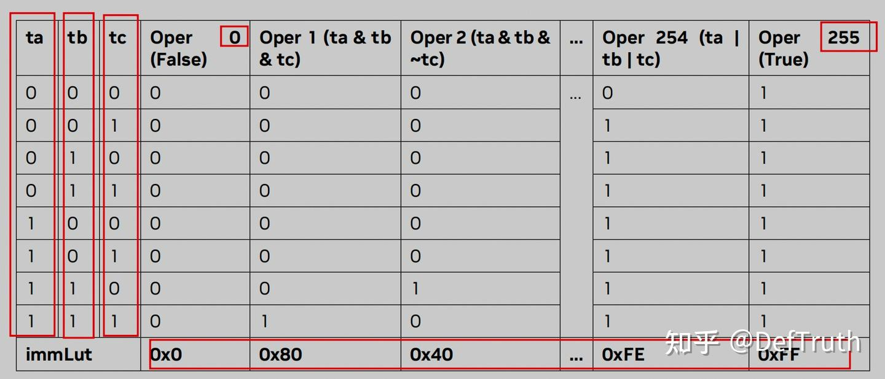

# [LLM 추론 최적화][PTX 어셈블리] CUDA 12 PTX 어셈블리: LOP3 명령어 상세 해설

> 원문: https://zhuanlan.zhihu.com/p/659741469

### 0x00 서문

키워드: LOP3.B32 어셈블리 명령어

이전에 NV FasterTransformer의 Weight Only Int8/Int4에서 사용되는 고속 역양자화 기술을 정리할 때 이 두 명령어를 이미 언급했습니다. 그 중 PRMT.B32 어셈블리 명령어는 INT8->FP16/BF16의 고속 역양자화 연산에 사용되며, 연산 단위는 바이트(byte)입니다. LOP3.B32 어셈블리 명령어는 INT4->FP16/BF16의 고속 역양자화 연산에 사용되며, 연산 단위는 비트(bit)입니다. 자세한 내용은 다음을 참조하세요:

이전에 이 두 명령어에 대해서는 NV FasterTransformer에서 사용되는 용법만 다뤘습니다. 예를 들어 PRMT 명령어는 범용 모드만 설명하고 { .f4e, .b4e, .rc8, .ecl, .ecr, .rc16 } 등의 모드의 구체적인 사용법은 소개하지 않았습니다. 따라서 본 글에서는 PRMT와 LOP3 두 명령어를 정리하여 누락된 부분을 보충합니다. 본 내용은 개인적인 CUDA/PTX ISA 어셈블리 노트로만 사용됩니다.

더 많은 기술 노트와 CUDA 학습 노트는 CUDA-Learn-Notes(CUDA Learn Notes with PyTorch)를 참고해 주세요. CUDA-Learn-Notes에는 **LLM/VLM** 문서 정리와 **FlashAttention/SGEMM/HGEMM/GEMV** 등 주요 **CUDA Kernel**의 **예제 구현**이 포함되어 있으며, 현재 **3k+ stars**를 달성했습니다. 링크: https://github.com/xlite-dev/CUDA-Learn-Notes


CUDA Learn Notes with PyTorch

### 0x02 LOP3 명령어 상세 해설

본 섹션의 내용은 NV PTX ISA 8.1 문서 9.7.7.6 Logic and Shift Instructions: lop3 섹션을 참고합니다.
- **lop3:** Arbitrary logical operation on 3 inputs.
```
lop3.b32 d, a, b, c, immLut; 
```

LOP3 명령어는 3개의 입력 a, b, c(모두 32비트 레지스터)에 대해 임의의 논리 연산을 수행합니다. 예를 들어 (a & b) | c와 같은 연산이며, 논리 연산 결과를 목적 레지스터 d(역시 32비트 레지스터)에 저장합니다. 피연산자 immLut은 a, b, c에 대해 수행할 연산을 지정합니다. NV PTX ISA 8.1 문서에 따르면, immLut은 룩업 테이블(look-up table)에 대응하며, immLut의 가능한 값 범위는 0~255이고, 각 값은 특정 F(a,b,c)에 매핑됩니다. 예를 들어 immLut이 0x80이면 LOP3는 a, b, c에 대해 d=(a & b & c)를 수행합니다.



그렇다면, 특정 연산, 예를 들어 F(a,b,c)=(a & b & c)에 대해 이 immLut 값을 어떻게 지정해야 할까요? 논리 연산 F(a, b, c)에 대해 동일한 방법을 적용하여 세 개의 사전 정의된 상수값(ta, tb, tc)에 대한 연산으로 immLut 값을 계산할 수 있습니다:
```
# ta, tb, tc는 모두 사전 정의된 값, 각각 8bits
ta = 0xF0;  
tb = 0xCC;
tc = 0xAA;
immLut = F(ta, tb, tc);
```

몇 가지 예시:
```
If F = (a & b & c);
immLut = 0xF0 & 0xCC & 0xAA = 0x80
If F = (a | b | c);
immLut = 0xF0 | 0xCC | 0xAA = 0xFE
If F = (a & b & ~c);
immLut = 0xF0 & 0xCC & (~0xAA) = 0x40
If F = ((a & b | c) ^ a);
immLut = (0xF0 & 0xCC | 0xAA) ^ 0xF0 = 0x1A
```

예를 들어, LOP3에서 (a & b & c) 연산을 수행하려면, 이때 immLut 값은 0xF0 & 0xCC & 0xAA = 0x80입니다. 즉, ta, tb, tc에 대해 a, b, c와 동일한 논리 연산을 수행한 결과가 immLut이 됩니다. 그 후:
```
lop3.b32 d, a, b, c, 0x80; // 결과 d=(a & b & c)
```

OK, LOP3 명령어의 설명은 대략 이 정도입니다. 이해하기 쉽습니다.

### 0x03 총결

본 글은 CUDA 12 PTX ISA 8.1 어셈블리 명령어 세트의 LOP3 명령어의 구체적인 사용법을 정리했습니다. PRMT 명령어의 연산 단위는 바이트(byte)이며, 정수 바이트의 permute 연산에 적합합니다. 반면 LOP3의 연산 단위는 비트(bit)이며, immLut을 통해 255가지 연산을 지원하는 Look Up Table과 연결되어 더 세밀한 비트 연산 요구를 충족할 수 있습니다.

지속 업데이트 중, 오탈자는 발견 후 수정합니다...
