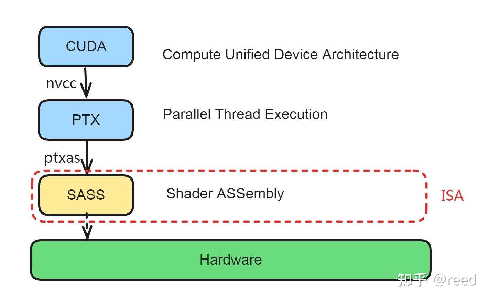

# NVIDIA GPU 명령어 집합 아키텍처 - 서문

> 원문: https://zhuanlan.zhihu.com/p/686198447

2017년 ACM 튜링상은 컴퓨터 아키텍처에 대한 개척적 기여를 인정받아 John L. Hennessy와 David A. Patterson에게 수여되었습니다. 두 사람의 공동 저작 *컴퓨터 아키텍처의 새로운 황금 시대(A New Golden Age for Computer Architecture)* 에는 명령어 집합 아키텍처의 발전과 미래의 기회가 자세히 소개되어 있습니다. 그 글에서 명령어 집합 아키텍처(Instruction Set Architecture, ISA)는 이렇게 정의됩니다.

> "Software talks to hardware through a **vocabulary** called an instruction set architecture (ISA)."

DSA(Domain Specific Architecture)의 장점도 다음과 같이 정리됩니다.

1. 특정 도메인을 위한 더 효율적인 병렬 패턴
2. 메모리 계층의 보다 효과적인 활용
3. 일부 시나리오에서 더 낮은 정밀도 사용
4. DSL(Domain Specific Language)을 통한 하드웨어 능력의 더 나은 노출

고성능 컴퓨팅(HPC)과 딥러닝 기반 인공지능에서 NVIDIA GPU는 연산 능력 측면에서 매우 중요한 위치를 차지합니다. NVIDIA GPU는 그래픽과 딥러닝 도메인을 위한 DSA로 볼 수 있고, 따라서 앞서 언급한 DSA의 장점을 그대로 누립니다. ISA는 소프트웨어와 하드웨어가 대화하는 "어휘"입니다. 우리는 이 어휘 체계를 통해 하드웨어와 소통하며 알고리즘 로직을 하드웨어가 이해할 수 있는 "단어"로 바꿉니다. 그러면 하드웨어가 이 단어들로 우리가 원하는 결과를 만들어 줍니다. 아래 그림처럼 ISA는 하드웨어 능력을 노출합니다. 그림의 하드웨어는 덧셈·뺄셈·곱셈을 제공하지만 나눗셈은 제공하지 않으므로, 소프트웨어가 나눗셈을 만나면 다른 명령으로 시뮬레이션해야 합니다.

*Figure 1. Instruction Set Architecture*

ISA는 하드웨어 능력의 노출이므로, 이를 이해하면 하드웨어가 제공하는 기본 능력을 더 명확히 알 수 있고, 하드웨어에 친화적인 알고리즘을 선택하기 쉬워집니다. 동시에 더 효율적인 명령어를 골라 소프트웨어 실행 효율을 끌어올릴 수도 있습니다.

NVIDIA GPU의 경우 소프트웨어 측 핵심 언어는 CUDA이며, 하드웨어 아키텍처의 명령은 세대마다 다릅니다(Tesla → Fermi → Kepler → Maxwell → Pascal → Volta → Turing → Ampere → Hopper → Blackwell). 본문은 Ampere 아키텍처 기준으로 다룹니다. 아래 그림은 NVIDIA GPU의 소프트웨어 프로그래밍에서 하드웨어 실행까지의 컴파일 흐름입니다. CUDA는 사용자가 프로그래밍하는 언어로, NVCC가 이를 PTX 명령으로 컴파일합니다. PTX는 하드웨어와 무관한(실제로는 버전이 있긴 함) 중간 표현으로 하드웨어 차이를 가립니다. PTX는 PTXAS 어셈블러를 통해 SASS 명령으로 어셈블되며, SASS는 하드웨어에 직접 실행됩니다. SASS는 하드웨어 종속이며, 우리가 이 시리즈에서 다루는 ISA는 바로 이 SASS 계층입니다. 이 계층의 명령이 하드웨어가 직접 실행 가능한 가장 기본 추상이기 때문입니다.

*Figure 2. NVIDIA GPU 컴파일·실행 단계*

NVIDIA는 SASS에 대한 공식 문서를 따로 제공하지 않고, CUDA Binary Utilities 문서에서 짧게만 언급합니다. 본문 내용은 `cuobjdump`로 libcublas, libcublasLt, libfft 같은 공식 라이브러리를 디스어셈블하고, NCU로 실제 사례를 분석한 결과를 PTX 문서와 대조해 도출한 것입니다. 일부 추측이나 가설이 포함될 수 있습니다.

본 시리즈는 NVIDIA Ampere GPU의 ISA를 명령 분류 형식으로 소개하고, 구체적인 명령을 다룰 때는 실제 시나리오와 결합해 잠재적 성능 위험과 최적화 포인트를 분석합니다. 글의 구성은 다음과 같습니다.

- 레지스터: 범용 레지스터, 특수 레지스터, Uniform 레지스터, Predication 레지스터
- 상수 캐시(constant cache)
- 정수 연산 명령
- 부동소수점 연산 명령
- 비트 연산과 논리 명령
- 특수 함수 명령
- 분기와 제어 명령
- 데이터 적재·저장 명령
- Warp 레벨 명령
- 원자(atomic) 명령

이 시리즈를 다 읽고 나면 다음과 같은 질문에 답할 수 있길 바랍니다.

- SASS에 PRMT 명령이 많이 나오는데, 어떻게 생성되며 어떻게 최적화하나?
- `half` 타입이 있는데 왜 `half2` 타입도 필요한가?
- 정수 나눗셈은 어떻게 구현되는가?
- 부동소수점 나눗셈의 효율은 어느 정도인가?
- FlashAttention의 빠른 EXP는 어떤 원리이고, 어떤 상황에서 결과가 부정확해지는가?

본 글은 시리즈의 서문이며, 이후 장에서 다음을 중점적으로 다룹니다.

- 범용 레지스터
- 특수 레지스터
- Uniform 레지스터
- Predication 레지스터
- 상수 캐시
- 정수 연산 명령
- 부동소수점 연산 명령
- 비트 연산과 논리 명령
- 특수 함수 명령
- 분기와 제어 명령
- 데이터 적재·저장 명령
- Warp 레벨 명령
- 원자 명령

## 정리

ISA는 소프트웨어와 하드웨어가 소통하는 "어휘"입니다. 이 어휘를 익혀야 소프트웨어 문제를 하드웨어 명령에 효과적으로 매핑할 수 있고, NVIDIA GPU ISA를 이해하는 일은 우리가 직접 GPU나 NPU의 ISA를 설계할 때도 도움이 됩니다.

## 참고

- https://amturing.acm.org/byyear.cfm
- https://dl.acm.org/doi/10.1145/3282307
- https://docs.nvidia.com/cuda/cuda-binary-utilities/index.html
