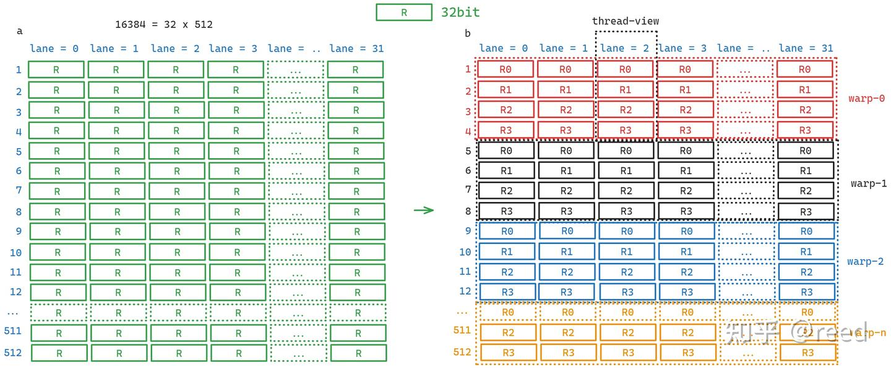

# NVIDIA GPU ISA - 레지스터

> 원문: https://zhuanlan.zhihu.com/p/688616037

**목차**
- Load-Store 아키텍처
- 레지스터로 표현되는 프로그램 상태기계
- 범용 레지스터(General Register)
- 특수 레지스터(Special Register)
- Predicate 레지스터
- Uniform 레지스터
- 정리
- 참고

ISA는 소프트웨어와 하드웨어가 대화하는 "어휘"이고, 그 입출력은 레지스터로 구체화됩니다. 칩 위에서 가장 기본적인 저장 구조이므로 레지스터를 이해하는 것이 명령 학습의 기초입니다. 본 글은 NVIDIA GPU의 레지스터 체계를 다룹니다. 시나리오와 목적에 따라 범용 레지스터, 특수 레지스터, Predicate 레지스터, Uniform 레지스터로 나뉩니다.

## Load-Store 아키텍처

Load-Store 아키텍처(레지스터-레지스터 아키텍처)는 ISA의 중요한 형태입니다. 이 아키텍처에서는 모든 계산성 명령의 소스·목적 피연산자가 레지스터여야 하고, 메모리와 레지스터의 통신은 별도의 Load/Store 명령으로 이뤄집니다. Load-Store는 RISC의 기본 개념 중 하나입니다. NVIDIA Ampere 및 이전 GPGPU 아키텍처는 대체로 Load-Store 정의에 부합(상수 메모리만 약간 예외)합니다. GPU는 메모리 접근 효율과 데이터 지역성을 위해 CPU보다 메모리 계층이 더 다양하므로, Load/Store 명령도 global memory, shared memory, 레지스터 스필이나 로컬 동적 주소 지정 배열에서 비롯되는 Local Memory, Tensor Core용 `ldmatrix` 등으로 구분됩니다.

| 명령 종류 | 목적지 | 소스 |
| --- | --- | --- |
| LDG | 레지스터 | global memory |
| STG | global memory | 레지스터 |
| LDS | 레지스터 | shared memory |
| STS | shared memory | 레지스터 |
| LDL | 레지스터 | local memory |
| STL | local memory | 레지스터 |
| LDSM | 레지스터 | shared memory |
| 비 Load/Store(산술 등) | 레지스터 | 레지스터 |

Load-Store의 주요 장점:

- **명령 집합의 단순화**: 명령이 레지스터에만 동작하도록 제한하면 설계·인코딩이 단순해짐
- **효율적 파이프라이닝**: 메모리 접근이 Load/Store로 통일돼 파이프라인 설계가 간단·효율적
- **컴파일러 최적화 용이**: 명시적 Load/Store가 명령 재배치, 잉여 제거 등 최적화에 유리
- **메모리 접근 효율 향상**: 메모리 대역폭 낭비 감소
- **레지스터 활용 효율**: 느린 메모리 접근 빈도 감소 → 실행 속도 향상
- **명확한 명령 형식**: 보통 3-주소(소스·목적·즉시값) 형식으로 일관성 확보
- **병렬 처리 친화**: 단순성과 효율적 파이프라이닝 덕에 멀티/매니코어에 적합
- **오류 격리**: 메모리 접근과 계산이 분리돼 오류 격리에 유리

Load-Store는 현대 마이크로프로세서 설계에서 매우 보편적입니다.

Hopper 아키텍처부터 Tensor Core 관련 `wgmma` 명령이 도입되며, 이 계산 명령은 shared memory의 데이터를 직접 읽어 연산할 수 있습니다(피연산자가 레지스터일 필요 없음). 즉 Load-Store의 제약을 깬 셈인데, 벡터(SIMT) 계산은 여전히 따릅니다.

## 레지스터로 표현되는 프로그램 상태기계


*Figure 1. SM의 Sub-Core 내 레지스터 파일*

Ampere SM은 4개의 Sub Core(Sub Partition)로 구성되고, 각 Sub Core는 16,384개의 32-bit 범용 레지스터를 갖습니다. CUDA GPU의 스케줄링 단위는 warp이고, warp는 32 lane으로 구성되어 같은 코드를 공유하므로 각 lane의 레지스터도 같은 이름으로 보입니다. 16,384개를 32 lane으로 나누면 512 그룹이 됩니다. Sub Core의 레지스터는 가로 32 lane, 세로 512 그룹의 2D 구조로 볼 수 있습니다. SM이 커널을 실행할 때 이 레지스터들이 여러 warp에 분배됩니다(warp는 block을 구성). 그림 2-b는 warp당 4개씩 분배될 때 각 lane이 보는 본인 레지스터 이름(thread-view)을 보여 줍니다(`R0-R3`).


*Figure 2. 레지스터 파일과 Warp View / Thread View*

이러한 분배 방식이 CUDA의 가장 중요한 지연 은닉 메커니즘을 구성합니다. 프로그램 실행 상태가 모두 레지스터에 기록되므로 warp 스케줄러는 실행 가능한 단위를 골라 FP32 같은 실행 유닛이 해당 warp 레지스터의 데이터를 읽고 결과를 다시 그 레지스터에 씁니다. 어떤 warp가 Load 명령으로 데이터를 기다리면 스케줄러는 데이터가 준비된 다른 warp로 전환합니다(레지스터 상태 그룹을 바꾸는 셈). 실행 유닛은 하나뿐이지만 프로그램 상태를 보관하는 저장 유닛은 여러 개라, 이런 전환은 매우 가볍습니다. CPU의 하이퍼스레딩과 유사합니다 — 한 실행 유닛, 여러 레지스터 상태. 물리적으로 레지스터 파일은 SRAM으로 구현됩니다.

## 범용 레지스터

위에서 언급한 레지스터 파일이 곧 범용 레지스터(General Register)이며, GPU에서 가장 효율적인 저장입니다. R/W 가능하고 비 Load/Store 명령은 레지스터에만 동작합니다. 단일 레지스터 폭은 32-bit. thread당 최대 255개 사용 가능하며, SASS에선 `R` 접두로 `R0~R255`로 표기됩니다. 폭보다 큰 데이터를 다루려면 연속된 여러 레지스터 그룹을 씁니다. SASS 인코딩엔 첫 레지스터만 표기됩니다. 예: `F2F.F64.F32 R4, R2;` 는 FP32 → FP64 변환으로, double 저장에 `R4R5` 두 개를 사용하고 소스는 `R2`입니다. `R255`는 상시 0 레지스터로 `RZ`(Register Zero)로 표기됩니다.

```
R0, R1, R2, R3, ..., R251, R252, R253, R254, R255(RZ)
```

## 특수 레지스터

특수 레지스터(Special Register)는 보통 읽기 전용이며 실행 단위의 위치(스레드 번호, 블록 번호 등)를 식별합니다. 전용 명령으로 읽어야 합니다. 자주 쓰이는 것:

- `SR_TID.X/Y/Z` — CUDA의 `threadIdx`
- `SR_CTAID.X/Y/Z` — CUDA의 `blockIdx`
- `SR_VIRTUALSMID`, `SR_LANEID`, `SR_LEMASK`, `SR_LTMASK`, `SR_GEMASK`
- `SR_CLOCKLO`, `SR_CLOCKHI`
- `SR_GLOBALTIMERLO`, `SR_GLOBALTIMERHI`
- `SRZ`
- `SR_PM0-7`
- `SR_SMEMSZ`

자세한 의미는 PTX 문서의 Special Register 절을 참고하세요.

## Predicate 레지스터

Predication은 GPU에서 분기 예측(branch prediction)을 구현하는 기술입니다. GPU에선 보통 warp 내 thread의 실행 흐름을 제어하는 데 사용되며 CPU의 전통적 분기 예측과는 다릅니다. Predicate 레지스터의 장점:

- **분기 효율 향상**: warp 전체가 하나의 예측 결과에 따라 진행 여부를 결정 → thread별 분기 결정 비용 감소
- **분기 부담 감소**: 통합된 제어 아래 warp 실행 경로를 관리 → 분기 부담 전반 감소
- **명령 파이프라인 최적화**: 분기 예측 실패로 인한 pipeline flush, instruction fetch 부담 감소
- **병렬 실행 효율 향상**: warp 단위 분기 응답 → 발산(divergence)으로 인한 효율 저하 완화
- **프로그래밍 모델 단순화**: 복잡한 분기 로직을 명시적으로 다루지 않아도 됨
- **하드웨어 유연성**: 분기 집약적 프로그램, 특히 대량의 병렬 thread 처리에 유리
- **에너지 감소**: 분기 예측 실패와 그로 인한 pipeline flush가 줄어 전력 소모 감소


*Figure 3. predication으로 파이프라인 stall 회피*

Predicate 레지스터의 두 가지 주된 용도:

1. **명령 실행 조건**: 명령 앞에 두어 실행 여부를 결정. 예: `@P6 FADD R5 R5 R28;`, `@!P1 FADD R11 R11 R17;` — `@` 뒤 predicate가 True일 때만 실행, False면 부작용 없음.
2. **특정 명령의 피연산자**: 예: `FMNMX R9 RZ R6 !PT;`.

Predicate는 thread 사적이며 thread당 최대 8개. SASS에선 `P` 접두로 `P0~P7`. `P0~P6`는 일반 R/W, `P7`은 상시 True (`PT`, Predicate True).

```
P0, P1, P2, P3, P4, P5, P6, P7(PT)
```

## Uniform 레지스터

위의 범용·predicate 레지스터는 SIMT 관점에서 thread 사적입니다. 그러나 warp 내 모든 lane이 완전히 동일한 로직을 실행하거나 reduce 같은 동작(CUDA의 `__reduce_sync` 류)을 할 때가 있습니다. NVIDIA는 이런 warp 레벨 공용 계산을 위해 Uniform 레지스터, Uniform Predicate, 관련 명령을 제공합니다. Uniform을 쓰면 사적 레지스터 사용량을 줄여 warp의 범용 레지스터 사용을 감소시켜 SM에서 더 많은 warp가 돌도록 만들 수 있습니다. 동시에 warp 레벨은 벡터화된 실행 유닛이 필요 없으므로 칩 전력도 줄입니다.

SASS에서 Uniform 레지스터는 `UR` 접두, warp당 최대 64개. Uniform Predicate는 `UP` 접두, warp당 최대 7개. 마지막 `UR63`은 상시 0 (`URZ`), `UPT`는 상시 True.

```
UR0, UR1, UR2, UR3, ..., UR60, UR61, UR62, UR63(URZ)
UP0, UP1, UP2, UP3, UP4, UP5, UP6, UP7(UPT)
```

## 정리

레지스터는 GPU의 핵심 저장 구조입니다. GPU는 대량의 레지스터로 고병렬 지연 은닉 모델을 구현합니다. 단일 thread가 레지스터를 적게 쓸수록 SM에서 동시 실행 가능한 warp 수가 늘어 효율·병렬도가 향상되며, NVIDIA는 thread당 255개의 32-bit 레지스터를 상한으로 정합니다. thread block 인덱스 등은 특수 레지스터로 얻으며, predicate 레지스터로 작은 코드 블록의 파이프라인을 더 효율적으로 만들 수 있습니다. Uniform 레지스터는 warp 레벨의 일관된 계산·reduce에 적합하며 범용 레지스터 사용을 줄여 에너지 효율을 높입니다.

## 참고

- https://eng.libretexts.org/Bookshelves/Computer_Science/Programming_Languages/Introduction_to_Assembly_Language_Programming
- https://en.wikipedia.org/wiki/Load%E2%80%93store_architecture
- https://en.wikipedia.org/wiki/Predication_(computer_architecture)
- https://www.nvidia.com/content/PDF/nvidia-ampere-ga-102-gpu-architecture-whitepaper-v2.pdf
- https://course.ece.cmu.edu/~ece740/f13/lib/exe/fetch.php?media=onur-740-fall13-module7.4.2-predicated-execution.pdf
- https://docs.nvidia.com/cuda/parallel-thread-execution/index.html#special-registers
