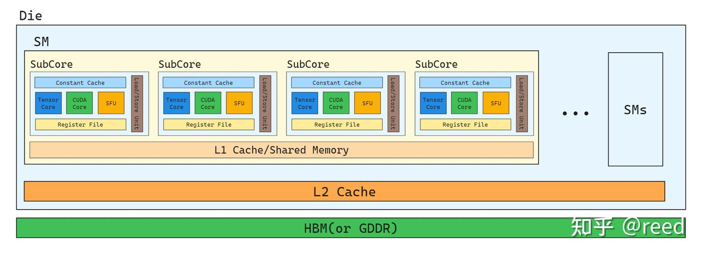
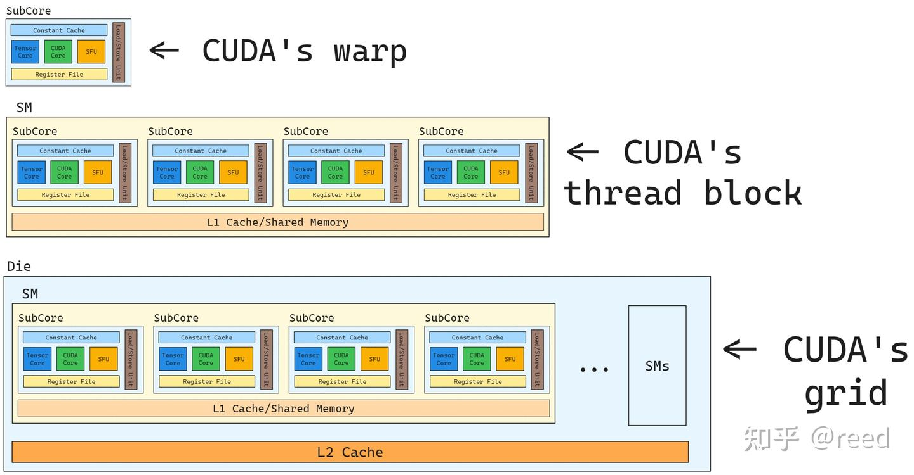

# NVIDIA GPU ISA - Load와 Cache

> 원문: https://zhuanlan.zhihu.com/p/692445145

**목차**
- NVIDIA GPU의 계산 유닛과 메모리 계층
- GPU의 Cache와 Shared Memory 구조
- 데이터 Load 명령
- 브로드캐스트 의미를 가진 상수 Cache
- 레지스터 reuse와 Prefetch
- 정리
- 참고

이전 글에서 NVIDIA GPU ISA의 레지스터를 다뤘습니다. GPU 프로그램에서 이 레지스터의 데이터는 원래 외부 저장 구조에서 옵니다. 외부 저장에서 레지스터로 옮기는 방식, 그리고 그 과정에서 거치는 캐시들이 프로그램 효율에 큰 영향을 줍니다. 본 글은 데이터 이동을 중심으로 NVIDIA GPU의 메모리·캐시 계층과, 이 계층 간 이동 명령·캐시 제어 명령을 다룹니다.

## NVIDIA GPU의 계산 유닛과 메모리 계층

GPU는 고도로 병렬화된 장치라 대량의 계산 유닛을 갖습니다. 이를 효율적으로 조직하고 공간 지역성(Spatial Locality)을 활용하며 데이터 reduce·동기화를 지원하기 위해 GPU는 계층 구조를 사용합니다. Ampere 및 이전 아키텍처는 계산 유닛 측면에서 3단계입니다.

- 가장 작은 단위: **SubCore** — warp 실행 담당
- 4개의 SubCore가 모여 한 **SM** (Stream Multiprocessor)
- 여러 SM이 모여 **device**(GPU)

장비 설계에 따라 SM 수가 달라집니다. 데이터센터 A100과 소비자급 RTX 3080/3090은 모두 Ampere지만 SM 수가 다릅니다.

SubCore 내부에는:

- **Tensor Core**: 행렬 곱
- **CUDA Core**: 벡터화된 FP·INT 곱-덧셈
- **SFU** (Special Function Unit): sin, exp2, sqrt, rcp 같은 초월 함수
- **Register File**: 프로그램 상태의 핵심 저장
- **상수 메모리** (그림의 `constant cache`): 브로드캐스트 의미
- **Load Store Unit**: 외부 데이터 R/W
- 그 외 warp scheduler, branch unit, FP64 등 (ISA 이해엔 별로 필요 없어 생략)

메모리 계층은:

- SubCore: 레지스터, Constant Cache
- SM: 4개 SubCore가 공유하는 L1 Cache, Shared Memory
- 모든 SM: 크로스바를 통해 L2 Cache 공유
- L2는 슬라이스 단위로 메모리 컨트롤러를 거쳐 외부 HBM 또는 GDDR(별도 다이)에 연결

A100과 RTX 3080의 또 다른 큰 차이는 메모리 기술(HBM vs GDDR)입니다.


*Figure 1. NVIDIA GPU 메모리·캐시 계층*

소프트웨어는 물리 하드웨어의 추상입니다. CUDA의 매핑:

- SubCore ↔ warp
- SM ↔ thread block
- 여러 SM의 device ↔ grid

매핑에 스케줄링이 더해져 한 SubCore가 여러 warp를, 한 SM이 여러 block을, 유한한 SM의 device가 하드웨어 수를 훨씬 넘는 grid를 실행할 수 있습니다.


*Figure 2. 하드웨어와 소프트웨어 추상*

## GPU의 Cache와 Shared Memory 구조

캐시는 시간·공간 지역성을 활용하는 중요한 실천 수단이며 1990년대의 핵심 연구 주제였습니다. GPU에서도 캐시는 효율 향상의 핵심입니다. CUDA에선 데이터가 처음 global memory에 있고 핵심 계산은 SubCore 안에서 일어납니다. GPU는 Load-Store 아키텍처라 계산 유닛은 SubCore 내 레지스터(와 constant cache)에만 접근할 수 있습니다. 외부 데이터를 쓰려면 Load 명령으로 레지스터에 적재해야 합니다.

GPU는 global memory ↔ 레지스터 사이에 L2 Cache, L1 Cache 두 단계를 둡니다. A100에서 L2는 40 MB로 모든 SM이 공유. L1은 각 SM에 있어 SubCore 4개가 공유. SubCore의 Load Store Unit이 global 요청을 보내면 L1이 캐시 hit 시 즉시 반환, miss면 L2로 요청, L2도 miss면 비로소 global로 갑니다. L1/L2 대역폭·지연은 HBM보다 훨씬 좋으므로 데이터 접근 로직을 잘 정돈해 지역성을 높이면 효율을 크게 끌어올릴 수 있습니다.

Cache는 사용자가 직접 프로그래밍할 수 없는 영역(hit/evict 로직은 하드웨어가 결정)인데, 공유 데이터를 더 정교하게 관리하고 갱신·동기화 시점을 직접 정하고 싶을 때를 위해 NVIDIA는 SM 레벨에 **Shared Memory** 를 제공합니다. 주소 가능한 공간이며 Load/Store와 가시성 동기화를 지원합니다. 같은 데이터를 반복 사용할 때 명시적으로 shared에 옮겨 두면 하위 메모리 압력을 줄일 수 있습니다. Fermi 아키텍처부터 L1 Cache와 Shared Memory는 백엔드 저장 공간을 공유하고 프런트엔드에서 tag/주소 판정으로 구분됩니다. 시나리오에 따라 L1을 키울지 Shared Memory를 키울지 선택 가능합니다.

데이터 적재는 관점에 따라 여러 모양:

- **소프트웨어**: Global → Shared → Register
- **물리**: HBM(Global) → SRAM(L2) → SRAM(L1) → SRAM(Register File)
- **온칩/오프칩**: OffChip → OnChip (L2/L1/Register)
- **공유 범위**: SMs(Global) → SMs(L2) → SM(L1) → SM의 SubCore(Register File)

## 데이터 Load 명령

```
LD, LDG, LDS, LDSM, LDL
```

`LD`는 범용(컴파일러가 주소 공간 타입을 추론하지 못할 때). 컴파일 타임에 명확하면 타입 지정 명령을 씁니다.

- `LDG` — Load Global
- `LDS` — Load Shared
- `LDSM` — Load Shared Matrix
- `LDL` — Load Local

**Global → Register**

```
LDG.타입.벡터.캐시제어.L2프리페치
```

modifier로 8/16/128 bit 적재 폭과 각 레벨 캐시 bypass, L2 프리페치 여부를 설정. `LDG.128`은 NVIDIA GPU가 지원하는 최대 폭으로 한 번에 128 bit 적재 → warp의 명령 스케줄 횟수와 MIO 큐 트랜잭션을 줄여 큐 가득참으로 인한 stall을 회피. 단일 명령 폭 외에도 효율적 적재엔 coalesced access도 중요합니다(별도 시리즈에서 다룰 예정).

**Global → Shared**

```
LDGSTS, LDGDEPBAR, DEPBAR.LE SB0, 0x1
```

`LDGSTS` — Load Global, Store Shared. 레지스터를 거치지 않고 비동기로 global → shared. 레지스터 사용·의존을 줄이며 multi-stage GEMM에서 매우 중요. cute GEMM 파이프라인의 비동기 복사 절을 참고. Barrier 설정·대기 명령(`LDGDEPBAR`, `DEPBAR`)과 함께 써야 합니다. L1 캐시 사용·L2 프리페치도 설정 가능.

**Shared → Register**

```
LDS.타입.벡터, LDSM.블록.전치
```

`LDS`도 modifier로 폭 설정. 고폭은 MIO 큐 부담을 줄임. `LDSM`은 warp 레벨 협력 명령으로 shared → 레지스터 적재 후 Tensor Core에 공급. cute Copy 추상과 `ldmatrix` 명령의 장점 참고.

**로컬 배열·레지스터 스필**

```
LDL
```

Local Memory가 도입되는 경우:

1. 로컬 배열을 사용하고 인덱스가 컴파일 타임에 결정되지 않을 때
2. 단일 thread의 레지스터 사용이 255를 넘을 때
3. 커널 배열 상수에 접근하며 컴파일 타임에 결정 안 되는 인덱스를 쓸 때

Local Memory는 CUDA의 개념이고 실체는 global memory의 한 영역. 위 상황에선 각 thread가 global memory의 일부를 자기 데이터 공간으로 할당받습니다. R/W가 global에서 일어나 thread 수가 많을 때 비용이 큼 → 가급적 회피.

## 브로드캐스트 의미를 가진 상수 Cache

SubCore의 constant cache는 이름은 cache지만 본질적으로는 (주소로 식별되는) 명명된 객체로 레지스터와 비슷합니다. 브로드캐스트 의미가 있어 warp 내 모든 thread가 같은 데이터를 접근할 때 레지스터처럼 빠릅니다 — 그래서 명령 피연산자에 직접 인코딩될 수 있습니다. 커널의 파라미터는 모든 실행 thread에 broadcast되어야 하므로 constant cache로 구현. device 측 프로그래머블 상수(`__constant__ __device__ int a;`)도 가능합니다.

warp 내 thread가 같은 constant 위치를 접근하면 지연이 고정(레지스터와 같음)이고, 위치가 다르면 직렬화되어 지연이 가변 — 이때 SASS는 `LDC` 명령으로 서로 다른 위치를 적재합니다.

## 레지스터 reuse와 Prefetch

계산 유닛 파이프라인 안에 이미 적재된 데이터도 재사용 가능. 이를 레지스터 reuse라 하며 레지스터 캐시처럼 동작해 대역폭·전력을 줄임:

```
R1.reuse
```

Load 명령에 동반하는 프리페치 외에 명시적인 L1/L2 프리페치 명령도 있습니다(CCTL = Cache Control):

```
CCTL.E.PF2
```

## 정리

NVIDIA GPU의 메모리·캐시 계층과 ISA의 Load·Cache 명령을 살펴봤습니다. 이들을 이해하면 데이터 이동 시 하드웨어 동작을 더 잘 알 수 있고, 적절히 사용·캐시를 활용하면 이동 효율을 끌어올릴 수 있습니다.

## 참고

- https://www.qidian.com/book/1031795831/
- *超스칼라 프로세서 설계* (姚永斌, ISBN 9787302347071)
- https://pc.watch.impress.co.jp/docs/column/kaigai/1275220.html
- https://pc.watch.impress.co.jp/video/pcw/docs/1275/220/p3.pdf
- reed: cute GEMM 파이프라인
- reed: cute Copy 추상
- TensorCore `ldmatrix` 명령의 장점은?
