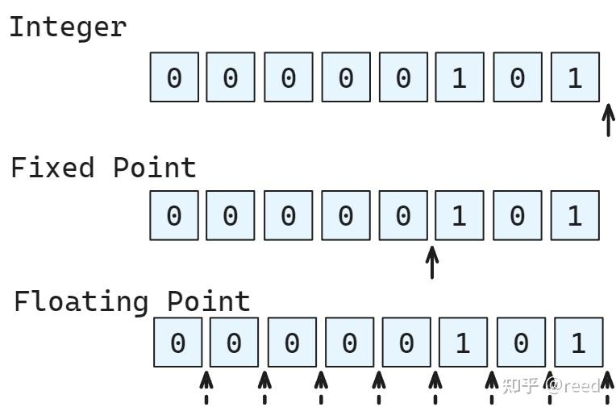
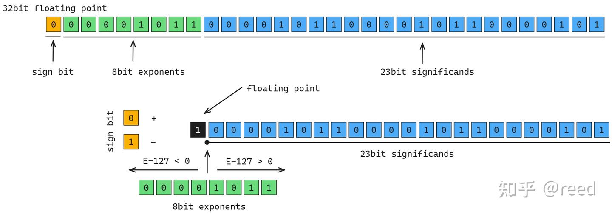
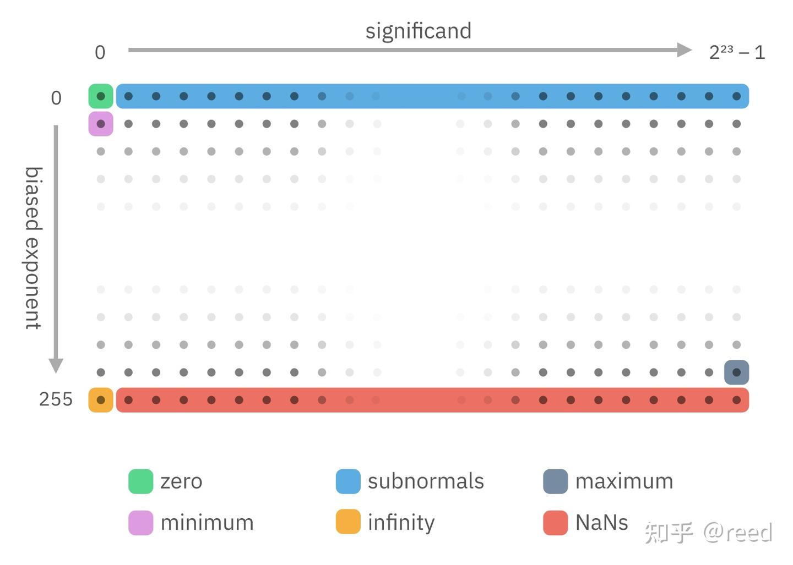

# NVIDIA GPU ISA - 부동소수점 연산

> 원문: https://zhuanlan.zhihu.com/p/695667044

**목차**
- 부동소수점 표현
  - 기초
  - 라운딩
  - 특수 값
  - denormal
- NVIDIA GPU 부동소수점 연산 명령
  - 덧셈·곱셈
  - FMA
  - 인-라인 음수화·절댓값
  - 저정밀 명령
  - 타입 변환
  - 초월 함수
  - 나눗셈
- 정리
- 참고

컴퓨터 산수는 컴퓨터 공학의 중요한 분과이고, 현대 계산 소프트웨어는 대부분 부동소수점 위에 구축됩니다. 부동소수점을 이해하면 계산 정확도와 효율 개선에 큰 도움이 됩니다. NVIDIA GPU는 Tensor Core와 CUDA Core 모두 부동소수점 능력을 제공합니다. 본 글은 CUDA Core 부분에 집중합니다(Tensor Core는 추후 별도). 컴퓨터 부동소수점의 기초와 NVIDIA GPU의 부동소수점 명령을 다룹니다.

## 부동소수점 표현

### 기초

컴퓨터 데이터는 이진수로 저장됩니다. 유한 비트로 표현 가능한 값은 이산적입니다. 정수는 자연스럽게 이산적이라 `b00000101 = 5`처럼 표현합니다. 실수는 고정소수점(Fixed Point) 표현이 가능하지만(소수점 위치를 고정), 정밀도는 일정해도 표현 범위가 제한됩니다. 그래서 컴퓨터 과학자들은 **부동소수점(floating point)** 을 도입했습니다. 소수점 위치를 가변으로 두어 표현 범위를 넓혔습니다.


*Figure 1. 정수, 고정소수, 부동소수*

32-bit 부동소수의 구조:

- 부호 1 bit: 0=양, 1=음
- 지수 8 bit: 무부호 정수 `k`, `k - 127`이 실효 지수. 전 0/전 1은 특수값 예약 → 실효 지수 범위 `[-126, 127]`
- 가수(유효 자릿수) 비트: 정규화 시 앞에 암묵의 `1`이 추가되어 유효 자릿수가 24비트가 됨


*Figure 2. 32-bit 부동소수의 비트 상세*

값은:

```
v = (-1)^sign · 2^(E - 127) · 1.S
```

예시: 부호 0(양), 지수 `b00001011 = 11`, 실효 지수 `11 - 127 = -116`, 가수가 `1.04313719...` → 결과 약 `1.255... × 10⁻³⁵`. ([float.exposed 참고](https://float.exposed/0x05858585))


*Figure 3. 부호·지수·가수가 다른 부동소수*

지수 E의 폭이 클수록 범위가 넓어지고, 가수 폭이 클수록 정밀도가 높아집니다. 시나리오에 따라 트레이드오프해 NVIDIA Ampere는 FP32, half(FP16), bfloat16, tfloat32, double 다섯 종을 지원합니다. Hopper는 FP8(E5M2, E3M4)을, Blackwell은 FP4를 추가합니다.

### 라운딩

부동소수는 실수의 근사이므로 IEEE-754는 사칙연산 시 라운딩 규칙을 정의합니다.

- 가장 가까운 값으로(Nearest)
- 0으로(Zero)
- 양의 무한대로(Plus, ceiling 효과)
- 음의 무한대로(Minus, floor 효과)

보통은 nearest를 써서 표준 ULP 오차를 만족시킵니다. 고정밀 나눗셈 등에선 특정 라운딩이 활용됩니다.

### 특수 값

지수 전부 1, 가수 비-0이면 **NaN**(Not a Number). 0/0이나 음수 제곱근(실수 영역)처럼 무의미한 결과를 나타냅니다(예외 대신). NaN은 전염성: `NaN + 1.0 = NaN`, `NaN × 0.0 = NaN`. 초기화 안 된 데이터에 0을 곱한다고 0이 되지는 않을 수 있음.

지수 전부 1, 가수 전부 0이면 부호에 따라 `+infinity` / `-infinity`. 수학적 규칙은 유효(예: `exp(-infinity) = 0`).

NaN/±Infinity를 잘 활용하면 분기 없이 수학적 표현을 통합할 수 있습니다.

### denormal

가수에 암묵의 1을 붙여 24비트 유효 자릿수를 확보하는 게 정규화(normal). 지수가 전부 0이면 이 1을 붙이지 않습니다. 그러면 가수가 0으로 시작할 수 있어 유효 자릿수가 줄어듭니다. 이런 값을 **denormal**(또는 subnormal)이라 합니다. 또한 지수 전부 0의 실효 지수를 `2⁻¹²⁶`로 잡아(아닌 `2⁻¹²⁷`) 0 근처를 더 촘촘하게 표현해, 절댓값이 매우 작은 값을 더 잘 나타냅니다.


*Figure 4. 부동소수의 모든 특수값(참고 1 인용)*

## NVIDIA GPU 부동소수점 명령

### 덧셈·곱셈

IEEE-754 준수 명령에 라운딩 modifier 지원.

```
FADD R0 R1 R2;     // R1 + R2, Nearest
FADD.RZ R0 R1 R2;  // round to Zero
FADD.RP R0 R1 R2;  // round to +Inf
FADD.RM R0 R1 R2;  // round to -Inf
FMUL R0 R1 R2;
FMUL.RZ / FMUL.RP / FMUL.RM
DADD R0 R2 R4;     // double
DADD.RZ / DADD.RP / DADD.RM
DMUL R0 R2 R4;
DMUL.RZ / DMUL.RP / DMUL.RM
```

denormal 무시(FTZ = flush to zero) modifier도 있습니다.

```
FMUL.FTZ R3, R4, R5;
```

### FMA (Fused Multiply Add)

`d = a × b + c`를 한 명령으로. 중간 결과는 무한 정밀, 마지막에만 라운딩 → `FMUL + FADD`보다 정확. 지연도 `FADD`/`FMUL`과 같아 처리량은 사실상 두 배. FP32는 `FFMA`, FP64는 `DFMA`.

```
FFMA R0, R1, R2, R3;     // round to Nearest
FFMA.RZ / FFMA.RP / FFMA.RM
DFMA R0, R2, R4, R6;
DFMA.RZ / DFMA.RP / DFMA.RM
```

### 인-라인 음수화·절댓값

NVIDIA ISA에는 별도 뺄셈이 없습니다. `FADD`에서 피연산자에 인-라인 음수화를 적용해 `d = a + (-b)`로 구현:

```
FADD R0 R1 -R2;
FADD.RZ R0 R1 -R2;
FADD.RP R0 R1 -R2;
FADD.RM R0 R1 -R2;
```

`d = ±a ± b`, `d = ±a × b`, `d = ±a × b + ±c` 같은 형태가 FADD·FMUL·FFMA에서 한 명령으로 표현됩니다. 단독 음수화 명령은 없고 `d = -d - 0`로 통일. 절댓값도 인-라인 지원:

```
FFMA R7, |R0|, |R7|, -|R6|;  // d = |a| · |b| - |c|
```

### 저정밀 명령

half, bfloat16은 16-bit 부동소수. 두 16-bit를 32-bit 레지스터에 묶어 `half2`, `bfloat162`(packed)로 다룹니다. 레지스터 폭이 32-bit이므로 NVIDIA 명령은 packed 단위. 단일 half를 다뤄도 packed 명령에 입력을 복제·선택하는 식.

packed half(`half2`)에는 `HADD2`, `HMUL2`, `HFMA2.MMA` 제공. 라운딩은 nearest만 지원하고 대신 saturate(`.SAT`로 `[0, 1]` 절단), `.RELU` modifier 제공. abs/음수화 인-라인 가능.

packed bfloat16(`bfloat162`)에는 ADD/MUL 명령이 없고 `HFMA2.BF16_V2`만 있습니다. 덧·곱은 모두 FMA로. 음수화·abs 가능, modifier는 `.RELU`만.

```
HADD2 R7, R0, R7;
HMUL2 R7, R0, R7;
HADD2.SAT / HMUL2.SAT

HFMA2.MMA R7, R0, R7, R6;
HFMA2.MMA.SAT
HFMA2.MMA.RELU

HFMA2.BF16_V2 R7, -RZ.H0_H0, RZ.H0_H0, |R2|;
HFMA2.BF16_V2.RELU
```

### 타입 변환

| from \ to | float64 | float32 | half | bfloat16 |
| --- | --- | --- | --- | --- |
| float64 | / | F2F.F32.F64 | F2F.F16.F64 | Multi-Instr |
| float32 | F2F.F64.F32 | / | F2FP.PACK_AB | F2FP.BF16.PACK_AB |
| half | Multi-Instr | HADD2.F32 | / | NA |
| bfloat16 | Multi-Instr | PRMT | NA | / |

직접 단일 명령으로 안 되는 변환은 중간 타입을 거치는 multi-instr.

### 초월 함수

exp, log, sin/cos, rcp, sqrt 등은 SFU(special function unit)에서 처리. 구간별 2차 함수(`y = ax² + bx + c`) 근사를 룩업 테이블 형태로 계수를 가져와 계산. 명령:

```
MUFU.EX2 R7, R6;
MUFU.SIN R7, R7;
MUFU.COS R7, R7;
MUFU.LG2 R7, R0;
MUFU.RCP R7, R6;
MUFU.RSQ R5, R2;
MUFU.SQRT R7, R13;
MUFU.TANH R11, R4;
```

이 함수들의 정밀도는 낮은 편. NVCC가 소프트웨어 보정으로 정확도를 더 높입니다. 정밀도 요구가 낮으면 `__sinf` 같은 빠른 버전이나 `--use_fast_math` 컴파일러 옵션을 쓸 수 있습니다.

### 나눗셈

IEEE 표준 나눗셈 명령은 없습니다. `MUFU.RCP`로 역수를 구한 뒤 Taylor 전개로 보정. 예: normal 수 나눗셈의 5차 보정:

```
MUFU.RCP R8, R5;
FADD.FTZ R10, -R5, -RZ;
FFMA R3, R8, R10, 1;
FFMA R12, R8, R3, R8;
FFMA R3, R7, R12, RZ;
FFMA R8, R10, R3, R7;
FFMA R11, R12, R8, R3;
FFMA R7, R10, R11, R7;
FFMA R3, R12, R7, R11;
```

또 비교, normal 판정, 라운딩 등 보조 명령:

```
FSETP
FMNMX
FCHK
FRND  FRND.CEIL  FRND.F16.FLOOR  FRND.F64.FLOOR  FRND.FLOOR
```

## 정리

부동소수의 표현·라운딩 기초를 짚고, NVIDIA GPU ISA의 덧셈·곱셈·FMA·특수 함수·타입 변환·인-라인 abs·음수화 능력을 살펴봤습니다. 이를 이해하면 알고리즘 설계와 타입 선택(예: `FFMA`로 `FMUL + FADD` 대체, `half2` packed 활용)에서 더 나은 결정을 내릴 수 있습니다.

## 참고

- Exposing Floating Point — Bartosz Ciechanowski
- https://ieeexplore.ieee.org/xpl/conhome/1000125/all-proceedings
- https://iremi.univ-reunion.fr/IMG/pdf/ieee-754-2008.pdf
- https://web.ece.ucsb.edu/~parhami/pubs_folder/parh02-arith-encycl-infosys.pdf
- https://en.wikipedia.org/wiki/Floating-point_arithmetic
- https://docs.oracle.com/cd/E19957-01/800-7895/800-7895.pdf
- CUDA Toolkit Documentation
