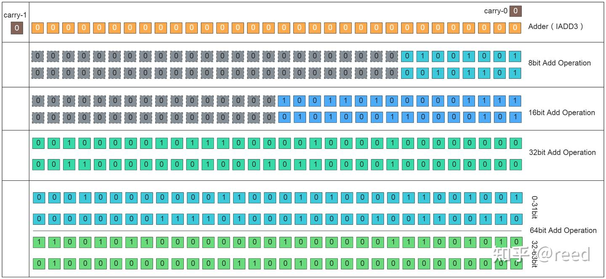
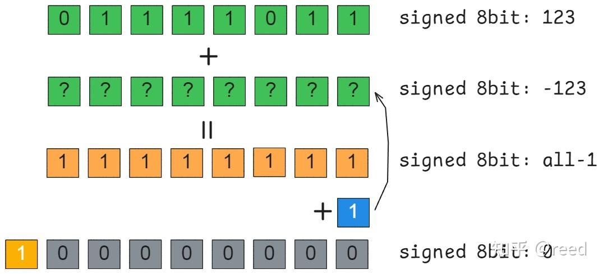

# NVIDIA GPU ISA - 정수 연산

> 원문: https://zhuanlan.zhihu.com/p/700921948

**목차**
- 자주 쓰는 정수 타입과 표현
- NVIDIA GPU의 정수 타입 지원
- 부호 있는 정수의 2의 보수와 산술 시프트
- NVIDIA GPU 정수 명령
  - 덧셈
  - 곱셈
  - 시프트
  - 나눗셈·나머지
  - 정수 → 부동소수
  - 정수 → packed 정수
  - 절댓값
  - 점곱
  - min/max
  - 비교 → 조건 생성
  - Tensor Core 정수 명령
- 정리
- 참고

이전 글에서 NVIDIA GPU CUDA Core의 부동소수 명령을 다뤘습니다. CUDA Core는 정수 연산도 제공합니다. 정수 연산은 통계·정렬·카운팅·주소 계산·인덱스, 암호화 알고리즘과 검증 등에서 핵심 역할을 합니다. 대규모 언어 모델 시대에 저비트 양자화(예: 4비트)는 정수 표현의 연장선이기도 합니다. 본 글은 NVIDIA GPU ISA의 정수 명령을 다룹니다.

## 자주 쓰는 정수 타입과 표현

| 부호 | 타입 | 바이트 | 최솟값 | 최댓값 |
| --- | --- | --- | --- | --- |
| 부호 있음 | int8_t | 1 | -128 | 127 |
| 부호 있음 | int16_t | 2 | -32768 | 32767 |
| 부호 있음 | int32_t | 4 | -2147483648 | 2147483647 |
| 부호 있음 | int64_t | 8 | -9223372036854775808 | 9223372036854775807 |
| 부호 없음 | uint8_t | 1 | 0 | 255 |
| 부호 없음 | uint16_t | 2 | 0 | 65535 |
| 부호 없음 | uint32_t | 4 | 0 | 4294967295 |
| 부호 없음 | uint64_t | 8 | 0 | 18446744073709551615 |

## NVIDIA GPU의 정수 타입 지원

NVIDIA GPU는 정밀도 요구에 따라 다양한 정수 타입을 지원합니다. CUDA 언어 수준에선 위 8종을 모두 지원. 명령 수준에선 레지스터가 32-bit이므로 덧셈을 예로 들면, 32-bit 이하 정수 덧셈은 모두 `IADD3` 한 명령으로 처리. 32-bit 초과(64-bit)는 두 명령으로 나뉘어 하위 32-bit를 먼저 계산(자리올림은 Predicate 레지스터에 보관), 상위 32-bit 계산 시 그 자리올림을 가져옵니다.


*Figure 1. 단일 가산기로 다양한 정밀도의 정수 덧셈 처리*

GPU 프로그램 언어 수준에선 다양한 정수 타입이 있어도, 하드웨어와 ISA 수준에선 한 가산기(32-bit)로 처리합니다. carry-0으로 하위 자리올림 입력, carry-1로 상위 자리올림 출력. 8/16/32-bit는 carry-0 = 0, 8/16-bit는 레지스터에서 32-bit로 확장 후 32-bit 가산기로 계산, 결과를 저장할 때만 절단. 64-bit는 2단계: 1단계는 carry-0=0, carry-1을 Predicate에 저장. 2단계에서 1단계의 carry-1을 carry-0으로 받음.

ISA 수준에서 32-bit 명령뿐이라, GPU 프로그램에서 저비트 정수를 써도 **계산 성능 이점은 없습니다**. 오히려 저비트는 절단 명령을 부르므로 효율을 낮추기 쉽습니다. LLM의 저비트 양자화는 메모리·IO 절감(저장 공간 이점)이지 계산 이점이 아닙니다.

## 부호 있는 정수의 2의 보수와 산술 시프트

컴퓨터는 덧셈·뺄셈, 부호 있음·없음 연산을 통일하고 효율을 높이려고 부호 있는 정수에 **2의 보수(Two's Complement)** 를 씁니다. 예: 8-bit 정수 123의 원래 비트는 `0x11110011`(원본 표기). 덧셈 의미에서 -123은 123과 더해 0이 되는 값이어야 합니다(8-bit 표현 `0x00000000`). 123 + ? = `0x11111111`을 만족하는 ?를 구하고 양변에 1을 더하면 위넘침(8-bit) 의미에서 0이 됩니다. 이를 위해 123의 각 비트를 반전(NOT)하고 1을 더하면 됩니다 — **"반전 + 1"**.

이 표현이 2의 보수입니다. 부호 비트도 연산에 참여하게 만들 수 있어, **MSB(Most Significant Bit)** 가 자연스럽게 부호 역할(0=양, 1=음).


*Figure 2. 부호 있는 정수의 2의 보수 표현*

MSB가 부호이므로 비트 좌·우 시프트에서 부호를 보존할지에 따라 **논리 시프트** 와 **산술 시프트** 가 갈립니다.

**논리 시프트**: 부호를 무시. 빈 자리는 0으로 채움. 부호 없는 수의 ×2ⁿ/÷2ⁿ에 적합.

- 좌: 우측 빈 자리에 0
- 우: 좌측 빈 자리에 0

**산술 시프트**: 부호를 유지(주로 부호 있는 수의 나눗셈).

- 좌: 우측 빈 자리에 0 (논리 좌와 동일)
- 우: 좌측 빈 자리에 부호 비트 복제(양수면 0, 음수면 1)

NVIDIA GPU에선 둘을 `SHF` 명령으로 통합, signed/unsigned modifier로 구분. LLM 저비트 양자화는 보통 산술 시프트에 다른 논리 연산을 결합해 저비트 표현을 합칩니다.

## NVIDIA GPU 정수 명령

세대마다 정수·부동소수 처리량이 크게 다릅니다. 무작정 "정수가 부동소수보다 빠르다"고 가정하면 안 됨.

### 정수 덧셈

`IADD3` (Integer Add 3 operand): `d = a + b + c`. 8/16/32-bit는 형식 1. 64-bit는 P0로 하위 자리올림(carry-0)을 저장, 다음 `IADD3.X` 명령에서 받음. 뺄셈은 인-라인 음수화로 처리.

```
// 8bit/16bit/32bit
IADD3 R7, R0, R7, RZ;       // R7 = R0 + R7 + RZ

// 뺄셈
IADD3 R7, R0, -R7, RZ;

// 64bit: R6-7 = R4-5 + R6-7
IADD3   R6, P0, R4, R6, RZ;            // P0 = carry
IADD3.X R7, R5, R7, RZ, P0, !PT;       // 상위 32 + carry
```

### 정수 곱셈

독립 정수 곱셈 명령은 없고 FMA처럼 통합된 IMAD가 제공됩니다 (`d = a × b + c`). 다양한 modifier:

- `.HI` — 상위 32-bit만
- `.MOV` — `b = 0`/`a = 0`으로 MOV 효과
- `.IADD` — 덧셈 의미
- `.SHL` — `b = 2, 4, ...`로 좌시프트 효과
- `.WIDE` — 64-bit 폭

```
IMAD
IMAD.HI / IMAD.HI.U32
IMAD.IADD / IMAD.IADD.U32
IMAD.MOV / IMAD.MOV.U32
IMAD.SHL / IMAD.SHL.U32
IMAD.U32 / IMAD.U32.X
IMAD.WIDE / IMAD.WIDE.U32 / IMAD.WIDE.U32.X
IMAD.X
```

`c`에 인-라인 음수화 → `d = a × b - c`.

### 정수 시프트

`SHF`: `.L/.R` 방향, `.U32/.U64` 무부호(논리), `.S32/.S64` 부호(산술).

```
SHF.L.U32 / SHF.L.U32.HI
SHF.L.U64.HI / SHF.L.W.U32
SHF.R.S32.HI / SHF.R.S64
SHF.R.U32.HI / SHF.R.U64
```

### 정수 나눗셈·나머지

ISA에 독립 정수 나눗셈은 없습니다. 정수를 부동소수로 변환한 뒤 SFU의 `MUFU.RCP`로 역수를 구해 나누고 다시 정수로 변환·보정. 컴파일 타임 상수 제수는 비트 시프트·곱셈 명령 조합으로 변환(cutlass도 유사).

### 정수 → 부동소수

`I2F` (Integer to Float). 기본은 int32→float32. modifier로 다양한 변환:

```
I2F
I2F.F16 / I2F.F64
I2F.F64.S64 / I2F.F64.U32 / I2F.F64.U64
I2F.RP
I2F.S16 / I2F.S64 / I2F.S8
I2F.U16 / I2F.U32 / I2F.U32.RP
I2F.U64 / I2F.U64.RP
```

### 정수 → packed 정수

복잡한 논리·시프트로 일일이 짜지 않게 packed 변환 명령 제공:

```
I2IP.S8.S32.SAT
```

### 절댓값

```
IABS
```

### 정수 점곱

저정밀 정수의 dot product (Integer Dot Product). 작은 채널의 딥러닝 처리에 유리:

```
IDP.2A.LO.U16.U8
IDP.4A.S8.S8
```

### min / max

`IMNMX` — Integer Min and Max. predicate로 선택(True면 min, False면 max). 32-bit 이하 가능. 64-bit는 `ISETP`로:

```
IMNMX R7, R0, R7, !PT;   // PT → min, !PT → max
IMNMX.U32
```

### 정수 비교 → 조건

`ISETP` (Integer SET Predicate). 조합으로 복잡한 제어 흐름:

```
ISETP.EQ.AND      ISETP.EQ.U32.OR  ISETP.GE.OR.EX       ...
ISETP.EQ.AND.EX   ISETP.EQ.XOR     ISETP.GE.U32.AND     ...
ISETP.EQ.OR       ISETP.GE.AND     ISETP.GE.U32.AND.EX  ...
ISETP.LT, LE, GT, GE, NE 등 모든 조합 가능
```

### Tensor Core 정수 명령

Tensor Core가 고처리량 정수 행렬 곱 명령을 제공합니다(후속 글에서 상세).

```
IMMA.16816.S8.S8
IMMA.16832.S8.S8.SAT
IMMA.8816.S8.S8.SAT
```

## 정리

흔히 쓰는 정수 타입과 NVIDIA GPU의 통일 가산기가 이를 어떻게 지원하는지 살펴봤고, 2의 보수 및 논리/산술 시프트를 짚었습니다. 마지막으로 NVIDIA GPU의 정수 관련 명령을 자세히 정리했습니다. 정수의 표현·연산 로직과 저수준 명령을 알면 적절한 계산 정밀도를 선택하는 데 큰 도움이 됩니다.

## 참고

- https://gmplib.org/~tege/divcnst-pldi94.pdf
- https://github.com/NVIDIA/cutlass/blob/main/include/cutlass/fast_math.h#L364
- https://docs.nvidia.com/cuda/cuda-c-programming-guide/index.html#arithmetic-instructions
- reed: NVIDIA GPU ISA - 레지스터
- reed: NVIDIA GPU ISA - 부동소수 연산
