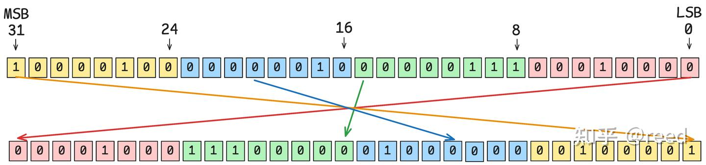
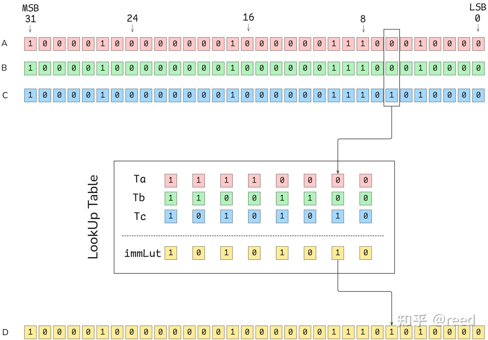
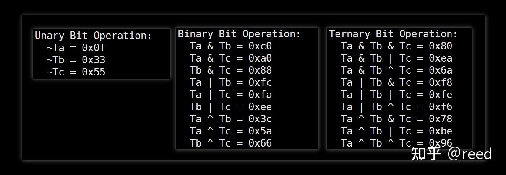

# NVIDIA GPU ISA - 비트와 논리 연산

> 원문: https://zhuanlan.zhihu.com/p/712356884

**목차**
- 타입 없는 레지스터 표현
- POPC 명령
- FLO 명령
- BREV 명령
- SGXT 명령
- BMSK 명령
- PRMT 명령
- LOP3 명령
- 정리
- 참고

이전 글에서 NVIDIA GPU의 부동소수·정수 명령을 다뤘습니다. 그 외에 비트·논리 연산 또한 핵심입니다. 비트 연산은 이진 비트에 대한 연산으로 단일 비트 AND/OR/NOT/XOR, 다중 비트 카운팅(예: bit reverse) 등을 포함합니다. 데이터 압축·저장 최적화·암호화 알고리즘 등 다양한 분야에서 중요합니다. NVIDIA GPU는 ISA 차원에서 풍부한 비트 연산을 제공합니다. 본 글은 그 내용을 다룹니다.

## 타입 없는 레지스터 표현

컴퓨터 데이터는 이진. NVIDIA GPU의 32-bit 레지스터는 32개의 0/1 시퀀스입니다. 레지스터 자체엔 타입이 없습니다. 명령이 그 시퀀스를 어떻게 해석할지는 명령의 의미에 따라 다릅니다. 예: `IADD3`(부호 있는 가산)에 입력이면 MSB는 부호 비트; `FMUL`(부동소수 곱셈)에 입력이면 MSB는 부호, 다음 8비트는 지수, 그다음 23비트는 가수.


*Figure 1. NVIDIA GPU의 32-bit 레지스터*

비트 연산도 피연산자의 타입을 따지지 않고 각 비트의 0/1에만 작동합니다.

## POPC 명령

`POPC` (POPulation Count) — 32-bit 데이터의 1 비트 개수를 셈.


*Figure 2. POPC*

```
POPC R7, R2;
```

CUDA의 `__popc(unsigned int)`로 래핑. 64-bit는 `__popcll(uint64_t)`로 호출되지만 내부적으로 상위/하위 32-bit에 각각 `POPC` 후 정수 합산.

## FLO 명령

`FLO` (First Leading One) — MSB에서 LSB 방향으로 첫 1의 위치를 찾음(LSB가 0). 전부 0이면 `0xFFFFFFFF` 반환, 전부 1이면 31. 부호 있는 입력에선 양수는 첫 1, 음수는 첫 0을 찾음. `SH` modifier는 부호 비트로 정렬하기 위해 필요한 좌시프트 양을 반환.

```
FLO R7, R2;        // signed
FLO.U32.SH R7, R2;
FLO.SH R7, R2;
```

PTX의 `bfind`로 트리거됩니다.

## BREV 명령

`BREV` (Bit Reverse) — 32-bit 비트 역순.


*Figure 3. Bit Reverse*

```
BREV R7, R2;
```

64-bit는 두 `BREV`로.

## SGXT 명령

`SGXT` (Sign Extend) — 특정 비트 폭 데이터의 부호 비트 확장.


*Figure 4. Sign Extend*

```
SGXT R7, R0, R7;   // nbit = R7
```

`R0`의 `R7 - 1`번째 비트를 부호 비트로 보고 상위 32-bit까지 확장. 산술 좌시프트·우시프트로도 가능하지만(`R7 = (R0 << (32 - R7)) >> (32 - R7)`) 명령 수가 늘고 효율이 떨어집니다.

## BMSK 명령

`BMSK` (Bit Mask) — `start` 위치부터 `mask`개의 1을 채운 32-bit 마스크 반환.


*Figure 5. Bit Mask*

```
BMSK R2 R0 R1;     // start: R0, mask: R1
BMSK R5, R5, 0x3;
```

## PRMT 명령

`PRMT` (PeRMuTe) — 8-bit(1 byte)를 기본 단위로 selector 위치 지정에 따라 재정렬.

세 입력 `Ra, Rb, Rsel` → 한 출력 `Rd`. `Ra`의 4 byte는 b0, b1, b2, b3; `Rb`는 b4~b7. `Rsel`은 8개 중 4개를 골라(중복 가능) 출력 32-bit에 배치. 각 출력 byte는 `Rsel`의 4-bit로 제어 — 하위 3-bit가 byte 인덱스(0~7), 최상위 비트(4번째)가 0이면 원값 복제, 1이면 부호 비트 복제.


*Figure 6. Permute*

```
// PRMT Rd Ra Rb Rsel;
PRMT R7 R4 R5 R6;
```

여러 modifier가 있으며 위와 같은 기능을 수행. 자세한 modifier는 PTX 문서.

## LOP3 명령

`LOP3` (Logical OPeration on 3 inputs) — 3 피연산자에 대한 비트별 논리 연산. 예: `d = a & b & c`, `d = a & b ^ (~c)` 등. 단일 또는 2 피연산자 연산도 표현 가능(나머지를 RZ로). 형식:

```
LOP3.LUT R7, R0, R7, R6, 0xf, !PT;
```

`R7`이 출력, `R0/R7/R6`이 입력, `0xf`가 룩업 테이블 immediate (`immLut`), `!PT`는 후술.

LUT 방식 동작: 입력 A, B, C의 같은 비트 위치(0~31)에서 한 비트씩 뽑아 3-bit 입력으로 만들고, 그 8개 조합에 대해 미리 만든 `immLut`(8-bit)이 출력 비트를 결정.


*Figure 7. LOP3 동작*

룩업 테이블의 본질: 3-bit 입력의 모든 조합 8가지에 1-bit 출력을 매핑. 모든 3입력 논리식이 표현 가능. 그림의 `Ta = 0xF0, Tb = 0xCC, Tc = 0xAA`를 활용해 `immLut`을 `Ta, Tb, Tc`의 논리 조합으로 구할 수 있습니다.

예: `A & B & C`의 immLut은 0b000→0, 0b001→0, ..., 0b111→1 → `immLut = 0x80`. 32-bit의 비트 반전은 입력 중 하나에 두고 나머지를 RZ로 두는 세 가지 경로가 가능:

| | 방법 1 | 방법 2 | 방법 3 |
| --- | --- | --- | --- |
| 식 | `D = ~A` | `D = ~B` | `D = ~C` |
| immLut | 0x0F | 0x33 | 0x55 |
| 명령 | `LOP3.LUT R7, R0, RZ, RZ, 0x0f, !PT` | `LOP3.LUT R7, RZ, R0, RZ, 0x33, !PT` | `LOP3.LUT R7, RZ, RZ, R0, 0x55, !PT` |

흔히 쓰이는 1·2·3 피연산자 논리 연산의 immLut 값:


*Figure 8. 자주 쓰는 bit 논리의 immLut*

CUDA 라이브러리를 디스어셈블해 본 immLut 빈도·논리식:


`LOP3`는 출력 결과를 추가 Predication에 AND/OR해 Predication 출력을 함께 만들 수도 있습니다(PTX 문서·디스어셈블 참고). 비슷한 명령으로 `PLOP3`는 다수의 1-bit Predication 논리 조합을 계산.

## 정리

NVIDIA GPU의 비트 연산 명령 POPC, FLO, BREV, SGXT, BMSK를 그림과 함께 살펴봤고, 복잡한 PRMT, LOP3도 자세히 다뤘습니다. 이를 알면 비슷한 계산이 필요할 때 적절한 명령을 골라 효율을 끌어올릴 수 있습니다.

## 참고

- reed: NVIDIA GPU ISA - 서문
- reed: NVIDIA GPU ISA - 부동소수 연산
- reed: NVIDIA GPU ISA - 정수 연산
- reed: NVIDIA GPU ISA - 레지스터
- PTX ISA 8.5
