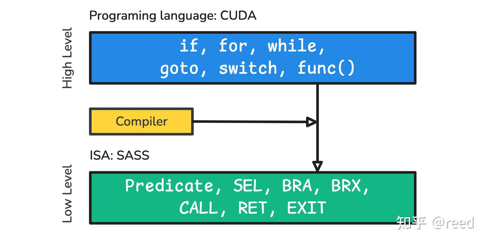
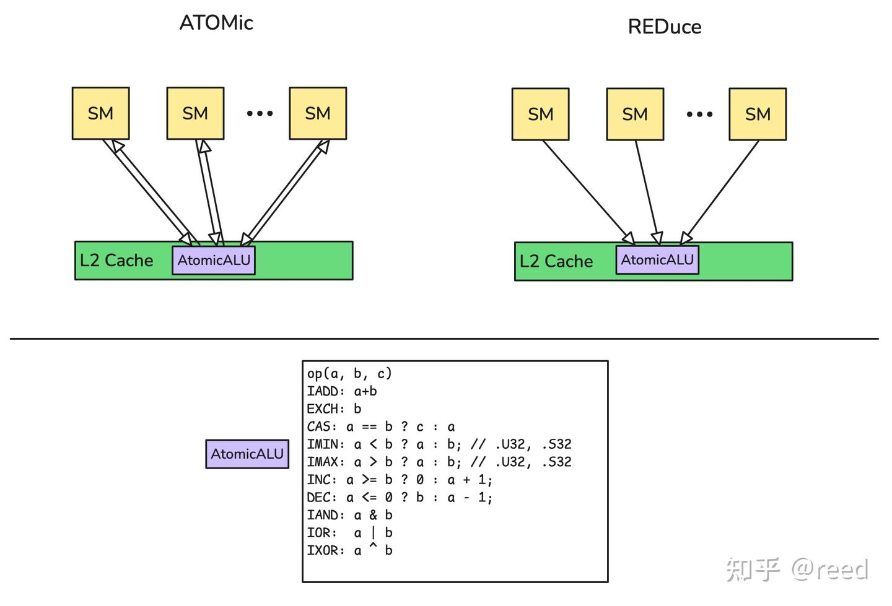

# NVIDIA GPU ISA - 프로그램 제어와 원자적 연산

> 원문: https://zhuanlan.zhihu.com/p/712357443

**목차**
- 고급 프로그래밍 언어와 하위 명령
- 명령 레벨의 제어 흐름
  - Predicate로 구현하는 제어 흐름
  - 선택 명령 (SEL)
  - 분기 명령 (BRA, BRX, BRXU)
  - 함수 호출과 반환 (CALL, RET)
  - 스레드 종료 (EXIT)
  - 실행 로직의 분기와 합류
- 원자적 연산
- 정리
- 참고

이전 글들에서 NVIDIA GPU의 부동소수 계산, 정수 계산, 비트 연산, 그리고 Warp 레벨 협동 계산을 자세히 다뤘습니다. 이들은 GPU의 핵심 연산 능력을 구성하며 그래픽 렌더링과 AI 계산을 강력하게 뒷받침합니다. 그 외에 레지스터, load/store 유닛과 cache 메커니즘도 살펴봤습니다. 이들은 데이터의 저장과 전송을 담당해 연산 유닛이 효율적으로 데이터를 가져와 처리할 수 있게 합니다.

그러나 계산과 데이터 이동은 GPU 기능의 일부일 뿐이고, 프로그램 제어 로직 또한 빼놓을 수 없습니다. 프로그램 제어 로직은 계산 흐름을 조율해 프로그램이 의도한 로직대로 실행되도록 보장합니다. GPU는 고도로 병렬적인 시스템이지만, 많은 경우 프로그램 제어와 데이터 동기화를 위해 국소적 또는 전역적인 직렬 로직이 여전히 필요합니다. 이를 위해 NVIDIA GPU는 일련의 atomic 명령을 제공합니다.

본 글은 NVIDIA GPU의 프로그램 제어 로직과 atomic 명령을 중점적으로 다룹니다. 먼저 프로그래밍 언어 레벨과 하위 명령의 대응 관계에서 출발해, 명령 레벨의 제어 흐름으로 들어가 Predicate, SEL, BRA 등의 명령이 프로그램 제어에서 하는 역할을 살펴봅니다. 이어서 atomic 명령인 ATOM, ATOMG, ATOMS와 더 효율적인 RED 명령을 소개하고, 마지막으로 전체 내용을 정리합니다.

## 고급 프로그래밍 언어와 하위 명령

CUDA C 같은 고급 프로그래밍 언어에서는 `if`, `for`, `while`, `switch`, `goto`, `function call`, `return` 같은 제어 흐름 구조가 널리 쓰입니다(그림 1). 이런 구조는 고급 언어에 풍부한 제어·표현 능력을 제공합니다. 하위 하드웨어 명령은 이를 구현할 때 GPU의 멀티스레드·고병렬 하드웨어 특성에 맞춰 더 낮은 수준의 원자적인 제어 능력을 제공합니다. 구체적으로 NVIDIA GPU는 Predicate 능력과 Select, Branch, Call, Return, Exit 등의 관련 명령으로 프로그램 제어를 수행합니다(그림 1).



이 명령들을 활용하거나 조합하면 고급 언어의 제어 흐름 구조를 표현할 수 있습니다. 주목할 점은 고급 언어와 하위 명령이 일대일 대응이 아니라는 것입니다. 같은 고급 언어 로직이 하위 명령의 여러 조합 형태로 대응될 수 있습니다. 예를 들어 어떤 if 로직은 Predicate로 구현할 수도, SEL로 구현할 수도, BRA로 구현할 수도 있습니다. 다만 상황에 따라 효율 차이가 크므로 컴파일러가 구체적인 문맥에 맞춰 더 나은 명령을 선택합니다.

## 명령 레벨의 제어 흐름

### Predicate로 구현하는 제어 흐름

아래 CUDA 코드는 if 제어 흐름을 보여줍니다. 명령집합으로 lower될 때는 일반적으로 Predicate를 사용해 제어를 수행합니다.

```cpp
  if (c > 0) {
    v = __sinf(f);
  } else {
    v = __cosf(f);
  }
```

위 CUDA 코드에 대응하는 명령 표현:

```sass
@!P0 MUFU.COS R0, R8 ;
@P0 MUFU.SIN R0, R8 ;
```

여기서 보듯이 고급 프로그래밍 언어의 if 제어 흐름은 하위 명령에서 Predicate로 구현됩니다.

### 선택 명령 (SEL)

CUDA 언어의 if 문이 일정한 조건을 만족하고 충분히 단순하다면, 컴파일러는 백엔드 명령집합에서 **SEL**ect 명령을 고를 수 있습니다. 예를 들어 다음 CUDA 문장은

```cpp
  if (c > 0) {
    v = 1;
  } else {
    v = 2;
  }
```

컴파일러가 생성하는 명령의 한 가지 가능한 형태가 다음과 같습니다.

```sass
MOV R7, 0x1 ;
...
SEL R7, R7, 0x2, P0 ;
```

여기서 P0는 Predicate 레지스터로 `c > 0` 조건을 표현합니다. 조건이 성립하면 R7을, 아니면 immediate 0x2(정수 2)를 선택합니다. SEL 명령은 SIMT 관점에서 분기(jump) 오버헤드를 피해 실행 효율을 높일 수 있습니다.

### 분기 명령 (BRA, BRX, BRXU)

branch 분기 명령은 명령의 점프를 구현합니다. 예를 들어 CUDA 코드의 for 루프는

```cpp
  float v = 0.f;
#pragma unroll 1
  for (int i = 0; i < n; ++i) {
    v += ff;
  }
```

분기 점프 명령으로 구현할 수 있고, 가능한 명령 시퀀스 중 하나는 다음과 같습니다.

```sass
/*0070*/                   IADD3 R3, R3, 0x1, RZ ;
/*0080*/                   FADD R0, R0, c[0x0][0x184] ;
/*0090*/                   ISETP.GE.AND P0, PT, R3, c[0x0][0x180], PT ;
/*00a0*/              @!P0 BRA 0x70 ;
```

여기서 `IADD` 문장은 정수 1 증가로 CUDA의 `i++`에 대응하고, `FADD` 문장은 부동소수 덧셈으로 CUDA의 `v += ff`에 대응합니다. `ISETP` 문장은 정수 비교 결과에 따라 Predicate 레지스터를 설정하며, 비교 조건은 `GE`(Greater than and Equal)로 CUDA `for` 문의 `i < n`의 부정 조건을 표현합니다. `@!P0 BRA 0x70 ;`는 P0 조건이 성립하지 않을 때 0x70 위치로 점프해 실행한다는 뜻입니다. `BRA` 점프 문장을 통해 for의 반복 능력이 구현되었습니다.

이렇게 주소를 지정하는 분기 점프 외에도 NVIDIA GPU 명령집합은 동적 점프 명령 `BRX`를 제공합니다. `BRX R6 -0x7960` 같은 형태이며, 레지스터 값에 따라 더 동적인 분기 점프를 수행합니다. switch 문 구현에서 이 명령이 나타날 수 있습니다. 또한 Warp 레벨 Uniform 레지스터 값에 따라 동적으로 점프하는 명령 `BRXU`도 제공되며, `BRXU UR34 -0xb200` 같은 형태로 Uniform 실행 경로에서 동작합니다.

### 함수 호출과 반환 (CALL, RET)

CUDA에서는 `__device__`로 device 함수를 정의할 수 있고, 이 함수들은 global 함수 안에서 호출될 수 있습니다. 비교적 작은 함수에 대해서는 컴파일러가 보통 inline 최적화를 적용해 주 함수의 일부로 만들어 함수 호출 명령 사용을 줄입니다. 그래도 때로는 함수 호출 명령이 여전히 쓰입니다. NVIDIA GPU에서 흔히 보이는 함수 호출 명령은 다음과 같고, Modifier로 REL/ABS와 NOINC가 있습니다.

```sass
CALL.REL 0x60f0;
CALL.REL.NOINC 0xfd00;
CALL.ABS.NOINC R2;
```

Modifier REL은 상대 호출, ABS는 절대 호출, NOINC는 PC 값이 변하지 않음을 뜻합니다. 함수 반환에 흔히 쓰이는 명령은 다음과 같습니다.

```sass
RET.ABS R18 0x20;
RET.REL.NODEC R80 0x0;
```

NVIDIA는 함수 호출의 ABI 규약을 공개하지 않았습니다. 또한 GPU는 레지스터가 대량으로 존재하는 장치라 호출 시 그 많은 레지스터를 모두 save하기 어렵고, 대부분의 함수가 하나의 컴파일 단위 안에 있어 최적화 여지가 큽니다. 이 부분은 컴파일러 규약의 영역에 더 가까우므로 여기서는 깊이 다루지 않습니다.

### 스레드 종료 (EXIT)

GPU는 멀티스레드 장치라 대부분의 경우 서로 다른 thread가 같은 명령을 실행합니다. 어떤 때는 그중 일부 thread가 일할 필요가 없어 미리 종료할 수 있으며, NVIDIA GPU는 이를 위한 명령을 제공합니다.

```sass
EXIT ;
```

이 명령을 실행한 thread는 같은 warp의 다른 thread가 종료하지 않았다고 해서 다른 명령을 실행하지는 않습니다. 다만 주의할 점은, warp 내 일부 thread가 EXIT 명령을 실행했더라도 warp에 여전히 active thread가 남아 있다면, 그 thread들이 SYNC나 BAR 같은 명령을 실행할 때의 동작은 올바라야 한다는 것입니다. 다른 명령과 마찬가지로 이 명령도 Predicate를 적용할 수 있습니다.

```sass
@P2 EXIT
```

### 실행 로직의 분기와 합류

GPU는 멀티스레드 모델이므로, 어떤 상황에서는 일부 thread가 한 기본 블록을 실행하고 나머지 thread가 다른 기본 블록을 실행해야 로직이 올바르게 유지됩니다. 그러나 장시간 분기 상태로 실행하면 효율이 떨어지므로, NVIDIA GPU는 동기 지점을 명시적으로 설정하는 명령을 제공해 효율을 확보합니다. 구체적인 명령 예는 다음과 같습니다.

```sass
BSSY B0, 0x150
BSYNC B0 ;
@!P0 BREAK B2 ;
```

BSSY는 동기 지점 설정 명령, BSYNC는 동기 대기 명령, BREAK는 동기 지점을 깨는 명령입니다. 이 명령들은 복잡한 중첩 조건을 처리하는 데 중요한 역할을 합니다. 동시에 NVIDIA는 이 능력을 사용자에게 개방하지 않았고 컴파일러가 판단해 결정합니다. 더 자세한 내용은 NVIDIA의 특허(US11847508B2)를 참고하십시오.

이 밖에 NVIDIA GPU에서 흔히 보이는 제어 관련 명령으로 NOP(No Operation)과 LEPC(Load Effective PC) 등이 있습니다.

```sass
NOP;
LEPC R96;
```

## 원자적 연산

앞에서 소개한 계산 계열 명령은 논리적으로 단일 thread가 독립적으로 동작하거나, Warp 레벨로 협동해 동작합니다. 이들은 국소성과 독립성이 좋습니다. 일부 응용에서는 각 thread의 독립적인 계산 외에 Block 단위의 reduction이나 카운팅 연산이 필요하고, 이런 연산은 논리적으로 원자적으로 실행되어야 합니다. 이를 위해 NVIDIA GPU 명령집합 아키텍처는 Atomic 계열 명령을 도입했으며, 주요 명령은 다음과 같습니다.

```sass
ATOM, ATOMS, ATOMG, RED
```

ATOMS와 ATOMG는 각각 Shared Memory 공간과 Global Memory 공간에서 원자적 연산을 수행합니다. ATOM 명령은 구체적인 주소 공간이 한정되지 않은 generic 원자적 연산입니다. 컴파일러가 주소 공간을 명시적으로 추론할 수 있으면 대응하는 명령을 사용하고, 추론할 수 없으면 범용 명령을 사용해 하드웨어가 런타임에 어느 주소 공간인지 판정합니다. NVIDIA GPU는 Modifier를 통해 덧셈, 최솟값, XOR, AND, CAS 등 서로 다른 연산을 구현하며(지원되는 구체적인 연산은 그림 2의 AtomicALU 부분 참고), Modifier로 작용 Scope도 지정합니다. 흔히 쓰이는 명령 형태는 다음과 같습니다.

```sass
ATOMS.ADD  ATOMS.ARRIVE.64 ATOMS.MIN.S32 ATOMS.POPC.INC.32
ATOM.E.ADD.STRONG.GPU  ATOM.E.ADD.STRONG.SYS  ATOM.E.CAS.STRONG.GPU  ATOM.E.EXCH.STRONG.SYS
ATOMG.E.ADD.64.STRONG.GPU ATOMG.E.ADD.STRONG.SYS    ATOMG.E.CAS.STRONG.GPU
ATOMG.E.ADD.STRONG.GPU    ATOMG.E.CAS.64.STRONG.GPU ATOMG.E.EXCH.STRONG.SYS
```

구체적인 ATOM 계열 명령의 형태는 다음과 같습니다. 그 의미는 R9의 값을 global 주소 공간 \[R4.64\]에 원자적으로 더하고 더하기 전의 값을 반환하는 것으로, 값을 가져오는 것과 더하는 것이 원자적이라 다른 연산에 의해 중단될 수 없습니다.

```sass
ATOMG.E.ADD.STRONG.GPU PT R5 [R4.64] R9
```

때로는 원자적 연산만 필요하고 반환값은 필요하지 않습니다. NVIDIA GPU는 더 가벼운 atomic 명령 RED를 제공합니다(그림 2).



ATOM 명령은 읽은 값을 가져와야 하지만 RED는 그럴 필요가 없습니다. 최종 메모리 관점에서 RED와 ATOM의 부수 효과는 동일합니다. RED는 원자적 연산 이전의 값을 반환할 필요가 없으므로 효율도 자연히 더 높습니다. 구체적인 차이는 NVIDIA의 특허(US7627723B1)를 참고하십시오.

```sass
RED.E.ADD.64.STRONG.GPU         RED.E.ADD.STRONG.GPU            RED.E.OR.STRONG.GPU
RED.E.ADD.F32.FTZ.RN.STRONG.GPU RED.E.MAX.S32.STRONG.GPU
RED.E.ADD.F64.RN.STRONG.GPU     RED.E.MIN.S32.STRONG.GPU
```

구체적인 명령 형태는 다음과 같습니다.

```sass
RED.E.MAX.S32.STRONG.GPU [R4.64] R7
```

RED의 명령 형태에서 볼 수 있듯이, ATOM 명령에 비해 입력 데이터의 레지스터와 연산할 주소 데이터만 필요하고 데이터를 반환하지 않습니다. 그 덕분에 데이터 반환 비용이 줄어 명령 효율이 높아집니다.

## 정리

본 글은 고급 프로그래밍 언어의 제어 흐름과 하위 프로그램 제어 명령을 소개하고, 둘 사이에 가능한 다중 매핑 관계를 짚었습니다. 상황에 따라 최적화 방식과 매핑 방식이 달라집니다. 아울러 하위 프로그램 제어 명령을 자세히 살펴봤습니다. Predicate로 구현하는 제어 흐름, SEL 선택 명령, BRA 분기 명령, 함수 호출 CALL과 반환 RET 명령을 다뤘고, EXIT 종료 명령이 단순한 종료가 아니라 다른 BARRIER의 일관성 동작과 병렬 실행이 도입하는 분기·합류 로직까지 고려해야 함을 지적했습니다. 또한 atomic 명령과 반환값이 필요 없는 RED 계열 명령도 소개했습니다. 이 명령들을 알면 고병렬 하드웨어와 관련 컴파일러 설계를 더 잘 이해할 수 있습니다.

## 참고

- reed: NVIDIA GPU ISA - 부동소수 연산
- reed: NVIDIA GPU ISA - 정수 연산
- reed: NVIDIA GPU ISA - 비트와 논리 연산
- reed: NVIDIA GPU ISA - Warp 레벨과 Uniform 연산
- reed: NVIDIA GPU ISA - 레지스터
- reed: NVIDIA GPU ISA - Load와 Cache
- Do switch statements require gmem reads for the jump table? — https://forums.developer.nvidia.com/t/do-switch-statements-require-gmem-reads-for-the-jump-table/179914/4
- https://forums.developer.nvidia.com/t/the-calling-process-of-device-function/287822
- https://docs.nvidia.com/cuda/cuda-binary-utilities/index.html
- https://patents.google.com/patent/US11847508B2
- https://patents.google.com/patent/US7627723B1
