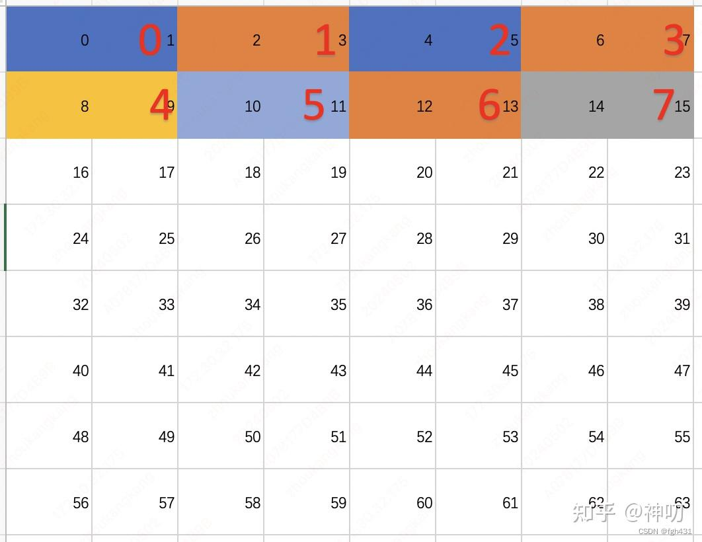
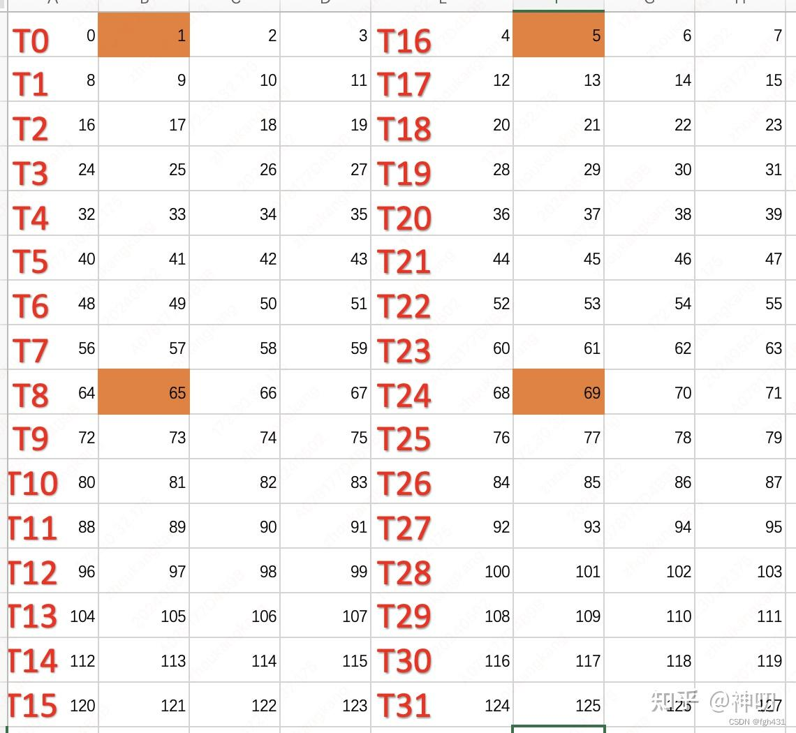
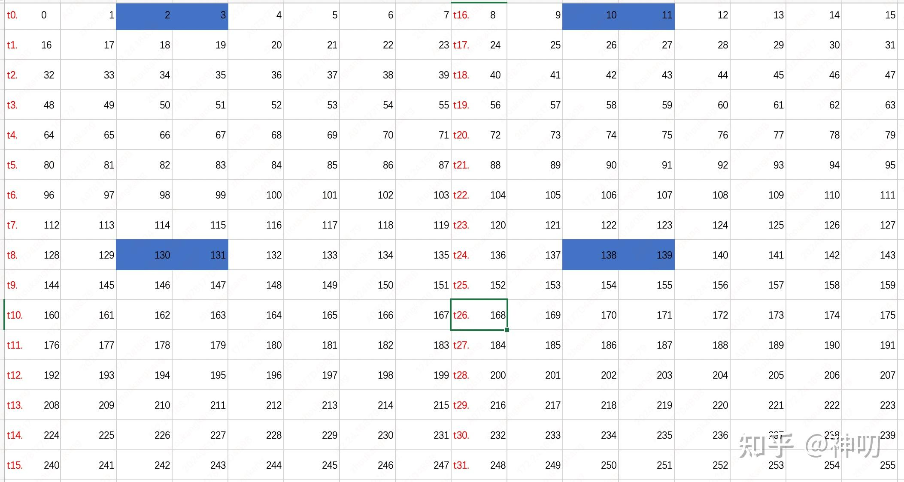
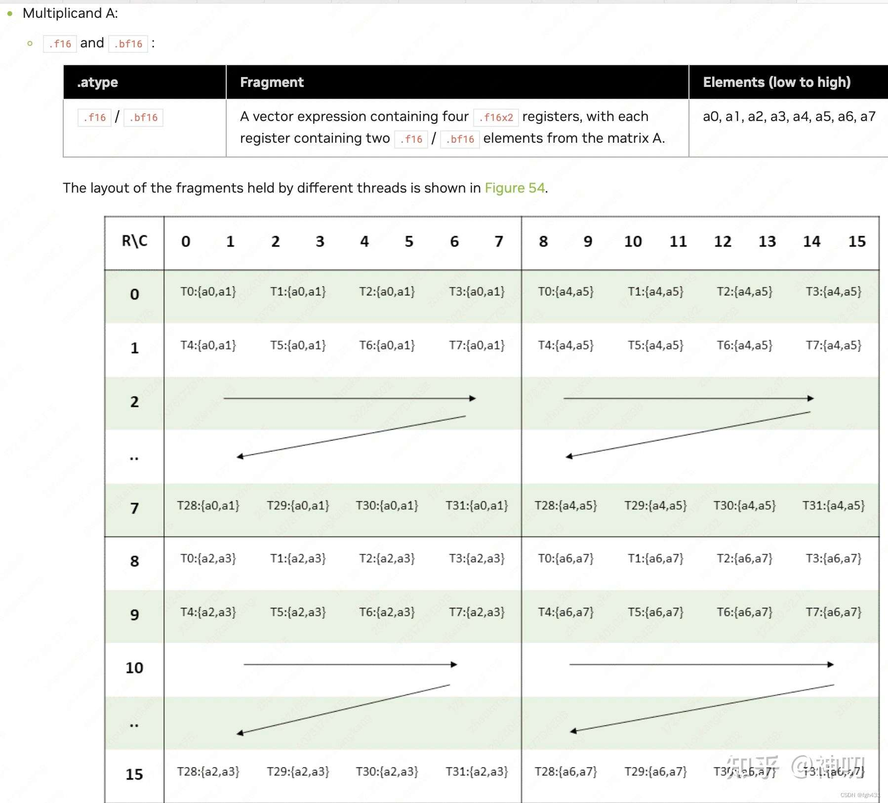
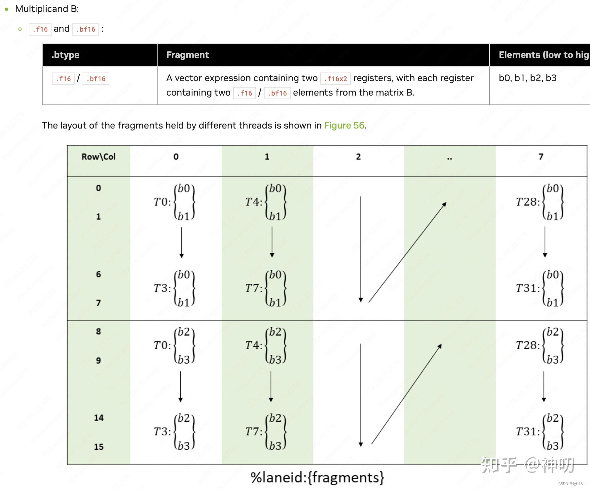
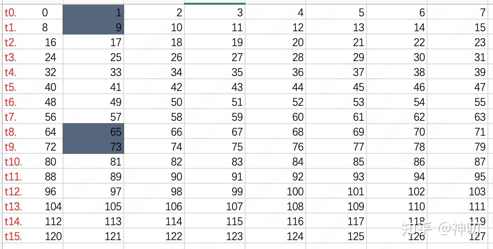
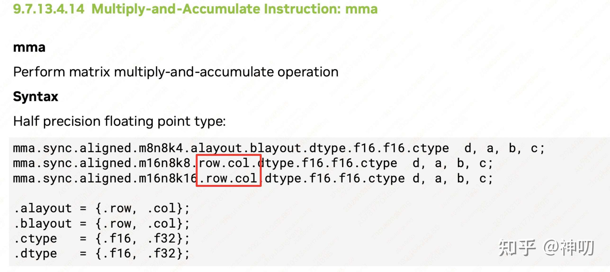

# CUDA ldmatrix 명령 상세 설명

> 출처: https://zhuanlan.zhihu.com/p/697228676 . 제가 약간 수정하고 주석을 달았습니다.

## CUDA의 ldmatrix 명령 상세 설명

`ldmatrix` 명령은 PTX level 명령입니다. warp-level data load instruction이며, data는 shared memory에서 32개 CUDA thread의 register로 load됩니다.

### 1. ldmatrix 명령 사용 형식 예: ldmatrix.sync.aligned.m8n8.x1.shared.b16 { %0 }, [ %1 ];

- 바로 예를 보겠습니다. 예를 들어 이 명령 `ldmatrix.sync.aligned.m8n8.x1.shared.b16 { %0 }, [ %1 ];`입니다.
- 의미는 한 warp의 32개 thread가 shared memory에서 1(`x1`)개의 `8*8(m8n8)` matrix를 load한다는 것입니다. 이 matrix는 8 row를 가집니다.
- 각 row의 8개 element는 반드시 연속 저장되어야 하지만, 서로 다른 row 사이가 연속일 필요는 없습니다.
- 이 matrix의 element granularity는 b16입니다. 즉 element 하나가 2 byte를 차지합니다.
- 따라서 이 warp는 8*8=64개 element를 읽습니다. warp 안의 각 CUDA thread는 element 2개를 차지하므로 정확히 32-bit register 하나가 됩니다.
- 각 row의 위치는 연속일 필요가 없으므로 user가 8 row의 start address를 지정해야 합니다. 이는 user가 `thread0-thread7`의 `%1` register에 이 8개 address가 채워지도록 보장해야 함을 뜻합니다.
- `thread 8-thread 31`의 `%1` register data는 아무렇게나 설정해도 됩니다.
- return되는 32-bit data는 `%0` register에 있습니다.
- 첫 번째 궁금한 점은 이 64개 element가 32개 CUDA thread 사이에 어떻게 분포되는가입니다.
- 답은 아래 그림을 보면 됩니다. 빨간색은 thread id를 나타냅니다. 각 thread는 data 2개를 차지하며, 정확히 32-bit register 하나입니다.
- 그림에는 `thread0-thread7`의 경우만 제시되어 있습니다. 다른 thread가 차지하는 data도 같은 방식으로 유추하면 되므로 여기서는 생략했습니다.
- 그림은 총 8 row입니다. 각 row의 start address는 반드시 `thread0-thread7`의 `%1` register로 지정해야 한다는 점에 주의하세요.



### 2. ldmatrix 명령 사용 형식 예: ldmatrix.sync.aligned.m8n8.x4.shared.b16 { %0, %1, %2, %3 }, [ %4 ]

- 이 예가 더 널리 사용됩니다. 의미는 한 warp의 32개 thread가 shared memory에서 4개의 8*8 matrix를 load한다는 것이며, matrix element는 여전히 16-bit입니다.
- 따라서 이때는 32개 address를 지정해야 합니다. 즉 `thread0-thread31`의 `%4` register가 이 32개 address를 지정해야 합니다.
- 동시에 각 CUDA thread는 `4*8*8/32=8`개 bf16 element를 나눠 가져야 하며, 이는 4개의 32-bit register입니다.
- 그래서 return value도 register 네 개입니다.

#### ldmatrix.sync.aligned 명령 예

- 아래 code는 매우 간단해서 볼 가치가 있습니다. compile command는 `nvcc A.cu -arch sm_80`입니다.
- 아래 code는 한 warp의 32개 thread가 shared memory에서 4개의 `8*8` matrix를 load하게 합니다. 다만 여기서는 `uint32_t` element type을 사용했으므로 실제로는 4개의 `8*4` matrix입니다.
- 아래 code는 thread 1이 차지하는 네 개 32-bit register 값을 출력합니다.

```c
#include <stdio.h>
#include <iostream>

__global__ void helloFromGPU (void)
{
  __shared__ uint32_t aTile[4*8*4];

  int tidx = threadIdx.x + blockDim.x * threadIdx.y;
  // 아래 code는 smem 안의 4*8*4 matrix를 initialize한다.
  if (tidx == 0) {
    for (int i = 0; i < 4*8*4; ++i) {
        aTile[i] = i;
    }
  }
  __syncthreads();

  int aTile_index = tidx % 16 * 8 + tidx / 16 * 4;
  uint32_t a[4];
  uint32_t smem = __cvta_generic_to_shared(aTile+aTile_index);
  asm("ldmatrix.sync.aligned.m8n8.x4.shared.b16 { %0, %1, %2, %3 }, [ %4 ];\n"
  : "=r"(a[0]), "=r"(a[1]), "=r"(a[2]), "=r"(a[3]) 
  : "r"(smem)
  );

  if (tidx == 1) {
    printf("%d \n", (a[0])); printf("%d \n", (a[1]));
    printf("%d \n", (a[2])); printf("%d \n", (a[3]));
  }
}

int main(void) {
uint3 block = {32,1,1};
uint3 grid = {1,1,1};
helloFromGPU <<<grid, block>>>();

cudaDeviceReset();
return 0;
}
```

- 위 code의 `int aTile_index = tidx % 16 * 8 + tidx / 16 * 4;`는 각 thread가 각 row의 start address를 각각 가리키게 합니다.
  여기서 `tidx % 16`은 row id를 의미하고,
  `tidx / 16 * 4`는 column id를 의미합니다.
- b16 관점에서 보면 사실 column id는 `tidx / 16 * 8`이어야 합니다.
- 하지만 제 code에서는 `uint32` type을 사용했으므로 `tidx / 16 * 4`가 됩니다.
- 마지막으로 출력된 네 숫자는 아래 그림과 같습니다.



- 위 사용 예에서는 data unit을 `uint32_t`로 설정했기 때문에 user가 직접 이해하기 조금 어려울 수 있습니다. 아래에 `fp16` element를 대상으로 `ldmatrix` 명령을 사용하는 예를 하나 보충합니다.
- 아래 예제 code의 이름은 `B.cu`이고, compile command는 `nvcc B.cu -arch sm_80`입니다.

```c
#include <stdio.h>
#include <iostream>
#include "cublas_v2.h"

__global__ void helloFromGPU (void) {
  __shared__ half aTile[4*8*8];

  int tidx = threadIdx.x + blockDim.x * threadIdx.y;
  // 아래 code는 smem 안의 4*8*8 matrix를 initialize한다.
  if (tidx == 0) {
    for (int i = 0; i < 4*8*8; ++i) {
        aTile[i] = i;
    }
  }
  __syncthreads();

  int aTile_index = tidx % 16 * 16 + tidx / 16 * 8;
  uint32_t my_register[4];
  uint32_t smem = __cvta_generic_to_shared(aTile+aTile_index);
  asm("ldmatrix.sync.aligned.m8n8.x4.shared.b16 { %0, %1, %2, %3 }, [ %4 ];\n"
  : "=r"(my_register[0]), "=r"(my_register[1]), "=r"(my_register[2]), "=r"(my_register[3]) 
  : "r"(smem)
  );

  if (tidx == 1) {
    for (int i = 0; i < 4; i++) {
        half * tmp = (half*)(&(my_register[i]));
        printf("%f\n", (float)(tmp[0]));
        printf("%f\n", (float)(tmp[1]));
    }
  }
}

int main(void) {
uint3 block = {32,1,1};
uint3 grid = {1,1,1};
helloFromGPU <<<grid, block>>>();

cudaDeviceReset();
return 0;
}

```



#### 왜 index 계산 방식이 `int aTile_index = tidx % 16 * 16 + tidx / 16 * 8;`인가? 여기서 `*8`은 무엇을 의미하는가?

- 이 formula는 각 thread가 shared memory에서 접근해야 할 start position을 계산하는 데 사용됩니다. 단계별로 분석해 보겠습니다.
1. 먼저 data layout을 이해해야 합니다.
   - 4개의 8×8 matrix가 있습니다(`half` type 사용).
   - 각 matrix는 8 row를 가지고, 각 row는 8개의 `half` element를 가집니다.
   - 하나의 warp(32개 thread)가 협력해 이 data를 load해야 합니다.
2. formula decomposition:
   - `tidx % 16`: 32개 thread를 두 group으로 나누고 0-15 값을 얻습니다. 이는 앞 16개 thread 안에서의 position을 의미합니다.
   - `tidx / 16`: 32개 thread를 두 group으로 나누고 0 또는 1을 얻습니다. 이는 thread가 앞쪽 절반인지 뒤쪽 절반인지 나타냅니다.
   - `16`: 각 row에는 8개 `half` element가 있으므로 16 byte입니다(`half` 하나는 2 byte).
   - `8`: 각 thread group이 담당하는 row offset입니다.
3. 왜 `* 8`인가:
   - 각 `half` element는 2 byte입니다.
   - 한 row에는 8개 `half` element가 있습니다.
   - 따라서 다음 row group으로 이동하려면 8개 element를 건너뛰어야 합니다.
   - 이 `* 8`은 두 번째 thread group(`tidx/16 == 1`)이 올바른 row에 접근하도록 보장합니다.

구체적인 예로 설명해 보겠습니다.
`half` type 8×8 matrix가 있고, data layout이 다음과 같다고 가정합니다.

```shell
[0,  1,  2,  3,  4,  5,  6,  7]    // row 0
[8,  9,  10, 11, 12, 13, 14, 15]   // row 1
[16, 17, 18, 19, 20, 21, 22, 23]   // row 2
...
```

- thread 0(`tidx=0`)의 경우:
  - `tidx % 16 * 16 = 0 * 16 = 0`
  - `tidx / 16 * 8 = 0 * 8 = 0`
  - final index = 0, first row start를 가리킴
- thread 1(`tidx=1`)의 경우:
  - `tidx % 16 * 16 = 1 * 16 = 16`
  - `tidx / 16 * 8 = 0 * 8 = 0`
  - final index = 16, second row start를 가리킴
- thread 16(`tidx=16`)의 경우:
  - `tidx % 16 * 16 = 0 * 16 = 0`
  - `tidx / 16 * 8 = 1 * 8 = 8`
  - final index = 8, another region start를 가리킴

이런 index calculation 방식은 다음을 보장합니다.

- 각 thread가 올바른 data position에 접근할 수 있음
- data access가 각 row에서 contiguous함
- `ldmatrix` 명령의 data layout requirement를 만족함
- shared memory에서 register로 matrix data를 효율적으로 load할 수 있음

이 계산 방식은 `ldmatrix` 명령의 동작 방식에 맞추기 위한 것입니다. warp 안의 32개 thread가 협력해 matrix data loading을 효율적으로 완료할 수 있게 합니다.

#### 왜 이런 명령이 필요한가?

- 왜 `ldmatrix` 명령이 필요할까요? 이 명령은 주로 `mma` 명령과 함께 사용되기 때문입니다.
- 즉 먼저 `ldmatrix` 명령으로 shared memory의 data를 register로 load하고, 그 다음 `mma` 명령을 호출해 계산합니다.
- 이 link 9.7.13.4.8. Matrix Fragments for mma.m16n8k16 with floating point type(https://docs.nvidia.com/cuda/parallel-thread-execution/index.html#warp-level-matrix-fragment-mma-16816-float)을 보세요. 여기에는 `mma.m16n8k16` 명령이 나와 있습니다.
- 이 명령의 기능은 A matrix `16*16`과 B matrix `16*8`을 계산해 `16*8` matrix C를 얻는 것입니다.
- 여기서 A matrix `16*16`의 element는 32개 CUDA thread의 register에 분포합니다. 각 thread는 8개 element를 차지합니다. 이렇게 많은 element가 32개 thread에 어떻게 분포되는지 궁금할 수 있습니다.
- 바로 아래 그림과 같습니다.



- 위 그림에서 볼 수 있듯, 위 16 * 16을 0-255로 initialize한다고 가정하면, 물론 row-major order입니다. mma 명령에서 input이 32개 CUDA thread 사이에 분포하는 방식은 정확히 B.cu 예제와 비슷합니다.
- B matrix 16*8의 element도 32개 CUDA thread의 register에 분포합니다. 이 많은 element가 32개 CUDA thread register에 어떻게 분포되는지는 아래 그림과 같습니다.



- 위 그림에서 볼 수 있듯, mma 명령에서 input이 32개 CUDA thread 사이에 분포하는 방식은 정확히 ldmatrix 명령과 같습니다.
- 물론 이는 smem 안의 B matrix가 반드시 column major여야 한다는 요구가 있습니다. 그렇지 않으면 ldmatrix 명령을 호출할 수 없습니다.
- 사실 ldmatrix 명령을 호출할 수도 있습니다. 다만 `trans`를 붙여야 합니다. 즉 `ldmatrix.sync.aligned.m8n8.x2.trans.shared.b16`입니다.
- 구체적으로는 제 diagram을 보세요.



- `trans`를 붙이면 각 thread의 data split이 B matrix와 같은 형태가 됩니다.
- code는 다음과 같습니다. 이름은 C.cu이고, compile command는 `nvcc C.cu -arch sm_80`입니다.

```c
#include <stdio.h>
#include <iostream>
#include "cublas_v2.h"

__global__ void helloFromGPU (void) {
  __shared__ half aTile[2*8*8];

  int tidx = threadIdx.x + blockDim.x * threadIdx.y;
  // 아래 code는 smem 안의 2*8*8 matrix를 initialize한다.
  if (tidx == 0) {
    for (int i = 0; i < 2*8*8; ++i) {
        aTile[i] = i;
    }
  }
  __syncthreads();

  int aTile_index = tidx * 8;
  uint32_t my_register[2];
  uint32_t smem = __cvta_generic_to_shared(aTile+aTile_index);
  asm("ldmatrix.sync.aligned.m8n8.x2.trans.shared.b16 { %0, %1 }, [ %2 ];\n"
  : "=r"(my_register[0]), "=r"(my_register[1])
  : "r"(smem)
  );

  if (tidx == 4) {
    for (int i = 0; i < 2; i++) {
        half * tmp = (half*)(&(my_register[i]));
        printf("%f\n", (float)(tmp[0]));
        printf("%f\n", (float)(tmp[1]));
    }
  }
}

int main(void) {
uint3 block = {32,1,1};
uint3 grid = {1,1,1};
helloFromGPU <<<grid, block>>>();

cudaDeviceReset();
return 0;
}

```

ldmatrix 명령의 official documentation은 다음과 같습니다: https://docs.nvidia.com/cuda/parallel-thread-execution/index.html#warp-level-matrix-instructions-ldmatrix

#### 왜 int8 matrix에서 A가 rowmajor이고 B가 col major일 때 performance가 가장 좋은가?

- 제 개인적인 생각으로는 ldmatrix 명령이 16byte transpose만 지원하고 8byte transpose는 지원하지 않기 때문입니다. 그래서 int8 matrix에서는 A가 rowmajor, B가 col major여야 합니다.

#### 왜 sm75 이상 architecture의 mma 명령은 A와 B가 한 가지 layout만 지원하는가?



`ldmatrix.sync.aligned.m8n8.x2.trans.shared.b16` 명령이 있기 때문입니다.
