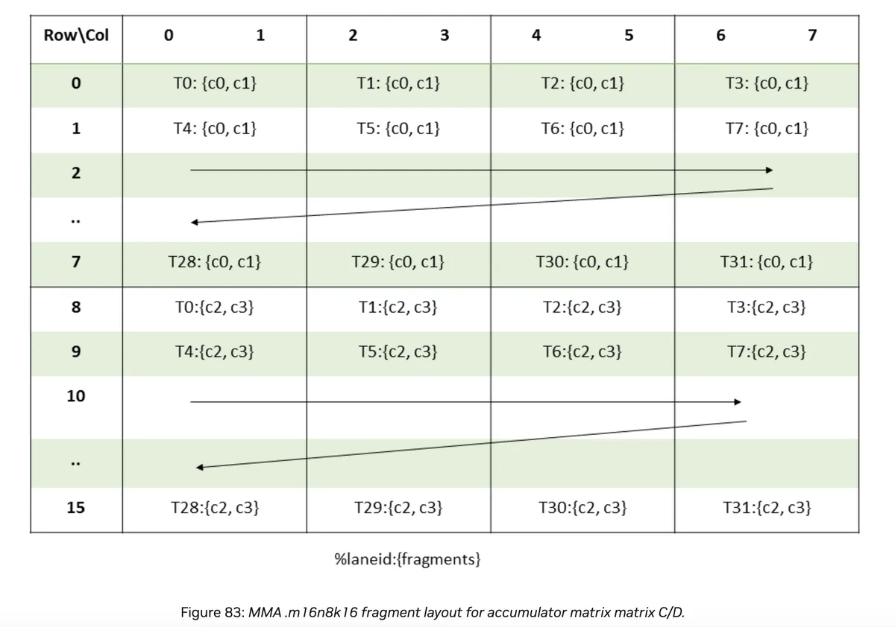

> 이 글은 @Simon V(https://github.com/simveit)의 허가를 받아 전재 및 번역해 이 공개 계정에 게시합니다. 원문 주소: https://veitner.bearblog.dev/a-short-note-on-tensorcores-and-inline-ptx-assembly/


# TensorCore와 Inline PTX Assembly에 관한 짧은 노트

2025년 5월 9일

Tensorcores는 GPU에서 행렬 곱을 수행하는 전용 유닛입니다. 그 잠재력을 충분히 활용하려면 `Inline PTX Assembly`를 작성해야 합니다. 이 짧은 노트는 `PTX` 명령을 활용해 TensorCore의 신비를 조금 걷어내는 것을 목표로 합니다.

## MMA

PTX 문서(https://docs.nvidia.com/cuda/parallel-thread-execution/#warp-level-matrix-instructions)에서 다음을 찾을 수 있습니다. 행렬 곱 및 누산 연산의 형태는 `D = A * B + C`이며, 여기서 `D`와 `C`는 accumulator라고 부르고 같은 행렬을 가리킬 수도 있습니다. warp 수준 MMA 작업을 수행할 수 있는 연산은 `wmma`와 `mma` 두 가지입니다. 이 블로그에서는 더 유연한 `mma` 명령에 집중합니다. 참고로 Hopper에서 최고 성능을 얻으려면 `wgmma` 명령을 사용해야 합니다.

반정밀도 명령의 형태는 다음과 같습니다.

```shell
mma.sync.aligned.m8n8k4.alayout.blayout.dtype.f16.f16.ctype  d, a, b, c;
mma.sync.aligned.m16n8k8.row.col.dtype.f16.f16.ctype  d, a, b, c;
mma.sync.aligned.m16n8k16.row.col.dtype.f16.f16.ctype d, a, b, c;

.alayout = {.row, .col};
.blayout = {.row, .col};
.ctype   = {.f16, .f32};
.dtype   = {.f16, .f32};
```

`mma`용 대체 부동소수점 명령의 형태는 다음과 같습니다.

```shell
mma.sync.aligned.m16n8k4.row.col.f32.tf32.tf32.f32        d, a, b, c;
mma.sync.aligned.m16n8k8.row.col.f32.atype.btype.f32      d, a, b, c;
mma.sync.aligned.m16n8k16.row.col.f32.bf16.bf16.f32       d, a, b, c;
mma.sync.aligned.shape.row.col.dtype.f8type.f8type.ctype  d, a, b, c;
mma.sync.aligned.m16n8k32.row.col.kind.dtype.f8f6f4type.f8f6f4type.ctype d, a, b, c;

.atype      = {.bf16, .tf32};
.btype      = {.bf16, .tf32};
.f8type     = {.e4m3, .e5m2};
.f8f6f4type = {.e4m3, .e5m2, .e3m2, .e2m3, .e2m1};
.ctype      = {.f16, .f32};
.dtype      = {.f16, .f32};
.shape      = {.m16n8k16, .m16n8k32};
.kind       = {.kind::f8f6f4};
```

PTX 문서에서 `mma.sync.aligned.m16n8k16.row.col.f32.f16.f16.f32`의 skeleton을 찾을 수 있습니다.

```shell
mma.sync.aligned.m16n8k16.row.col.f32.f16.f16.f32
  {%Rd0, %Rd1, %Rd2, %Rd3},
  {%Ra0, %Ra1, %Ra2, %Ra3},
  {%Rb0, %Rb1},
  {%Rc0, %Rc1, %Rc2, %Rc3};
```

아래에서는 accumulator matrix의 layout을 볼 수 있습니다.



각 thread는 `c0`, `c1`, `c2`, `c3` 네 개의 원소를 처리합니다. `c1`과 `c2` 사이의 거리는 8 * 8개 원소입니다. `c0`와 `c1`을 합치면 `8 bytes = 2 * sizeof(float)`입니다.

코드 예시는 stack overflow(https://stackoverflow.com/questions/78146946/does-ptx-8-4-not-cover-smaller-shape-wmma-instructions)에서 왔습니다.

```c++
#include <mma.h>
#include <cuda_fp16.h>
#include <iostream>
#include <stdio.h>

__global__ void mma_fp16_acc_fp32(float *out) {
  float c[4] = {0., 0., 0., 0.};
  float d[4] = {0., 0., 0., 0.};
  half a[8] = {1., 1., 1., 1., 1., 1., 1., 1.};
  half b[4] = {1., 1., 1., 1.};
  unsigned const *rA = reinterpret_cast<unsigned const *>(&a);
  unsigned const *rB = reinterpret_cast<unsigned const *>(&b);
  float const *rC = reinterpret_cast<float const *>(&c);
  float *rD = reinterpret_cast<float *>(&d);
  asm("mma.sync.aligned.m16n8k16.row.col.f32.f16.f16.f32 "
      "{%0,%1,%2,%3}, {%4,%5,%6,%7}, {%8,%9}, {%10,%11,%12,%13};\n"
      : "=f"(rD[0]), "=f"(rD[1]), "=f"(rD[2]), "=f"(rD[3])
      : "r"(rA[0]), "r"(rA[1]), "r"(rA[2]), "r"(rA[3]), "r"(rB[0]), "r"(rB[1]),
        "f"(rC[0]), "f"(rC[1]), "f"(rC[2]), "f"(rC[3]));
  memcpy(out + threadIdx.x * 2, rD, 8);
  memcpy(out + 8 * 8 + threadIdx.x * 2, rD + 2, 8);
}

int main() {
  std::cout << "mma.sync.aligned.m16n8k16.row.col.f32.f16.f16.f32" << std::endl;
  float *h_C = (float *)malloc(16 * 8 * sizeof(float));
  float *d_C;
  cudaMalloc(&d_C, 16 * 8 * sizeof(float));
  mma_fp16_acc_fp32<<<1, 32>>>(d_C);
  cudaDeviceSynchronize();
  cudaMemcpy(h_C, d_C, 16 * 8 * sizeof(float), cudaMemcpyDeviceToHost);
  for (int i = 0; i < 16; i++) {
    for (int j = 0; j < 8; j++) std::cout << h_C[i * 8 + j] << " ";
    std::cout << std::endl;
  }
}
```

이제 코드를 단계별로 분석하겠습니다.

```c++
float c[4] = {0., 0., 0., 0.};
float d[4] = {0., 0., 0., 0.};
half a[8] = {1., 1., 1., 1., 1., 1., 1., 1.};
half b[4] = {1., 1., 1., 1.};

unsigned const *rA = reinterpret_cast<unsigned const *>(&a);
unsigned const *rB = reinterpret_cast<unsigned const *>(&b);
float const *rC = reinterpret_cast<float const *>(&c);
float *rD = reinterpret_cast<float *>(&d);
```

우리는 하나의 warp 안에서 함께 연산을 수행합니다. `D = A * B + C`이며, 여기서 `C/D: 16 x 8`, `A: 16 x 16`, `B: 16 x 8`입니다. 이는 각 lane_id가 `A`에 대해 `256 / 32 = 8`개 원소를 갖고, 다른 것들에 대해서는 `128 / 32 = 4`개 원소를 갖는다는 뜻입니다.

PTX register type(https://docs.nvidia.com/cuda/parallel-thread-execution/#warp-level-matrix-instructions) 제약을 만족하려면 type conversion이 필요합니다.

```shell
"h" = .u16 reg
"r" = .u32 reg
"l" = .u64 reg
"q" = .u128 reg
"f" = .f32 reg
"d" = .f64 reg
```

이는 `a`를 4개 원소를 가진 배열로 해석한다는 뜻이며, 각 원소는 2개의 `half` 값으로 구성됩니다. `b`도 마찬가지입니다.

그 다음 다음을 호출합니다.

```c++
asm("mma.sync.aligned.m16n8k16.row.col.f32.f16.f16.f32 "
  "{%0,%1,%2,%3}, {%4,%5,%6,%7}, {%8,%9}, {%10,%11,%12,%13};\n"
  : "=f"(rD[0]), "=f"(rD[1]), "=f"(rD[2]), "=f"(rD[3])
  : "r"(rA[0]), "r"(rA[1]), "r"(rA[2]), "r"(rA[3]), "r"(rB[0]), "r"(rB[1]),
	"f"(rC[0]), "f"(rC[1]), "f"(rC[2]), "f"(rC[3]));
```

그리고 다음을 사용합니다.

```c++
memcpy(out + threadIdx.x * 2, rD, 8);
memcpy(out + 8 * 8 + threadIdx.x * 2, rD + 2, 8);
```


위 layout을 보면 이를 이해할 수 있습니다. 앞의 `8 bytes`, 즉 `2`개 원소를 layout의 상반부에 쓰고, `8 * 8 = 64`개 entry를 건너뛴 뒤 마지막 `8 bytes`를 layout의 하반부에 씁니다.

`f16` 대신 `bfloat16` data type을 선택하고 싶다면 매우 간단합니다.

```c++
#define bf16 __nv_bfloat16
#define f2bf16 __float2bfloat16
__global__ void mma_fp16_acc_fp32(float *out) {
  float c[4] = {0., 0., 0., 0.};
  float d[4] = {0., 0., 0., 0.};
  bf16 a[8] = {f2bf16(1.), f2bf16(1.), f2bf16(1.), f2bf16(1.),
               f2bf16(1.), f2bf16(1.), f2bf16(1.), f2bf16(1.)};
  bf16 b[4] = {f2bf16(1.), f2bf16(1.), f2bf16(1.), f2bf16(1.)};
  unsigned const *rA = reinterpret_cast<unsigned const *>(&a);
  unsigned const *rB = reinterpret_cast<unsigned const *>(&b);
  float const *rC = reinterpret_cast<float const *>(&c);
  float *rD = reinterpret_cast<float *>(&d);
  asm("mma.sync.aligned.m16n8k16.row.col.f32.bf16.bf16.f32 "
      "{%0,%1,%2,%3}, {%4,%5,%6,%7}, {%8,%9}, {%10,%11,%12,%13};\n"
      : "=f"(rD[0]), "=f"(rD[1]), "=f"(rD[2]), "=f"(rD[3])
      : "r"(rA[0]), "r"(rA[1]), "r"(rA[2]), "r"(rA[3]), "r"(rB[0]), "r"(rB[1]),
        "f"(rC[0]), "f"(rC[1]), "f"(rC[2]), "f"(rC[3]));
  memcpy(out + threadIdx.x * 2, rD, 8);
  memcpy(out + 8 * 8 + threadIdx.x * 2, rD + 2, 8);
}
```

매우 비슷하게 `float8` 입력 행렬도 사용할 수 있습니다.

```c++
#define f8 __nv_fp8_e4m3
__global__ void mma_fp8_acc_fp32(float *out) {
  float c[4] = {0., 0., 0., 0.};
  float d[4] = {0., 0., 0., 0.};
  f8 a[8] = {f8(1.), f8(1.), f8(1.), f8(1.), f8(1.), f8(1.), f8(1.), f8(1.)};
  f8 b[4] = {f8(1.), f8(1.), f8(1.), f8(1.)};
  unsigned const *rA = reinterpret_cast<unsigned const *>(&a);
  unsigned const *rB = reinterpret_cast<unsigned const *>(&b);
  float const *rC = reinterpret_cast<float const *>(&c);
  float *rD = reinterpret_cast<float *>(&d);
  asm("mma.sync.aligned.m16n8k16.row.col.f32.e4m3.e4m3.f32 "
      "{%0,%1,%2,%3}, {%4,%5}, {%6}, {%7,%8,%9,%10};\n"
      : "=f"(rD[0]), "=f"(rD[1]), "=f"(rD[2]), "=f"(rD[3])
      : "r"(rA[0]), "r"(rA[1]), "r"(rB[0]), "f"(rC[0]), "f"(rC[1]), "f"(rC[2]),
        "f"(rC[3]));
  memcpy(out + threadIdx.x * 2, rD, 8);
  memcpy(out + 8 * 8 + threadIdx.x * 2, rD + 2, 8);
}
```

주의할 점은 `sizeof(half)/sizeof(fp8)=2`이므로 `a`와 `b`에 필요한 register가 더 적다는 것입니다.

## SASS 간단 분석

godbolt(https://godbolt.org/)를 사용해 `SASS` 코드(https://godbolt.org/)를 로드하고, 서로 다른 `SASS` 명령이 행렬 곱을 수행하는 방식을 이해할 수 있습니다. 관련 명령은 `HMMA`이며, TensorCore의 행렬 곱을 담당합니다.

```shell
mma_fp16_acc_fp32(float*):
...
 HMMA.16816.F32 R4, R4, R10, RZ 
...
```

```shell
mma_bfp16_acc_fp32(float*):
...
 HMMA.16816.F32.BF16 R4, R4, R10, RZ 
...
```

```shell
mma_fp8_acc_fp32(float*):
...
 HMMA.1688.F32 R8, R4, R4, RZ 
 NOP 
 HMMA.1688.F32 R4, R4, R4, R8 
...
```

흥미로운 점은 `float8` kernel이 `HMMA.16816.F32.F8` 같은 것이 아니라 `HMMA.1688.F32` 명령 두 개를 실행한다는 것입니다.
