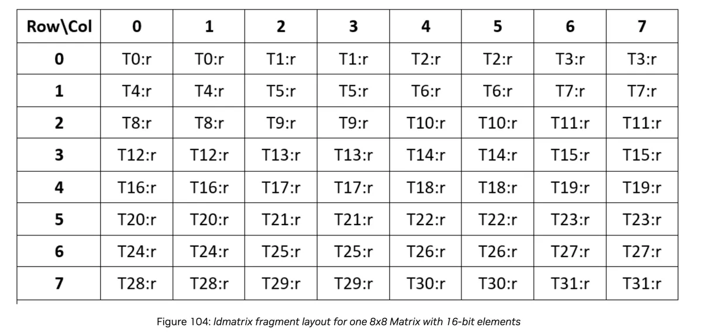

> 이 글은 @Simon V(https://github.com/simveit)의 허가를 받아 전재·번역해 이 계정에 게시한 것이다. 원문 주소: https://veitner.bearblog.dev/load-and-store-matrices-efficently-with-ptx-instructions/

> 이 글의 실험 CUDA code: https://github.com/simveit/load_and_store

# PTX instruction으로 matrix를 더 효율적으로 load/store하기

2025년 5월 14일

## `ldmatrix`

PTX 문서(https://docs.nvidia.com/cuda/parallel-thread-execution/#warp-level-matrix-instructions-ldmatrix)를 보면 `ldmatrix`는 shared memory에서 하나 또는 여러 matrix를 collective하게 load해 `mma` instruction에서 사용할 수 있게 하는 instruction이다.

instruction format은 다음과 같다.

```
ldmatrix.sync.aligned.shape.num{.trans}{.ss}.type r, [p];

ldmatrix.sync.aligned.m8n16.num{.ss}.dst_fmt.src_fmt        r, [p];
ldmatrix.sync.aligned.m16n16.num.trans{.ss}.dst_fmt.src_fmt r, [p];

.shape   = {.m8n8, .m16n16};
.num     = {.x1, .x2, .x4};
.ss      = {.shared{::cta}};
.type    = {.b16, .b8};
.dst_fmt = { .b8x16 };
.src_fmt = { .b6x16_p32, .b4x16_p64 };
```

이 instruction은 `.shared` space에서 하나 또는 여러 matrix를 register로 collective load한다.

- `p`: `.shared` space 안의 address operand
- `r`: destination register
- `shape`: load할 matrix shape
- `num`: matrix 1개, 2개, 또는 4개를 load

가능한 data type은 다음과 같다.

|**.shape**| 	**matrix shape**| 	**element size**|
|:---:|:---:|:---:|
|`.m8n8`| 	8x8| 	16-bit|
|`.m16n16`| 	16x16| 	8-bit 또는 6-bit 또는 4-bit|
|`.m8n16`| 	8x16| 	6-bit or 4-bit|

현재는 `sm_100` 이상 GPU만 `m16n16`과 `m8n16` shape를 지원한다. 나는 지금 접근 권한이 없으므로 `m8n8` instruction에 집중한다.

아래 표는 각 thread group이 어떤 matrix를 담당하는지 보여준다. 각 address는 matrix 안의 한 row에 대응한다. 각 “thread group”, 즉 0-7, 8-15, 16-23, 24-31이 별도 matrix 하나를 load한다. 연속 row는 memory에서도 연속으로 저장되어 있어야 한다.

|**.num**| 	**Threads 0-7**| 	**Threads 8-15**| 	**Threads 16-23**| 	**Threads 24-31**|
|:---:|:---:|:---:|:---:|:---:|
|`.x1`| 	addr0-addr7| 	-| 	-| 	-|
|`.x2`| 	addr0-addr7| 	addr8-addr15| 	-| 	-|
|`.x4`| 	addr0-addr7| 	addr8-addr15| 	addr16-addr23| 	addr24-addr31|

아래 그림은 `ldmatrix`로 load한 `8x8` matrix의 fragment layout을 보여준다.



```shell
// Load one 8x8 matrix using a 64-bit address.
.reg .b64 addr;
.reg .b32 d;
ldmatrix.sync.aligned.m8n8.x1.shared::cta.b16 {d}, [addr];

// Load two 8x8 matrices in column-major format.
.reg .b64 addr;
.reg .b32 d<2>;
ldmatrix.sync.aligned.m8n8.x2.trans.shared.b16 {d0, d1}, [addr];

// Load four 8x8 matrices.
.reg .b64 addr;
.reg .b32 d<4>;
ldmatrix.sync.aligned.m8n8.x4.b16 {d0, d1, d2, d3}, [addr];
```

## 구현

위에서 말했듯 pointer는 `.shared` space에 있어야 한다. generic pointer를 `.shared` space로 변환하는 방법은 여러 가지다. 가장 간단한 방법은 다음과 같다(https://forums.developer.nvidia.com/t/problem-about-ptx-instruction-cp-async-ca-shared-global/224219/2).

```c++
size_t asl = __cvta_generic_to_shared(smem+threadIdx.x);
```

inline assembly도 사용할 수 있다.

```c++
asm volatile(".reg .u64 smem_ptr64; cvta.to.shared.u64 smem_ptr64, %0;\n" :: "l"(smem+threadIdx.x));
```

또는 이렇게도 쓸 수 있다.

```c++
asm volatile(".reg .u64 smem_ptr64; cvta.to.shared.u64 smem_ptr64, %0;\n" :: "l"(smem+threadIdx.x)); 
asm volatile(".reg .u32 smem_ptr32; cvt.u32.u64 smem_ptr32, smem_ptr64;\n" ::);
```

CUTLASS library(https://github.com/NVIDIA/cutlass/blob/ad7b2f5e84fcfa124cb02b91d5bd26d238c0459e/include/cute/arch/copy_sm75.hpp#L39)를 참고해 구현 아이디어를 얻을 수도 있다.

여기부터 구현은 비교적 직접적이다.

```c++
#include <cstdint>
#include <iostream>

// Device-side inline function that loads an 8x8 matrix from shared memory.
// d0: output parameter storing loaded data
// address: input address in shared memory
__device__ __forceinline__ void ldmatrix_sync_aligned_m8n8_x1_b16(
    uint32_t &d0, const uint32_t &address) {
  // Inline PTX instruction for matrix load.
  // ldmatrix.sync.aligned.m8n8.x1.shared.b16: synchronously load an 8x8 matrix, 16 bits per element.
  // {%0}: output register storing loaded data
  // [%1]: input register specifying shared-memory address
  asm volatile("ldmatrix.sync.aligned.m8n8.x1.shared.b16 {%0}, [%1];"
               : "=r"(d0)
               : "r"(address));
}

// CUDA kernel demonstrating matrix load.
__global__ void ldmatrix(uint16_t *value) {
  // Shared memory size.
  constexpr int N = 64;
  // Shared memory array.
  __shared__ uint16_t smem[N];
  // Current thread ID.
  auto tid = threadIdx.x;

  // Row offset: threads 0-7 must correspond to addresses of the first 8 rows.
  const uint32_t offset_rows = sizeof(uint16_t) * (tid % 8) * 8;
  // Final address: shared-memory base + row offset.
  const uint32_t address = __cvta_generic_to_shared(smem) + offset_rows;

  // Initialize shared memory.
  for (uint32_t i = tid; i < N; i += blockDim.x) {
    smem[i] = i;
  }
  // Synchronize all threads to ensure shared memory initialization is complete.
  __syncthreads();

  // Variable for loaded data.
  uint32_t frag;
  // Call matrix load function.
  ldmatrix_sync_aligned_m8n8_x1_b16(frag, address);

  // Synchronize again to ensure all threads have completed loading.
  __syncthreads();

  // Extract two 16-bit values from the 32-bit data.
  uint16_t number1 = static_cast<uint16_t>(frag & 0xFFFF);
  uint16_t number2 = static_cast<uint16_t>((frag >> 16) & 0xFFFF);
  // Print result.
  printf("%d -> %d  %d   %d   \n", tid, (int)(smem[2 * tid]), (int)number1,
         (int)number2);
}

// Main function.
int main() {
  // Device pointer.
  uint16_t *d_value;
  // Allocate device memory.
  cudaMalloc(&d_value, sizeof(uint16_t));
  // Launch kernel with one block and 32 threads.
  ldmatrix<<<1, 32>>>(d_value);
  // Wait for device completion.
  cudaDeviceSynchronize();
  // Free device memory.
  cudaFree(d_value);
  return 0;
}
```

위 표에 따르면 thread 0-7은 첫 8 row의 address에 대응해야 한다.

```c++
const uint32_t offset_rows = sizeof(uint16_t) * (tid % 8) * 8;
const uint32_t address = __cvta_generic_to_shared(smem) + offset_rows;
```

load할 때 address와 fragment를 전달한다. 각 fragment는 `32bit`이며, 먼저 full 16-bit mask로 뒤쪽 16 bits를 추출하고, 그 다음 right shift 후 같은 operation을 다시 수행해 앞쪽 16 bits를 추출하면 loaded fragment를 출력할 수 있다.

```shell
0 -> 0  0   1   
1 -> 2  2   3   
2 -> 4  4   5   
3 -> 6  6   7   
4 -> 8  8   9   
5 -> 10  10   11   
6 -> 12  12   13   
7 -> 14  14   15   
8 -> 16  16   17   
9 -> 18  18   19   
10 -> 20  20   21   
11 -> 22  22   23   
12 -> 24  24   25   
13 -> 26  26   27   
14 -> 28  28   29   
15 -> 30  30   31   
16 -> 32  32   33   
17 -> 34  34   35   
18 -> 36  36   37   
19 -> 38  38   39   
20 -> 40  40   41   
21 -> 42  42   43   
22 -> 44  44   45   
23 -> 46  46   47   
24 -> 48  48   49   
25 -> 50  50   51   
26 -> 52  52   53   
27 -> 54  54   55   
28 -> 56  56   57   
29 -> 58  58   59   
30 -> 60  60   61   
31 -> 62  62   63
```

각 register가 두 값을 포함한다는 것을 볼 수 있다.

warp 하나에서 matrix 두 개를 동시에 write할 수 있다. address가 thread group별로 제공된다는 점을 고려해야 한다.

|**.num**| 	**Threads 0-7**| 	**Threads 8-15**| 	**Threads 16-23**| 	**Threads 24-31**|
|:---:|:---:|:---:|:---:|:---:|
|.x1| 	addr0-addr7| 	-| 	-| 	-|
|.x2| 	addr0-addr7| 	addr8-addr15| 	-| 	-|
|.x4| 	addr0-addr7| 	addr8-addr15| 	addr16-addr23| 	addr24-addr31|

`x2`를 사용하는 `ldmatrix` syntax는 다음과 같다.

```c++
__device__ __forceinline__ void ldmatrix_sync_aligned_m8n8_x2_b16(
    uint32_t &d0, uint32_t &d1, const uint32_t &address) {
  asm volatile("ldmatrix.sync.aligned.m8n8.x2.shared.b16 {%0, %1}, [%2];"
               : "=r"(d0), "=r"(d1)
               : "r"(address));
}
```

이제 `32bit` fragment에 write한다는 점에 주의한다.

이를 kernel로 감쌀 수 있다.

```c++
__global__ void ldmatrix(uint16_t *value) {
  constexpr int N = 64;
  __shared__ uint16_t smem[2 * N];
  auto tid = threadIdx.x;

  const uint32_t offset_rows = sizeof(uint16_t) * (tid % 8) * 8;
  const uint32_t offset_matrix = sizeof(uint16_t) * ((tid / 8) % 2) * 64;
  const uint32_t offset = offset_rows + offset_matrix;
  const uint32_t address = __cvta_generic_to_shared(smem) + offset;

  for (uint32_t i = tid; i < N; i += blockDim.x) {
    smem[i] = i;
    smem[i + 64] = i + 64;
  }
  __syncthreads();

  uint32_t frag1;
  uint32_t frag2;
  ldmatrix_sync_aligned_m8n8_x2_b16(frag1, frag2, address);

  __syncthreads();

  uint16_t number1 = static_cast<uint16_t>(frag1 & 0xFFFF);
  uint16_t number2 = static_cast<uint16_t>((frag1 >> 16) & 0xFFFF);
  printf("%d -> %d  %d   %d   \n", tid, (int)(smem[2 * tid]), (int)number1,
         (int)number2);
}
```

address 계산 logic은 다음과 같다.

```c++
const uint32_t offset_rows = sizeof(uint16_t) * (tid % 8) * 8;
const uint32_t offset_matrix = sizeof(uint16_t) * ((tid / 8) % 2) * 64;
const uint32_t offset = offset_rows + offset_matrix;
const uint32_t address = __cvta_generic_to_shared(smem) + offset;
```

row offset과 matrix offset을 계산해야 한다. 첫 8개 thread가 첫 번째 matrix의 address를 제공한다. 다음 8개 thread는 두 번째 matrix의 address를 제공한다.

매우 비슷하게 `8x8` matrix 네 개도 load할 수 있다. syntax는 다음과 같다.

```c++
__device__ __forceinline__ void ldmatrix_sync_aligned_m8n8_x2_b16(
    uint32_t &d0, uint32_t &d1, uint32_t &d2, uint32_t &d3,
    const uint32_t &address) {
  asm volatile(
      "ldmatrix.sync.aligned.m8n8.x4.shared.b16 {%0, %1, %2, %3}, [%4];"
      : "=r"(d0), "=r"(d1), "=r"(d2), "=r"(d3)
      : "r"(address));
}
```

전체 kernel은 다음과 같다.

```c++
__global__ void ldmatrix(uint16_t *value) {
  constexpr int N = 64;
  __shared__ uint16_t smem[4 * N];
  auto tid = threadIdx.x;

  const uint32_t offset_rows = sizeof(uint16_t) * (tid % 8) * 8;
  const uint32_t offset_matrix = sizeof(uint16_t) * ((tid / 8) % 4) * 64;
  const uint32_t offset = offset_rows + offset_matrix;
  const uint32_t address = __cvta_generic_to_shared(smem) + offset;

  for (uint32_t i = tid; i < N; i += blockDim.x) {
    smem[i] = i;
    smem[i + 64] = i + 64;
    smem[i + 128] = i + 128;
    smem[i + 192] = i + 192;
  }
  __syncthreads();

  uint32_t frag1;
  uint32_t frag2;
  uint32_t frag3;
  uint32_t frag4;
  ldmatrix_sync_aligned_m8n8_x2_b16(frag1, frag2, frag3, frag4, address);

  __syncthreads();

  uint16_t number1 = static_cast<uint16_t>(frag1 & 0xFFFF);
  uint16_t number2 = static_cast<uint16_t>((frag1 >> 16) & 0xFFFF);
  printf("%d -> %d  %d   %d   \n", tid, (int)(smem[2 * tid]), (int)number1,
         (int)number2);
  uint16_t number3 = static_cast<uint16_t>(frag2 & 0xFFFF);
  uint16_t number4 = static_cast<uint16_t>((frag2 >> 16) & 0xFFFF);
  printf("%d -> %d  %d   %d   \n", tid, (int)(smem[2 * tid + 64]), (int)number3,
         (int)number4);
  uint16_t number5 = static_cast<uint16_t>(frag3 & 0xFFFF);
  uint16_t number6 = static_cast<uint16_t>((frag3 >> 16) & 0xFFFF);
  printf("%d -> %d  %d   %d   \n", tid, (int)(smem[2 * tid + 128]),
         (int)number5, (int)number6);
  uint16_t number7 = static_cast<uint16_t>(frag4 & 0xFFFF);
  uint16_t number8 = static_cast<uint16_t>((frag4 >> 16) & 0xFFFF);
  printf("%d -> %d  %d   %d   \n", tid, (int)(smem[2 * tid + 192]),
         (int)number7, (int)number8);
}
```

address 계산은 비슷하다. 다시 thread group 8개가 있고, 각 thread group은 matrix 4개의 8 row address를 제공한다. 따라서 warp 안의 총 `32`개 thread가 address를 제공한다.

```c++
const uint32_t offset_rows = sizeof(uint16_t) * (tid % 8) * 8;
const uint32_t offset_matrix = sizeof(uint16_t) * ((tid / 8) % 4) * 64;
const uint32_t offset = offset_rows + offset_matrix;
const uint32_t address = __cvta_generic_to_shared(smem) + offset;
```

각 kernel은 다음처럼 호출할 수 있다.

```c++
int main() {
  uint16_t *d_value;
  cudaMalloc(&d_value, sizeof(uint16_t));
  ldmatrix<<<1, 32>>>(d_value);
  cudaDeviceSynchronize();
  cudaFree(d_value);
  return 0;
}
```

## stmatrix

`stmatrix`는 하나 또는 여러 matrix를 shared memory에 collective store하기 위한 PTX instruction이다.

```c++
stmatrix.sync.aligned.shape.num{.trans}{.ss}.type [p], r;

.shape  = {.m8n8, .m16n8};
.num    = {.x1, .x2, .x4};
.ss     = {.shared{::cta}};
.type   = {.b16, .b8};
```

보이는 것처럼 instruction은 `ldmatrix`와 비슷하다. `.m8n8`은 Hopper에서 사용할 수 있고, `m16n8`은 Blackwell GPU에서 사용할 수 있다.

address 제공 방식은 위와 같다. 이번에는 register(s)의 content를 어디에 store할지 알려주는 address를 제공한다.

|**.num**|**Threads 0-7**|**Threads 8-15**|**Threads 16-23**|**Threads 24-31**|
|--------|-----------|------------|-------------|--------------|
|`.x1`|addr0-addr7|-|-|-|
|`.x2`|addr0-addr7|addr8-addr15|-|-| 
|`.x4`|addr0-addr7|addr8-addr15|addr16-addr23|addr24-addr31|

### 구현

위의 `ldmatrix` instruction을 정확히 이해했다면 구현은 어렵지 않다. 계속 읽기 전에 위 code를 이해했는지 확인하는 것이 좋다.

아래 code는 간단한 PTX instruction wrapper를 제공하고 `8x8` matrix 하나를 store한다.

```c++
__device__ __forceinline__ void stmatrix_sync_aligned_m8n8_x1_b16(
    uint32_t &d0, const uint32_t &address) {
  asm volatile(
      "stmatrix.sync.aligned.x1.m8n8.shared.b16 [%0], {%1};\n" ::"r"(address),
      "r"(d0));
}
```

이를 kernel로 감쌀 수 있다.

```c++
__global__ void stmatrix(uint16_t *value) {
  constexpr int N = 64;
  __shared__ uint16_t smem[N];
  auto tid = threadIdx.x;

  const uint32_t offset_rows = sizeof(uint16_t) * (tid % 8) * 8;
  const uint32_t address = __cvta_generic_to_shared(smem) + offset_rows;

  uint32_t frag = 0x00000000;
  frag |= (tid * 2 + 0);
  frag |= (tid * 2 + 1) << 16;
  __syncthreads();

  stmatrix_sync_aligned_m8n8_x1_b16(frag, address);

  __syncthreads();

  uint16_t number1 = static_cast<uint16_t>(frag & 0xFFFF);
  uint16_t number2 = static_cast<uint16_t>((frag >> 16) & 0xFFFF);
  printf("%d -> %d  %d   %d   \n", tid, (int)(smem[2 * tid]), (int)number1,
         (int)number2);
}
```

대부분의 code는 위와 비슷하다. 다만 이번에는 fragment를 정의하고 shared memory의 address에 저장한다.

아래 code는 32-bit unsigned integer를 초기화한다. 먼저 앞쪽 16 bits를 `2 * tid + 0`으로 초기화하고, 뒤쪽 16 bits를 `2 * tid + 1`로 초기화한다. 이는 `ldmatrix` example과 같은 결과를 맞추기 위한 것이다.

```c++
uint32_t frag = 0x00000000;
frag |= (tid * 2 + 0);
frag |= (tid * 2 + 1) << 16;
```

fragment를 주어진 address에 store한다. 출력은 다음과 같다.

```shell
0 -> 0  0   1   
1 -> 2  2   3   
2 -> 4  4   5   
3 -> 6  6   7   
4 -> 8  8   9   
5 -> 10  10   11   
6 -> 12  12   13   
7 -> 14  14   15   
8 -> 16  16   17   
9 -> 18  18   19   
10 -> 20  20   21   
11 -> 22  22   23   
12 -> 24  24   25   
13 -> 26  26   27   
14 -> 28  28   29   
15 -> 30  30   31   
16 -> 32  32   33   
17 -> 34  34   35   
18 -> 36  36   37   
19 -> 38  38   39   
20 -> 40  40   41   
21 -> 42  42   43   
22 -> 44  44   45   
23 -> 46  46   47   
24 -> 48  48   49   
25 -> 50  50   51   
26 -> 52  52   53   
27 -> 54  54   55   
28 -> 56  56   57   
29 -> 58  58   59   
30 -> 60  60   61   
31 -> 62  62   63   
```

이는 우리의 구현이 위 `ldmatrix` operation의 반대 동작임을 확인해준다.

matrix 2개 또는 4개에 store하는 구현도 매우 비슷하다.

```c++
__device__ __forceinline__ void stmatrix_sync_aligned_m8n8_x2_b16(
    uint32_t &d0, uint32_t &d1, const uint32_t &address) {
  asm volatile(
      "stmatrix.sync.aligned.m8n8.x2.shared.b16 [%0], {%1, %2};" ::"r"(address),
      "r"(d0), "r"(d1));
}

// CUDA kernel demonstrating matrix store.
__global__ void stmatrix(uint16_t *value) {
  // Shared memory size.
  constexpr int N = 64;
  // Shared memory array, sized 2*N to store two matrices.
  __shared__ uint16_t smem[2 * N];
  // Current thread ID.
  auto tid = threadIdx.x;

  // Row offset: each thread is responsible for 8 elements, so multiply by 8.
  const uint32_t offset_rows = sizeof(uint16_t) * (tid % 8) * 8;
  // Matrix offset: select first or second matrix according to thread group (0-7 or 8-15).
  const uint32_t offset_matrix = sizeof(uint16_t) * ((tid / 8) % 2) * 64;
  // Total offset.
  const uint32_t offset = offset_rows + offset_matrix;
  // Final address: shared-memory base + total offset.
  const uint32_t address = __cvta_generic_to_shared(smem) + offset;

  // Initialize first data fragment.
  uint32_t frag1 = 0x00000000;
  // Set low 16 bits to 2*tid.
  frag1 |= (tid * 2 + 0);
  // Set high 16 bits to 2*tid+1.
  frag1 |= (tid * 2 + 1) << 16;
  
  // Initialize second data fragment.
  uint32_t frag2 = 0x00000000;
  // Set low 16 bits to 2*tid+64.
  frag2 |= (tid * 2 + 0 + 64);
  // Set high 16 bits to 2*tid+65.
  frag2 |= (tid * 2 + 1 + 64) << 16;
  
  // Synchronize all threads and ensure data is ready.
  __syncthreads();

  // Call matrix store function and write two fragments into shared memory.
  stmatrix_sync_aligned_m8n8_x2_b16(frag1, frag2, address);

  // Synchronize again to ensure all threads have completed store.
  __syncthreads();

  // Extract two 16-bit values from the first 32-bit fragment.
  uint16_t number1 = static_cast<uint16_t>(frag1 & 0xFFFF);
  uint16_t number2 = static_cast<uint16_t>((frag1 >> 16) & 0xFFFF);
  // Print result for the first matrix.
  printf("%d -> %d  %d   %d   \n", tid, (int)(smem[2 * tid]), (int)number1,
         (int)number2);
         
  // Extract two 16-bit values from the second 32-bit fragment.
  uint16_t number3 = static_cast<uint16_t>(frag2 & 0xFFFF);
  uint16_t number4 = static_cast<uint16_t>((frag2 >> 16) & 0xFFFF);
  // Print result for the second matrix.
  printf("%d -> %d  %d   %d   \n", tid, (int)(smem[2 * tid + 64]), (int)number3,
         (int)number4);
}
```

matrix 네 개의 경우:

```c++
__device__ __forceinline__ void stmatrix_sync_aligned_m8n8_x4_b16(
    uint32_t &d0, uint32_t &d1, uint32_t &d2, uint32_t &d3,
    const uint32_t &address) {
  asm volatile(
      "stmatrix.sync.aligned.m8n8.x4.shared.b16 [%0], {%1, %2, %3, %4};" ::"r"(
          address),
      "r"(d0), "r"(d1), "r"(d2), "r"(d3));
}

__global__ void stmatrix(uint16_t *value) {
  constexpr int N = 64;
  __shared__ uint16_t smem[4 * N];
  auto tid = threadIdx.x;

  const uint32_t offset_rows = sizeof(uint16_t) * (tid % 8) * 8;
  const uint32_t offset_matrix = sizeof(uint16_t) * ((tid / 8) % 4) * 64;
  const uint32_t offset = offset_rows + offset_matrix;
  const uint32_t address = __cvta_generic_to_shared(smem) + offset;

  uint32_t frag1 = 0x00000000;
  frag1 |= (tid * 2 + 0);
  frag1 |= (tid * 2 + 1) << 16;
  uint32_t frag2 = 0x00000000;
  frag2 |= (tid * 2 + 0 + 64);
  frag2 |= (tid * 2 + 1 + 64) << 16;
  uint32_t frag3 = 0x00000000;
  frag3 |= (tid * 2 + 0 + 128);
  frag3 |= (tid * 2 + 1 + 128) << 16;
  uint32_t frag4 = 0x00000000;
  frag4 |= (tid * 2 + 0 + 192);
  frag4 |= (tid * 2 + 1 + 192) << 16;
  __syncthreads();

  stmatrix_sync_aligned_m8n8_x4_b16(frag1, frag2, frag3, frag4, address);

  __syncthreads();

  uint16_t number1 = static_cast<uint16_t>(frag1 & 0xFFFF);
  uint16_t number2 = static_cast<uint16_t>((frag1 >> 16) & 0xFFFF);
  printf("%d -> %d  %d   %d   \n", tid, (int)(smem[2 * tid]), (int)number1,
         (int)number2);
  uint16_t number3 = static_cast<uint16_t>(frag2 & 0xFFFF);
  uint16_t number4 = static_cast<uint16_t>((frag2 >> 16) & 0xFFFF);
  printf("%d -> %d  %d   %d   \n", tid, (int)(smem[2 * tid + 64]), (int)number3,
         (int)number4);
  uint16_t number5 = static_cast<uint16_t>(frag3 & 0xFFFF);
  uint16_t number6 = static_cast<uint16_t>((frag3 >> 16) & 0xFFFF);
  printf("%d -> %d  %d   %d   \n", tid, (int)(smem[2 * tid + 128]),
         (int)number5, (int)number6);
  uint16_t number7 = static_cast<uint16_t>(frag4 & 0xFFFF);
  uint16_t number8 = static_cast<uint16_t>((frag4 >> 16) & 0xFFFF);
  printf("%d -> %d  %d   %d   \n", tid, (int)(smem[2 * tid + 192]),
         (int)number7, (int)number8);
}
```

해야 할 일은 더 많은 fragment를 초기화하는 것뿐이다. matrix 2개에 store할 때는 fragment 2개를 제공하고, matrix 4개에 store할 때는 fragment 4개를 제공해야 한다.

## 결론

이 글이 다음을 이해하는 데 도움이 되면 좋겠다.

- `ldmatrix`와 `stmatrix` instruction을 자세히 이해하기
- 두 instruction 사이의 symmetry를 관찰해 이해를 깊게 하기

더 알고 싶다면 PTX 문서를 참고하면 된다. 이 글에 대한 feedback을 받고 CUDA 및 관련 topic을 토론할 수 있으면 기쁘겠다. 연락하고 싶다면 LinkedIn에서 나를 추가해도 된다(https://www.linkedin.com/in/simon-veitner-174a681b6/). code는 내 repository(https://github.com/simveit/load_and_store)에서 찾을 수 있다.


