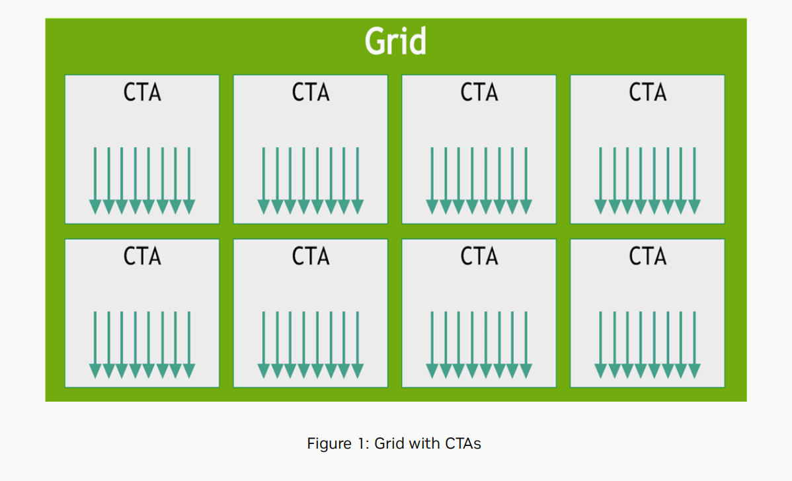
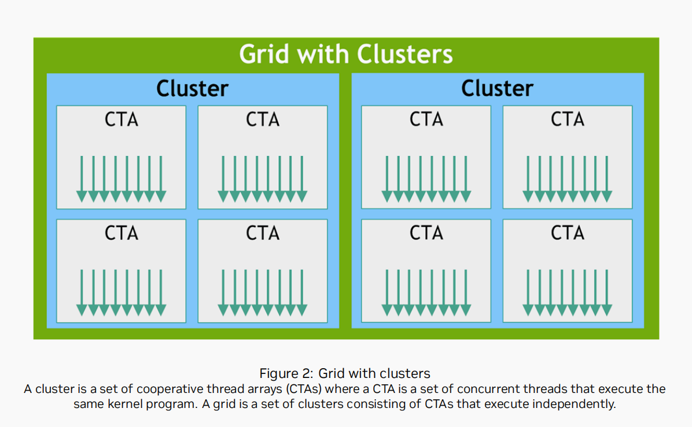
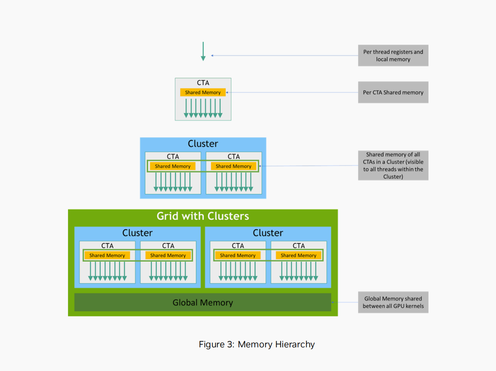
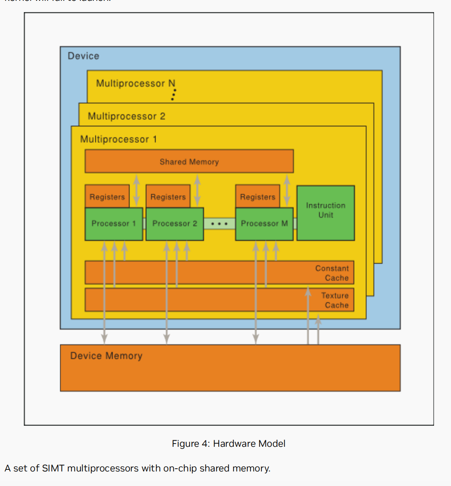
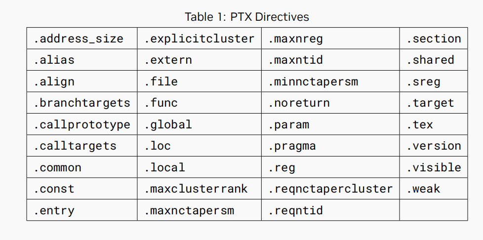
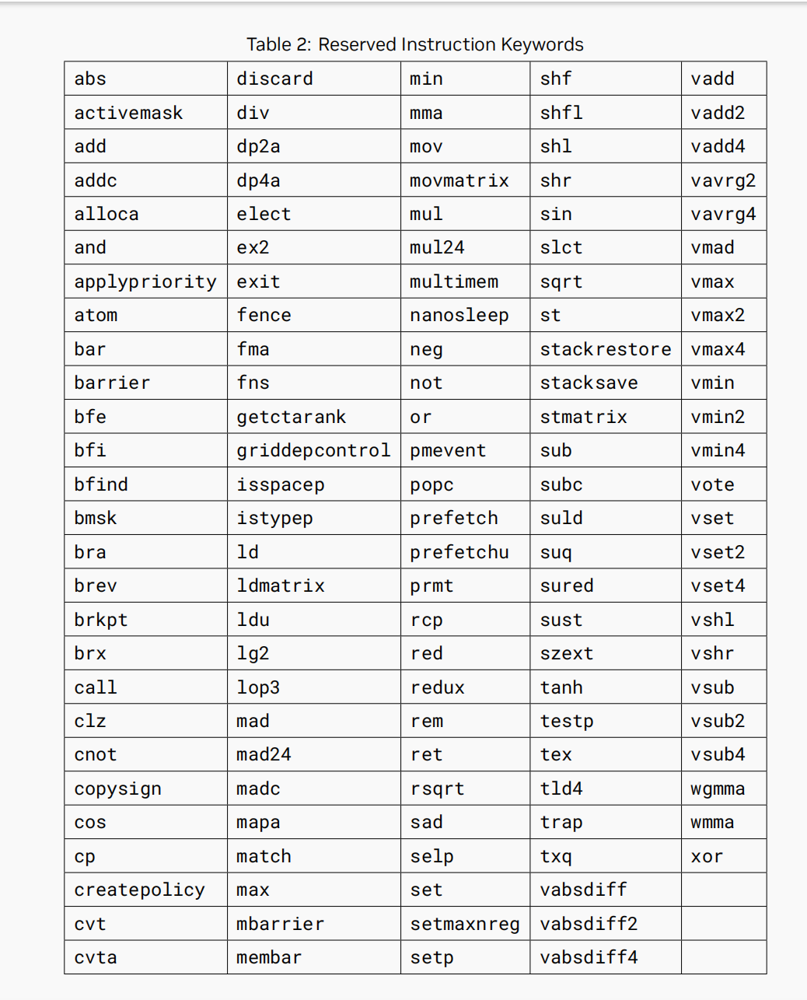
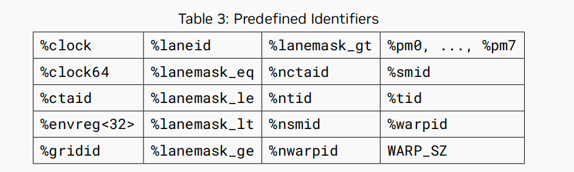

# 제1장: 소개

본 문서는 PTX, 즉 저수준 병렬 스레드 실행 가상 머신 및 명령어 집합 아키텍처(ISA)를 설명한다. PTX는 GPU를 데이터 병렬 컴퓨팅 장치로서 표현한다.

## 1.1 GPU를 이용한 확장 가능한 데이터 병렬 컴퓨팅

실시간 고화질 3D 그래픽에 대한 지속적인 시장 수요로 인해, 프로그래밍 가능한 GPU는 고도로 병렬적이고, 멀티스레드 방식이며, 멀티코어 프로세서로 발전해 왔다. 이 GPU는 막대한 연산 능력과 매우 높은 메모리 대역폭을 갖는다. GPU는 데이터 병렬 컴퓨팅으로 표현할 수 있는 문제, 즉 동일한 프로그램이 여러 데이터 요소에서 병렬로 실행되는 문제를 해결하는 데 특히 적합하다. 또한 높은 산술 강도, 즉 메모리 연산 대비 산술 연산의 비율이 높은 문제에도 적합하다. 동일한 프로그램이 각 데이터 요소에 대해 실행되므로 복잡한 흐름 제어에 대한 필요성이 낮고, 많은 데이터 요소에서 실행되고 산술 강도가 높기 때문에 메모리 접근 레이턴시를 대형 데이터 캐시 대신 계산으로 숨길 수 있다.

데이터 병렬 처리는 데이터 요소를 병렬 처리 스레드에 매핑한다. 대용량 데이터 집합을 처리하는 많은 애플리케이션은 데이터 병렬 프로그래밍 모델을 사용하여 계산을 가속할 수 있다. 3D 렌더링에서는 대량의 픽셀과 정점이 병렬 스레드에 매핑된다. 마찬가지로, 렌더링된 이미지의 후처리, 비디오 인코딩 및 디코딩, 이미지 스케일링, 스테레오 비전, 패턴 인식과 같은 이미지 및 미디어 처리 애플리케이션은 이미지 블록과 픽셀을 병렬 처리 스레드에 매핑할 수 있다. 실제로 이미지 렌더링 및 처리 분야 외의 많은 알고리즘도 데이터 병렬 처리로 가속된다. 범용 신호 처리나 물리 시뮬레이션에서 계산 금융이나 계산 생물학에 이르기까지 다양하다.

PTX는 범용 **병렬 스레드 실행**을 위한 가상 머신과 ISA를 정의한다. PTX 프로그램은 설치 시 대상 하드웨어 명령어 집합으로 변환된다. PTX-to-GPU 변환기와 드라이버를 통해 NVIDIA GPU를 프로그래밍 가능한 병렬 컴퓨터로 활용할 수 있다.

## 1.2 PTX의 목표

PTX는 범용 병렬 프로그래밍을 위한 안정적인 프로그래밍 모델과 명령어 집합을 제공한다. NVIDIA GPU에서 NVIDIA Tesla 아키텍처가 정의하는 컴퓨팅 특성을 효율적으로 지원하도록 설계되었다. CUDA 및 C/C++와 같은 고급 언어 컴파일러는 PTX 명령어를 생성하며, 이 명령어는 최적화되어 본래의 대상 아키텍처 명령어로 변환된다.

PTX의 목표는 다음과 같다.

- 여러 세대의 GPU에 걸쳐 안정적인 명령어 집합 아키텍처(ISA)를 제공한다.
- 컴파일된 애플리케이션에서 본래 GPU 성능에 필적하는 성능을 구현한다.
- C/C++ 및 기타 컴파일러에 머신 독립적인 명령어 집합 아키텍처를 제공한다.
- 애플리케이션 및 미들웨어 개발자에게 코드 배포용 명령어 집합 아키텍처를 제공한다.
- PTX를 특정 대상 머신에 매핑하는 최적화 코드 생성기 및 변환기를 위한 범용 소스 수준 명령어 집합 아키텍처를 제공한다.
- 라이브러리, 고성능 kernel, 아키텍처 테스트를 수동으로 작성하기 쉽게 한다.
- 단일 유닛에서 여러 병렬 유닛에 이르는 GPU 규모에 걸쳐 확장 가능한 프로그래밍 모델을 제공한다.

## 1.3 PTX ISA 8.5 버전

PTX ISA 8.5 버전에서 도입된 새로운 기능:
- `mma.sp::ordered_metadata` 명령어 지원이 추가되었다.

## 1.4 문서 구조

- **프로그래밍 모델**: 프로그래밍 모델 개요.
- **PTX 머신 모델**: PTX 가상 머신 모델 개요.
- **문법**: PTX 언어의 기본 문법 설명.
- **상태 공간, 타입 및 변수**: 상태 공간, 타입, 변수 선언 설명.
- **명령어 연산**: 명령어 연산 설명.
- **추상 ABI**: 함수 및 호출 문법, 호출 규약, 추상 애플리케이션 이진 인터페이스(ABI)에 대한 PTX 지원 설명.
- **명령어 집합**: 명령어 집합 설명.
- **특수 레지스터**: 특수 레지스터 목록.
- **명령어**: PTX가 지원하는 어셈블리 명령어 목록.
- 릴리스 노트: PTX ISA 2.x 이후 버전의 릴리스 노트.

## 참고 문헌

- IEEE 754-2008 부동소수점 산술 표준. ISBN 978-0-7381-5752-8, 2008년.
링크: http://ieeexplore.ieee.org/servlet/opac?punumber=4610933
- OpenCL 명세, 버전: 1.1, 문서 개정판: 44, 2011년 6월 1일.
링크: http://www.khronos.org/registry/cl/specs/opencl-1.1.pdf
- CUDA 프로그래밍 가이드.
링크: https://docs.nvidia.com/cuda/cuda-c-programming-guide/index.html
- CUDA 동적 병렬 프로그래밍 가이드.
링크: https://docs.nvidia.com/cuda/cuda-c-programming-guide/index.html#cuda-dynamic-parallelism
- CUDA 원자성 요건.
- 링크: https://nvidia.github.io/cccl/libcudacxx/extended_api/memory_model.html#atomicity
- PTX 작성자 상호 운용성 가이드.
링크: https://docs.nvidia.com/cuda/ptx-writers-guide-to-interoperability/index.html

# 제2장: 프로그래밍 모델

## 2.1 고도로 멀티스레드화된 코프로세서

GPU는 대량의 스레드를 병렬로 실행할 수 있는 컴퓨팅 장치다. 주 CPU(이른바 호스트)의 코프로세서로서 동작한다. 즉, 호스트에서 실행되는 애플리케이션 중 데이터 병렬적이고 계산 집약적인 부분은 GPU 장치로 오프로드된다.

더 정확히 말하면, 애플리케이션에서 여러 번 실행되지만 서로 독립적으로 다른 데이터에서 실행되어야 하는 부분을 kernel 함수로 분리하여, GPU에서 여러 개의 다른 스레드로 실행할 수 있다. 이를 위해 그러한 함수는 PTX 명령어 집합으로 컴파일되고, 설치 시 대상 GPU의 명령어 집합으로 변환된다.

## 2.2. 스레드 계층 구조

kernel을 실행하는 스레드 배치는 그리드로 구성된다. 그리드는 협력 스레드 배열(CTA) 또는 협력 스레드 배열 cluster로 구성되며, 이 절에서 설명하고 그림 1과 그림 2에 나타나 있다. 협력 스레드 배열(CTA)은 CUDA 스레드 블록을 구현하고, cluster는 CUDA 스레드 블록 cluster를 구현한다.

### 2.2.1. 협력 스레드 배열

병렬 스레드 실행(PTX) 프로그래밍 모델은 명시적 병렬 방식이다. PTX 프로그램은 병렬 스레드 배열 내의 특정 스레드 실행을 지정한다. 협력 스레드 배열(CTA)은 kernel을 동시에 또는 병렬로 실행하는 스레드 배열이다.

CTA 내의 스레드는 서로 통신할 수 있다. CTA 내 스레드 간 통신을 조정하기 위해 동기 지점을 지정할 수 있으며, 스레드는 이 지점에서 CTA의 모든 스레드가 도달할 때까지 대기한다.

각 스레드는 CTA 내에서 고유한 스레드 식별자를 갖는다. 프로그램은 데이터 병렬 분해를 사용하여 CTA의 스레드 간에 입력, 작업, 결과를 분배한다. 각 CTA 스레드는 스레드 식별자를 사용하여 자신의 역할을 결정하고, 특정 입력 및 출력 위치를 할당하며, 주소를 계산하고, 실행할 작업을 선택한다. 스레드 식별자는 3원소 벡터 `tid`(`tid.x`, `tid.y`, `tid.z` 요소 포함)로서, 1D, 2D 또는 3D CTA 내 스레드의 위치를 지정한다. 각 스레드 식별자 구성 요소의 범위는 0부터 해당 CTA 차원의 스레드 수까지다.

각 CTA는 3원 벡터 `ntid`(`ntid.x`, `ntid.y`, `ntid.z` 요소 포함)로 지정된 1D, 2D 또는 3D 형상을 갖는다. 벡터 `ntid`는 각 CTA 차원의 스레드 수를 지정한다.

CTA 내의 스레드는 SIMT(단일 명령, 다중 스레드) 방식으로 `warps`라는 단위로 그룹화되어 실행된다. warp는 동일한 명령을 동시에 실행하는 단일 CTA의 최대 스레드 부분집합이다. warp 내의 스레드는 순서대로 번호가 매겨진다. warp 크기는 머신에 따라 다른 상수이며, 일반적으로 하나의 warp에는 32개의 스레드가 있다. 일부 애플리케이션은 warp 크기를 파악하여 성능을 극대화할 수 있으므로, PTX는 즉시 피연산자를 허용하는 모든 명령에서 사용할 수 있는 런타임 즉시 상수 `WARP_SZ`를 포함한다.

### 2.2.2. 협력 스레드 배열의 cluster

cluster는 공유 메모리를 통해 동기화하고 통신할 수 있는 CTA 그룹으로서 동시에 또는 병렬로 실행된다. 실행 CTA는 공유 메모리를 통해 피어 CTA와 통신하기 전에 피어 CTA의 공유 메모리가 존재하는지 확인해야 하고, 피어 CTA가 공유 메모리 작업을 완료하기 전에 종료되지 않도록 해야 한다.

cluster 내 다른 CTA의 스레드는 공유 메모리를 통해 동기화하고 통신할 수 있다. cluster 범위의 barrier를 사용하여 cluster 내 모든 스레드를 동기화할 수 있다. cluster 내 각 CTA는 해당 cluster 내에서 고유한 CTA 식별자(`cluster_ctaid`)를 갖는다. 각 CTA cluster는 `cluster_nctaid` 파라미터로 지정된 1D, 2D 또는 3D 형상을 갖는다. cluster 내 각 CTA는 모든 차원에 걸쳐 고유한 CTA 식별자(`cluster_ctarank`)도 갖는다. cluster의 모든 차원에 걸친 CTA 총 수는 `cluster_nctarank`로 지정된다. 스레드는 미리 정의된 읽기 전용 특수 레지스터 `%cluster_ctaid`, `%cluster_nctaid`, `%cluster_ctarank`, `%cluster_nctarank`를 통해 이 값을 읽고 사용할 수 있다.

cluster 수준은 대상 아키텍처 sm_90 이상에만 적용된다. 시작 시 cluster 차원을 지정하는 것은 선택 사항이다. 사용자가 시작 시 cluster 차원을 지정하면 명시적 cluster 시작으로 처리되고, 그렇지 않으면 기본 차원 `1x1x1`의 암묵적 cluster 시작으로 처리된다. PTX는 읽기 전용 특수 레지스터 `%is_explicit_cluster`를 제공하여 명시적 및 암묵적 cluster 시작을 구분한다.

### 2.2.3. cluster 그리드

CTA가 포함할 수 있는 스레드 수와 cluster가 포함할 수 있는 CTA 수에는 상한이 있다. 그러나 동일한 kernel을 실행하는 CTA cluster를 cluster 그리드로 묶을 수 있어, 단일 kernel 호출로 시작할 수 있는 총 스레드 수가 매우 많아진다. 그 대가로 스레드 간 통신 및 동기화 능력이 줄어드는데, 서로 다른 cluster의 스레드는 통신하거나 동기화할 수 없다.

cluster 그리드에서 각 cluster는 고유한 cluster 식별자(`clusterid`)를 갖는다. 각 cluster 그리드는 `nclusterid` 파라미터로 1D, 2D 또는 3D 형상을 지정한다. 각 그리드는 또한 고유한 시간 식별자(`gridid`)를 갖는다. 스레드는 미리 정의된 읽기 전용 특수 레지스터 `%tid`, `%ntid`, `%clusterid`, `%nclusterid`, `%gridid`를 통해 이 값을 읽고 사용할 수 있다.

그리드 내에서 각 CTA는 고유한 식별자(`ctaid`)를 갖는다. 각 CTA 그리드는 `nctaid` 파라미터로 1D, 2D 또는 3D 형상을 지정한다. 스레드는 미리 정의된 읽기 전용 특수 레지스터 `%ctaid`와 `%nctaid`를 통해 이 값을 사용하고 읽을 수 있다.

각 kernel은 CTA로 구성된 cluster 그리드 형태의 스레드 배치로 실행된다. 여기서 cluster는 선택적 수준으로 sm_90 이상의 대상 아키텍처에만 적용된다. 그림 1은 CTA로 구성된 그리드를, 그림 2는 cluster로 구성된 그리드를 나타낸다.

그리드는 서로 의존 관계를 가질 수 있다. 한 그리드는 의존 그리드이거나 선행 조건 그리드일 수 있다. 그리드 의존 관계를 정의하는 방법은 《CUDA 프로그래밍 가이드》의 CUDA Graph 섹션을 참조한다.





## 2.3. 메모리 계층 구조

PTX 스레드는 실행 중에 그림 3과 같이 여러 상태 공간의 데이터에 접근할 수 있다. cluster 수준은 대상 아키텍처 sm_90부터 도입되었다. 각 스레드는 개인 로컬 메모리를 갖는다. 각 스레드 블록(CTA)은 공유 메모리를 하나 갖는데, 해당 블록 내 모든 스레드와 cluster 내 모든 활성 블록에 가시적이며 블록과 동일한 수명을 갖는다. 마지막으로, 모든 스레드는 동일한 전역 메모리에 접근할 수 있다.



모든 스레드는 다른 상태 공간에도 접근할 수 있다: 상수, 파라미터, 텍스처, 표면 상태 공간. 상수 메모리와 텍스처 메모리는 읽기 전용이며, 표면 메모리는 읽기와 쓰기 모두 가능하다. 전역, 상수, 파라미터, 텍스처, 표면 상태 공간은 서로 다른 메모리 용도에 맞게 최적화되어 있다. 예를 들어, 텍스처 메모리는 서로 다른 주소 지정 모드와 특정 데이터 형식에 대한 데이터 필터링을 제공한다. 텍스처 메모리와 표면 메모리는 캐시가 적용되며, 동일한 kernel 호출 내에서 캐시는 전역 메모리 쓰기 및 표면 메모리 쓰기와 일관성이 유지되지 않는다.

따라서 동일한 kernel 호출 내에서 전역 쓰기 또는 표면 쓰기를 통해 이미 쓰인 주소에 대한 텍스처 읽기나 표면 읽기는 정의되지 않은 데이터를 반환한다.
> 이 문장의 번역이 매끄럽지 않다. 아래 바꿔 표현한 내용이 그 의미다.

**바꿔 말하면, 스레드는 해당 메모리 위치가 이전 kernel 호출이나 메모리 복사를 통해 업데이트된 경우에만 텍스처 또는 표면 메모리 위치를 안전하게 읽을 수 있다. 동일한 kernel 호출 내의 해당 스레드나 다른 스레드가 이전에 업데이트한 위치는 안전하지 않다.**

전역, 상수, 텍스처 상태 공간은 동일한 애플리케이션의 kernel 시작 사이에 지속된다. 호스트와 장치는 각각 자체 로컬 메모리를 유지하며, 이를 각각 호스트 메모리와 장치 메모리라 한다. 장치 메모리는 호스트에 의해 매핑되어 읽고 쓸 수 있으며, 더 효율적인 전송을 위해 장치의 고성능 DMA(Direct Memory Access) 엔진을 활용하는 최적화된 API 호출을 통해 호스트 메모리에서 복사할 수도 있다.

# 제3장: PTX 머신 모델

## 3.1 SIMT SM(SMs) 집합

NVIDIA GPU 아키텍처는 확장 가능한 멀티스레드 스트리밍 SM(SMs) 배열 위에 구축된다. 호스트 프로그램이 kernel 그리드를 호출하면, 그리드의 블록이 열거되어 실행 가능한 SM에 할당된다. 스레드 블록의 스레드는 하나의 SM에서 동시에 실행된다. 스레드 블록이 종료되면 새 블록이 빈 SM에서 시작된다.

SM은 여러 개의 스칼라 프로세서(SP) 코어, 멀티스레드 명령어 유닛, 온칩 공유 메모리로 구성된다. SM은 스케줄링 오버헤드 없이 하드웨어에서 동시 스레드를 생성, 관리, 실행한다. 단일 명령어 barrier 동기화를 구현한다. 빠른 barrier 동기화는 경량 스레드 생성 및 제로 오버헤드 스레드 스케줄링과 함께 매우 세밀한 병렬성을 효과적으로 지원한다. 예를 들어, 이미지의 픽셀, 볼륨의 복셀, 그리드 기반 계산의 셀 등 각 데이터 요소에 스레드를 하나씩 할당하여 문제를 저세밀도로 분해할 수 있다.

서로 다른 프로그램을 실행하는 수백 개의 스레드를 관리하기 위해, SM은 SIMT(단일 명령, 다중 스레드)라는 아키텍처를 채택한다. SM은 각 스레드를 스칼라 프로세서 코어에 매핑하며, 각 스칼라 스레드는 자체 명령어 주소와 레지스터 상태를 갖고 독립적으로 실행된다. SM의 SIMT 유닛은 `warps`라는 병렬 스레드 그룹을 생성, 관리, 스케줄링, 실행한다. (이 용어는 직조 기술에서 유래했다.) SIMT warp를 구성하는 개별 스레드는 동일한 프로그램 주소에서 시작하지만 자유롭게 분기하고 독립적으로 실행될 수 있다.

SM에 하나 이상의 스레드 블록이 실행을 위해 주어지면, SM은 이를 SIMT 유닛이 스케줄링하는 warp로 분할한다. 블록을 warp로 분할하는 방식은 항상 동일하다. 각 warp는 연속적으로 증가하는 스레드 ID를 가진 스레드를 포함하며, 첫 번째 warp는 스레드 0을 포함한다.

각 명령어 발행 시, SIMT 유닛은 실행 준비가 된 warp를 선택하고 해당 warp의 활성 스레드에 다음 명령어를 발행한다. warp는 한 번에 하나의 공통 명령어를 실행하며, warp 내 모든 스레드가 실행 경로에서 일치할 때 완전한 효율을 달성할 수 있다. warp 내 스레드가 데이터에 의존하는 조건부 분기로 분기하면, warp는 각 분기 경로를 순차적으로 실행하고 해당 경로에 없는 스레드를 비활성화한다. 모든 경로가 완료되면 스레드는 동일한 실행 경로로 수렴한다. 분기 분기는 warp 내에서만 발생하며, 서로 다른 warp는 공통 코드 경로를 실행하든 불연속 코드 경로를 실행하든 관계없이 독립적으로 실행된다.

SIMT 아키텍처는 단일 명령어가 여러 처리 요소를 제어한다는 점에서 SIMD(단일 명령, 다중 데이터) 벡터 구성과 유사하다. 핵심 차이는 SIMD 벡터 구성이 소프트웨어에 SIMD 폭을 노출하는 반면, SIMT 명령어는 단일 스레드의 실행 및 분기 동작을 지정한다는 점이다. SIMD 벡터 머신과 달리, SIMT는 프로그래머가 독립적인 스칼라 스레드 및 조정된 스레드를 위한 스레드 수준 병렬 코드를 작성할 수 있게 한다. 정확성을 보장하기 위해 프로그래머는 기본적으로 SIMT 동작을 무시할 수 있다. 그러나 warp 내 스레드가 거의 분기하지 않도록 주의하면 상당한 성능 향상을 달성할 수 있다. 실제로 이는 전통적인 코드에서 캐시 라인의 역할과 유사하다. 정확성 설계 시에는 캐시 라인 크기를 안전하게 무시할 수 있지만, 최고 성능 설계 시에는 코드 구조에서 이를 고려해야 한다. 반면 벡터 아키텍처는 소프트웨어가 부하를 벡터로 합치고 분기를 수동으로 관리하도록 요구한다.

SM이 한 번에 처리할 수 있는 블록 수는 각 스레드가 필요한 레지스터 수와 각 블록이 필요한 공유 메모리 양에 따라 다르다. SM의 레지스터와 공유 메모리는 블록 배치의 모든 스레드에 분배되기 때문이다. SM에 최소 하나의 블록을 처리하기에 충분한 레지스터나 공유 메모리가 없으면 kernel을 시작할 수 없다.



## 독립 스레드 스케줄링

Volta 아키텍처 이전에는 warp가 warp 내 32개 스레드 모두가 공유하는 단일 프로그램 카운터와 활성 마스크를 사용하여 warp 내의 활성 스레드를 지정했다. 따라서 동일한 warp의 스레드는 분기 영역이나 서로 다른 실행 상태에서 서로 신호를 보내거나 데이터를 교환할 수 없었고, 세밀한 데이터 공유가 필요한 알고리즘은 경쟁 스레드가 어떤 warp에 속하는지에 따라 교착 상태에 빠지기 쉬웠다.

Volta 아키텍처부터는 독립 스레드 스케줄링이 warp 제한 없이 스레드 간 완전한 동시성을 허용한다. 독립 스레드 스케줄링을 통해 GPU는 프로그램 카운터와 호출 스택을 포함한 각 스레드의 실행 상태를 유지하며, 실행 리소스를 더 잘 활용하거나 한 스레드가 다른 스레드가 데이터를 생성하기를 기다릴 수 있도록 스레드 단위 세밀도의 실행이 가능하다. 스케줄링 최적화기는 동일한 warp 내 활성 스레드를 SIMT 유닛으로 그룹화하는 방법을 결정한다. 이를 통해 이전 NVIDIA GPU의 SIMT 실행의 높은 처리량을 유지하면서 더 큰 유연성을 얻는다. 스레드는 이제 sub-warp 세밀도 수준에서 분기하고 수렴할 수 있다.

개발자가 이전 하드웨어 아키텍처의 warp 동기성에 대한 가정을 했다면, 독립 스레드 스케줄링으로 인해 코드 실행에 참여하는 스레드 집합이 예상과 달라질 수 있다. 특히 warp 동기 코드(예: 동기화 없는 warp 내 리덕션)는 Volta 이상 아키텍처와의 호환성을 보장하기 위해 재검토해야 한다. 자세한 내용은 CUDA 프로그래밍 가이드의 Compute Capability 7.x 섹션을 참조한다.

## 온칩 공유 메모리

그림 4에 나타난 바와 같이, 각 SM에는 네 가지 유형의 온칩 메모리가 있다.

- 프로세서당 32비트 로컬 레지스터 세트,
- 모든 스칼라 프로세서 코어가 공유하는 병렬 데이터 캐시 또는 공유 메모리(공유 메모리 공간이 위치하는 곳이기도 하다),
- 모든 스칼라 프로세서 코어가 공유하는 읽기 전용 상수 캐시(상수 메모리 공간, 즉 장치 메모리의 읽기 전용 영역에서의 읽기를 가속한다),
- 모든 스칼라 프로세서 코어가 공유하는 읽기 전용 텍스처 캐시(텍스처 메모리 공간, 즉 장치 메모리의 읽기 전용 영역에서의 읽기를 가속한다). 각 SM은 다양한 주소 지정 모드와 데이터 필터링을 구현하는 텍스처 유닛을 통해 텍스처 캐시에 접근한다.

로컬 메모리 공간과 전역 메모리 공간은 장치 메모리의 읽기/쓰기 영역이다.

# 제4장: 문법

PTX 프로그램은 텍스트 소스 모듈(파일)의 집합이다. PTX 소스 모듈은 명령어 opcode와 피연산자를 포함하는 어셈블리 언어 스타일의 문법을 사용한다. 의사 연산(pseudo-op)은 심볼 및 주소 관리를 지정한다. `ptxas` 최적화 백엔드 컴파일러는 PTX 소스 모듈을 최적화하고 어셈블하여 해당 이진 오브젝트 파일을 생성한다.

## 4.1. 소스 형식

소스 모듈은 ASCII 텍스트다. 줄은 개행 문자(\n)로 구분된다.

모든 공백 문자는 동일하다. 공백은 언어의 토큰을 구분하는 데 사용될 때를 제외하고는 무시된다.

C 전처리기 cpp를 사용하여 PTX 소스 모듈을 처리할 수 있다. #으로 시작하는 줄은 전처리기 지시어다. 다음은 일반적인 전처리기 지시어다.

`#include, #define, #if, #ifdef, #else, #endif, #line, #file`

> Harbison과 Steele의 《C 언어 참조 매뉴얼》은 C 전처리기를 잘 설명하고 있다.

PTX는 대소문자를 구분하며 키워드에는 소문자를 사용한다.

각 PTX 모듈은 PTX 언어 버전을 지정하는 .version 지시어로 시작해야 하고, 이어서 가정되는 대상 아키텍처를 지정하는 `.target` 지시어가 와야 한다. 이 지시어에 대한 자세한 내용은 PTX 모듈 지시어(이 문서의 제11장)를 참조한다.

## 4.2. 주석

PTX의 주석은 C/C++ 문법을 따른다. 여러 줄에 걸칠 수 있는 주석에는 중첩되지 않는 /* 와 */를 사용하고, 다음 개행 문자까지 이어지는 주석에는 //를 사용한다. 개행 문자는 현재 줄을 종료한다. 주석은 문자 상수, 문자열 리터럴, 또는 다른 주석 내에 나타날 수 없다.

PTX에서 주석은 공백으로 처리된다.

## 4.3 Statements(구문)

PTX Statement는 directive이거나 instruction이다. Statement는 선택적 레이블로 시작하고 세미콜론으로 끝난다.

예시:

```apache
.reg    .b32 r1, r2;
.global .f32 array[N];

start:  mov.b32  r1, %tid.x;
        shl.b32  r1, r1, 2;        // 스레드 id를 2비트 왼쪽으로 시프트
        ld.global.b32 r2, array[r1]; // thread[tid]가 array[tid]를 가져옴
        add.f32  r2, r2, 0.5;      // 1/2를 더함
```

### 4.3.1 Directive Statements

Directive 키워드는 점으로 시작하므로 사용자 정의 식별자와 충돌할 수 없다. PTX의 Directive는 표 1에 나열되어 있으며, "상태 공간, 타입 및 변수"와 "Directives" 장에서 설명한다.



### 4.3.2 Instruction Statements

Instruction은 **명령어 opcode** 뒤에 쉼표로 구분된 **0개 이상의 피연산자 목록**으로 구성되며, 세미콜론으로 끝난다. 피연산자는 레지스터 변수, 상수 표현식, 주소 표현식, 또는 레이블 이름일 수 있다. 명령어는 조건부 실행을 위한 선택적 가드 술어(guard predicate)를 가질 수 있다. 가드 술어는 선택적 레이블 뒤, opcode 앞에 오며 @p로 쓴다. 여기서 p는 술어 레지스터다. 가드 술어는 @!p로 선택적으로 부정할 수 있다.

대상 피연산자가 앞에 오고, 소스 피연산자가 뒤에 온다.

Instruction 키워드는 표 2에 나열되어 있다. 모든 Instruction 키워드는 PTX에서 예약 토큰이다.




## 4.4 식별자

사용자 정의 식별자는 확장 C++ 규칙을 따른다. 문자로 시작한 뒤 0개 이상의 문자, 숫자, 밑줄, 달러 기호가 오거나, 밑줄, 달러 기호, 퍼센트 기호로 시작한 뒤 하나 이상의 문자, 숫자, 밑줄, 달러 기호가 오는 형태다.

```apache
followsym: [a-zA-Z0-9_$]
identifier: [a-zA-Z]{followsym}* | {[_$%]{followsym}+
```

PTX는 식별자의 최대 길이를 지정하지 않으며, 모든 구현이 최소 1024자를 지원하도록 권장한다.

C 및 C++와 같은 많은 고급 언어는 유사한 식별자 명명 규칙을 따르지만 퍼센트 기호는 허용하지 않는다. PTX는 퍼센트 기호를 식별자의 첫 번째 문자로 허용한다. 퍼센트 기호는 예를 들어 사용자 정의 변수 이름과 컴파일러 생성 이름 간의 이름 충돌을 방지하는 데 사용할 수 있다.

PTX는 하나의 상수와 표 3에 나열된 퍼센트 기호로 시작하는 소수의 특수 레지스터를 미리 정의한다.



## 4.5 상수

PTX는 정수 및 부동소수점 상수와 상수 표현식을 지원한다. 이 상수는 데이터 초기화 및 명령어의 피연산자로 사용할 수 있다. 타입 검사 규칙은 정수, 부동소수점, 비트 크기 타입에 대해 동일하게 유지된다. 술어 타입의 데이터와 명령어의 경우 정수 상수가 허용되며, C 언어 방식으로 해석된다. 즉, 0은 False, 0이 아닌 값은 True다.

## 4.5.1. 정수 상수

정수 상수는 64비트 크기이며, 부호 있거나 부호 없는 값, 즉 각 정수 상수는 `.s64` 또는 `.u64` 타입을 갖는다. 부호 유무는 제산 및 순서 비교와 같이 피연산자 타입에 따라 동작이 달라지는 연산을 포함하는 상수 표현식을 올바르게 평가하기 위해 필요하다. 명령어나 데이터 초기화에 사용될 때 각 정수 상수는 데이터 또는 명령어 타입에 따라 적절한 크기로 변환된다.

정수 리터럴은 10진수, 16진수, 8진수, 2진수 표기로 쓸 수 있다. 문법은 C 언어를 따른다. 정수 리터럴 바로 뒤에 문자 U를 붙여 부호 없는 리터럴임을 나타낼 수 있다.

```shell
16진수 리터럴: 0[xX]{hexdigit}+U?
8진수 리터럴:  0(octal digit)+U?
2진수 리터럴:  0[bB]{bit}+U?
10진수 리터럴: (nonzero-digit)(digit)*U?
```

정수 리터럴은 음수가 아니며, 그 타입은 크기와 선택적 타입 접미사에 의해 다음과 같이 결정된다. 값이 `.s64`로 완전히 표현될 수 있고 부호 없는 접미사가 지정되지 않은 한 리터럴은 부호 있는(`.s64`) 것으로 처리된다. 그렇지 않은 경우 리터럴은 부호 없는(`.u64`)이다.

미리 정의된 정수 상수 `WARP_SZ`는 대상 플랫폼의 warp당 스레드 수를 지정한다. 현재까지 모든 대상 아키텍처에서 `WARP_SZ` 값은 32다.
