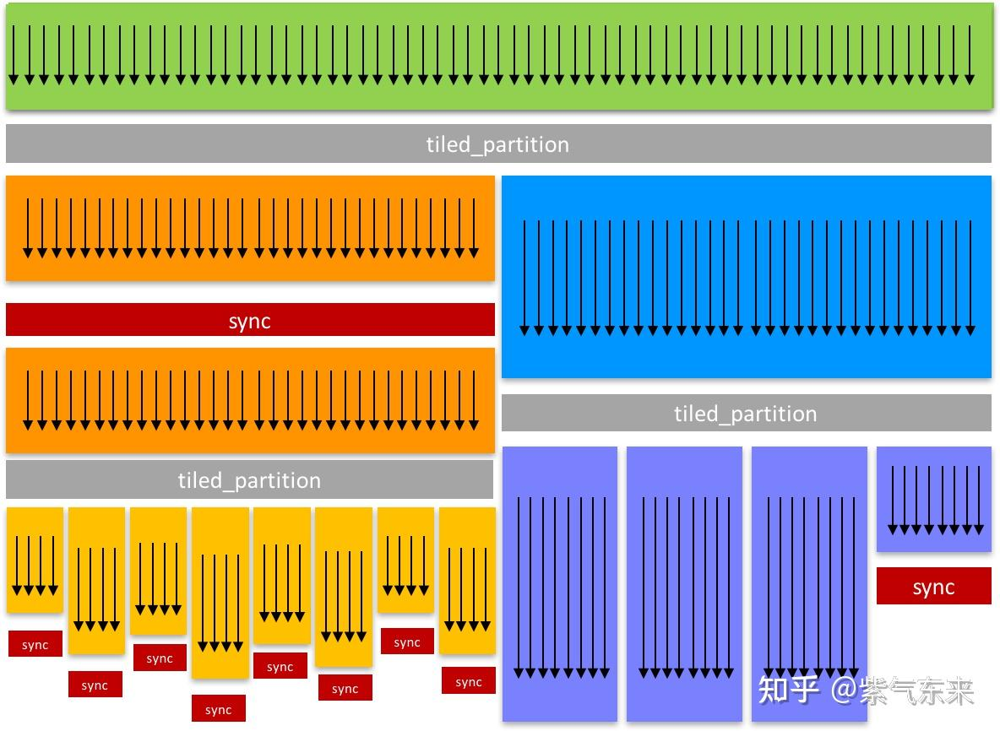
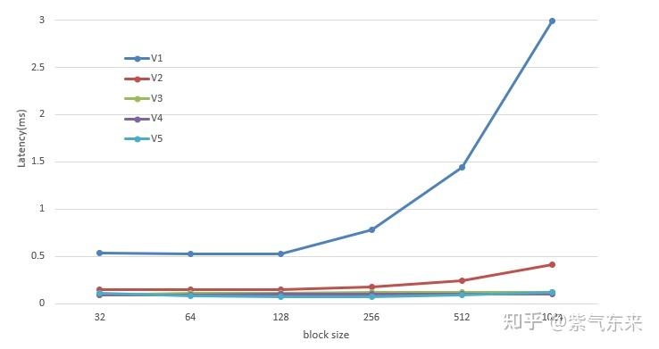

# ops(1): LayerNorm 연산자의 CUDA 구현과 최적화

> 원문: https://zhuanlan.zhihu.com/p/694974164

**목차**
- 1. LayerNorm 순전파의 구현과 최적화
  - 1.1 CPU 구현
  - 1.2 단순 CUDA 구현 (V1)
  - 1.3 share memory 활용 (V2)
  - 1.4 cooperative groups 활용 (V3)
  - 1.5 분산 계산 단순화 (V4)
  - 1.6 block 레벨 reduce (V5)
- 2. LayerNorm 역전파의 구현과 최적화
  - 2.1 역전파 그래디언트 유도
  - 2.2 CPU 구현
  - 2.3 단순 CUDA 구현 (V1)
  - 2.4 share memory + cooperative groups (V2)
- 참고 자료

## 1. LayerNorm 순전파의 구현과 최적화

Layer Normalization은 심층 신경망의 layer 간 covariate shift를 줄이고 수렴 속도를 높이는 데 목적이 있습니다.

정규화 대상 m차원 벡터를 `x`, 평균과 표준편차를 각각 `μ(x)`, `σ(x)`라 하고, LayerNorm 파라미터를 `w`, `b`라 하면, 층 정규화의 출력은:

```
y = w ⊙ (x − μ) / √(σ² + ε) + b
μ = (1/m) Σᵢ xᵢ
σ = √((1/m) Σᵢ (xᵢ − μ)²)
```

여기서 `w`, `b`는 학습 가능한 파라미터, `⊙`는 element-wise 곱입니다.

### 1.1 CPU 구현

CPU 버전 벤치마크 코드입니다. 입출력 파라미터:

```
int B, int T, int C            // 입출력 shape, 기본 8, 1024, 768
const float* inp               // 입력 x, shape [B, T, C]
float* mean, float* rstd       // 입력 x의 평균 μ, 표준편차의 역수 1/σ
                               // 무작위 초기화 후 전달, 순전파 후 채워져 역전파에서 재사용
const float* weight, const float* bias  // 학습 가능한 weight, bias
float* out                     // 출력, shape [B, T, C]
```

CPU 구현은 매우 깔끔합니다:

- 차원 C에 대해 평균과 분산 계산
- 표준편차의 역수 `rstd` 계산
- 출력 `out` 계산
- 역전파에 재사용하기 위해 `mean`, `rstd` 갱신

```cpp
// GPT-2 layernorm forward pass
void layernorm_forward_cpu(float* out, float* mean, float* rstd,
                       const float* inp, const float* weight, const float* bias,
                       int B, int T, int C) {
    float eps = 1e-5f;
    for (int b = 0; b < B; b++) {
        for (int t = 0; t < T; t++) {
            const float* x = inp + b * T * C + t * C;
            float m = 0.0f;
            for (int i = 0; i < C; i++) m += x[i];
            m = m / C;
            float v = 0.0f;
            for (int i = 0; i < C; i++) {
                float xshift = x[i] - m;
                v += xshift * xshift;
            }
            v = v / C;
            float s = 1.0f / sqrtf(v + eps);
            float* out_bt = out + b * T * C + t * C;
            for (int i = 0; i < C; i++) {
                float n = (s * (x[i] - m));
                float o = n * weight[i] + bias[i];
                out_bt[i] = o;
            }
            mean[b * T + t] = m;
            rstd[b * T + t] = s;
        }
    }
}
```

### 1.2 단순 CUDA 구현 (V1)

LayerNorm 계산은 C 차원에서 이뤄지므로 `[B, T]` 차원에서 CUDA로 병렬화할 수 있습니다. 핵심은 다음과 같으며 `block_size`는 조정 가능, `grid_size = N / block_size` 올림이어서 총 thread 수 `grid_size * block_size ≥ N`. `layernorm_forward_kernel1`의 구현은 CPU 내부 루프와 동일합니다.

```cpp
void layernorm_forward1(float* out, float* mean, float* rstd,
                           const float* inp, const float* weight, const float* bias,
                           int B, int T, int C,
                           const int block_size) {
    const int N = B * T;
    const int grid_size = ceil_div(N, block_size);
    layernorm_forward_kernel1<<<grid_size, block_size>>>(out, mean, rstd, inp, weight, bias, N, C);
    cudaCheck(cudaGetLastError());
}
```

CPU 결과와 완전히 일치합니다. block_size별 성능(2000회 평균)을 보겠습니다. LayerNorm은 연산 집약형이 아니라 IO bound이므로 대역폭 실측값이 하드웨어 활용도를 잘 보여 줍니다.

```
block_size   32 | time 0.5360 ms | bandwidth  93.90 GB/s
block_size   64 | time 0.5220 ms | bandwidth  96.41 GB/s
block_size  128 | time 0.5247 ms | bandwidth  95.93 GB/s
block_size  256 | time 0.7831 ms | bandwidth  64.27 GB/s
block_size  512 | time 1.4427 ms | bandwidth  34.89 GB/s
block_size 1024 | time 2.9885 ms | bandwidth  16.84 GB/s
```

`block_size`를 선택할 때 고려 사항:

- x, y 차원 상한 1024, z 차원 상한 64
- 가능하면 32의 배수(한 warp가 32 thread)
- **SM당 동시 실행 가능한 thread 최대 수 / SM당 동시 실행 block 최대 수**의 비율보다 작지 않아야 함. GPU occupancy를 100%로 끌어올리기 위함. V100·A100·GTX 1080 Ti에서 이 비율은 `2048 / 32 = 64`. 그래서 위 표의 최적은 64·128 부근.
- SM 최대 thread 수의 약수가 좋음. block 스케줄링은 원자적이라 block의 모든 thread가 같은 SM에서 실행됨.
- 레지스터·공유 메모리 등이 thread당 상한을 넘지 않을 것.
- **일반적으로 `block_size`는 128, 256으로 설정.**

### 1.3 share memory 활용 (V2)

V1은 global memory만 썼습니다. 평균·표준편차 계산은 전형적인 reduction이므로, 이전에 다룬 reduce 최적화를 참고해 share memory로 가속할 수 있습니다.

평균 계산 커널:

```cpp
__global__ void mean_kernel(float* mean, const float* inp, int N, int C, int block_size) {
    extern __shared__ float shared[];
    int idx = blockIdx.x;       // range [0, B*T)
    int tid = threadIdx.x;      // range [0, block_size)
    const float* x = inp + idx * C;
    // thread coarsening
    float sum = 0.0f;
    for (int i = tid; i < C; i += block_size) {
        sum += x[i];
    }
    shared[tid] = sum;
    __syncthreads();
    for (int stride = block_size / 2; stride >= 1; stride /= 2) {
        __syncthreads();
        if (tid < stride) {
            shared[tid] += shared[tid + stride];
        }
    }
    if (tid == 0) {
        mean[idx] = shared[0] / C;
    }
}
```

mean, rstd 계산이 끝나면 최종 출력을 계산:

```cpp
__global__ void normalization_kernel(float* out, const float* inp, float* mean, float* rstd,
                                     const float* weight, const float* bias, int B, int T, int C) {
    int idx = blockIdx.x * blockDim.x + threadIdx.x;

    int bt = idx / C;
    int c = idx % C;

    float m = mean[bt];
    float s = rstd[bt];
    float xi = inp[idx];
    float n = s * (xi - m);
    float o = n * weight[c] + bias[c];

    out[idx] = o;
}
```

성능. V1 대비 약 4배 향상:

```
block_size   32 | time 0.1485 ms | bandwidth 338.84 GB/s
block_size   64 | time 0.1460 ms | bandwidth 344.68 GB/s
block_size  128 | time 0.1471 ms | bandwidth 342.06 GB/s
block_size  256 | time 0.1715 ms | bandwidth 293.51 GB/s
block_size  512 | time 0.2381 ms | bandwidth 211.37 GB/s
block_size 1024 | time 0.4147 ms | bandwidth 121.35 GB/s
```

### 1.4 cooperative groups 활용 (V3)

cooperative groups의 원리·용법은 이전 글에서 다뤘으나 깊이 들어가진 않았으니, 추후 별도 글에서 다룰 예정입니다. 여기서는 `reduce` 연산만 소개합니다.

```cpp
template <typename TyArg, typename TyOp, typename TyGroup>
auto reduce(const TyGroup& group, TyArg&& val, TyOp&& op) -> decltype(op(val, val));
```

`reduce`는 그룹의 각 스레드 데이터에 대해 reduction을 수행. compute capability 80 이상에서는 산술 합, min/max, 논리 AND/OR/XOR을 하드웨어 가속.

- `group`: `coalesced_group`, `thread_block_tile` 유효
- `val`: 다음 요건을 만족하는 타입
  - `is_trivially_copyable<TyArg>::value == true`
  - `sizeof(TyArg) <= 32`
  - 주어진 함수 객체와 호환되는 산술·비교 연산자
- `op`: 정수형 타입에 대해 하드웨어 가속이 되는 함수 객체는 `plus()`, `less()`, `greater()`, `bit_and()`, `bit_xor()`, `bit_or()`. 템플릿 인자가 필요하므로 `plus<int>()` 형태. lambda 및 `operator()` 호출 가능 객체도 지원.

최종 구현:

```cpp
__global__ void layernorm_forward_kernel3(float* __restrict__ out, float* __restrict__ mean, float* __restrict__ rstd,
                                    const float*  __restrict__ inp, const float*  __restrict__ weight,
                                    const float* __restrict__ bias, int N, int C) {
    namespace cg = cooperative_groups;
    cg::thread_block block = cg::this_thread_block();
    cg::thread_block_tile<32> warp = cg::tiled_partition<32>(block);
    int idx = blockIdx.x * warp.meta_group_size() + warp.meta_group_rank();
    if(idx >= N) return;

    const float* x = inp + idx * C;

    // mean
    float sum = 0.0f;
    for (int i = warp.thread_rank(); i < C; i += warp.size()) sum += x[i];
    sum = cg::reduce(warp, sum, cg::plus<float>{});
    float m = sum / C;
    if(warp.thread_rank() == 0 && mean != nullptr) __stcs(mean + idx, m);

    // rstd
    sum = 0.0f;
    for (int i = warp.thread_rank(); i < C; i += warp.size()) {
        float diff = x[i] - m;
        sum += diff * diff;
    }
    sum = cg::reduce(warp, sum, cg::plus<float>{});
    float s = rsqrtf(sum / C + 1e-5f);
    if(warp.thread_rank() == 0 && rstd != nullptr) __stcs(rstd + idx, s);

    // final normalization
    float* o = out + idx * C;
    for (int c = warp.thread_rank(); c < C; c += warp.size()) {
        float n = s * (__ldcs(x+c) - m);
        __stcs(o+c, n * weight[c] + bias[c]);
    }
}
```

V2 대비 소폭 향상:

```
block_size   32 | time 0.0945 ms | bandwidth 532.55 GB/s
block_size   64 | time 0.1129 ms | bandwidth 445.63 GB/s
block_size  128 | time 0.1139 ms | bandwidth 442.04 GB/s
block_size  256 | time 0.1161 ms | bandwidth 433.67 GB/s
block_size  512 | time 0.1178 ms | bandwidth 427.14 GB/s
block_size 1024 | time 0.1200 ms | bandwidth 419.28 GB/s
```

### 1.5 분산 계산 단순화 (V4)

N개 확률변수 `X₁ ... Xₙ`의 평균 `μ = (1/N) Σ Xᵢ`, 분산은

```
σ² = (Σ (Xᵢ − μ)²) / N
   = (Σ Xᵢ²) / N − μ²
   = E(X²) − E(X)²
```

분산 계산을 평균 계산과 동시에 할 수 있어 중복 계산을 없앨 수 있습니다.

```python
var(x) == mean(x**2) - mean(x)**2
```

V3의 나머지를 두고 다음만 바꿉니다:

```cpp
    const float* x = inp + idx * C;

    float sum = 0.0;   // sum(x)
    float sum2 = 0.0;  // sum(x**2)
    for (int i = warp.thread_rank(); i < C; i += warp.size()) {
        float xi = x[i];
        sum += xi;
        sum2 += xi * xi;
    }
    sum = cg::reduce(warp, sum, cg::plus<float>{});
    sum2 = cg::reduce(warp, sum2, cg::plus<float>{});
    sum /= C;
    sum2 /= C;

    float m = sum;
    float var = sum2 - sum * sum;
    float s = rsqrtf(var + 1e-5f);
```

성능 더 향상:

```
block_size   32 | time 0.0904 ms | bandwidth 556.87 GB/s
block_size   64 | time 0.0956 ms | bandwidth 526.21 GB/s
block_size  128 | time 0.0957 ms | bandwidth 525.68 GB/s
block_size  256 | time 0.0959 ms | bandwidth 524.76 GB/s
block_size  512 | time 0.0962 ms | bandwidth 523.33 GB/s
block_size 1024 | time 0.0968 ms | bandwidth 519.87 GB/s
```

### 1.6 block 레벨 reduce (V5)

cooperative groups의 주요 장점은 동기화 범위를 제어할 수 있다는 점입니다.

```cpp
auto block = cg::this_thread_block();
auto warp32 = cg::tiled_partition<32>(block);
auto warp16 = cg::tiled_partition<16>(block);
auto warp8  = cg::tiled_partition< 8>(block);
auto tile8  = cg::tiled_partition<8>(warp32);
auto tile4  = cg::tiled_partition<4>(tile8);
```



share memory와 결합해 두 번의 reduce로 block reduce를 끝낼 수 있습니다.

```cpp
__global__ void layernorm_forward_kernel5(float* __restrict__ out, float* __restrict__ mean, float* __restrict__ rstd,
                                    const float*  __restrict__ inp, const float*  __restrict__ weight,
                                    const float* __restrict__ bias, int N, int C) {
    namespace cg = cooperative_groups;
    cg::thread_block block = cg::this_thread_block();
    cg::thread_block_tile<32> warp = cg::tiled_partition<32>(block);
    __shared__ float shared_sum[32];   // block_size max is 1024 = 32 * 32 warps
    __shared__ float shared_sum2[32];
    int num_warps = blockDim.x / 32;
    int warp_id = threadIdx.x / 32;
    int lane_id = threadIdx.x % 32;
    int idx = blockIdx.x;
    const float* x = inp + idx * C;
    float thread_sum = 0.0;
    float thread_sum2 = 0.0;
    for (int i = threadIdx.x; i < C; i += blockDim.x) {
        float xi = x[i];
        thread_sum += xi;
        thread_sum2 += xi * xi;
    }
    float warp_sum = cg::reduce(warp, thread_sum, cg::plus<float>{});
    float warp_sum2 = cg::reduce(warp, thread_sum2, cg::plus<float>{});
    shared_sum[warp_id] = warp_sum;
    shared_sum2[warp_id] = warp_sum2;
    __syncthreads();
    warp_sum = (lane_id < num_warps) ? shared_sum[lane_id] : 0.0f;
    warp_sum2 = (lane_id < num_warps) ? shared_sum2[lane_id] : 0.0f;
    float block_sum = cg::reduce(warp, warp_sum, cg::plus<float>{});
    float block_sum2 = cg::reduce(warp, warp_sum2, cg::plus<float>{});
    block_sum /= C;
    block_sum2 /= C;
    float m = block_sum;
    float var = block_sum2 - m * m;
    float s = rsqrtf(var + 1e-5f);
    if(threadIdx.x == 0 && mean != nullptr) __stcs(mean + idx, m);
    if(threadIdx.x == 0 && rstd != nullptr) __stcs(rstd + idx, s);
    float* o = out + idx * C;
    for (int i = threadIdx.x; i < C; i += blockDim.x) {
        float n = s * (__ldcs(x+i) - m);
        __stcs(o+i, n * weight[i] + bias[i]);
    }
}
```

성능:

```
block_size   32 | time 0.1138 ms | bandwidth 442.20 GB/s
block_size   64 | time 0.0846 ms | bandwidth 595.24 GB/s
block_size  128 | time 0.0754 ms | bandwidth 667.89 GB/s
block_size  256 | time 0.0752 ms | bandwidth 669.55 GB/s
block_size  512 | time 0.0872 ms | bandwidth 577.30 GB/s
block_size 1024 | time 0.1238 ms | bandwidth 406.53 GB/s
```

주요 성능 향상 요인은 share memory와 cooperative groups입니다.



## 2. LayerNorm 역전파의 구현과 최적화

### 2.1 역전파 그래디언트 유도

손실 `ℒ`에 대한 출력 `y`의 그래디언트가 `∂ℒ/∂y`라 하면, 역전파는 `∂ℒ/∂w`, `∂ℒ/∂b`, `∂ℒ/∂x`를 구하는 것입니다.

간단하게 `x̂ = (x − μ)/σ`로 두면 `y = w ⊙ x̂ + b`.

두 파라미터의 그래디언트는 매우 간단합니다:

```
∂ℒ/∂wᵢ = ∂ℒ/∂yᵢ · x̂ᵢ
∂ℒ/∂bᵢ = ∂ℒ/∂yᵢ
```

입력 `x`에 대한 그래디언트는:

```
∂ℒ/∂xᵢ = (1/σ) · [ ∂ℒ/∂yᵢ · wᵢ
                  − (1/m) · ( Σⱼ ∂ℒ/∂yⱼ · wⱼ
                            + x̂ᵢ · Σⱼ ∂ℒ/∂yⱼ · wⱼ · x̂ⱼ ) ]
```

유도:

```
∂ℒ/∂xᵢ = Σⱼ ∂ℒ/∂yⱼ · ∂yⱼ/∂x̂ⱼ · ∂x̂ⱼ/∂xᵢ
       = Σⱼ ∂ℒ/∂yⱼ · wⱼ · ∂x̂ⱼ/∂xᵢ
```

마지막 항을 위해 평균·표준편차의 그래디언트가 필요:

```
∂μ/∂xᵢ = 1/m
∂σ/∂xᵢ = (1/m) · σ⁻¹ · (xᵢ − μ)
```

그러면:

```
∂x̂ⱼ/∂xᵢ = (δᵢⱼ − ∂μ/∂xᵢ) · σ⁻¹  −  σ⁻² · (xⱼ − μ) · ∂σ/∂xᵢ
        = σ⁻¹ · δᵢⱼ − (1/m) · σ⁻¹ − (1/m) · σ⁻¹ · x̂ᵢ · x̂ⱼ
```

대입·정리하면 위에 적은 결과식이 나옵니다. 증명 끝.

### 2.2 CPU 구현

순전파에서 캐싱한 `mean`, `rstd`를 이용:

```cpp
void layernorm_backward_cpu(float* dinp, float* dweight, float* dbias,
                        const float* dout, const float* inp, const float* weight, const float* mean, const float* rstd,
                        int B, int T, int C) {
    for (int b = 0; b < B; b++) {
        for (int t = 0; t < T; t++) {
            const float* dout_bt = dout + b * T * C + t * C;
            const float* inp_bt = inp + b * T * C + t * C;
            float* dinp_bt = dinp + b * T * C + t * C;
            const float mean_bt = mean[b * T + t];
            const float rstd_bt = rstd[b * T + t];

            // 두 번의 reduce
            float dnorm_mean = 0.0f;
            float dnorm_norm_mean = 0.0f;
            for (int i = 0; i < C; i++) {
                float norm_bti = (inp_bt[i] - mean_bt) * rstd_bt;
                float dnorm_i = weight[i] * dout_bt[i];
                dnorm_mean += dnorm_i;
                dnorm_norm_mean += dnorm_i * norm_bti;
            }
            dnorm_mean /= C;
            dnorm_norm_mean /= C;

            for (int i = 0; i < C; i++) {
                float norm_bti = (inp_bt[i] - mean_bt) * rstd_bt;
                float dnorm_i = weight[i] * dout_bt[i];
                dbias[i] += dout_bt[i];
                dweight[i] += norm_bti * dout_bt[i];
                float dval = 0.0f;
                dval += dnorm_i;
                dval -= dnorm_mean;
                dval -= norm_bti * dnorm_norm_mean;
                dval *= rstd_bt;
                dinp_bt[i] += dval;
            }
        }
    }
}
```

### 2.3 단순 CUDA 구현 (V1)

수식 그대로 옮긴 구현. 최적화 방식은 순전파 V1과 같습니다.

```cpp
    int idx = blockIdx.x * blockDim.x + threadIdx.x;
    if (idx >= B*T) return;
    int b = idx / T;
    int t = idx % T;

    const float* dout_bt = dout + b * T * C + t * C;
    const float* inp_bt = inp + b * T * C + t * C;
    float* dinp_bt = dinp + b * T * C + t * C;
    const float mean_bt = mean[b * T + t];
    const float rstd_bt = rstd[b * T + t];

    float dnorm_mean = 0.0f;
    float dnorm_norm_mean = 0.0f;
    for (int i = 0; i < C; i++) {
        float norm_bti = (inp_bt[i] - mean_bt) * rstd_bt;
        float dnorm_i = weight[i] * dout_bt[i];
        dnorm_mean += dnorm_i;
        dnorm_norm_mean += dnorm_i * norm_bti;
    }
    dnorm_mean /= C;
    dnorm_norm_mean /= C;

    for (int i = 0; i < C; i++) {
        float norm_bti = (inp_bt[i] - mean_bt) * rstd_bt;
        float dnorm_i = weight[i] * dout_bt[i];
        atomicAdd(&dbias[i], dout_bt[i]);
        atomicAdd(&dweight[i], norm_bti * dout_bt[i]);
        float dval = 0.0f;
        dval += dnorm_i;
        dval -= dnorm_mean;
        dval -= norm_bti * dnorm_norm_mean;
        dval *= rstd_bt;
        dinp_bt[i] += dval;
    }
```

성능:

```
block_size   32 time 3.6287 ms
block_size   64 time 2.8921 ms
block_size  128 time 3.1105 ms
block_size  256 time 4.4975 ms
block_size  512 time 6.4611 ms
block_size 1024 time 7.3204 ms
```

### 2.4 share memory + cooperative groups (V2)

순전파에서 본 것처럼 share memory + cooperative groups의 성능 효과가 명확하므로 바로 적용. 여기서는 동적 share memory를 사용합니다.

```cpp
    extern __shared__ float shared[]; // size = 2 * C

    namespace cg = cooperative_groups;
    cg::thread_block block = cg::this_thread_block();
    cg::thread_block_tile<32> warp = cg::tiled_partition<32>(block);
    int idx = blockIdx.x * warp.meta_group_size() + warp.meta_group_rank();
    int N = B * T;
    if(idx >= N) return;

    int b = idx / T;
    int t = idx % T;

    const float* dout_bt = dout + b * T * C + t * C;
    const float* inp_bt  = inp + b * T * C + t * C;
    float* dinp_bt = dinp + b * T * C + t * C;
    const float mean_bt = mean[b * T + t];
    const float rstd_bt = rstd[b * T + t];

    float* dbias_shared   = shared;
    float* dweight_shared = shared + C;

    #pragma unroll
    for(int i = threadIdx.x; i < C; i += blockDim.x){
       dbias_shared[i] = 0.0f;
       dweight_shared[i] = 0.0f;
    }
    __syncthreads();

    float dnorm_mean = 0.0f;
    float dnorm_norm_mean = 0.0f;
    for (int i = warp.thread_rank(); i < C; i += warp.size()) {
        float norm_bti = (inp_bt[i] - mean_bt) * rstd_bt;
        float dnorm_i  = weight[i] * dout_bt[i];
        dnorm_mean      += dnorm_i;
        dnorm_norm_mean += dnorm_i * norm_bti;
    }
    dnorm_mean      = cg::reduce(warp, dnorm_mean,      cg::plus<float>{});
    dnorm_norm_mean = cg::reduce(warp, dnorm_norm_mean, cg::plus<float>{});
    dnorm_mean      /= C;
    dnorm_norm_mean /= C;

    for (int i = warp.thread_rank(); i < C; i += warp.size()) {
        float norm_bti = (inp_bt[i] - mean_bt) * rstd_bt;
        float dnorm_i  = weight[i] * dout_bt[i];
        atomicAdd(&dbias_shared[i],   dout_bt[i]);
        atomicAdd(&dweight_shared[i], norm_bti * dout_bt[i]);
        float dval = 0.0f;
        dval += dnorm_i;
        dval -= dnorm_mean;
        dval -= norm_bti * dnorm_norm_mean;
        dval *= rstd_bt;
        dinp_bt[i] += dval;
    }
    __syncthreads();

    for(int i = threadIdx.x; i < C; i += blockDim.x){
        atomicAdd(&dbias[i],   dbias_shared[i]);
        atomicAdd(&dweight[i], dweight_shared[i]);
    }
```

10여 배 향상:

```
block_size   32 time 0.4004 ms
block_size   64 time 0.3138 ms
block_size  128 time 0.2472 ms
block_size  256 time 0.2388 ms
block_size  512 time 0.2395 ms
block_size 1024 time 0.2405 ms
```

본 글의 LayerNorm CUDA 구현·최적화를 통해 메모리 시스템 사용과 reduce 류 전형 최적화를 체계적으로 익힐 수 있습니다.

코드는 [ifromeast/cuda_learning/04_transformer/ops](https://github.com/ifromeast/cuda_learning) 에 있으며, 주로 [karpathy/llm.c/dev/cuda](https://github.com/karpathy/llm.c/tree/master/dev/cuda) 구현을 참조했습니다.

## 참고 자료

1. https://github.com/karpathy/llm.c/blob/master/dev/cuda/layernorm_forward.cu
2. 极市开发者平台 — 컴퓨터 비전 알고리즘 개발/배포 플랫폼
3. Layer Normalization 역전파 유도
4. https://github.com/karpathy/llm.c/blob/master/dev/cuda/layernorm_backward.cu
5. OneFlow: CUDA Kernel의 grid_size, block_size를 어떻게 설정할까?
6. jhang: CUDA 입문 — Cooperative Groups (1)
7. jhang: CUDA 입문 — Cooperative Groups (2)

> 獨與天地精神往來, 而不敖倪於萬物 — 《莊子·天下》
