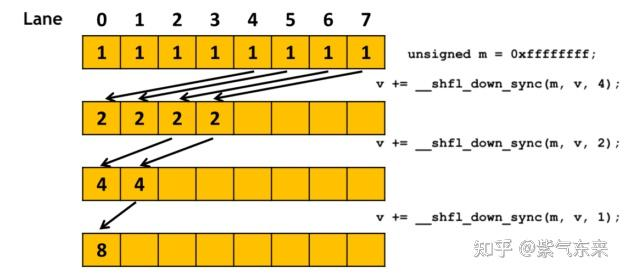
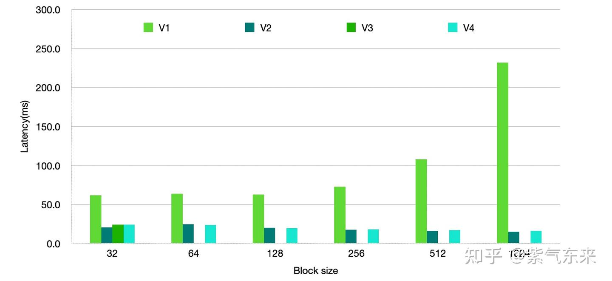
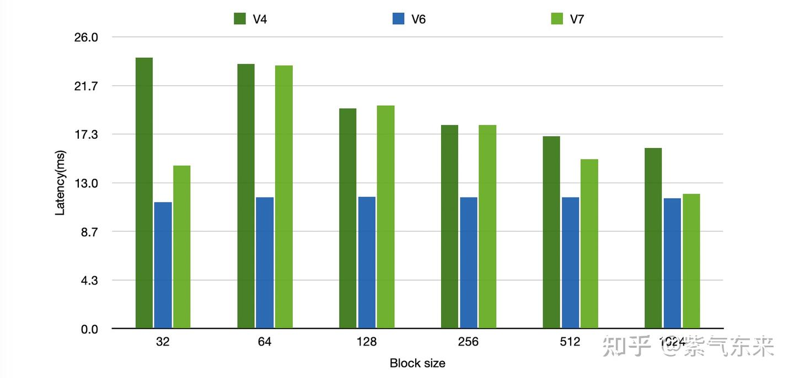

# ops(2): SoftMax 연산자의 CUDA 구현

> 원문: https://zhuanlan.zhihu.com/p/695307283

**목차**
- 1. SoftMax의 구현과 초기 최적화
  - 1.1 CPU 구현
  - 1.2 단순 CUDA 구현 (V1)
  - 1.3 동적 share memory (V2)
  - 1.4 warp 내 reduce (V3)
  - 1.5 warp reduce + share memory (V4)
- 2. SoftMax의 고급 최적화
  - 2.1 online softmax 단순 CUDA 구현 (V5)
  - 2.2 cooperative group + 구조체 (V6)
  - 2.3 share memory 활용 (V7)
- 참고 자료

## 1. SoftMax의 구현과 초기 최적화

Softmax는 기본 활성화 함수로, 수치 벡터를 확률 분포 벡터로 정규화하며 모든 확률 합은 1이 됩니다. 신경망 마지막 층에 두어 다중 클래스 분류 출력으로 쓰는 일이 많습니다.

오버플로 회피를 위해 보통 최댓값을 먼저 빼서 **safe softmax** 를 씁니다:

```
m = max(x)
Softmax(xᵢ) = exp(xᵢ − m) / Σⱼ exp(xⱼ − m)
```

Softmax는 self-attention에서 score를 만드는 핵심이고, 그중에서도 max와 sum 두 번의 reduce가 가장 중요합니다. 위 과정은 세 번의 루프로 구성됩니다.

```
for i ← 1..N: mᵢ ← max(mᵢ₋₁, xᵢ)
for i ← 1..N: sumᵢ ← sumᵢ₋₁ + exp(xᵢ − mN)
for i ← 1..N: aᵢ ← exp(xᵢ − mN) / sumN
```

유명한 FlashAttention은 softmax를 분할 반복 가능한 **online softmax** 로 바꿔 IO 횟수를 크게 줄여 성능을 끌어올렸습니다. 그 원리를 잠깐 보겠습니다.

safe softmax에선 최댓값·합 계산에 글로벌 정보가 필요한데, 글로벌 정보 없이 반복으로 등가 계산을 끝낼 수 있을까요? 두 번의 루프로 가능합니다.

```
for i ← 1..N:
    mᵢ ← max(mᵢ₋₁, xᵢ)
    sum′ᵢ ← sum′ᵢ₋₁ · exp(mᵢ₋₁ − mᵢ) + exp(xᵢ − mᵢ)
for i ← 1..N:
    aᵢ ← exp(xᵢ − mN) / sum′N
```

`sum′ᵢ`의 정당성을 잠깐 유도해 봅니다.

```
sum′ᵢ = Σⱼ≤ᵢ exp(xⱼ − mᵢ)
      = (Σⱼ≤ᵢ₋₁ exp(xⱼ − mᵢ)) + exp(xᵢ − mᵢ)
      = (Σⱼ≤ᵢ₋₁ exp(xⱼ − mᵢ₋₁)) · exp(mᵢ₋₁ − mᵢ) + exp(xᵢ − mᵢ)
      = sum′ᵢ₋₁ · exp(mᵢ₋₁ − mᵢ) + exp(xᵢ − mᵢ)
```

### 1.1 CPU 구현

safe softmax 공식 그대로. batch 한 줄당 세 번 루프.

```cpp
void softmax_forward_cpu(float* out, const float* inp, int N, int C) {
    for (int i = 0; i < N; i++) {
        const float* inp_row = inp + i * C;
        float* out_row = out + i * C;

        float maxval = -INFINITY;
        for (int j = 0; j < C; j++) {
            if (inp_row[j] > maxval) maxval = inp_row[j];
        }
        // CUDA 결과 정확도 확보를 위해 합산은 더 높은 정밀도로
        double sum = 0.0;
        for (int j = 0; j < C; j++) {
            out_row[j] = expf(inp_row[j] - maxval);
            sum += out_row[j];
        }
        float norm = 1.f / (float)sum;
        for (int j = 0; j < C; j++) out_row[j] *= norm;
    }
}
```

online softmax는 batch 한 줄당 두 번 루프:

```cpp
// "Online normalizer calculation for softmax" 논문 기반
void softmax_forward_online_cpu(float* out, const float* inp, int N, int C) {
    for (int i = 0; i < N; i++) {
        const float* inp_row = inp + i * C;
        float* out_row = out + i * C;

        float maxval = -INFINITY;
        float sum = 0.0f;
        for (int j = 0; j < C; j++) {
            float maxval_prev = maxval;
            if (inp_row[j] > maxval) {
                maxval = inp_row[j];
                sum = sum * expf(maxval_prev - maxval) + expf(inp_row[j] - maxval);
            } else {
                sum += expf(inp_row[j] - maxval);
            }
        }

        for (int j = 0; j < C; j++) out_row[j] = expf(inp_row[j] - maxval) / sum;
    }
}
```

### 1.2 단순 CUDA 구현 (V1)

safe softmax를 N 차원에서 병렬 실행, global memory 사용:

```cpp
__global__ void softmax_forward_kernel1(float* out, const float* inp, int N, int C) {
    int i = blockIdx.x * blockDim.x + threadIdx.x;
    if (i < N) {
        const float* inp_row = inp + i * C;
        float* out_row = out + i * C;

        float maxval = -INFINITY;
        for (int j = 0; j < C; j++) {
            if (inp_row[j] > maxval) maxval = inp_row[j];
        }
        double sum = 0.0;
        for (int j = 0; j < C; j++) {
            out_row[j] = expf(inp_row[j] - maxval);
            sum += out_row[j];
        }
        for (int j = 0; j < C; j++) out_row[j] /= (float)sum;
    }
}
```

성능:

```
block_size   32 | time 61.6683 ms | per token 7.53 µs
block_size   64 | time 63.7076 ms | per token 7.78 µs
block_size  128 | time 62.8906 ms | per token 7.68 µs
block_size  256 | time 72.7085 ms | per token 8.88 µs
block_size  512 | time 108.1840 ms | per token 13.21 µs
block_size 1024 | time 231.9913 ms | per token 28.32 µs
```

### 1.3 동적 share memory (V2)

흐름:

- 총 thread `N × block_size`. block 하나가 한 행(`C` 길이)을 처리.
- 각 block마다 `block_size` 길이의 공유 메모리. 각 위치엔 `C/block_size`개의 최댓값.
- 공유 메모리에서 reduce. 결과는 인덱스 0에 저장. 이로써 최댓값과 합 계산.

```cpp
__global__ void softmax_forward_kernel2(float* out, const float* inp, int N, int C) {
    extern __shared__ float shared[];
    int idx = blockIdx.x;
    int tid = threadIdx.x;
    int block_size = blockDim.x;
    const float* x = inp + idx * C;

    float maxval = -INFINITY;
    for (int i = tid; i < C; i += block_size) maxval = fmaxf(maxval, x[i]);
    shared[tid] = maxval;
    __syncthreads();
    for (int stride = block_size / 2; stride >= 1; stride /= 2) {
        __syncthreads();
        if (tid < stride) shared[tid] = fmaxf(shared[tid], shared[tid + stride]);
    }
    __syncthreads();
    float offset = shared[0];

    for (int i = tid; i < C; i += block_size) out[idx * C + i] = expf(x[i] - offset);
    __syncthreads();

    x = out + idx * C;
    float sumval = 0.0f;
    for (int i = tid; i < C; i += block_size) sumval += x[i];
    shared[tid] = sumval;
    __syncthreads();
    for (int stride = block_size / 2; stride >= 1; stride /= 2) {
        __syncthreads();
        if (tid < stride) shared[tid] += shared[tid + stride];
    }
    __syncthreads();
    float sum = shared[0];

    for (int i = tid; i < C; i += block_size) out[idx * C + i] = x[i] / sum;
}
```

성능:

```
block_size   32 | time 20.3312 ms | per token 2.48 µs
block_size   64 | time 24.4189 ms | per token 2.98 µs
block_size  128 | time 19.8712 ms | per token 2.43 µs
block_size  256 | time 17.4347 ms | per token 2.13 µs
block_size  512 | time 16.1164 ms | per token 1.97 µs
block_size 1024 | time 14.9673 ms | per token 1.83 µs
```

### 1.4 warp 내 reduce (V3)

명시적 warp 레벨 프로그래밍으로 성능을 더 끌어올립니다. 병렬 프로그램은 보통 reduction·scan 같은 집단 통신을 씁니다. 여기선 `__shfl_down_sync`를 씁니다. 이 방식은 `block_size = 32`여야 합니다.


*`__shfl_down_sync` 합산 예*

이걸 활용한 두 reduce:

```cpp
__device__ float warpReduceMax(float val) {
    for (int offset = 16; offset > 0; offset /= 2) {
        val = fmaxf(val, __shfl_down_sync(0xFFFFFFFF, val, offset));
    }
    return val;
}

__device__ float warpReduceSum(float val) {
    for (int offset = 16; offset > 0; offset /= 2) {
        val += __shfl_down_sync(0xFFFFFFFF, val, offset);
    }
    return val;
}
```

전체 softmax:

```cpp
__global__ void softmax_forward_kernel3(float* out, const float* inp, int N, int C) {
    // block size must be 32
    extern __shared__ float shared[];
    int idx = blockIdx.x;
    int tid = threadIdx.x;
    const float* x = inp + idx * C;

    float maxval = -INFINITY;
    for (int i = tid; i < C; i += blockDim.x) maxval = fmaxf(maxval, x[i]);
    maxval = warpReduceMax(maxval);
    float offset = __shfl_sync(0xFFFFFFFF, maxval, 0);

    for (int i = tid; i < C; i += blockDim.x) out[idx * C + i] = expf(x[i] - offset);

    x = out + idx * C;
    float sumval = 0.0f;
    for (int i = tid; i < C; i += blockDim.x) sumval += x[i];
    sumval = warpReduceSum(sumval);
    float sum = __shfl_sync(0xFFFFFFFF, sumval, 0);

    for (int i = tid; i < C; i += blockDim.x) out[idx * C + i] = x[i] / sum;
}
```

성능:

```
block_size   32 | time 24.1851 ms | per token 2.95 µs
```

### 1.5 warp reduce + share memory (V4)

V3 위에 share memory를 추가해 성능을 더 끌어올립니다.

```cpp
__global__ void softmax_forward_kernel4(float* out, const float* inp, int N, int C) {
    extern __shared__ float shared[];
    int idx = blockIdx.x;
    int tid = threadIdx.x;
    int warpId = threadIdx.x / 32;
    int laneId = threadIdx.x % 32;
    int warpsPerBlock = blockDim.x / 32;

    float* maxvals = shared;
    float* sumvals = &shared[warpsPerBlock];

    const float* x = inp + idx * C;

    float maxval = -INFINITY;
    for (int i = tid; i < C; i += blockDim.x) maxval = fmaxf(maxval, x[i]);
    maxval = warpReduceMax(maxval);
    if (laneId == 0) maxvals[warpId] = maxval;
    __syncthreads();
    if (tid == 0) {
        float val = maxvals[tid];
        for (int i = 1; i < warpsPerBlock; i++) val = fmaxf(val, maxvals[i]);
        maxvals[0] = val;
    }
    __syncthreads();
    float offset = maxvals[0];

    for (int i = tid; i < C; i += blockDim.x) out[idx * C + i] = expf(x[i] - offset);

    x = out + idx * C;
    float sumval = 0.0f;
    for (int i = tid; i < C; i += blockDim.x) sumval += x[i];
    sumval = warpReduceSum(sumval);
    if (laneId == 0) sumvals[warpId] = sumval;
    __syncthreads();
    if (tid == 0) {
        float val = sumvals[tid];
        for (int i = 1; i < warpsPerBlock; ++i) val += sumvals[i];
        sumvals[0] = val;
    }
    __syncthreads();
    float sum = sumvals[0];

    for (int i = tid; i < C; i += blockDim.x) out[idx * C + i] = x[i] / sum;
}
```

성능:

```
block_size   32 | time 24.1730 ms | per token 2.95 µs
block_size   64 | time 23.5763 ms | per token 2.88 µs
block_size  128 | time 19.6418 ms | per token 2.40 µs
block_size  256 | time 18.1426 ms | per token 2.21 µs
block_size  512 | time 17.1611 ms | per token 2.09 µs
block_size 1024 | time 16.1144 ms | per token 1.97 µs
```

V1~V4 비교:



## 2. SoftMax의 고급 최적화

이번 절은 online softmax 최적화에 집중합니다.

### 2.1 online softmax 단순 CUDA 구현 (V5)

원리는 CPU 버전과 동일, global memory만 사용:

```cpp
__global__ void softmax_forward_online_kernel1(float* out, const float* inp, int N, int C) {
    int i = blockIdx.x * blockDim.x + threadIdx.x;
    if (i < N) {
        const float* inp_row = inp + i * C;
        float* out_row = out + i * C;

        float maxval = -INFINITY;
        double sum = 0.0;
        for (int j = 0; j < C; j++) {
            float maxval_prev = maxval;
            if (inp_row[j] > maxval) {
                maxval = inp_row[j];
                sum = sum * expf(maxval_prev - maxval) + expf(inp_row[j] - maxval);
            } else {
                sum += expf(inp_row[j] - maxval);
            }
        }

        for (int j = 0; j < C; j++) out_row[j] = expf(inp_row[j] - maxval) / sum;
    }
}
```

성능:

```
block_size   32 | time 47.5122 ms | per token 5.80 µs
block_size   64 | time 47.9438 ms | per token 5.85 µs
block_size  128 | time 47.9095 ms | per token 5.85 µs
block_size  256 | time 51.1255 ms | per token 6.24 µs
block_size  512 | time 66.6649 ms | per token 8.14 µs
block_size 1024 | time 141.8829 ms | per token 17.32 µs
```

### 2.2 cooperative group + 구조체 (V6)

최댓값과 합을 구조체로 묶고, 기존 루프 대신 함수로 합치는 방식:

```cpp
// 8-byte 정렬 보장
struct __align__(8) SumMax
{
    float maxval;
    float sum;
};

// forceinline로 함수 호출 오버헤드 회피
__device__ __forceinline__ SumMax reduce_sum_max_op(SumMax a, SumMax b) {
    bool a_bigger = (a.maxval > b.maxval);
    SumMax bigger_m  = a_bigger ? a : b;
    SumMax smaller_m = a_bigger ? b : a;
    SumMax res;
    res.maxval = bigger_m.maxval;
    res.sum    = bigger_m.sum + smaller_m.sum * expf(smaller_m.maxval - bigger_m.maxval);
    return res;
}
```

cooperative group으로 reduce를 끝냅니다:

```cpp
__global__ void softmax_forward_online_kernel2(float* out, const float* inp, int N, int C) {
    namespace cg = cooperative_groups;
    cg::thread_block block = cg::this_thread_block();
    cg::thread_block_tile<32> warp = cg::tiled_partition<32>(block);
    int idx = blockIdx.x * warp.meta_group_size() + warp.meta_group_rank();
    if (idx >= N) return;

    const float* x = inp + idx * C;

    SumMax sm_partial;
    sm_partial.maxval = -INFINITY;
    sm_partial.sum    = 0.0f;

    for (int i = warp.thread_rank(); i < C; i += warp.size()) {
        sm_partial = reduce_sum_max_op(sm_partial, { x[i], 1.0f });
    }

    SumMax sm_total = cg::reduce(warp, sm_partial, reduce_sum_max_op);

    for (int i = warp.thread_rank(); i < C; i += warp.size()) {
        __stcs(out + idx * C + i, expf(x[i] - sm_total.maxval) / sm_total.sum);
    }
}
```

성능:

```
block_size   32 | time 11.2504 ms | per token 1.37 µs
block_size   64 | time 11.7174 ms | per token 1.43 µs
block_size  128 | time 11.7332 ms | per token 1.43 µs
block_size  256 | time 11.6898 ms | per token 1.43 µs
block_size  512 | time 11.6960 ms | per token 1.43 µs
block_size 1024 | time 11.6153 ms | per token 1.42 µs
```

### 2.3 share memory 활용 (V7)

V2와 비슷하나, `#pragma unroll`을 추가해 C가 큰 경우에 특히 유리합니다.

```cpp
__global__ void softmax_forward_kernel7(float* out, const float* inp, int N, int C) {
    const int UNROLL_FACTOR = 8;
    const int warpsPerBlock = blockDim.x / 32;

    extern __shared__ float shared[];
    int idx = blockIdx.x;
    int tid = threadIdx.x;
    int warpId = threadIdx.x / 32;
    int laneId = threadIdx.x % 32;

    float* maxvals = shared;
    float* sumvals = &shared[warpsPerBlock];

    if (tid >= C) {
        maxvals[warpId] = -INFINITY;
        sumvals[warpId] = 0.0f;
        return;
    }

    const float* x = inp + idx * C;
    float* y = out + idx * C;

    float maxval = -INFINITY;
    for (int i = tid; i < C; i += blockDim.x * UNROLL_FACTOR) {
        #pragma unroll
        for (int u = 0; u < UNROLL_FACTOR; u++) {
            maxval = fmaxf(maxval, x[min(C - 1, i + u*blockDim.x)]);
        }
    }
    maxval = warpReduceMax(maxval);
    if (laneId == 0) maxvals[warpId] = maxval;
    __syncthreads();
    if (tid == 0) {
        float val = maxvals[tid];
        #pragma unroll
        for (int i = 1; i < warpsPerBlock; i++) val = fmaxf(val, maxvals[i]);
        maxvals[0] = val;
    }
    __syncthreads();
    float offset = maxvals[0];

    float sumval = 0.0f;
    for (int i = tid; i < C; i += blockDim.x * UNROLL_FACTOR) {
        float reg_array[UNROLL_FACTOR];
        #pragma unroll
        for (int u = 0; u < UNROLL_FACTOR; u++) {
            reg_array[u] = __ldcs(&x[min(C - 1, i + u*blockDim.x)]);
        }
        #pragma unroll
        for (int u = 0; u < UNROLL_FACTOR; u++) {
            if (i + u*blockDim.x < C) {
                float output = expf(reg_array[u] - offset);
                y[min(C - 1, i + u*blockDim.x)] = output;
                sumval += output;
            }
        }
    }

    sumval = warpReduceSum(sumval);
    if (laneId == 0) sumvals[warpId] = sumval;
    __syncthreads();
    if (tid == 0) {
        float val = sumvals[tid];
        #pragma unroll
        for (int i = 1; i < warpsPerBlock; ++i) val += sumvals[i];
        sumvals[0] = val;
    }
    __syncthreads();
    float sum = sumvals[0];

    for (int i = tid; i < C; i += blockDim.x * UNROLL_FACTOR) {
        float reg_array[UNROLL_FACTOR];
        #pragma unroll
        for (int u = 0; u < UNROLL_FACTOR; u++) reg_array[u] = y[min(C - 1, i + u*blockDim.x)];
        #pragma unroll
        for (int u = 0; u < UNROLL_FACTOR; u++) {
            if (i + u*blockDim.x < C) y[i + u*blockDim.x] = reg_array[u] / sum;
        }
    }
}
```

성능:

```
block_size   32 | time 14.5216 ms | per token 1.77 µs
block_size   64 | time 23.4444 ms | per token 2.86 µs
block_size  128 | time 19.8726 ms | per token 2.43 µs
block_size  256 | time 18.1434 ms | per token 2.21 µs
block_size  512 | time 15.1060 ms | per token 1.84 µs
block_size 1024 | time 12.0159 ms | per token 1.47 µs
```

1절 최고 V4 vs 2절 V6, V7 비교:



코드는 [softmax_forward.cu](https://github.com/ifromeast/cuda_learning/blob/main/04_transformer/ops/softmax_forward.cu), 원 코드는 [karpathy/llm.c](https://github.com/karpathy/llm.c/blob/master/dev/cuda/softmax_forward.cu).

## 참고 자료

1. https://github.com/karpathy/llm.c/blob/master/dev/cuda/softmax_forward.cu
2. CUDA warp 레벨 프리미티브 사용
3. 고효율 Softmax CUDA kernel 구현법

> 天地與我並生, 而萬物與我為一 — 《莊子·齊物論》
