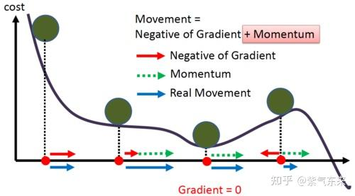
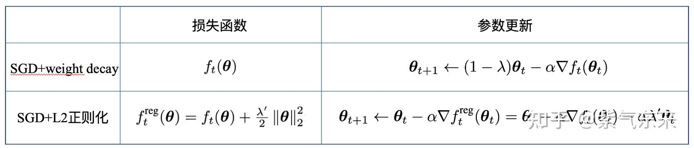
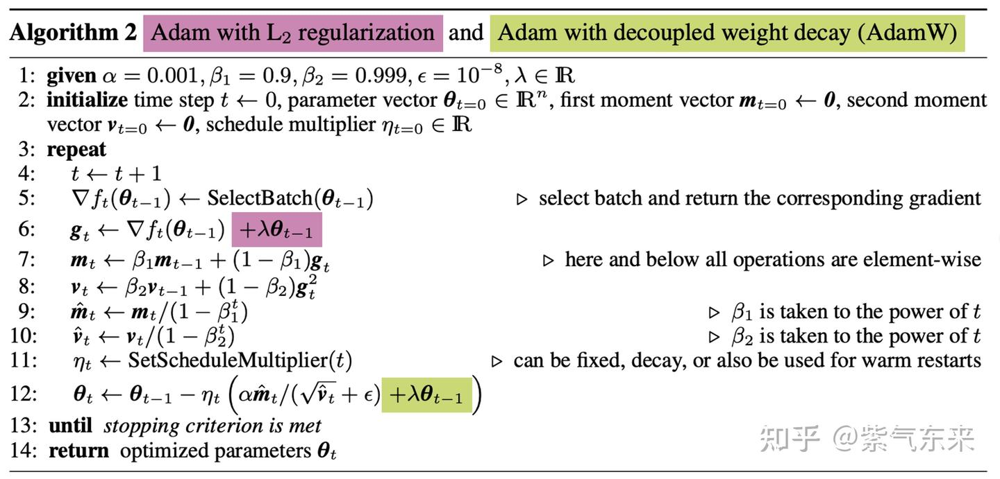
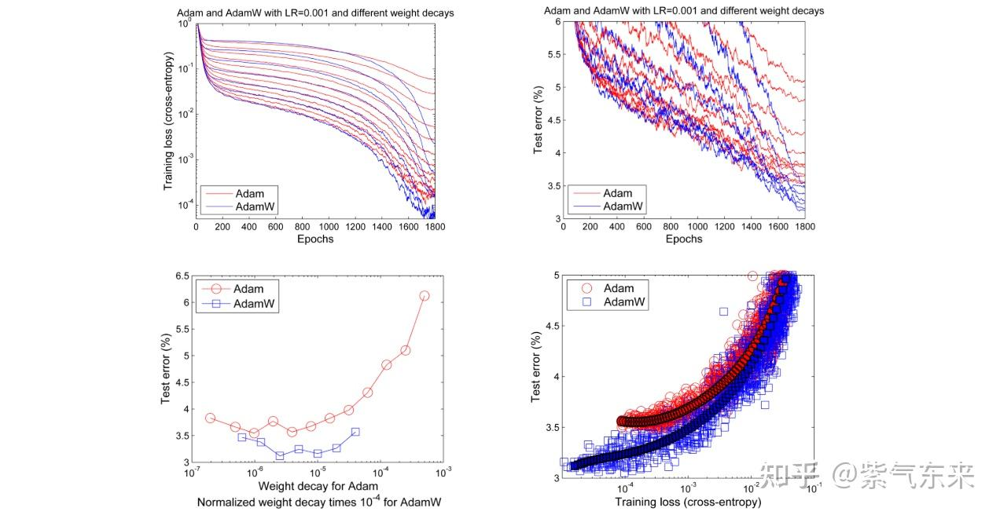

# ops(4): AdamW 옵티마이저의 CUDA 구현

> 원문: https://zhuanlan.zhihu.com/p/695611950

**목차**
- 1. AdamW의 원리 다시 보기
  - 1.1 Momentum의 의미
  - 1.2 weight decay vs L2 regularization
- 2. AdamW의 CUDA 구현과 최적화
  - 2.1 단순 구현
- 참고 자료

AdamW는 최근 몇 년간 가장 많이 쓰이는 딥러닝 옵티마이저입니다. 학습 결과를 좌우하는 한편 학습 과정에서 대부분의 VRAM(약 75%)을 차지하는 핵심 연산자입니다. 이번 글에서는 동작 원리를 다시 깊게 다룬 뒤, CUDA로 구현·최적화합니다.

## 1. AdamW의 원리 다시 보기

### 1.1 Momentum의 의미

가장 기본 SGD 갱신은:

```
θₜ = θₜ₋₁ − η · gₜ
```

문제점:

- 고정 학습률은 초반 수렴 속도가 느림
- 고정 학습률은 최솟값을 지나치거나 부근에서 진동할 수 있음
- 안장점에 갇히기 쉬움

Momentum은 이 문제들을 해결합니다.

```
mₜ ← β₁ · mₜ₋₁ + (1 − β₁) · gₜ
vₜ ← β₂ · vₜ₋₁ + (1 − β₂) · gₜ²
m̂ₜ ← mₜ / (1 − β₁ᵗ)
v̂ₜ ← vₜ / (1 − β₂ᵗ)
θₜ ← θₜ₋₁ − ηₜ · ( m̂ₜ / ( √v̂ₜ + ε ) )
```

- `mₜ`는 1차 모멘텀(관성). 현재 갱신 방향에 현재 gradient뿐 아니라 과거 gradient도 반영.
- `vₜ`는 2차 모멘텀(적응 학습률 제어). 분모에 위치하며 다음 의미:
  - 자주 갱신되는 파라미터: 단일 샘플 영향이 크지 않도록, 학습률을 약간 낮춤
  - 드물게 갱신되는 파라미터: 적은 샘플에서 더 많이 배우도록 학습률을 약간 높임
- `m̂ₜ`는 moving average의 초기 시점 보정. `t`가 충분히 크면 `m̂ₜ = mₜ`. 예: `t = 1`에 `β₁ = 0.9`, `m₀ = 0`이면 `m₁ = 0.1g₁`이고 보정 후 `m̂₁ = g₁`.
- `v̂ₜ`도 동일.

다음 그림은 Momentum 동작 원리를 시각적으로 보여 줍니다.



### 1.2 weight decay vs L2 regularization

**SGD에 한해서** weight decay와 L2 regularization은 완전히 동등합니다. L2 정규화 항의 gradient가 weight decay의 파라미터 갱신과 같기 때문입니다. 즉 SGD에선 둘 중 무엇을 쓰든 결과가 같습니다. `λ′ = λ/α`이면 갱신 식이 동일.



하지만 Momentum이 들어오면 이 등가성이 깨집니다. gradient 계산 방식 자체가 바뀌기 때문입니다. L2 정규화는 원래 파라미터를 작게 만들고자 도입됐는데, 손실 함수에 L2 정규화 항을 직접 추가하면(아래 그림 빨간 부분) 1차·2차 모멘텀의 영향으로 갱신 방향이 흐릿해져 본래 목표를 달성하기 어렵습니다. 반면 weight decay를 파라미터 갱신에 직접 적용하면(아래 그림 초록 부분) 본래 목표를 깔끔하게 달성할 수 있습니다.



다수의 실험 결과도 이를 뒷받침합니다.



## 2. AdamW의 CUDA 구현과 최적화

### 2.1 단순 구현

CPU 구현은 위 알고리즘 그대로. AdamW 옵티마이저 상태의 주요 구성 요소도 보입니다.

- params
- grads
- momentum
- variance

```cpp
// CPU code reference
void adamw_cpu(float* params_memory, const float* grads_memory, float* m_memory, float* v_memory,
               int t, long num_parameters,
               float learning_rate = 1e-3, float beta1 = 0.9, float beta2 = 0.999,
               float eps = 1e-8, float weight_decay = 0.0) {
    for (int i = 0; i < num_parameters; i++) {
        float param = params_memory[i];
        float grad  = grads_memory[i];

        // 1차 모멘텀
        float m = beta1 * m_memory[i] + (1.0f - beta1) * grad;
        // 2차 모멘텀 (RMSprop)
        float v = beta2 * v_memory[i] + (1.0f - beta2) * grad * grad;
        // 둘 다 bias 보정
        float m_hat = m / (1.0f - powf(beta1, t));
        float v_hat = v / (1.0f - powf(beta2, t));

        m_memory[i] = m;
        v_memory[i] = v;
        params_memory[i] -= learning_rate * (m_hat / (sqrtf(v_hat) + eps) + weight_decay * param);
    }
}
```

CUDA 구현은 위 알고리즘에 병렬화만 추가:

```cpp
__global__ void adamw_kernel1(float* params_memory, const float* grads_memory,
                              float* m_memory, float* v_memory, long num_parameters,
                              float learning_rate, float beta1, float beta2,
                              float beta1_correction, float beta2_correction,
                              float eps, float weight_decay) {
    int i = blockIdx.x * blockDim.x + threadIdx.x;
    if (i >= num_parameters) return;
    m_memory[i] = beta1 * m_memory[i] + (1.0f - beta1) * grads_memory[i];
    v_memory[i] = beta2 * v_memory[i] + (1.0f - beta2) * grads_memory[i] * grads_memory[i];
    float m_hat = m_memory[i] / beta1_correction;
    float v_hat = v_memory[i] / beta2_correction;
    params_memory[i] -= learning_rate * (m_hat / (sqrtf(v_hat) + eps) + weight_decay * params_memory[i]);
}
```

성능:

```
time gpu 0.0409 ms
time cpu 0.0612 ms
```

## 참고 자료

1. https://github.com/karpathy/llm.c/blob/master/dev/cuda/adamw.cu
2. AdamW 옵티마이저 간단 이해 — CSDN 블로그
3. Päpper's ML Blog — weight decay와 L2 regularization의 차이
4. https://arxiv.org/pdf/1711.05101

> 燕子不歸春事晚, 一汀煙雨杏花寒 — 戴叔倫 《蘇溪亭》
