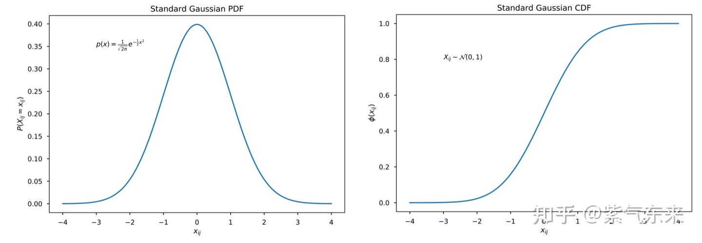
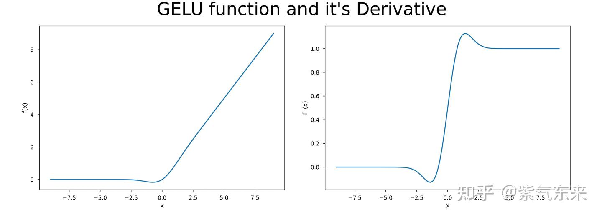
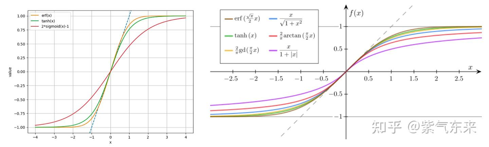
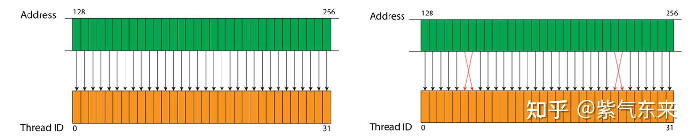
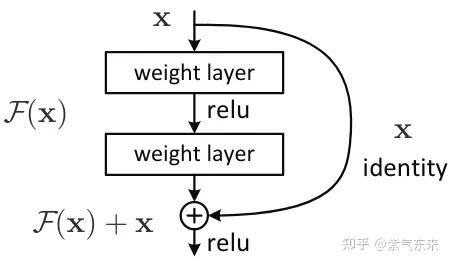

# ops(5): 활성화 함수와 잔차 연결의 CUDA 구현

> 원문: https://zhuanlan.zhihu.com/p/695703671

**목차**
- 1. GELU 활성화 함수의 구현
  - 1.1 원리와 근사 계산
  - 1.2 구현
- 2. 잔차 연결(residual connection)의 구현
  - 2.1 원리 개요
  - 2.2 구현
- 참고 자료

활성화 함수와 잔차 연결은 둘 다 중요하면서 단순(둘 다 element-wise)하므로 한 글에 묶어 다룹니다.

## 1. GELU 활성화 함수의 구현

### 1.1 원리와 근사 계산

GELU 정의:

```
gelu(x) = x · P(X ≤ x) = x · φ(x),   X ~ N(0, 1)
```

`X`는 평균 0·분산 1의 정규 분포 확률변수, `P(X ≤ x)`는 누적분포함수 `φ(x)`. 활성화의 의미는 SOI (zero-or-identity) 로, 두 동작 중 하나:

- 확률 `φ(x)`로 identity (그대로 보냄)
- 확률 `1 − φ(x)`로 0에 매핑

이는 베르누이 분포에 대응하고, 기댓값은:

```
x · φ(x) + 0 · (1 − φ(x)) = x · φ(x)
```

GELU는 가우스 오차 함수로도 계산 가능:

```
gelu(x) = (1/2) · x · (1 + erf(x / √2))
erf(y)  = (2/√π) · ∫₀ʸ e^(-t²) dt
```

`X`가 표준 정규이므로 pdf:

```
p(x) = (1/√(2π)) · exp(− x²/2)
```

cdf:

```
φ(x) = ∫_{-∞}^x (1/√(2π)) · exp(− t²/2) dt
```

pdf·cdf 그림:



`t = z/√2`로 치환하면 `erf`는:

```
erf(y) = 2(φ(y · √2) − φ(0)) = 2φ(y · √2) − 1
```

따라서 `φ(x) = (1 + erf(x/√2)) / 2`. 대입하면 GELU 공식이 나옵니다.

GELU의 입력에 대한 미분:

```
d/dx gelu(x) = φ(x) + x · φ′(x) = φ(x) + x · pdf(x)
```

GELU와 그 도함수 그래프:



요즘 주류 프레임워크는 `erf`가 내장되어 있어 바로 구현 가능합니다.

```python
import torch
import numpy as np
def gelu(x):
    cdf = 0.5 * (1.0 + torch.erf(x / np.sqrt(2.0)))
    return x * cdf
```

CUDA로 다시 쓰는데 `erf` 없으면? 초등 함수로 근사해야 합니다. 잘 알려진 두 근사:

```
gelu(x) ≈ (1/2) · x · (1 + tanh[√(2/π) · (x + 0.044715 · x³)])
gelu(x) ≈ x · σ(1.702 · x)
```



tanh 근사의 도함수를 유도해 봅니다. `φ(x) = (1/2)(1 + tanh(y))`, `y = √(2/π)(x + 0.044715 x³)`. `d/dx tanh = 1 − tanh² = sech²` 를 이용해:

```
d/dx gelu(x)
  = φ(x) + x · φ′(x)
  = φ(x) + (x/2) · sech²(y) · √(2/π) · (1 + 3 · 0.044715 · x²)
```

### 1.2 구현

tanh 근사 기반 CPU 구현:

```cpp
#define GELU_SCALING_FACTOR sqrtf(2.0f / M_PI)

void gelu_forward_cpu(float* out, const float* inp, int N) {
    for (int i = 0; i < N; i++) {
        float x = inp[i];
        float cube = 0.044715f * x * x * x;
        out[i] = 0.5f * x * (1.0f + tanhf(GELU_SCALING_FACTOR * (x + cube)));
    }
}
```

element-wise라 CUDA 병렬화도 간단합니다.

```cpp
__global__ void gelu_forward_kernel1(floatX* out, const floatX* inp, int N) {
    int i = blockIdx.x * blockDim.x + threadIdx.x;
    if (i < N) {
        float xi = inp[i];
        float cube = 0.044715f * xi * xi * xi;
        out[i] = 0.5f * xi * (1.0f + tanhf(GELU_SCALING_FACTOR * (xi + cube)));
    }
}
```

성능:

```
block_size   32 | time 0.3297 ms | bandwidth  76.34 GB/s
block_size   64 | time 0.1589 ms | bandwidth 158.39 GB/s
block_size  128 | time 0.0822 ms | bandwidth 306.31 GB/s
block_size  256 | time 0.0514 ms | bandwidth 489.78 GB/s
block_size  512 | time 0.0514 ms | bandwidth 489.18 GB/s
block_size 1024 | time 0.0554 ms | bandwidth 454.13 GB/s
```

이제 성능 최적화. 최대 메모리 대역폭을 위해선 메모리 접근을 128 byte 경계에 정렬해야 합니다. 이상적인 것은 warp 내 모든 스레드의 순차 접근(그림 왼쪽: warp의 32 thread가 32개 연속 word에 접근). 사실 순차일 필요까지는 없습니다(그림 오른쪽).



aligned memory는 GPU 메모리 대역폭 활용률을 극대화하고 접근 비용을 낮춥니다. `common.h`에는 `load128, load128cs, store128, store128cs` 네 가지가 구현돼 있습니다. 사용 예:

```cpp
__global__ void gelu_forward_kernel2(floatX* out, const floatX* inp, int N) {
    int i = (blockIdx.x * blockDim.x + threadIdx.x) * x128::size;
    if (i < N) {
        x128 packed_out;
        x128 packed_inp = load128cs(inp + i); // load, do not keep in cache
        for(int k = 0; k < packed_inp.size; ++k) {
            float xi = (float)packed_inp[k];
            float cube = 0.044715f * xi * xi * xi;
            packed_out[k] = (floatX)(0.5f * xi * (1.0f + tanhf(GELU_SCALING_FACTOR * (xi + cube))));
        }
        // 다음 연산에서 캐시가 유용할 수 있으므로 storecs 대신 store
        store128(out + i, packed_out);
    }
}
```

IO 집약 계산이라 메모리 접근 최적화로 큰 폭의 성능 향상:

```
block_size   32 | time 0.0501 ms | bandwidth 502.70 GB/s
block_size   64 | time 0.0387 ms | bandwidth 650.48 GB/s
block_size  128 | time 0.0380 ms | bandwidth 661.65 GB/s
block_size  256 | time 0.0382 ms | bandwidth 659.53 GB/s
block_size  512 | time 0.0386 ms | bandwidth 652.30 GB/s
block_size 1024 | time 0.0397 ms | bandwidth 634.31 GB/s
```

역전파(근사 기반, 위 최적화 적용):

```cpp
__global__ void gelu_backward2(floatX* dinp, const floatX* inp, const floatX* dout, const int N) {
    int i = (blockIdx.x * blockDim.x + threadIdx.x) * x128::size;
    if (i < N) {
        x128 packed_dinp;
        x128 packed_inp  = load128cs(inp + i);
        x128 packed_dout = load128cs(dout + i);
        for (int k = 0; k < packed_inp.size; ++k) {
            float x = (float)packed_inp[k];
            float cube = 0.044715f * x * x * x;
            float tanh_arg  = GELU_SCALING_FACTOR * (x + cube);
            float tanh_out  = tanhf(tanh_arg);
            float coshf_out = coshf(tanh_arg);
            float sech_out  = 1.0f / (coshf_out * coshf_out);
            float local_grad = 0.5f * (1.0f + tanh_out)
                             + x * 0.5f * sech_out * GELU_SCALING_FACTOR * (1.0f + 3.0f * 0.044715f * x * x);
            packed_dinp[k] = (floatX)(local_grad * (float)packed_dout[k]);
        }
        store128(dinp + i, packed_dinp);
    }
}
```

성능:

```
block_size   32 | time 0.0560 ms | bandwidth 899.24 GB/s
block_size   64 | time 0.0570 ms | bandwidth 882.72 GB/s
block_size  128 | time 0.0561 ms | bandwidth 896.82 GB/s
block_size  256 | time 0.0561 ms | bandwidth 897.65 GB/s
block_size  512 | time 0.0563 ms | bandwidth 893.67 GB/s
block_size 1024 | time 0.0589 ms | bandwidth 854.08 GB/s
```

## 2. 잔차 연결의 구현

### 2.1 원리 개요

잔차 연결(Residual Connection)은 딥러닝의 가장 기본 기술 중 하나입니다. 네트워크 내 정보가 더 효율적으로 흐르게 하면서 깊은 신경망의 gradient vanishing·exploding 문제를 완화합니다.

- **기울기 소실 완화**: 깊은 신경망에선 층 간 연속 곱셈 때문에 역전파 중 기울기가 점점 작아질 수 있습니다. residual은 한 층 이상을 건너뛰는 경로를 만들어 기울기가 직접 흐르게 합니다.
- **학습 가속**: 기울기 소실 위험이 줄어 각 층이 유용한 표현을 더 쉽게 배웁니다.
- **표현력 향상**: 각 층이 입출력 사이의 잔차를 학습할 수 있어 identity mapping을 쉽게 학습할 수 있고, 더 복잡한 함수를 구성할 수 있게 됩니다.
- **모듈러 설계**: 각 residual block이 독립적으로 입출력 매핑을 학습. 구조가 유연해지고 확장이 쉽습니다.
- **최적화 단순화**: 매우 깊은 네트워크에서도 효과적 학습을 가능케 합니다.



### 2.2 구현

원리가 단순한 element-wise라 구현도 단순합니다. CPU:

```cpp
void residual_forward_cpu(float* out, const float* inp1, const float* inp2, int N) {
    for (int i = 0; i < N; i++) {
        out[i] = inp1[i] + inp2[i];
    }
}
```

CUDA:

```cpp
__global__ void residual_forward_kernel(float* out, const float* inp1, const float* inp2, int N) {
    int idx = blockIdx.x * blockDim.x + threadIdx.x;
    if (idx < N) out[idx] = inp1[idx] + inp2[idx];
}
```

## 참고 자료

1. https://github.com/karpathy/llm.c/blob/master/dev/cuda/gelu_forward.cu
2. https://github.com/karpathy/llm.c/blob/master/dev/cuda/residual_forward.cu
3. On the GELU Activation Function
4. GELU의 두 가지 초등 함수 근사 — Scientific Spaces

> 長溝流月去無聲, 杏花疏影裏, 吹笛到天明 — 陳與義 《臨江仙》
