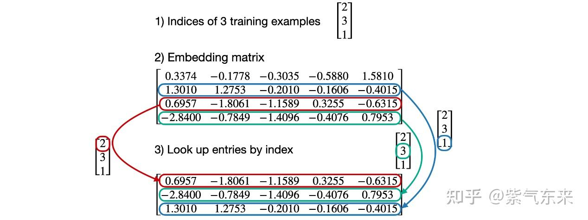
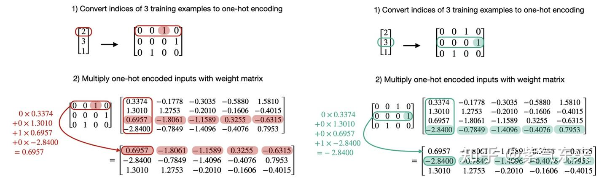

# ops(6): embedding 층과 LM head 층의 CUDA 구현

> 원문: https://zhuanlan.zhihu.com/p/695785781

**목차**
- 1. embedding 층의 CUDA 구현
  - 1.1 embedding vs linear
  - 1.2 구현
- 2. LM head 층의 구현
- 참고 자료

Transformer 구조에서 가장 많은 주목을 받는 것은 encoder/decoder layer지만, 그 외에 매우 중요한 두 부분이 있습니다. embedding 층과 LM head 층입니다. 각각 모델의 머리와 꼬리를 담당합니다. 본 글에서는 기초적인 언어로 이 둘을 이해하고 구현해 봅니다.

## 1. embedding 층의 CUDA 구현

### 1.1 embedding vs linear

언어 모델에서 embedding 층의 역할은 텍스트의 이산 의미·위치 정보를 고차원 벡터 표현으로 변환하는 것입니다. 표준 GPT에서 word embedding과 position embedding은 행렬 형태(`wte`, `wpe`)로 저장되고, 변환은 벡터 인덱싱입니다. PyTorch로 이해해 봅시다.

- 인덱스와 embedding 행렬 초기화:

```python
import torch
idx = torch.tensor([2, 3, 1])

num_idx, out_dim = max(idx)+1, 5
embedding = torch.nn.Embedding(num_idx, out_dim)
```

embedding 행렬 값:

```
Parameter containing:
tensor([[ 0.3374, -0.1778, -0.3035, -0.5880,  1.5810],
        [ 1.3010,  1.2753, -0.2010, -0.1606, -0.4015],
        [ 0.6957, -1.8061, -1.1589,  0.3255, -0.6315],
        [-2.8400, -0.7849, -1.4096, -0.4076,  0.7953]], requires_grad=True)
```

- 인덱싱:

```python
embedding(idx)
```

결과:

```
tensor([[ 0.6957, -1.8061, -1.1589,  0.3255, -0.6315],
        [-2.8400, -0.7849, -1.4096, -0.4076,  0.7953],
        [ 1.3010,  1.2753, -0.2010, -0.1606, -0.4015]],
       grad_fn=<EmbeddingBackward0>)
```

인덱싱 과정 시각화:



이 작업은 linear 행렬 곱으로도 변환할 수 있습니다. `x`를 one-hot으로 펼치고 `z = xW = [W_s1 ... W_sD]`. 검증해 봅시다.

- `x` → one-hot, embedding 행렬 → linear:

```python
onehot = torch.nn.functional.one_hot(idx)
linear.weight = torch.nn.Parameter(embedding.weight.T.detach())
```

- 행렬 곱:

```python
linear(onehot.float())
```

결과는 위와 완전히 동일:

```
tensor([[ 0.6957, -1.8061, -1.1589,  0.3255, -0.6315],
        [-2.8400, -0.7849, -1.4096, -0.4076,  0.7953],
        [ 1.3010,  1.2753, -0.2010, -0.1606, -0.4015]], grad_fn=<MmBackward0>)
```

행렬 곱 시각화:



순전파 이해가 되면 역전파도 간단합니다. 미분:

```
∂J/∂Wᵢⱼ = Σₖ (∂J/∂zₖ) · (∂zₖ/∂Wᵢⱼ)
```

순전파 특성상 `∂zₖ/∂Wᵢⱼ = 0` (k ≠ j), `= 1` (k = j). 따라서 `∂J/∂W_{sj} = ∂J/∂zⱼ`.

행렬로 쓰면 `∂J/∂W`의 `s`번째 행만 `∂J/∂z`로 채워진 형태(다른 행은 0). 실질적으로 역전파 gradient의 인덱싱입니다.

### 1.2 구현

원리를 이해했으니 구현은 단순합니다. 행 단위 인덱싱. CPU 기준 버전:

```cpp
// GPT-2 positional encoder forward pass
void encoder_forward_cpu(float* out,
                         const int* inp, const float* wte, const float* wpe,
                         int B, int T, int C) {
    for (int b = 0; b < B; b++) {
        for (int t = 0; t < T; t++) {
            float* out_bt = out + b * T * C + t * C;
            int ix = inp[b * T + t];
            const float* wte_ix = wte + ix * C;
            const float* wpe_t = wpe + t * C;
            for (int i = 0; i < C; i++) out_bt[i] = wte_ix[i] + wpe_t[i];
        }
    }
}
```

CUDA 기본 버전은 B·T 차원에서 병렬화:

```cpp
__global__ void encoder_forward_kernel1(floatX* out,
                                        const int* inp, const floatX* wte, const floatX* wpe,
                                        int B, int T, int C) {
    int idx = blockIdx.x * blockDim.x + threadIdx.x;
    int N = B * T;
    if (idx < N) {
        int b = idx / T;
        int t = idx % T;
        floatX* out_bt = out + b * T * C + t * C;
        int ix = inp[b * T + t];
        const floatX* wte_ix = wte + ix * C;
        const floatX* wpe_t  = wpe + t * C;
        for (int i = 0; i < C; i++) {
            out_bt[i] = (floatX)((float)wte_ix[i] + (float)wpe_t[i]);
        }
    }
}
```

성능:

```
block_size   32 | time 0.3918 ms | bandwidth 256.93 GB/s
block_size   64 | time 0.3921 ms | bandwidth 256.73 GB/s
block_size  128 | time 0.4000 ms | bandwidth 251.64 GB/s
block_size  256 | time 0.7029 ms | bandwidth 143.21 GB/s
block_size  512 | time 1.4864 ms | bandwidth  67.72 GB/s
block_size 1024 | time 2.9538 ms | bandwidth  34.08 GB/s
```

인덱싱이 독립적이므로 병렬도를 더 늘릴 수 있습니다.

```cpp
__global__ void encoder_forward_kernel2(floatX* out,
                                        const int* inp, const floatX* wte, const floatX* wpe,
                                        int B, int T, int C) {
    int idx = blockIdx.x * blockDim.x + threadIdx.x;
    int N = B * T * C;
    if (idx < N) {
        int bt = idx / C;
        int b = bt / T;
        int t = bt % T;
        int c = idx % C;

        int ix = inp[b * T + t];

        floatX* out_btc = out + b * T * C + t * C + c;
        const floatX* wte_ix = wte + ix * C + c;
        const floatX* wpe_tc = wpe + t * C + c;
        *out_btc = (floatX)((float)*wte_ix + (float)*wpe_tc);
    }
}
```

성능 대폭 향상:

```
block_size   32 | time 0.3366 ms | bandwidth  299.10 GB/s
block_size   64 | time 0.1600 ms | bandwidth  629.16 GB/s
block_size  128 | time 0.0853 ms | bandwidth 1180.48 GB/s
block_size  256 | time 0.0745 ms | bandwidth 1350.73 GB/s
block_size  512 | time 0.0746 ms | bandwidth 1350.01 GB/s
block_size 1024 | time 0.0787 ms | bandwidth 1278.74 GB/s
```

이전 글의 메모리 접근 최적화(`x128`)도 결합:

```cpp
__global__ void encoder_forward_kernel3(floatX* out,
                                        const int* inp, const floatX* wte, const floatX* wpe,
                                        int B, int T, int C) {
    int idx = (blockIdx.x * blockDim.x + threadIdx.x) * x128::size;
    int N = B * T * C;
    if (idx < N) {
        int bt = idx / C;
        int b = bt / T;
        int t = bt % T;
        int c = idx % C;

        int ix = inp[b * T + t];

        floatX* out_btc = out + b * T * C + t * C + c;
        const floatX* wte_ix = wte + ix * C + c;
        const floatX* wpe_tc = wpe + t * C + c;

        x128 packed_out;
        x128 wte = load128cs(wte_ix);
        x128 wpe = load128cs(wpe_tc);
        #pragma unroll
        for (int k = 0; k < wte.size; k++) {
            packed_out[k] = (floatX)((float)wte[k] + (float)wpe[k]);
        }
        store128(out_btc, packed_out);
    }
}
```

성능:

```
block_size   32 | time 0.0573 ms | bandwidth 1756.26 GB/s
block_size   64 | time 0.0538 ms | bandwidth 1869.95 GB/s
block_size  128 | time 0.0537 ms | bandwidth 1874.82 GB/s
block_size  256 | time 0.0536 ms | bandwidth 1879.17 GB/s
block_size  512 | time 0.0539 ms | bandwidth 1868.99 GB/s
block_size 1024 | time 0.0545 ms | bandwidth 1848.65 GB/s
```

역전파 CPU:

```cpp
void encoder_backward_cpu(float* dwte, float* dwpe,
                          float* dout, int* inp,
                          int B, int T, int C) {
    for (int b = 0; b < B; b++) {
        for (int t = 0; t < T; t++) {
            float* dout_bt = dout + b * T * C + t * C;
            int ix = inp[b * T + t];
            float* dwte_ix = dwte + ix * C;
            float* dwpe_t  = dwpe + t * C;
            for (int i = 0; i < C; i++) {
                float d = dout_bt[i];
                dwte_ix[i] += d;
                dwpe_t[i]  += d;
            }
        }
    }
}
```

CUDA는 동일 원리이며, 원자 덧셈으로 thread 간섭을 피합니다:

```cpp
__global__ void encoder_backward_kernel1(float* dwte, float* dwpe,
                                         const float* dout, const int* inp,
                                         int B, int T, int C) {
    int idx = blockIdx.x * blockDim.x + threadIdx.x;
    int N = B * T * C;
    if (idx < N) {
        int bt = idx / C;
        int b = bt / T;
        int t = bt % T;
        int c = idx % C;
        int ix = inp[b * T + t];

        const float* dout_btc = dout + b * T * C + t * C + c;
        float* dwte_ix = dwte + ix * C + c;
        float* dwpe_tc = dwpe + t * C + c;

        atomicAdd(dwte_ix, *dout_btc);
        atomicAdd(dwpe_tc, *dout_btc);
    }
}
```

성능:

```
block_size   32 | time 0.3296 ms
block_size   64 | time 0.1735 ms
block_size  128 | time 0.1719 ms
block_size  256 | time 0.1728 ms
block_size  512 | time 0.1731 ms
block_size 1024 | time 0.1740 ms
```

코드는 [encoder_forward.cu](https://github.com/ifromeast/cuda_learning/blob/main/04_transformer/ops/encoder_forward.cu), [encoder_backward.cu](https://github.com/ifromeast/cuda_learning/blob/main/04_transformer/ops/encoder_backward.cu).

## 2. LM head 층의 구현

Transformer, 특히 causal language model에서 LM head는 layer가 내놓은 logits를 softmax로 probs로 만든 뒤,

- 추론: probs와 디코딩 알고리즘으로 next token을 얻음
- 학습: probs와 labels로 loss를 만들고 역전파 시작

probs와 dlogits 계산을 fused kernel로:

```cpp
__global__ void fused_classifier_kernel2(float* dlogits, float* losses, float* probs,
                                         const float* logits, const float* dlosses, const int* targets,
                                         int B, int T, int V, int P) {
    namespace cg = cooperative_groups;
    cg::thread_block block = cg::this_thread_block();
    cg::thread_block_tile<32> warp = cg::tiled_partition<32>(block);
    int idx = blockIdx.x;
    int ix  = targets[idx];

    // softmax (B*T*V 읽기. 아래에서 같은 logits 다시 읽음, 캐시에 남아 있길 기대)
    SoftmaxParams sp = prepare_softmax_blockwide(warp, idx, logits, V, P);

    if (threadIdx.x == 0) {
        float prob = expf(logits[idx * P + ix] - sp.Offset) * sp.Scale;
        losses[idx] = -logf(prob);
    }

    // dlosses 기본값은 1/(B*T)
    float dloss = dlosses != NULL ? dlosses[idx] : 1.0f / (B*T);

    const float4* logits_vec4 = reinterpret_cast<const float4*>(logits + idx * P);
    for (int i = threadIdx.x; i < (V+3)/4; i += blockDim.x) {
        float4 v4 = __ldcs(&logits_vec4[i]);

        #pragma unroll
        for (int k = 0; k < 4; ++k) {
            int element = i*4 + k;
            float prob = expf(vec_at(v4, k) - sp.Offset) * sp.Scale;
            prob = (element < V) ? prob : 0.0f;

            if (probs != NULL) probs[idx * P + element] = prob;
            if (dlogits != NULL) {
                float indicator = element == ix ? 1.0f : 0.0f;
                dlogits[idx * P + element] = (prob - indicator) * dloss;
            }
        }
    }
}
```

성능:

```
block_size   32 | time 10.460636 ms
block_size   64 | time 10.547235 ms
block_size  128 |  time 9.895740 ms
block_size  256 |  time 9.381703 ms
block_size  512 |  time 9.059260 ms
block_size 1024 |  time 8.828804 ms
```

코드는 [classifier_fused.cu](https://github.com/ifromeast/cuda_learning/blob/main/04_transformer/ops/classifier_fused.cu).

## 참고 자료

1. https://github.com/karpathy/llm.c/blob/master/dev/cuda/encoder_forward.cu
2. https://github.com/karpathy/llm.c/blob/master/dev/cuda/encoder_backward.cu
3. https://github.com/karpathy/llm.c/blob/master/dev/cuda/classifier_fused.cu
4. LLMs-from-scratch/ch02/03_bonus_embedding-vs-matmul/embeddings-and-linear-layers.ipynb — rasbt

> 世界的本質是廢墟. 我們不是廢墟, 就是在成為廢墟的路上 — 野城
