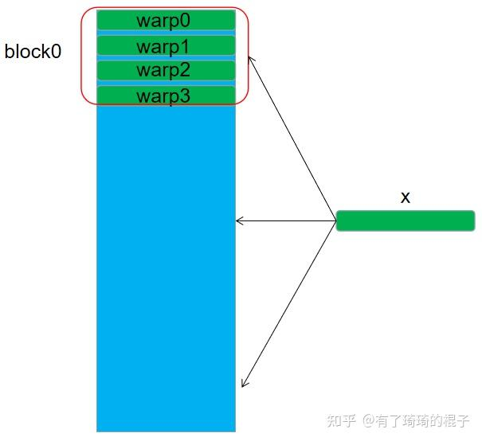
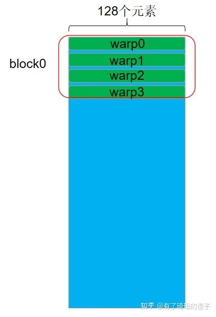
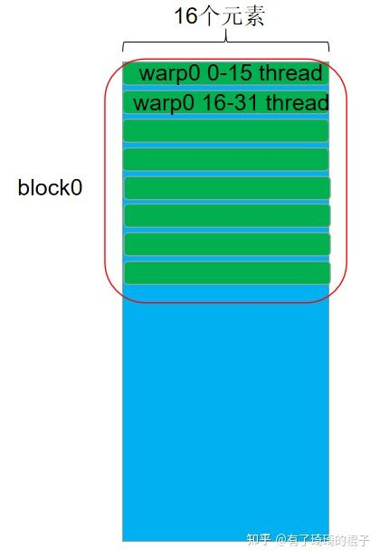

# 깊지만 쉽게 GPU 최적화 시리즈: gemv 최적화

> 원문: https://zhuanlan.zhihu.com/p/494144694

본 글은 *깊지만 쉽게 GPU 최적화* 시리즈의 네 번째 편으로, **gemv 알고리즘을 어떻게 최적화할지** 다룹니다. gemv는 행렬-벡터 곱, 즉 행렬 A와 벡터 x의 곱을 계산하는 병렬 계산의 고전적 주제입니다. 개인적으로 **gemv 최적화의 핵심은 다양한 shape를 고려해 형태별로 최적화하는 것** 이라고 봅니다. 본 글은 먼저 shape별 병렬 알고리즘 설계를 설명하고, 그다음 최적화 사고와 기법, 마지막으로 실험 결과를 다룹니다. A의 열 수가 16·128일 때, 본 글에서 만든 gemv가 cuBLAS를 능가하는 성능을 보입니다.

## 1. 서론

gemv 알고리즘부터. 행렬 A와 벡터 x가 주어지면 gemv는 둘의 곱을 계산합니다.


*gemv*

## 2. shape별 병렬 알고리즘 설계

GPU에서 병렬 알고리즘 설계란 **block과 thread의 워크로드를 설계하는 것**, 즉 어떤 block이 어느 부분을 계산하고, 어떤 thread가 어느 부분을 계산할지를 명확히 하는 것입니다. 설계 원칙은 **메모리 접근을 최대한 줄이고 데이터 재사용 확률을 높이며, 모든 프로세서를 가능한 한 풀로 일하게 만드는 것** 입니다.

### 2.1 n = 32

각 block을 256 thread, 즉 4 warp로 두고, 각 warp가 한 행을 담당하게 합니다. 각 warp는 x에 접근한 뒤 warp 내부 reduce sum을 수행합니다.


*n=32*

```cuda
template <unsigned int WarpSize>
__device__ __forceinline__ float warpReduceSum(float sum) {
    if (WarpSize >= 32) sum += __shfl_down_sync(0xffffffff, sum, 16);
    if (WarpSize >= 16) sum += __shfl_down_sync(0xffffffff, sum, 8);
    if (WarpSize >= 8)  sum += __shfl_down_sync(0xffffffff, sum, 4);
    if (WarpSize >= 4)  sum += __shfl_down_sync(0xffffffff, sum, 2);
    if (WarpSize >= 2)  sum += __shfl_down_sync(0xffffffff, sum, 1);
    return sum;
}

// N == 32
__global__ void Sgemv_v0(
    float * __restrict__ A,
    float * __restrict__ x,
    float * __restrict__ y,
    const int M, const int N) {
    int bx = blockIdx.x;
    int tx = threadIdx.x;
    int ty = threadIdx.y;

    const int warp_size = 32;
    int laneId = tx % warp_size;
    int current_row = blockDim.y * bx + ty;

    if (current_row < M) {
        float res = 0;
        int kIteration = N / warp_size;
        if (kIteration == 0) kIteration = 1;
        #pragma unroll
        for (int i = 0; i < kIteration; i++) {
            int current_col = i * warp_size + laneId;
            res += A[current_row * N + current_col] * x[current_col];
        }
        res = warpReduceSum<warp_size>(res);
        if (laneId == 0) y[current_row] = res;
    }
}
```

### 2.2 n = 128

마찬가지로 warp 하나가 한 행을 담당. 한 행 원소가 많으므로 `float4` 벡터화 적재로 접근 효율을 더 끌어올립니다.


*n=128*

```cuda
// N >= 128
__global__ void Sgemv_v1(
    float * __restrict__ A,
    float * __restrict__ x,
    float * __restrict__ y,
    const int M, const int N) {
    int bx = blockIdx.x;
    int tx = threadIdx.x;
    int ty = threadIdx.y;

    const int warp_size = 32;
    int laneId = tx % warp_size;
    int current_row = blockDim.y * bx + ty;

    if (current_row < M) {
        float res = 0;
        int kIteration = (N / warp_size) / 4;
        if (kIteration == 0) kIteration = 1;
        A = &A[current_row * N];
        #pragma unroll
        for (int i = 0; i < kIteration; i++) {
            int current_col_vec = (i * warp_size + laneId);
            float4 current_val = reinterpret_cast<float4 *>(A)[current_col_vec];
            float4 current_x   = reinterpret_cast<float4 *>(x)[current_col_vec];
            res += current_val.x * current_x.x;
            res += current_val.y * current_x.y;
            res += current_val.z * current_x.z;
            res += current_val.w * current_x.w;
        }
        res = warpReduceSum<warp_size>(res);
        if (laneId == 0) y[current_row] = res;
    }
}
```

### 2.3 n = 16

n = 16인 경우, warp 하나가 두 행을 담당. warp0을 예로 들면 0~15번 thread가 행 0을, 16~31번 thread가 행 1을 처리.


*n=16*

```cuda
template <const int ROW_PER_WARP>
__global__ void Sgemv_v2(
    float * __restrict__ A,
    float * __restrict__ x,
    float * __restrict__ y,
    const int M, const int N) {
    int bx = blockIdx.x;
    int tx = threadIdx.x;
    int ty = threadIdx.y;

    const int warp_size = 32;
    int laneId = tx % warp_size;
    int current_warp_row = (blockDim.y * bx + ty) * ROW_PER_WARP;
    const int kWarp_size = warp_size / ROW_PER_WARP;
    int kLaneId = laneId % kWarp_size;
    int current_thread_row = current_warp_row + laneId / kWarp_size;

    if (current_thread_row < M) {
        float res = 0;
        int current_col = kLaneId;
        res += A[current_thread_row * N + current_col] * x[current_col];
        res = warpReduceSum<kWarp_size>(res);
        if (kLaneId == 0) y[current_thread_row] = res;
    }
}
```

## 3. 최적화 사고

위에선 n에 따른 설계를 보였습니다. 왜 이렇게 설계하는지, 어떤 이점이 있는지 정리합니다. 두 가지 핵심 요소:

### 3.1 warp의 32 thread를 가능한 한 모두 일하게

n < 32일 때 중요합니다. 예: n = 16에서 warp 하나가 한 행을 담당하면 thread의 절반이 놀게 됩니다. 그래서 warp 하나가 여러 행을 담당하게 만들어 32 thread를 모두 활용합니다.

### 3.2 접근 효율 최대화

**(1) global → register**

가장 중요한 것은 coalesced access. 여기선 행렬 데이터가 global memory에서 주소 정렬되어 있다고 가정(n이 2의 거듭제곱). 위의 세 구현 모두 warp의 32 thread가 32개 또는 128개의 연속 float에 접근하므로 coalesced 조건을 만족합니다.

**(2) shared → register**

코드에 shared memory가 안 쓰였는데 왜 거론하느냐 하실 수 있습니다. n=128 케이스를 봅시다. 한 block에 4 warp, 각 warp가 x에 글로벌 접근을 한 번씩 하므로 block당 4번 글로벌 접근이 일어납니다. x를 shared로 옮기면 4 warp가 shared에 접근하므로 글로벌은 1번. 직관적으론 성능이 올라가야 하지만, shared를 쓰면 global → shared 이동 후 동기화가 필요해 성능이 다시 떨어집니다. 결과적으로 shared 사용이 큰 이득은 아니라는 게 결론.

**(3) 벡터화 접근**

상투적인 주제. 가능한 한 128-bit 적재 명령(`float4` 등)을 사용. reduce/sgemm/elementwise에서 충분히 다뤘으므로 더 적지 않습니다.

## 4. 실험과 정리

V100에서 1000회 반복, Nsight로 측정한 결과:

| sgemv | M | N | my_sgemv (ns) | cublas (ns) | my/cublas |
| --- | --- | --- | --- | --- | --- |
| v0 | 16384 | 32 | 10341 | 8386 | 81.1% |
| v1 | 16384 | 128 | 14284 | 15848 | 110.9% |
| v2 | 16384 | 16  | 6690  | 7357  | 109.7% |

n = 16, 128에선 cuBLAS보다 빠르고, n = 32는 cuBLAS보다 느립니다. 여기에 벡터화 접근까지 추가하면 더 좋아질 것이지만 게으름으로 구현하지 않았습니다 :) 코드는 [Liu-xiandong/How_to_optimize_in_GPU/sgemv](https://github.com/Liu-xiandong/How_to_optimize_in_GPU/tree/master/sgemv).

깊지만 쉽게 GPU 시리즈는 계속 업데이트됩니다.
