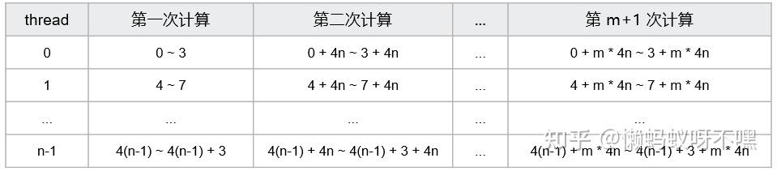

# CUDA element-wise 연산자 상세

> 원문: https://zhuanlan.zhihu.com/p/1888630735520391519

**목차**
- 개념
- 생각해 볼 문제
- 표기
- 연산자 구현
  - 1. 단순 구현
  - 2. Grid-Stride Loops (그리드 스트라이드 루프)
  - 3. Vectorized Memory Access (벡터화 메모리 접근)
- 성능 평가
- 심화
- 참고 자료

## 개념

CUDA에서 elementwise(요소별) 연산은 텐서의 각 원소에 같은 계산을 적용하는 작업입니다. **각 원소 계산이 독립적** 이라 GPU 병렬화에 매우 적합합니다.

참여 텐서 수에 따라:

- (1) 단항 elementwise: 텐서×스칼라, `out = a * A`
- (2) 이항 elementwise: 텐서·텐서 곱, `out = A · B`
- (3) 다항 elementwise: 3개 텐서 합, `out = A + B + C`

## 생각해 볼 문제

elementwise는 가장 직관적으로는 thread 하나가 원소 하나를 담당하면 됩니다. 그래도 짚어 볼 점이 많습니다.

- grid·block 크기를 어떻게 잡을까?
- 사용 가능한 thread 수가 원소 수 N보다 적다면?
- 벡터화 메모리 접근이란? 왜 대역폭을 올리는가?
- 범용 elementwise 연산자 템플릿을 어떻게 설계할까?

이항 덧셈 `C = A + B` 구현을 통해 elementwise 연산자 구현을 살펴봅니다.

## 표기

- `N`: 텐서 원소 수
- `elements_per_thread`: thread 하나가 계산하는 원소 수
- `block_size`: block당 thread 수 (1차원)
- `grid_size`: grid당 block 수 (1차원)
- `num_threads`: 모든 thread 수, `num_threads = grid_size * block_size`

## 연산자 구현

### 1. 단순 구현

**thread 하나가 원소 하나를 담당**, 즉 `elements_per_thread = 1`.

```cuda
__global__ void elementwise_add(float* A, float* B, float* C, const int N) {
    int tid = threadIdx.x + blockIdx.x * blockDim.x;
    if (tid < N) {
        C[tid] = A[tid] + B[tid];
    }
}
```

이 방식만으로도 충분히 좋은 성능을 얻을 수 있습니다(llama.cpp가 이렇게 씁니다).

커널 호출은 `<<<grid_size, block_size>>>`. 단순 구현에선 `elements_per_thread = 1`이므로

```
grid_size = (N + block_size - 1) / block_size
```

(올림. thread 수가 N 이상이 되도록.)

```cuda
int block_size = 256;
int grid_size  = (N + block_size - 1) / block_size;
elementwise_add<<<grid_size, block_size>>>(A, B, C, N);
```

이제 **grid·block을 어떻게 잡을까?** 라는 질문이 자연스럽게 따라옵니다.

OneFlow 측 글이 매우 잘 설명합니다. 일독을 권합니다.


*OneFlow: CUDA Kernel의 grid_size, block_size를 어떻게 설정할까? (263 추천)*

주요 포인트:

- `block_size`는 최대 1024.
- 한 block에서 연속한 32 thread가 한 warp. warp는 CUDA의 최소 실행 단위로 같은 명령을 실행(SIMT).
- 마지막 warp의 유효 thread 수가 32 미만이어도 같은 하드웨어 자원을 사용. 따라서 `block_size`는 **32의 배수** 가 좋음.
- SM 동시 실행 thread 수 / SM 최대 thread 수 = Occupancy. 높을수록 잠재 성능이 큼.
- `block_size`는 **SM 최대 thread 수 / SM 최대 block 수** 보다 작지 않아야 100% Occupancy 가능. 주류 아키텍처에서 이 비율은 64 또는 96. 그래서 `block_size`는 96 이상.
- block 스케줄링의 원자성을 고려하면 `block_size`는 SM 최대 thread 수의 약수여야 함. 주류 아키텍처에선 512의 공약수. 96 이상 후보로 128, 256이 남으며 최종 후보는 128, 256, 512.
- 레지스터 제약: block의 thread 총 레지스터 수가 SM의 block당 최대치를 넘으면 커널 시작 실패. 주류 아키텍처는 SM당 32K/64K개 32-bit 레지스터, thread당 최대 255개. 따라서 SM당 최소 128 또는 256 thread 가능. 안전하게는 **128 또는 256** (128이 더 보편).
- `grid_size`는 최대 2^31 − 1로 충분히 큼.
- tail effect 회피를 위해 `grid_size`는 충분히 많은 wave 정수배가 좋음.

요약: `block_size`는 128 또는 256이 합리적입니다. 단순 구현에선 `block_size`만 정하면 `grid_size`가 정해집니다.

### 2. Grid-Stride Loops (그리드 스트라이드 루프)

`grid_size` 최대치는 2^31 − 1이라 보통 충분하지만, grid·block 구성이 고정된 경우(예: `grid_size = 4`, `block_size = 256`) 임의의 N에 대해 elementwise 계산을 끝내려면? **thread 수가 N보다 적을 때 어떻게 처리할까?** 라는 질문.

thread 수가 N보다 적으면 thread 하나가 여러 원소를 계산해야 합니다. 직관적인 방법은 thread당 `elements_per_thread`번 루프:

```cuda
__global__ void elementwise_add(float* A, float* B, float* C, const int N) {
    int num_threads = gridDim.x * blockDim.x;
    int elements_per_thread = (N + num_threads - 1) / num_threads;
    int index = elements_per_thread * (threadIdx.x + blockIdx.x * blockDim.x);
    for (int i = index; i < index + elements_per_thread; ++i) {
        if (i < N) C[i] = A[i] + B[i];
    }
}
```

문제: 같은 warp 내 32 thread의 global memory 접근 주소가 연속이 아닙니다.

예: `elements_per_thread = 4`이면 thread 0이 0~3, thread 1이 4~7. warp가 같은 명령을 동시에 실행하므로 같은 시점에 thread 0은 0번 원소, thread 1은 4번 원소 — 인접 thread 간 메모리 주소 간격이 `elements_per_thread`라 coalesce 불가, transaction이 늘어 대역폭이 떨어집니다.

warp 내 32 thread가 합쳐 접근하는 방식으로 작성해야 합니다. 첫 번째 계산에서 thread 0이 0번, thread 1이 1번, … 즉 첫 num_threads개를 처리. 두 번째 계산에서 thread 0이 `num_threads`번 원소를 담당.

| thread | 1회 계산 | 2회 계산 | ... | m+1회 계산 |
| --- | --- | --- | --- | --- |
| 0 | 0 | 0 + n | ... | 0 + m·n |
| 1 | 1 | 1 + n | ... | 1 + m·n |
| ... | | | | |
| n-1 | n-1 | (n-1) + n | ... | (n-1) + m·n |

`n = num_threads`. 한 thread가 처리하는 원소의 간격이 `num_threads`(= `grid_size · block_size`). 루프 step이 `num_threads`라는 점이 핵심이고, 이를 **Grid-Stride Loops** 라 부릅니다.

```cuda
__global__ void elementwise_add(float* A, float* B, float* C, const int N) {
    int tid = threadIdx.x + blockIdx.x * blockDim.x;
    int num_threads = gridDim.x * blockDim.x;
    for (int i = tid; i < N; i += num_threads) {
        C[i] = A[i] + B[i];
    }
}
```

> 길이 `num_threads`짜리 자를 들고 길이 N짜리 물체(N > num_threads)를 잰다고 상상하면 됩니다. 한 번에 못 재니 `num_threads`씩 옮겨가며 잽니다.

Grid-Stride Loops는 임의 유효 `grid_size`·`block_size` 조합으로 임의 N에 대해 elementwise 계산을 수행할 수 있습니다.

### 3. Vectorized Memory Access (벡터화 메모리 접근)

처리량(throughput)을 더 올리기 위한 **벡터화 메모리 접근**. **벡터화 접근이 왜 대역폭을 늘리는가?**

메모리 접근 유닛은 4개의 float를 읽을 때 4개의 `LD.E` 명령을 보냅니다. 벡터화 접근은 한 번의 `LD.E.128`로 4개 float를 직접 읽고, 이는 CUDA의 `float4` 타입에 대응. 명령 수가 줄어들고 지연도 줄어 대역폭 활용이 올라갑니다 ([CUDA Pro Tip: Increase Performance with Vectorized Memory Access](https://developer.nvidia.com/blog/cuda-pro-tip-increase-performance-with-vectorized-memory-access/)).

CUDA C/C++ 표준 헤더의 벡터 타입(`int2`, `int4`, `float2`, `float4`)을 reinterpret_cast로 캐스팅해 쓸 수 있습니다.

`float4`로 접근하면 thread 하나가 한 번에 4개 원소를 계산. **원래 N개 float를 계산하던 것이 N/4개 float4를 계산하는 셈**.



루프 step은 `4 * num_threads`. 또한 N이 4의 배수가 아닐 수 있으므로 **마지막 회는 원소가 4개 미만일 수 있어 특수 처리** 필요.

`float4`로 elementwise 작성:

```cuda
#define FLOAT4(value) (reinterpret_cast<float4*>(&(value))[0])

__global__ void elementwise_add_vec4(float* A, float* B, float* C, const int N) {
    int index = 4 * (threadIdx.x + blockIdx.x * blockDim.x);
    int num_threads = gridDim.x * blockDim.x;

    for (int i = index; i < N; i += num_threads * 4) {
        if (i < N - 4) {
            float4 a = FLOAT4(A[i]);
            float4 b = FLOAT4(B[i]);
            float4 c;
            c.x = a.x + b.x;
            c.y = a.y + b.y;
            c.z = a.z + b.z;
            c.w = a.w + b.w;
            FLOAT4(C[i]) = c;
        } else {
            #pragma unroll
            for (int j = i; j < N; ++j) {
                C[j] = A[j] + B[j];
            }
        }
    }
}
```

`#pragma unroll`은 루프 언롤로 지연 은닉에 도움이 됩니다.

## 성능 평가

- GPU: NVIDIA GeForce RTX 4060 Ti
- CUDA 12.8
- N = 16 × 1024 × 1024

| 방법 | `<grid, block>` | Memory Throughput (GB/s) | Time (µs) |
| --- | --- | --- | --- |
| 단순 구현 | `<65536, 256>` | 256.02 | 745.12 |
| 그리드 스트라이드 | `<65536, 256>` | 259.08 | 723.74 |
| 벡터화 접근 | `<16384, 256>` | 259.23 | 711.97 |

## 심화

아직 남은 질문: **범용 elementwise 연산자 템플릿을 어떻게 설계할까?**

지금까지 본 add 구현은 *범용 템플릿*에는 한참 못 미칩니다.

- float에만 동작, 다른 타입 미대응
- 이항 덧셈만 구현, 다른 elementwise 연산에 부적합

범용화엔 C++ 템플릿이 필수. OneFlow의 elementwise 템플릿 학습을 강력히 추천합니다. 다음 두 분석 글도 함께 보면 좋습니다.

- BBuf: 【BBuf의 CUDA 노트】 1, OneFlow Element-Wise 연산자 구현 해부
- 后来: 【CUDA 프로그래밍】 OneFlow Element-Wise 연산자 소스 해독

## 참고 자료

- OneFlow: CUDA Kernel의 grid_size, block_size를 어떻게 설정할까?
- CUDA Pro Tip: Write Flexible Kernels with Grid-Stride Loops | NVIDIA Technical Blog
- CUDA Pro Tip: Increase Performance with Vectorized Memory Access | NVIDIA Technical Blog
- ZihaoZhao: CUDA 입문 (6) 루프 언롤로 더 최적화
- OneFlow CUDA Elementwise 템플릿 설계 노트
- BBuf: 【BBuf의 CUDA 노트】 OneFlow Element-Wise 연산자 구현
- 后来: 【CUDA 프로그래밍】 OneFlow Element-Wise 연산자 소스 해독
