# CUDA transpose 연산자 상세

> 원문: https://zhuanlan.zhihu.com/p/1899760505733756129

**목차**
- 개념
- 표기
- 기초
- 연산자 구현
  - 1. 단순 구현
  - 2. thread 하나가 여러 원소 담당
  - 3. Shared Memory
  - 4. Bank Conflict 해결
- 추가 성능 평가
- cuBLAS와 비교
- 마무리
- 참고 자료

## 개념

행렬 전치(Transpose)는 선형대수의 기본 개념입니다. `M × N` 행렬 `A`의 transpose는 행과 열을 바꿔 `N × M` 행렬 `Aᵀ`를 만드는 것입니다.

transpose는 데이터 저장 위치만 바꾸는 작업이고 복잡한 계산이 없습니다. 따라서 CUDA로 transpose를 구현할 때는 **메모리 읽기·쓰기의 효율** 을 중점적으로 고려해야 합니다.

## 표기

- `M`: 행렬 `A`의 행 수
- `N`: 행렬 `A`의 열 수
- `A[r,c]`: 행 r, 열 c (0-based)
- `B`: `A`의 transpose, 크기 `N × M`

## 기초

**C++ 다차원 행렬 저장: 행 우선(row-major)**

물리적 메모리는 1차원이라 다차원 배열은 1차원으로 변환됩니다. 변환 방식에 따라 **행 우선** 또는 **열 우선**. C/C++은 행 우선, Fortran은 열 우선입니다.

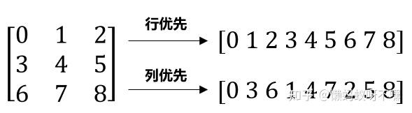

`M × N`의 `A(r, c)`의 행 우선 인덱스: `index = r * N + c`.

## 연산자 구현

### 1. 단순 구현

가장 단순한 transpose는 **각 block이 `A`의 한 구역을 담당, 각 thread가 원소 하나를 담당**. block이 담당하는 분할을 **tile** 이라 합니다. blockIdx, threadIdx → 행렬 `A`의 index 변환이 핵심.

CUDA에선 2D grid·block으로 2D 행렬을 병렬 처리. `(gridDim.x, gridDim.y)`, `(blockDim.x, blockDim.y)`. thread당 원소 하나면 tile = block.

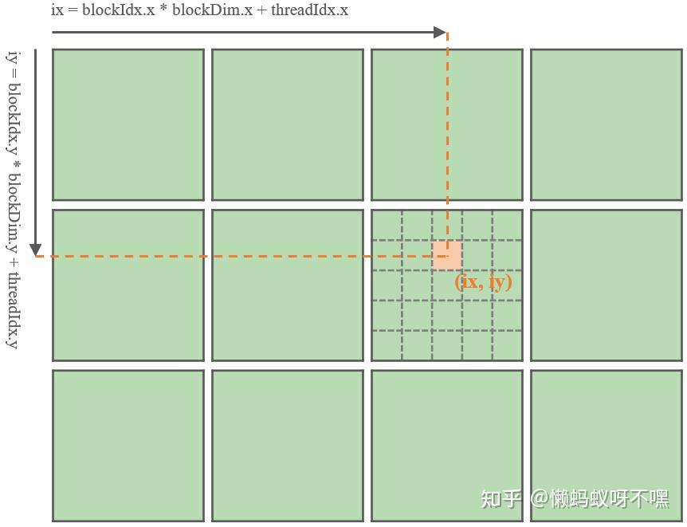

thread 좌표 `(ix, iy)`:

```
ix = blockIdx.x · blockDim.x + threadIdx.x
iy = blockIdx.y · blockDim.y + threadIdx.y
```

`(ix, iy)` → `(r, c)` 매핑은 두 가지:

1. `iy = r, ix = c`: `A[iy*N + ix]` 읽고 `B[ix*M + iy]`에 쓰기. → **NaiveRow**
2. `ix = r, iy = c`: `A[ix*N + iy]` 읽고 `B[iy*M + ix]`에 쓰기. → **NaiveCol**

CUDA의 2D block thread는 행 우선 정렬(같은 행 = `threadIdx.y` 동일). 연속한 32 thread가 한 warp(SIMT).

warp 구성에 따르면 NaiveRow는 같은 행의 thread가 `A`의 연속 원소를 **행으로 읽고** `B`의 비연속 위치에 **열로 씀**. NaiveCol은 `A`의 비연속 원소를 **열로 읽고** `B`의 연속 위치에 **행으로 씀**.

```cuda
// NaiveRow
__global__ void transposeNaiveRow(float* A, float* B, const int M, const int N) {
    int ix = blockIdx.x * blockDim.x + threadIdx.x;
    int iy = blockIdx.y * blockDim.y + threadIdx.y;
    if (iy < M && ix < N) B[ix * M + iy] = A[iy * N + ix];
}

// NaiveCol
__global__ void transposeNaiveCol(float* A, float* B, const int M, const int N) {
    int ix = blockIdx.x * blockDim.x + threadIdx.x;
    int iy = blockIdx.y * blockDim.y + threadIdx.y;
    if (iy < N && ix < M) B[iy * M + ix] = A[ix * N + iy];
}
```

**Naive 구현에서 block 크기 선택**

NaiveRow/NaiveCol 둘 다 global memory R/W만 있어 패턴이 비슷합니다. 최적 block 크기를 정하려면 global memory 접근 모델을 이해해야 합니다.

(1) global memory 접근은 **memory transaction** 단위.

- 한 transaction은 32, 64, 128 byte 입자
- 자연 정렬 필수. 32 byte transaction은 `0~31`, `32~63` 같은 구간만 가능

(2) 같은 warp의 thread가 global memory 명령을 실행할 때 CUDA가 데이터 분포·위치에 따라 thread별 접근을 1개 이상 transaction으로 **합칩니다(coalesce)**.

warp 내 thread당 float(4 byte) 1개, transaction 32 byte 가정의 접근 패턴들:

1. **정렬·연속**: 32 thread 총 128 byte → 4 transaction, 활용률 100%.
   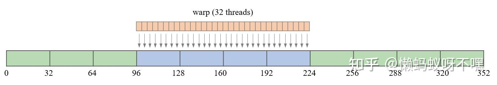
   인접 thread가 연속이 아니더라도 warp 전체가 정렬·연속이면 여전히 4 transaction, 100%.
   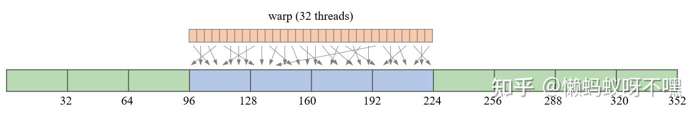
2. **비정렬·연속**: 5 transaction, 활용률 128/160 = 80%.
   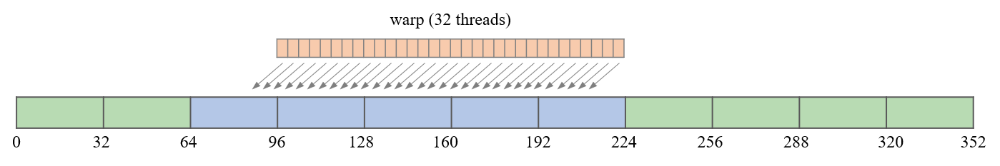
3. **모두 같은 주소**: 1 transaction, 활용률 12.5%.
   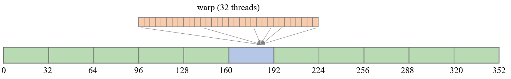
4. **흩어진 접근**: 최악 32 transaction, 활용률 12.5%.
   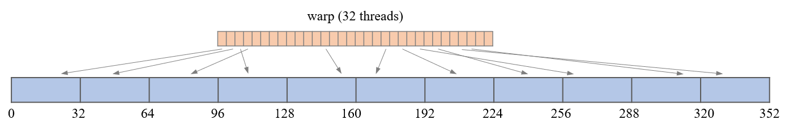

global memory 효율을 위해 **warp의 메모리 요청을 최대한 합쳐 transaction 수를 줄이는 것** 이 핵심.

**이제 Naive에서 block 크기 선택**

[B62](../B62_element_wise_detail/README.md)에서도 다뤘듯 block당 thread 수는 128 또는 256이 좋습니다. 여기선 256으로 잡고, 2D block의 차원 배분 후보는 `(1, 256), (2, 128), (4, 64), (8, 32), (16, 16), (32, 8), (64, 4), (128, 2), (256, 1)`.

성능 분석은 memory transaction 관점. 메모리 transaction 입자는 GPU의 compute capability에 따라 다릅니다. CUDA C++ Best Practices Guide 12.8에 따르면:

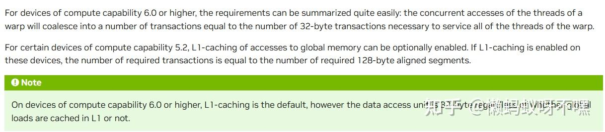

> Compute Capability 5.2에선 L1 사용 시 128B, 미사용 시 32B. 6.0 이상은 일률 32B.

본 글의 분석은 RTX 4060 Ti(8.9)이라 **transaction = 32 byte**.

NaiveRow에서 `block(2, 128)` vs `block(8, 32)`:

- `block(2, 128)`: warp `(2, 16)`. x축 2 thread가 인접한 2 float(8B) 읽기 → 1 transaction, 그런 그룹이 16개 → 16개 read transaction. y축 16 thread가 인접한 16 float(64B) 쓰기 → 2 transaction × 2 = **4 write transaction**.
- `block(8, 32)`: warp `(8, 4)`. x축 8 thread가 인접 8 float(32B) → 1 transaction × 4 = **4 read transaction**. y축 4 thread가 인접 4 float(16B) → 1 transaction × 8 = **8 write transaction**.

`block(8, 32)`가 NaiveRow 기준 트랜잭션이 더 적습니다(이론). 모든 후보의 분석:

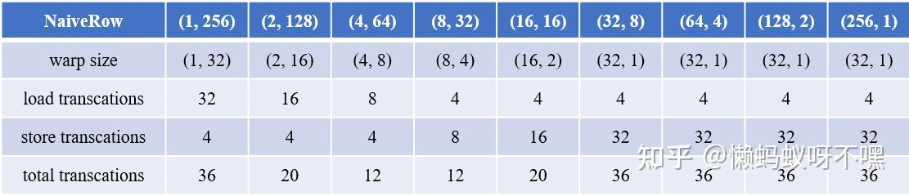
*NaiveRow*

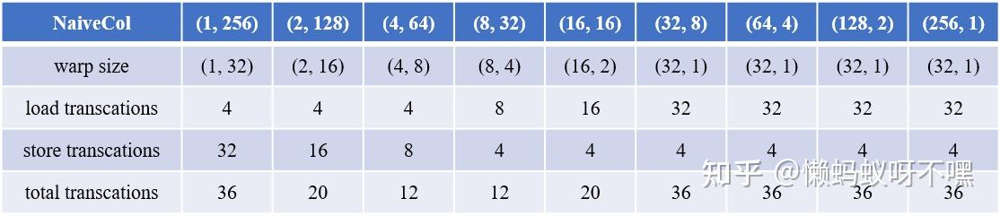
*NaiveCol*

이론적 결론:

- `(4, 64)`, `(8, 32)`가 transaction 최소 → 성능 최상
- `(32, 8), (64, 4), (128, 2), (256, 1)`은 동일 transaction → 성능 비슷

Nsight Compute로 실측한 결과(이론과 일치):

> M = N = 9600, RTX 4060 Ti (CC 8.9), CUDA 12.8

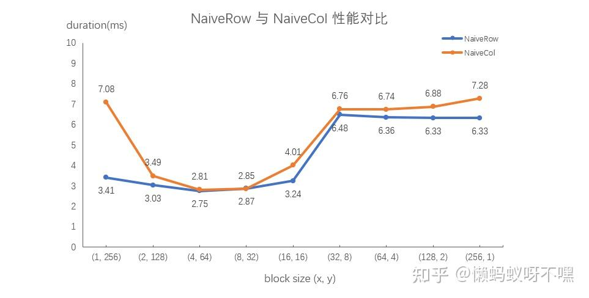

> 다른 자료에선 NaiveCol이 NaiveRow보다 보통 더 빠르다고 합니다. 비합쳐 읽기를 CUDA 캐시가 보강하고 합쳐 쓰기와 결합되기 때문. 그러나 본 실험에선 NaiveRow가 더 빨라 의문이 남습니다. 추측은 CUDA 캐시 변화 — 후속 답을 찾으면 갱신.

결론: **Naive 구현에선 block (4, 64) 또는 (8, 32) 선택**

| block size | duration (ms) |
| --- | --- |
| NaiveRow `(4, 64)` | 2.75 |
| NaiveRow `(8, 32)` | 2.87 |
| NaiveCol `(4, 64)` | 2.81 |
| NaiveCol `(8, 32)` | 2.85 |

### 2. thread 하나가 여러 원소 담당

block 크기 ≠ tile 크기로 분리. `A`의 tile 크기 `(Bm, Bn)`, block 크기 `(bx, by)`, NaiveCol 매핑(x축 행, y축 열). thread당 원소 수 = `(Bm/bx) · (Bn/by)`.

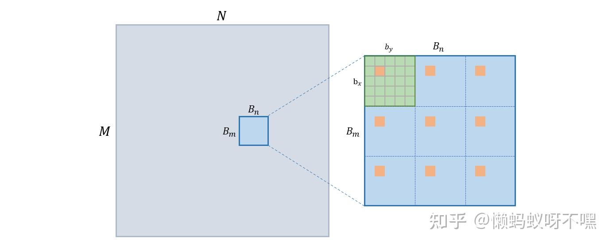

핵심: **block 하나가 tile 하나, block의 각 thread가 여러 원소 transpose**. 예시처럼 `Bm/bx = 3, Bn/by = 3`이면 thread 하나가 9개 원소(주황 격자). block이 tile 위를 2D 컨볼루션 형식으로 훑는 것과 비슷 — x stride `bx`, y stride `by`. ([B62](../B62_element_wise_detail/README.md)의 Grid-Stride Loops와 유사)

코드. tile 좌상단 `(r0, c0) = (blockIdx.x·Bm, blockIdx.y·Bn)`. 이중 루프로 thread 담당 원소 좌표 순회.

```cuda
template<int Bm, int Bn>
__global__ void transposeColNelements(float* A, float* B, const int M, const int N) {
    int r0 = blockIdx.x * Bm;
    int c0 = blockIdx.y * Bn;

#pragma unroll
    for (int x = threadIdx.x; x < Bm; x += blockDim.x) {
        int r = r0 + x;
        if (r >= M) break;
#pragma unroll
        for (int y = threadIdx.y; y < Bn; y += blockDim.y) {
            int c = c0 + y;
            if (c < N) B[c * M + r] = A[r * N + c];
        }
    }
}
```

**ColNelements의 tile·block 크기 선택**

ColNelements의 block 단위 계산은 NaiveCol과 동일(여러 번 반복할 뿐) → block은 여전히 `(4, 64)` 또는 `(8, 32)`. tile `(Bm, Bn)`은 `Bm ≥ bx`, `Bn ≥ by`. thread당 4개 정도가 합리적이라 후보는:

1. tile `(16, 64)`, block `(4, 64)`
2. tile `(32, 32)`, block `(8, 32)`

| block size | duration (ms) |
| --- | --- |
| ColNelements `<16, 64>` `(4, 64)` | 3.00 |
| ColNelements `<32, 32>` `(8, 32)` | 2.99 |

### 3. Shared Memory

이상적 합쳐 R/W는 transaction 4개로 끝나는 것. 하지만 앞 분석에선 최고 설정에서도 R 또는 W가 8 transaction이 나옵니다. 본질적 이유: transpose는 행렬을 행·열 교환하기에 접근 방향이 불일치해 합쳐지지 않음. 이걸 **shared memory** 로 우회해 R·W 둘 다 연속 접근으로 만들 수 있습니다.

**shared memory란?**

shared memory는 on-chip 메모리로 개발자가 관리합니다. block 전체에 보이며 같은 block의 thread들은 같은 shared memory에 접근 가능. global보다 대역폭 높고 지연 낮아 캐시 역할로 global 접근을 줄임.

**transpose에서 shared memory 활용 흐름**

- A를 **행으로 읽고** shared memory에 **행으로 씀**
- shared memory를 **열로 읽고** B에 **행으로 씀**

A·B 둘 다 global에서 행 단위 접근이므로 각 warp의 128 byte R/W가 4 transaction에 합쳐져 활용률 100%.

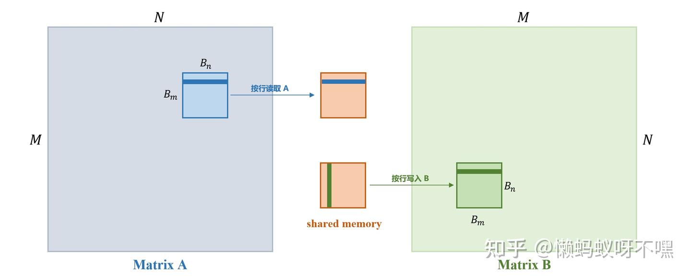

**shared memory 크기 `(Sm, Sn)` 설정**

shared memory는 임시 저장소. block의 tile 크기 이상이면 됨. 낭비를 줄이려 `Sm = Bm, Sn = Bn`.

thread당 4개 원소 유지하면서 256-thread block은 여전히 1024 원소 tile 담당. global 접근이 한 방향으로 통일됐으니 tile 설정은 shared memory의 특성에서. 고대역폭을 위해 shared memory는 물리적으로 32개 bank로 나뉘고 동시에 접근 가능. Maxwell(5.x)부터 bank 폭 32 bit = float 하나. 따라서 tile·shared `(32, 32)`가 합리적.

또 A·B의 global 접근이 4 transaction에 합쳐지려면 warp 32 thread가 **연속한 32 float** 에 접근해야 함. tile `(32, 32)`이면 block `(32, 8)`. x축의 연속 32 thread가 한 warp → 32 연속 float 접근.

**알고리즘의 좌표 변환**

- A 좌표계 `A[r, c]`, `0 ≤ r < M, 0 ≤ c < N`
- B 좌표계 `B[r, c]`, `0 ≤ r < N, 0 ≤ c < M`
- A 분할(tile) 좌표 `T_A[r, c]`, `0 ≤ r < Bm, 0 ≤ c < Bn`
- B 분할 좌표 `T_B[r, c]`, `0 ≤ r < Bn, 0 ≤ c < Bm`
- shared memory 좌표 `S[r, c]`

**(1) 읽기 단계**

A에서 행 방향 연속 적재 → shared에 행 방향 쓰기.

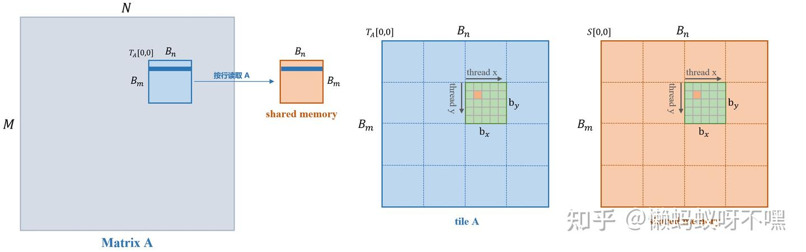
*읽기 단계*

block의 x축이 A의 열, y축이 A의 행. thread당 여러 원소. block이 tile을 2D 컨볼루션처럼 훑음. `S[0, 0] = A[blockIdx.y·Bm, blockIdx.x·Bn]`.

shared 쓰기도 행 방향이므로 block의 x축이 shared의 열, y축이 행:

```
S[y, x] = T_A[y, x] = A[blockIdx.y·Bm + y, blockIdx.x·Bn + x]
```

```cuda
__shared__ float tile[Bm][Bn];

int r0 = blockIdx.y * Bm;
int c0 = blockIdx.x * Bn;

#pragma unroll
for (int y = threadIdx.y; y < Bm; y += blockDim.y) {
    int r = r0 + y;
    if (r >= M) break;
#pragma unroll
    for (int x = threadIdx.x; x < Bn; x += blockDim.x) {
        int c = c0 + x;
        if (c < N) tile[y][x] = A[r * N + c];
    }
}

__syncthreads();
```

`__syncthreads()`로 block 모든 thread의 읽기 완료를 보장한 뒤에야 transpose 진행.

**(2) 쓰기 단계**

shared를 열로 읽고 B에 행으로 씀.

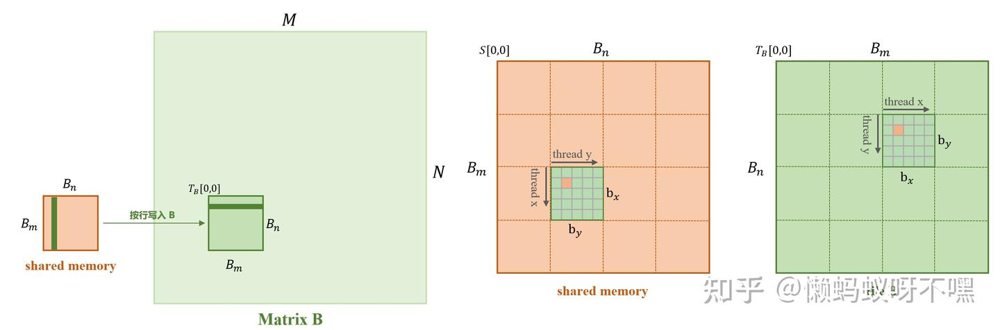
*쓰기 단계*

block의 x축이 B의 열, y축이 B의 행. shared는 열로 읽으니 block의 x축이 shared의 행, y축이 shared의 열:

```
B[blockIdx.x·Bn + y, blockIdx.y·Bm + x] = T_B[y, x] = S[x, y]
```

```cuda
#pragma unroll
for (int y = threadIdx.y; y < Bn; y += blockDim.y) {
    int c = c0 + y;
    if (c >= N) break;
#pragma unroll
    for (int x = threadIdx.x; x < Bm; x += blockDim.x) {
        int r = r0 + x;
        if (r < M) B[c * M + r] = tile[x][y];
    }
}
```

전체 `transposeShared`:

```cuda
template<int Bm, int Bn>
__global__ void transposeShared(float* A, float* B, const int M, const int N) {
    __shared__ float tile[Bm][Bn];

    int r0 = blockIdx.y * Bm;
    int c0 = blockIdx.x * Bn;

#pragma unroll
    for (int y = threadIdx.y; y < Bm; y += blockDim.y) {
        int r = r0 + y;
        if (r >= M) break;
#pragma unroll
        for (int x = threadIdx.x; x < Bn; x += blockDim.x) {
            int c = c0 + x;
            if (c < N) tile[y][x] = A[r * N + c];
        }
    }

    __syncthreads();

#pragma unroll
    for (int y = threadIdx.y; y < Bn; y += blockDim.y) {
        int c = c0 + y;
        if (c >= N) break;
#pragma unroll
        for (int x = threadIdx.x; x < Bm; x += blockDim.x) {
            int r = r0 + x;
            if (r < M) B[c * M + r] = tile[x][y];
        }
    }
}
```

### 4. Bank Conflict 해결

shared memory의 핵심 특성: 32개 bank로 나뉘어 동시 접근 가능. *"동시"* 는 warp의 32 thread가 서로 다른 bank의 데이터를 접근할 때 1 transaction으로 끝남.

**bank 분할 방식** (Compute Capability 5.x 이상, 각 bank 폭 32 bit, 32개)

shared memory는 1차원 주소 공간이며, 연속한 32 × 32 bit (4 byte) 가 bank 32개에 매핑:

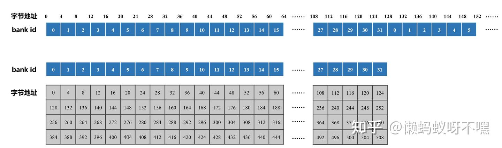

매핑: `bank_id = (byte_address / 4) % 32`.

**3가지 접근 모드**

(1) **병렬 접근**: 32 thread가 서로 다른 bank → 1 transaction.
   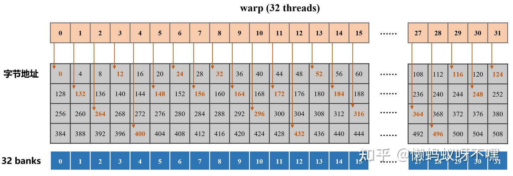
   인접 thread가 연속 bank 아니어도 warp 전체가 다른 bank면 동시 진행.
   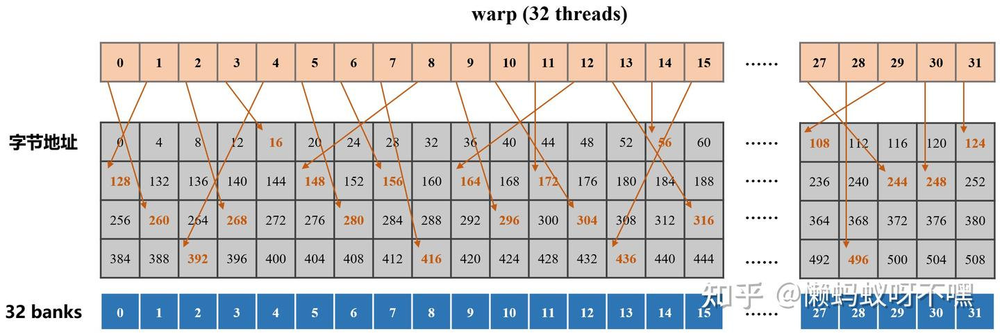
(2) **직렬 접근(Bank Conflict)**: 여러 thread가 **같은 bank의 다른 주소** 에 접근. 직렬화되어 여러 transaction.
   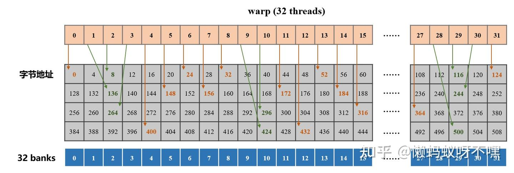
(3) **방송 접근**: 여러 thread가 **같은 bank의 같은 주소** → boardcast, 추가 transaction 없음.
   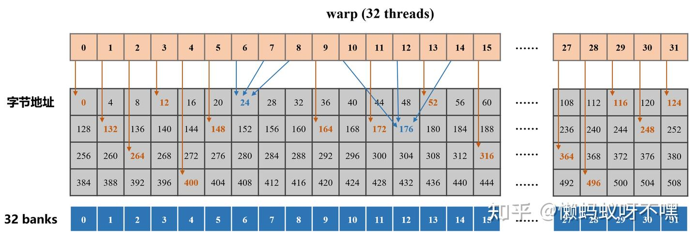

**transposeShared의 bank conflict**

`(32, 32)` shared, `(32, 8)` block. 읽기는 행 단위라 conflict 없음. **쓰기 단계** 에선 shared를 열 단위로 읽으므로 warp 32 thread가 모두 같은 bank의 서로 다른 원소 → **32-way bank conflict**. Nsight Compute가 이를 shared load에서 확인.

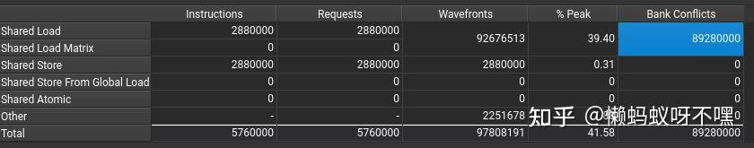

**해결책 (1): shared memory 오른쪽 패딩**

shared 크기를 `(32, 33)`으로 변경. 마지막 열은 사용 안 함:

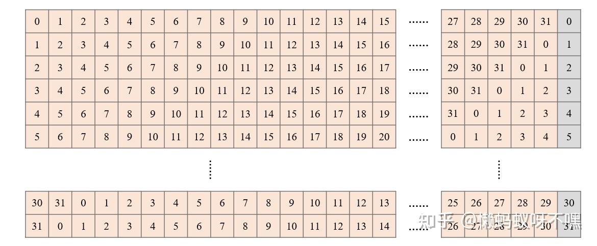

행으로 쓰든 열로 읽든 warp의 32 thread가 모두 다른 bank → conflict 없음.

```cuda
__shared__ float tile[Bm][Bn + 1];
```

Nsight Compute 분석에서도 bank conflict 사라짐:

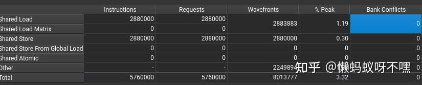
*transposeSharedPadding*

장점: 간단·이해 쉬움.
단점:
1. shared 사용량 증가 → SM당 최대 동시 block 수 감소 → occupancy 하락
2. padding으로 주소 비정렬 → `float4` 같은 벡터화 접근 시 오류 가능

**해결책 (2): 데이터 재배치 (Swizzling)**

목적: `(32, 32)` shared의 **각 행·각 열의 32 원소가 각각 다른 32 bank에 분포** 하도록.

> 스도쿠처럼 `(32, 32)` 격자에 0~31을 배치하되 같은 행·열에 중복이 없도록.

bank 분할은 고정이라 데이터를 재배치합니다.

- **논리 좌표** `(r_l, c_l)`: 행렬상 위치
- **물리 좌표** `(r_p, c_p)`: shared에 실제 저장된 위치

매핑 함수 `f`는 다음 조건:

- 1-1 대응
- 매핑 후 r, c 범위 불변

swizzling 함수:

```
r_p = r_l
c_p = c_l ⊕ r_l   (XOR)
```

> 증명: [B18 CUDA shared memory swizzling 분석](../B18_cuda_smem_bank_conflict_swizzle/README.md)

좌표 비교(처음 6행):

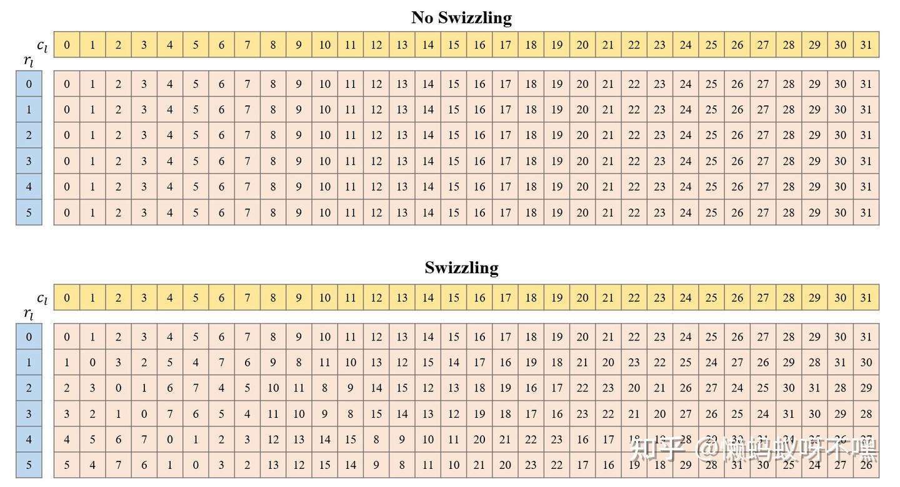

각 격자 숫자는 물리 열 `c_p` 겸 bank id. 행마다·열마다 32 원소가 32 bank에 분포 → conflict 없음.

코드에선 shared 인덱스만 수정. 읽기 단계 `tile[y][x]` → `tile[y][x^y]`, 쓰기 단계 `tile[x][y]` → `tile[x][x^y]`.

```cuda
template<int Bm, int Bn>
__global__ void transposeSharedSwizzling(float* A, float* B, const int M, const int N) {
    __shared__ float tile[Bm][Bn];

    int r0 = blockIdx.y * Bm;
    int c0 = blockIdx.x * Bn;

#pragma unroll
    for (int y = threadIdx.y; y < Bm; y += blockDim.y) {
        int r = r0 + y;
        if (r >= M) break;
#pragma unroll
        for (int x = threadIdx.x; x < Bn; x += blockDim.x) {
            int c = c0 + x;
            if (c < N) tile[y][x ^ y] = A[r * N + c];
        }
    }

    __syncthreads();

#pragma unroll
    for (int y = threadIdx.y; y < Bn; y += blockDim.y) {
        int c = c0 + y;
        if (c >= N) break;
#pragma unroll
        for (int x = threadIdx.x; x < Bm; x += blockDim.x) {
            int r = r0 + x;
            if (r < M) B[c * M + r] = tile[x][x ^ y];
        }
    }
}
```

추가 shared 공간 없이 conflict 해결 — 더 우아한 해결책.

Nsight Compute 분석:

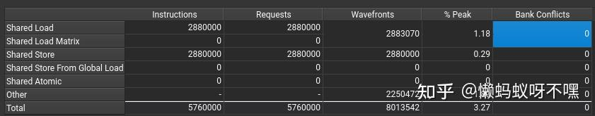
*transposeSharedSwizzling*

성능 비교 (M = N = 9600, RTX 4060 Ti, CUDA 12.8):

| 방법 | block size | duration (ms) |
| --- | --- | --- |
| Shared `<32, 32>` | `(32, 8)` | 3.01 |
| SharedPadding `<32, 32>` | `(32, 8)` | 3.08 |
| SharedSwizzling `<32, 32>` | `(32, 8)` | 3.13 |

> 결과상 conflict 있는 쪽이 약간 더 빠른 것은 GPU 최적화의 영향으로 보이며 정확한 해석은 못 찾음.

**루프 언롤**

이중 루프와 템플릿 인자 `Bm, Bn`로 작성했지만 합리적 tile/block을 정한 이상 루프 횟수가 결정되므로 풀어 쓰면 성능이 더 좋아질 수 있습니다.

```cuda
__global__ void transposeSharedSwizzlingUnroll(float* A, float* B, const int M, const int N) {
    __shared__ float tile[32][32];

    int r0 = blockIdx.y * 32;
    int c0 = blockIdx.x * 32;

    int y = threadIdx.y;
    int r = r0 + y;
    int c = c0 + threadIdx.x;
    if (c >= N) return;

    if (r < M) tile[y][threadIdx.x ^ y] = A[r * N + c];

    y += blockDim.y; r += blockDim.y;
    if (r < M) tile[y][threadIdx.x ^ y] = A[r * N + c];

    y += blockDim.y; r += blockDim.y;
    if (r < M) tile[y][threadIdx.x ^ y] = A[r * N + c];

    y += blockDim.y; r += blockDim.y;
    if (r < M) tile[y][threadIdx.x ^ y] = A[r * N + c];

    __syncthreads();

    r = r0 + threadIdx.x;
    if (r >= M) return;

    y = threadIdx.y;
    c = c0 + y;
    if (c < N) B[c * M + r] = tile[threadIdx.x][threadIdx.x ^ y];

    y += blockDim.y; c += blockDim.y;
    if (c < N) B[c * M + r] = tile[threadIdx.x][threadIdx.x ^ y];

    y += blockDim.y; c += blockDim.y;
    if (c < N) B[c * M + r] = tile[threadIdx.x][threadIdx.x ^ y];

    y += blockDim.y; c += blockDim.y;
    if (c < N) B[c * M + r] = tile[threadIdx.x][threadIdx.x ^ y];
}
```

| 방법 | block size | duration (ms) |
| --- | --- | --- |
| SharedUnroll | `(32, 8)` | 3.05 |
| SharedPaddingUnroll | `(32, 8)` | 3.02 |
| SharedSwizzlingUnroll | `(32, 8)` | 3.01 |

## 추가 성능 평가

4060 Ti 결과가 일부 이론과 어긋나 옛 노트북 GTX 960M(CC 5.0)도 시도:

> M = N = 9600, GTX 960M (CC 5.0), CUDA 12.1

| 방법 | block size | duration (ms) |
| --- | --- | --- |
| NaiveRow | `(8, 32)` | 21.57 |
| NaiveCol | `(8, 32)` | 16.31 |
| ColNelements `<16, 64>` | `(4, 64)` | 11.20 |
| ColNelements `<32, 32>` | `(8, 32)` | 15.78 |
| Shared `<32, 32>` | `(32, 8)` | 22.27 |
| SharedPadding `<32, 32>` | `(32, 8)` | 19.81 |
| SharedSwizzling `<32, 32>` | `(32, 8)` | 19.65 |
| SharedUnroll | `(32, 8)` | 18.87 |
| SharedPaddingUnroll | `(32, 8)` | 7.73 |
| SharedSwizzlingUnroll | `(32, 8)` | 7.67 |

GTX 960M 결과는 이론과 부합:

- NaiveCol > NaiveRow
- thread당 여러 원소가 더 빠름
- bank conflict 해결 후 더 빠름
- 루프 언롤 효과 큼

## cuBLAS와 비교

cuBLAS의 `cublasSgeam`을 transpose에 사용. `cublasSgeam`은 `C = α · op(A) + β · op(B)`.

```
op(A) =  A     if transa == CUBLAS_OP_N
       Aᵀ     if transa == CUBLAS_OP_T
       Aᴴ     if transa == CUBLAS_OP_H
```

```cpp
cublasStatus_t cublasSgeam(cublasHandle_t handle,
                          cublasOperation_t transa,
                          cublasOperation_t transb,
                          int m, int n,
                          const float *alpha,
                          const float *A, int lda,
                          const float *beta,
                          const float *B, int ldb,
                          float *C, int ldc);
```

transpose: A에 `CUBLAS_OP_T`, B는 `nullptr`, α=1, β=0.

```cpp
cublasSgeam(handle, CUBLAS_OP_T, CUBLAS_OP_N, N, M, &alpha, d_A, M, &beta, nullptr, N, d_B, N);
```

| GPU | duration (ms) |
| --- | --- |
| RTX 4060 Ti | 3.01 |
| GTX 960M | 11.21 |

본 글의 최적 결과가 cuBLAS보다 빠릅니다!

## 마무리

transpose 연산자의 분석·구현은 여기까지입니다. 약 2만 자라 *"상세"* 라 할 만하네요. 코드는 GitHub에 업로드.

## 참고 자료

- OneFlow: CUDA Kernel의 grid_size, block_size를 어떻게 설정할까?
- CUDA C++ Best Practices Guide 12.9
- 后来: CUDA 공유 메모리 및 분산 공유 메모리
- frankshi: CUDA shared memory swizzling 해석
- An Efficient Matrix Transpose in CUDA C/C++ | NVIDIA Technical Blog
- 孤獨代碼: CUDA 행렬 전치 최적화
