# CUDA reduce 연산자 상세

> 원문: https://zhuanlan.zhihu.com/p/1905661893739283464

**목차**
- 개념
- 표기
- 구현 흐름
- 테스트 환경
- 연산자 구현
  - 1. reduce0: 단순 구현
  - 2. reduce0.5: 나머지 연산 최적화
  - 3. reduce1: warp divergence 해결
  - 4. reduce2: bank conflict 해결
  - 5. reduce3: 데이터 읽으며 한 번 덧셈
  - 6. reduce4: 마지막 warp는 warp shuffle로 합산
  - 7. reduce5: 루프 완전 언롤
  - 8. reduce6: block 하나가 `n * block_size`개 원소
  - 9. reduce6_vec4: 벡터화 접근
  - 10. reduce7: WarpReduce로 BlockReduce 구현
- 마무리
- 참고 자료

## 개념

reduce(축약) 연산은 집합(리스트, 배열 등)의 원소를 이항 연산자로 반복 적용해 하나의 출력으로 모으는 과정입니다.

```
x = x₀ ⊗ x₁ ⊗ x₂ ⊗ ... ⊗ xₙ
```

`⊗`는 합, 곱, 최댓값 등의 이항 연산. 식에서 보듯 연산 강도가 낮아 사실상 원소당 한 번의 계산. 그래서 CUDA로 구현할 때는 **메모리 접근 효율** 이 핵심.

본 글은 N개의 `float` 원소의 합 reduce 최적화를 다룹니다.

> NVIDIA cuda-samples의 reduction 프로젝트를 주로 참고하고 일부 수정.

## 표기

- `A`: reduce 대상의 1차원 텐서
- `N`: 원소 수
- `block_size`: block당 thread 수 (1차원, 32의 배수)
- `grid_size`: grid당 block 수 (1차원)

## 구현 흐름

핵심: **각 block이 한 구역의 reduce를 담당, 커널을 여러 번 실행해 최종 결과 도출**.

**BlockReduce**

block이 담당 구역의 reduce를 수행. 이항 연산이고 보통 교환·결합 법칙을 만족하니 둘씩 합쳐 나가는 트리 구조로 계산.

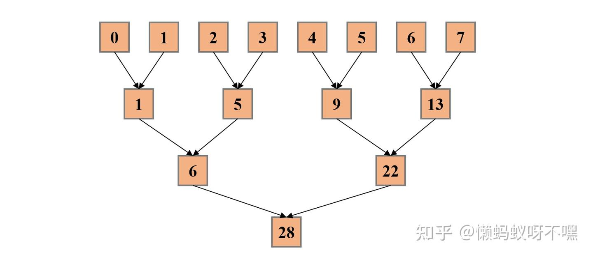
*BlockReduce*

**커널 여러 번 실행**

BlockReduce는 block 내부만 모으므로 전역 결과를 얻으려면 여러 번 실행해야 합니다. 예: `N = 2048`, block당 32개 원소면 3단계 — (1) 64 block으로 2048 → 64, (2) 2 block으로 64 → 2, (3) 1 block으로 2 → 1.

여러 단계 모두 BlockReduce 호출이라 BlockReduce 최적화만 다루면 됩니다.

## 테스트 환경

- 텐서 크기: N = 16 × 1024 × 1024
- GPU: NVIDIA GeForce RTX 4060 Ti (CC 8.9)
- CUDA: 12.8

## 연산자 구현

### 1. reduce0: 단순 구현

가장 단순한 형태: **block 하나가 `block_size`개 원소 담당**. 원소 수 = thread 수.

**shared memory로 대역폭 향상**

트리형 BlockReduce에선 R/W 횟수가 매우 많아 global memory는 느립니다. block이 담당 원소를 shared memory에 옮긴 뒤 계산. **shared 배열 크기 = `block_size`**.

**thread당 한 원소**

원소 수 = thread 수라 1:1 대응. 단계:

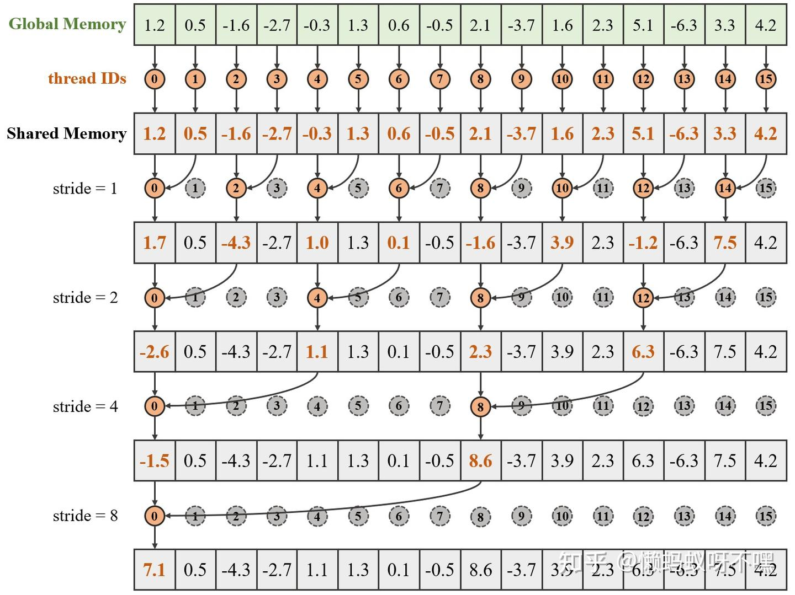
*reduce0*

- **step1**: 각 thread가 global → shared 적재
- **step2**: 트리형 합산. stride를 1씩 두 배로 늘려가며 진행

step1 — global 인덱스 `blockDim.x * blockIdx.x + threadIdx.x` → shared의 `tid` 위치.

step2 — 매 반복마다 thread가 두 원소를 합산. `stride`는 시작 1, 매번 두 배, 조건 `stride < block_size`:

```cuda
for (int stride = 1; stride < block_size; stride <<= 1) {
    // body
}
```

매 반복의 **유효 thread** 와 담당 원소:

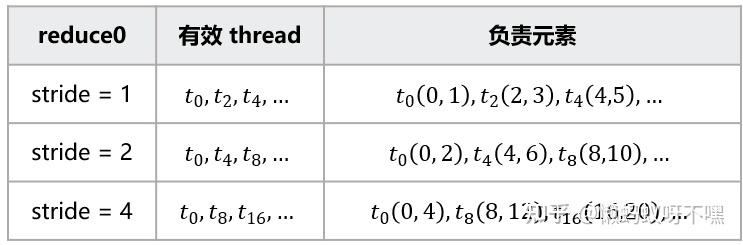

- 유효 `tid % (2·stride) == 0`
- `tid` thread가 `(tid, tid+stride)` 합산해 `tid`에 저장

```cuda
__global__ void reduce0(float* d_A, const int N) {
    extern __shared__ float data[];
    int tid = threadIdx.x;
    int index = blockDim.x * blockIdx.x + threadIdx.x;
    data[tid] = index < N ? d_A[index] : 0.f;
    __syncthreads();

    for (int s = 1; s < blockDim.x; s <<= 1) {
        if ((tid % (s * 2)) == 0) data[tid] += data[tid + s];
        __syncthreads();
    }

    if (tid == 0) d_A[blockIdx.x] = data[0];
}
```

세부 사항:

- block의 담당 원소 수가 `block_size`보다 적은 경우(마지막 block)는 잉여 위치를 0으로 초기화
- shared 적재 후, 매 단계 후 `__syncthreads()`
- 결과는 shared `[0]` → global 첫 위치에 기록. 입력 배열을 재사용하지 않아도 되면 별도 출력 배열을 두는 게 깔끔하지만 본문은 입력 배열의 앞 `grid_size` 원소를 재활용

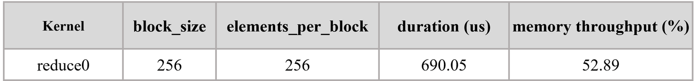

### 2. reduce0.5: 나머지 연산 최적화

`tid % (stride * 2) == 0`은 매우 비싼 연산입니다. 나머지 연산은 단일 명령이 아니라 나눗셈 기반이라 cycle을 많이 소모.

`stride * 2`는 2의 거듭제곱이라 `a % b`를 `a & (b - 1)` 로 대체 가능. 즉 `(tid & (stride * 2 - 1)) == 0`.

이 한 줄만 바꿔도 **처리량이 30% 향상**.

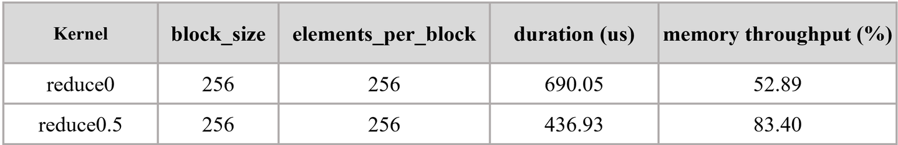

### 3. reduce1: warp divergence 해결

reduce0의 유효 thread는 비연속이라 warp divergence 발생. 첫 단계에선 짝수 tid만 일함. 비활성 thread가 else를 실행하지는 않지만 warp 실행 시간엔 영향 없으므로 가급적 divergence를 줄이자.

연속한 thread가 일하도록 바꿉니다.

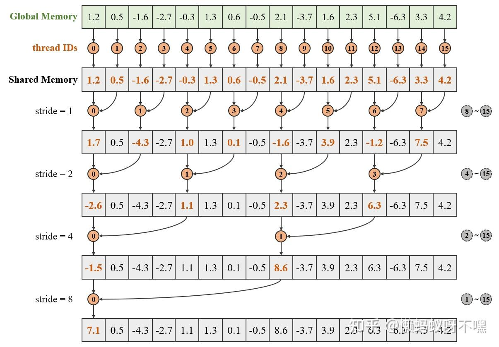
*reduce1*

표:

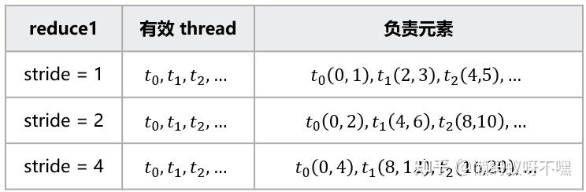

- 유효 thread 연속
- thread `tid`의 첫 원소 인덱스 `index = tid * 2 * stride`, 둘째 `index + stride`
- 조건 `index + stride < block_size` → `block_size`가 32 배수면 `index < block_size`로 충분

```cuda
__global__ void reduce1(float* d_A, const int N) {
    extern __shared__ float data[];
    int tid = threadIdx.x;
    int i = blockDim.x * blockIdx.x + threadIdx.x;
    data[tid] = i < N ? d_A[i] : 0.f;
    __syncthreads();

    for (int s = 1; s < blockDim.x; s <<= 1) {
        int index = tid * s * 2;
        if (index < blockDim.x) data[index] += data[index + s];
        __syncthreads();
    }

    if (tid == 0) d_A[blockIdx.x] = data[0];
}
```

유효 thread 수가 32 미만일 때만 warp divergence 발생.

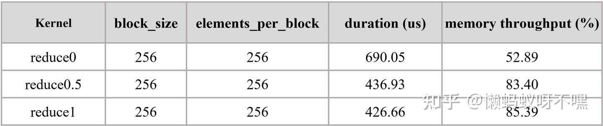

### 4. reduce2: bank conflict 해결

메모리 접근 관점. reduce는 global·shared 둘 다 씀. global의 최적은 정렬·연속, shared의 최적은 bank conflict 없음. ([B63 transpose](../B63_transpose_detail/README.md) 참고)

reduce1의 step1은 global·shared 모두 최적이지만, step2에선 연속 thread가 shared의 비연속 원소에 접근 → **bank conflict 발생**.

`stride = 1` 예: thread 0이 0번, thread 1이 2번, ... thread 0과 16이 같은 bank의 다른 위치(0번, 32번)에 접근 → 2-way bank conflict. 1과 17, 2와 18 등도 마찬가지. 두 원소 R, 합 W 모두 conflict 발생.

해결: warp의 32 thread가 32개 서로 다른 bank의 원소를 접근하게 함 → 연속 32 원소 접근. **stride를 큰 값부터 작게**.

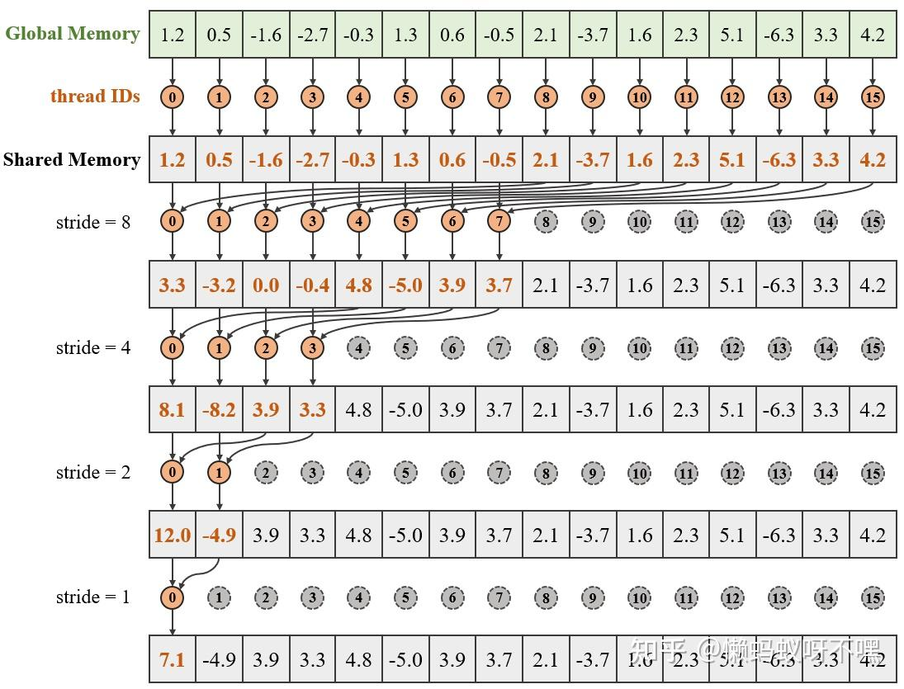
*reduce2*

```cuda
for (int stride = block_size >> 1; stride > 0; stride >>= 1) {
    // body
}
```

표:

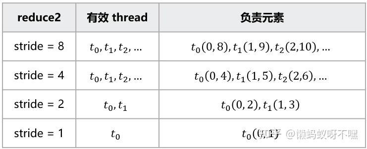

- 첫 원소 `tid`, 둘째 `tid + stride`
- `tid < stride`

```cuda
__global__ void reduce2(float* d_A, const int N) {
    extern __shared__ float data[];
    int tid = threadIdx.x;
    int i = blockDim.x * blockIdx.x + threadIdx.x;
    data[tid] = i < N ? d_A[i] : 0.f;
    __syncthreads();

    for (int s = blockDim.x >> 1; s > 0; s >>= 1) {
        if (tid < s) data[tid] += data[tid + s];
        __syncthreads();
    }

    if (tid == 0) d_A[blockIdx.x] = data[0];
}
```

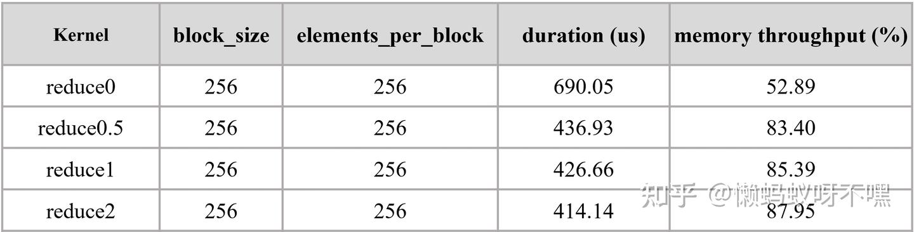

### 5. reduce3: 데이터 읽으며 한 번 덧셈

reduce2의 step1 후엔 절반의 thread가 그저 적재만 했지 계산엔 참여 안 함. 효율을 높이려 global 적재 시점에 모든 thread가 한 번씩 덧셈.

**block 하나가 `2 * block_size`개 원소 담당**:

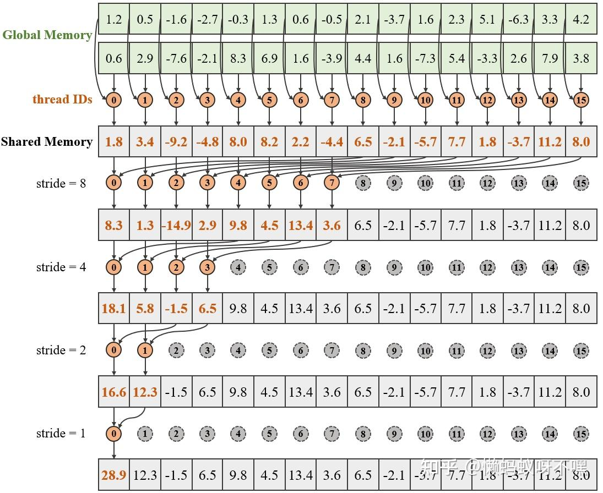
*reduce3*

step1에서 두 원소를 합쳐 shared에 저장 → **shared 크기는 여전히 `block_size`**, step2 코드 변동 없음.

global 정렬·연속 접근 유지를 위해 thread 둘의 간격을 `block_size`로. 첫 원소 `index = 2 * blockDim.x * blockIdx.x + threadIdx.x`, 둘째 `index + block_size`.

```cuda
__global__ void reduce3(float* d_A, const int N) {
    extern __shared__ float data[];
    int tid = threadIdx.x;
    int i = 2 * blockDim.x * blockIdx.x + threadIdx.x;

    float sum = i < N ? d_A[i] : 0.f;
    if (i + blockDim.x < N) sum += d_A[i + blockDim.x];
    data[tid] = sum;
    __syncthreads();

    for (int s = blockDim.x >> 1; s > 0; s >>= 1) {
        if (tid < s) data[tid] += data[tid + s];
        __syncthreads();
    }

    if (tid == 0) d_A[blockIdx.x] = data[0];
}
```

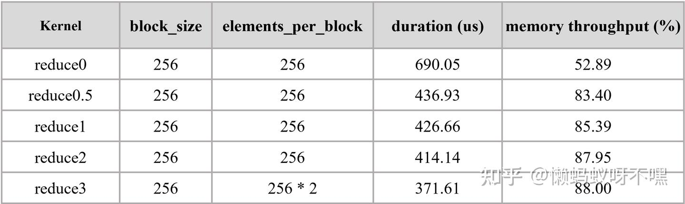

### 6. reduce4: 마지막 warp는 warp shuffle로 합산

warp shuffle은 CUDA 내장 함수(CC 5.0 이상). warp 내 thread 간 데이터 교환에 쓰이며, **shared memory 없이 직접 변수 교환** 가능해 효율적.

**Warp Shuffle Functions**

warp 내 thread는 lane(인덱스 0~`warpSize-1`)이라고도 부름. 네 가지 source-lane 주소 모드:

- `__shfl_sync()`: 지정 lane에서 직접 복사
- `__shfl_up_sync()`: 더 낮은 인덱스에서 복사
- `__shfl_down_sync()`: 더 높은 인덱스에서 복사
- `__shfl_xor_sync()`: 호출 lane id를 XOR한 lane에서 복사

active thread에서만 데이터 읽기 가능. inactive면 결과 정의되지 않음.

```cpp
T __shfl_sync(unsigned mask, T var, int srcLane, int width = warpSize);
T __shfl_up_sync(unsigned mask, T var, unsigned int delta, int width = warpSize);
T __shfl_down_sync(unsigned mask, T var, unsigned int delta, int width = warpSize);
T __shfl_xor_sync(unsigned mask, T var, int laneMask, int width = warpSize);
```

공통 인자:

- `mask`: 32-bit 정수. 참여 thread를 지정 (bit가 1이면 참여).
- `var`: 교환할 변수
- `width`: 기본 `warpSize`. warp를 그 크기 하위 그룹으로 분할. 2의 거듭제곱(1, 2, 4, 8, 16, 32).

각 함수의 동작:

- **`__shfl_sync(0xffffffff, x, 1, 32)`**: 모든 lane이 1번 lane의 x를 받음(broadcast).
  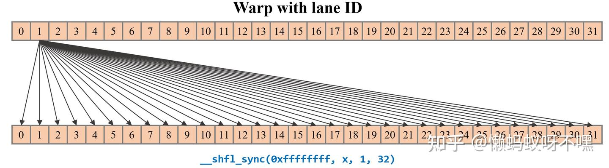
- **`__shfl_sync(0xffffffff, x, 1, 16)`**: 두 개의 width 16 하위 그룹, 각자 그룹의 1번 lane에서 x.
  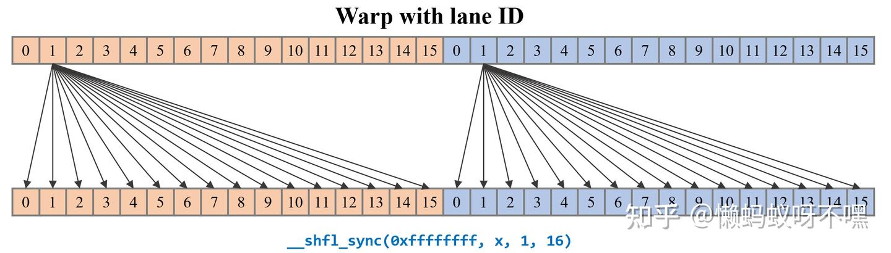
- **`__shfl_up_sync(0xffffffff, x, 2, 32)`**: lane id가 `laneID - 2`인 lane의 값. 앞 `delta`개는 그대로.
  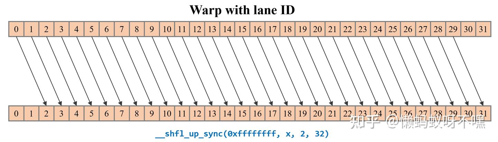
- **`__shfl_down_sync(0xffffffff, x, 2, 32)`**: `laneID + 2`. 마지막 `delta`개는 그대로.
  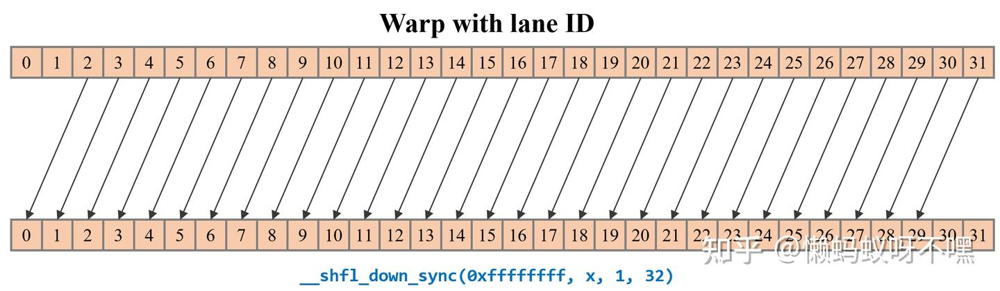
- **`__shfl_xor_sync(0xffffffff, x, 4, 32)`**: `laneID XOR 4`. 두 lane이 데이터 교환.
  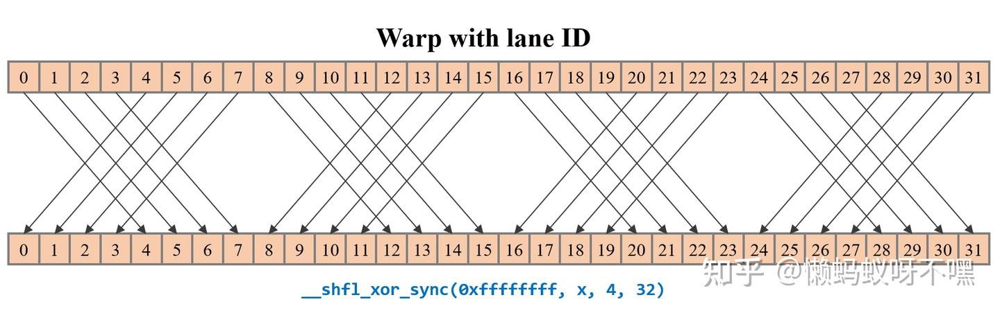

**WarpReduce**

shuffle로 warp 내 32 원소 합을 lane 0에 모으는 게 목표.

**(1) `__shfl_down_sync` 사용**

`delta`를 16, 8, 4, 2, 1로 줄이며 `val += __shfl_down_sync(0xffffffff, val, offset, 32)`. 합산은 후반이 전반으로 누적, 0번 lane에 최종 결과.

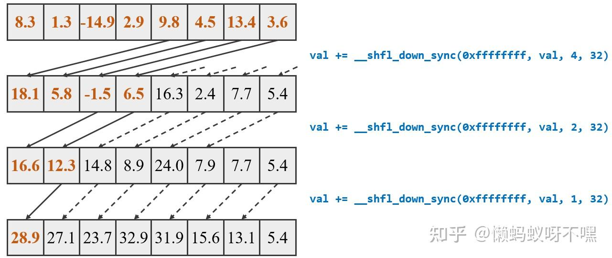
*`__shfl_down_sync`로 WarpReduce*

```cuda
template<int kWarpSize = WARP_SIZE>
__device__ __forceinline__ float warpReduce(float val) {
#pragma unroll
    for (int mask = kWarpSize >> 1; mask >= 1; mask >>= 1) {
        val += __shfl_down_sync(0xffffffff, val, mask);
    }
    return val;
}
```

**(2) `__shfl_xor_sync` 사용**

`laneMask`를 16, 8, 4, 2, 1로. 결과는 `__shfl_down_sync`와 같지만 **각 lane에 broadcast** 됨(XOR이 양방향이므로).

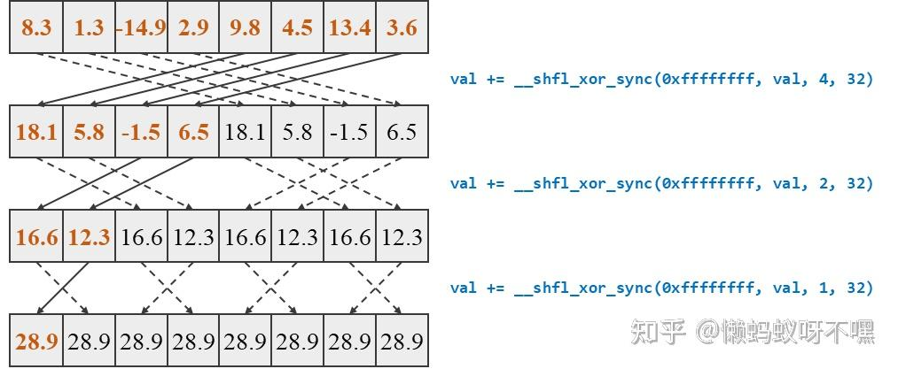
*`__shfl_xor_sync`로 WarpReduce*

```cuda
template<int kWarpSize = WARP_SIZE>
__device__ __forceinline__ float warpReduce(float val) {
#pragma unroll
    for (int mask = kWarpSize >> 1; mask >= 1; mask >>= 1) {
        val += __shfl_xor_sync(0xffffffff, val, mask);
    }
    return val;
}
```

**(3) Warp Reduce Functions**

CC 8.x부터 내장 `__reduce_*_sync` 함수가 있어 직접 warp reduce 수행. 다만 현재는 **정수** 형만 지원해 float에는 부적합.

**reduce4: 마지막 warp는 shuffle**

```cuda
__global__ void reduce4(float* d_A, const int N) {
    extern __shared__ float data[];
    int tid = threadIdx.x;
    int i = 2 * blockDim.x * blockIdx.x + threadIdx.x;

    float sum = i < N ? d_A[i] : 0.f;
    if (i + blockDim.x < N) sum += d_A[i + blockDim.x];
    data[tid] = sum;
    __syncthreads();

    for (int s = blockDim.x >> 1; s >= 32; s >>= 1) {
        if (tid < s) data[tid] = sum = sum + data[tid + s];
        __syncthreads();
    }

    if (tid < 32) sum = warpReduce<WARP_SIZE>(sum);
    if (tid == 0) d_A[blockIdx.x] = sum;
}
```

루프 조건 `s >= 32`로 바꾸고 마지막 32 합산은 WarpReduce로.

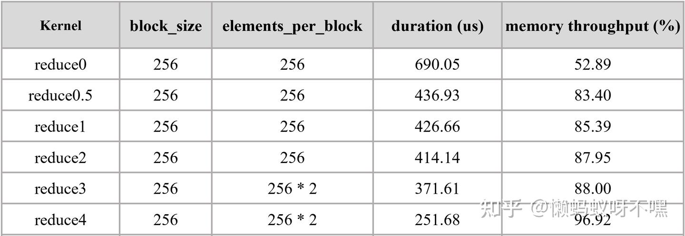

### 7. reduce5: 루프 완전 언롤

루프 횟수는 `block_size`에 의해 결정. `block_size`는 1024 이하라 분기로 풀고 `block_size`를 **템플릿 인자** 로 두면 컴파일러가 if를 최적화.

```cuda
template<int blockSize>
__global__ void reduce5(float* d_A, const int N) {
    extern __shared__ float data[];
    int tid = threadIdx.x;
    int i = 2 * blockSize * blockIdx.x + threadIdx.x;

    float sum = i < N ? d_A[i] : 0;
    if (i + blockSize < N) sum += d_A[i + blockSize];
    data[tid] = sum;
    __syncthreads();

    if (blockSize >= 1024 && tid < 512) data[tid] = sum = sum + data[tid + 512];
    __syncthreads();
    if (blockSize >= 512  && tid < 256) data[tid] = sum = sum + data[tid + 256];
    __syncthreads();
    if (blockSize >= 256  && tid < 128) data[tid] = sum = sum + data[tid + 128];
    __syncthreads();
    if (blockSize >= 128  && tid <  64) data[tid] = sum = sum + data[tid +  64];
    __syncthreads();
    if (blockSize >=  64  && tid <  32) data[tid] = sum = sum + data[tid +  32];
    __syncthreads();

    if (tid < 32) sum = warpReduce<WARP_SIZE>(sum);
    if (tid == 0) d_A[blockIdx.x] = sum;
}
```

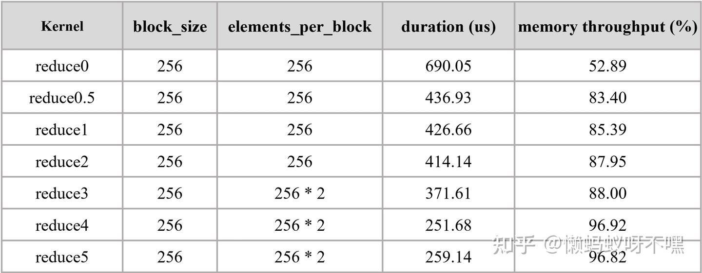

### 8. reduce6: block 하나가 `n * block_size`개 원소

reduce3의 일반화. block당 `n * block_size`개를 담당하도록 step1에서 임의 `n - 1`회 덧셈.

global 정렬·연속을 위해 **Grid-Stride Loops** ([B62](../B62_element_wise_detail/README.md)) 사용. thread가 합산할 n 원소의 간격 = `grid_size * block_size`.

```cuda
template<int blockSize>
__global__ void reduce6(float* d_A, const int N) {
    extern __shared__ float data[];
    int tid = threadIdx.x;
    int i = blockSize * blockIdx.x + threadIdx.x;

    float sum = 0.f;
    for (int index = i; index < N; index += blockSize * gridDim.x) sum += d_A[index];
    data[tid] = sum;
    __syncthreads();

    if (blockSize >= 1024 && tid < 512) data[tid] = sum = sum + data[tid + 512];
    __syncthreads();
    if (blockSize >= 512  && tid < 256) data[tid] = sum = sum + data[tid + 256];
    __syncthreads();
    if (blockSize >= 256  && tid < 128) data[tid] = sum = sum + data[tid + 128];
    __syncthreads();
    if (blockSize >= 128  && tid <  64) data[tid] = sum = sum + data[tid +  64];
    __syncthreads();
    if (blockSize >=  64  && tid <  32) data[tid] = sum = sum + data[tid +  32];
    __syncthreads();

    if (tid < 32) sum = warpReduce<WARP_SIZE>(sum);
    if (tid == 0) d_A[blockIdx.x] = sum;
}
```

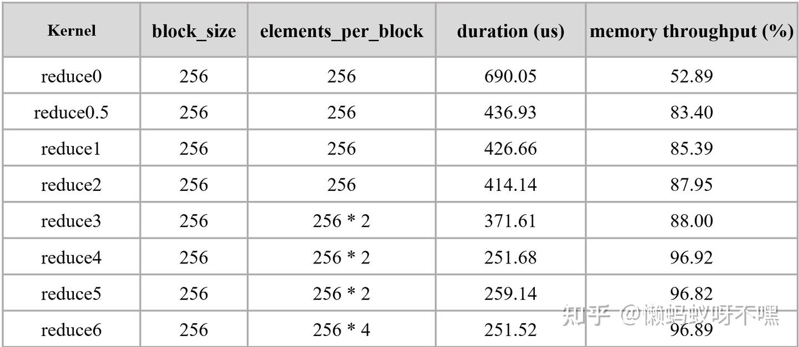

### 9. reduce6_vec4: 벡터화 접근

`float4`로 global의 4 원소를 한 번에 적재·합산. block당 `4 * block_size`개 원소. (벡터화 자세한 내용 [B62](../B62_element_wise_detail/README.md))

```cuda
template<int blockSize>
__global__ void reduce6_vec4(float* d_A, const int N) {
    extern __shared__ float data[];
    int tid = threadIdx.x;
    int i = 4 * (blockSize * blockIdx.x + threadIdx.x);

    float sum = 0.f;
    if (i < N - 4) {
        float4 reg = FLOAT4(d_A[i]);
        sum = reg.x + reg.y + reg.z + reg.w;
    } else {
        for (int j = i; j < N; ++j) sum += d_A[j];
    }
    data[tid] = sum;
    __syncthreads();

    if (blockSize >= 1024 && tid < 512) data[tid] = sum = sum + data[tid + 512];
    __syncthreads();
    if (blockSize >= 512  && tid < 256) data[tid] = sum = sum + data[tid + 256];
    __syncthreads();
    if (blockSize >= 256  && tid < 128) data[tid] = sum = sum + data[tid + 128];
    __syncthreads();
    if (blockSize >= 128  && tid <  64) data[tid] = sum = sum + data[tid +  64];
    __syncthreads();
    if (blockSize >=  64  && tid <  32) data[tid] = sum = sum + data[tid +  32];
    __syncthreads();

    if (tid < 32) sum = warpReduce<WARP_SIZE>(sum);
    if (tid == 0) d_A[blockIdx.x] = sum;
}
```

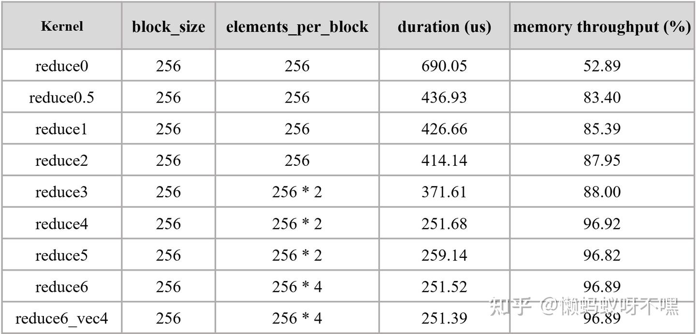

### 10. reduce7: WarpReduce로 BlockReduce 구현

reduce는 block이 한 구역 담당(BlockReduce), grid 전체가 전 데이터(GridReduce). 우리는 GridReduce 결과가 목표.

**BlockReduce로 GridReduce**

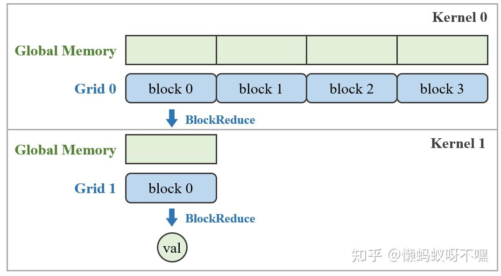
*GridReduce*

- Kernel 0: 4 block에서 BlockReduce → global 앞 4개에 결과
- Kernel 1: 1 block이 BlockReduce → 최종 결과

**WarpReduce로 BlockReduce**

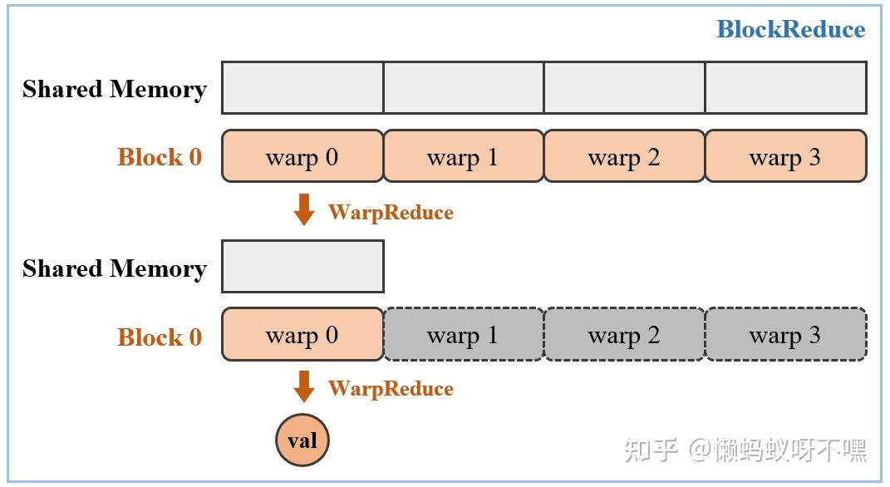
*BlockReduce*

- 4 warp 각자 WarpReduce → shared 앞 4개
- warp0이 다시 WarpReduce → shared[0]

GridReduce와 BlockReduce의 차이:

- GridReduce는 여러 커널을 띄움(grid 설정 변경), BlockReduce는 한 커널 내(block 설정 불변)
- GridReduce는 global로 데이터 전달, BlockReduce는 shared로

**BlockReduce에 필요한 WarpReduce 횟수**

대부분 GPU는 warp 크기 32, block 최대 thread 1024 → warp 최대 32. `block_size = 1024`라도 첫 WarpReduce 후 32 데이터만 남음 → warp 0에서 1번 더 → BlockReduce 완료. **최대 2회**.

**shared 크기**

첫 WarpReduce는 thread의 `sum`만 사용. 두 번째 WarpReduce 전, 각 warp 결과를 shared에 기록. **shared 크기 = warp 수**.

```cuda
template<int blockSize>
__global__ void reduce7(float* d_A, const int N) {
    extern __shared__ float data[];
    int tid = threadIdx.x;
    int i = blockSize * blockIdx.x + threadIdx.x;

    float sum = 0.f;
    for (int index = i; index < N; index += blockSize * gridDim.x) sum += d_A[index];

    sum = warpReduce<WARP_SIZE>(sum);
    if ((tid & (WARP_SIZE - 1)) == 0) data[tid / WARP_SIZE] = sum;

    __syncthreads();

    constexpr int NUM_WARPS = CEIL(blockSize, WARP_SIZE);
    if (tid < 32) {
        sum = tid < NUM_WARPS ? data[tid] : 0.f;
        sum = warpReduce<NUM_WARPS>(sum);
    }

    if (tid == 0) d_A[blockIdx.x] = sum;
}
```

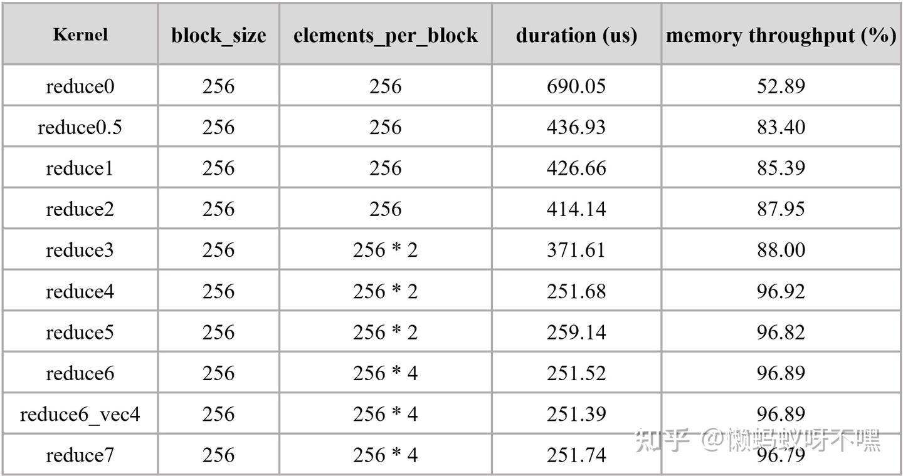

**전체 성능 비교**

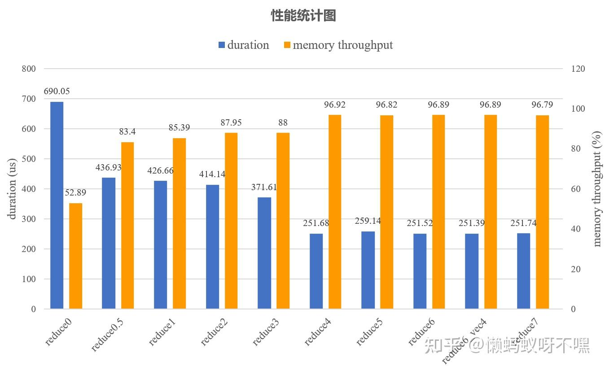

## 마무리

reduce 최적화는 CUDA의 대표 사례입니다. 본 글은 단계별 분석으로 다양한 구현을 소개했습니다. 코드는 GitHub에 업로드.

## 참고 자료

- NVIDIA/cuda-samples — 2_Concepts_and_Techniques/reduction
- Mark Harris — Optimizing Parallel Reduction (PPT)
- Faster Parallel Reductions on Kepler | NVIDIA Technical Blog
- 有了琦琦的棍子 — 深入浅出GPU优化: reduce 최적화
- HAL9000 — CUDA 노트: Reduction 최적화
- 后来 — CUDA 프로그래밍: Warp Shuffle Functions
- CUDA C++ Programming Guide — Warp Shuffle Functions / Warp Reduce Functions
