> 내 강의 노트이며, 많은 관심 바란다: https://github.com/BBuf/how-to-optim-algorithm-in-cuda/tree/master/cuda-mode 

## CUDA-MODE 강의 노트 제9강: Reduction(PMPP 제10장에도 대응)

### 강의 노트


이번 강의의 주제다.

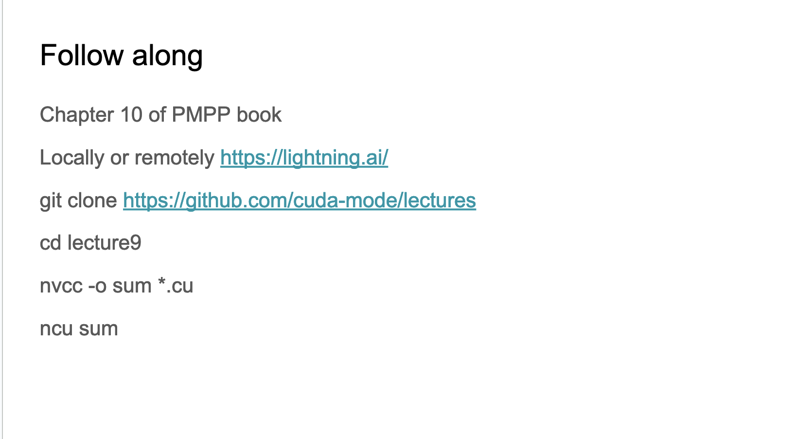

이 강의의 내용은 주로 PMPP book의 Chapter 10이다. Slides 안에는 이번 강의 code의 위치, compile 방법, nsight compute를 사용한 profile 방법도 제시되어 있다.

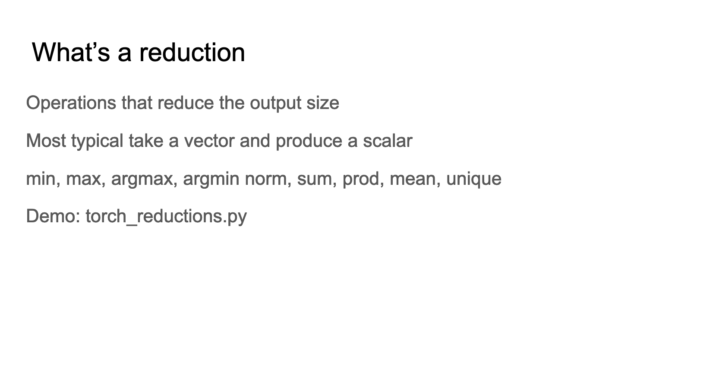


이 slide는 reduction operation의 정의를 제시한다. reduction은 output size를 줄이는 operation이다. 가장 전형적인 reduction operation은 vector를 scalar로 변환하는 것이다. 이어서 min, max, argmax, argmin, norm, sum, prod, mean, unique 같은 일반적인 reduction operation도 나열한다. https://github.com/cuda-mode/lectures/blob/main/lecture_009/torch_reductions.py file은 몇 가지 reduction operation 예시를 보여준다.

```python
def reduce(data, identity, op):
    result = identity
    for element in data:
        result = op(result, element)
    return result

# Example usage:

# Summation
data = [1, 2, 3, 4, 5]
print(reduce(data, 0, lambda a, b: a + b))  # Output: 15

# Product
print(reduce(data, 1, lambda a, b: a * b))  # Output: 120

# Maximum
print(reduce(data, float('-inf'), max))  # Output: 5

# Minimum
print(reduce(data, float('inf'), min))  # Output: 1
```

PyTorch에는 모든 reduction operation을 수행하기 위한 generic Reduce operator가 있으므로, reduce_max 같은 별도의 operator를 볼 수는 없다.

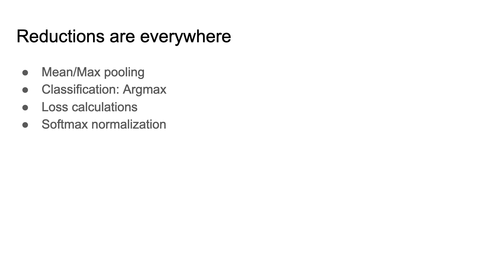

이 slide는 reduction operation이 deep learning과 machine learning에서 매우 보편적이라는 점을 강조한다. 예를 들면 다음과 같다.

- Mean/Max pooling: convolutional neural network에서 자주 쓰이는 operation이며, feature map의 spatial size를 줄이고 주요 feature를 추출한다.
- Classification: Argmax: classification task에서는 보통 argmax를 사용해 가장 가능성이 높은 class를 결정한다.
- Loss calculations: training 과정에서는 보통 loss function을 계산해야 하며, 이는 종종 여러 sample loss에 대한 reduction operation을 포함한다.
- Softmax normalization: multi-class problem에서 Softmax는 raw output score를 probability distribution으로 변환하는 데 사용되며, 이 과정도 reduction operation을 포함한다.

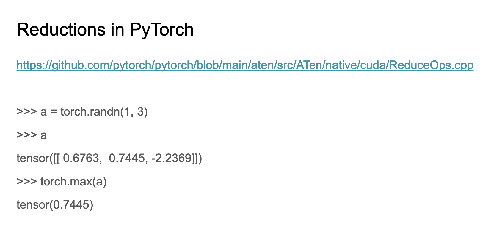

이 slide는 PyTorch가 tensor data를 처리하기 위해 reduction operation, 이 case에서는 max를 사용하는 예시를 보여준다. `torch.max` operator의 구현은 https://github.com/pytorch/pytorch/blob/main/aten/src/ATen/native/cuda/ReduceOps.cpp 에 있으며, 독립된 kernel 구현이 아니라 generic Reduce Op 안의 하나로 등록되어 있음을 볼 수 있다.

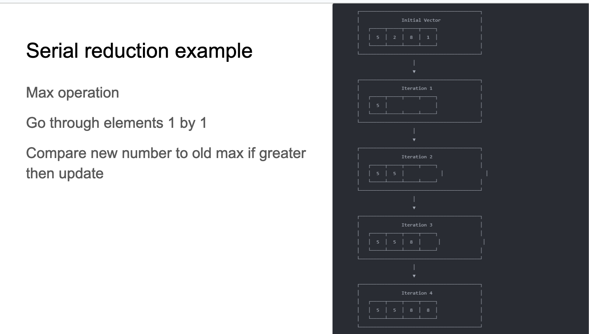

이 slide는 "Serial reduction" 예시를 보여준다. 구체적으로는 Max operation의 과정이다.
- 처리 방법은 다음과 같다.
    - "Go through elements 1 by 1", 즉 element를 하나씩 순회한다.
    - "Compare new number to old max if greater then update", 즉 새 숫자를 현재 max와 비교하고 더 크면 update한다.
- 오른쪽 그림은 구체적인 iteration 과정을 보여준다.
    - Initial Vector는 [5, 2, 8, 1]
    - iteration 1: [5], 첫 번째 element를 initial max로 사용한다.
    - iteration 2: [5, 5], 2는 5보다 작으므로 max는 그대로다.
    - iteration 3: [5, 5, 8], 8은 5보다 크므로 max를 update한다.
    - iteration 4: [5, 5, 8, 8], 1은 8보다 작으므로 max는 그대로다.

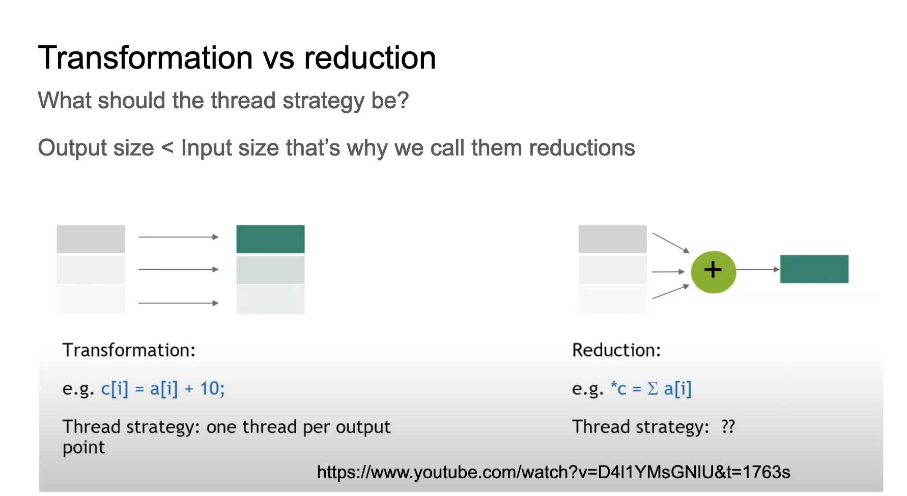

이 slide는 data processing의 두 가지 strategy인 Transformation과 Reduction, 그리고 각각의 thread strategy를 주로 보여준다. 이어서 reduction이 어떻게 수행되는지 본다.

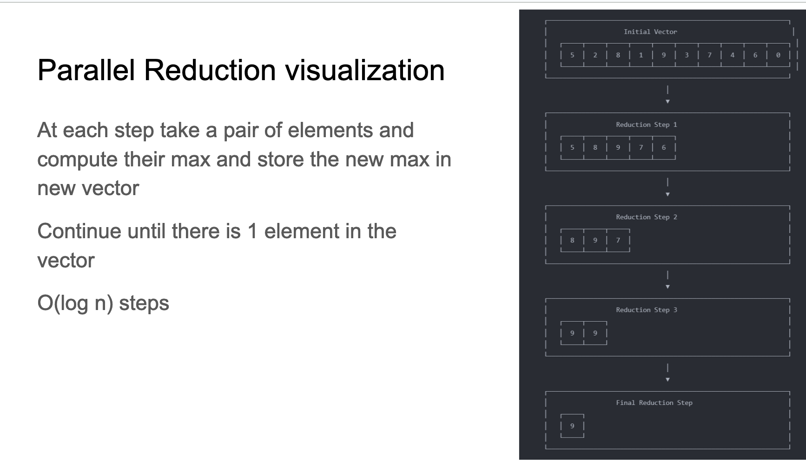

- 이 slide는 parallel reduction의 시각화 과정을 보여주며, vector 안의 max를 parallel computation으로 찾는 방법을 주로 설명한다.
- algorithm step:
    - 매 step마다 element pair를 선택해 max를 계산하고, 새로운 max를 new vector에 저장한다.
    - vector에 element가 1개만 남을 때까지 이 과정을 반복한다.
    - 전체 과정은 O(log n) step이 필요하다. 여기서 n은 initial vector의 element count다.
- Slides 오른쪽 그림은 구체적인 reduction 과정을 보여준다.
    - initial vector: [5, 2, 8, 1, 9, 3, 7, 4, 6, 0]
    - step 1 reduction: [5, 8, 9, 7, 6]
    - step 2 reduction: [8, 9, 7]
    - step 3 reduction: [9, 9]
    - final step: [9]
이 algorithm은 이후 CUDA kernel 구현의 기반이다.

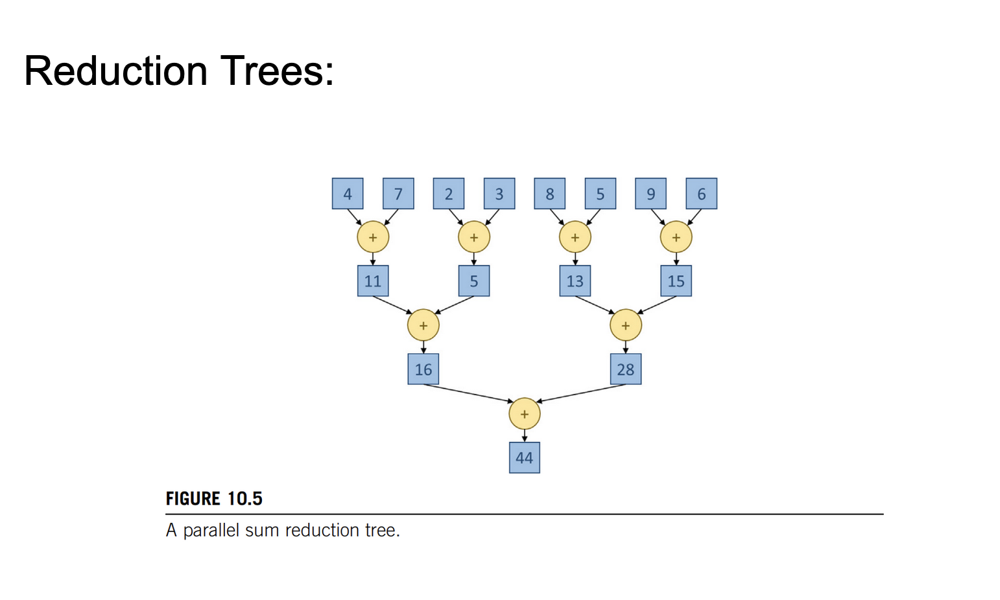

이 slide는 위의 parallel Reduction algorithm을 tree 방식으로 시각화한다. 다만 여기서는 max가 아니라 sum이다. 여기서 주의해야 할 점은 floating point addition은 commutative property를 만족하지 않는다는 것이다. 즉 A=B가 B+A와 같다는 뜻은 아니다. PyTorch를 사용할 때 이 점은 자주 혼동을 일으킨다. 이 예시에서는 GPU thread execution order를 제어할 수 없으므로, 두 element를 merge하는 순서도 제어할 수 없다. 이것 역시 nondeterminism의 원천 중 하나다.

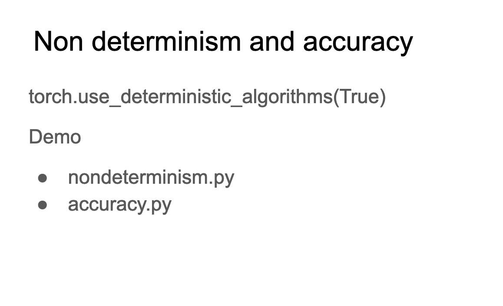

PyTorch에서는 `torch.use_deterministic_algorithms(True)`를 사용해 deterministic algorithm을 사용하도록 제어한다. 하지만 이런 algorithm은 일반적으로 실행 속도를 낮춘다. https://github.com/cuda-mode/lectures/blob/main/lecture_009/nondeterminism.py file은 floating point precision 문제 때문에 sum result에 nondeterminism이 생기는 예시를 보여준다.

```c++
# We'll use several small numbers that, when added together first, could show a difference
numbers = [1e-20] * 10 + [1e20, -1e20]  # 10 small numbers followed by a large positive and negative number

# Sum the list from left to right
sum_left_to_right_adjusted = sum(numbers)

# Sum the list from right to left
sum_right_to_left_adjusted = sum(reversed(numbers))

# 0.0 9.999999999999997e-20
print(sum_left_to_right_adjusted, sum_right_to_left_adjusted)
```

또한 설명하고 싶은 문제는 "CUDA-MODE 강의 노트 제7강: Quantization Cuda vs Triton"에서 말했듯, INT4/INT8 quantization을 수행하더라도 accumulation operation은 종종 더 높은 precision에서 실행된다는 점이다. 그 이유는 float16에서 많은 작은 값을 accumulate하면 마지막에 큰 수가 작은 수를 먹어버리는 상황이 생길 수 있기 때문이다. 해결 방법은 두 가지다. 더 높은 dynamic range를 가진 bf16 같은 data type을 사용하거나, float32 high precision에서 accumulate하는 것이다. 예를 들어 Triton matrix multiplication tutorial을 보면 accumulator가 보통 float32인 것을 발견할 수 있다. 이 예시의 code는 https://github.com/cuda-mode/lectures/blob/main/lecture_009/accuracy.py 이다.

```python
import torch
large_value = torch.tensor([1000.0], dtype=torch.float32)  # Using float32 for initial value

# Define a smaller value that is significant for float32 but not for float16
small_value = torch.tensor([1e-3], dtype=torch.float32)  # Small value in float32

# Add small value to large value in float32
result_float32 = large_value + small_value

# Convert large value to float16 and add the small value (also converted to float16)
result_float16 = large_value.to(torch.float16) + small_value.to(torch.float16)

# Convert results back to float32 for accurate comparison
result_float32 = result_float32.item()
result_float16_converted = result_float16.to(torch.float32).item()

# Print results
# 1000.0009765625 1000.0
print(result_float32, result_float16_converted)
```

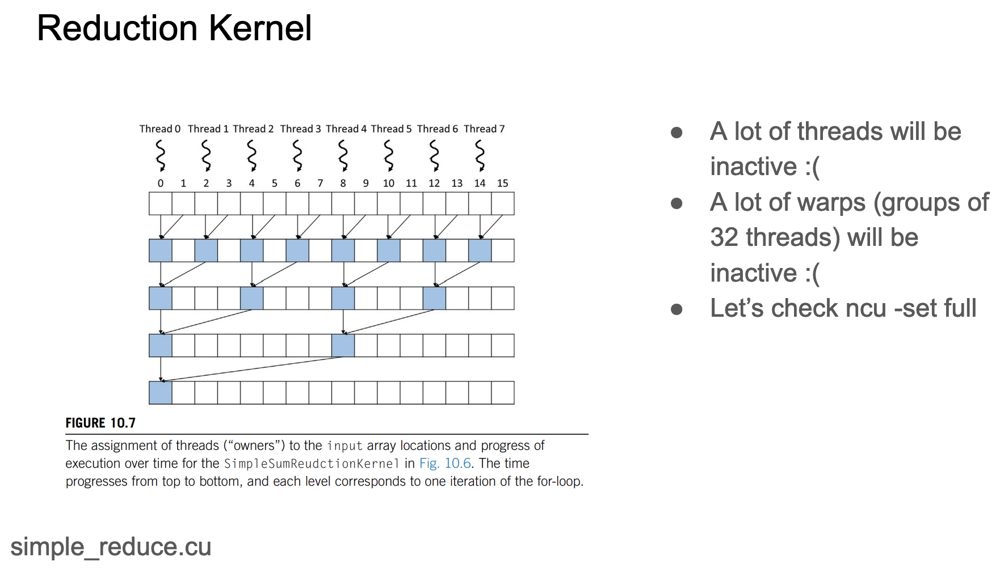

이 slide는 https://github.com/cuda-mode/lectures/blob/main/lecture_009/simple_reduce.cu 구현 code와 함께 보는 것을 권한다.

```c++
__global__ void SimpleSumReductionKernel(float* input, float* output) {
    unsigned int i = 2 * threadIdx.x;
    for (unsigned int stride = 1; stride <= blockDim.x; stride *= 2) {
        if (threadIdx.x % stride == 0) {
            input[i] += input[i + stride];
        }
        __syncthreads();

    }
    if (threadIdx.x == 0) {
    *output = input[0];
    }
}
```

SimpleSumReductionKernel의 경우 thread마다 인접한 두 element를 처리한다. 그래서 Slides에서 8개 thread가 16개 element를 처리하는 것으로 표시된다. 그리고 for loop가 reduction 과정을 구현하며, 그림의 각 layer에 대응한다. stride는 1부터 시작해 iteration마다 두 배가 된다. 이는 iteration마다 active thread 수가 절반으로 줄어드는 이유를 설명한다.
- reduction 과정을 simulation해볼 수 있다.
    - 첫 번째 iteration(stride = 1): 각 thread가 인접한 두 element를 더한다.
    - 두 번째 iteration(stride = 2): 한 thread씩 건너뛰며 계산하고, distance가 2인 element를 더한다.
    - 이런 식으로 마지막에는 thread 하나, thread 0만 마지막 addition을 수행한다.
- 또한 CUDA code의 `__syncthreads()`는 각 iteration 후 모든 thread가 synchronize되도록 보장한다.
- code의 `if (threadIdx.x % stride == 0)` condition은 Slides에서 언급한 inactive thread 문제를 유발한다.
- CUDA에서 thread는 32개씩 한 group으로 실행된다. 이를 warp라고 부른다. 이러한 reduction 방식 때문에 곧 전체 warp가 inactive 상태가 될 수 있으며, 이것이 Slides에서 말한 "A lot of warps will be inactive"의 이유다.
- kernel launch 설정: `SimpleSumReductionKernel<<<1, size / 2>>>(d_input, d_output);`는 size/2개의 thread를 launch하며, 그림 속 8개 thread에 대응한다. size가 16이라고 가정한다.
- Slides는 performance analysis를 위해 `"ncu -set full"` 사용을 권한다. 이는 thread와 warp efficiency에 관한 더 많은 detail을 드러낼 수 있다.

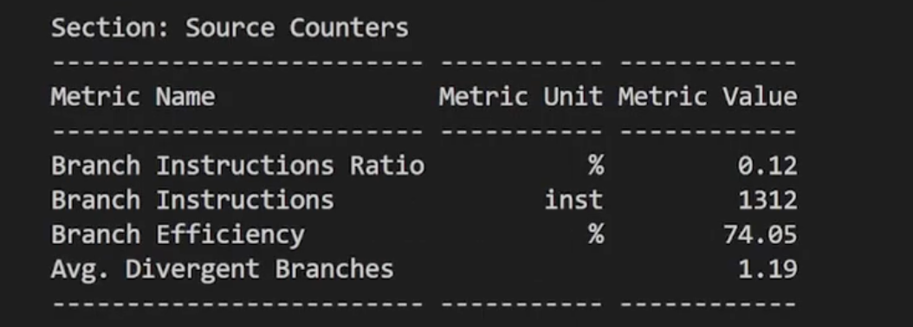

이 version의 code는 T4 GPU에서 branch efficiency가 74%다.

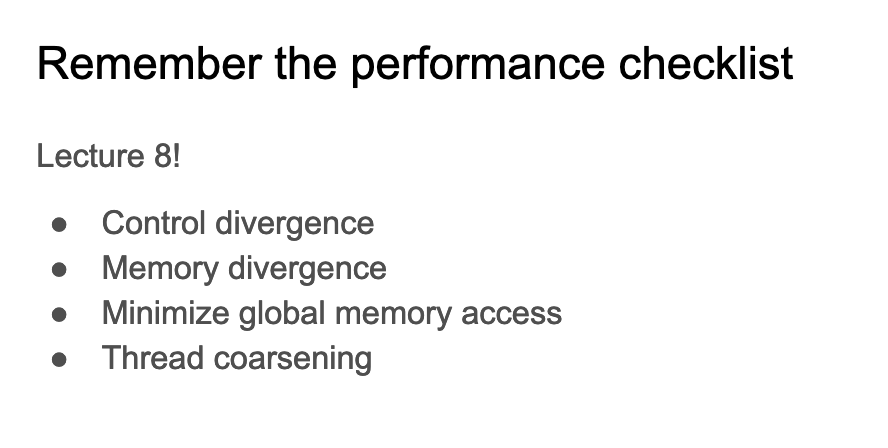

위 kernel을 최적화하려고 할 때, Lecture 8에서 말한 CUDA performance checklist를 기억해야 한다. 우리의 최적화는 Control divergence, Memory divergence, global memory access 최소화, thread coarsening 등을 포함한다.

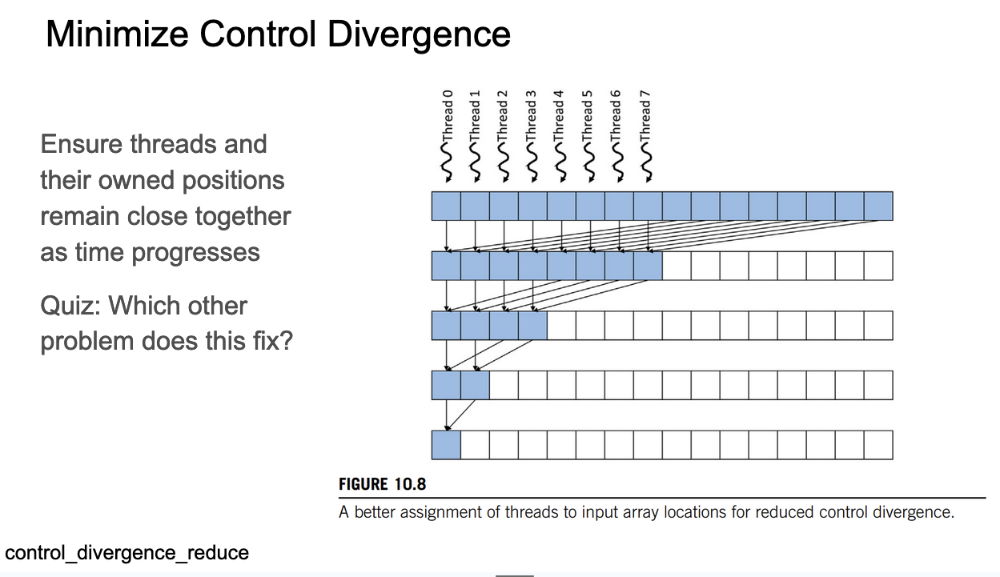

이 slide에 대응하는 code는 https://github.com/cuda-mode/lectures/blob/main/lecture_009/control_divergence_reduce.cu 이다. code의 kernel implementation과 함께 보아야 한다.

```c++
__global__ void FixDivergenceKernel(float* input, float* output) {
    unsigned int i = threadIdx.x; //threads start next to each other
    for (unsigned int stride = blockDim.x; stride >= 1; stride /= 2) { // furthest element is blockDim away
        if (threadIdx.x < stride) { // 
            input[i] += input[i + stride]; // each thread adds a distant element to its assigned position
        }
        __syncthreads();

    }
    if (threadIdx.x == 0) {
    *output = input[0];
    }
}
```

Slides와 대응하는 CUDA kernel code는 모두 control divergence를 줄이고 parallel computation efficiency를 높이는 방법을 설명한다.
- Slides의 핵심점: "Ensure threads and their owned positions remain close together as time progresses", 즉 thread와 그 thread가 소유한 position이 시간이 지남에 따라 서로 가깝게 유지되도록 보장한다. 이것이 kernel implementation의 핵심 아이디어다.
- Slides 그림은 Thread0부터 Thread7까지 여러 thread가 어떻게 협력하는지 보여준다. 각 row는 time step을 나타내고, 파란 square는 active thread를 나타낸다. 시간이 지날수록 active thread 수는 줄지만 이들은 서로 인접하게 유지된다.
- operation 구현 방식은 stride가 blockDim.x에서 시작하고 iteration마다 stride를 2로 나누는 것이다. 이전처럼 2를 곱하지 않는다. 따라서 직관적으로 우리는 stride가 시간이 지남에 따라 점차 작아지기를 기대하며, 이렇게 하면 thread가 memory에서 coalesced 처리될 가능성이 크게 증가한다.
- kernel launch 방식은 이전 original implementation과 동일하게 유지된다.

> 여기에서는 Slides 그림 속 tree iteration logic이 실제로는 각 iteration 뒤의 `__syncthreads()`로 완성된다는 점도 설명한다.

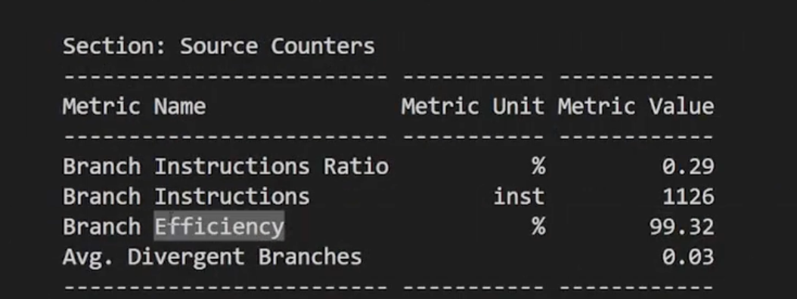

ncu 결과를 보면 initial version과 비교해 여기의 branch efficiency는 99%다. 초기 74%와 비교하면 이 optimization이 실제로 효과적임을 알 수 있다.

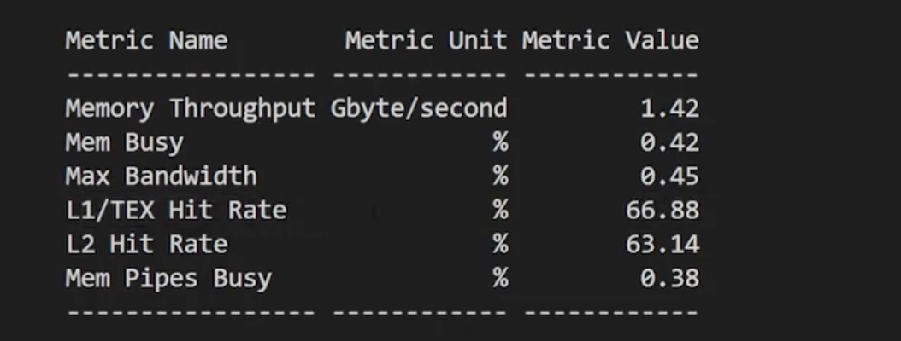

또한 ncu 결과는 현재 kernel의 L1 Cache hit rate가 66.88%라고 보여준다. 이는 다음 shared memory optimization과 관련이 있다.


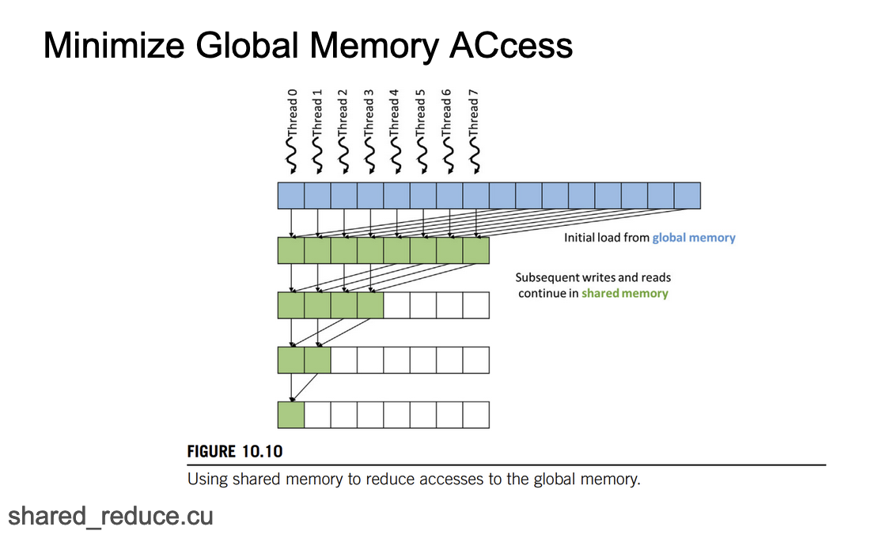

이 slide에 대응하는 code는 https://github.com/cuda-mode/lectures/blob/main/lecture_009/shared_reduce.cu 이며, kernel implementation은 다음과 같다.

```c++
#define BLOCK_DIM 1024

// This is the code from the book but I couldn't get this to run faster even with occupancy calculator
// L1 throughput is dramatically increased though
__global__ void SharedMemoryReduction(float* input, float* output) {
    __shared__ float input_s[BLOCK_DIM];
    unsigned int t = threadIdx.x;
    input_s[t] = input[t] + input[t  + BLOCK_DIM];
    for (unsigned int stride = blockDim.x/2; stride >= 1; stride /=2) {
        __syncthreads();
        if (threadIdx.x < stride) {
            input_s[t] += input_s[t + stride];
        }
    }

    if (threadIdx.x == 0) {
        *output = input_s[0];
    }
}
```

이 slide와 대응하는 CUDA kernel code는 주로 shared memory를 사용해 global memory access를 최소화함으로써 성능을 높이는 방법을 설명한다.
- Slides의 핵심점:
    - "Initial load from global memory"
    - "Subsequent writes and reads continue in shared memory"
- Slides 그림은 Thread 0부터 Thread 7까지 여러 thread가 어떻게 협력하는지 보여준다. 파란 square는 global memory를, 초록 square는 shared memory를 나타낸다. arrow는 data movement와 computation process를 나타낸다.
- code 해석:
    - `__shared__ float input_s[BLOCK_DIM];`은 shared memory array를 선언한다.
    - `input_s[t] = input[t] + input[t  + BLOCK_DIM];`은 global memory에서 shared memory로 data를 load하고 preliminary computation을 수행한다. 이는 Slides의 "Initial load from global memory"에 대응한다.
    - `__syncthreads();`는 모든 thread가 다음 iteration에 들어가기 전에 현재 operation을 완료하도록 보장한다.

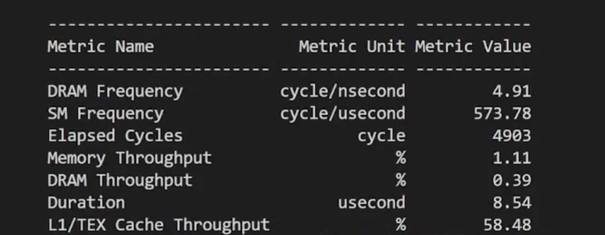

ncu 결과를 보면 L1 Cache hit rate가 60%까지 올라갔다. 하지만 L1 cache throughput이 크게 향상되었음에도 실제 runtime speed가 뚜렷하게 좋아지지 않았을 수 있다. 이는 global memory bandwidth, thread synchronization overhead 같은 다른 요인이 새로운 bottleneck이 되었기 때문일 수 있다.

이 kernel의 input data size를 늘려보면 kernel result가 틀리는 것을 발견한다. 이는 kernel 안의 shared memory size가 1024로 제한되어 있기 때문이다. GPU에서는 일반적으로 이렇게 작은 규모의 task를 수행하지 않는다.

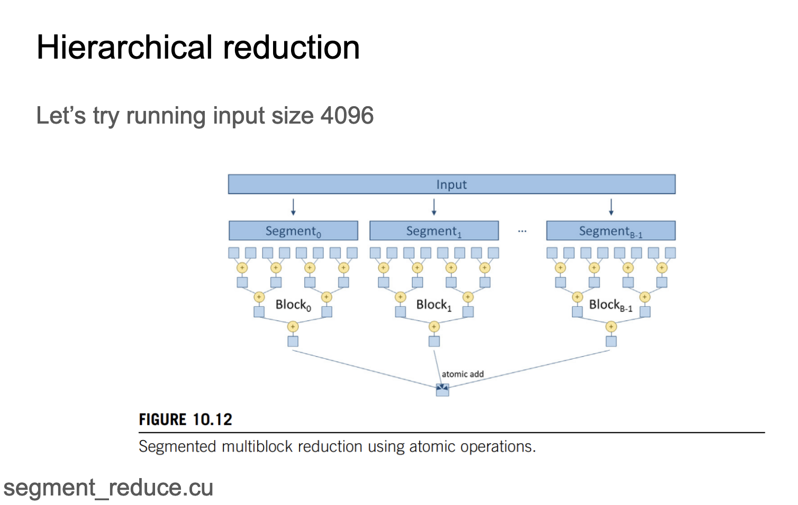

이 slide는 실제로 GPU에서 여러 Block을 사용해 data를 segment 단위로 처리한다는 의미다. 위의 두 version의 program은 모두 하나의 Block만 launch했다. 아래 그림과 같다.


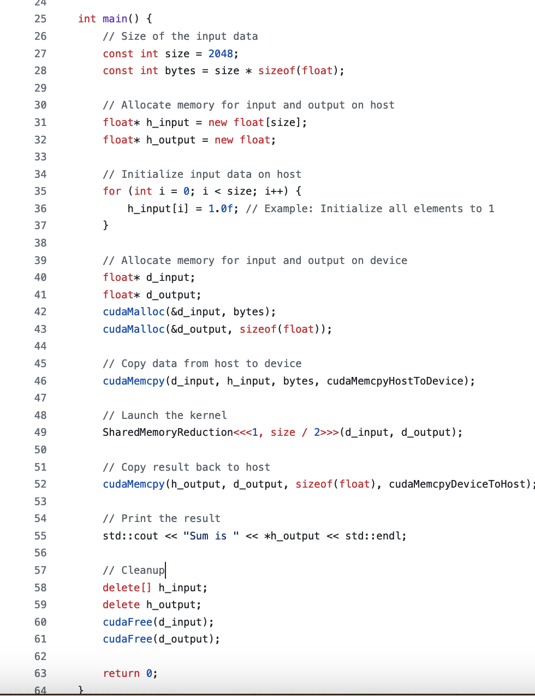


이 slide가 보여주는 방법은 여러 Block을 launch한 뒤, 각 개별 Block이 1024개 element를 담을 수 있으면 서로 다른 Block 안에서 개별적으로 reduction operation을 수행하고, 마지막에 모든 Block에 대해 final reduction을 한 번 더 수행하는 것이다.

여기에 대응하는 code implementation은 https://github.com/cuda-mode/lectures/blob/main/lecture_009/segment_reduce.cu 이며, code는 다음과 같다.

```c++
#include <iostream>
#include <cuda.h>

#define BLOCK_DIM 1024

__global__ void SharedMemoryReduction(float* input, float* output, int n) {
    __shared__ float input_s[BLOCK_DIM]; 
    unsigned int idx = blockIdx.x * blockDim.x + threadIdx.x; // index within a block
    unsigned int t = threadIdx.x; // global index

    // Load elements into shared memory
    if (idx < n) {
        input_s[t] = input[idx];
    } else {
        input_s[t] = 0.0f;
    }
    __syncthreads();

    // Reduction in shared memory
    for (unsigned int stride = blockDim.x / 2; stride > 0; stride >>= 1) {
        if (t < stride && idx + stride < n) {
            input_s[t] += input_s[t + stride];
        }
        __syncthreads();
    }

    // Reduction across blocks in global memory
    // needs to be atomic to avoid contention
    if (t == 0) {
        atomicAdd(output, input_s[0]);
    }
}


int main() {
    // Size of the input data
    const int size = 100000;
    const int bytes = size * sizeof(float);

    // Allocate memory for input and output on host
    float* h_input = new float[size];
    float* h_output = new float;

    // Initialize input data on host
    for (int i = 0; i < size; i++) {
        h_input[i] = 1.0f; // Example: Initialize all elements to 1
    }

    // Allocate memory for input and output on device
    float* d_input;
    float* d_output;

    cudaMalloc(&d_input, bytes);
    cudaMalloc(&d_output, sizeof(float));

    // Copy data from host to device
    float zero = 0.0f;
    cudaMemcpy(d_output, &zero, sizeof(float), cudaMemcpyHostToDevice);
    cudaMemcpy(d_input, h_input, bytes, cudaMemcpyHostToDevice);

    // Launch the kernel
    int numBlocks = (size + BLOCK_DIM - 1) / BLOCK_DIM;
    SharedMemoryReduction<<<numBlocks, BLOCK_DIM>>>(d_input, d_output, size);

    // Copy result back to host
    cudaMemcpy(h_output, d_output, sizeof(float), cudaMemcpyDeviceToHost);

    // Print the result
    std::cout << "Sum is " << *h_output << std::endl;

    // Cleanup
    delete[] h_input;
    delete h_output;
    cudaFree(d_input);
    cudaFree(d_output);

    return 0;
}
```

code에서 특별히 주의해야 할 것은 kernel의 마지막 code line이다. 이는 모든 Block 처리가 끝난 뒤 final layer의 reduction operation을 수행하는 부분이다. Block level에서 reduction을 하면 global memory를 cross하게 되므로, 이때는 여러 Block이 같은 position에 write할 때 생기는 race error를 피하기 위해 atomicAdd를 사용해야 한다.

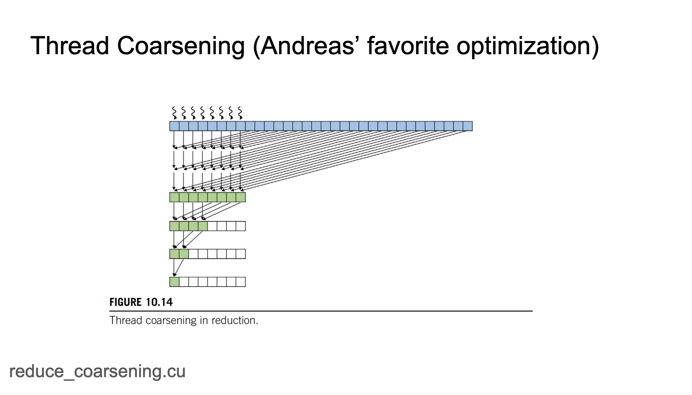

이어서 또 다른 optimization strategy인 thread coarsening을 소개한다. 이전 strategy는 각 thread가 기본적으로 매번 2개 element만 accumulate하도록 보장하는 것이었다. 만약 각 thread가 4개나 8개 element를 accumulate하면 어떻게 될지 생각해볼 수 있다. 이 optimization에 대응하는 code는 https://github.com/cuda-mode/lectures/blob/main/lecture_009/reduce_coarsening.cu 에 있으며, kernel implementation은 다음과 같다.

```c++
#define BLOCK_DIM 1024
#define COARSE_FACTOR 2

__global__ void CoarsenedReduction(float* input, float* output, int size) {
    __shared__ float input_s[BLOCK_DIM];

    unsigned int i = blockIdx.x * blockDim.x * COARSE_FACTOR + threadIdx.x;
    unsigned int t = threadIdx.x;
    float sum = 0.0f;

    // Reduce within a thread
    for (unsigned int tile = 0; tile < COARSE_FACTOR; ++tile) {
        unsigned int index = i + tile * blockDim.x;
        if (index < size) {
            sum += input[index];
        }
    }

    input_s[t] = sum;
    __syncthreads();
    
    //Reduce within a block
    for (unsigned int stride = blockDim.x / 2; stride > 0; stride >>= 1) {
        if (t < stride) {
            input_s[t] += input_s[t + stride];
        }
        __syncthreads();
    }

    //Reduce over blocks
    if (t == 0) {
        atomicAdd(output, input_s[0]);
    }
}
```

COARSE_FACTOR parameter는 thread 하나가 하나의 iter 안에서 element를 몇 번 accumulate하는지를 제어한다. 한 번이면 2개 element를 accumulate하고, 2번이면 4개 element를 accumulate한다. 이 kernel은 이전 segmented reduction과 비교적 비슷하지만, 이제 첫 번째 reduction이 단일 thread 내부에서 수행된다. thread 하나에서 reduction이 완료되면 다음에는 thread block 안에서 reduction을 수행하고, 마지막에는 Block 간 final reduction을 수행한다.


- 이 slide의 제목은 "Next steps"이며, 주요 내용은 다음과 같다.
- review와 suggestion:
    - Lecture 1-8은 PyTorch kernel을 작성, 분석, 배포하기 시작하는 데 필요한 모든 내용을 이미 제공했다.
    - 학생들이 project 하나를 선택하기 시작하라고 제안한다.
    - motivation을 유지하기 위해 #general channel에서 collaborator를 찾으라고 권장한다.
- 다음 instructor 소개:
    - 다음 instructor는 Oscar다.
    - Oscar는 production-level CUDA library를 deploy하는 방법을 설명할 것이다.
- instructor 모집:
    - prefix sum(scan)과 NCCL을 설명하는 데 관심 있는 instructor를 찾고 있다.


author는 deep learning framework에서 reduction operation이 어떻게 구현되는지 이해할 수 있도록 몇 장의 slide를 추가로 준비했다.

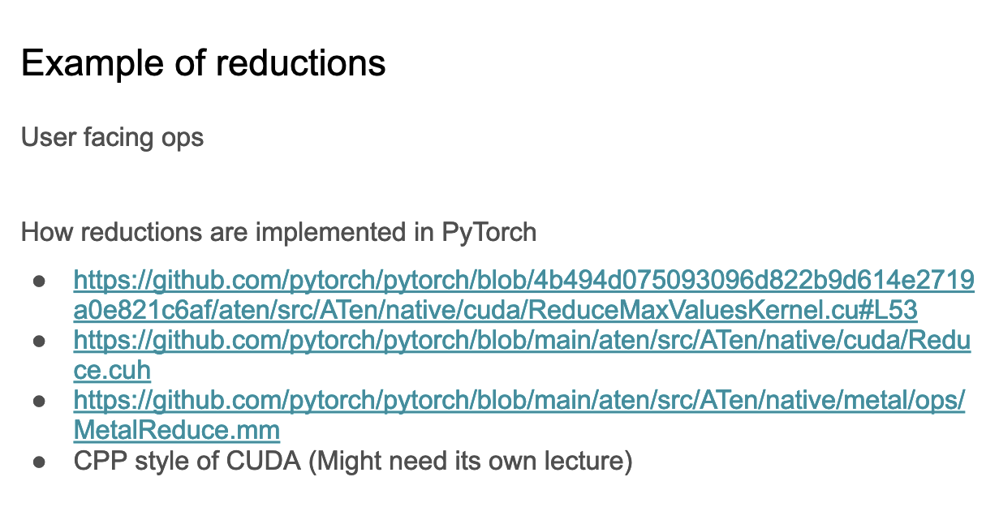

예를 들어 PyTorch를 예로 들면, torch.max/torch.min, torch.mean 등 user-facing reduction operation이 이미 일련으로 존재한다. 이러한 operation은 CUDA Kernel로 어떻게 구현될까? 위 마지막 두 version의 optimization에서 주목할 수 있듯이, 이러한 optimization 고려는 input data가 매우 클 때를 위해 수행된 것이다. 하지만 input data가 작다면 위의 모든 고려는 의미가 없어지고, non-segmented Reduction algorithm을 사용하는 것이 더 합리적이다. 여러 dimension의 data를 reduction하려면 어떻게 해야 할까? input과 output의 data type이 바뀔 때 필요한 구현은 무엇일까? accumulator의 dtype을 수정하는 것도 고려해야 할까? 따라서 넓게 적용 가능한 kernel을 작성하려고 하면 많은 요소를 고려해야 한다. 구축한 kernel이 특정 scenario에만 적용된다면 binary file이 매우 커진다는 뜻이다. 서로 다른 permutation/combination마다 codebase에 kernel을 하나씩 넣어야 하기 때문이다. 반면 code generation에 더 중점을 두고 heuristic method로 적합한 kernel을 선택하는 system을 가지고 있다면, framework는 사람들이 experimental exploration을 계속 수행하는 platform이 될 가능성이 높다. 이것이 PyTorch 성공의 큰 key factor 중 하나다. 이런 philosophy가 practice에서 나타난 예가 기본적으로 우리의 reduce kernel이다. 그래서 PyTorch의 reduction kernel은 max.cuh/mean.cuh 같은 식으로 있는 것이 아니라 단 하나의 Reduce.cuh만 있다. 모든 reduction operation은 같은 structure를 가지며, 수학적으로 매우 동등하기 때문이다. 우리는 accumulator와 operator를 부여하면 code generation을 통해 optimal algorithm을 얻을 수 있는 더 generic한 infrastructure를 구축하기를 기대한다. 이 구현은 자세히 읽어볼 수 있다: https://github.com/pytorch/pytorch/blob/main/aten/src/ATen/native/cuda/Reduce.cuh 


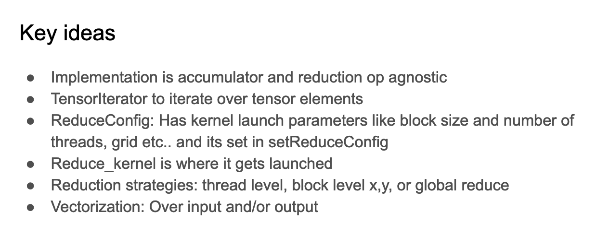

author는 여기서 https://github.com/pytorch/pytorch/blob/main/aten/src/ATen/native/cuda/Reduce.cuh 에 관한 몇 가지 note를 작성했다. key point는 다음과 같다.

- implementation은 accumulator와 reduction op에 agnostic하다(Implementation is accumulator and reduction op agnostic). 이는 구현 방식이 서로 다른 type의 accumulator와 reduction operation에 적용될 수 있음을 의미한다.
- TensorIterator를 사용해 tensor element를 iterate한다(TensorIterator to iterate over tensor elements). 이는 tensor data를 traverse하기 위한 mechanism이다.
- ReduceConfig: kernel launch parameter를 포함한다(ReduceConfig: Has kernel launch parameters). 예를 들어 block size, thread count, grid 등이 있으며, 이러한 parameter는 setReduceConfig에서 설정된다.
- Reduce_kernel은 launch되는 위치다(Reduce_kernel is where it gets launched).
- Reduction strategies:
    - thread level
    - block level x,y
    - global reduce
- Vectorization:
    - input 및/또는 output에 적용할 수 있다.

https://github.com/pytorch/pytorch/blob/main/aten/src/ATen/native/cuda/Reduce.cuh 를 학습하면 CUDA와 template에 관한 흥미로운 지식을 많이 익힐 수 있으므로, 강력히 공부해보기를 추천한다.


마지막으로 torch.compile이 생성한 reduce kernel도 보여주고 싶다. code는 다음과 같다.

```python
# TORCH_LOGS="output_code" python reduce_compile.py
import torch 

@torch.compile
def f(a):
    c = torch.sum(a)
    return c

f(torch.randn(10).cuda())
```

author는 Triton이 생성한 code를 보여주었다. code 안의 ReductionHit와 PyTorch 안의 heuristic search algorithm 구현(`pytorch/torch/_inductor/triton_heuristics`)을 간단히 살펴보았다. 여기서 우리는 input size가 서로 다르면 scheduling되는 kernel type도 다르다는 것을 발견할 수 있다.

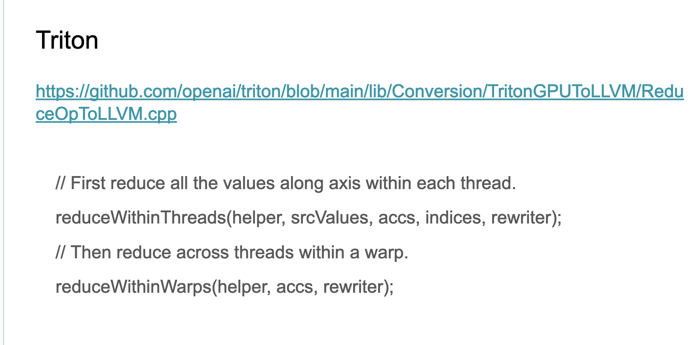

마지막 slide는 Triton 안에서 Reduction이 어떻게 구현되는지도 언급한다. 대응하는 code는 다음과 같다.

```c++
LogicalResult
  matchAndRewrite(triton::ReduceOp op, OpAdaptor adaptor,
                  ConversionPatternRewriter &rewriter) const override {
    ReduceOpHelper helper(op);
    assert(helper.isSupportedLayout() &&
           "Unexpected srcLayout in ReduceOpConversion");
    Location loc = op->getLoc();

    auto srcValues = unpackInputs(loc, op, adaptor, rewriter);
    std::map<SmallVector<unsigned>, SmallVector<Value>> accs;
    std::map<SmallVector<unsigned>, SmallVector<Value>> indices;
    // First reduce all the values along axis within each thread.
    reduceWithinThreads(helper, srcValues, accs, indices, rewriter);

    // Then reduce across threads within a warp.
    reduceWithinWarps(helper, accs, rewriter);

    if (helper.isWarpSynchronous()) {
      // If all the values to be reduced are within the same warp there is
      // nothing left to do.
      packResults(helper, accs, rewriter);
      return success();
    }

    // Compute a shared memory base per operand.
    auto smemShape = helper.getScratchRepShape();

    SmallVector<Value> smemBases =
        getSmemBases(op, product<unsigned>(smemShape), rewriter);

    storeWarpReduceToSharedMemory(helper, accs, indices, smemBases, rewriter);

    sync(rewriter, loc, op);

    // The second round of shuffle reduction
    //   now the problem size: sizeInterWarps, s1, s2, .. , sn
    //   where sizeInterWarps is 2^m
    //
    // Each thread needs to process:
    //   elemsPerThread = sizeInterWarps * s1 * s2 .. Sn / numThreads
    accumulatePartialReductions(helper, smemBases, rewriter);

    // We could avoid this barrier in some of the layouts, however this is not
    // the general case.
    // TODO: optimize the barrier in case the layouts are accepted.
    sync(rewriter, loc, op);

    // set output values
    loadReductionAndPackResult(helper, smemShape, smemBases, rewriter);

    return success();
  }
```

algorithm flow를 요약하면 다음과 같다.
- initialization과 input processing:
    - ReduceOpHelper object를 만들어 operation을 보조한다.
    - input value를 unpack한다.
- thread 내부 reduction:
    - 각 독립 thread 안에서 첫 번째 round의 reduction을 수행한다.
    - 이 step은 parallel하게 실행될 수 있으며, 각 thread는 자신의 data portion을 처리한다.
- warp 내부 reduction:
    - thread 내부 reduction result를 warp 안에서 further reduction한다.
    - Warp는 GPU의 execution unit이며, 보통 32개 thread를 포함한다.
    - reduction해야 할 모든 value가 같은 warp 안에 있으면 algorithm은 여기서 끝날 수 있다.
- shared memory processing:
    - reduction이 여러 warp를 넘어가야 하면 shared memory를 사용해 더 넓은 범위의 reduction을 coordinate한다.
    - shared memory shape와 base address를 계산한다.
    - warp 내부 reduction result를 shared memory에 저장한다.
- synchronization:
    - 한 번 synchronization operation을 실행해 모든 thread가 앞의 step을 완료했는지 보장한다.
- cross-warp reduction:
    - shared memory 안의 data를 사용해 cross-warp reduction operation을 수행한다.
    - 이 step은 서로 다른 warp의 partial result를 accumulate한다.
- 다시 synchronization:
    - 다시 synchronization operation을 실행해 cross-warp reduction이 완료되었는지 보장한다.
- final result processing:
    - shared memory에서 final reduction result를 load한다.
    - result를 pack해 output을 준비한다.

### 요약
이 강의는 Reductions algorithm을 소개했다. 이전에 나는 [【BBuf의 CUDA 노트】셋, reduce 최적화 입문 학습 노트](https://github.com/BBuf/how-to-optim-algorithm-in-cuda/tree/master/reduce)에도 Reduce optimization note를 쓴 적이 있다. CUDA-MODE의 이 강의는 더 입문적이고 자세하다. Slides의 후반부에는 우리가 학습하기에 적합한 자료가 있으며, 특히 PyTorch의 Reductions.cuh는 Reduce를 배우는 데 보물 같은 자료다.
