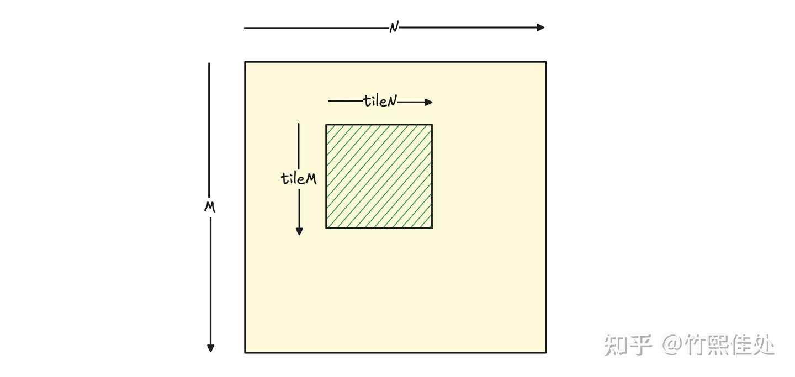
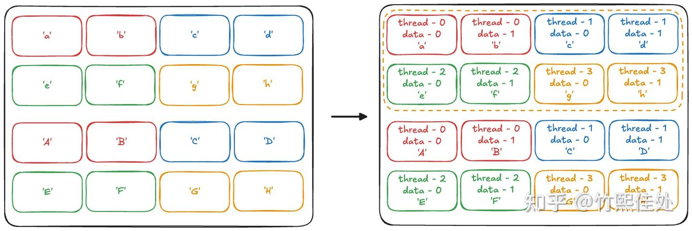
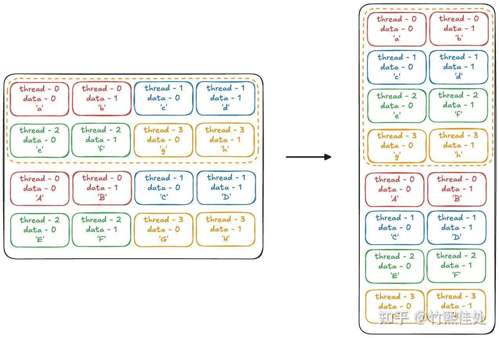
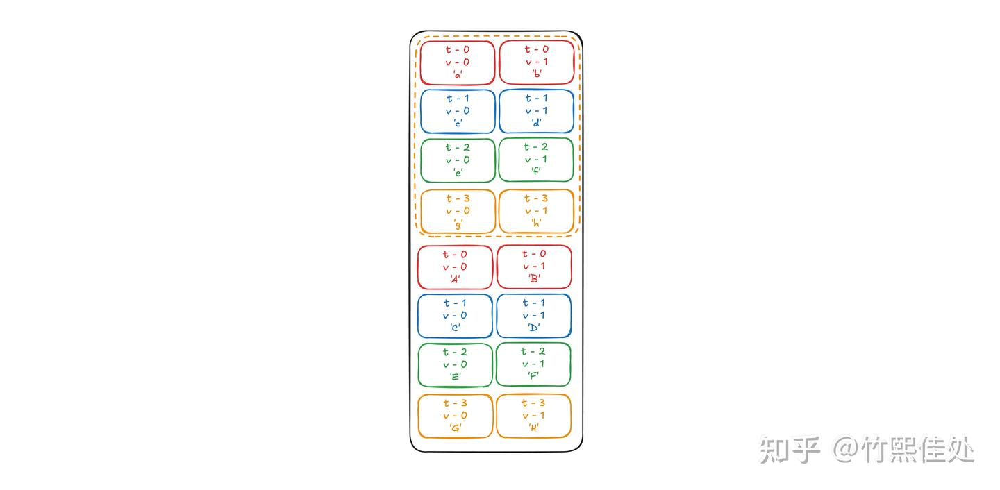
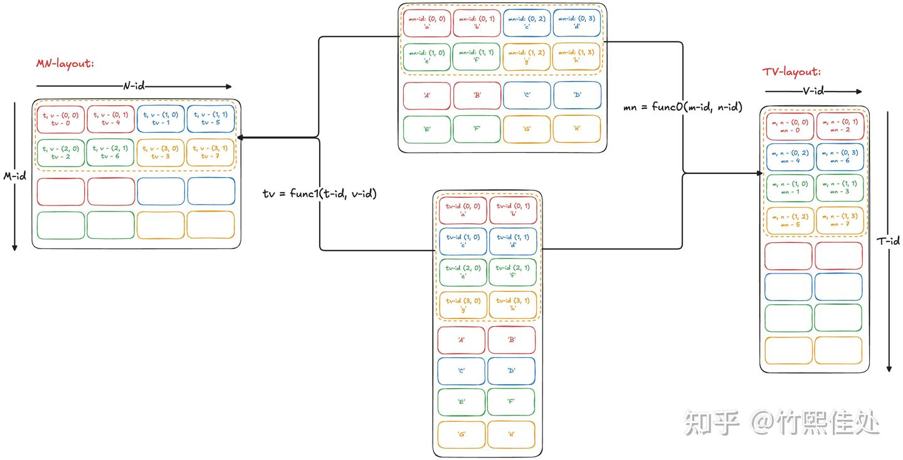
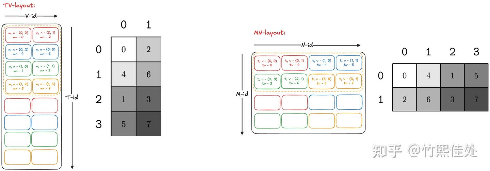
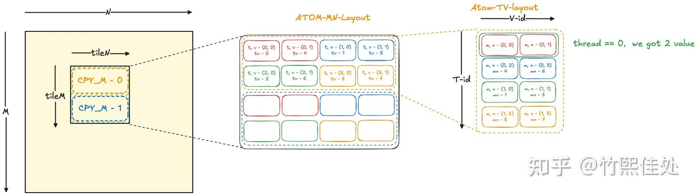

# 모두를 위한 CuTe 튜토리얼: Tiled Copy

> 원문: https://zhuanlan.zhihu.com/p/1930389542784964333

## 업데이트

본 글의 후속편 [《모두를 위한 CuTe 튜토리얼: tiled mma》](../B04_cute_tiled_mma/README.md)도 공개되었으니 관심 있는 독자는 이 글을 읽은 뒤 참고하세요.

## 동기

NVIDIA GPU 프로그래밍에서 Tensor Core 사용이 점점 중요해지고 있습니다. 어떻게 해야 Tensor Core를 제대로 활용할 수 있을까요? CuTe 등장 전에는 다음과 같은 선택지가 있었습니다.

- **CUDA + PTX 명령**
- **CUTLASS 템플릿 라이브러리**
- **Triton**

"CUDA + PTX" 조합은 직접적이고 제어 입도가 세밀해 보통 최고 성능을 낼 수 있지만, PTX 명령에 익숙해야 하고 아키텍처 간 호환 문제가 있습니다.

**CUTLASS 템플릿**은 고효율 GEMM과 후처리(epilogue) 융합을 제공하고 대부분의 구현 세부(명령 선택, 파이프라인 배치 등)를 숨길 수 있어, 공식 example을 참고하면 괜찮은 GEMM 커널을 빠르게 쓸 수 있습니다. 단 **제공된 템플릿 밖의 커널 작성 능력은 부족**합니다. 예컨대 FlashAttention v2는 CUTLASS만으로는 작성 불가.

**Triton**은 프로그래밍이 가장 단순하고 기능 확장성도 좋지만, 성능이 본질적으로 **백엔드 컴파일 과정에 의존**하므로 극한의 성능 제어는 어렵습니다.

**CuTe**는 사실 "CUDA + PTX" 라인을 개선해 **커널 성능을 보장**하면서 **PTX 캡슐화·좌표 연산의 세부를 숨기고**, **아키텍처 간 호환성**(copy/mma 명령 선택 등 소량 코드 수정만)을 달성하려는 시도입니다. CUTLASS 3.0도 CuTe로 리팩토링되었으므로, **CuTe를 숙달하면 유연성을 잃지 않으면서 CUTLASS 수준의 커널을 쓸 수 있다**고 볼 수 있습니다.

한 걸음 더 — CuTe의 표현력과 심층 수학 체계는 상당히 완비되어, 전통 CUDA Core 체계와 Tensor Core 체계를 동시에 포괄하며, 유사 GPU형 AI 칩에서의 호환·확장 잠재력도 있습니다.

**그 대가는?** 학습 곡선이 너무 가파릅니다. 저자 본인도 오랜 기간 많은 기본 개념을 반쯤만 이해한 채 reed 선생과 Tri Dao의 코드를 조금 수정하는 수준에 머물렀고, 한참을 헤맨 끝에야 피상적 인식이 생겼습니다. 그 과정에서 가장 큰 어려움은 **초심자가 CuTe의 기본 능력을 직관적으로 이해할 수 있는 충분히 junior한 튜토리얼이 없다**는 점이었습니다. CUTLASS CuTe 공식 튜토리얼은 쉽지 않고, reed 선생의 시리즈는 훌륭하지만 초심자에겐 여전히 복잡합니다.

많은 개념이 더 직관적으로, 기존 CUDA 경험과 연결지어 설명될 수 있다고 생각합니다. 변수 이름과 보조 함수에 담긴 정보도 공유할 가치가 있습니다. 이 글은 **tiled copy**를 예로 들어 CuTe 사용법을 함께 탐색합니다.

## Tiled copy가 풀려는 문제

현대 GEMM 체계에서는 보통 큰 데이터(행 M, 열 N) 안에서 작은 블록을 잘라내야 합니다 — 이것이 **Tile** 개념의 기원. tile의 행·열 수를 `kTileM`·`kTileN`이라 부릅시다.

한 threadblock에서는 보통 이 tile data 전체를 어떤 src-memory에서 어떤 dst-memory로 복사해야 합니다. 예: **global → shared (g2s)**, **shared → register (s2r)**, **shared → global (s2g)** 등.



Tiled copy는 본질적으로 "하나의 threadblock과 `(kTileM, kTileN)` 데이터 블록이 있을 때, 이 복사를 어떻게 완수하는가"의 문제입니다. 그림의 편의를 위해 이후 절에서는 **threadblock당 4 스레드**(정상은 128), **`(4, 4)` 크기 tile data 복사**를 예로 사용합니다.

## CuTe Tiled copy의 설계 철학

### CUDA는 tiled copy를 어떻게 구현할까

g2s를 예로, 순수 CUDA로 2D tile data g2s copy를 완성할 때의 사고는?

각 스레드가 **자신의 thread id에 따라 src(global) 주소와 dst(shared) 주소를 계산**해 값을 옮기는 방식이 일반적입니다. **결합 접근(coalesced)** 원칙을 고려해 "연속 스레드가 연속 주소를 읽/쓰도록" 합니다. 보통 연속 스레드를 한 행에 배치하고, 각 스레드가 1개 원소를 복사한 뒤 tile이 덜 끝났다면 2·3·4 라운드를 반복. 더 나아가 **대용량 접근**(thread당 라운드당 여러 원소 복사, 예: 2개)으로 효율을 높입니다. 이 사고로 작성한 코드:

```cpp
template <int kTileM, int kTileN>
__global__ void g2s_tiled_copy(float* global_data) {
    // 그림 편의를 위해 4x4 data tile 예시

    __shared__ float shared_data[kTileM * kTileN];

    int n_threads_in_block = 4;
    // 그림 편의상 4 threads = 1 block

    int tid = threadIdx.x;

    int total_elements = kTileM * kTileN;

    int n_threads_along_TileN = kTileN / 2;
    // 열 방향에 배치할 thread 수
    int n_threads_along_TileM = n_threads_in_block / n_threads_along_TileN;
    // 행 방향 thread 수

    int i_row_thread = tid / n_threads_along_TileN;
    int i_col_thread = tid % n_threads_along_TileN;

    int n_elements_each_loop = n_threads_along_TileN * n_threads_along_TileM * 2;
    // 각 라운드마다 thread당 2 float 복사

    int n_copy_loops = total_elements / n_elements_each_loop;
    // tiled copy 완료에 필요한 라운드 수

    for (int i_loop = 0; i_loop < n_copy_loops; ++i_loop) {

        float* shared_data_i_loop = shared_data + i_loop * n_elements_each_loop;
        float* global_data_i_loop = global_data + i_loop * n_elements_each_loop;

        // g2s copy, thread당 float2 1개
        ((float2*)(&shared_data_i_loop[i_row_thread * kTileN + i_col_thread * 2]))[0]
          = ((float2*)(&global_data_i_loop[i_row_thread * kTileN + i_col_thread * 2]))[0];
    }
    __syncthreads();
}
```

thread와 0·1라운드 data-element 매핑을 그림 2로 나타냅니다. 이해를 돕기 위해 data tile의 각 위치에 서로 다른 원소가 저장되어 있다고 가정합니다. 첫 라운드 접근은 소문자 'a'/'b'/..., 두 번째 라운드는 대문자 'A'/'B'/...



이렇게 CUDA 버전의 thread-data tile 매핑을 얻었습니다. 이 표만 있으면 data tile의 임의 `(i_row, i_col)`에 대해 "몇 번 thread가 thread의 몇 번째 data-element에 저장하는지" 알 수 있습니다 — 즉 **thread-id와 data-id**.

그러나 실제 코딩에서는 "내 데이터들 중 각 데이터가 어느 thread의 어느 data-element에 있는가"보다는 **"내가 몇 개 thread를 띄웠는데, 각 thread가 어떤 데이터에 접근하는가"** 를 묻는 경우가 많습니다. 즉 **thread-id와 data-id가 주어졌을 때 데이터 좌표를 얻고 싶다**는 것. 따라서 기존 표의 **inverse**가 필요합니다(그림 3).



이 표의 행(thread-id)·열(data-id)을 주면 원본 data 좌표를 얻을 수 있습니다.

단순 예에서는 큰 쓸모가 없지만, **bank conflict 회피 swizzle 로직, s2r의 ldmatrix 로직** 등 복잡한 최적화를 도입하면 주소 계산이 복잡해져 이 표가 아주 중요해집니다. 좌표 계산이 아무리 복잡해도 결국 이런 표(=매핑)로 수렴하기 때문입니다.

### CuTe에서 tiled copy를 어떻게 구현할까

CuTe로 쓰는 가장 단순한 tiled copy 예:

```cpp
template <int kTileM, int kTileN>
__global__ void g2s_tiled_copy(const float *input) {
  // 그림 편의상 4x4 data tile, kTileM = kTileN = 4

  int tid = threadIdx.x;

  __shared__ float shm[kTileM * kTileN];

  Tensor g_input_tile = make_tensor(make_gmem_ptr((float *)input),
                                 make_shape(Int<kTileM>{}, Int<kTileN>{}),
                                 make_stride(Int<kTileN>{}, Int<1>{}));
                                 // (kTileM, kTileN)

  Tensor s_tensor = make_tensor(make_smem_ptr((float *)shm),
                                 make_shape(Int<kTileM>{}, Int<kTileN>{}),
                                 make_stride(Int<kTileN>{}, Int<1>{}));
                                 // (kTileM, kTileN)

  using g2s_copy_op = UniversalCopy<cute::uint64_t>;
  using g2s_copy_traits = Copy_Traits<g2s_copy_op>;
  using g2s_copy_atom = Copy_Atom<g2s_copy_traits, float>;

  Layout thr_layout = make_layout(make_shape(Int<2>{}, Int<2>{}),
                                  make_stride(Int<2>{}, Int<1>{}));
  Layout val_layout = make_layout(make_shape(Int<1>{}, Int<2>{}));

  auto tiled_copy_g2s =
      make_tiled_copy(g2s_copy_atom{}, thr_layout, val_layout);

  auto thr_copy_g2s = tiled_copy_g2s.get_slice(tid);
  auto tgA_g2s = thr_copy_g2s.partition_S(g_input_tile);
  auto tsA_g2s = thr_copy_g2s.partition_D(s_tensor);

  copy(tiled_copy_g2s, tgA_g2s, tsA_g2s);

  __syncthreads();
}
```

흐름:
1. `input`·`shm`을 `g_tensor`·`s_tensor`로 포장
2. `make_tiled_copy`로 `tiled_copy_g2s` 객체 정의
3. `get_slice(tid)`로 이 객체를 tid에 바인딩
4. `partition_S`·`partition_D`로 `g_tensor`·`s_tensor` 분할 → 각 thread는 자신의 읽기/쓰기 블록 정보 획득
5. `copy` 한 번 호출로 완료

`make_tiled_copy` 파라미터 세 가지를 간단히 요약:

- **Copy-atom**: 어떤 copy 명령(`ldg`, `ldg128`, `ldmatrix` 등)을 사용할지 + 해당 명령 한 번에 필요한 thread·data 대응 정보
- **Thread-layout**: 모든 thread가 tile 전체에 어떻게 배열되는지
- **Value-layout**: 단일 thread가 읽/쓰는 data element의 배열 방식

### CuTe `make_tiled_copy` 해설

위 파라미터의 의미와 왜 필요한지 이해하기 위해, CuTe가 이전 절의 그림 3을 어떻게 구축하는지 살펴봅니다.

CuTe 명명 체계에서 thread는 **T**, data-element는 **V**(value)로 명명됩니다. 대응하는 thread-id·data-id는 **t-id**·**v-id**. 따라서 위 그림은 아래처럼 표현:



데이터 자체 대신 **데이터 좌표**로 원소를 지칭합시다. 이는 원래 m행 n열 tile의 좌표 `(m-id, n-id)`입니다. 이 2D 좌표를 1D로 매핑하는 방법을 약속합니다: `mn = func0(m-id, n-id)`. 이 과정은 가역이어서 `mn`이 주어지면 `(m-id, n-id)`를 역으로 찾을 수 있어 필요한 데이터에 접근 가능. 이 `func0`은 어떻게 구현? 실제 CuTe가 **특수 변환**(이른바 **raked_product**, 세부는 잠시 보류하고 지정한 T-layout·V-layout이 정하는 변환으로 이해)으로 구현하며, **가역·일대일**을 보장합니다.

우리 예에서는 아래 공식으로 정의됩니다(2는 그림 3 왼쪽 주황 박스 영역의 행 수):

$$mn = func0(m\text{-id}, n\text{-id}) = 2 \times n\text{-id} + m\text{-id}$$

마찬가지로 `(t-id, v-id)`도 1D로 매핑(4는 그림 3 오른쪽 주황 박스 영역의 행 수):

$$tv = func1(t\text{-id}, v\text{-id}) = 4 \times v\text{-id} + t\text{-id}$$

함수 세부를 외울 필요는 없고, 다음만 알면 됩니다:

- 이 함수는 지정한 **T-layout & V-layout**에 의해 결정됨
- 역할은 2D → 1D 매핑, 역변환도 가능
- 가역

이로써 `(m-id, n-id)` ↔ `(t-id, v-id)` 매핑 관계를 완성. 이 매핑의 기능은 **행 좌표·열 좌표로 새 좌표를 얻는 것**이며, CuTe에서는 이런 좌표 매핑을 **layout**이라 부릅니다. **이 layout의 입력은 t-id·v-id이므로 TV-layout이라 명명**. 마찬가지로 첫 표도 layout으로 이해할 수 있으며 **입력이 m-id·n-id이므로 MN-layout**이라 명명.

과정을 그림 5로 표현:



사실 **`make_tiled_copy`의 구체 구현은 TV-layout과 MN-layout을 구축하고 TV-layout 정보를 `tiled_copy` 객체에 저장하는 것**입니다. 소스:

```cpp
template <class... Args,
          class ThrLayout,
          class ValLayout = Layout<_1>>
CUTE_HOST_DEVICE
auto
make_tiled_copy(Copy_Atom<Args...> const& copy_atom,
                ThrLayout          const& thr_layout = {},     // (m,n) -> thr_idx
                ValLayout          const& val_layout = {})     // (m,n) -> val_idx
{
  // raked_products로 Layout_MN 계산
  // (M,N) -> (thr_idx, val_idx)
  auto layout_mn = raked_product(thr_layout, val_layout);
  // (thr_idx, val_idx) -> (M,N)
  auto layout_tv = right_inverse(layout_mn).with_shape(make_shape(size(thr_layout), size(val_layout)));
  // 관련 원소 추출용 Tiler
  // (M,N) -> tensor coord
  auto tiler = product_each(shape(layout_mn));

  return make_tiled_copy_impl(copy_atom, layout_tv, tiler);
}
```

`print_latex` 함수로 `make_tiled_copy`가 계산한 MN-layout·TV-layout을 출력해보면, 우리가 직접 그린 것과 같은 의미임을 확인할 수 있습니다. 그림 6 참고.



1절에서 TV-layout을 얻던 과정 복기:

- tile data에 따라 thread 분할 설계 — 행당 thread 수, 몇 행 분할 가능, thread당 몇 value 담당
- 데이터 관점에서 `(m-id, n-id) → (t-id, v-id)` 표 구축 = **MN-layout**
- MN-layout을 TV-layout으로 전환(입출력 교환)

CuTe 작성법으로 옮기면:

- thread 분할 방식 → **T-layout** 정의. 우리 예에선 행당 2 thread, 총 4 threads로 2행 분할 → `T-layout = (2, 2)`. 각 thread가 2개 연속 원소를 복사 → `V-layout = (1, 2)`
- MN-layout은 T·V layout의 **raked_product**로 생성
- MN-layout → TV-layout: **layout-inverse**

이 과정은 실제로는 **한 번의 atom copy**에서 일어나는 일만 고려한 것입니다. 매 루프에서 모든 thread가 한 번 copy에 참여하고, 한 번에 v 원소씩 이동 — 이런 한 라운드를 **threadblock 레벨의 atom copy**라 부릅니다. 실제 tiled copy는 이 atom을 루프 돌리는 것(Code 1의 i-loop처럼). 우리 예는 1D 루프지만 실제는 보통 **2D 루프**입니다. CuTe 코드에서 다음과 같은 주석을 자주 봅니다:

```cpp
auto tgA_g2s = thr_copy_g2s.partition_S(g_input_tile);  // (CPY_ATOM, CPY_M, CPY_N)
```

여기의 `CPY_M`·`CPY_N`이 atom의 2D 루프 횟수를 표현. 인상 깊게 새기세요: **"atom 밖은 전부 루프다"**.

`make_tiled_copy`의 세 파라미터를 다시 정리:

- **Copy-atom**: 한 번에 2 원소, data type이 float → `UniversalCopy<cute::uint64_t>`를 copy 명령으로 선택하고, traits로 단일 명령에 필요한 thread-value layout 구축해 Copy-atom 형성
- **Thread-layout**: 4 thread, 매 라운드 2 원소 연속 복사, tile 행당 4원소 → 행당 2 threads, 총 2행 → `(2, 2)`
- **Value-layout**: 스레드당 2 연속 원소 → `(1, 2)`

참고로 `make_tiled_copy`는 MMA 관련 copy(s2r / r2s copy)를 만들 때 **또 다른 사용법**이 있습니다. `tiled_mma`와 연관되므로 본 글에서는 다루지 않고 **tiled_mma 장**에서 다룹니다.

### CuTe partition 해설

`make_tiled_copy` 정의가 명확해졌으니, partition의 설계를 봅시다.

Partition의 목적은 **큰 tensor를 여러 작은 tensor로 쪼개 각 thread가 하나씩 소유**하는 것(**thr-tensor**라 부름). 각 thread는 자신이 얻어야 할 thr-tensor(또는 필요한 데이터)를 어떻게 알까요?

놀랍게도 **우리가 만든 TV-layout**이 바로 답입니다. tid를 주면 TV-layout의 해당 행의 모든 열에 대응하는 mn 좌표를 꺼내면, 그 원소가 필요한 thr-tensor입니다.

앞서 구축한 TV-layout은 **한 번의 atom copy**에 대한 것이었습니다. 전체 tile의 partition을 위해 CuTe는 먼저 tile을 `(CPY_M, CPY_N)` 개의 atom 크기로 균등 분할하고, 대응하는 **atom-TV-layout**을 구축한 뒤 전체 tile의 **TV-layout**을 얻습니다. 그 다음 tid를 주고 모든 value를 꺼내 thr-tensor를 구성합니다. 매우 엄밀한 로직입니다.

전체 과정은 그림 7처럼 표현됩니다:



### 심화: CuTe Copy_Atom 해설

한 걸음 더 — 이렇게 설계된 tiled copy가 **다양한 copy 시나리오에 어떻게 적응**하는지 생각해봅시다.

핵심 단계는 tile data에 해당하는 **TV-layout을 얻는 것**. 어떤 copy 명령이든(단일 thread·warp 협동 무관) TV-layout만 구축되면 tid로 thr-tensor를 얻을 수 있습니다.

TV-layout을 얻는 법: "atom 밖은 전부 루프"라 했으니, 작은 **atom 영역의 atom-TV-layout 구축**에만 집중하면 됩니다.

atom-TV-layout 구축에 필요한 정보는? 앞서 T-layout과 V-layout의 raked_product로 얻었습니다. 이 방법에 어떤 문제가 있을까요?

g2s copy를 만들 때 **src(global)와 dst(shared)의 atom-TV-layout이 같다**고 기본적으로 가정했습니다. g2s 같은 단순 시나리오에선 성립. 그러나 실제로는 **src와 dst의 TV-layout이 다른 경우**도 있습니다(예: `ldmatrix` — 각 thread가 읽은 데이터가 실제로는 다른 thread로 분배). 그러면 `src-atom-tv-layout`과 `dst-atom-tv-layout`을 각각 전달해야 할까요?

직관적으로는 그래야 하지만, CuTe 작성자는 다른 해결책을 취했습니다: **`src-atom-tv-layout`과 `dst-atom-tv-layout`이 layout 대수 연산으로 상호 변환 가능**하도록 하고, 둘을 `copy_atom` 구축에 캡슐화하며 상호 변환 방식을 Copy_Atom 내부에 숨깁니다.

즉 Copy atom은 다음을 수행:

- **Copy 능력**: src·dst 주소가 주어지면 데이터 이동 한 번 완성 — **`copy_op`** 가 제공
- **`src-atom-tv-layout` / `dst-atom-tv-layout` 및 상호 변환** 지정 — **`copy_traits`** 가 제공

구체적으로 Atom에서는 src-layout / dst-layout 외에 숨겨진 중간 layout인 **`ref-layout`** 을 지정합니다(반드시 src·dst 중 하나). `src-layout ↔ ref-layout ↔ dst-layout`이 layout inverse + compose로 상호 변환 가능하므로, **`ref-layout`만 신경 쓰면** 됩니다.

Copy_atom의 Copy_traits 구현은 바로 이것을 기술합니다. 관심 있으면 소스 참고:

```cpp
/**
 * concept Copy_Traits
 * {
 *   using ThrID     =    // Logical thread id (tid) -> tidx
 *
 *   using SrcLayout =    // (Logical src thread id (tid), Logical src value id (vid)) -> bit
 *   using DstLayout =    // (Logical dst thread id (tid), Logical dst value id (vid)) -> bit
 *   using RefLayout =    // (Logical ref thread id (tid), Logical ref value id (vid)) -> bit
 * };
 *
 * The abstract bit ordering of the Copy_Traits (the codomain of SrcLayout, DstLayout, and RefLayout)
 * is arbitrary and only used to construct maps
 *   (ref-tid,ref-vid) -> (src-tid,src-vid)
 *   (ref-tid,ref-vid) -> (dst-tid,dst-vid)
 * in TiledCopy. The Layout_TV in TiledCopy is in accordance with the RefLayout of a Traits, then mapped to
 * the Src or Dst (tid,vid) representation on demand.
 */

template <class CopyOperation, class... CopyOpArgs>
struct Copy_Traits {
  static_assert(dependent_false<CopyOperation>, "Copy_Traits not implemented for this CopyOperation.");
};

template <class S, class D>
struct Copy_Traits<UniversalCopy<S,D>> {
  // Logical thread id to thread idx (one-thread)
  using ThrID = Layout<_1>;

  // Map from (src-thr,src-val) to bit
  using SrcLayout = Layout<Shape<_1,Int<sizeof_bits<S>::value>>>;
  // Map from (dst-thr,dst-val) to bit
  using DstLayout = Layout<Shape<_1,Int<sizeof_bits<D>::value>>>;

  // Reference map from (thr,val) to bit
  using RefLayout = SrcLayout;
};
```

## 정리

본 글은 tiled copy를 기반으로 `tiled_copy`의 기본 사용법과 그 핵심 개념인 **TV-layout**을 설명하고, 이를 바탕으로 CuTe의 설계 철학을 탐색했습니다.

정리해보면 CuTe의 설계 로직은 매우 완비되어 있습니다. 점점 복잡해지는 GPU 하드웨어에 대응하려면 미래의 모든 copy·mma 능력을 포괄할 수 있는 완비된 프로그래밍 모델이 필요하고, CuTe가 바로 NVIDIA가 제안한 그런 모델입니다. 역대 NVIDIA GPU를 훌륭히 처리해낸 것이 증명합니다.

단 CuTe 코드는 인내심 있게 파고들어야 합니다. 이 글은 1년 전 reed 선생이 CuTe를 같이 탐색할 때 저자에게 준 과제로, 최근에야 그 정수를 서서히 이해하기 시작해 정리 과정을 기록했습니다. CuTe 학습에 조금이라도 도움이 되기를 바랍니다.
