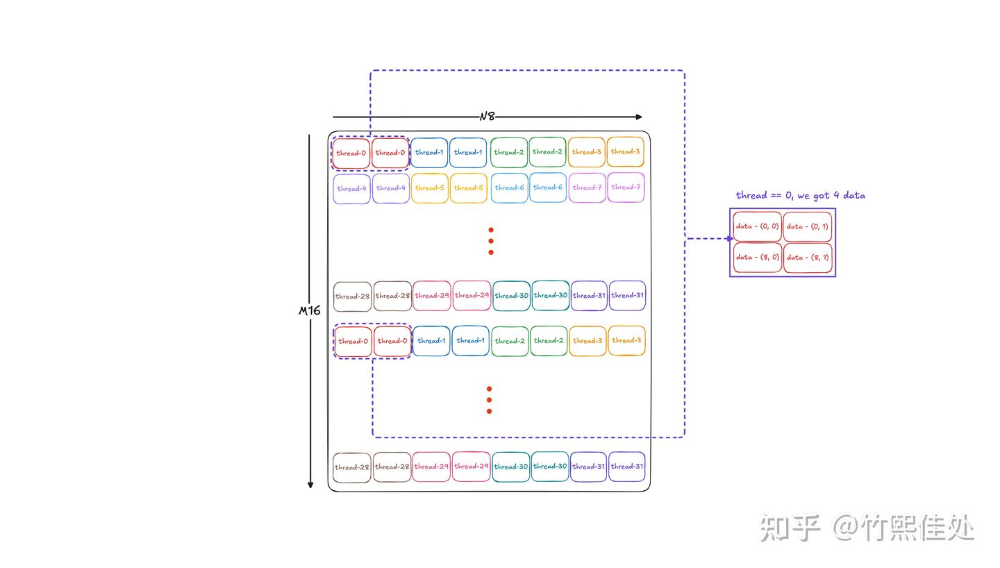
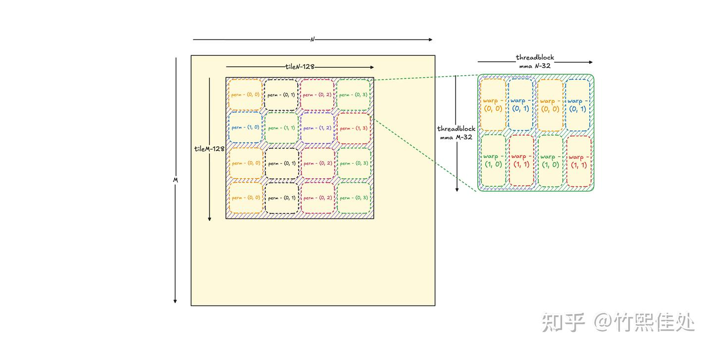
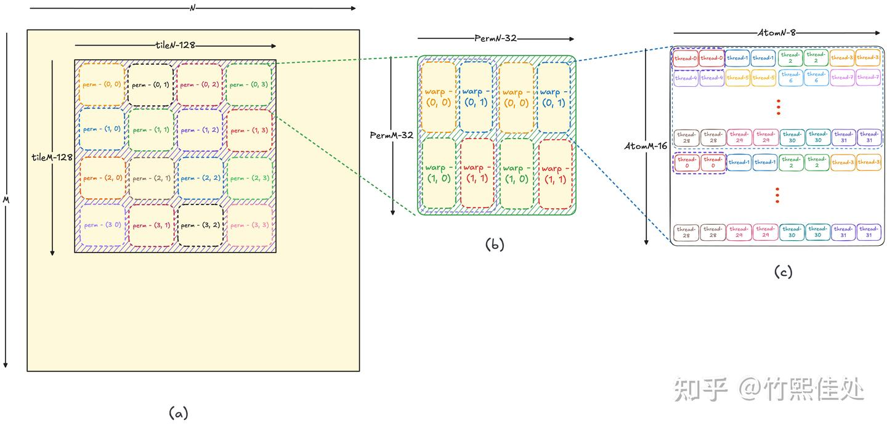
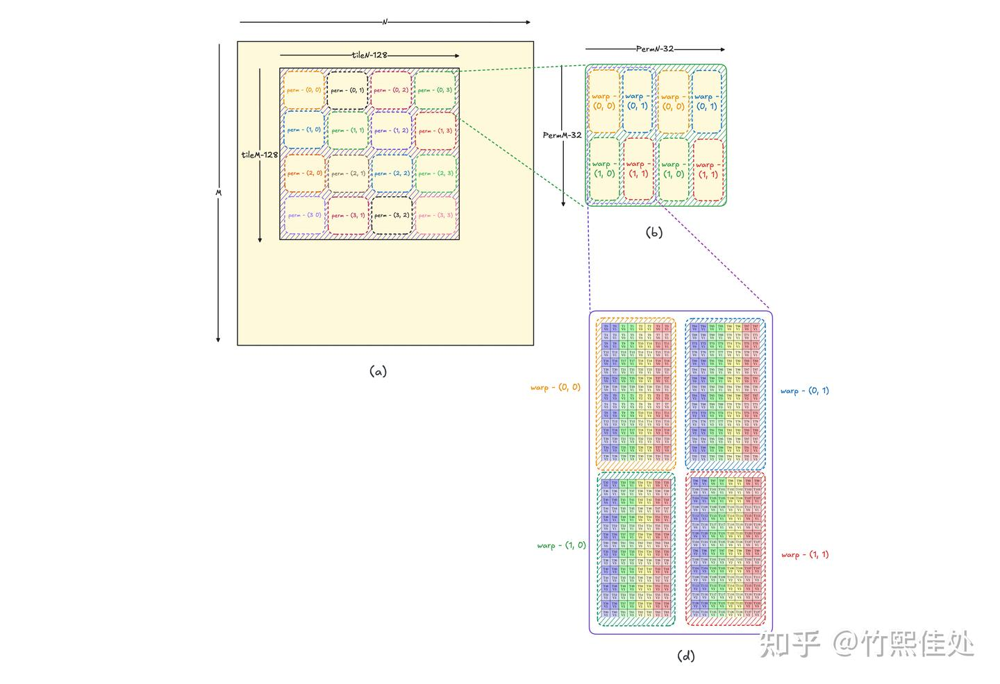
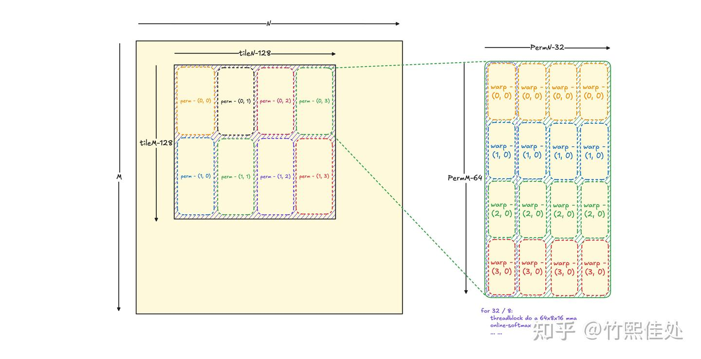
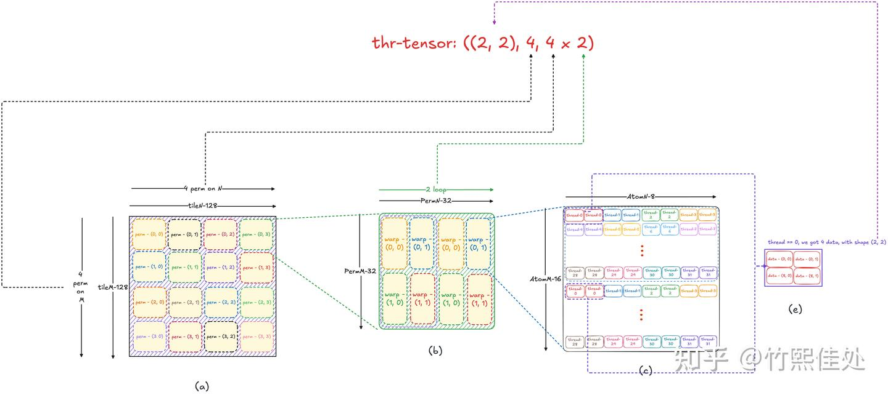

# 모두를 위한 CuTe 튜토리얼: Tiled MMA

> 원문: https://zhuanlan.zhihu.com/p/1937145378446226159

## 선행 지식

이전 글 [《모두를 위한 CuTe 튜토리얼: tiled copy》](../B03_cute_tiled_copy/README.md)에서 CuTe의 tiled copy 사용법을 소개하고 핵심 개념인 **TV-layout**을 도입했습니다. 본 글도 같은 개념이 필요하므로 간단히 복습:

- **CuTe 체계의 가장 핵심 개념: TV-layout**. 역할은 "**thread-id & value-id가 주어지면 반드시 한 데이터의 좌표를 찾을 수 있다**"(이 데이터는 tiled copy의 src/dst일 수도, 본 글 MMA의 입·출력 레지스터일 수도 있음)
- TV-layout의 입출력을 **inverse**하면 **MN-layout**. "데이터 위치 좌표 m-id & n-id가 주어지면 반드시 thread-id & value-id를 찾을 수 있다". 데이터 관점에서 thread가 어떤 데이터에 대응되는지 보일 때 사용

자세한 내용은 tiled copy 글 참고.

## 동기: CUDA 시각에서 이해하는 tiled mma

Tiled MMA는 CuTe에서 tiled copy와 함께 양대 핵심 컴포넌트로, **"Tensor Core를 올바르게 호출해 행렬 곱을 완성"** 하는 문제를 해결합니다.

전통적인 CUDA 코드에서 Tensor Core 호출은 보통 **`mma` 명령**으로 하며, 여러 thread가 협력 호출해야 합니다. 현재 널리 쓰이는 Ampere(sm80)의 `16x8x16 fp16 mma` 명령을 예로 들면, Tensor Core를 호출해 `m16n8k16` 행렬 곱 `C = A * B` 한 번을 완료합니다. 구체적으로 이 명령은 **warp 단위**로, warp 내 각 thread의 레지스터에서 A(16×16)·B(8×16)를 읽고 Tensor Core로 계산한 뒤 결과 C를 각 thread의 레지스터에 씁니다.

A/B/C 행렬 구성 시 **각 thread가 일부 데이터를 기여**하며, 올바른 결과를 내려면 각 thread가 어떤 부분을 기여하고 레지스터에 어떤 순서로 배치하는지 알아야 합니다. 16×8 C 행렬의 경우 필요한 데이터 배치는 그림 1처럼 됩니다.



한 걸음 더 — 방금은 warp 하나가 `16x8x16` mma 한 조각을 수행하는 것을 봤지만, 실제 시나리오에서 필요한 행렬 곱은 훨씬 큽니다. 예: `128x128x16`. 확장 방법:

- **병렬 차원**: threadblock 안에 여러 warp, 각 warp이 `16x8x16` mma 수행 → threadblock 레벨 mma 공동 완성
- **직렬 차원**: threadblock이 더 큰 mma를 위해 threadblock 레벨 mma를 여러 번 순차 실행

예를 들어, threadblock당 4 warp을 지정하고 행 방향 2·열 방향 2로 배치하면 `32x16x16` mma 한 번 완성. 실제 원하는 tiled mma가 `128x128x16`이라면, 이 threadblock을 행 방향 4회·열 방향 8회 반복. 추가로 **threadblock이 한 번에 처리하는 데이터가 열 방향으로 크면 대용량 접근에 유리**하므로 8을 2×4로 분해해 threadblock은 한 번에 `32x32x16` mma를 처리하고 열 방향 4회 반복하도록 합니다. 이것이 tiled mma가 하는 일. 그림 2로 요약:



mma 명령의 **thread-data 대응은 자명하지 않습니다**. 다른 mma 명령(더 작은 fp16 16x8x8, int8 16x8x32 등)을 호출할 때마다 PTX 매뉴얼에서 해당 데이터 배치를 찾아 레지스터를 올바로 할당해야 합니다. 추가로 그림 2의 M·N 방향 threadblock mma 루프도 좌표 계산의 디테일에 개발자를 빠뜨리기 쉽습니다.

또한 CUDA + PTX로 mma 호출은 **아키텍처 업데이트 시 Tensor Core 데이터 배치가 크게 변할 수 있는 잠재 위험**이 있습니다(예: Volta와 Ampere의 배치가 다름). 많은 코드 재작성 필요. NVIDIA 내부 cuBLAS 개발자들도 이 고통 때문에 **다양한 Tensor Core 명령과 대응 thread-data 매핑을 포괄하는 표현 체계인 CuTe**를 구축하기 시작했을 것으로 추측합니다.

따라서 CuTe가 tiled mma를 캡슐화하는 동기는 "**임의의 mma 명령이 주어졌을 때, data tile에서 각 thread가 필요로 하는 부분을 편하게 유도해 올바르게 mma를 호출**"하는 것입니다. 이 관점에서 tiled mma의 사용법과 구현 세부를 정리합니다.

## CuTe Tiled MMA 사용

먼저 CuTe의 tiled mma 정의 간단 예제를 보고 주요 모듈을 설명. tiled mma에 집중하기 위해 tiled copy는 도입하지 않고 g2r/r2g 데이터 이동은 일반 copy로 처리합니다(연습: tiled copy 없이도 copy 명령이 어떻게 필요한 데이터를 찾는가? 힌트: TV-layout 관점에서 생각).

```cpp
template <int kTileM, int kTileN, int kTileK>
__global__ void my_tiled_mma(__half *Cptr, const __half *Aptr,
                             const __half *Bptr, int m, int n, int k) {

  int tid_in_block = threadIdx.x;
  int i_tile_n = blockIdx.x;
  int i_tile_m = blockIdx.y;

  Tensor A = make_tensor(make_gmem_ptr(Aptr), make_shape(m, k),
                         make_stride(k, Int<1>{}));
  Tensor B = make_tensor(make_gmem_ptr(Bptr), make_shape(n, k),
                         make_stride(k, Int<1>{}));
  Tensor C = make_tensor(make_gmem_ptr(Cptr), make_shape(m, n),
                         make_stride(n, Int<1>{}));

  Tensor gA = local_tile(A, make_tile(Int<kTileM>{}, Int<kTileK>{}),
                         make_coord(i_tile_m, _));
  Tensor gB = local_tile(B, make_tile(Int<kTileN>{}, Int<kTileK>{}),
                         make_coord(i_tile_n, _));
  Tensor gC = local_tile(C, make_tile(Int<kTileM>{}, Int<kTileN>{}),
                         make_coord(i_tile_m, i_tile_n));

  // 0. tiled mma 구성
  using mma_op = SM80_16x8x16_F16F16F16F16_TN;
  using mma_traits = MMA_Traits<mma_op>;
  using mma_atom = MMA_Atom<mma_traits>;

  static constexpr int kMmaEURepeatM = 2;
  static constexpr int kMmaEURepeatN = 2;
  static constexpr int kMmaEURepeatK = 1;

  using mma_atom_shape = mma_traits::Shape_MNK;
  static constexpr int kMmaPM = 32; // 32
  static constexpr int kMmaPN = 32; // 32
  static constexpr int kMmaPK = 16; // 16

  using MMA_EU_RepeatT = decltype(make_layout(make_shape(
      Int<kMmaEURepeatM>{}, Int<kMmaEURepeatN>{}, Int<kMmaEURepeatK>{})));
  using MMA_P_T = Tile<Int<kMmaPM>, Int<kMmaPN>, Int<kMmaPK>>;

  using MMA = decltype(make_tiled_mma(mma_atom{}, MMA_EU_RepeatT{}, MMA_P_T{}));

  MMA tiled_mma;

  // 1. tiled mma partition
  auto thr_mma = tiled_mma.get_slice(tid_in_block);
  auto trA = thr_mma.partition_fragment_A(gA(_, _, 0));
  auto tgA = thr_mma.partition_A(gA(_, _, 0));

  auto trB = thr_mma.partition_fragment_B(gB(_, _, 0));
  auto tgB = thr_mma.partition_B(gB(_, _, 0));

  auto trC = thr_mma.partition_fragment_C(gC);
  auto tgC = thr_mma.partition_C(gC);

  cute::copy(tgA, trA);
  cute::copy(tgB, trB);

  // 2. gemm 실행
  cute::gemm(tiled_mma, trA, trB, trC);

  cute::copy(trC, tgC);
}
```

## Tiled MMA 구성

```cpp
using mma_op = SM80_16x8x16_F32F16F16F32_TN;
using mma_traits = MMA_Traits<mma_op>;
using mma_atom = MMA_Atom<mma_traits>;

static constexpr int kMmaEURepeatM = 2; // 2-M-warp
static constexpr int kMmaEURepeatN = 2; // 2-N-warp
static constexpr int kMmaEURepeatK = 1; // always 1

static constexpr int kMmaPM = 32; // Perm-M
static constexpr int kMmaPN = 32; // Perm-N
static constexpr int kMmaPK = 16; // always 16 when using 16x8x16 mma op

using MMA_EU_RepeatT = decltype(make_layout(make_shape(
      Int<kMmaEURepeatM>{}, Int<kMmaEURepeatN>{}, Int<kMmaEURepeatK>{})));
using MMA_P_T = Tile<Int<kMmaPM>, Int<kMmaPN>, Int<kMmaPK>>;

using MMA = decltype(make_tiled_mma(mma_atom{}, MMA_EU_RepeatT{}, MMA_P_T{}));
```

tiled_copy와 마찬가지로 세 원소로 구성됩니다.

- **mma_atom**: 어떤 mma 명령(16x8x16 fp16, 16x8x32 int8 등)을 쓸지, 그리고 이 명령 한 번에 필요한 **atom-TV-layout**
- **EU-layout**: EU = **execute unit**. 아키텍처에 따라 **1/4-warp(sm70) / warp(sm80) / warp-group(sm90)**. 한 mma 명령 실행에 필요한 실행기 입도. CuTe 구현은 `EU_layout`과 mma atom의 threads layout을 `tiled_product`하여 실행기 layout을 구체 thread layout으로 변환
- **permutation**: 한 threadblock이 수행 가능한 **mma 블록 크기 지정**. Tiled mma는 이 permutation 블록을 M·N 방향으로 여러 번 반복. permutation 내부는 여러 mma op 결과의 조합이며, **내층은 EU-layout 따른 병렬**, **외층은 EU별로 명령을 직렬 반복**

Tile → permutation → atom 관계는 그림 3:



`cute::print_latex`로 구축한 tiled mma를 출력해 그림 4처럼 확인. 이는 사실 **MN-layout**(행렬 좌표 (M-id, N-id) → T-id, V-id) 출력이며, thread-data 매핑을 직관적으로 이해하는 데 유용합니다.



다른 예로 FlashAttention v2의 QK 행렬 곱은 **같은 행 데이터를 같은 warp에 두어 warp 내에서 softmax를 계산**하도록 EU-layout과 permutation을 설계해 warp을 세로로 배치합니다.

```cpp
using mma_op = SM80_16x8x16_F32F16F16F32_TN;
using mma_traits = MMA_Traits<mma_op>;
using mma_atom = MMA_Atom<mma_traits>;

static constexpr int kMmaEURepeatM = 4; // 4-M-warp
static constexpr int kMmaEURepeatN = 1; // 1-N-warp
static constexpr int kMmaEURepeatK = 1; // always 1

static constexpr int kMmaPM = 64; // Perm-M
static constexpr int kMmaPN = 32; // Perm-N
static constexpr int kMmaPK = 16; // always 16 when using 16x8x16 mma op

using MMA_EU_RepeatT = decltype(make_layout(make_shape(
      Int<kMmaEURepeatM>{}, Int<kMmaEURepeatN>{}, Int<kMmaEURepeatK>{})));
using MMA_P_T = Tile<Int<kMmaPM>, Int<kMmaPN>, Int<kMmaPK>>;

using MMA = decltype(make_tiled_mma(mma_atom{}, MMA_EU_RepeatT{}, MMA_P_T{}));
```

C 행렬의 tile → permutation 관계:



**의문**: EU-layout에 16×8 atom을 더한 것만으로도 mma 반복 tileM×tileN을 만들 수 있는데 왜 permutation이 필요한가? — 이유는 **한 permutation 블록이 후속 s2r/r2s tiled copy에서 통째로 참여**하기 때문입니다. 더 큰 대용량 copy(예: `ldsm.x4`)를 위해 permutation의 N은 보통 `warpN × 16`이지만 한 atom은 실제 `warpN × 8`뿐.

**왜 permutation이라는 이름?** 단순한 threadblock mma tile size라면 'tile'이라 부르면 되는데. 이유는 **고급 용법에서 tiled 내 여러 16x8x16 mma 명령이 계산하는 데이터 위치를 재배열**하고 싶을 때(예: warp이 여러 16x8x16 mma를 연속 수행), permutation의 stride 구성으로 이를 완성하기 때문. 그래서 "Permutation"입니다. 자세한 내용은 [심화편](../B08_cute_permutation_mnk/README.md)에서 다룹니다. 일반 시나리오에서는 **tile size**로 이해해도 좋습니다.

## Tiled MMA partition

Partition 목적은 **큰 tensor를 여러 작은 tensor로 쪼개 각 thread가 하나씩 소유**하게 하는 것. C 행렬 예시에서, 그림 1·2로부터 한 thread가 얻는 데이터는 **두 계층**:

1. 가장 원자적 16×8에서 얻는 4개 데이터
2. M·N 방향 루프로 생기는 여러 묶음

`tileM = 128, tileN = 128` 데이터를 partition하면 thr-tensor layout은 그림 6처럼:



실제 출력(`m=128, n=128, kTileM=kTileN=128`):

```
gC:  (_128,_128):(128,_1)
trC: ((_2,_2),_4,_8):((_1,_2),_4,_16)
tgC: ((_2,_2),_4,_8):((_1,1024),4096,_16)
```

## Tiled MMA gemm 실행

```cpp
cute::gemm(tiled_mma, trA, trB, trC);
```

실제로는 **mma 명령을 루프 호출**하는 것. `gemm` 함수는 threadblock 레벨 mma 여러 번으로 분해 가능. 즉 최소 `32x16x16` 하나를 threadblock에서 수행하고 다른 차원은 for 루프로 완성할 수 있습니다:

```cpp
#pragma unroll
for (auto i_m = 0; i_m < size<1>(trC); i_m += 1) {
#pragma unroll
  for (auto i_n = 0; i_n < size<2>(trC); i_n += 1) {
    cute::gemm(tiled_mma, trA(_, i_m, _), trB(_, i_n, _), trC(_, i_m, i_n));
  }
}
```

## Tiled MMA 확장: s2r / r2s Tiled copy

위 예에서는 tiled mma 집중을 위해 최적화 로직 대부분을 생략했습니다. 실전에서는 shared memory로 A/B tile을 놓는 등 더 많은 최적화가 필요하며 이는 tiled copy와 연결됩니다. **g2s/s2g tiled copy는 보통 T-layout과 V-layout을 직접 정의해 구성**하지만, mma 관련 **s2r/r2s tiled copy**에 필요한 TV-layout은 자명하지 않아 직접 정의가 어렵습니다.

다행히 **mma의 tv-layout은 mma 명령 지원뿐 아니라 s2r/r2s tiled copy 구축에도 쓸 수 있습니다**. mma에 대응하는 tv-layout(즉 r에 대응하는 tv-layout)을 이미 알고 있으므로, s2r/r2s copy atom에 숨겨진 `src-layout ↔ ref-layout ↔ dst-layout`의 대수 연산으로 **shared tensor의 tv-layout을 유도**할 수 있습니다. 따라서 shared tensor 각 위치에 어떤 값을 copy할지 알게 됩니다. mma와 copy의 콤보! 매우 정교한 설계입니다.

구성 예(C의 r2s):

```cpp
extern __shared__ T shm_data[];

T *Cshm = shm_data;
auto sC = make_tensor(make_smem_ptr(Cshm), SmemLayoutC{});
using SmemLayoutC = decltype(make_shape(Int<32>{}, Int<32>{}));
using R2SCopyAtomC = Copy_Atom<UniversalCopy<int>, cute::half_t>;

// tiled mma에서 r2s tiled copy 확장
auto r2s_tiled_copy_c = make_tiled_copy_C(R2SCopyAtomC{}, tiled_mma);
auto r2s_thr_copy_c = r2s_tiled_copy_c.get_slice(idx);
auto trC_r2s = r2s_thr_copy_c.retile_S(trC);
auto tsC_r2s = r2s_thr_copy_c.partition_D(sC);

cute::copy(r2s_tiled_copy_c, trC_r2s, tsC_r2s);

__syncthreads();
```

대부분은 일반 tiled copy와 동일하며, 유의해야 할 것은 **`retile_S`**: thr-tensor를 **reshape**하여 copy가 지원하는 형태로 변환합니다. 데이터 자체는 바뀌지 않습니다. 레지스터는 layout 변환 비용이 없는 연속 공간이라 자연스러운 설계입니다.

## 심화: CuTe Tiled MMA의 구현 세부

Tensor Core로 mma를 호출하는 과정 복기: 각 thread가 일부 데이터를 제공해 mma 명령을 호출하면 일부 데이터를 얻음. 즉 "각 thread가 어떤 A·B 데이터를 제공하고, 계산 후 어떤 C 데이터를 받는가". 더 구체적으로는 **thread id로 tile A/B/C의 일부 데이터를 가져오고 싶다** — 바로 **TV-layout**이 필요한 지점입니다. t-id & v-id → tileM×tileN 좌표 → 대응 데이터 → thr-tensor.

Tiled mma는 어떻게 TV-layout을 구축할까요? copy 때는 thread-layout·value-layout으로 구축했습니다. copy 시나리오는 thread-data 매핑이 이해하기 쉽지만, **mma의 복잡한 매핑에서는 어떤 thread-layout·value-layout을 product하면 적절한 TV-layout이 나올지 알기 어렵습니다**. 다행히 **mma 명령이 요구하는 TV-layout은 고정**입니다. mma 명령 한 번을 호출하면 warp 내 각 thread가 대응할 데이터가 이미 정해져 있기 때문.

따라서 **CuTe는 mma atom 안에 warp 하나의 atom-tv-layout을 포함시키고, 이를 반복해 전체 tiled data의 TV-layout을 획득**합니다. 사용자는 tiled copy처럼 thread layout과 value layout을 정할 필요 없고, 아키텍처별 mma tv layout 차이도 가려집니다. 매우 우아한 설계.

위를 이해하고 CuTe가 thr-tensor(partition 과정)를 구성하는 핵심 코드를 봅니다. 본질은 **입력 tensor의 MN layout을 layout divide로 mma-atom이 매핑할 수 있는 atom-MN-layout(AtomM, AtomN)까지 분해하고, atom-MN-layout을 atom-TV-layout으로 변환**해 전체 tensor의 TV-layout을 유도하는 것:

```cpp
template <class CTensor>
CUTE_HOST_DEVICE constexpr
auto
partition_C(CTensor&& ctensor) const
{
  auto thr_tensor = make_tensor(static_cast<CTensor&&>(ctensor).data(),
                                this->thrfrg_C(ctensor.layout()));

  auto thr_vmn = make_coord(get<0>(thr_vmnk_),
                            make_coord(get<1>(thr_vmnk_), get<2>(thr_vmnk_)));
  return thr_tensor(thr_vmn, make_coord(_, repeat<rank<1,1>(thr_tensor)>(_)));
}

// Tile a tensor or a layout from shape
//   (M,N,...)
// to shape
//   ((ThrV,(ThrM,ThrN)),(FrgV,(RestM,RestN,...)))
// where
//   ThrV:  The threads local to an MMA. layout<0>(ThrLayoutVMNK): ThrV -> thread_idx
//   ThrM:  The threads tiled in M.      layout<1>(ThrLayoutVMNK): ThrM -> thread_idx
//   ThrN:  The threads tiled in N.      layout<2>(ThrLayoutVMNK): ThrN -> thread_idx
//   FrgV:  The values local to an MMA.
//   RestM: The values tiled in M.
//   RestN: The values tiled in N.
template <class CTensor>
CUTE_HOST_DEVICE constexpr
auto
thrfrg_C(CTensor&& ctensor) const
{
  CUTE_STATIC_ASSERT_V(rank(ctensor) >= Int<2>{});
  // Reorder the tensor for the TiledAtom
  auto t_tile = make_tile(permutation_mnk<0>(),
                          permutation_mnk<1>());
  auto t_tensor = logical_divide(ctensor, t_tile);                 // (PermM,PermN)

  // Tile the tensor for the Atom
  auto c_tile = make_tile(make_layout(size<0>(AtomShape_MNK{})),
                          make_layout(size<1>(AtomShape_MNK{})));
  auto c_tensor = zipped_divide(t_tensor, c_tile);                 // ((AtomM,AtomN),(RestM,RestN))

  // Transform the Atom mode from (M,K) to (Thr,Val)
  auto tv_tensor = c_tensor.compose(AtomLayoutC_TV{},_);           // ((ThrV,FrgV),(RestM,RestN))

  // Tile the tensor for the C-threads
  auto thr_tile = make_tile(_,
                            make_tile(make_layout(size<1>(thr_layout_vmnk_)),
                                      make_layout(size<2>(thr_layout_vmnk_))));
  auto thr_tensor = zipped_divide(tv_tensor, thr_tile);            // ((ThrV,(ThrM,ThrN)),(FrgV,(RestM,RestN)))

  return thr_tensor;
}
```

원리를 이해하면 partition 전후 tensor의 layout도 자연스럽게 이해됩니다.

**왜 먼저 병렬 후 직렬 루프인가?** thread의 연속 배치는 데이터 로드에 친화적. 단일 warp 연속 배치만으로 결합 접근을 달성할 수 있지만, **threadblock 레벨 연속 배치**는 cache 속성을 더 향상시킵니다. 또한 Volta는 1/4-warp 단위 실행기라서, warp이 접근하는 데이터가 연속이도록 보장하려면 **실행기 배치를 먼저 병렬화**하는 것이 명백히 우수합니다.

마지막으로 주목할 점: **tiled mma 크기는 g2s/s2g tiled copy 크기와 일치하지 않아도 됩니다**. 예컨대 `64x64x16` tiled mma에 대응하는 tiled copy는 `128x128x16`일 수 있으며, 이후 두 방향에서 더 루프. 이렇게 설계한 이유는 **레지스터가 보통 희소 자원**이기 때문. 이를 통해 레지스터 동작을 더 자유롭게 제어 가능합니다. 예: C의 일부(64×64)를 계산해 shm에 먼저 출력하고, 같은 64×64 레지스터를 재사용해 다음 블록을 계산 → 레지스터 사용량 대폭 감소, tile size 확대 가능. 데이터 쓰기와 mma 계산의 병렬도 가능.

특별히, **tiled mma 정의 시 tileM/tileN/tileK를 고려하지 않고, threadblock이 처리할 수 있는 mma**(우리 예의 32x32x16)만 고려합니다. 다른 차원은 tensor partition 과정에서 divide로 얻습니다.

## 정리

본 글은 tiled mma의 기본 사용법을 정리했습니다. `make_tiled_mma`로 tiled mma 객체 구축, partition으로 thread-value 매핑. 구현 원리도 탐색 — 핵심은 여전히 **TV-layout**입니다. 나아가 tiled mma가 제공하는 TV-layout은 s2r/r2s copy에 필요한 TV-layout으로 변환 가능하므로, tiled mma에서 s2r/r2s tiled copy를 확장할 수 있습니다.

여기까지 **CuTe의 양대 축 tiled mma와 tiled copy**를 정리했습니다. 이 위에서 효율적 GEMM을 완성하는 것은 어렵지 않으며, 남은 것은 tileK for 루프와 load-compute-store 파이프라인 배치뿐. 구체 구현은 reed 선생의 [CuTe 고효율 GEMM 구현](https://zhuanlan.zhihu.com/p/667521327) 글과 [https://github.com/reed-lau/cute-gemm](https://github.com/reed-lau/cute-gemm) 참고를 권장합니다.

마지막으로, **CuTe의 모든 동작은 TV-layout을 중심으로 한 다양한 변환**(inverse, product, divide, composite 등)임을 점점 깨닫게 됩니다. 원리 수준에서 CuTe 설계 철학을 더 이해하려면(예: 왜 T-layout & V-layout의 raked_product가 TV-layout을 주는지, 왜 TV-layout inverse가 MN-layout이 되는지) **layout 대수 로직 이해가 불가피**합니다. 다음 글에서 이 대수 로직이 무엇이고 그 설계 동기는 무엇인지 탐색합니다.
