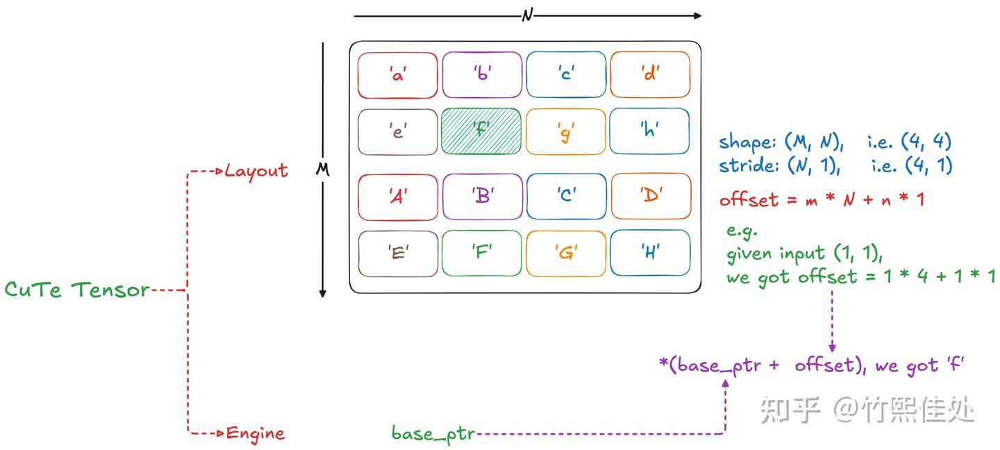
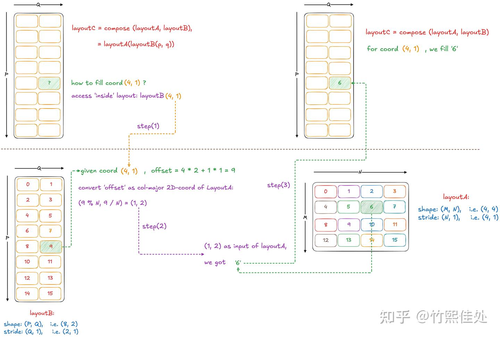
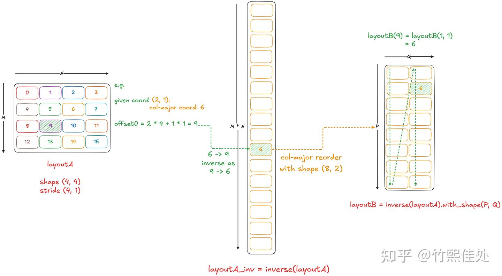
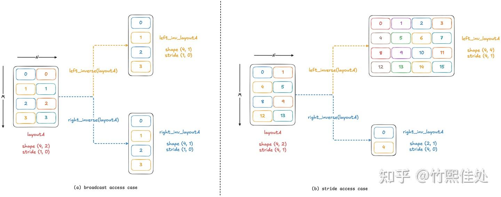

# 모두를 위한 CuTe 튜토리얼: Layout Compose & Inverse

> 원문: https://zhuanlan.zhihu.com/p/1962625273636845008

## 동기

이전 두 글에서 CuTe의 양대 모듈 [tiled copy](../B03_cute_tiled_copy/README.md)와 [tiled mma](../B04_cute_tiled_mma/README.md), 그리고 대응하는 thread-value 매핑을 정리했습니다. 이 두 모듈만으로도 Tensor Core를 호출해 행렬 계산 플로우를 완성할 수 있습니다. 그러나 **단순히 이 함수들을 사용하는 것만으로는 고성능 커스텀 CuTe 커널을 만들 수 없습니다**.

예를 들어 FlashAttention v2/v3에서 `Q @ K.T` 결과 S는 먼저 **online softmax**로 P가 되고, 이어서 `P @ V`가 수행됩니다. P의 데이터 분포는 mma-C 행렬에 따라 배열되는데, 곧바로 이어지는 `P @ V`는 P가 mma의 입력으로 **mma-A 행렬의 데이터 분포**를 따르도록 요구합니다. 즉 **layout을 변환**해 원하는 형태로 데이터가 배열되도록 해야 `cute::gemm` 같은 인터페이스의 요구를 충족할 수 있습니다.

다른 예로, w4a8 혼합 정밀도 GEMM에서는 로드 데이터(int4)와 실제 계산용 데이터 타입(int8/fp8)이 다르므로 로드 후 layout 변환이 필요합니다. 2:4 sparse GEMM, implicit im2col GEMM 등도 layout 변환에 대한 이해가 필요합니다.

더 근본적으로, CuTe의 모든 상위 인터페이스(`make_tiled_copy`·`make_tiled_mma`·`partition`·`retile` 등)는 **모두 layout 변환**에 기반합니다. 이 로직을 알면 CuTe를 더 자유롭게 쓸 수 있을 뿐 아니라, 이 대수 체계를 임의의 GPU형 칩으로 이식할 잠재력이 있습니다. 예컨대 @摇광 은 CuTe에 AMD GPU용 copy traits & op를 추가했습니다.

국내 칩이 이 체계로 CUTLASS 템플릿을 개발할 수 있을까요? 가능하다고 봅니다. NVIDIA GPU의 세대별 진화를 보면, Hopper의 wgmma에서 Blackwell의 umma로 가며 **Tensor Core와 CUDA Core를 점점 더 독립적·비동기 단위로 사용**하는 방향이 관찰되는데, 이는 국내 NPU + vector core 전략과 유사한 흐름입니다. NVIDIA의 역대 칩이 CuTe 체계 아래 잘 적응하는 것은 "천하를 통일하여 만상을 포괄"하는 기세. 국내 칩은 어디까지 적응할 수 있을까요? CuTe layout 대수의 원리를 더 깊이 이해해야만 답할 수 있습니다.

이제 CuTe에서 가장 신비로운 **layout 대수**를 탐험합시다. 그러나 안심하세요. 많은 거시 물리 현상이 결국 뉴턴 3법칙으로 환원되듯, **거대한 CUTLASS 코드 규모에 담긴 layout 대수는 고등학교 수준 수학 지식만으로도 이해 가능**합니다.

## Layout의 정의와 역할

NV GPU의 GEMM 커널은 Tile 데이터에 읽기·쓰기를 자주 하며, 데이터 접근은 **base ptr + 위치 오프셋**으로 이루어집니다. 따라서 가장 기본적인 layout은 "논리적 `(x, y)` 좌표를 물리 포인터 오프셋으로 전환하는" 문제를 풀기 위해 등장했습니다.

**Layout 정의**: shape와 stride로 구성, 입력 `(x, y)`가 주어지면 1D 값 offset을 얻음. **본질적으로 함수**로 이해할 수 있으며, 이 함수의 계산은 정수 곱과 합만. 파라미터는 주어진 shape·stride, 계산은 **좌표와 stride의 대응 위치 곱 · 합**.

일반성을 잃지 않기 위해 CuTe는 `base_ptr`처럼 오프셋으로 데이터 접근이 가능한 실체를 **Engine**(C++의 iterator와 유사)이라 부릅니다. Tensor / Engine / Layout의 관계와 역할은 그림 1:



Layout이 함수이므로, 고등학교 수학의 함수 기본 연산으로 layout 대수를 이해할 수 있습니다.

## Layout의 복합 compose

함수 복합 정의 복습: $y = f(x)$와 $z = g(y)$가 주어지면 $g \circ f$는 두 번의 연속 매핑 $(x \to y \to z)$, 즉 $z = g(f(x))$.

Layout에 대해 같은 방식:

- layoutA: $(m, n) \to \text{offset}_0$
- layoutB: $(p, q) \to \text{offset}_1$
- $\text{layoutC} = \text{compose}(\text{layoutA}, \text{layoutB}) = \text{layoutA}(\text{layoutB})$

내층 layoutB의 입력 $(p, q)$가 주어지면, $\text{offset}_0 = p \cdot s_p + q \cdot s_q$를 계산(layoutB의 stride). 다음은 $\text{offset}_0$을 layoutA의 입력으로 전달해야 하는데, layoutA 입력은 2D `(m, n)`이어야 합니다. 어떻게?

여기서 초심자가 혼란에 빠지는 포인트: **CuTe의 약간 반직관적인 핵심 사실** — "임의 차원 layout의 입력은 항상 1D 좌표와 호환되며, 이 1D 좌표는 해당 layout의 shape에 따라 **col-major** 방식으로 다차원 좌표로 변환되고 **stride와 무관**".

layoutA의 shape `(M, N)`을 예로:

- 1D 좌표 $\text{offset}_0$ → 2D: $m = \text{offset}_0 \% M$, $n = \text{offset}_0 / M$
- 변환된 $(m, n)$을 layoutA에 입력하여 $\text{offset}_1 = m \cdot s_m + n \cdot s_n$

전체 compose 과정은 그림 2:



실제 코드로 검증:

```cpp
auto layoutA = make_layout(make_shape(4, 4), make_stride(4, 1));
auto layoutB = make_layout(make_shape(8, 2), make_stride(2, 1));
auto layoutC = composition(layoutA, layoutB);

if (cute::thread0()) {
  print_latex(layoutA); print("\n"); // % Layout: (4,4):(4,1)
  print_latex(layoutB); print("\n"); // % Layout: (8,2):(2,1)
  print_latex(layoutC); print("\n"); // % Layout: ((2,4),(2,1)):((8,1),(4,1))
}
```

Compose의 의미가 "연속 매핑"임을 이해하면, layoutC의 입력이 layoutB에서 오므로 **최종 출력 개수는 layoutB의 것과 같다**는 점이 명확합니다. 따라서 layoutC의 shape 형태는 layoutB와 같지만 stride는 기묘해지고, shape 차원 분해로 stride를 매치해야 할 수 있습니다. 위 변환 후 layoutC는 `((2,4),(2,1)):((8,1),(4,1))` 형태.

**Layout compose의 쓰임**은 많습니다.

**예 1: TV-layout의 실제 주소 변환**. [tiled copy 글](../B03_cute_tiled_copy/README.md)에서 언급한 TV-layout은 `(t-id, v-id) → (m-id, n-id)`인데, 여기서 `(m-id, n-id)`는 논리적 좌표일 뿐. 실제 물리 주소를 얻으려면 tensor 본체의 layout을 도입해 $(m\text{-id}, n\text{-id}) \to \text{offset} = m \cdot s_m + n \cdot s_n$ 변환이 필요합니다. Tensor의 layout은 $(m, n) \to \text{global offset}$이므로, **`compose(tensor.layout(), tv-layout)`** 로 각 thread가 자신의 데이터를 찾을 수 있습니다. 숨은 매핑: $(t, v) \to (m, n) \to \text{global/shared offset}$.

이 설계의 이점:

- Layout 변환 시 **좌표 공간만 고려** 가능
- 실제 사용에서 **같은 `(m-id, n-id)`** 로 global/shared/reg tensor에 올바르게 접근할 수 있도록 다른 tensor layout을 compose — 현실 문제와 분리해 함수 분석 후 결과를 다시 현실에 적용하는 것과 같음

**예 2: Swizzle compose**(g2s copy 시 bank conflict 회피). naive CUDA에서 swizzle을 도입하면 읽어온 global data를 shared의 어느 위치에 둘지 신경써야 하지만, **layout compose를 도입하면 swizzle 후에도 정상 `(m-id, n-id)` 좌표 체계로 올바른 데이터에 접근**할 수 있습니다. 실제 물리 주소는 바뀌지만 신경 쓸 필요 없습니다.

Swizzle은 $\text{offset} \to \text{offset}'$ 매핑. shm tensor에 swizzle을 적용한 숨은 매핑은 $(m, n) \to \text{offset} \to \text{offset}'$. 따라서 swizzle을 **A-layout**으로 compose:

```cpp
static constexpr int kSwizzleB = 3;
static constexpr int kSwizzleM = 3;
static constexpr int kSwizzleS = 3;
using SmemLayoutAtomC = decltype(composition(
    Swizzle<kSwizzleB, kSwizzleM, kSwizzleS>{},
    make_layout(make_shape(Int<8>{}, Int<64>{}),
                make_stride(Int<64>{}, Int<1>{}))));
```

Swizzle의 BMS 세 파라미터 의미·채우는 법은 분량을 요하므로, 기본 원리·자동 추론 코드를 다룬 글([《布局代数实战：Swizzle 自动推导》](https://zhuanlan.zhihu.com/p/1941306442683515068), @melonedo)을 추천하고 후속 글에서 다시 정리합니다.

## Layout의 역 inverse

함수 역 정의 복습: $y = f(x)$의 역함수 $g$는 $f$의 출력 $y$에서 입력 $x$를 얻음, $x = g(y)$. Layout의 inverse는 입력·출력을 **교환**하는 연산.

layoutA $(m, n) \to \text{offset}_0$의 inverse는 $\text{offset}_0$으로 $(m, n)$을 얻는 과정. $\text{offset}_0$을 **col-major로 새 다차원 좌표로 변환** 가능하므로 `offset → (p, q)` 관점의 새 매핑 구축이 가능합니다. 단 이 "view as `(p, q)`" 과정은 **`with_shape`** 연산이 필요하며 본질은 compose입니다. 예시는 그림 3:



코드:

```cpp
auto layoutA = make_layout(make_shape(_4{}, _4{}), make_stride(_4{}, _1{}));
auto layoutA_inv = left_inverse(layoutA);
auto layoutA_inv_with_shape = layoutA_inv.with_shape(make_shape(_8{}, _2{}));

if (cute::thread0()) {
  print_latex(layoutA); print("\n");
  print_latex(layoutA_inv); print("\n");
  print_latex(layoutA_inv_with_shape); print("\n");
}
```

관찰: inverse 다음엔 보통 `with_shape` 같은 추가 변환. 순수 inverse만으로도 layout(위의 `layoutA_inv`)을 얻지만 **shape이 중요하지 않은 "입출력 교환 집합"** 정도로 이해하면 됩니다. `with_shape`를 붙이면 col-major로 지정 shape에 배열됩니다. 실제 CuTe 코드에서 `with_shape(P, Q)`는 inverse 후 layout을 `(P, Q) : (1, P)` layout과 compose하는 것:

```cpp
template <class OtherShape>
CUTE_HOST_DEVICE constexpr
auto
with_shape(OtherShape const& shape) const {
  return composition(*this, make_layout(shape));
}
```

`with_shape` 외에 다른 layout을 compose하여 의미 있는 연산을 완성할 수도 있습니다. 실전 절에서 예를 봅니다.

의미를 이해했으니 CuTe 함수를 봅시다. **CuTe는 `left_inverse`와 `right_inverse` 두 함수를 제공**합니다. layout이 **일대일 매핑이고 연속**(모든 입력이 서로 다른 출력에 대응하고 출력 공간이 연속)이면 **left_inverse = right_inverse**. 실제 CuTe 코드에서 사용되는 inverse 대부분은 이 경우라 상호 대체 가능.

그러나 layout이 **일대일 아님**(여러 입력이 동일 출력 — broadcast 접근)이면 inverse는 정보 손실이 있고, **일대일이지만 출력 불연속**(stride 접근)이면 `right_inverse`는 첫 연속 출력만 inverse하고 `left_inverse`는 원 layout의 전체 출력→입력 매핑을 유지합니다. 보통 **left_inverse가 더 많은 정보 보존**.



**정리**: left inverse는 layout의 **모든 잠재 출력**(공역)에 대한 inverse, right inverse는 실제 출력 공간(치역)의 **연속 일부**에 대한 inverse.

비조밀·비연속 layout을 inverse할 때는 **목적을 명확히** 하고 left/right 선택. 또한 stride가 컴파일 타임 상수가 아니면 **`left_inverse`는 에러**를 내고 **`right_inverse`는 그 차원을 건너뜀**. 이 설계 의도는 아직 불명확하니 이해하는 분은 댓글 공유 환영.

본 글 서두에 중등 수학이면 충분하다 했지만, 수학 원리를 더 파고들고 싶은 독자를 위해 짧게:

- left/right inverse 개념은 **집합론**에서 유래
- 두 집합이 **전단사(bijection)** 이면 left inverse = right inverse
- **단사(injection)** 만 만족하면 left inverse만 존재
- **전사(surjection)** 만 만족하면 right inverse만 존재

집합의 역을 구하는 방법: **two-line notation → swap → 정렬**. 해외 대수 노트 참고. reed 선생도 layout 대수 소개에서 이 방법을 언급했습니다. CuTe의 inverse 구현에도 정렬이 포함된 이유가 이것입니다:

```cpp
template <class Shape, class Stride>
CUTE_HOST_DEVICE constexpr
auto
left_inverse(Layout<Shape,Stride> const& layout)
{
  // Flatten and filter shape-1
  auto clayout = coalesce(layout);
  auto lstride = wrap(clayout.stride());
  auto lshape  = wrap(clayout.shape());

  // Prefix product of the shape
  auto preprod_shape = cute::fold(lshape, cute::tuple<_1>{},
                                  [](auto c, auto vi) { return append(c, vi*back(c)); });

  // Sort by strides
  static_assert(is_static<decltype(lstride)>::value, "Left inverse requires static strides.");
  using Sorted = detail::SortByKey<decltype(lstride), tuple_seq<decltype(lstride)>>;
  auto sorted_seq = typename Sorted::val_type{};

  // ...
}
```

## Layout compose & Inverse 실전

저자가 CuTe를 처음 접했을 때 자주 혼란스러웠던 점: "이 layout 대수가 대체 왜 필요한가?" CuTe 공식 문서의 악명은 **전후 연결 없이 개념·대수 연산을 쏟아내고** 사용자가 방대한 코드베이스에서 직접 용법을 익히기를 기대하는 점에서 옵니다.

본 글은 "모두를 위한" 튜토리얼이므로 개념을 더 내놓기 전에, FlashAttention v2의 A-layout ↔ C-layout 전환 예제로 compose & inverse의 용법과 잠재력을 느껴봅시다.

FA v2는 핵심이 `P = Q @ K.T`와 `O = P @ V` 두 연쇄 행렬 곱(softmax는 단순화를 위해 무시). P는 QK의 출력이며 **mma accumulator tensor의 layout**을 따르고, PV의 입력으로 쓰일 때는 **mma A tensor의 layout**을 요구합니다. tiled mma에서 A와 C tensor의 layout이 다르므로 C를 A 입력으로 직접 `cute::gemm`에 전달하면 **컴파일 에러**. 어떻게 변환할까요?

`C = A @ B.T`, `D = C @ B.T` 같은 단순 연쇄 곱으로 예시:

```cpp
template <typename T, int kTileM, int kTileN, int kTileK, typename TiledMMA>
__global__ void simple_kernel(T *Cptr, const T *Aptr, const T *Bptr, int m,
                              int n, int k) {

  Tensor A = make_tensor(make_gmem_ptr(Aptr), make_shape(m, k),
                         make_stride(k, Int<1>{}));
  Tensor B = make_tensor(make_gmem_ptr(Bptr), make_shape(n, k),
                         make_stride(k, Int<1>{}));
  Tensor C = make_tensor(make_gmem_ptr(Cptr), make_shape(m, n),
                         make_stride(n, Int<1>{}));

  int ix = blockIdx.x;
  int iy = blockIdx.y;

  Tensor gA = local_tile(A, make_tile(Int<kTileM>{}, Int<kTileK>{}), make_coord(iy, _));
  Tensor gB = local_tile(B, make_tile(Int<kTileN>{}, Int<kTileK>{}), make_coord(ix, _));
  Tensor gC = local_tile(C, make_tile(Int<kTileM>{}, Int<kTileN>{}), make_coord(iy, ix));

  TiledMMA tiled_mma;
  auto thr_mma = tiled_mma.get_slice(threadIdx.x);
  auto tgA_g2r = thr_mma.partition_A(gA);
  auto tgB_g2r = thr_mma.partition_B(gB);
  auto tgC_g2r = thr_mma.partition_C(gC);

  auto trA_mma = thr_mma.partition_fragment_A(gA(_, _, 0));
  auto trB_mma = thr_mma.partition_fragment_B(gB(_, _, 0));
  auto trC_mma = thr_mma.partition_fragment_C(gC(_, _));
  auto trD_mma = thr_mma.partition_fragment_C(gC(_, _));

  clear(trC_mma);
  clear(trD_mma);

  int num_tile_k = size<2>(gA);
#pragma unroll 1
  for (int itile = 0; itile < num_tile_k; ++itile) {
    cute::copy(tgA_g2r(_, _, _, itile), trA_mma);
    cute::copy(tgB_g2r(_, _, _, itile), trB_mma);

    // 먼저 C = A @ B.T 계산, OK
    cute::gemm(tiled_mma, trC_mma, trA_mma, trB_mma, trC_mma);

    auto trC_as_A_mma = trC_mma;

    // TODO: trC_mma는 ((2, 2), MMA_M, MMA_N) shape
    // 반면 trA_mma는 ((2, 2, 2), MMA_M, MMA_N / 2) shape 필요
    // layout 변환 필요 → 그대로 넣으면 컴파일 에러
    cute::gemm(tiled_mma, trD_mma, trC_as_A_mma, trB_mma, trD_mma);
  }
}
```

`16x8x16 fp16 mma atom` 기준으로 trC는 accumulator layout `((2, 2), MMA_M, MMA_N)`이고, 다음 gemm의 A-tensor로 쓰려면 `((2, 2, 2), MMA_M, MMA_N / 2)`여야 합니다. 데이터 자체는 동일하니 **layout 변환**이 필요합니다.

FA v2를 잘 아는 독자는 Tri-dao가 `logical_divide`로 **기하적 재배열**을 했음을 알 것입니다. 풀어보면:

```cpp
// tri-dao 방식: logical_divide
auto acc_layout_div = logical_divide(
    trC_mma.layout(),
    Shape<Underscore, Underscore, _2>{}); // ((2, 2), MMA_M, (2, MMA_N / 2)))
auto a_layout = make_layout(
    make_layout(get<0>(acc_layout_div), get<2, 0>(acc_layout_div)),
    get<1>(acc_layout_div), get<2, 1>(acc_layout_div));
// (((2, 2), 2), MMA_M, MMA_N / 2)
auto trC_as_A_mma = make_tensor(trC_mma.data(), a_layout);

cute::gemm(tiled_mma, trD_mma, trC_as_A_mma, trB_mma, trD_mma);
```

**그러나 reed 선생은 더 우아한 방법을 간파했습니다** — **inverse + compose**로 대수 변환:

- trC layout은 $(x_{acc}, y_{acc}) \to \text{offset}_0$ 매핑이며 연속·일대일 → `left_inverse`로 $\text{offset}_0 \to (x_{acc}, y_{acc})$ 매핑 획득
- $(x_a, y_a) \to \text{offset}_0$ 매핑(즉 trA layout)을 compose → $(x_a, y_a) \to \text{offset}_0 \to (x_{acc}, y_{acc})$
- 최종 목표는 trC 공간의 $\text{offset}_1$이므로 trC layout을 한 번 더 compose → $(x_a, y_a) \to \text{offset}_0 \to (x_{acc}, y_{acc}) \to \text{offset}_1$

코드:

```cpp
// reed 방식: layout-algebra
auto C_tensor_for_partition = make_tensor_like(gC(_, _));
auto trC_as_A_layout = thr_mma.partition_A(C_tensor_for_partition).layout();
auto trC_as_C_layout = thr_mma.partition_C(C_tensor_for_partition).layout();

auto acc_layout_inv = left_inverse(trC_as_C_layout);
// (x_acc, y_acc) -> offset0 => (sorted) offset0 -> (x_acc, y_acc)

auto a_layout_algebra = acc_layout_inv.compose(trC_as_A_layout);
// (x_a, y_a) -> offset0 -> (x_acc, y_acc)

// trC: (x_acc, y_acc) -> offset1, compose as B
auto trC_as_A_mma = trC_mma.compose(a_layout_algebra);
// (x_a, y_a) -> offset0 -> (x_acc, y_acc) -> offset1

cute::gemm(tiled_mma, trD_mma, trC_as_A_mma, trB_mma, trD_mma);
```

관심 있는 독자는 이 예제를 실행해 Tri-dao와 reed 두 방법의 결과를 검증하고, 다양한 mma 규격에서 테스트하여 **layout 대수가 주는 의미적 편의**를 체감해보세요.

## 결론

본 글은 CuTe layout 대수의 **compose**와 **inverse** 계산 과정·용법을 정리했습니다. 기본 사상은 **layout을 함수로 보는 것**. 그래서 함수의 compose & inverse 로직으로 CuTe 대수 체계를 이해할 수 있습니다.

FA v2의 A-C-layout 전환 예제로, 대수 방법이 **커스텀 layout 변환**을 가능케 해 CUTLASS 기성 기능에 국한되지 않고 **자유자재로 CuTe를 쓸 수 있음**을 보였습니다.

Layout 대수는 CUTLASS 공식 문서에서 늘 혼란스러운 존재였습니다. reed 선생의 지도를 받아도 본 글 구상 과정에서 저자 자신의 인식을 여러 차례 수정해야 했습니다. 온고지신의 즐거움이 이런 것. 이 사고 과정을 공유해 더 많은 분이 CuTe를 익히는 데 도움이 되기를 바랍니다.

다음 글에서는 layout 대수의 **product**와 **divide**를 다룹니다. 이 둘을 별도 장으로 분리한 이유는, 우리는 product·divide가 함수 관점보다는 **기하적 구성**에 더 가깝다고 보기 때문입니다.
