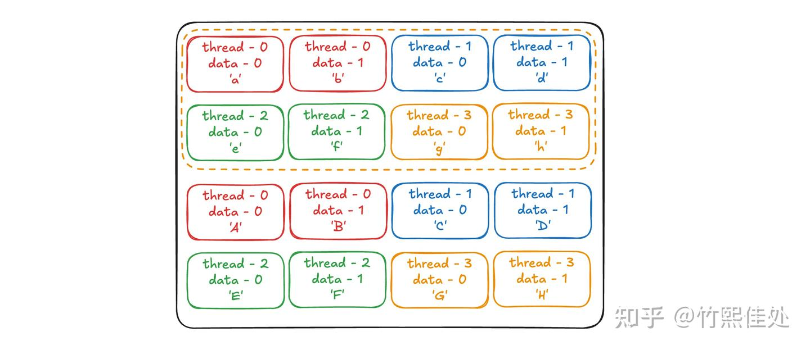
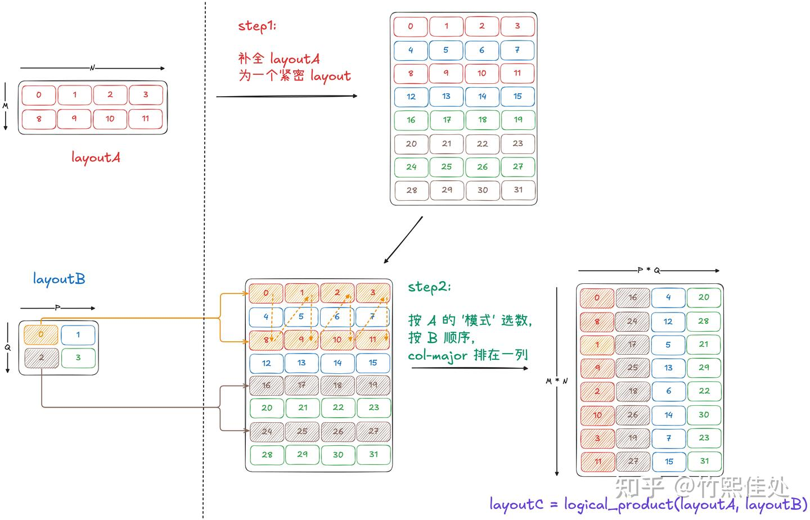
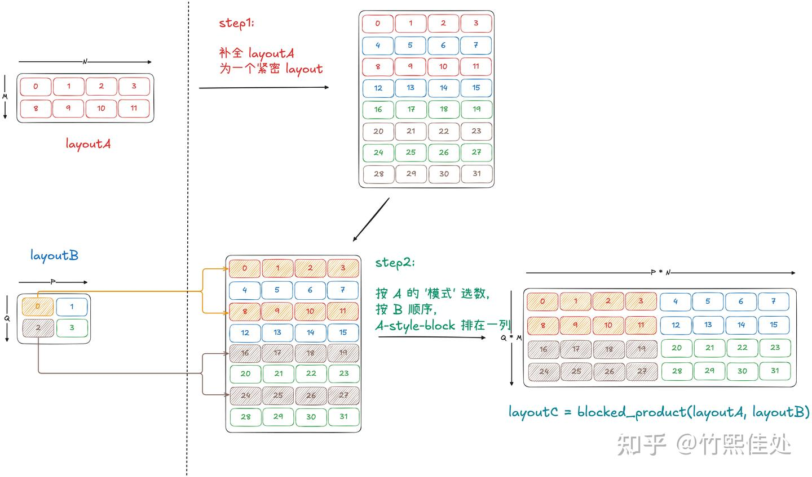
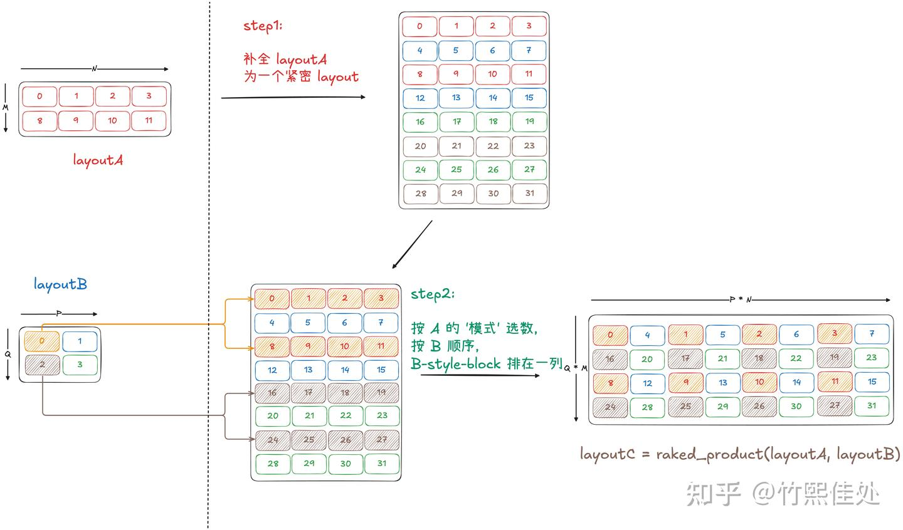
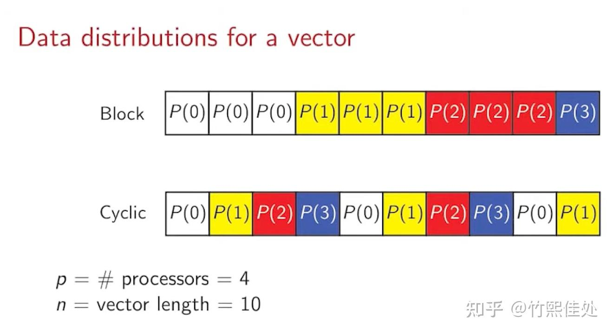
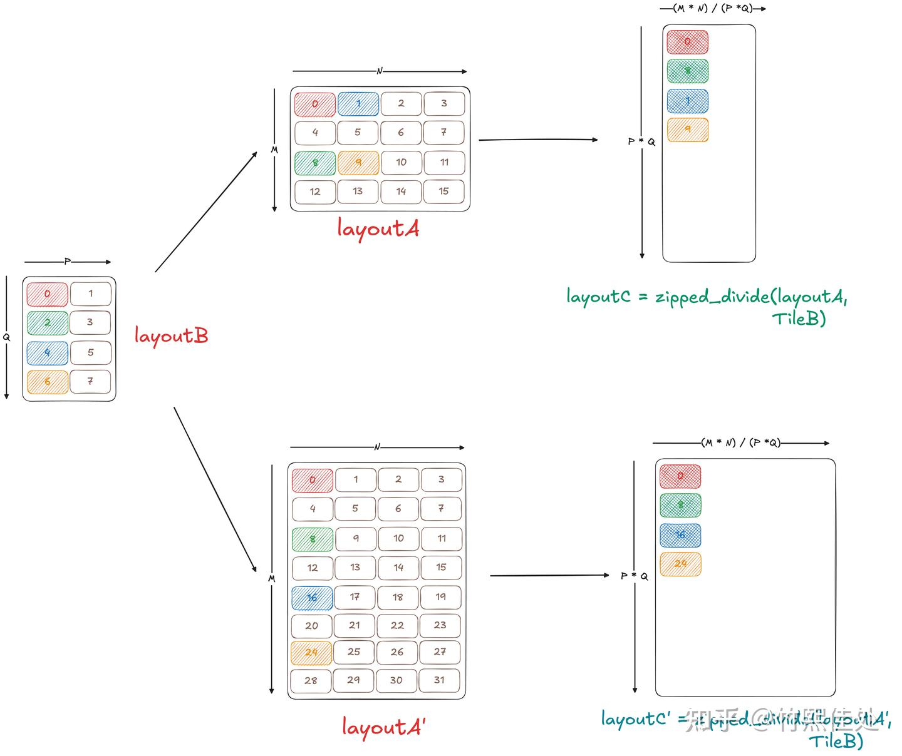
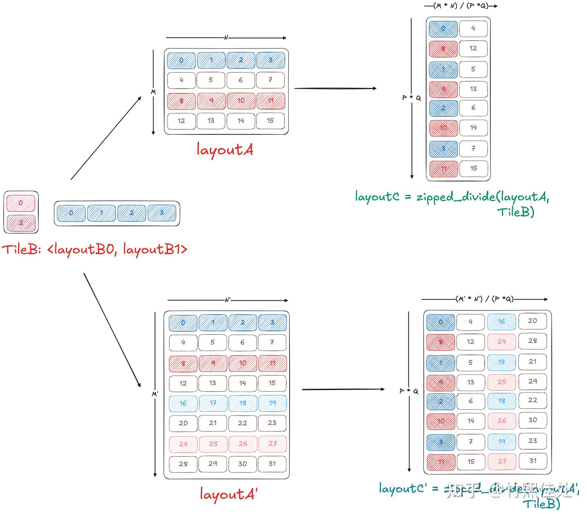
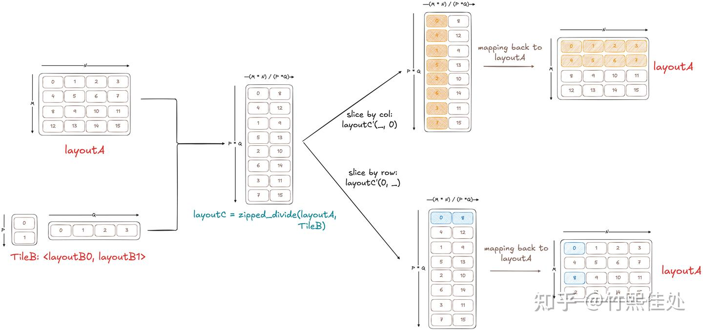

# 모두를 위한 CuTe 튜토리얼: Layout Product & Divide

> 원문: https://zhuanlan.zhihu.com/p/1971945267294111573

## 동기

이전 글에서 Layout의 두 대수 방법 [**Compose**와 **Inverse**](../B05_cute_layout_compose_inverse/README.md)를 정리했습니다. 본 글은 나머지 두 핵심 변환 **Product**와 **Divide**를 소개합니다.

CuTe가 Product·Divide를 도입한 목적은 무엇일까요? [Tiled Copy 글](../B03_cute_tiled_copy/README.md)에서 Thread와 Data의 매핑 관계를 구축해야 함을 언급했습니다. 4 thread block이 4×4 데이터 블록을 복사하는 예(그림 1):



tiled copy CUDA 커널 작성은 본질적으로 **Thread Block이 한 번에 접근하는 데이터 범위를 확정**하고, 이를 **반복 확장**하여 데이터 블록 전체를 빠짐없이 덮는 것입니다.

즉 우리는 "단일 Thread Block 접근 행동"을 어떤 "**패턴**"으로 **반복**합니다. 이 "반복" 행동은 Tiled Copy와 Tiled MMA에서 반복적으로 등장했으며, 우리는 CuTe의 중요한 관점을 언급했습니다: **"Atom 밖은 전부 반복"**.

"패턴"과 "반복" 개념을 CuTe Layout에 도입하면, **작은 Layout을 패턴으로 삼아 여러 번 반복해 더 큰 Layout을 형성**할 수 있습니다. 이것이 **Layout Product**.

Layout 확대뿐 아니라, 큰 Layout에서 **패턴대로 작은 Layout을 추출**하는 능력도 필요합니다. 예: 큰 데이터 블록에 접근할 때 각 Thread Block이 매 라운드에 접근할 데이터를 알아야 함. 즉 작은 Layout을 패턴으로 지정해 **큰 Layout을 분해**하는 것 — 이것이 **Layout Divide**.

CuTe 상위 함수(`partition`, `local_tile`, `tile_to_shape` 등)는 사실 모두 product·divide의 변형입니다. 나아가 `make_tiled_copy`·`make_tiled_mma` 같은 핵심 함수에서도 product & divide가 반복 사용되며, 이전 글의 compose & inverse와 함께 CuTe 체계의 다양한 대수 변환을 구성합니다.

Compose·inverse는 함수 복합·역함수 개념으로 이해할 수 있지만, **product·divide는 오히려 기하적 이해에 더 적합**합니다. 따라서 이후 설명은 이미지를 많이 활용해 CuTe에서 가장 설명하기 까다로운 이 두 변환을 직관적으로 다룹니다.

## Layout의 곱 Product

Product의 목적은 **Layout 확대**. 주어진:

$$\text{LayoutC} = \text{product}(\text{LayoutA}, \text{LayoutB})$$

계산 과정:

1. **A를 연속·조밀한 A′로 보완**
2. A의 "패턴"을 참조해 A′에서 일련의 layout 집합을 선택 — **A-like Layouts**
3. B를 **Col-Major** 방식으로 순회하며 얻는 offset 순서에 따라, A-like Layouts를 일정 규칙으로 배열해 **C를 형성**

"일정 규칙"은 CuTe의 `logical_product` / `blocked_product` / `raked_product` / `zipped_product` / `tile_product` 등 각 Product 함수가 정합니다.

예: 각 **A-like Layout을 C의 한 열**로 순서대로 배열하면 **`logical_product`**. 그림으로:



다른 Product 변형도 기본 의미는 동일하며, 최종 C 구성 시 shape·stride를 어떻게 뒤섞는지만 다릅니다. CUTLASS에서 자주 쓰이는 것들:

- **`blocked_product`**: A 보완·A-like Layouts 추출 과정은 logical_product와 같음. 마지막 C 구성 시 A-like Layouts를 한 열로 세우지 않고 **"block"으로 뭉쳐 모음**. 직관적 "layout 반복" 이미지와 잘 맞아 CUTLASS에서 폭넓게 사용.



- **`raked_product`**: blocked_product와 유사하지만, "block" 뭉칠 때 **B 형태에 가깝게 재배열**. "rake"(갈퀴)는 갈퀴 이빨 배치처럼 한 개씩 번갈아 놓인 느낌.



"Raked"라는 명명은 실제로는 **병렬 계산 이론의 cyclic 분포**에서 유래했습니다. 각 프로세서의 작업 수를 균등하게 맞추는 데 자주 쓰입니다:



Product는 **다차원 형태**도 지원:

$$\text{LayoutC} = \text{product}(\text{LayoutA}, (\text{LayoutB}_0, \text{LayoutB}_1, \ldots))$$

여기서 `(LayoutB_0, LayoutB_1, ...)`는 단일 layout이 아닌 여러 layout의 tuple로 **Tiler**라 불립니다. 이 형식으로 `B_i`들이 서로 독립. 다만 product에서는 실질 응용이 거의 없고 divide에서 더 많이 쓰입니다. CuTe 문서에 tiler 관련 product 함수가 있지만 CUTLASS에서는 실제 사용되지 않습니다. 엄밀함을 위해 차이 정리:

```
Layout Shape : (M, N, L, ...)
Tiler Shape  : <TileM, TileN>

logical_product : ((M,TileM), (N,TileN), L, ...)
zipped_product  : ((M,N), (TileM,TileN,L,...))
tiled_product   : ((M,N), TileM, TileN, L, ...)
flat_product    : (M, N, TileM, TileN, L, ...)
```

Layout Product를 돌아보면, **A layout의 패턴을 반복해 조밀 공간을 덮는** 과정입니다. 평소 CUDA 코드 작성과 매우 유사합니다. Tiled copy를 예로, thread block이 선택하는 data tile을 "패턴"으로 정하고 이를 반복해 전체 조밀 메모리 공간을 빠짐없이 덮어 모든 데이터 copy를 완성합니다.

## Product 용법: tile_to_shape

Product는 CUTLASS의 layout 구축에 널리 쓰입니다. blocked_product의 흔한 변형 **`tile_to_shape`**: blocked_product는 layoutA가 **몇 번 반복되는지**에 주목하고, tile_to_shape는 반복 후 **어느 shape에 도달할지**에 주목합니다.

```cpp
template <class Shape, class Stride,
          class TrgShape, class ModeOrder = LayoutLeft>
CUTE_HOST_DEVICE constexpr
auto
tile_to_shape(Layout<Shape,Stride> const& block,
              TrgShape             const& trg_shape,
              ModeOrder            const& ord_shape = {})
{
  CUTE_STATIC_ASSERT_V(rank(block) <= rank(trg_shape),
                       "Rank of layout must be <= rank of target shape.");
  constexpr int R = rank_v<TrgShape>;

  auto padded_block = append<R>(block);

  auto block_shape  = product_each(shape(padded_block));
  auto target_shape = product_each(shape(trg_shape));

  if constexpr (is_static<decltype(target_shape)>::value) {
    CUTE_STATIC_ASSERT_V(evenly_divides(target_shape, block_shape),
                         "tile_to_shape: block shape does not divide the target shape.");
  }

  auto product_shape = ceil_div(target_shape, block_shape);

  return blocked_product(padded_block, make_ordered_layout(product_shape, ord_shape));
}
```

`tile_to_shape`로 **작은 atom layout으로 목표 shape를 가득 채우는 큰 layout**을 얻을 수 있습니다. atom layout에 가한 변환이 반복으로 전체 layout에 퍼집니다. 예: shared memory swizzle:

```cpp
using SmemLayoutAtom = decltype(composition(
      Swizzle<kShmLoadSwizzleB, kShmLoadSwizzleM, kShmLoadSwizzleS>{},
      make_layout(make_shape(Int<8>{}, Int<64>{}),
                  make_stride(Int<64>{}, Int<1>{}))));
using SmemLayoutA = decltype(
      tile_to_shape(SmemLayoutAtom{},
                    make_shape(Int<128>{}, Int<64>{}, Int<kStage>{})));
```

`SmemLayoutAtom`에서 `tile_to_shape`로 큰 `SmemLayoutA` 구축. atom layout의 swizzle이 bank-conflict-free이면, product 확산으로 **전체 shared memory가 bank-conflict-free** 달성.

## Layout의 나눗셈 Divide

Product가 "패턴 반복으로 Layout 확대"라면, Divide는 "**패턴 선택으로 큰 Layout 분해**".

Tiled Copy 예시 재차: Product 예에서 Thread block이 담당하는 Layout을 반복해 더 큰 Layout을 덮을 수 있었습니다. Thread block 아래에서는 **각 Thread가 담당할 데이터 좌표**를 알아야 합니다. 이때 Thread block이 담당하는 Layout을 **분해**해야 합니다.

**Layout Divide 과정**: 분해 대상 LayoutA와 기반 패턴 LayoutB가 주어지면

$$\text{LayoutC} = \text{divide}(\text{LayoutA}, \text{LayoutB})$$

는 **A에서 B의 offset이 결정하는 B-like layouts**를 찾고, 이들을 조합해 C를 얻음으로써 **원본 A를 빠짐없이 분해**합니다.

**`logical_divide`** 과정 도식:


**참고**: A에 divide를 가해 얻는 C는 **A와 size가 같고**, 매핑 관계만 바뀝니다. 초등 수학의 `A / B`와 다르게 직관적으로 와닿지 않을 수 있는데, 정수 나눗셈에서 **몫과 제수를 모두 보존**하는 것에 비유하면 됩니다. 예: `10 / 5 = (5, 2)`.

Product와 마찬가지로 CuTe는 여러 divide 함수 정의: `logical_divide`, `zipped_divide`, `flat_divide`, `tile_divide`. 차이는 **마지막 B-like Layouts 선택·배열 방식**.

Product와 달리 divide는 1차원 형태보다 **다차원 형태**가 이해하기 쉽습니다. 다차원에서 LayoutB를 **Tiler**로 지정:

$$\text{LayoutC} = \text{divide}(\text{LayoutA}, (\text{LayoutB}_0, \text{LayoutB}_1, \ldots))$$

이 형식이면 **A의 Shape와 패턴을 완전히 탈결합** — 행·열에 어떤 패턴으로 데이터를 선택할지 진정으로 지정 가능.

왜 그럴까요? 비교:

1차원에서 A의 shape가 바뀌면 B를 같게 유지해도 B의 offset으로 찾는 B-like Layouts가 따라 변합니다 — 바라지 않는 결과. `zipped_divide`로 동일 B가 서로 다른 shape의 A·A′에 작용하면 결과가 달라짐(그림 5):



2차원으로 가면:

$$\text{LayoutC} = \text{divide}(\text{LayoutA}, \text{TilerB})$$

TilerB는 **독립적인 두 Layout의 tuple**:

$$\text{TilerB} = (\text{LayoutB}_0, \text{LayoutB}_1)$$

divide는 **A의 각 차원이 TilerB의 대응 LayoutB_i에 각각 divide**됩니다. TilerB 정의가 LayoutA의 shape에 영향받지 않으므로, **TilerB를 유지하고 shape가 다른 A·A′에 작용해도 선택 패턴이 일관됩니다**(그림 6):



**사용 관례**: **divide는 다차원(특히 2D)이 주로, product는 1차원이 주로** 쓰입니다.

다차원 divide 변형:

```
Layout Shape : (M, N, L, ...)
Tiler Shape  : <TileM, TileN>

logical_divide : ((TileM,RestM), (TileN,RestN), L, ...)
zipped_divide  : ((TileM,TileN), (RestM,RestN,L,...))
tiled_divide   : ((TileM,TileN), RestM, RestN, L, ...)
flat_divide    : (TileM, TileN, RestM, RestN, L, ...)
```

차이는 TilerB로 layoutA에서 데이터 선택하는 로직이 아니라, **최종 layoutC 구성 단계에서 shape 재배열·괄호 처리**입니다.

## Divide 용법: local_partition & local_tile

그림 6의 TilerB의 `(LayoutB_0, LayoutB_1)`을 조밀 layout 두 개로 설정하면, **`zipped_divide` 후 layoutC의 각 열은 layoutA의 연속 소블록**, **각 행은 layoutA 블록 내 같은 위치 원소**가 됩니다(그림 7):



CuTe를 써본 독자라면 친숙한 장면이 떠오를 것입니다 — **tiled copy의 `local_tile`과 `local_partition` 기능과 같은 것 아닌가?**

그렇습니다. 우연이 아니라, `local_tile`과 `local_partition`(내부적으로 `inner_partition`·`outer_partition`)의 구현을 보면 **핵심 데이터 재배열·분할 로직이 `zipped_divide`로 구현**되어 있습니다. divide의 유사 용법은 CuTe 코드 전반에 퍼져 있어 가장 많이 쓰이는 대수 변환이라 해도 과언이 아닙니다.

```cpp
// ...
local_tile(Tensor    && tensor,
           Tiler const& tiler,   // tiler to apply
           Coord const& coord)   // coord to slice into "remainder"
{
  return inner_partition(static_cast<Tensor&&>(tensor),
                         tiler,
                         coord);
}

// ...
inner_partition(Tensor    && tensor,
                Tiler const& tiler,
                Coord const& coord)
{
  auto tensor_tiled = zipped_divide(static_cast<Tensor&&>(tensor), tiler);
  constexpr int R0 = decltype(rank<0>(tensor_tiled))::value;
  // ...
}

// ...
local_partition(Tensor                     && tensor,
                Layout<LShape,LStride> const& tile,    // coord -> index
                Index                  const& index)   // index to slice for
{
  static_assert(is_integral<Index>::value);
  return outer_partition(static_cast<Tensor&&>(tensor),
                         product_each(shape(tile)),
                         tile.get_flat_coord(index));
}

// ...
outer_partition(Tensor    && tensor,
                Tiler const& tiler,
                Coord const& coord)
{
  auto tensor_tiled = zipped_divide(static_cast<Tensor&&>(tensor), tiler);
  constexpr int R1 = decltype(rank<1>(tensor_tiled))::value;
  // ...
}
```

## 정리

Layout 대수의 핵심 연산 **product와 divide**를 정리했습니다. 이전 글의 **compose와 inverse**와 합치면, 이 네 기본 연산이 **CuTe layout 대수의 핵심 골격**을 이룹니다.

CUTLASS 코드를 읽다 보면 layout 대수가 다양한 변형으로 반복 등장합니다. 본 글의 `tile_to_shape`·`local_partition`·`local_tile` 외에도, 실제 기능 함수는 대개 **여러 대수 변환의 조합**입니다. 예:

- **tiled copy**: `raked_product` + `inverse` + `compose` 결합
- **tiled mma**: 여러 `logical_divide`·`zipped_divide`·`compose`

이 기본 layout 대수 연산을 숙달하면 CuTe 사용이 능숙해지고, 융통을 얻으면 고성능 연산자 구현을 이해하는 여정에서 **"세상을 꿰뚫어 보는"** 능력을 각성하여, 복잡한 데이터 배치 뒤의 로직을 꿰뚫고 진정한 고성능 연산자 장인이 됩니다.

## 참고

- [모두를 위한 CuTe 튜토리얼: Layout compose & Inverse](../B05_cute_layout_compose_inverse/README.md)
- [모두를 위한 CuTe 튜토리얼: tiled copy](../B03_cute_tiled_copy/README.md)
- [모두를 위한 CuTe 튜토리얼: tiled mma](../B04_cute_tiled_mma/README.md)
- Professor Rob H. Bisseling, Utrecht University — https://www.youtube.com/watch?v=h3stm2nbHTk
